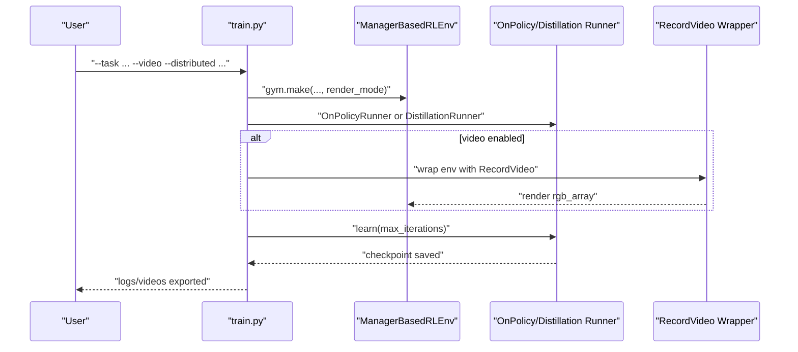
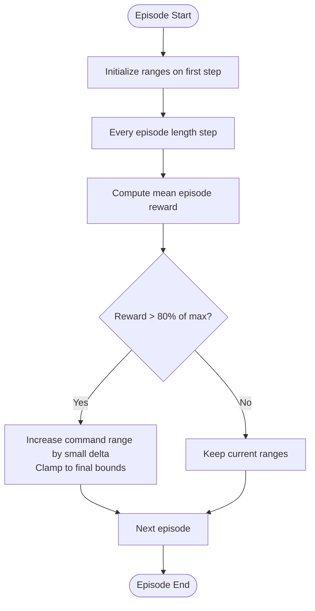
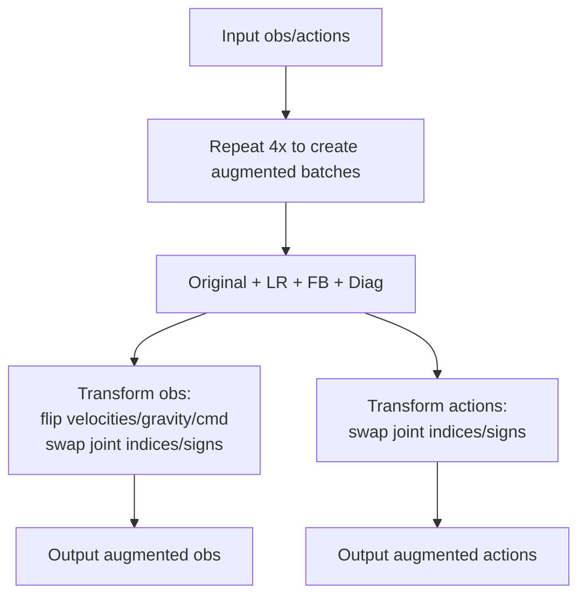
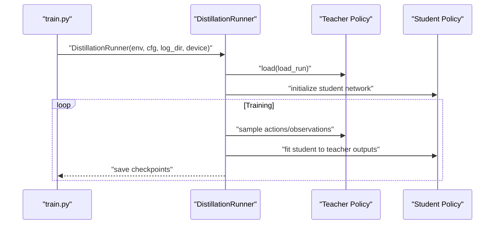
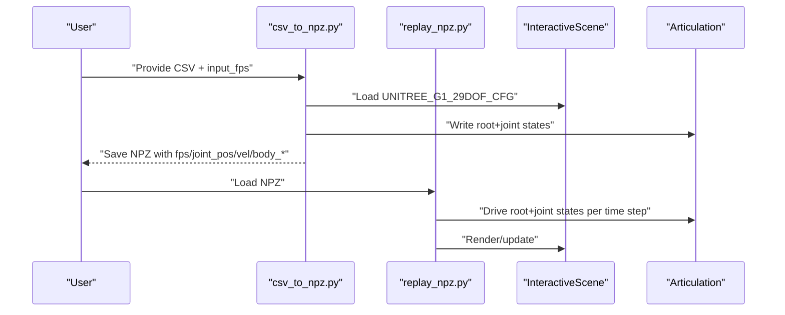
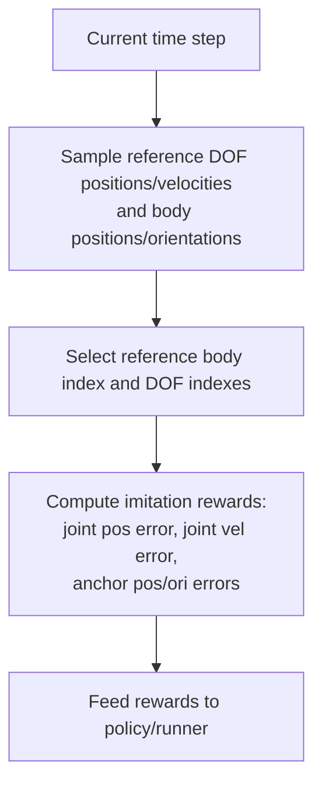
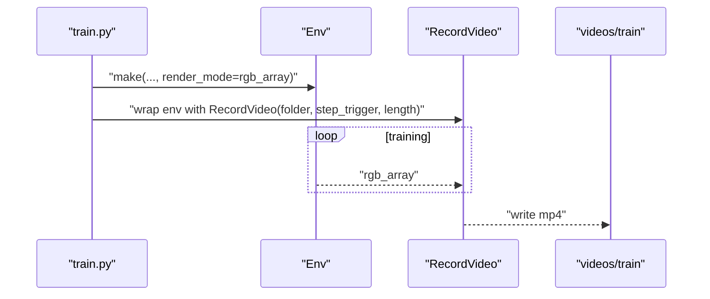
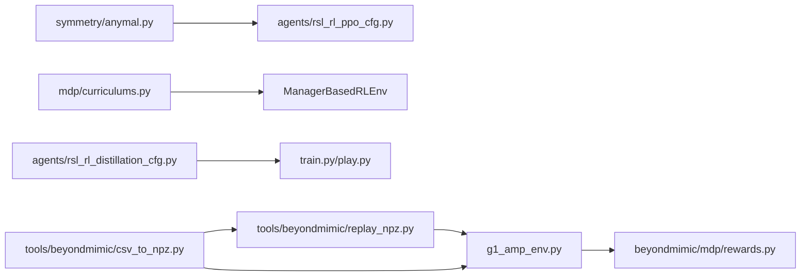

# Advanced Features

<cite>
**Referenced Files in This Document**
- [README.md](file://README.md)
- [train.py](file://scripts/reinforcement_learning/rsl_rl/train.py)
- [play.py](file://scripts/reinforcement_learning/rsl_rl/play.py)
- [curriculums.py](file://source/robot_lab/robot_lab/tasks/manager_based/locomotion/velocity/mdp/curriculums.py)
- [anymal.py](file://source/robot_lab/robot_lab/tasks/manager_based/locomotion/velocity/mdp/symmetry/anymal.py)
- [rsl_rl_ppo_cfg.py](file://source/robot_lab/robot_lab/tasks/manager_based/locomotion/velocity/config/quadruped/anymal_d/agents/rsl_rl_ppo_cfg.py)
- [rsl_rl_distillation_cfg.py](file://source/robot_lab/robot_lab/tasks/manager_based/locomotion/velocity/config/quadruped/anymal_d/agents/rsl_rl_distillation_cfg.py)
- [csv_to_npz.py](file://scripts/tools/beyondmimic/csv_to_npz.py)
- [replay_npz.py](file://scripts/tools/beyondmimic/replay_npz.py)
- [g1_amp_env.py](file://source/robot_lab/robot_lab/tasks/direct/g1_amp/g1_amp_env.py)
- [rewards.py](file://source/robot_lab/robot_lab/tasks/manager_based/beyondmimic/mdp/rewards.py)
</cite>

## Table of Contents
1. [Introduction](#introduction)
2. [Project Structure](#project-structure)
3. [Core Components](#core-components)
4. [Architecture Overview](#architecture-overview)
5. [Detailed Component Analysis](#detailed-component-analysis)
6. [Dependency Analysis](#dependency-analysis)
7. [Performance Considerations](#performance-considerations)
8. [Troubleshooting Guide](#troubleshooting-guide)
9. [Conclusion](#conclusion)
10. [Appendices](#appendices)

## Introduction
This document explains the advanced features implemented in the repository, focusing on curriculum learning, symmetry data augmentation, model distillation, Beyond Mimic motion imitation, AMP direct control for humanoid skills, and training visualization via video recording. It provides practical guidance for integrating these capabilities, with precise references to source files and command-line usage.

## Project Structure
The advanced features span three primary areas:
- Reinforcement learning training and playback with video export and distributed execution
- Curriculum learning helpers for progressive task difficulty
- Symmetry data augmentation for quadrupeds (notably Anymal D)
- Model distillation for knowledge transfer from teacher to student agents
- Beyond Mimic motion dataset processing, retargeting, and replay
- AMP direct control for humanoid motion imitation
- Video recording and export for training visualization

```mermaid
graph TB
subgraph "RL Training"
TR["scripts/reinforcement_learning/rsl_rl/train.py"]
PL["scripts/reinforcement_learning/rsl_rl/play.py"]
end
subgraph "Curriculum"
CR["source/.../mdp/curriculums.py"]
end
subgraph "Symmetry Augmentation"
SY["source/.../mdp/symmetry/anymal.py"]
SYCFG["source/.../agents/rsl_rl_ppo_cfg.py"]
end
subgraph "Distillation"
DI["source/.../agents/rsl_rl_distillation_cfg.py"]
end
subgraph "Beyond Mimic"
BM1["scripts/tools/beyondmimic/csv_to_npz.py"]
BM2["scripts/tools/beyondmimic/replay_npz.py"]
BM3["source/.../beyondmimic/mdp/rewards.py"]
end
subgraph "AMP"
AMP["source/.../g1_amp/g1_amp_env.py"]
end
TR --> PL
TR --> SY
TR --> DI
TR --> CR
BM1 --> BM2
BM2 --> AMP
BM1 --> AMP
AMP --> BM3
```

**Diagram sources**
- [train.py](file://scripts/reinforcement_learning/rsl_rl/train.py#L117-L225)
- [play.py](file://scripts/reinforcement_learning/rsl_rl/play.py#L94-L246)
- [curriculums.py](file://source/robot_lab/robot_lab/tasks/manager_based/locomotion/velocity/mdp/curriculums.py#L20-L96)
- [anymal.py](file://source/robot_lab/robot_lab/tasks/manager_based/locomotion/velocity/mdp/symmetry/anymal.py#L25-L85)
- [rsl_rl_ppo_cfg.py](file://source/robot_lab/robot_lab/tasks/manager_based/locomotion/velocity/config/quadruped/anymal_d/agents/rsl_rl_ppo_cfg.py#L50-L94)
- [rsl_rl_distillation_cfg.py](file://source/robot_lab/robot_lab/tasks/manager_based/locomotion/velocity/config/quadruped/anymal_d/agents/rsl_rl_distillation_cfg.py#L18-L39)
- [csv_to_npz.py](file://scripts/tools/beyondmimic/csv_to_npz.py#L89-L366)
- [replay_npz.py](file://scripts/tools/beyondmimic/replay_npz.py#L67-L119)
- [g1_amp_env.py](file://source/robot_lab/robot_lab/tasks/direct/g1_amp/g1_amp_env.py#L134-L164)
- [rewards.py](file://source/robot_lab/robot_lab/tasks/manager_based/beyondmimic/mdp/rewards.py#L23-L32)

**Section sources**
- [README.md](file://README.md#L193-L347)
- [train.py](file://scripts/reinforcement_learning/rsl_rl/train.py#L117-L225)
- [play.py](file://scripts/reinforcement_learning/rsl_rl/play.py#L94-L246)

## Core Components
- Curriculum learning: dynamic adjustment of command ranges based on reward performance.
- Symmetry data augmentation: geometric symmetry transforms for observations/actions to increase data diversity.
- Model distillation: knowledge transfer from a teacher policy to a student policy.
- Beyond Mimic: motion dataset conversion, retargeting, and replay; reward terms for anchor alignment.
- AMP direct control: associative memory paradigm for humanoid motion imitation.
- Video recording/export: integrated video capture during training and playback.

**Section sources**
- [curriculums.py](file://source/robot_lab/robot_lab/tasks/manager_based/locomotion/velocity/mdp/curriculums.py#L20-L96)
- [anymal.py](file://source/robot_lab/robot_lab/tasks/manager_based/locomotion/velocity/mdp/symmetry/anymal.py#L25-L85)
- [rsl_rl_distillation_cfg.py](file://source/robot_lab/robot_lab/tasks/manager_based/locomotion/velocity/config/quadruped/anymal_d/agents/rsl_rl_distillation_cfg.py#L18-L39)
- [csv_to_npz.py](file://scripts/tools/beyondmimic/csv_to_npz.py#L89-L366)
- [replay_npz.py](file://scripts/tools/beyondmimic/replay_npz.py#L67-L119)
- [g1_amp_env.py](file://source/robot_lab/robot_lab/tasks/direct/g1_amp/g1_amp_env.py#L134-L164)
- [rewards.py](file://source/robot_lab/robot_lab/tasks/manager_based/beyondmimic/mdp/rewards.py#L23-L32)
- [train.py](file://scripts/reinforcement_learning/rsl_rl/train.py#L182-L192)
- [play.py](file://scripts/reinforcement_learning/rsl_rl/play.py#L165-L175)

## Architecture Overview
The advanced features integrate with the RL training pipeline and environment configuration. The training script supports video export, distributed execution, and runner selection (including distillation). Curriculum functions are wired into the environment’s reward computation. Symmetry augmentation is enabled via configuration entries that reference symmetry transform functions. Beyond Mimic relies on motion loaders and reward terms to align robot motion with reference trajectories. AMP extends the environment to sample reference motion and compute imitation rewards.



**Diagram sources**
- [train.py](file://scripts/reinforcement_learning/rsl_rl/train.py#L171-L219)
- [play.py](file://scripts/reinforcement_learning/rsl_rl/play.py#L158-L188)

## Detailed Component Analysis

### Curriculum Learning
The curriculum system progressively increases command ranges (linear and angular velocity) based on episode reward performance. It initializes ranges at the first episode and expands them when average rewards exceed a threshold relative to the maximum possible per step.



**Diagram sources**
- [curriculums.py](file://source/robot_lab/robot_lab/tasks/manager_based/locomotion/velocity/mdp/curriculums.py#L42-L59)
- [curriculums.py](file://source/robot_lab/robot_lab/tasks/manager_based/locomotion/velocity/mdp/curriculums.py#L81-L95)

**Section sources**
- [curriculums.py](file://source/robot_lab/robot_lab/tasks/manager_based/locomotion/velocity/mdp/curriculums.py#L20-L96)
- [README.md](file://README.md#L328-L329)

### Symmetry Data Augmentation (Anymal D)
The symmetry augmentation augments observations and actions across four geometric symmetries: original, left-right, front-back, and diagonal. The implementation mirrors observations and flips/permutes joint indices and signs appropriately for Anymal joints. The configuration enables symmetry augmentation in the PPO algorithm.



**Diagram sources**
- [anymal.py](file://source/robot_lab/robot_lab/tasks/manager_based/locomotion/velocity/mdp/symmetry/anymal.py#L25-L85)
- [anymal.py](file://source/robot_lab/robot_lab/tasks/manager_based/locomotion/velocity/mdp/symmetry/anymal.py#L226-L251)
- [rsl_rl_ppo_cfg.py](file://source/robot_lab/robot_lab/tasks/manager_based/locomotion/velocity/config/quadruped/anymal_d/agents/rsl_rl_ppo_cfg.py#L67-L70)

**Section sources**
- [anymal.py](file://source/robot_lab/robot_lab/tasks/manager_based/locomotion/velocity/mdp/symmetry/anymal.py#L25-L85)
- [anymal.py](file://source/robot_lab/robot_lab/tasks/manager_based/locomotion/velocity/mdp/symmetry/anymal.py#L226-L251)
- [rsl_rl_ppo_cfg.py](file://source/robot_lab/robot_lab/tasks/manager_based/locomotion/velocity/config/quadruped/anymal_d/agents/rsl_rl_ppo_cfg.py#L50-L94)
- [README.md](file://README.md#L291-L299)

### Model Distillation
The distillation runner transfers knowledge from a teacher policy to a student policy. The configuration defines student/teacher observation normalization settings, hidden dimensions, activation, learning rate, epochs, and gradient length. The training script selects the distillation runner when configured.



**Diagram sources**
- [train.py](file://scripts/reinforcement_learning/rsl_rl/train.py#L202-L205)
- [rsl_rl_distillation_cfg.py](file://source/robot_lab/robot_lab/tasks/manager_based/locomotion/velocity/config/quadruped/anymal_d/agents/rsl_rl_distillation_cfg.py#L18-L39)

**Section sources**
- [rsl_rl_distillation_cfg.py](file://source/robot_lab/robot_lab/tasks/manager_based/locomotion/velocity/config/quadruped/anymal_d/agents/rsl_rl_distillation_cfg.py#L18-L39)
- [README.md](file://README.md#L301-L312)

### Beyond Mimic Motion Imitation
Beyond Mimic comprises:
- Motion dataset processing: CSV to NPZ conversion with FPS resampling, interpolation, and derivative computation for velocities and angular rates.
- Replay: loading NPZ motion and driving robot joints and root states in simulation.
- Rewards: anchor-based positional/orientational error rewards for alignment.



**Diagram sources**
- [csv_to_npz.py](file://scripts/tools/beyondmimic/csv_to_npz.py#L89-L224)
- [csv_to_npz.py](file://scripts/tools/beyondmimic/csv_to_npz.py#L226-L342)
- [replay_npz.py](file://scripts/tools/beyondmimic/replay_npz.py#L67-L99)

**Section sources**
- [csv_to_npz.py](file://scripts/tools/beyondmimic/csv_to_npz.py#L89-L366)
- [replay_npz.py](file://scripts/tools/beyondmimic/replay_npz.py#L67-L119)
- [rewards.py](file://source/robot_lab/robot_lab/tasks/manager_based/beyondmimic/mdp/rewards.py#L23-L32)
- [README.md](file://README.md#L237-L267)

### AMP Direct Control (Humanoid Skills)
The AMP environment samples reference motion at each step and computes imitation rewards for joint positions/velocities and body anchors. This enables direct control of humanoid skills via associative memory paradigms.



**Diagram sources**
- [g1_amp_env.py](file://source/robot_lab/robot_lab/tasks/direct/g1_amp/g1_amp_env.py#L134-L164)

**Section sources**
- [g1_amp_env.py](file://source/robot_lab/robot_lab/tasks/direct/g1_amp/g1_amp_env.py#L134-L164)
- [README.md](file://README.md#L269-L279)

### Video Recording and Export
Both training and playback support video export:
- Training: RecordVideo wrapper captures rgb arrays at intervals.
- Playback: Optional single-run video capture with configurable length.



**Diagram sources**
- [train.py](file://scripts/reinforcement_learning/rsl_rl/train.py#L182-L192)
- [play.py](file://scripts/reinforcement_learning/rsl_rl/play.py#L165-L175)

**Section sources**
- [train.py](file://scripts/reinforcement_learning/rsl_rl/train.py#L182-L192)
- [play.py](file://scripts/reinforcement_learning/rsl_rl/play.py#L165-L175)
- [README.md](file://README.md#L328-L329)

## Dependency Analysis
Key dependencies among advanced features:
- Symmetry augmentation depends on environment observation/action groups and Anymal joint ordering.
- Curriculum functions depend on reward manager episode sums and command ranges.
- Distillation runner depends on teacher policy checkpoints and student configuration.
- Beyond Mimic depends on motion loader utilities and reward terms.
- AMP depends on motion loader sampling and reference body selection.



**Diagram sources**
- [anymal.py](file://source/robot_lab/robot_lab/tasks/manager_based/locomotion/velocity/mdp/symmetry/anymal.py#L25-L85)
- [rsl_rl_ppo_cfg.py](file://source/robot_lab/robot_lab/tasks/manager_based/locomotion/velocity/config/quadruped/anymal_d/agents/rsl_rl_ppo_cfg.py#L50-L94)
- [curriculums.py](file://source/robot_lab/robot_lab/tasks/manager_based/locomotion/velocity/mdp/curriculums.py#L20-L96)
- [rsl_rl_distillation_cfg.py](file://source/robot_lab/robot_lab/tasks/manager_based/locomotion/velocity/config/quadruped/anymal_d/agents/rsl_rl_distillation_cfg.py#L18-L39)
- [csv_to_npz.py](file://scripts/tools/beyondmimic/csv_to_npz.py#L89-L366)
- [replay_npz.py](file://scripts/tools/beyondmimic/replay_npz.py#L67-L119)
- [g1_amp_env.py](file://source/robot_lab/robot_lab/tasks/direct/g1_amp/g1_amp_env.py#L134-L164)
- [rewards.py](file://source/robot_lab/robot_lab/tasks/manager_based/beyondmimic/mdp/rewards.py#L23-L32)

**Section sources**
- [train.py](file://scripts/reinforcement_learning/rsl_rl/train.py#L117-L225)
- [play.py](file://scripts/reinforcement_learning/rsl_rl/play.py#L94-L246)

## Performance Considerations
- Distributed training: Use multi-GPU or multi-node launchers to scale up throughput. Ensure device selection and seed diversification per rank.
- Environment memory: Reduce terrain grid size and disable curriculum during play to lower memory footprint.
- Video export: Limit video interval and length to balance diagnostics and storage costs.
- Normalization: Disable observation normalization for distilled student policies when transferring teacher statistics.
- Curriculum cadence: Update curriculum thresholds and deltas to prevent oscillation and ensure steady progress.

[No sources needed since this section provides general guidance]

## Troubleshooting Guide
- Video export not captured:
  - Ensure cameras are enabled and render_mode is set during environment creation.
  - Verify RecordVideo wrapper is applied and step triggers are configured.
- Distributed training fails on CPU:
  - Switch to GPU devices; distributed mode requires CUDA devices.
- Curriculum not progressing:
  - Confirm reward term name matches and episode length alignment for updates.
- Symmetry augmentation mismatch:
  - Validate joint index mapping and ensure observation groups include “policy”.
- Beyond Mimic replay issues:
  - Confirm NPZ fps and joint ordering match the robot configuration; verify anchor body names.

**Section sources**
- [train.py](file://scripts/reinforcement_learning/rsl_rl/train.py#L182-L192)
- [play.py](file://scripts/reinforcement_learning/rsl_rl/play.py#L165-L175)
- [train.py](file://scripts/reinforcement_learning/rsl_rl/train.py#L132-L136)
- [curriculums.py](file://source/robot_lab/robot_lab/tasks/manager_based/locomotion/velocity/mdp/curriculums.py#L42-L59)
- [anymal.py](file://source/robot_lab/robot_lab/tasks/manager_based/locomotion/velocity/mdp/symmetry/anymal.py#L226-L251)
- [csv_to_npz.py](file://scripts/tools/beyondmimic/csv_to_npz.py#L226-L342)
- [replay_npz.py](file://scripts/tools/beyondmimic/replay_npz.py#L67-L99)

## Conclusion
The repository integrates cutting-edge capabilities for scalable robotic learning: curriculum-driven skill progression, symmetry-augmented quadruped training, distillation-based knowledge transfer, and Beyond Mimic motion imitation with AMP direct control. Together with robust video export and distributed training support, these features enable efficient, reproducible, and high-performance development of advanced locomotion and manipulation skills.

[No sources needed since this section summarizes without analyzing specific files]

## Appendices

### Practical Examples and Commands
- Train Anymal D with symmetry augmentation:
  - Use the provided command-line flags to enable symmetry augmentation and run with the symmetry agent entry point.
- Distill Anymal D:
  - Train a teacher, then run distillation with the distillation runner and load the teacher run.
- Beyond Mimic:
  - Convert CSV to NPZ, replay NPZ, and train/play the Beyond Mimic environment.
- AMP Humanoid:
  - Train the AMP humanoid environment with the specified task and algorithm.
- Video export:
  - Enable video during training or playback with configurable length and interval.

**Section sources**
- [README.md](file://README.md#L291-L299)
- [README.md](file://README.md#L301-L312)
- [README.md](file://README.md#L237-L267)
- [README.md](file://README.md#L269-L279)
- [README.md](file://README.md#L328-L329)