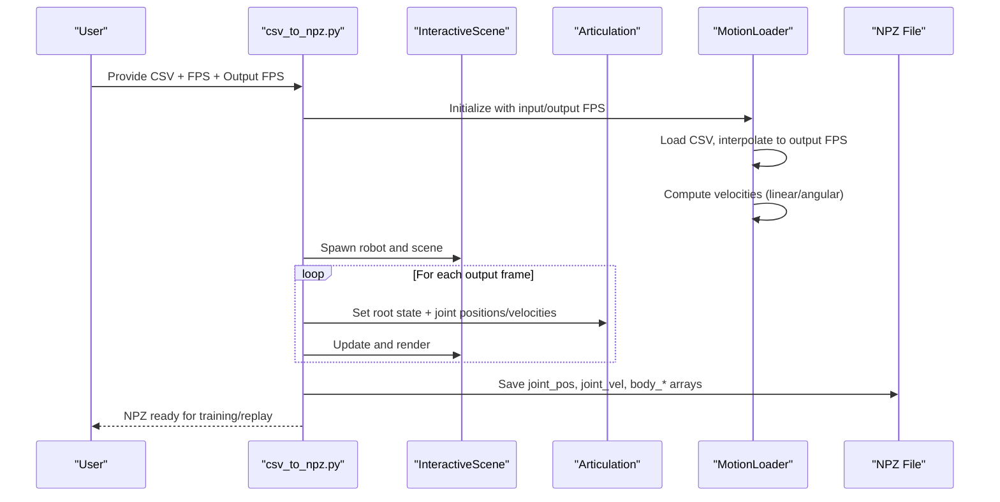
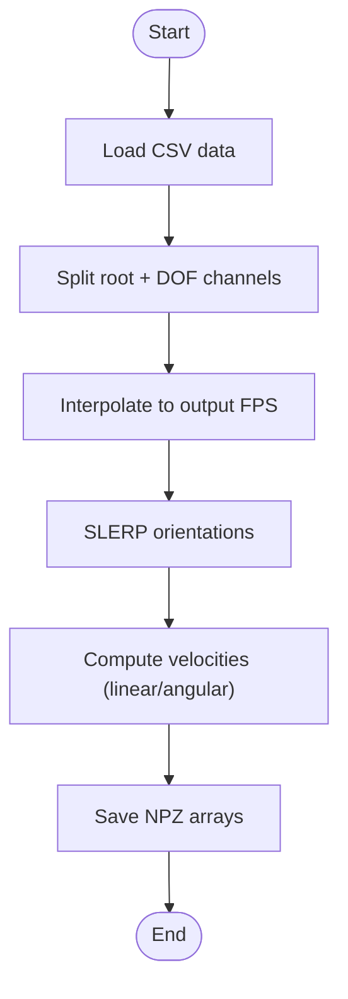
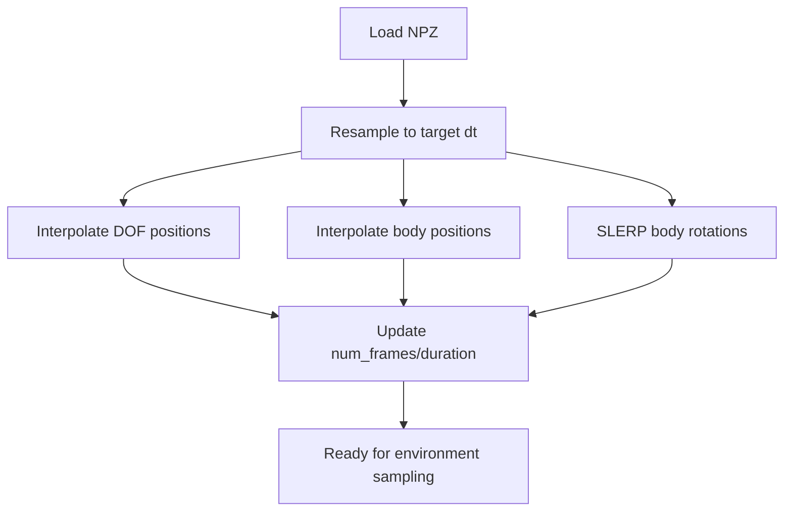
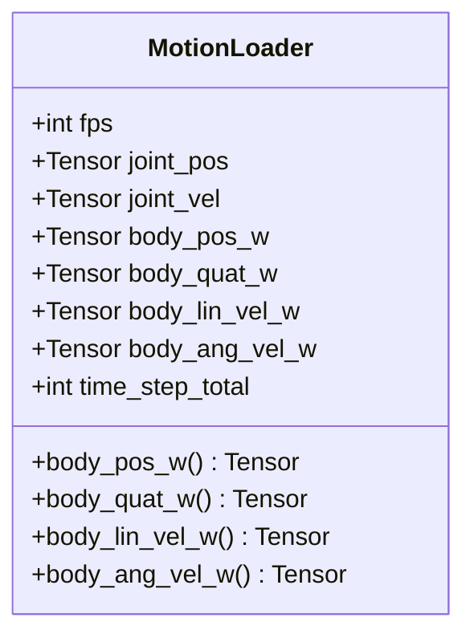
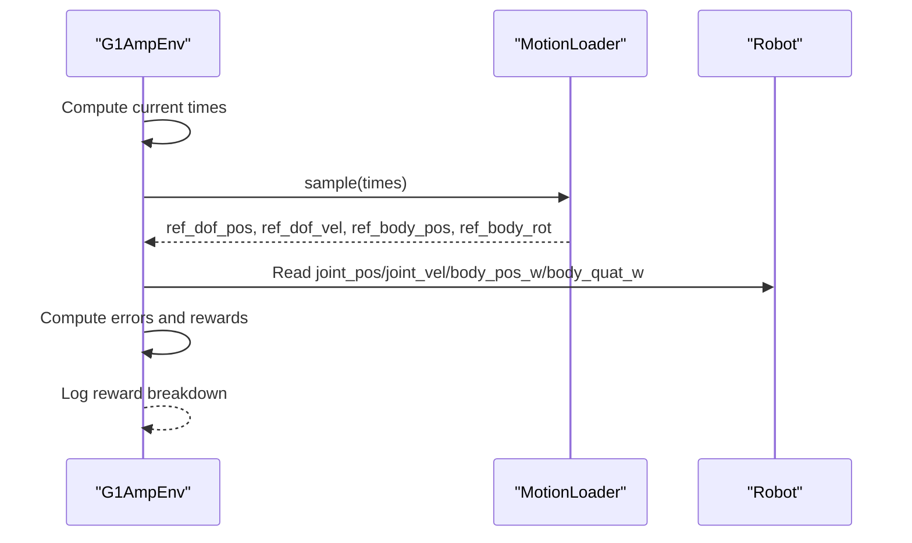
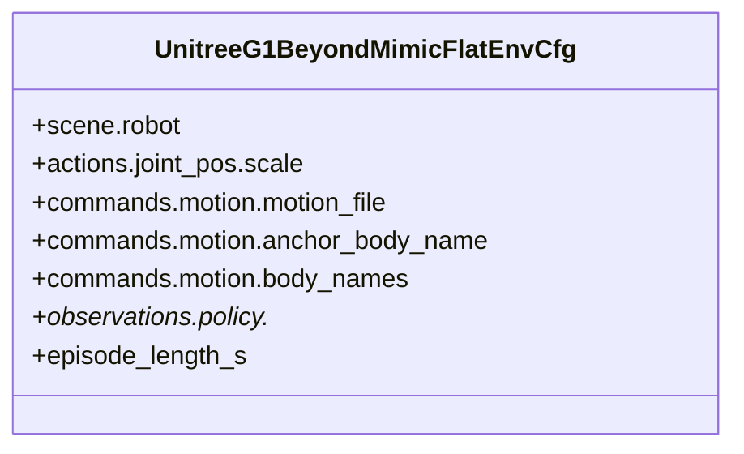
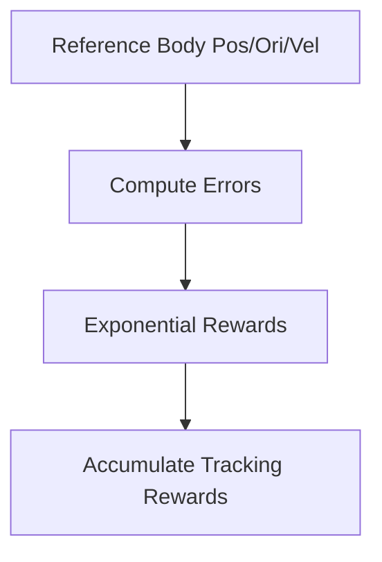
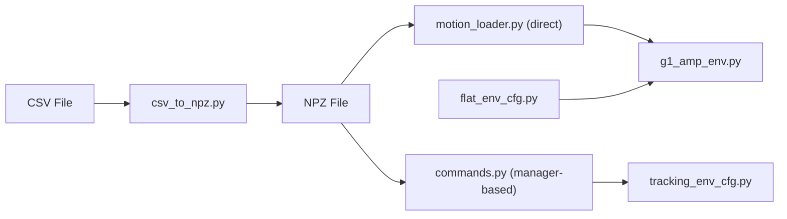

# Beyond Mimic Motion Imitation

<cite>
**Referenced Files in This Document**
- [README.md](file://README.md)
- [csv_to_npz.py](file://scripts/tools/beyondmimic/csv_to_npz.py)
- [replay_npz.py](file://scripts/tools/beyondmimic/replay_npz.py)
- [csv2npz.py](file://source/robot_lab/robot_lab/tasks/direct/g1_amp/motions/csv2npz.py)
- [motion_loader.py](file://source/robot_lab/robot_lab/tasks/direct/g1_amp/motions/motion_loader.py)
- [g1_amp_env.py](file://source/robot_lab/robot_lab/tasks/direct/g1_amp/g1_amp_env.py)
- [flat_env_cfg.py](file://source/robot_lab/robot_lab/tasks/manager_based/beyondmimic/config/g1/flat_env_cfg.py)
- [commands.py](file://source/robot_lab/robot_lab/tasks/manager_based/beyondmimic/mdp/commands.py)
- [tracking_env_cfg.py](file://source/robot_lab/robot_lab/tasks/manager_based/beyondmimic/tracking_env_cfg.py)
</cite>

## Table of Contents
1. [Introduction](#introduction)
2. [Project Structure](#project-structure)
3. [Core Components](#core-components)
4. [Architecture Overview](#architecture-overview)
5. [Detailed Component Analysis](#detailed-component-analysis)
6. [Dependency Analysis](#dependency-analysis)
7. [Performance Considerations](#performance-considerations)
8. [Troubleshooting Guide](#troubleshooting-guide)
9. [Conclusion](#conclusion)
10. [Appendices](#appendices)

## Introduction
Beyond Mimic is a motion imitation system integrated with the Isaac Lab ecosystem. It enables researchers and practitioners to:
- Prepare motion datasets from CSV files to NPZ format suitable for reinforcement learning
- Replay motion sequences in simulation for debugging and visualization
- Train agents to imitate human motion across different robot morphologies (quadrupeds, bipeds, hexapods)
- Evaluate imitation quality using motion-relative rewards and logging

The system emphasizes a clear data pipeline from CSV motion capture to temporally aligned NPZ datasets, robust replay mechanisms, and reward-driven training that encourages accurate motion tracking.

## Project Structure
Beyond Mimic spans several modules:
- Tools for motion conversion and replay
- Motion loaders for both direct and manager-based environments
- Environment configurations for training and evaluation
- Reward and observation logic tailored for motion imitation

```mermaid
graph TB
subgraph "Tools"
A["scripts/tools/beyondmimic/csv_to_npz.py"]
B["scripts/tools/beyondmimic/replay_npz.py"]
end
subgraph "Direct G1 AMP"
C["source/robot_lab/robot_lab/tasks/direct/g1_amp/motions/csv2npz.py"]
D["source/robot_lab/robot_lab/tasks/direct/g1_amp/motions/motion_loader.py"]
E["source/robot_lab/robot_lab/tasks/direct/g1_amp/g1_amp_env.py"]
end
subgraph "Manager-Based Beyond Mimic"
F["source/robot_lab/robot_lab/tasks/manager_based/beyondmimic/mdp/commands.py"]
G["source/robot_lab/robot_lab/tasks/manager_based/beyondmimic/config/g1/flat_env_cfg.py"]
H["source/robot_lab/robot_lab/tasks/manager_based/beyondmimic/tracking_env_cfg.py"]
end
A --> |"Convert CSV → NPZ"| C
A --> |"Save NPZ"| D
B --> |"Load NPZ"| F
E --> |"Imitation Rewards"| D
G --> |"Environment Config"| H
```

**Diagram sources**
- [csv_to_npz.py](file://scripts/tools/beyondmimic/csv_to_npz.py#L1-L366)
- [replay_npz.py](file://scripts/tools/beyondmimic/replay_npz.py#L1-L119)
- [csv2npz.py](file://source/robot_lab/robot_lab/tasks/direct/g1_amp/motions/csv2npz.py#L1-L256)
- [motion_loader.py](file://source/robot_lab/robot_lab/tasks/direct/g1_amp/motions/motion_loader.py#L289-L322)
- [g1_amp_env.py](file://source/robot_lab/robot_lab/tasks/direct/g1_amp/g1_amp_env.py#L134-L237)
- [commands.py](file://source/robot_lab/robot_lab/tasks/manager_based/beyondmimic/mdp/commands.py#L33-L61)
- [flat_env_cfg.py](file://source/robot_lab/robot_lab/tasks/manager_based/beyondmimic/config/g1/flat_env_cfg.py#L1-L42)
- [tracking_env_cfg.py](file://source/robot_lab/robot_lab/tasks/manager_based/beyondmimic/tracking_env_cfg.py#L215-L245)

**Section sources**
- [README.md](file://README.md#L237-L267)
- [csv_to_npz.py](file://scripts/tools/beyondmimic/csv_to_npz.py#L1-L366)
- [replay_npz.py](file://scripts/tools/beyondmimic/replay_npz.py#L1-L119)
- [csv2npz.py](file://source/robot_lab/robot_lab/tasks/direct/g1_amp/motions/csv2npz.py#L1-L256)
- [motion_loader.py](file://source/robot_lab/robot_lab/tasks/direct/g1_amp/motions/motion_loader.py#L289-L322)
- [g1_amp_env.py](file://source/robot_lab/robot_lab/tasks/direct/g1_amp/g1_amp_env.py#L134-L237)
- [flat_env_cfg.py](file://source/robot_lab/robot_lab/tasks/manager_based/beyondmimic/config/g1/flat_env_cfg.py#L1-L42)
- [commands.py](file://source/robot_lab/robot_lab/tasks/manager_based/beyondmimic/mdp/commands.py#L33-L61)
- [tracking_env_cfg.py](file://source/robot_lab/robot_lab/tasks/manager_based/beyondmimic/tracking_env_cfg.py#L215-L245)

## Core Components
- CSV to NPZ converter (tools): Reads CSV motion data and saves temporally aligned NPZ files with root pose, joint positions/velocities, and body kinematics.
- Motion loader (direct): Loads NPZ motion data and resamples to a target timestep using interpolation and SLERP for orientations.
- Motion loader (manager-based): Loads NPZ motion data and exposes body positions/rotations/velocities for reward computation.
- Environment (G1 AMP): Implements imitation rewards by comparing robot DOF positions/velocities and body poses against reference motion.
- Configuration (Beyond Mimic G1 Flat): Defines robot asset, motion file, anchor body, and observation settings for training.

**Section sources**
- [csv_to_npz.py](file://scripts/tools/beyondmimic/csv_to_npz.py#L89-L224)
- [motion_loader.py](file://source/robot_lab/robot_lab/tasks/direct/g1_amp/motions/motion_loader.py#L289-L322)
- [commands.py](file://source/robot_lab/robot_lab/tasks/manager_based/beyondmimic/mdp/commands.py#L33-L61)
- [g1_amp_env.py](file://source/robot_lab/robot_lab/tasks/direct/g1_amp/g1_amp_env.py#L134-L237)
- [flat_env_cfg.py](file://source/robot_lab/robot_lab/tasks/manager_based/beyondmimic/config/g1/flat_env_cfg.py#L12-L42)

## Architecture Overview
The Beyond Mimic architecture integrates data preparation, replay, and training:
- Data preparation: CSV → NPZ conversion with interpolation and velocity computation
- Replay: Playback of NPZ motions in simulation for inspection
- Training: Environment compares robot state to reference motion using specialized rewards

**Diagram sources**
- [csv_to_npz.py](file://scripts/tools/beyondmimic/csv_to_npz.py#L89-L224)
- [csv_to_npz.py](file://scripts/tools/beyondmimic/csv_to_npz.py#L226-L342)

**Section sources**
- [csv_to_npz.py](file://scripts/tools/beyondmimic/csv_to_npz.py#L89-L342)

## Detailed Component Analysis

### CSV to NPZ Conversion Pipeline
This component reads CSV motion data, interpolates to a target FPS, computes velocities, and writes an NPZ file consumable by the training and replay systems.

Key steps:
- Load CSV rows (root position/rotation + DOF positions)
- Interpolate root and DOF positions to output FPS
- SLERP quaternions for smooth orientation transitions
- Compute linear and angular velocities via finite differences
- Save arrays: fps, joint_pos, joint_vel, body_pos_w, body_quat_w, body_lin_vel_w, body_ang_vel_w

**Diagram sources**
- [csv_to_npz.py](file://scripts/tools/beyondmimic/csv_to_npz.py#L110-L198)

**Section sources**
- [csv_to_npz.py](file://scripts/tools/beyondmimic/csv_to_npz.py#L89-L198)

### Motion Loader (Direct G1 AMP)
The direct environment’s motion loader supports resampling to a target timestep and SLERP-based orientation interpolation for smooth body rotations.

Highlights:
- Resample DOF/body positions and velocities to target dt
- SLERP interpolation for body rotations
- Maintain duration and frame counts after resampling

**Diagram sources**
- [motion_loader.py](file://source/robot_lab/robot_lab/tasks/direct/g1_amp/motions/motion_loader.py#L289-L308)

**Section sources**
- [motion_loader.py](file://source/robot_lab/robot_lab/tasks/direct/g1_amp/motions/motion_loader.py#L289-L322)

### Motion Loader (Manager-Based Beyond Mimic)
The manager-based loader loads NPZ arrays and exposes body positions/rotations/velocities for reward computation. It selects subsets of bodies based on configured indexes.

**Diagram sources**
- [commands.py](file://source/robot_lab/robot_lab/tasks/manager_based/beyondmimic/mdp/commands.py#L33-L61)

**Section sources**
- [commands.py](file://source/robot_lab/robot_lab/tasks/manager_based/beyondmimic/mdp/commands.py#L33-L61)

### Environment Reward and Observation (G1 AMP)
The environment computes imitation rewards by comparing robot DOF positions/velocities and body poses to reference motion sampled at current episode times.

Key reward terms:
- Joint position error
- Joint velocity error
- Root position error (relative to environment origin)
- Root orientation error (quaternion dot product)

**Diagram sources**
- [g1_amp_env.py](file://source/robot_lab/robot_lab/tasks/direct/g1_amp/g1_amp_env.py#L134-L237)

**Section sources**
- [g1_amp_env.py](file://source/robot_lab/robot_lab/tasks/direct/g1_amp/g1_amp_env.py#L134-L237)

### Beyond Mimic Configuration (G1 Flat)
The configuration defines:
- Robot asset (Unitree G1)
- Motion file path and anchor body
- Bodies used for motion tracking
- Episode length and observation settings

**Diagram sources**
- [flat_env_cfg.py](file://source/robot_lab/robot_lab/tasks/manager_based/beyondmimic/config/g1/flat_env_cfg.py#L12-L42)

**Section sources**
- [flat_env_cfg.py](file://source/robot_lab/robot_lab/tasks/manager_based/beyondmimic/config/g1/flat_env_cfg.py#L12-L42)

### Beyond Mimic Rewards and Tracking Terms
Tracking rewards encourage alignment between robot and reference motion:
- Global anchor position/orientation errors
- Relative body position/orientation errors
- Global body linear/angular velocity errors

**Diagram sources**
- [tracking_env_cfg.py](file://source/robot_lab/robot_lab/tasks/manager_based/beyondmimic/tracking_env_cfg.py#L215-L245)

**Section sources**
- [tracking_env_cfg.py](file://source/robot_lab/robot_lab/tasks/manager_based/beyondmimic/tracking_env_cfg.py#L215-L245)

## Dependency Analysis
Beyond Mimic components depend on:
- CSV to NPZ conversion depends on CSV inputs, interpolation utilities, and velocity computation
- Direct environment depends on motion loader resampling and reward computation
- Manager-based environment depends on motion loader exposing body arrays and reward terms
- Configuration ties robot assets, motion files, and observation settings

**Diagram sources**
- [csv_to_npz.py](file://scripts/tools/beyondmimic/csv_to_npz.py#L89-L198)
- [motion_loader.py](file://source/robot_lab/robot_lab/tasks/direct/g1_amp/motions/motion_loader.py#L289-L322)
- [commands.py](file://source/robot_lab/robot_lab/tasks/manager_based/beyondmimic/mdp/commands.py#L33-L61)
- [g1_amp_env.py](file://source/robot_lab/robot_lab/tasks/direct/g1_amp/g1_amp_env.py#L134-L237)
- [flat_env_cfg.py](file://source/robot_lab/robot_lab/tasks/manager_based/beyondmimic/config/g1/flat_env_cfg.py#L12-L42)
- [tracking_env_cfg.py](file://source/robot_lab/robot_lab/tasks/manager_based/beyondmimic/tracking_env_cfg.py#L215-L245)

**Section sources**
- [csv_to_npz.py](file://scripts/tools/beyondmimic/csv_to_npz.py#L89-L198)
- [motion_loader.py](file://source/robot_lab/robot_lab/tasks/direct/g1_amp/motions/motion_loader.py#L289-L322)
- [commands.py](file://source/robot_lab/robot_lab/tasks/manager_based/beyondmimic/mdp/commands.py#L33-L61)
- [g1_amp_env.py](file://source/robot_lab/robot_lab/tasks/direct/g1_amp/g1_amp_env.py#L134-L237)
- [flat_env_cfg.py](file://source/robot_lab/robot_lab/tasks/manager_based/beyondmimic/config/g1/flat_env_cfg.py#L12-L42)
- [tracking_env_cfg.py](file://source/robot_lab/robot_lab/tasks/manager_based/beyondmimic/tracking_env_cfg.py#L215-L245)

## Performance Considerations
- Interpolation cost: SLERP and linear interpolation scale with output frames; choose output_fps to balance fidelity and compute.
- Velocity computation: Finite difference gradients are O(N) per signal; ensure moderate output_fps to keep overhead acceptable.
- Resampling: Resampling to higher-frequency targets increases memory footprint and computation; prefer output_fps close to training dt.
- Rendering loop: Rendering without physics steps reduces simulation overhead; still profile camera updates and scene writes.

[No sources needed since this section provides general guidance]

## Troubleshooting Guide
Common issues and resolutions:
- Incorrect joint/body names: Ensure CSV channel order matches expected joint/body lists; mismatch leads to incorrect parsing.
- FPS mismatch: If input_fps differs from motion sampling, specify input_fps and output_fps appropriately to avoid aliasing.
- Orientation flips: Use SLERP consistently for quaternion interpolation to avoid gimbal-like artifacts.
- Reward spikes: Clamp reward terms and apply exponential shaping to stabilize training; verify sigma parameters in reward functions.
- Motion looping: Replay loops when reaching the end; confirm reset logic and ensure continuous playback for long sequences.

**Section sources**
- [csv_to_npz.py](file://scripts/tools/beyondmimic/csv_to_npz.py#L133-L176)
- [g1_amp_env.py](file://source/robot_lab/robot_lab/tasks/direct/g1_amp/g1_amp_env.py#L159-L186)

## Conclusion
Beyond Mimic provides a complete pipeline for motion imitation:
- Robust CSV to NPZ conversion with interpolation and velocity computation
- Replay utilities for inspection and debugging
- Reward-driven training with motion-relative terms
- Configurable environments for diverse robot morphologies

By aligning motion data temporally and leveraging precise body kinematics, the system enables effective generalization across platforms and iterative refinement of retargeting accuracy.

[No sources needed since this section summarizes without analyzing specific files]

## Appendices

### Practical Examples

- Prepare a motion dataset:
  - Use the CSV to NPZ converter to transform CSV motion files into NPZ datasets with desired output_fps.
  - Example invocation is documented in the project README.

- Retargeting configuration:
  - Configure the G1 Beyond Mimic flat environment to point to the prepared NPZ motion file and select anchor/body names for tracking.

- Training integration:
  - Launch training using the environment task name and monitor reward logs for imitation and basic components.

**Section sources**
- [README.md](file://README.md#L247-L267)
- [flat_env_cfg.py](file://source/robot_lab/robot_lab/tasks/manager_based/beyondmimic/config/g1/flat_env_cfg.py#L12-L42)
- [g1_amp_env.py](file://source/robot_lab/robot_lab/tasks/direct/g1_amp/g1_amp_env.py#L134-L237)

### Evaluation Metrics and Iterative Refinement
- Metrics:
  - Joint position/velocity errors
  - Root position/orientation errors
  - Body position/orientation and velocity errors
  - Exponential reward shaping with configurable sigmas

- Iterative refinement:
  - Adjust sigma parameters to balance reward sensitivity
  - Increase output_fps for smoother motions
  - Tune anchor/body selections to focus on key segments
  - Monitor logged reward breakdowns to identify dominant error sources

**Section sources**
- [g1_amp_env.py](file://source/robot_lab/robot_lab/tasks/direct/g1_amp/g1_amp_env.py#L134-L237)
- [tracking_env_cfg.py](file://source/robot_lab/robot_lab/tasks/manager_based/beyondmimic/tracking_env_cfg.py#L215-L245)