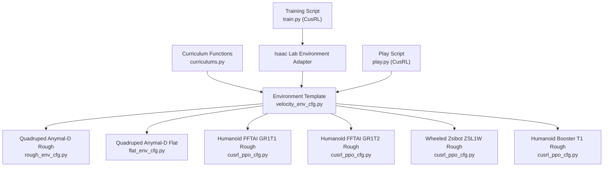
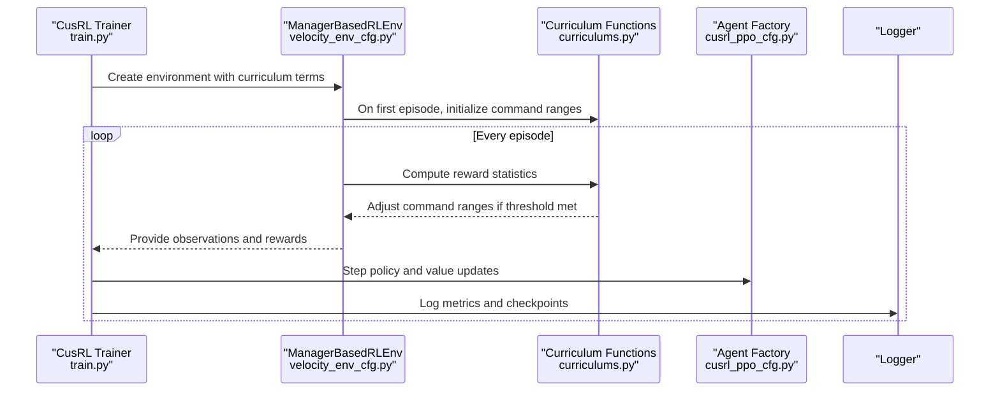
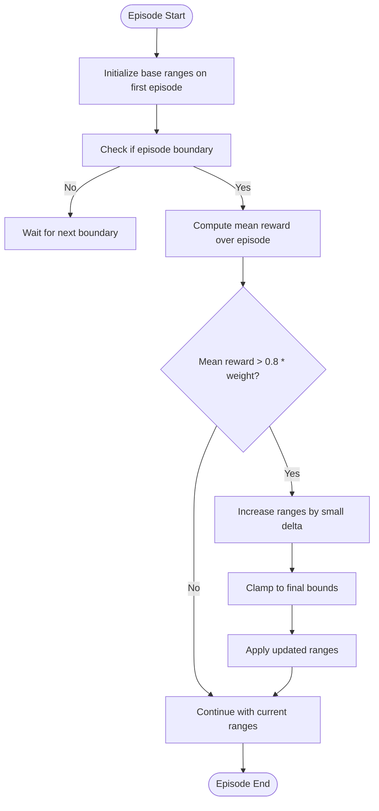
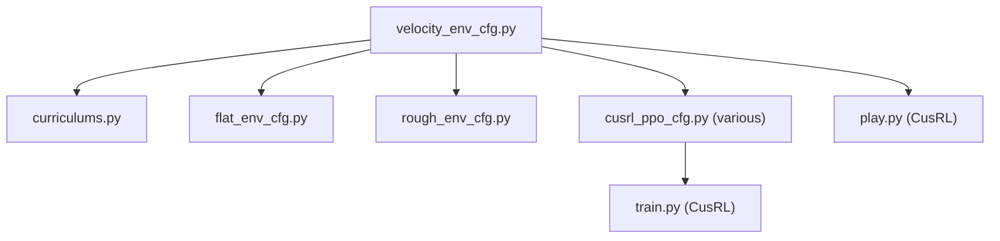

# Curriculum Learning Framework

<cite>
**Referenced Files in This Document**
- [README.md](file://README.md)
- [curriculums.py](file://source/robot_lab/robot_lab/tasks/manager_based/locomotion/velocity/mdp/curriculums.py)
- [velocity_env_cfg.py](file://source/robot_lab/robot_lab/tasks/manager_based/locomotion/velocity/velocity_env_cfg.py)
- [flat_env_cfg.py](file://source/robot_lab/robot_lab/tasks/manager_based/locomotion/velocity/config/quadruped/anymal_d/flat_env_cfg.py)
- [rough_env_cfg.py](file://source/robot_lab/robot_lab/tasks/manager_based/locomotion/velocity/config/quadruped/anymal_d/rough_env_cfg.py)
- [cusrl_ppo_cfg.py (humanoid fftai_gr1t1)](file://source/robot_lab/robot_lab/tasks/manager_based/locomotion/velocity/config/humanoid/fftai_gr1t1/agents/cusrl_ppo_cfg.py)
- [cusrl_ppo_cfg.py (humanoid fftai_gr1t2)](file://source/robot_lab/robot_lab/tasks/manager_based/locomotion/velocity/config/humanoid/fftai_gr1t2/agents/cusrl_ppo_cfg.py)
- [cusrl_ppo_cfg.py (wheeled zsibot_zsl1w)](file://source/robot_lab/robot_lab/tasks/manager_based/locomotion/velocity/config/wheeled/zsibot_zsl1w/agents/cusrl_ppo_cfg.py)
- [cusrl_ppo_cfg.py (humanoid booster_t1)](file://source/robot_lab/robot_lab/tasks/manager_based/locomotion/velocity/config/humanoid/booster_t1/agents/cusrl_ppo_cfg.py)
- [cusrl_distillation_cfg.py](file://source/robot_lab/robot_lab/tasks/manager_based/locomotion/velocity/config/quadruped/anymal_d/agents/cusrl_distillation_cfg.py)
- [train.py (CusRL)](file://scripts/reinforcement_learning/cusrl/train.py)
- [play.py (CusRL)](file://scripts/reinforcement_learning/cusrl/play.py)
</cite>

## Table of Contents
1. [Introduction](#introduction)
2. [Project Structure](#project-structure)
3. [Core Components](#core-components)
4. [Architecture Overview](#architecture-overview)
5. [Detailed Component Analysis](#detailed-component-analysis)
6. [Dependency Analysis](#dependency-analysis)
7. [Performance Considerations](#performance-considerations)
8. [Troubleshooting Guide](#troubleshooting-guide)
9. [Conclusion](#conclusion)
10. [Appendices](#appendices)

## Introduction
This document describes the curriculum learning framework used to progressively scale task difficulty and orchestrate skill acquisition across diverse robot categories (quadrupeds, wheeled robots, and humanoids). It explains how structured learning phases are implemented, how difficulty ramps and adaptive thresholds adjust over time, and how reward shaping supports robust skill development. Practical examples demonstrate curriculum setup for walking, running, jumping, and balance maintenance, and show how the framework integrates with different robot embodiments.

## Project Structure
The curriculum learning implementation centers around:
- Environment configuration templates that define tasks, observations, actions, rewards, events, terminations, and curriculum terms.
- Curriculum term functions that dynamically adjust command ranges and terrain difficulty based on agent performance.
- Robot-specific environment overrides for flat and rough terrains, and reward/observation scaling tuned per robot category.
- Agent configurations for training and distillation using the CusRL framework.

**Diagram sources**
- [velocity_env_cfg.py](file://source/robot_lab/robot_lab/tasks/manager_based/locomotion/velocity/velocity_env_cfg.py#L667-L687)
- [rough_env_cfg.py](file://source/robot_lab/robot_lab/tasks/manager_based/locomotion/velocity/config/quadruped/anymal_d/rough_env_cfg.py#L14-L134)
- [flat_env_cfg.py](file://source/robot_lab/robot_lab/tasks/manager_based/locomotion/velocity/config/quadruped/anymal_d/flat_env_cfg.py#L9-L30)
- [cusrl_ppo_cfg.py (humanoid fftai_gr1t1)](file://source/robot_lab/robot_lab/tasks/manager_based/locomotion/velocity/config/humanoid/fftai_gr1t1/agents/cusrl_ppo_cfg.py#L10-L48)
- [cusrl_ppo_cfg.py (humanoid fftai_gr1t2)](file://source/robot_lab/robot_lab/tasks/manager_based/locomotion/velocity/config/humanoid/fftai_gr1t2/agents/cusrl_ppo_cfg.py#L10-L48)
- [cusrl_ppo_cfg.py (wheeled zsibot_zsl1w)](file://source/robot_lab/robot_lab/tasks/manager_based/locomotion/velocity/config/wheeled/zsibot_zsl1w/agents/cusrl_ppo_cfg.py#L10-L48)
- [cusrl_ppo_cfg.py (humanoid booster_t1)](file://source/robot_lab/robot_lab/tasks/manager_based/locomotion/velocity/config/humanoid/booster_t1/agents/cusrl_ppo_cfg.py#L10-L48)
- [curriculums.py](file://source/robot_lab/robot_lab/tasks/manager_based/locomotion/velocity/mdp/curriculums.py#L20-L96)
- [train.py (CusRL)](file://scripts/reinforcement_learning/cusrl/train.py#L79-L135)
- [play.py (CusRL)](file://scripts/reinforcement_learning/cusrl/play.py#L97-L105)

**Section sources**
- [README.md](file://README.md#L15-L40)
- [velocity_env_cfg.py](file://source/robot_lab/robot_lab/tasks/manager_based/locomotion/velocity/velocity_env_cfg.py#L667-L687)
- [curriculums.py](file://source/robot_lab/robot_lab/tasks/manager_based/locomotion/velocity/mdp/curriculums.py#L20-L96)

## Core Components
- Curriculum Terms: Dynamic adjustment of command ranges for linear and angular velocities based on episode reward performance.
- Environment Templates: Base configuration defining observations, actions, rewards, events, terminations, and curriculum terms.
- Robot Overrides: Per-robot environment variants for flat vs. rough terrains, reward weights, and observation scaling.
- Agent Configurations: Training setups for CusRL, including PPO-style hooks and distillation configurations.
- Training/Playback Scripts: Orchestration of training and evaluation with curriculum-enabled environments.

Key implementation highlights:
- Difficulty ramping via curriculum functions that expand command ranges when tracking rewards exceed a threshold.
- Adaptive threshold adjustment controlled by curriculum parameters and reward term weights.
- Structured skill progression from basic locomotion to more challenging terrains and tasks.

**Section sources**
- [curriculums.py](file://source/robot_lab/robot_lab/tasks/manager_based/locomotion/velocity/mdp/curriculums.py#L20-L96)
- [velocity_env_cfg.py](file://source/robot_lab/robot_lab/tasks/manager_based/locomotion/velocity/velocity_env_cfg.py#L667-L687)
- [rough_env_cfg.py](file://source/robot_lab/robot_lab/tasks/manager_based/locomotion/velocity/config/quadruped/anymal_d/rough_env_cfg.py#L67-L121)
- [flat_env_cfg.py](file://source/robot_lab/robot_lab/tasks/manager_based/locomotion/velocity/config/quadruped/anymal_d/flat_env_cfg.py#L15-L29)
- [cusrl_ppo_cfg.py (humanoid fftai_gr1t1)](file://source/robot_lab/robot_lab/tasks/manager_based/locomotion/velocity/config/humanoid/fftai_gr1t1/agents/cusrl_ppo_cfg.py#L10-L48)
- [cusrl_ppo_cfg.py (humanoid fftai_gr1t2)](file://source/robot_lab/robot_lab/tasks/manager_based/locomotion/velocity/config/humanoid/fftai_gr1t2/agents/cusrl_ppo_cfg.py#L10-L48)
- [cusrl_ppo_cfg.py (wheeled zsibot_zsl1w)](file://source/robot_lab/robot_lab/tasks/manager_based/locomotion/velocity/config/wheeled/zsibot_zsl1w/agents/cusrl_ppo_cfg.py#L10-L48)
- [cusrl_ppo_cfg.py (humanoid booster_t1)](file://source/robot_lab/robot_lab/tasks/manager_based/locomotion/velocity/config/humanoid/booster_t1/agents/cusrl_ppo_cfg.py#L10-L48)
- [cusrl_distillation_cfg.py](file://source/robot_lab/robot_lab/tasks/manager_based/locomotion/velocity/config/quadruped/anymal_d/agents/cusrl_distillation_cfg.py#L10-L34)

## Architecture Overview
The curriculum learning pipeline integrates environment configuration, curriculum functions, and agent training to progressively increase task difficulty and reinforce desired behaviors.

**Diagram sources**
- [train.py (CusRL)](file://scripts/reinforcement_learning/cusrl/train.py#L79-L135)
- [velocity_env_cfg.py](file://source/robot_lab/robot_lab/tasks/manager_based/locomotion/velocity/velocity_env_cfg.py#L667-L687)
- [curriculums.py](file://source/robot_lab/robot_lab/tasks/manager_based/locomotion/velocity/mdp/curriculums.py#L20-L96)
- [cusrl_ppo_cfg.py (humanoid fftai_gr1t1)](file://source/robot_lab/robot_lab/tasks/manager_based/locomotion/velocity/config/humanoid/fftai_gr1t1/agents/cusrl_ppo_cfg.py#L10-L48)

## Detailed Component Analysis

### Curriculum Progression Algorithms
The curriculum adjusts task difficulty by expanding allowable command ranges for linear and angular velocities when the agent consistently achieves high tracking rewards. The algorithm:
- Initializes base velocity ranges on the first episode and stores original and target ranges.
- Periodically evaluates episode reward sums against a weighted threshold.
- Increases command ranges by small deltas until final bounds are reached.
- Clamps new ranges to prevent exceeding final limits.

**Diagram sources**
- [curriculums.py](file://source/robot_lab/robot_lab/tasks/manager_based/locomotion/velocity/mdp/curriculums.py#L20-L96)

**Section sources**
- [curriculums.py](file://source/robot_lab/robot_lab/tasks/manager_based/locomotion/velocity/mdp/curriculums.py#L20-L96)

### Skill Sequencing and Structured Phases
Structured learning phases are implemented through environment variants:
- Flat terrain environments remove terrain curriculum and height scans, focusing on basic locomotion and stabilization.
- Rough terrain environments introduce increasing difficulty via terrain generators and retain curriculum-driven command expansion.
- Reward shaping emphasizes tracking performance, contact consistency, and stability, enabling progressive skill acquisition.

Examples:
- Quadruped Anymal-D flat variant disables terrain curriculum and height scans, emphasizing walking and balance on flat surfaces.
- Humanoid and wheeled variants include tailored reward weights and observation scales to support stable locomotion across categories.

**Section sources**
- [flat_env_cfg.py](file://source/robot_lab/robot_lab/tasks/manager_based/locomotion/velocity/config/quadruped/anymal_d/flat_env_cfg.py#L9-L30)
- [rough_env_cfg.py](file://source/robot_lab/robot_lab/tasks/manager_based/locomotion/velocity/config/quadruped/anymal_d/rough_env_cfg.py#L67-L121)
- [cusrl_ppo_cfg.py (humanoid fftai_gr1t1)](file://source/robot_lab/robot_lab/tasks/manager_based/locomotion/velocity/config/humanoid/fftai_gr1t1/agents/cusrl_ppo_cfg.py#L10-L48)
- [cusrl_ppo_cfg.py (wheeled zsibot_zsl1w)](file://source/robot_lab/robot_lab/tasks/manager_based/locomotion/velocity/config/wheeled/zsibot_zsl1w/agents/cusrl_ppo_cfg.py#L10-L48)

### Integration Across Robot Categories
The framework supports:
- Quadrupeds: Anymal-D with category-specific reward shaping and observation scaling.
- Wheeled robots: Zsibot ZSL1W with distinct reward penalties and action dynamics.
- Humanoids: FFTAI GR1T1/GR1T2 and Booster T1 with humanoid-specific reward terms and action configurations.

Agent configurations encapsulate training hyperparameters and hooks suitable for policy optimization and distillation.

**Section sources**
- [rough_env_cfg.py](file://source/robot_lab/robot_lab/tasks/manager_based/locomotion/velocity/config/quadruped/anymal_d/rough_env_cfg.py#L14-L134)
- [cusrl_ppo_cfg.py (humanoid fftai_gr1t1)](file://source/robot_lab/robot_lab/tasks/manager_based/locomotion/velocity/config/humanoid/fftai_gr1t1/agents/cusrl_ppo_cfg.py#L10-L48)
- [cusrl_ppo_cfg.py (humanoid fftai_gr1t2)](file://source/robot_lab/robot_lab/tasks/manager_based/locomotion/velocity/config/humanoid/fftai_gr1t2/agents/cusrl_ppo_cfg.py#L10-L48)
- [cusrl_ppo_cfg.py (wheeled zsibot_zsl1w)](file://source/robot_lab/robot_lab/tasks/manager_based/locomotion/velocity/config/wheeled/zsibot_zsl1w/agents/cusrl_ppo_cfg.py#L10-L48)
- [cusrl_ppo_cfg.py (humanoid booster_t1)](file://source/robot_lab/robot_lab/tasks/manager_based/locomotion/velocity/config/humanoid/booster_t1/agents/cusrl_ppo_cfg.py#L10-L48)

### Practical Examples: Curriculum Setup
- Walking on flat terrain:
  - Use the flat environment variant to remove terrain and height-scan complexity.
  - Focus reward shaping on tracking linear and angular velocities and maintaining stability.
- Running on rough terrain:
  - Enable terrain curriculum and command-level curriculum to gradually increase speed and rotation.
  - Adjust reward weights to emphasize tracking performance and contact consistency.
- Jumping and balance maintenance:
  - Introduce reward terms that penalize deviations from desired orientations and encourage contact stability.
  - Reduce action scales and increase penalties for excessive torques or accelerations to encourage careful control.

**Section sources**
- [flat_env_cfg.py](file://source/robot_lab/robot_lab/tasks/manager_based/locomotion/velocity/config/quadruped/anymal_d/flat_env_cfg.py#L15-L29)
- [rough_env_cfg.py](file://source/robot_lab/robot_lab/tasks/manager_based/locomotion/velocity/config/quadruped/anymal_d/rough_env_cfg.py#L67-L121)
- [velocity_env_cfg.py](file://source/robot_lab/robot_lab/tasks/manager_based/locomotion/velocity/velocity_env_cfg.py#L375-L644)

### Dynamic Adjustment Mechanisms
Dynamic adjustments respond to agent performance:
- Episode-bound reward evaluation determines whether to expand command ranges.
- Curriculum thresholds and range multipliers are configurable per environment.
- During evaluation, curriculum terms can be disabled to stabilize testing conditions.

**Section sources**
- [curriculums.py](file://source/robot_lab/robot_lab/tasks/manager_based/locomotion/velocity/mdp/curriculums.py#L42-L60)
- [play.py (CusRL)](file://scripts/reinforcement_learning/cusrl/play.py#L97-L105)

### Relationship Between Curriculum Phases and Reward Shaping
- Tracking rewards drive difficulty ramping: higher tracking performance expands command ranges.
- Stability and contact rewards reinforce safe locomotion, supporting skill transfer across phases.
- Termination and event terms ensure robustness and prevent unsafe behaviors during early stages.

**Section sources**
- [velocity_env_cfg.py](file://source/robot_lab/robot_lab/tasks/manager_based/locomotion/velocity/velocity_env_cfg.py#L375-L644)
- [curriculums.py](file://source/robot_lab/robot_lab/tasks/manager_based/locomotion/velocity/mdp/curriculums.py#L47-L58)

## Dependency Analysis
The curriculum learning framework depends on:
- Environment configuration templates and robot-specific overrides.
- Curriculum functions that rely on reward manager statistics and command manager ranges.
- Agent configurations that define training hooks and optimization schedules.
- Training and playback scripts that instantiate environments and manage logging.

**Diagram sources**
- [velocity_env_cfg.py](file://source/robot_lab/robot_lab/tasks/manager_based/locomotion/velocity/velocity_env_cfg.py#L667-L687)
- [curriculums.py](file://source/robot_lab/robot_lab/tasks/manager_based/locomotion/velocity/mdp/curriculums.py#L20-L96)
- [flat_env_cfg.py](file://source/robot_lab/robot_lab/tasks/manager_based/locomotion/velocity/config/quadruped/anymal_d/flat_env_cfg.py#L9-L30)
- [rough_env_cfg.py](file://source/robot_lab/robot_lab/tasks/manager_based/locomotion/velocity/config/quadruped/anymal_d/rough_env_cfg.py#L14-L134)
- [cusrl_ppo_cfg.py (humanoid fftai_gr1t1)](file://source/robot_lab/robot_lab/tasks/manager_based/locomotion/velocity/config/humanoid/fftai_gr1t1/agents/cusrl_ppo_cfg.py#L10-L48)
- [train.py (CusRL)](file://scripts/reinforcement_learning/cusrl/train.py#L79-L135)
- [play.py (CusRL)](file://scripts/reinforcement_learning/cusrl/play.py#L97-L105)

**Section sources**
- [velocity_env_cfg.py](file://source/robot_lab/robot_lab/tasks/manager_based/locomotion/velocity/velocity_env_cfg.py#L667-L687)
- [curriculums.py](file://source/robot_lab/robot_lab/tasks/manager_based/locomotion/velocity/mdp/curriculums.py#L20-L96)
- [train.py (CusRL)](file://scripts/reinforcement_learning/cusrl/train.py#L79-L135)
- [play.py (CusRL)](file://scripts/reinforcement_learning/cusrl/play.py#L97-L105)

## Performance Considerations
- Curriculum evaluation occurs at episode boundaries to minimize computational overhead.
- Reward normalization and curriculum thresholds should be tuned to maintain stable learning curves.
- Observation and action scaling per robot category improves convergence and reduces early instability.
- Logging and checkpoint intervals should balance fidelity with storage and compute costs.

## Troubleshooting Guide
- Curriculum not activating: verify that reward term names match those used in curriculum parameters and that episode boundaries trigger updates.
- Excessive curriculum growth: adjust range multipliers and threshold percentages to slow difficulty ramping.
- Evaluation instability: disable curriculum terms during evaluation to stabilize testing conditions.
- Training divergence: review reward weights and action scaling; ensure appropriate entropy and gradient clipping settings in agent configurations.

**Section sources**
- [curriculums.py](file://source/robot_lab/robot_lab/tasks/manager_based/locomotion/velocity/mdp/curriculums.py#L42-L60)
- [play.py (CusRL)](file://scripts/reinforcement_learning/cusrl/play.py#L97-L105)
- [cusrl_ppo_cfg.py (humanoid fftai_gr1t1)](file://source/robot_lab/robot_lab/tasks/manager_based/locomotion/velocity/config/humanoid/fftai_gr1t1/agents/cusrl_ppo_cfg.py#L28-L41)

## Conclusion
The curriculum learning framework provides a robust mechanism for progressive skill acquisition across diverse robot categories. By dynamically adjusting task difficulty through curriculum functions and aligning reward shaping with desired behaviors, agents can reliably transition from basic locomotion to more complex tasks. The modular environment templates and agent configurations enable easy customization and deployment across quadrupeds, wheeled robots, and humanoids.

## Appendices
- Environment naming and registration conventions are documented in the project’s README.
- Training and evaluation scripts demonstrate how to launch curriculum-enabled tasks and manage logging.

**Section sources**
- [README.md](file://README.md#L19-L40)
- [train.py (CusRL)](file://scripts/reinforcement_learning/cusrl/train.py#L196-L226)