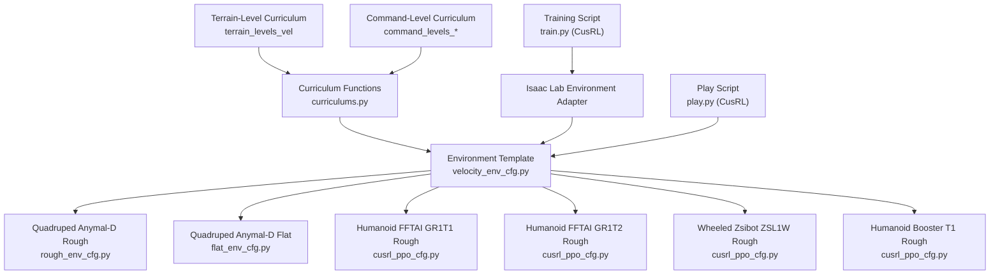
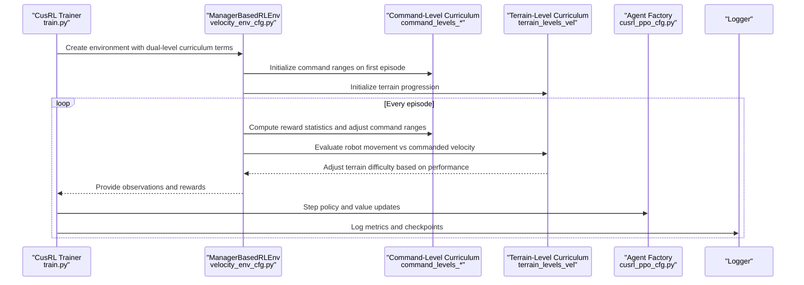
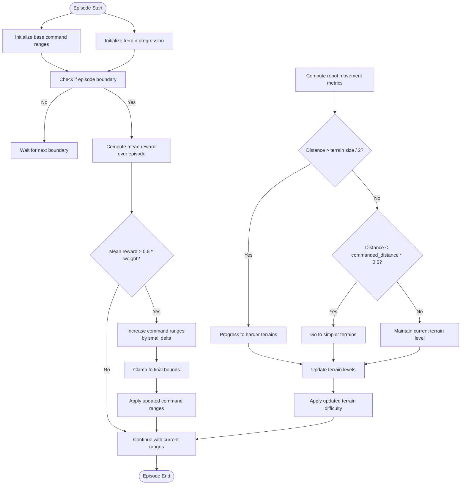
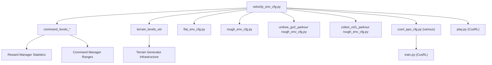

# Curriculum Learning Framework

<cite>
**Referenced Files in This Document**
- [README.md](file://README.md)
- [curriculums.py](file://source/robot_lab/robot_lab/tasks/manager_based/locomotion/velocity/mdp/curriculums.py)
- [velocity_env_cfg.py](file://source/robot_lab/robot_lab/tasks/manager_based/locomotion/velocity/velocity_env_cfg.py)
- [flat_env_cfg.py](file://source/robot_lab/robot_lab/tasks/manager_based/locomotion/velocity/config/quadruped/anymal_d/flat_env_cfg.py)
- [rough_env_cfg.py](file://source/robot_lab/robot_lab/tasks/manager_based/locomotion/velocity/config/quadruped/anymal_d/rough_env_cfg.py)
- [cusrl_ppo_cfg.py (humanoid fftai_gr1t1)](file://source/robot_lab/robot_lab/tasks/manager_based/locomotion/velocity/config/humanoid/fftai_gr1t1/agents/cusrl_ppo_cfg.py)
- [cusrl_ppo_cfg.py (humanoid fftai_gr1t2)](file://source/robot_lab/robot_lab/tasks/manager_based/locomotion/velocity/config/humanoid/fftai_gr1t2/agents/cusrl_ppo_cfg.py)
- [cusrl_ppo_cfg.py (wheeled zsibot_zsl1w)](file://source/robot_lab/robot_lab/tasks/manager_based/locomotion/velocity/config/wheeled/zsibot_zsl1w/agents/cusrl_ppo_cfg.py)
- [cusrl_ppo_cfg.py (humanoid booster_t1)](file://source/robot_lab/robot_lab/tasks/manager_based/locomotion/velocity/config/humanoid/booster_t1/agents/cusrl_ppo_cfg.py)
- [cusrl_distillation_cfg.py](file://source/robot_lab/robot_lab/tasks/manager_based/locomotion/velocity/config/quadruped/anymal_d/agents/cusrl_distillation_cfg.py)
- [train.py (CusRL)](file://scripts/reinforcement_learning/cusrl/train.py)
- [play.py (CusRL)](file://scripts/reinforcement_learning/cusrl/play.py)
- [rough_env_cfg.py (unitree go2 parkour)](file://source/robot_lab/robot_lab/tasks/manager_based/locomotion/velocity/config/quadruped/unitree_go2_parkour/rough_env_cfg.py)
- [rough_env_cfg.py (zsibot zsl1 parkour)](file://source/robot_lab/robot_lab/tasks/manager_based/locomotion/velocity/config/quadruped/zsibot_zsl1_parkour/rough_env_cfg.py)
</cite>

## Update Summary
**Changes Made**
- Added documentation for the new `terrain_levels_vel` function that enables adaptive terrain difficulty progression
- Enhanced curriculum system documentation to cover dual-level difficulty adjustment (command-level and terrain-level)
- Updated architecture diagrams to reflect the new terrain-level curriculum progression
- Added practical examples showing how terrain difficulty adapts based on robot performance metrics
- Expanded troubleshooting guidance for terrain-level curriculum implementation

## Table of Contents
1. [Introduction](#introduction)
2. [Project Structure](#project-structure)
3. [Core Components](#core-components)
4. [Architecture Overview](#architecture-overview)
5. [Detailed Component Analysis](#detailed-component-analysis)
6. [Dependency Analysis](#dependency-analysis)
7. [Performance Considerations](#performance-considerations)
8. [Troubleshooting Guide](#troubleshooting-guide)
9. [Conclusion](#conclusion)
10. [Appendices](#appendices)

## Introduction
This document describes the curriculum learning framework used to progressively scale task difficulty and orchestrate skill acquisition across diverse robot categories (quadrupeds, wheeled robots, and humanoids). The framework now supports both command-level and terrain-level difficulty adjustment for optimal learning progression. It explains how structured learning phases are implemented through adaptive terrain difficulty based on robot performance metrics, how difficulty ramps and adaptive thresholds adjust over time, and how reward shaping supports robust skill development. Practical examples demonstrate curriculum setup for walking, running, jumping, and balance maintenance across different terrain types.

## Project Structure
The curriculum learning implementation centers around:
- Environment configuration templates that define tasks, observations, actions, rewards, events, terminations, and curriculum terms.
- Dual-level curriculum functions that dynamically adjust both command ranges and terrain difficulty based on agent performance.
- Robot-specific environment overrides for flat and rough terrains, and reward/observation scaling tuned per robot category.
- Agent configurations for training and distillation using the CusRL framework.

**Diagram sources**
- [velocity_env_cfg.py:785-813](file://source/robot_lab/robot_lab/tasks/manager_based/locomotion/velocity/velocity_env_cfg.py#L785-L813)
- [rough_env_cfg.py:14-134](file://source/robot_lab/robot_lab/tasks/manager_based/locomotion/velocity/config/quadruped/anymal_d/rough_env_cfg.py#L14-L134)
- [flat_env_cfg.py:9-30](file://source/robot_lab/robot_lab/tasks/manager_based/locomotion/velocity/config/quadruped/anymal_d/flat_env_cfg.py#L9-L30)
- [cusrl_ppo_cfg.py (humanoid fftai_gr1t1):10-48](file://source/robot_lab/robot_lab/tasks/manager_based/locomotion/velocity/config/humanoid/fftai_gr1t1/agents/cusrl_ppo_cfg.py#L10-L48)
- [cusrl_ppo_cfg.py (humanoid fftai_gr1t2):10-48](file://source/robot_lab/robot_lab/tasks/manager_based/locomotion/velocity/config/humanoid/fftai_gr1t2/agents/cusrl_ppo_cfg.py#L10-L48)
- [cusrl_ppo_cfg.py (wheeled zsibot_zsl1w):10-48](file://source/robot_lab/robot_lab/tasks/manager_based/locomotion/velocity/config/wheeled/zsibot_zsl1w/agents/cusrl_ppo_cfg.py#L10-L48)
- [cusrl_ppo_cfg.py (humanoid booster_t1):10-48](file://source/robot_lab/robot_lab/tasks/manager_based/locomotion/velocity/config/humanoid/booster_t1/agents/cusrl_ppo_cfg.py#L10-L48)
- [curriculums.py:25-101](file://source/robot_lab/robot_lab/tasks/manager_based/locomotion/velocity/mdp/curriculums.py#L25-L101)
- [train.py (CusRL):79-135](file://scripts/reinforcement_learning/cusrl/train.py#L79-L135)
- [play.py (CusRL):97-105](file://scripts/reinforcement_learning/cusrl/play.py#L97-L105)
- [curriculums.py:103-134](file://source/robot_lab/robot_lab/tasks/manager_based/locomotion/velocity/mdp/curriculums.py#L103-L134)

**Section sources**
- [README.md:15-40](file://README.md#L15-L40)
- [velocity_env_cfg.py:785-813](file://source/robot_lab/robot_lab/tasks/manager_based/locomotion/velocity/velocity_env_cfg.py#L785-L813)
- [curriculums.py:25-134](file://source/robot_lab/robot_lab/tasks/manager_based/locomotion/velocity/mdp/curriculums.py#L25-L134)

## Core Components
- **Dual-Level Curriculum Terms**: Dynamic adjustment of both command ranges for linear and angular velocities AND terrain difficulty based on episode reward performance and robot movement metrics.
- **Environment Templates**: Base configuration defining observations, actions, rewards, events, terminations, and curriculum terms including both command-level and terrain-level progression.
- **Robot Overrides**: Per-robot environment variants for flat vs. rough terrains, reward weights, and observation scaling.
- **Adaptive Terrain Progression**: New `terrain_levels_vel` function that increases/decreases terrain difficulty based on actual robot travel distance versus commanded velocity.
- **Agent Configurations**: Training setups for CusRL, including PPO-style hooks and distillation configurations.
- **Training/Playback Scripts**: Orchestration of training and evaluation with curriculum-enabled environments.

Key implementation highlights:
- **Command-level difficulty ramping** via curriculum functions that expand command ranges when tracking rewards exceed a threshold.
- **Terrain-level difficulty adaptation** through `terrain_levels_vel` that adjusts terrain complexity based on robot performance metrics.
- **Adaptive threshold adjustment** controlled by curriculum parameters and reward term weights.
- **Structured skill progression** from basic locomotion to more challenging terrains and tasks through dual-level curriculum progression.

**Section sources**
- [curriculums.py:25-134](file://source/robot_lab/robot_lab/tasks/manager_based/locomotion/velocity/mdp/curriculums.py#L25-L134)
- [velocity_env_cfg.py:785-813](file://source/robot_lab/robot_lab/tasks/manager_based/locomotion/velocity/velocity_env_cfg.py#L785-L813)
- [rough_env_cfg.py:67-121](file://source/robot_lab/robot_lab/tasks/manager_based/locomotion/velocity/config/quadruped/anymal_d/rough_env_cfg.py#L67-L121)
- [flat_env_cfg.py:15-29](file://source/robot_lab/robot_lab/tasks/manager_based/locomotion/velocity/config/quadruped/anymal_d/flat_env_cfg.py#L15-L29)
- [cusrl_ppo_cfg.py (humanoid fftai_gr1t1):10-48](file://source/robot_lab/robot_lab/tasks/manager_based/locomotion/velocity/config/humanoid/fftai_gr1t1/agents/cusrl_ppo_cfg.py#L10-L48)
- [cusrl_ppo_cfg.py (humanoid fftai_gr1t2):10-48](file://source/robot_lab/robot_lab/tasks/manager_based/locomotion/velocity/config/humanoid/fftai_gr1t2/agents/cusrl_ppo_cfg.py#L10-L48)
- [cusrl_ppo_cfg.py (wheeled zsibot_zsl1w):10-48](file://source/robot_lab/robot_lab/tasks/manager_based/locomotion/velocity/config/wheeled/zsibot_zsl1w/agents/cusrl_ppo_cfg.py#L10-L48)
- [cusrl_ppo_cfg.py (humanoid booster_t1):10-48](file://source/robot_lab/robot_lab/tasks/manager_based/locomotion/velocity/config/humanoid/booster_t1/agents/cusrl_ppo_cfg.py#L10-L48)
- [cusrl_distillation_cfg.py:10-34](file://source/robot_lab/robot_lab/tasks/manager_based/locomotion/velocity/config/quadruped/anymal_d/agents/cusrl_distillation_cfg.py#L10-L34)

## Architecture Overview
The enhanced curriculum learning pipeline now integrates both command-level and terrain-level difficulty adjustment to progressively increase task complexity and reinforce desired behaviors through adaptive performance-based progression.

**Diagram sources**
- [train.py (CusRL):79-135](file://scripts/reinforcement_learning/cusrl/train.py#L79-L135)
- [velocity_env_cfg.py:785-813](file://source/robot_lab/robot_lab/tasks/manager_based/locomotion/velocity/velocity_env_cfg.py#L785-L813)
- [curriculums.py:25-134](file://source/robot_lab/robot_lab/tasks/manager_based/locomotion/velocity/mdp/curriculums.py#L25-L134)
- [cusrl_ppo_cfg.py (humanoid fftai_gr1t1):10-48](file://source/robot_lab/robot_lab/tasks/manager_based/locomotion/velocity/config/humanoid/fftai_gr1t1/agents/cusrl_ppo_cfg.py#L10-L48)

## Detailed Component Analysis

### Enhanced Curriculum Progression Algorithms
The curriculum now operates on two complementary levels:

**Command-Level Progression**: Expands allowable command ranges for linear and angular velocities when the agent consistently achieves high tracking rewards, similar to the original implementation.

**Terrain-Level Progression**: Uses the new `terrain_levels_vel` function to adapt terrain difficulty based on actual robot performance metrics. This function:
- Computes the actual distance traveled by robots compared to commanded velocity targets
- Increases terrain difficulty when robots walk far enough (progress to harder terrains)
- Decreases terrain difficulty when robots walk less than half the required distance (go to simpler terrains)
- Updates terrain levels dynamically using `terrain.update_env_origins`

**Diagram sources**
- [curriculums.py:25-134](file://source/robot_lab/robot_lab/tasks/manager_based/locomotion/velocity/mdp/curriculums.py#L25-L134)

**Section sources**
- [curriculums.py:25-134](file://source/robot_lab/robot_lab/tasks/manager_based/locomotion/velocity/mdp/curriculums.py#L25-L134)

### Adaptive Terrain Difficulty Progression
The new `terrain_levels_vel` function implements intelligent terrain difficulty adaptation based on robot performance metrics:

**Performance-Based Terrain Scaling**:
- **Progression Trigger**: Robots that walk more than half the terrain size progress to harder terrains
- **Regression Prevention**: Robots that walk less than half of their commanded distance regress to simpler terrains
- **Dynamic Updates**: Terrain levels are updated in real-time using `terrain.update_env_origins`
- **Generator Compatibility**: Works specifically with terrain generator type for curriculum progression

**Implementation Details**:
- Extracts robot asset, terrain importer, and command manager from the environment
- Computes actual robot distance traveled using root position differences
- Compares distance to terrain size and commanded velocity targets
- Applies boolean masks to determine progression direction
- Returns mean terrain level for curriculum tracking

**Section sources**
- [curriculums.py:103-134](file://source/robot_lab/robot_lab/tasks/manager_based/locomotion/velocity/mdp/curriculums.py#L103-L134)

### Skill Sequencing and Structured Phases
Structured learning phases are now implemented through dual-level progression:
- **Flat terrain environments** remove terrain curriculum and height scans, focusing on basic locomotion and stabilization.
- **Rough terrain environments** introduce increasing difficulty via terrain generators and retain both command-level and terrain-level curriculum progression.
- **Parkour environments** demonstrate advanced terrain-level curriculum integration with complex obstacle courses.
- **Reward shaping** emphasizes tracking performance, contact consistency, and stability across both command and terrain difficulty levels.

Examples:
- **Quadruped Anymal-D flat variant** disables terrain curriculum and height scans, emphasizing walking and balance on flat surfaces.
- **Humanoid and wheeled variants** include tailored reward weights and observation scales to support stable locomotion across categories.
- **Parkour variants** showcase terrain-level curriculum progression through complex obstacle courses with adaptive difficulty.

**Section sources**
- [flat_env_cfg.py:9-30](file://source/robot_lab/robot_lab/tasks/manager_based/locomotion/velocity/config/quadruped/anymal_d/flat_env_cfg.py#L9-L30)
- [rough_env_cfg.py:67-121](file://source/robot_lab/robot_lab/tasks/manager_based/locomotion/velocity/config/quadruped/anymal_d/rough_env_cfg.py#L67-L121)
- [rough_env_cfg.py (unitree go2 parkour):440-462](file://source/robot_lab/robot_lab/tasks/manager_based/locomotion/velocity/config/quadruped/unitree_go2_parkour/rough_env_cfg.py#L440-L462)
- [rough_env_cfg.py (zsibot zsl1 parkour):444-453](file://source/robot_lab/robot_lab/tasks/manager_based/locomotion/velocity/config/quadruped/zsibot_zsl1_parkour/rough_env_cfg.py#L444-L453)
- [cusrl_ppo_cfg.py (humanoid fftai_gr1t1):10-48](file://source/robot_lab/robot_lab/tasks/manager_based/locomotion/velocity/config/humanoid/fftai_gr1t1/agents/cusrl_ppo_cfg.py#L10-L48)
- [cusrl_ppo_cfg.py (wheeled zsibot_zsl1w):10-48](file://source/robot_lab/robot_lab/tasks/manager_based/locomotion/velocity/config/wheeled/zsibot_zsl1w/agents/cusrl_ppo_cfg.py#L10-L48)

### Integration Across Robot Categories
The enhanced framework supports:
- **Quadrupeds**: Anymal-D with category-specific reward shaping and observation scaling.
- **Wheeled robots**: Zsibot ZSL1W with distinct reward penalties and action dynamics.
- **Humanoids**: FFTAI GR1T1/GR1T2 and Booster T1 with humanoid-specific reward terms and action configurations.
- **Parkour variants**: Advanced terrain-level curriculum integration for complex locomotion tasks.

Agent configurations encapsulate training hyperparameters and hooks suitable for policy optimization and distillation, with terrain-level curriculum support.

**Section sources**
- [rough_env_cfg.py:14-134](file://source/robot_lab/robot_lab/tasks/manager_based/locomotion/velocity/config/quadruped/anymal_d/rough_env_cfg.py#L14-L134)
- [cusrl_ppo_cfg.py (humanoid fftai_gr1t1):10-48](file://source/robot_lab/robot_lab/tasks/manager_based/locomotion/velocity/config/humanoid/fftai_gr1t1/agents/cusrl_ppo_cfg.py#L10-L48)
- [cusrl_ppo_cfg.py (humanoid fftai_gr1t2):10-48](file://source/robot_lab/robot_lab/tasks/manager_based/locomotion/velocity/config/humanoid/fftai_gr1t2/agents/cusrl_ppo_cfg.py#L10-L48)
- [cusrl_ppo_cfg.py (wheeled zsibot_zsl1w):10-48](file://source/robot_lab/robot_lab/tasks/manager_based/locomotion/velocity/config/wheeled/zsibot_zsl1w/agents/cusrl_ppo_cfg.py#L10-L48)
- [cusrl_ppo_cfg.py (humanoid booster_t1):10-48](file://source/robot_lab/robot_lab/tasks/manager_based/locomotion/velocity/config/humanoid/booster_t1/agents/cusrl_ppo_cfg.py#L10-L48)
- [rough_env_cfg.py (unitree go2 parkour):440-462](file://source/robot_lab/robot_lab/tasks/manager_based/locomotion/velocity/config/quadruped/unitree_go2_parkour/rough_env_cfg.py#L440-L462)
- [rough_env_cfg.py (zsibot zsl1 parkour):444-453](file://source/robot_lab/robot_lab/tasks/manager_based/locomotion/velocity/config/quadruped/zsibot_zsl1_parkour/rough_env_cfg.py#L444-L453)

### Practical Examples: Enhanced Curriculum Setup
- **Walking on flat terrain**:
  - Use the flat environment variant to remove terrain and height-scan complexity.
  - Focus reward shaping on tracking linear and angular velocities and maintaining stability.
  - Command-level curriculum can be disabled for pure flat surface training.
- **Running on rough terrain with adaptive difficulty**:
  - Enable both command-level and terrain-level curriculum for progressive challenge.
  - Terrain-level curriculum automatically adjusts difficulty based on robot performance.
  - Command-level curriculum expands speed and rotation ranges as tracking improves.
- **Parkour training with complex obstacles**:
  - Implement terrain-level curriculum for adaptive obstacle difficulty.
  - Use terrain generator with multiple obstacle types (gaps, hurdles, stairs, steps).
  - Combine with command-level curriculum for speed progression.
- **Jumping and balance maintenance**:
  - Introduce reward terms that penalize deviations from desired orientations and encourage contact stability.
  - Reduce action scales and increase penalties for excessive torques or accelerations to encourage careful control.
  - Terrain-level curriculum ensures appropriate obstacle height progression.

**Section sources**
- [flat_env_cfg.py:15-29](file://source/robot_lab/robot_lab/tasks/manager_based/locomotion/velocity/config/quadruped/anymal_d/flat_env_cfg.py#L15-L29)
- [rough_env_cfg.py:67-121](file://source/robot_lab/robot_lab/tasks/manager_based/locomotion/velocity/config/quadruped/anymal_d/rough_env_cfg.py#L67-L121)
- [velocity_env_cfg.py:375-644](file://source/robot_lab/robot_lab/tasks/manager_based/locomotion/velocity/velocity_env_cfg.py#L375-L644)
- [rough_env_cfg.py (unitree go2 parkour):440-462](file://source/robot_lab/robot_lab/tasks/manager_based/locomotion/velocity/config/quadruped/unitree_go2_parkour/rough_env_cfg.py#L440-L462)
- [rough_env_cfg.py (zsibot zsl1 parkour):444-453](file://source/robot_lab/robot_lab/tasks/manager_based/locomotion/velocity/config/quadruped/zsibot_zsl1_parkour/rough_env_cfg.py#L444-L453)

### Dynamic Adjustment Mechanisms
Enhanced dynamic adjustments respond to agent performance through dual-level progression:
- **Command-level evaluation** determines whether to expand command ranges based on reward performance.
- **Terrain-level evaluation** determines whether to increase or decrease terrain difficulty based on actual robot movement.
- **Curriculum thresholds** and range multipliers are configurable per environment.
- **Performance metrics** include both reward statistics and robot movement distance ratios.
- **During evaluation**, curriculum terms can be disabled to stabilize testing conditions.

**Section sources**
- [curriculums.py:42-60](file://source/robot_lab/robot_lab/tasks/manager_based/locomotion/velocity/mdp/curriculums.py#L42-L60)
- [curriculums.py:103-134](file://source/robot_lab/robot_lab/tasks/manager_based/locomotion/velocity/mdp/curriculums.py#L103-L134)
- [play.py (CusRL):97-105](file://scripts/reinforcement_learning/cusrl/play.py#L97-L105)

### Relationship Between Curriculum Phases and Reward Shaping
- **Tracking rewards** drive both command-level and terrain-level difficulty ramping.
- **Stability and contact rewards** reinforce safe locomotion, supporting skill transfer across phases.
- **Termination and event terms** ensure robustness and prevent unsafe behaviors during early stages.
- **Terrain-level progression** complements command-level progression by adapting environmental complexity based on actual performance.
- **Performance-based adaptation** ensures curriculum difficulty matches agent capabilities rather than just reward thresholds.

**Section sources**
- [velocity_env_cfg.py:375-644](file://source/robot_lab/robot_lab/tasks/manager_based/locomotion/velocity/velocity_env_cfg.py#L375-L644)
- [curriculums.py:47-58](file://source/robot_lab/robot_lab/tasks/manager_based/locomotion/velocity/mdp/curriculums.py#L47-L58)
- [curriculums.py:103-134](file://source/robot_lab/robot_lab/tasks/manager_based/locomotion/velocity/mdp/curriculums.py#L103-L134)

## Dependency Analysis
The enhanced curriculum learning framework depends on:
- Environment configuration templates and robot-specific overrides.
- Dual-level curriculum functions that rely on reward manager statistics, command manager ranges, and terrain metrics.
- Agent configurations that define training hooks and optimization schedules.
- Training and playback scripts that instantiate environments and manage logging.
- Terrain generator infrastructure for adaptive difficulty progression.

**Diagram sources**
- [velocity_env_cfg.py:785-813](file://source/robot_lab/robot_lab/tasks/manager_based/locomotion/velocity/velocity_env_cfg.py#L785-L813)
- [curriculums.py:25-134](file://source/robot_lab/robot_lab/tasks/manager_based/locomotion/velocity/mdp/curriculums.py#L25-L134)
- [flat_env_cfg.py:9-30](file://source/robot_lab/robot_lab/tasks/manager_based/locomotion/velocity/config/quadruped/anymal_d/flat_env_cfg.py#L9-L30)
- [rough_env_cfg.py:14-134](file://source/robot_lab/robot_lab/tasks/manager_based/locomotion/velocity/config/quadruped/anymal_d/rough_env_cfg.py#L14-L134)
- [rough_env_cfg.py (unitree go2 parkour):440-462](file://source/robot_lab/robot_lab/tasks/manager_based/locomotion/velocity/config/quadruped/unitree_go2_parkour/rough_env_cfg.py#L440-L462)
- [rough_env_cfg.py (zsibot zsl1 parkour):444-453](file://source/robot_lab/robot_lab/tasks/manager_based/locomotion/velocity/config/quadruped/zsibot_zsl1_parkour/rough_env_cfg.py#L444-L453)
- [cusrl_ppo_cfg.py (humanoid fftai_gr1t1):10-48](file://source/robot_lab/robot_lab/tasks/manager_based/locomotion/velocity/config/humanoid/fftai_gr1t1/agents/cusrl_ppo_cfg.py#L10-L48)
- [train.py (CusRL):79-135](file://scripts/reinforcement_learning/cusrl/train.py#L79-L135)
- [play.py (CusRL):97-105](file://scripts/reinforcement_learning/cusrl/play.py#L97-L105)

**Section sources**
- [velocity_env_cfg.py:785-813](file://source/robot_lab/robot_lab/tasks/manager_based/locomotion/velocity/velocity_env_cfg.py#L785-L813)
- [curriculums.py:25-134](file://source/robot_lab/robot_lab/tasks/manager_based/locomotion/velocity/mdp/curriculums.py#L25-L134)
- [train.py (CusRL):79-135](file://scripts/reinforcement_learning/cusrl/train.py#L79-L135)
- [play.py (CusRL):97-105](file://scripts/reinforcement_learning/cusrl/play.py#L97-L105)

## Performance Considerations
- **Dual-level evaluation** occurs at episode boundaries to minimize computational overhead while maintaining responsiveness.
- **Terrain-level computation** involves distance calculations and boolean masking operations that should be optimized for large-scale training.
- **Reward normalization** and curriculum thresholds should be tuned to maintain stable learning curves across both command and terrain difficulty levels.
- **Observation and action scaling** per robot category improves convergence and reduces early instability.
- **Logging and checkpoint intervals** should balance fidelity with storage and compute costs, especially with terrain-level curriculum tracking.
- **Memory management** for terrain generator updates and robot trajectory tracking should be monitored during long training sessions.

## Troubleshooting Guide
- **Curriculum not activating**: verify that reward term names match those used in curriculum parameters and that episode boundaries trigger updates.
- **Excessive curriculum growth**: adjust range multipliers and threshold percentages to slow difficulty ramping.
- **Evaluation instability**: disable curriculum terms during evaluation to stabilize testing conditions.
- **Training divergence**: review reward weights and action scaling; ensure appropriate entropy and gradient clipping settings in agent configurations.
- **Terrain-level curriculum issues**: ensure terrain type is "generator" for `terrain_levels_vel` function compatibility; verify terrain generator is properly configured.
- **Performance-based progression problems**: check that robot asset names match the default "robot" configuration; verify command manager is properly initialized.
- **Mixed curriculum modes**: when using both command-level and terrain-level curriculum, ensure they complement each other rather than competing for difficulty progression.

**Section sources**
- [curriculums.py:42-60](file://source/robot_lab/robot_lab/tasks/manager_based/locomotion/velocity/mdp/curriculums.py#L42-L60)
- [curriculums.py:103-134](file://source/robot_lab/robot_lab/tasks/manager_based/locomotion/velocity/mdp/curriculums.py#L103-L134)
- [play.py (CusRL):97-105](file://scripts/reinforcement_learning/cusrl/play.py#L97-L105)
- [cusrl_ppo_cfg.py (humanoid fftai_gr1t1):28-41](file://source/robot_lab/robot_lab/tasks/manager_based/locomotion/velocity/config/humanoid/fftai_gr1t1/agents/cusrl_ppo_cfg.py#L28-L41)

## Conclusion
The enhanced curriculum learning framework provides a robust mechanism for progressive skill acquisition across diverse robot categories through dual-level difficulty adjustment. By combining command-level progression with adaptive terrain difficulty based on robot performance metrics, agents can reliably transition from basic locomotion to more complex tasks. The new `terrain_levels_vel` function enables intelligent terrain adaptation that responds to actual robot performance rather than just reward thresholds. The modular environment templates and agent configurations enable easy customization and deployment across quadrupeds, wheeled robots, humanoids, and specialized parkour training scenarios.

## Appendices
- Environment naming and registration conventions are documented in the project's README.
- Training and evaluation scripts demonstrate how to launch curriculum-enabled tasks and manage logging.
- Terrain-level curriculum requires terrain generator configuration for proper operation.
- Performance-based progression ensures curriculum difficulty matches agent capabilities for optimal learning efficiency.

**Section sources**
- [README.md:19-40](file://README.md#L19-L40)
- [train.py (CusRL):196-226](file://scripts/reinforcement_learning/cusrl/train.py#L196-L226)
- [curriculums.py:103-134](file://source/robot_lab/robot_lab/tasks/manager_based/locomotion/velocity/mdp/curriculums.py#L103-L134)