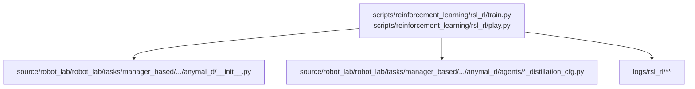
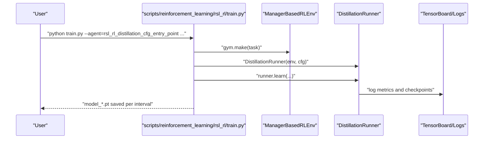
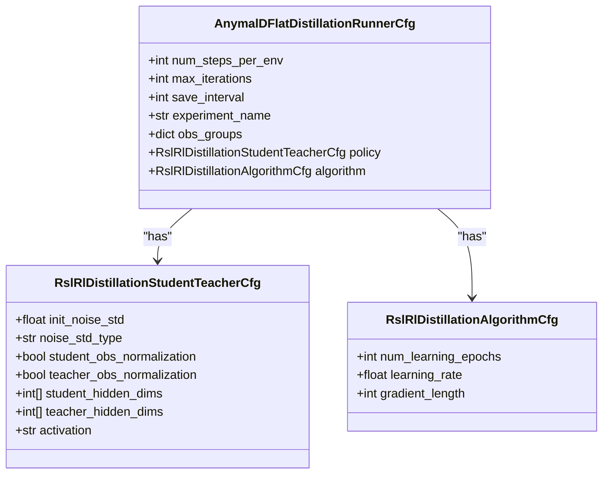
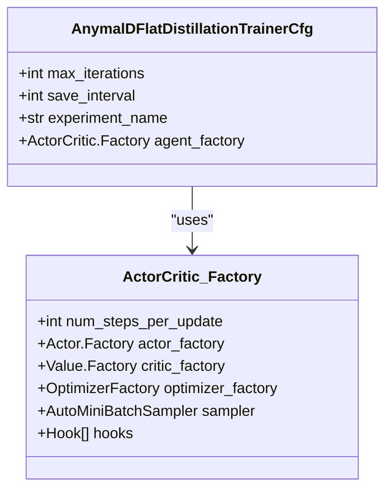
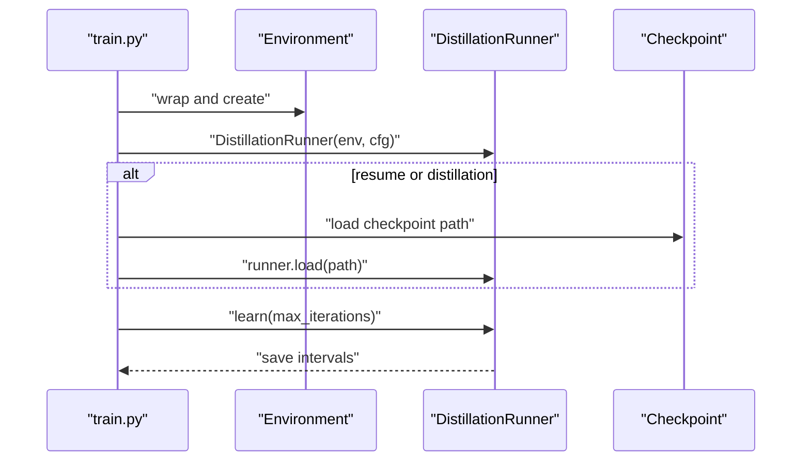
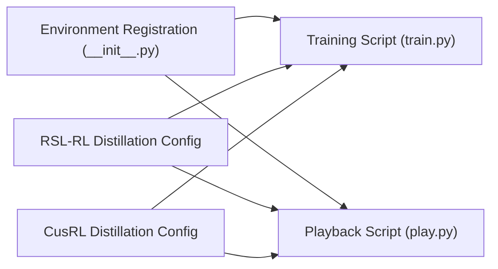

# Model Distillation Techniques

<cite>
**Referenced Files in This Document**
- [README.md](file://README.md)
- [train.py](file://scripts/reinforcement_learning/rsl_rl/train.py)
- [play.py](file://scripts/reinforcement_learning/rsl_rl/play.py)
- [rsl_rl_distillation_cfg.py](file://source/robot_lab/robot_lab/tasks/manager_based/locomotion/velocity/config/quadruped/anymal_d/agents/rsl_rl_distillation_cfg.py)
- [cusrl_distillation_cfg.py](file://source/robot_lab/robot_lab/tasks/manager_based/locomotion/velocity/config/quadruped/anymal_d/agents/cusrl_distillation_cfg.py)
- [__init__.py](file://source/robot_lab/robot_lab/tasks/manager_based/locomotion/velocity/config/quadruped/anymal_d/__init__.py)
</cite>

## Table of Contents
1. [Introduction](#introduction)
2. [Project Structure](#project-structure)
3. [Core Components](#core-components)
4. [Architecture Overview](#architecture-overview)
5. [Detailed Component Analysis](#detailed-component-analysis)
6. [Dependency Analysis](#dependency-analysis)
7. [Performance Considerations](#performance-considerations)
8. [Troubleshooting Guide](#troubleshooting-guide)
9. [Conclusion](#conclusion)
10. [Appendices](#appendices)

## Introduction
This document explains model distillation techniques implemented in the repository for knowledge transfer from a teacher agent to a student agent. It covers hierarchical learning where a pre-trained teacher policy guides the training of a student policy, and demonstrates how distillation integrates with on-policy reinforcement learning frameworks. Practical applications include transfer learning across similar quadruped robots and skill consolidation across environments. The document also outlines optimization strategies, trade-offs between training speed and policy quality, and the integration with different RL algorithms.

## Project Structure
The repository provides:
- Example environments and tasks for quadrupeds and other platforms
- Distillation configurations for RSL-RL and CusRL
- Training and playback scripts that support distillation workflows

**Diagram sources**
- [train.py](file://scripts/reinforcement_learning/rsl_rl/train.py#L117-L219)
- [play.py](file://scripts/reinforcement_learning/rsl_rl/play.py#L94-L191)
- [rsl_rl_distillation_cfg.py](file://source/robot_lab/robot_lab/tasks/manager_based/locomotion/velocity/config/quadruped/anymal_d/agents/rsl_rl_distillation_cfg.py#L18-L38)
- [cusrl_distillation_cfg.py](file://source/robot_lab/robot_lab/tasks/manager_based/locomotion/velocity/config/quadruped/anymal_d/agents/cusrl_distillation_cfg.py#L10-L34)
- [__init__.py](file://source/robot_lab/robot_lab/tasks/manager_based/locomotion/velocity/config/quadruped/anymal_d/__init__.py#L12-L31)

**Section sources**
- [README.md](file://README.md#L301-L312)
- [train.py](file://scripts/reinforcement_learning/rsl_rl/train.py#L117-L219)
- [play.py](file://scripts/reinforcement_learning/rsl_rl/play.py#L94-L191)
- [rsl_rl_distillation_cfg.py](file://source/robot_lab/robot_lab/tasks/manager_based/locomotion/velocity/config/quadruped/anymal_d/agents/rsl_rl_distillation_cfg.py#L18-L38)
- [cusrl_distillation_cfg.py](file://source/robot_lab/robot_lab/tasks/manager_based/locomotion/velocity/config/quadruped/anymal_d/agents/cusrl_distillation_cfg.py#L10-L34)
- [__init__.py](file://source/robot_lab/robot_lab/tasks/manager_based/locomotion/velocity/config/quadruped/anymal_d/__init__.py#L12-L31)

## Core Components
- Distillation Runner selection: The training and playback scripts select the DistillationRunner when the agent configuration indicates distillation, enabling teacher-student training.
- Distillation configurations:
  - RSL-RL distillation runner configuration defines observation groups, student/teacher network sizes, activation, and algorithm hyperparameters.
  - CusRL distillation trainer configuration defines actor/critic backbones, optimizer, sampling, and a policy distillation hook.
- Environment registration: The Anymal-D environments expose both standard and distillation agent entry points, enabling seamless switching between teacher-only and teacher-student training.

Key implementation references:
- Distillation runner selection and loading in training and playback scripts
- RSL-RL distillation runner configuration
- CusRL distillation trainer configuration
- Environment registration for distillation entry points

**Section sources**
- [train.py](file://scripts/reinforcement_learning/rsl_rl/train.py#L199-L212)
- [play.py](file://scripts/reinforcement_learning/rsl_rl/play.py#L180-L188)
- [rsl_rl_distillation_cfg.py](file://source/robot_lab/robot_lab/tasks/manager_based/locomotion/velocity/config/quadruped/anymal_d/agents/rsl_rl_distillation_cfg.py#L18-L38)
- [cusrl_distillation_cfg.py](file://source/robot_lab/robot_lab/tasks/manager_based/locomotion/velocity/config/quadruped/anymal_d/agents/cusrl_distillation_cfg.py#L10-L34)
- [__init__.py](file://source/robot_lab/robot_lab/tasks/manager_based/locomotion/velocity/config/quadruped/anymal_d/__init__.py#L19-L26)

## Architecture Overview
The distillation pipeline integrates with on-policy RL runners and supports two algorithmic stacks:
- RSL-RL: Uses DistillationRunner with configurable student/teacher networks and algorithm settings.
- CusRL: Uses a Trainer with hooks including a policy distillation hook.

**Diagram sources**
- [train.py](file://scripts/reinforcement_learning/rsl_rl/train.py#L117-L219)
- [__init__.py](file://source/robot_lab/robot_lab/tasks/manager_based/locomotion/velocity/config/quadruped/anymal_d/__init__.py#L12-L31)

## Detailed Component Analysis

### RSL-RL Distillation Runner Configuration
This configuration defines:
- Observation groups for policy and teacher
- Student and teacher network architectures (hidden dimensions and activation)
- Algorithm hyperparameters (learning epochs, learning rate, gradient length)
- Initialization and normalization settings

**Diagram sources**
- [rsl_rl_distillation_cfg.py](file://source/robot_lab/robot_lab/tasks/manager_based/locomotion/velocity/config/quadruped/anymal_d/agents/rsl_rl_distillation_cfg.py#L18-L38)

**Section sources**
- [rsl_rl_distillation_cfg.py](file://source/robot_lab/robot_lab/tasks/manager_based/locomotion/velocity/config/quadruped/anymal_d/agents/rsl_rl_distillation_cfg.py#L18-L38)

### CusRL Distillation Trainer Configuration
This configuration defines:
- Actor/backbone architecture (MLP with ELU activation)
- Distribution family for the actor
- Optimizer and sampling strategy
- Hooks including policy distillation and gradient clipping

**Diagram sources**
- [cusrl_distillation_cfg.py](file://source/robot_lab/robot_lab/tasks/manager_based/locomotion/velocity/config/quadruped/anymal_d/agents/cusrl_distillation_cfg.py#L10-L34)

**Section sources**
- [cusrl_distillation_cfg.py](file://source/robot_lab/robot_lab/tasks/manager_based/locomotion/velocity/config/quadruped/anymal_d/agents/cusrl_distillation_cfg.py#L10-L34)

### Training and Playback Workflows
- Training selects DistillationRunner when the agent configuration indicates distillation and loads a checkpoint if provided.
- Playback selects DistillationRunner to load a checkpoint and exports the policy for inference.

**Diagram sources**
- [train.py](file://scripts/reinforcement_learning/rsl_rl/train.py#L178-L219)
- [play.py](file://scripts/reinforcement_learning/rsl_rl/play.py#L180-L188)

**Section sources**
- [train.py](file://scripts/reinforcement_learning/rsl_rl/train.py#L178-L219)
- [play.py](file://scripts/reinforcement_learning/rsl_rl/play.py#L180-L188)

### Practical Applications and Examples
- Transfer learning between similar robot architectures:
  - Train a teacher on one flat terrain configuration and distill into a student on another similar quadruped robot.
  - Use the environment registration to switch between standard and distillation agent entry points.
- Skill consolidation across environments:
  - Train a teacher on a rough terrain and distill into a student on a flat terrain to accelerate learning.
- Example commands:
  - Train a teacher, distill into a student, and play the student using the documented commands.

**Section sources**
- [README.md](file://README.md#L301-L312)
- [__init__.py](file://source/robot_lab/robot_lab/tasks/manager_based/locomotion/velocity/config/quadruped/anymal_d/__init__.py#L12-L31)

## Dependency Analysis
- Environment registration exposes both standard and distillation agent entry points for the same task, enabling easy switching between teacher-only and teacher-student workflows.
- Training and playback scripts depend on the selected agent configuration to instantiate the appropriate runner (OnPolicyRunner vs DistillationRunner).
- Distillation configurations encapsulate algorithmic and architectural choices for student/teacher policies.

**Diagram sources**
- [__init__.py](file://source/robot_lab/robot_lab/tasks/manager_based/locomotion/velocity/config/quadruped/anymal_d/__init__.py#L12-L31)
- [rsl_rl_distillation_cfg.py](file://source/robot_lab/robot_lab/tasks/manager_based/locomotion/velocity/config/quadruped/anymal_d/agents/rsl_rl_distillation_cfg.py#L18-L38)
- [cusrl_distillation_cfg.py](file://source/robot_lab/robot_lab/tasks/manager_based/locomotion/velocity/config/quadruped/anymal_d/agents/cusrl_distillation_cfg.py#L10-L34)
- [train.py](file://scripts/reinforcement_learning/rsl_rl/train.py#L117-L219)
- [play.py](file://scripts/reinforcement_learning/rsl_rl/play.py#L94-L191)

**Section sources**
- [__init__.py](file://source/robot_lab/robot_lab/tasks/manager_based/locomotion/velocity/config/quadruped/anymal_d/__init__.py#L12-L31)
- [train.py](file://scripts/reinforcement_learning/rsl_rl/train.py#L117-L219)
- [play.py](file://scripts/reinforcement_learning/rsl_rl/play.py#L94-L191)

## Performance Considerations
- Training speed vs policy quality trade-offs:
  - Smaller student networks and fewer learning epochs can reduce training time but may limit policy quality.
  - Larger networks and more epochs improve quality at the cost of longer training.
- Gradient clipping and learning rate influence convergence stability and speed.
- Observation normalization toggles can affect stability during distillation; disabling normalization can simplify the setup when teacher and student share the same observation statistics.
- Batch sizing and mini-batch sampling impact throughput and sample efficiency.

[No sources needed since this section provides general guidance]

## Troubleshooting Guide
- Unsupported runner class:
  - Ensure the agent configuration’s class name matches the runner selection logic in the training/playback scripts.
- Checkpoint loading:
  - Confirm the checkpoint path resolution and that the checkpoint corresponds to a distillation run when using DistillationRunner.
- Environment mismatch:
  - Verify that the environment registration includes the distillation entry point for the chosen task.

**Section sources**
- [train.py](file://scripts/reinforcement_learning/rsl_rl/train.py#L200-L205)
- [play.py](file://scripts/reinforcement_learning/rsl_rl/play.py#L182-L187)

## Conclusion
The repository provides a structured implementation of model distillation for on-policy RL, supporting both RSL-RL and CusRL stacks. It enables hierarchical learning by transferring knowledge from a pre-trained teacher to a student agent, facilitating transfer learning across similar robots and skill consolidation across environments. The provided configurations and scripts offer a practical foundation for experimenting with distillation hyperparameters, observing trade-offs between training speed and policy quality, and integrating distillation with different RL algorithms.

## Appendices
- Example commands for training a teacher, distilling into a student, and playing the student are documented in the repository’s README.

**Section sources**
- [README.md](file://README.md#L301-L312)