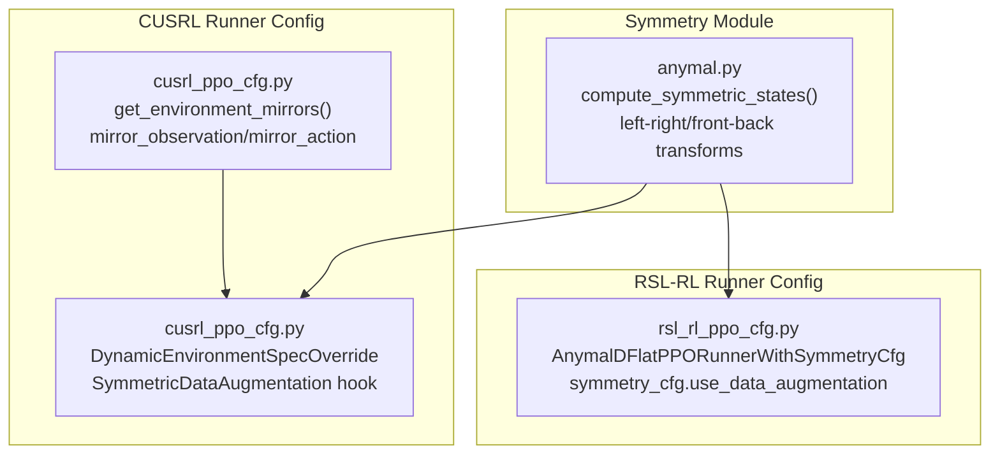
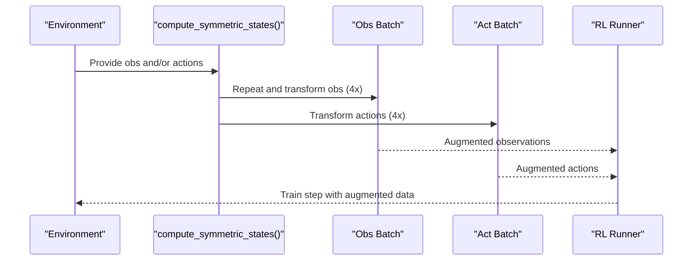
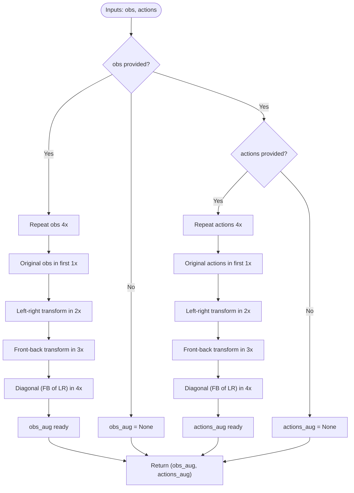
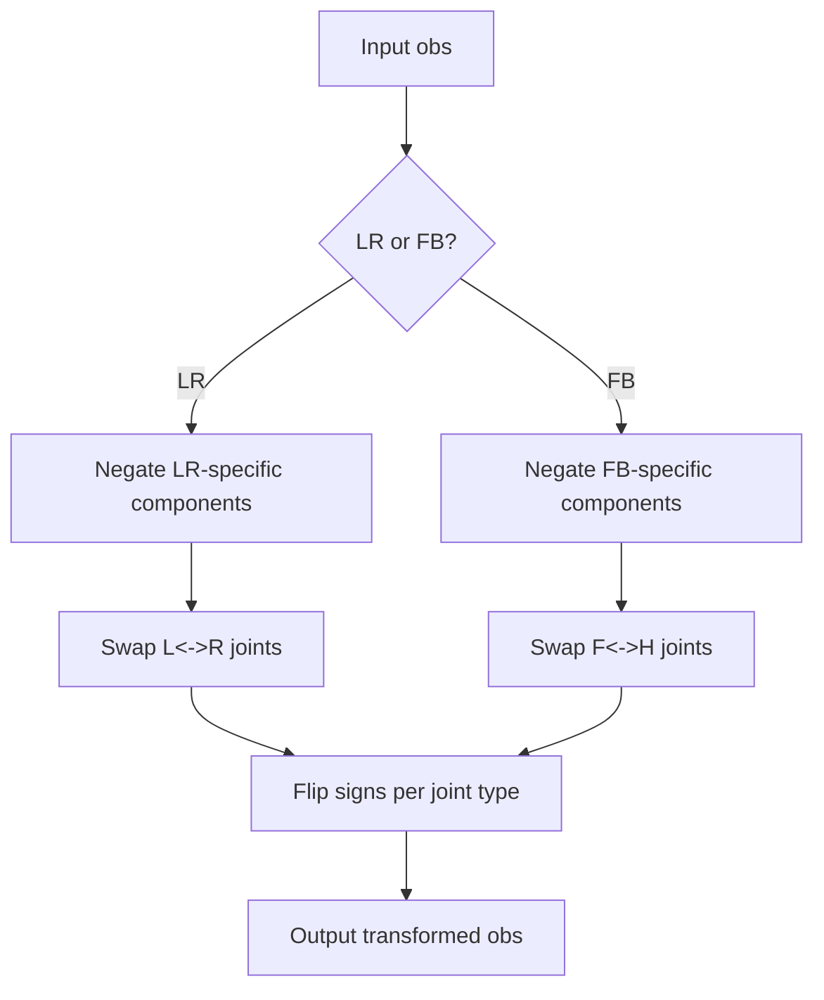
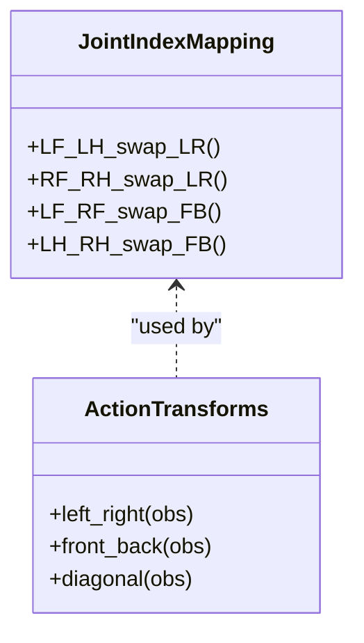
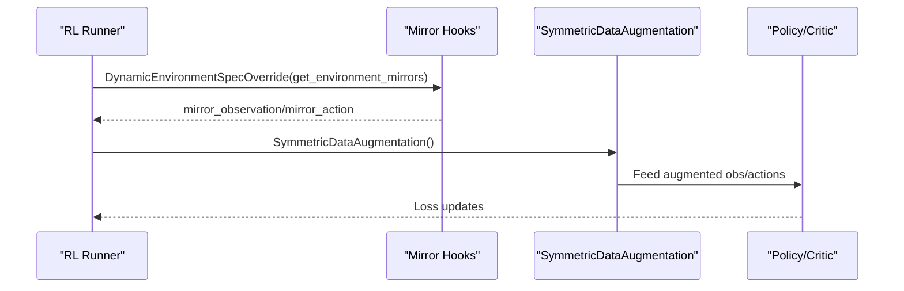
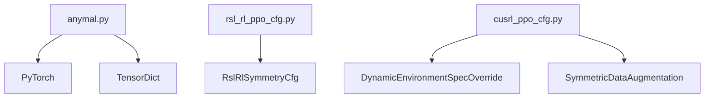

# Symmetry Data Augmentation

<cite>
**Referenced Files in This Document**
- [anymal.py](file://source/robot_lab/robot_lab/tasks/manager_based/locomotion/velocity/mdp/symmetry/anymal.py)
- [rsl_rl_ppo_cfg.py](file://source/robot_lab/robot_lab/tasks/manager_based/locomotion/velocity/config/quadruped/anymal_d/agents/rsl_rl_ppo_cfg.py)
- [cusrl_ppo_cfg.py](file://source/robot_lab/robot_lab/tasks/manager_based/locomotion/velocity/config/quadruped/anymal_d/agents/cusrl_ppo_cfg.py)
- [__init__.py](file://source/robot_lab/robot_lab/tasks/manager_based/locomotion/velocity/mdp/symmetry/__init__.py)
</cite>

## Table of Contents
1. [Introduction](#introduction)
2. [Project Structure](#project-structure)
3. [Core Components](#core-components)
4. [Architecture Overview](#architecture-overview)
5. [Detailed Component Analysis](#detailed-component-analysis)
6. [Dependency Analysis](#dependency-analysis)
7. [Performance Considerations](#performance-considerations)
8. [Troubleshooting Guide](#troubleshooting-guide)
9. [Conclusion](#conclusion)

## Introduction
This document explains the symmetry data augmentation feature designed for quadruped robots, with a focus on Anymal D locomotion training. It covers how reflection symmetries are mathematically modeled and applied to observations and actions, how the augmentation integrates into reinforcement learning pipelines, and how it improves training efficiency and policy generalization across terrains and gaits.

## Project Structure
The symmetry augmentation is implemented as a reusable module and integrated into runner configurations for two RL frameworks:
- RSL-RL: Uses a dedicated symmetry configuration object and a data augmentation function hook.
- CUSRL: Uses a dynamic environment override plus a symmetric data augmentation hook.

**Diagram sources**
- [anymal.py](file://source/robot_lab/robot_lab/tasks/manager_based/locomotion/velocity/mdp/symmetry/anymal.py#L25-L85)
- [rsl_rl_ppo_cfg.py](file://source/robot_lab/robot_lab/tasks/manager_based/locomotion/velocity/config/quadruped/anymal_d/agents/rsl_rl_ppo_cfg.py#L50-L94)
- [cusrl_ppo_cfg.py](file://source/robot_lab/robot_lab/tasks/manager_based/locomotion/velocity/config/quadruped/anymal_d/agents/cusrl_ppo_cfg.py#L52-L104)

**Section sources**
- [anymal.py](file://source/robot_lab/robot_lab/tasks/manager_based/locomotion/velocity/mdp/symmetry/anymal.py#L1-L252)
- [rsl_rl_ppo_cfg.py](file://source/robot_lab/robot_lab/tasks/manager_based/locomotion/velocity/config/quadruped/anymal_d/agents/rsl_rl_ppo_cfg.py#L1-L95)
- [cusrl_ppo_cfg.py](file://source/robot_lab/robot_lab/tasks/manager_based/locomotion/velocity/config/quadruped/anymal_d/agents/cusrl_ppo_cfg.py#L1-L111)

## Core Components
- Symmetry computation function: Applies four symmetry transformations (original, left-right, front-back, diagonal) to observations and actions.
- Observation transforms: Negates selected velocity and gravity components and swaps/reflects joint positions/velocities/actions according to left-right or front-back axes.
- Action transforms: Swaps joint indices and flips signs for HAA/HFE/KFE joints to mirror left-right or front-back symmetries.
- Runner integrations: Both RSL-RL and CUSRL runners enable symmetry-based data augmentation via configuration.

Key implementation references:
- [compute_symmetric_states](file://source/robot_lab/robot_lab/tasks/manager_based/locomotion/velocity/mdp/symmetry/anymal.py#L25-L85)
- [Observation transforms](file://source/robot_lab/robot_lab/tasks/manager_based/locomotion/velocity/mdp/symmetry/anymal.py#L93-L161)
- [Action transforms](file://source/robot_lab/robot_lab/tasks/manager_based/locomotion/velocity/mdp/symmetry/anymal.py#L169-L204)
- [Joint index swapping helpers](file://source/robot_lab/robot_lab/tasks/manager_based/locomotion/velocity/mdp/symmetry/anymal.py#L226-L251)

**Section sources**
- [anymal.py](file://source/robot_lab/robot_lab/tasks/manager_based/locomotion/velocity/mdp/symmetry/anymal.py#L25-L251)

## Architecture Overview
The symmetry augmentation pipeline augments batches by generating mirrored states and actions, then feeds them into the policy and value networks during training.

**Diagram sources**
- [anymal.py](file://source/robot_lab/robot_lab/tasks/manager_based/locomotion/velocity/mdp/symmetry/anymal.py#L25-L85)

## Detailed Component Analysis

### Symmetry Computation Function
- Purpose: Given an environment and optional observations/actions, produce fourfold augmented batches.
- Behavior:
  - Observations: Repeat the TensorDict 4 times; apply identity, left-right, front-back, and diagonal transforms.
  - Actions: Repeat the tensor 4 times; apply identity, left-right, front-back, and diagonal transforms.
- Outputs: Augmented observations and/or actions; returns None for whichever input was None.

References:
- [compute_symmetric_states](file://source/robot_lab/robot_lab/tasks/manager_based/locomotion/velocity/mdp/symmetry/anymal.py#L25-L85)

**Diagram sources**
- [anymal.py](file://source/robot_lab/robot_lab/tasks/manager_based/locomotion/velocity/mdp/symmetry/anymal.py#L25-L85)

**Section sources**
- [anymal.py](file://source/robot_lab/robot_lab/tasks/manager_based/locomotion/velocity/mdp/symmetry/anymal.py#L25-L85)

### Observation Symmetry Transforms
- Left-right transform:
  - Negates specific velocity/gravity components.
  - Swaps joint positions/velocities/actions between left and right sides.
  - Flips sign for HAA joints.
- Front-back transform:
  - Negates specific velocity/gravity components.
  - Swaps front and hind joint positions/velocities/actions.
  - Flips sign for HFE and KFE joints.

References:
- [Left-right transform](file://source/robot_lab/robot_lab/tasks/manager_based/locomotion/velocity/mdp/symmetry/anymal.py#L93-L126)
- [Front-back transform](file://source/robot_lab/robot_lab/tasks/manager_based/locomotion/velocity/mdp/symmetry/anymal.py#L129-L161)

**Diagram sources**
- [anymal.py](file://source/robot_lab/robot_lab/tasks/manager_based/locomotion/velocity/mdp/symmetry/anymal.py#L93-L161)

**Section sources**
- [anymal.py](file://source/robot_lab/robot_lab/tasks/manager_based/locomotion/velocity/mdp/symmetry/anymal.py#L93-L161)

### Action Symmetry Transforms
- Left-right and front-back transforms swap joint indices and flip signs for specific joints to mirror the body’s symmetry.
- Diagonal transform is LR followed by FB.

References:
- [Action transforms](file://source/robot_lab/robot_lab/tasks/manager_based/locomotion/velocity/mdp/symmetry/anymal.py#L169-L204)
- [Joint index swapping helpers](file://source/robot_lab/robot_lab/tasks/manager_based/locomotion/velocity/mdp/symmetry/anymal.py#L226-L251)

**Diagram sources**
- [anymal.py](file://source/robot_lab/robot_lab/tasks/manager_based/locomotion/velocity/mdp/symmetry/anymal.py#L226-L251)
- [anymal.py](file://source/robot_lab/robot_lab/tasks/manager_based/locomotion/velocity/mdp/symmetry/anymal.py#L169-L204)

**Section sources**
- [anymal.py](file://source/robot_lab/robot_lab/tasks/manager_based/locomotion/velocity/mdp/symmetry/anymal.py#L169-L251)

### Integration with Velocity-Based Locomotion Tasks
- RSL-RL integration:
  - Enables symmetry data augmentation via a dedicated configuration object and sets the augmentation function.
  - References:
    - [RSL-RL runner with symmetry](file://source/robot_lab/robot_lab/tasks/manager_based/locomotion/velocity/config/quadruped/anymal_d/agents/rsl_rl_ppo_cfg.py#L50-L94)
- CUSRL integration:
  - Provides dynamic environment mirrors for observations and actions.
  - Adds a symmetric data augmentation hook to the training pipeline.
  - References:
    - [CUSRL mirrors](file://source/robot_lab/robot_lab/tasks/manager_based/locomotion/velocity/config/quadruped/anymal_d/agents/cusrl_ppo_cfg.py#L52-L68)
    - [CUSRL symmetric augmentation hook](file://source/robot_lab/robot_lab/tasks/manager_based/locomotion/velocity/config/quadruped/anymal_d/agents/cusrl_ppo_cfg.py#L95)

**Diagram sources**
- [cusrl_ppo_cfg.py](file://source/robot_lab/robot_lab/tasks/manager_based/locomotion/velocity/config/quadruped/anymal_d/agents/cusrl_ppo_cfg.py#L52-L104)

**Section sources**
- [rsl_rl_ppo_cfg.py](file://source/robot_lab/robot_lab/tasks/manager_based/locomotion/velocity/config/quadruped/anymal_d/agents/rsl_rl_ppo_cfg.py#L50-L94)
- [cusrl_ppo_cfg.py](file://source/robot_lab/robot_lab/tasks/manager_based/locomotion/velocity/config/quadruped/anymal_d/agents/cusrl_ppo_cfg.py#L52-L104)

## Dependency Analysis
- The symmetry module depends on PyTorch for tensor operations and tensordict for structured observations.
- Runner configurations depend on framework-specific symmetry configuration objects and hooks.

**Diagram sources**
- [anymal.py](file://source/robot_lab/robot_lab/tasks/manager_based/locomotion/velocity/mdp/symmetry/anymal.py#L14-L16)
- [rsl_rl_ppo_cfg.py](file://source/robot_lab/robot_lab/tasks/manager_based/locomotion/velocity/config/quadruped/anymal_d/agents/rsl_rl_ppo_cfg.py#L8)
- [cusrl_ppo_cfg.py](file://source/robot_lab/robot_lab/tasks/manager_based/locomotion/velocity/config/quadruped/anymal_d/agents/cusrl_ppo_cfg.py#L8)

**Section sources**
- [anymal.py](file://source/robot_lab/robot_lab/tasks/manager_based/locomotion/velocity/mdp/symmetry/anymal.py#L14-L16)
- [rsl_rl_ppo_cfg.py](file://source/robot_lab/robot_lab/tasks/manager_based/locomotion/velocity/config/quadruped/anymal_d/agents/rsl_rl_ppo_cfg.py#L8)
- [cusrl_ppo_cfg.py](file://source/robot_lab/robot_lab/tasks/manager_based/locomotion/velocity/config/quadruped/anymal_d/agents/cusrl_ppo_cfg.py#L8)

## Performance Considerations
- Computational overhead: Generating fourfold augmented batches doubles memory usage during augmentation; batching strategies should account for this.
- GPU utilization: Leverage contiguous tensor operations and avoid unnecessary copies to minimize overhead.
- Reward shaping and generalization: Symmetry augmentation encourages policies to learn invariant features, potentially reducing training iterations and improving robustness across terrains and gaits.

## Troubleshooting Guide
- Incorrect joint indexing:
  - Verify joint order assumptions for HAA/HFE/KFE across LF/LH/RF/RH legs.
  - Reference: [Joint index mapping comments](file://source/robot_lab/robot_lab/tasks/manager_based/locomotion/velocity/mdp/symmetry/anymal.py#L207-L223)
- Mismatched observation shapes:
  - Ensure the observation tensor slice ranges match the environment’s policy observation layout.
  - Reference: [Observation transforms](file://source/robot_lab/robot_lab/tasks/manager_based/locomotion/velocity/mdp/symmetry/anymal.py#L93-L161)
- Action augmentation not applied:
  - Confirm that the runner configuration enables symmetry data augmentation and passes the correct function.
  - References:
    - [RSL-RL symmetry config](file://source/robot_lab/robot_lab/tasks/manager_based/locomotion/velocity/config/quadruped/anymal_d/agents/rsl_rl_ppo_cfg.py#L67-L70)
    - [CUSRL symmetric augmentation hook](file://source/robot_lab/robot_lab/tasks/manager_based/locomotion/velocity/config/quadruped/anymal_d/agents/cusrl_ppo_cfg.py#L95)

**Section sources**
- [anymal.py](file://source/robot_lab/robot_lab/tasks/manager_based/locomotion/velocity/mdp/symmetry/anymal.py#L207-L223)
- [anymal.py](file://source/robot_lab/robot_lab/tasks/manager_based/locomotion/velocity/mdp/symmetry/anymal.py#L93-L161)
- [rsl_rl_ppo_cfg.py](file://source/robot_lab/robot_lab/tasks/manager_based/locomotion/velocity/config/quadruped/anymal_d/agents/rsl_rl_ppo_cfg.py#L67-L70)
- [cusrl_ppo_cfg.py](file://source/robot_lab/robot_lab/tasks/manager_based/locomotion/velocity/config/quadruped/anymal_d/agents/cusrl_ppo_cfg.py#L95)

## Conclusion
The symmetry data augmentation feature leverages geometric reflection symmetries to expand the effective training dataset for quadruped locomotion. By mirroring observations and actions along left-right and front-back axes—and composing these to form diagonal symmetries—the policy learns to generalize across body symmetries and varied gaits. Integrated into both RSL-RL and CUSRL pipelines, this augmentation accelerates convergence and improves policy robustness across flat and rough terrains.