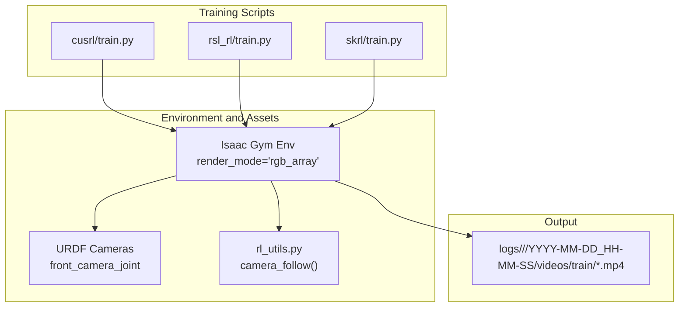
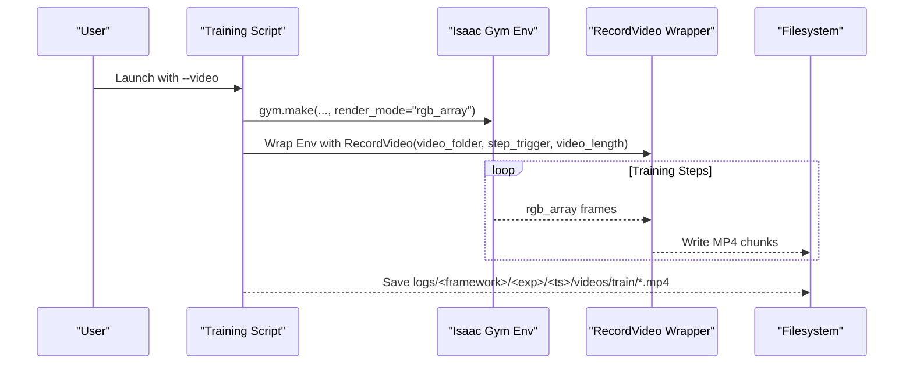
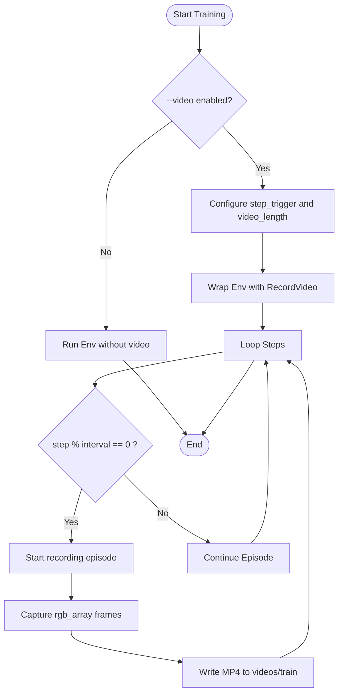
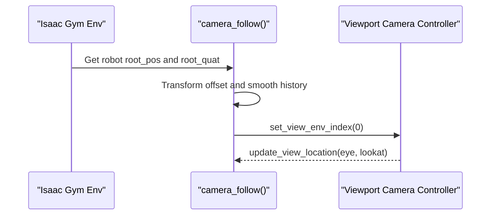
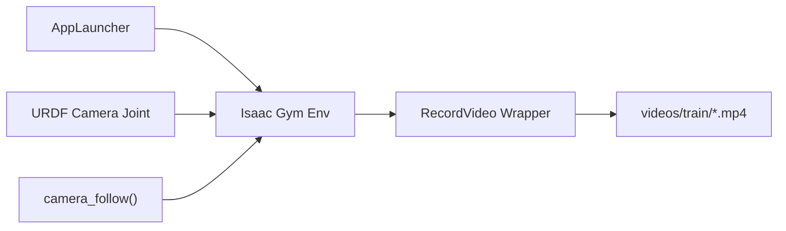

# Video Recording and Export

<cite>
**Referenced Files in This Document**
- [README.md](file://README.md)
- [cusrl/train.py](file://scripts/reinforcement_learning/cusrl/train.py)
- [rsl_rl/train.py](file://scripts/reinforcement_learning/rsl_rl/train.py)
- [skrl/train.py](file://scripts/reinforcement_learning/skrl/train.py)
- [rl_utils.py](file://scripts/reinforcement_learning/rl_utils.py)
- [go2_description.urdf](file://source/robot_lab/data/Robots/unitree/go2_description/urdf/go2_description.urdf)
- [cusrl_ppo_cfg.py](file://source/robot_lab/robot_lab/tasks/manager_based/locomotion/velocity/config/humanoid/openloong_loong/agents/cusrl_ppo_cfg.py)
- [fftai_gr1t1_ppo_cfg.py](file://source/robot_lab/robot_lab/tasks/manager_based/locomotion/velocity/config/humanoid/fftai_gr1t1/agents/cusrl_ppo_cfg.py)
- [fftai_gr1t2_ppo_cfg.py](file://source/robot_lab/robot_lab/tasks/manager_based/locomotion/velocity/config/humanoid/fftai_gr1t2/agents/cusrl_ppo_cfg.py)
</cite>

## Table of Contents
1. [Introduction](#introduction)
2. [Project Structure](#project-structure)
3. [Core Components](#core-components)
4. [Architecture Overview](#architecture-overview)
5. [Detailed Component Analysis](#detailed-component-analysis)
6. [Dependency Analysis](#dependency-analysis)
7. [Performance Considerations](#performance-considerations)
8. [Troubleshooting Guide](#troubleshooting-guide)
9. [Conclusion](#conclusion)
10. [Appendices](#appendices)

## Introduction
This document explains the video recording and export capabilities integrated into the training pipeline. It focuses on how automated video capture is enabled during training episodes, how camera positioning is handled, and how to optimize frame rate and resolution. It also documents export formats and compression options for research, presentations, and debugging workflows, along with storage optimization and metadata tracking for large-scale campaigns. Practical examples demonstrate configuration setup, export automation, and post-processing workflows, and it explains integrations with external visualization tools and annotation systems for performance analysis.

## Project Structure
The repository integrates video recording into three RL training scripts (CusRL, RSL-RL, SKRL), each wrapping the environment with a video recorder and organizing outputs under a standardized logs directory. Camera-related URDF definitions and utility functions support dynamic viewport control during training.

**Diagram sources**
- [cusrl/train.py](file://scripts/reinforcement_learning/cusrl/train.py#L103-L120)
- [rsl_rl/train.py](file://scripts/reinforcement_learning/rsl_rl/train.py#L171-L192)
- [skrl/train.py](file://scripts/reinforcement_learning/skrl/train.py#L203-L220)
- [go2_description.urdf](file://source/robot_lab/data/Robots/unitree/go2_description/urdf/go2_description.urdf#L754-L761)
- [rl_utils.py](file://scripts/reinforcement_learning/rl_utils.py#L9-L27)

**Section sources**
- [cusrl/train.py](file://scripts/reinforcement_learning/cusrl/train.py#L103-L120)
- [rsl_rl/train.py](file://scripts/reinforcement_learning/rsl_rl/train.py#L171-L192)
- [skrl/train.py](file://scripts/reinforcement_learning/skrl/train.py#L203-L220)
- [go2_description.urdf](file://source/robot_lab/data/Robots/unitree/go2_description/urdf/go2_description.urdf#L754-L761)
- [rl_utils.py](file://scripts/reinforcement_learning/rl_utils.py#L9-L27)

## Core Components
- Automated video capture during training:
  - CusRL: Wraps the environment with a video recorder when the video flag is enabled, using a step-triggered schedule and configurable video length.
  - RSL-RL: Similar wrapper with step-triggered recording and a dedicated videos/train folder.
  - SKRL: Same pattern with step-triggered recording and a dedicated videos/train folder.
- Camera positioning and viewport control:
  - URDF defines a front-facing camera joint attached to the robot base.
  - A utility function dynamically updates the viewport camera to follow the robot with smoothing.
- Output organization:
  - Videos are written under logs/<framework>/<experiment>/<timestamp>/videos/train as MP4 files.
- Export and compression:
  - The underlying Gymnasium RecordVideo wrapper produces MP4 files; compression is determined by the environment’s rendering backend and codec selection.

Practical configuration highlights:
- Enable video capture via CLI flags in each training script.
- Adjust video length and interval per use case.
- Use the camera_follow utility to stabilize the viewport during episodes.

**Section sources**
- [cusrl/train.py](file://scripts/reinforcement_learning/cusrl/train.py#L19-L21)
- [cusrl/train.py](file://scripts/reinforcement_learning/cusrl/train.py#L110-L120)
- [rsl_rl/train.py](file://scripts/reinforcement_learning/rsl_rl/train.py#L23-L25)
- [rsl_rl/train.py](file://scripts/reinforcement_learning/rsl_rl/train.py#L182-L192)
- [skrl/train.py](file://scripts/reinforcement_learning/skrl/train.py#L25-L27)
- [skrl/train.py](file://scripts/reinforcement_learning/skrl/train.py#L210-L220)
- [go2_description.urdf](file://source/robot_lab/data/Robots/unitree/go2_description/urdf/go2_description.urdf#L754-L761)
- [rl_utils.py](file://scripts/reinforcement_learning/rl_utils.py#L9-L27)

## Architecture Overview
The training pipeline integrates video recording through a shared pattern: environment creation with rgb_array render mode, optional video wrapper injection, and standardized output paths. The camera is positioned via URDF and optionally controlled by a viewport controller.

**Diagram sources**
- [cusrl/train.py](file://scripts/reinforcement_learning/cusrl/train.py#L103-L120)
- [rsl_rl/train.py](file://scripts/reinforcement_learning/rsl_rl/train.py#L171-L192)
- [skrl/train.py](file://scripts/reinforcement_learning/skrl/train.py#L203-L220)

## Detailed Component Analysis

### Automated Video Capture During Training
- Triggering:
  - Each training script accepts a video flag and sets render_mode to rgb_array accordingly.
  - A step-trigger function records episodes at fixed intervals.
- Output:
  - Videos are saved under a videos/train subfolder within the experiment log directory.
- Configuration:
  - video_length controls the number of steps captured per episode.
  - video_interval controls how often a new recording is started.

**Diagram sources**
- [cusrl/train.py](file://scripts/reinforcement_learning/cusrl/train.py#L19-L21)
- [cusrl/train.py](file://scripts/reinforcement_learning/cusrl/train.py#L110-L120)
- [rsl_rl/train.py](file://scripts/reinforcement_learning/rsl_rl/train.py#L23-L25)
- [rsl_rl/train.py](file://scripts/reinforcement_learning/rsl_rl/train.py#L182-L192)
- [skrl/train.py](file://scripts/reinforcement_learning/skrl/train.py#L25-L27)
- [skrl/train.py](file://scripts/reinforcement_learning/skrl/train.py#L210-L220)

**Section sources**
- [cusrl/train.py](file://scripts/reinforcement_learning/cusrl/train.py#L103-L120)
- [rsl_rl/train.py](file://scripts/reinforcement_learning/rsl_rl/train.py#L171-L192)
- [skrl/train.py](file://scripts/reinforcement_learning/skrl/train.py#L203-L220)

### Camera Positioning and Viewport Control
- Static camera:
  - A front-facing camera is attached to the robot base via a URDF joint, enabling a consistent perspective aligned with forward motion.
- Dynamic viewport:
  - A utility function computes a smoothed camera position behind the robot and updates the viewport controller to follow the robot, improving visualization stability.

**Diagram sources**
- [rl_utils.py](file://scripts/reinforcement_learning/rl_utils.py#L9-L27)
- [go2_description.urdf](file://source/robot_lab/data/Robots/unitree/go2_description/urdf/go2_description.urdf#L754-L761)

**Section sources**
- [rl_utils.py](file://scripts/reinforcement_learning/rl_utils.py#L9-L27)
- [go2_description.urdf](file://source/robot_lab/data/Robots/unitree/go2_description/urdf/go2_description.urdf#L754-L761)

### Export Formats and Compression Options
- Output format:
  - Videos are produced as MP4 files via the underlying Gymnasium RecordVideo wrapper.
- Compression:
  - Compression and codec selection depend on the rendering backend and environment configuration. The repository does not expose explicit compression parameters in the training scripts; consult environment-specific settings if further tuning is required.
- Use cases:
  - Research publication: Prefer higher fidelity exports; consider external post-processing for stabilization and annotations.
  - Presentation: Optimize for playback performance; consider re-encoding to a widely compatible codec.
  - Debugging: Keep original quality and frame rate; use shorter segments for quick iteration.

[No sources needed since this section provides general guidance]

### Integration with Training Pipelines and Computational Impact
- Integration:
  - Video recording is integrated early in the training loop, right after environment creation and optional environment conversion.
- Computational cost:
  - Rendering rgb_array frames adds GPU/CPU overhead proportional to frame rate, resolution, and video length.
  - Step-triggered recording reduces overhead by capturing only selected episodes.
- Recommendations:
  - Use moderate video_length and larger video_interval for long runs.
  - Disable video for evaluation-only runs to save compute.

**Section sources**
- [cusrl/train.py](file://scripts/reinforcement_learning/cusrl/train.py#L103-L120)
- [rsl_rl/train.py](file://scripts/reinforcement_learning/rsl_rl/train.py#L171-L192)
- [skrl/train.py](file://scripts/reinforcement_learning/skrl/train.py#L203-L220)

### Practical Examples

- Example 1: Enable video capture with CusRL
  - Launch training with the video flag and adjust interval and length:
    - Reference: [cusrl/train.py](file://scripts/reinforcement_learning/cusrl/train.py#L19-L21)
    - Wrapper configuration: [cusrl/train.py](file://scripts/reinforcement_learning/cusrl/train.py#L110-L120)
  - Outputs appear under logs/cusrl/<experiment>/<timestamp>/videos/train.

- Example 2: Enable video capture with RSL-RL
  - Launch training with the video flag and adjust interval and length:
    - Reference: [rsl_rl/train.py](file://scripts/reinforcement_learning/rsl_rl/train.py#L23-L25)
    - Wrapper configuration: [rsl_rl/train.py](file://scripts/reinforcement_learning/rsl_rl/train.py#L182-L192)
  - Outputs appear under logs/rsl_rl/<experiment>/<timestamp>/videos/train.

- Example 3: Enable video capture with SKRL
  - Launch training with the video flag and adjust interval and length:
    - Reference: [skrl/train.py](file://scripts/reinforcement_learning/skrl/train.py#L25-L27)
    - Wrapper configuration: [skrl/train.py](file://scripts/reinforcement_learning/skrl/train.py#L210-L220)
  - Outputs appear under logs/skrl/<experiment>/<timestamp>/videos/train.

- Example 4: Configure camera viewport for stable tracking
  - Call the camera_follow utility during episode loops to keep the camera centered on the robot:
    - Reference: [rl_utils.py](file://scripts/reinforcement_learning/rl_utils.py#L9-L27)

- Example 5: Post-processing workflows
  - Trim or concatenate videos using external tools.
  - Annotate with performance metrics or key events using external editors or scripts.

[No sources needed since this section aggregates references already cited above]

### Storage Optimization for Large-Scale Campaigns
- Output organization:
  - Videos are stored under timestamped experiment directories, facilitating organization and cleanup.
- Strategies:
  - Use step-triggered recording to limit frequency.
  - Reduce video_length for frequent checkpoints.
  - Archive or delete older runs after review.
  - Consider external storage for long-term retention.

**Section sources**
- [cusrl/train.py](file://scripts/reinforcement_learning/cusrl/train.py#L112-L113)
- [rsl_rl/train.py](file://scripts/reinforcement_learning/rsl_rl/train.py#L184-L185)
- [skrl/train.py](file://scripts/reinforcement_learning/skrl/train.py#L212-L213)

### Metadata Tracking for Experiment Organization
- Directory structure:
  - logs/<framework>/<experiment>/<timestamp> provides a consistent hierarchy for organizing runs.
- Additional metadata:
  - Environment and agent configurations are dumped into params subfolders for reproducibility.
- Integration with external tools:
  - Use timestamps and experiment names to correlate videos with training logs and tensorboard summaries.

**Section sources**
- [cusrl/train.py](file://scripts/reinforcement_learning/cusrl/train.py#L94-L101)
- [rsl_rl/train.py](file://scripts/reinforcement_learning/rsl_rl/train.py#L148-L158)
- [skrl/train.py](file://scripts/reinforcement_learning/skrl/train.py#L169-L183)
- [rsl_rl/train.py](file://scripts/reinforcement_learning/rsl_rl/train.py#L214-L216)

### Integration with External Visualization Tools and Annotation Systems
- External tools:
  - Use external editors or libraries to trim, annotate, and composite videos.
  - Combine with performance metrics logged by the RL frameworks for synchronized analysis.
- Annotation systems:
  - Annotate key actions or policy decisions by post-processing frames or overlaying metrics.
- Environment compatibility:
  - The repository supports multiple RL frameworks; ensure the chosen framework’s environment configuration aligns with desired visualization needs.

[No sources needed since this section provides general guidance]

## Dependency Analysis
The training scripts share a common dependency chain: AppLauncher initializes the simulator, the environment is created with rgb_array render mode, and the environment is wrapped with RecordVideo when video is enabled. Camera definitions and viewport utilities support visualization stability.

**Diagram sources**
- [cusrl/train.py](file://scripts/reinforcement_learning/cusrl/train.py#L103-L120)
- [rsl_rl/train.py](file://scripts/reinforcement_learning/rsl_rl/train.py#L171-L192)
- [skrl/train.py](file://scripts/reinforcement_learning/skrl/train.py#L203-L220)
- [go2_description.urdf](file://source/robot_lab/data/Robots/unitree/go2_description/urdf/go2_description.urdf#L754-L761)
- [rl_utils.py](file://scripts/reinforcement_learning/rl_utils.py#L9-L27)

**Section sources**
- [cusrl/train.py](file://scripts/reinforcement_learning/cusrl/train.py#L103-L120)
- [rsl_rl/train.py](file://scripts/reinforcement_learning/rsl_rl/train.py#L171-L192)
- [skrl/train.py](file://scripts/reinforcement_learning/skrl/train.py#L203-L220)
- [go2_description.urdf](file://source/robot_lab/data/Robots/unitree/go2_description/urdf/go2_description.urdf#L754-L761)
- [rl_utils.py](file://scripts/reinforcement_learning/rl_utils.py#L9-L27)

## Performance Considerations
- Rendering cost:
  - Capturing rgb_array frames increases GPU utilization; tune video_length and interval to balance fidelity and throughput.
- Frame rate and resolution:
  - The environment’s rendering backend determines frame rate and resolution; adjust environment settings if higher fidelity is required.
- Distributed training:
  - Ensure video recording is coordinated across processes; the CusRL example restricts recording to the main process.

[No sources needed since this section provides general guidance]

## Troubleshooting Guide
- Videos not being recorded:
  - Verify the video flag is set and render_mode is rgb_array.
  - Confirm the step trigger condition and video length are appropriate.
  - References: [cusrl/train.py](file://scripts/reinforcement_learning/cusrl/train.py#L19-L21), [cusrl/train.py](file://scripts/reinforcement_learning/cusrl/train.py#L110-L120), [rsl_rl/train.py](file://scripts/reinforcement_learning/rsl_rl/train.py#L23-L25), [skrl/train.py](file://scripts/reinforcement_learning/skrl/train.py#L25-L27)
- Empty or corrupted videos:
  - Check environment rendering settings and ensure sufficient disk space.
  - Validate the video folder path and permissions.
  - References: [cusrl/train.py](file://scripts/reinforcement_learning/cusrl/train.py#L112-L113), [rsl_rl/train.py](file://scripts/reinforcement_learning/rsl_rl/train.py#L184-L185), [skrl/train.py](file://scripts/reinforcement_learning/skrl/train.py#L212-L213)
- Camera view instability:
  - Use the camera_follow utility to smooth the viewport.
  - References: [rl_utils.py](file://scripts/reinforcement_learning/rl_utils.py#L9-L27)

**Section sources**
- [cusrl/train.py](file://scripts/reinforcement_learning/cusrl/train.py#L19-L21)
- [cusrl/train.py](file://scripts/reinforcement_learning/cusrl/train.py#L110-L120)
- [rsl_rl/train.py](file://scripts/reinforcement_learning/rsl_rl/train.py#L23-L25)
- [skrl/train.py](file://scripts/reinforcement_learning/skrl/train.py#L25-L27)
- [cusrl/train.py](file://scripts/reinforcement_learning/cusrl/train.py#L112-L113)
- [rsl_rl/train.py](file://scripts/reinforcement_learning/rsl_rl/train.py#L184-L185)
- [skrl/train.py](file://scripts/reinforcement_learning/skrl/train.py#L212-L213)
- [rl_utils.py](file://scripts/reinforcement_learning/rl_utils.py#L9-L27)

## Conclusion
The repository provides a robust, framework-agnostic mechanism for automated video capture during RL training. By enabling the video flag, configuring step-triggered recording, and leveraging camera utilities, users can produce high-quality, organized video outputs suitable for research, presentations, and debugging. With careful tuning of video length and interval, and by adopting sound storage and metadata practices, teams can scale video capture across large training campaigns while maintaining performance and traceability.

[No sources needed since this section summarizes without analyzing specific files]

## Appendices

### Appendix A: Environment Names and Categories
- The repository includes a comprehensive list of environments across categories such as quadrupeds, wheeled robots, and humanoids, each with associated screenshots and environment names for quick identification.

**Section sources**
- [README.md](file://README.md#L15-L41)

### Appendix B: Agent Configuration Examples
- Example agent configurations for humanoid locomotion tasks illustrate experiment naming and training parameters that complement video capture workflows.

**Section sources**
- [cusrl_ppo_cfg.py](file://source/robot_lab/robot_lab/tasks/manager_based/locomotion/velocity/config/humanoid/openloong_loong/agents/cusrl_ppo_cfg.py#L10-L48)
- [fftai_gr1t1_ppo_cfg.py](file://source/robot_lab/robot_lab/tasks/manager_based/locomotion/velocity/config/humanoid/fftai_gr1t1/agents/cusrl_ppo_cfg.py#L10-L48)
- [fftai_gr1t2_ppo_cfg.py](file://source/robot_lab/robot_lab/tasks/manager_based/locomotion/velocity/config/humanoid/fftai_gr1t2/agents/cusrl_ppo_cfg.py#L10-L48)