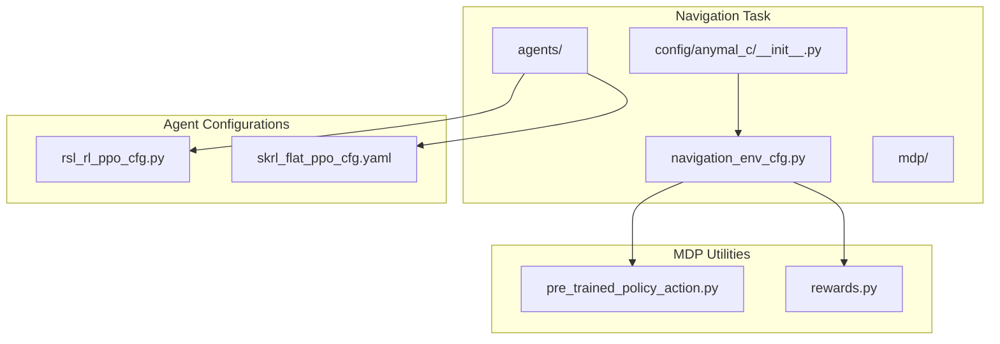
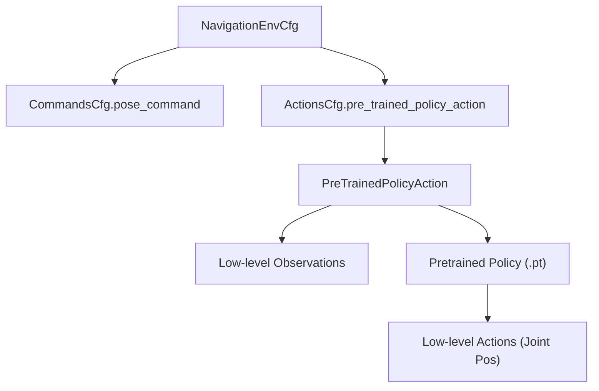
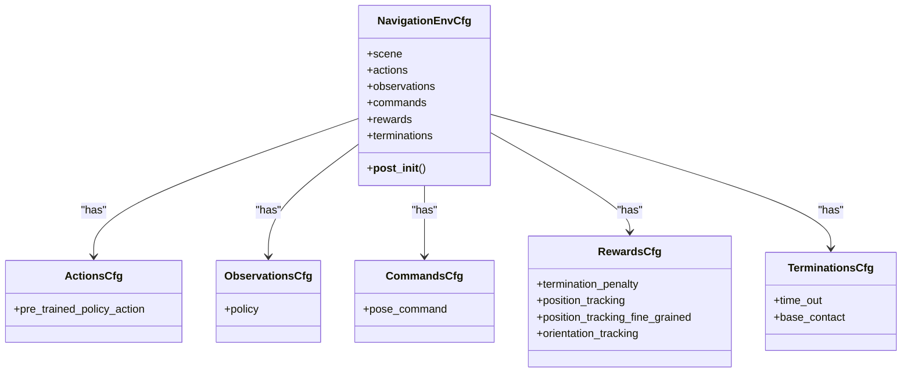
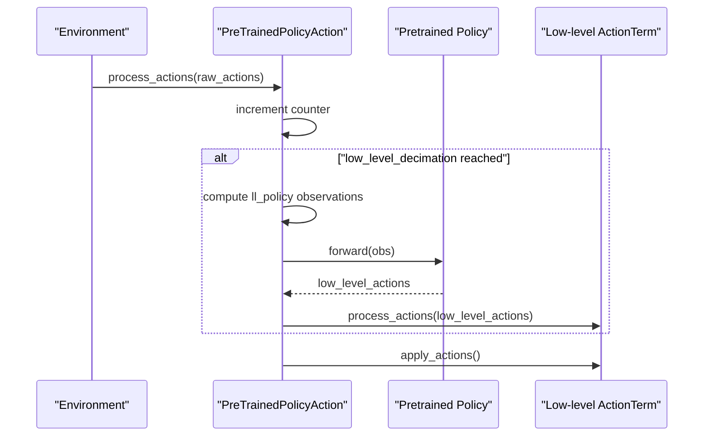
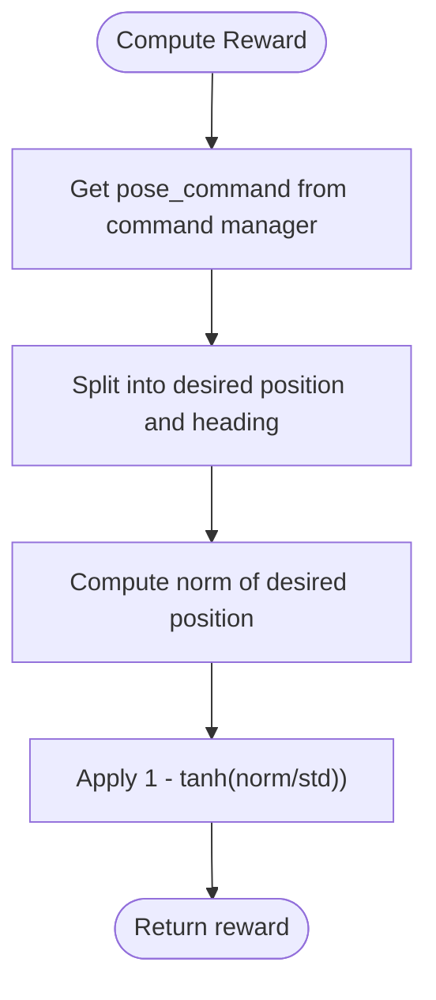
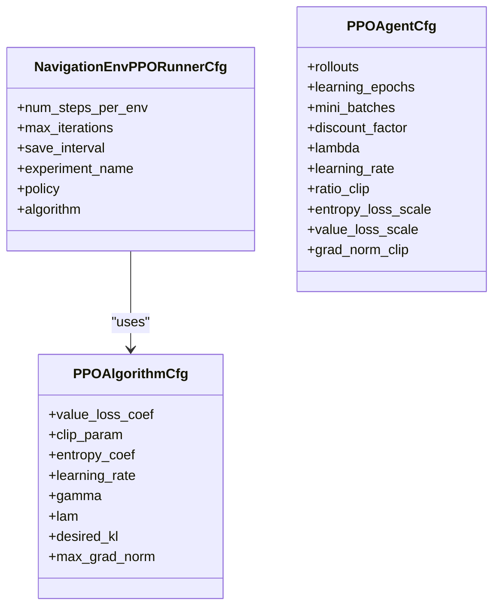
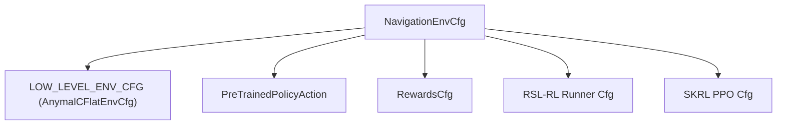

# Anymal-C Navigation

<cite>
**Referenced Files in This Document**
- [README.md](file://README.md)
- [navigation_env_cfg.py](file://source/robot_lab/robot_lab/tasks/manager_based/navigation/config/anymal_c/navigation_env_cfg.py)
- [rsl_rl_ppo_cfg.py](file://source/robot_lab/robot_lab/tasks/manager_based/navigation/config/anymal_c/agents/rsl_rl_ppo_cfg.py)
- [skrl_flat_ppo_cfg.yaml](file://source/robot_lab/robot_lab/tasks/manager_based/navigation/config/anymal_c/agents/skrl_flat_ppo_cfg.yaml)
- [pre_trained_policy_action.py](file://source/robot_lab/robot_lab/tasks/manager_based/navigation/mdp/pre_trained_policy_action.py)
- [rewards.py](file://source/robot_lab/robot_lab/tasks/manager_based/navigation/mdp/rewards.py)
- [__init__.py](file://source/robot_lab/robot_lab/tasks/manager_based/navigation/config/anymal_c/__init__.py)
- [train.py](file://scripts/reinforcement_learning/rsl_rl/train.py)
</cite>

## Table of Contents
1. [Introduction](#introduction)
2. [Project Structure](#project-structure)
3. [Core Components](#core-components)
4. [Architecture Overview](#architecture-overview)
5. [Detailed Component Analysis](#detailed-component-analysis)
6. [Dependency Analysis](#dependency-analysis)
7. [Performance Considerations](#performance-considerations)
8. [Troubleshooting Guide](#troubleshooting-guide)
9. [Conclusion](#conclusion)

## Introduction
This document describes the Anymal-C Navigation system within the robot_lab repository. The navigation capability is implemented as a manager-based reinforcement learning environment that leverages a pretrained low-level policy to control the quadruped robot. The high-level policy learns to track 2D pose commands (position and heading) while the low-level policy executes joint positions to achieve the desired base motion. The system integrates with Isaac Lab's environment manager and supports training and playback using RSL-RL and SKRL frameworks.

## Project Structure
The Anymal-C Navigation implementation is organized under the navigation task module with configuration and MDP components:

- Environment configuration: Defines the high-level policy observations, actions, rewards, commands, and terminations.
- Agent configurations: Provide training hyperparameters for RSL-RL and SKRL.
- MDP utilities: Implement the pretrained policy action term and reward functions.
- Environment registration: Exposes Gym-compatible environments for training and playback.

**Diagram sources**
- [navigation_env_cfg.py:121-160](file://source/robot_lab/robot_lab/tasks/manager_based/navigation/config/anymal_c/navigation_env_cfg.py#L121-L160)
- [rsl_rl_ppo_cfg.py:11-39](file://source/robot_lab/robot_lab/tasks/manager_based/navigation/config/anymal_c/agents/rsl_rl_ppo_cfg.py#L11-L39)
- [skrl_flat_ppo_cfg.yaml:11-86](file://source/robot_lab/robot_lab/tasks/manager_based/navigation/config/anymal_c/agents/skrl_flat_ppo_cfg.yaml#L11-L86)
- [pre_trained_policy_action.py:24-189](file://source/robot_lab/robot_lab/tasks/manager_based/navigation/mdp/pre_trained_policy_action.py#L24-L189)
- [rewards.py:15-28](file://source/robot_lab/robot_lab/tasks/manager_based/navigation/mdp/rewards.py#L15-L28)
- [__init__.py:14-34](file://source/robot_lab/robot_lab/tasks/manager_based/navigation/config/anymal_c/__init__.py#L14-L34)

**Section sources**
- [navigation_env_cfg.py:1-161](file://source/robot_lab/robot_lab/tasks/manager_based/navigation/config/anymal_c/navigation_env_cfg.py#L1-L161)
- [__init__.py:1-35](file://source/robot_lab/robot_lab/tasks/manager_based/navigation/config/anymal_c/__init__.py#L1-L35)

## Core Components
- Navigation environment configuration: Encapsulates scene, actions, observations, commands, rewards, and terminations tailored for Anymal-C navigation.
- Pretrained policy action term: Bridges high-level commands to low-level joint actions using a pretrained policy loaded from a .pt file.
- Reward functions: Provide position tracking and orientation error penalties for navigation.
- Agent configurations: Define neural network architectures and PPO hyperparameters for training with RSL-RL and SKRL.

Key implementation references:
- Environment configuration class and post-initialization logic: [navigation_env_cfg.py:121-160](file://source/robot_lab/robot_lab/tasks/manager_based/navigation/config/anymal_c/navigation_env_cfg.py#L121-L160)
- Pretrained policy action term class and configuration: [pre_trained_policy_action.py:24-189](file://source/robot_lab/robot_lab/tasks/manager_based/navigation/mdp/pre_trained_policy_action.py#L24-L189)
- Reward implementations: [rewards.py:15-28](file://source/robot_lab/robot_lab/tasks/manager_based/navigation/mdp/rewards.py#L15-L28)
- Agent configurations for RSL-RL and SKRL: [rsl_rl_ppo_cfg.py:11-39](file://source/robot_lab/robot_lab/tasks/manager_based/navigation/config/anymal_c/agents/rsl_rl_ppo_cfg.py#L11-L39), [skrl_flat_ppo_cfg.yaml:11-86](file://source/robot_lab/robot_lab/tasks/manager_based/navigation/config/anymal_c/agents/skrl_flat_ppo_cfg.yaml#L11-L86)

**Section sources**
- [navigation_env_cfg.py:121-160](file://source/robot_lab/robot_lab/tasks/manager_based/navigation/config/anymal_c/navigation_env_cfg.py#L121-L160)
- [pre_trained_policy_action.py:24-189](file://source/robot_lab/robot_lab/tasks/manager_based/navigation/mdp/pre_trained_policy_action.py#L24-L189)
- [rewards.py:15-28](file://source/robot_lab/robot_lab/tasks/manager_based/navigation/mdp/rewards.py#L15-L28)
- [rsl_rl_ppo_cfg.py:11-39](file://source/robot_lab/robot_lab/tasks/manager_based/navigation/config/anymal_c/agents/rsl_rl_ppo_cfg.py#L11-L39)
- [skrl_flat_ppo_cfg.yaml:11-86](file://source/robot_lab/robot_lab/tasks/manager_based/navigation/config/anymal_c/agents/skrl_flat_ppo_cfg.yaml#L11-L86)

## Architecture Overview
The navigation system uses a two-tier control architecture:
- High-level policy: Receives 2D pose commands and outputs low-level velocity commands.
- Low-level policy: A pretrained policy that maps low-level observations to joint positions, executed at a lower frequency controlled by decimation.

**Diagram sources**
- [navigation_env_cfg.py:46-56](file://source/robot_lab/robot_lab/tasks/manager_based/navigation/config/anymal_c/navigation_env_cfg.py#L46-L56)
- [pre_trained_policy_action.py:35-100](file://source/robot_lab/robot_lab/tasks/manager_based/navigation/mdp/pre_trained_policy_action.py#L35-L100)

**Section sources**
- [navigation_env_cfg.py:46-56](file://source/robot_lab/robot_lab/tasks/manager_based/navigation/config/anymal_c/navigation_env_cfg.py#L46-L56)
- [pre_trained_policy_action.py:35-100](file://source/robot_lab/robot_lab/tasks/manager_based/navigation/mdp/pre_trained_policy_action.py#L35-L100)

## Detailed Component Analysis

### Navigation Environment Configuration
The environment configuration defines:
- Scene: Inherits from a low-level Anymal-C flat configuration.
- Actions: Uses a pretrained policy action term that wraps low-level actions and observations.
- Observations: Provides base linear velocity, projected gravity, and pose commands for the policy.
- Commands: Uniform 2D pose command generator with configurable resampling period and ranges.
- Rewards: Termination penalty, position tracking (with two variants), and orientation error.
- Terminations: Episode timeout and illegal contact detection.
- Post-initialization: Sets simulation timestep, render interval, episode length, and sensor update periods.

**Diagram sources**
- [navigation_env_cfg.py:121-160](file://source/robot_lab/robot_lab/tasks/manager_based/navigation/config/anymal_c/navigation_env_cfg.py#L121-L160)

**Section sources**
- [navigation_env_cfg.py:121-160](file://source/robot_lab/robot_lab/tasks/manager_based/navigation/config/anymal_c/navigation_env_cfg.py#L121-L160)

### Pretrained Policy Action Term
The pretrained policy action term:
- Loads a JIT-compiled policy from a .pt file.
- Applies the policy at a decimated frequency to produce low-level actions.
- Remaps low-level observations to feed the pretrained policy.
- Supports debug visualization of desired vs. achieved base velocities.

**Diagram sources**
- [pre_trained_policy_action.py:90-100](file://source/robot_lab/robot_lab/tasks/manager_based/navigation/mdp/pre_trained_policy_action.py#L90-L100)

**Section sources**
- [pre_trained_policy_action.py:24-189](file://source/robot_lab/robot_lab/tasks/manager_based/navigation/mdp/pre_trained_policy_action.py#L24-L189)

### Reward Functions
Reward implementations:
- Position tracking reward using a tanh kernel with configurable standard deviation.
- Orientation error penalty using absolute heading difference.

**Diagram sources**
- [rewards.py:15-28](file://source/robot_lab/robot_lab/tasks/manager_based/navigation/mdp/rewards.py#L15-L28)

**Section sources**
- [rewards.py:15-28](file://source/robot_lab/robot_lab/tasks/manager_based/navigation/mdp/rewards.py#L15-L28)

### Agent Configurations
RSL-RL configuration:
- On-policy runner with PPO algorithm.
- Neural network architecture with ELU activation and shared hidden layers.
- Hyperparameters tuned for stable training.

SKRL configuration:
- PPO agent with KL-adaptive learning rate scheduler.
- Memory and trainer settings for sequential training.

**Diagram sources**
- [rsl_rl_ppo_cfg.py:11-39](file://source/robot_lab/robot_lab/tasks/manager_based/navigation/config/anymal_c/agents/rsl_rl_ppo_cfg.py#L11-L39)
- [skrl_flat_ppo_cfg.yaml:44-86](file://source/robot_lab/robot_lab/tasks/manager_based/navigation/config/anymal_c/agents/skrl_flat_ppo_cfg.yaml#L44-L86)

**Section sources**
- [rsl_rl_ppo_cfg.py:11-39](file://source/robot_lab/robot_lab/tasks/manager_based/navigation/config/anymal_c/agents/rsl_rl_ppo_cfg.py#L11-L39)
- [skrl_flat_ppo_cfg.yaml:44-86](file://source/robot_lab/robot_lab/tasks/manager_based/navigation/config/anymal_c/agents/skrl_flat_ppo_cfg.yaml#L44-L86)

## Dependency Analysis
The navigation environment depends on:
- Low-level Anymal-C flat environment configuration for base settings.
- Pretrained policy action term for bridging high-level commands to low-level actions.
- Reward functions for shaping navigation behavior.
- Agent configurations for training with RSL-RL and SKRL.

**Diagram sources**
- [navigation_env_cfg.py:18-21](file://source/robot_lab/robot_lab/tasks/manager_based/navigation/config/anymal_c/navigation_env_cfg.py#L18-L21)
- [navigation_env_cfg.py:121-160](file://source/robot_lab/robot_lab/tasks/manager_based/navigation/config/anymal_c/navigation_env_cfg.py#L121-L160)

**Section sources**
- [navigation_env_cfg.py:18-21](file://source/robot_lab/robot_lab/tasks/manager_based/navigation/config/anymal_c/navigation_env_cfg.py#L18-L21)
- [navigation_env_cfg.py:121-160](file://source/robot_lab/robot_lab/tasks/manager_based/navigation/config/anymal_c/navigation_env_cfg.py#L121-L160)

## Performance Considerations
- Decimation scheduling: The pretrained policy is evaluated at a lower frequency than the high-level policy to reduce computational overhead while maintaining responsiveness.
- Observation normalization: The configuration disables actor and critic observation normalization, which can simplify training but requires careful observation scaling.
- Episode length and resampling: Episode duration aligns with command resampling intervals, ensuring stable target updates for navigation.

[No sources needed since this section provides general guidance]

## Troubleshooting Guide
Common issues and resolutions:
- Policy file not found: Ensure the pretrained policy path exists and is accessible by the environment.
- Incorrect device configuration for distributed training: Distributed training requires a GPU device setting; CPU devices are not supported for distributed runs.
- Visualization markers: Debug visualization toggles marker visibility; ensure the robot is initialized before rendering.

**Section sources**
- [pre_trained_policy_action.py:42-46](file://source/robot_lab/robot_lab/tasks/manager_based/navigation/mdp/pre_trained_policy_action.py#L42-L46)
- [train.py:147-151](file://scripts/reinforcement_learning/rsl_rl/train.py#L147-L151)
- [pre_trained_policy_action.py:106-134](file://source/robot_lab/robot_lab/tasks/manager_based/navigation/mdp/pre_trained_policy_action.py#L106-L134)

## Conclusion
The Anymal-C Navigation system demonstrates a practical two-tier RL architecture where a pretrained low-level policy handles joint control while a high-level policy learns to track 2D pose commands. The modular design enables straightforward training and deployment using RSL-RL and SKRL, with clear separation between environment configuration, action bridging, and reward shaping.