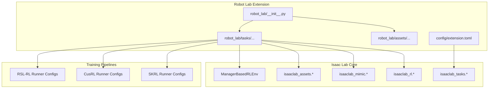
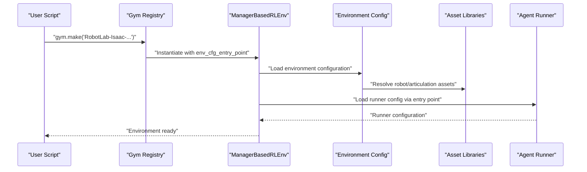
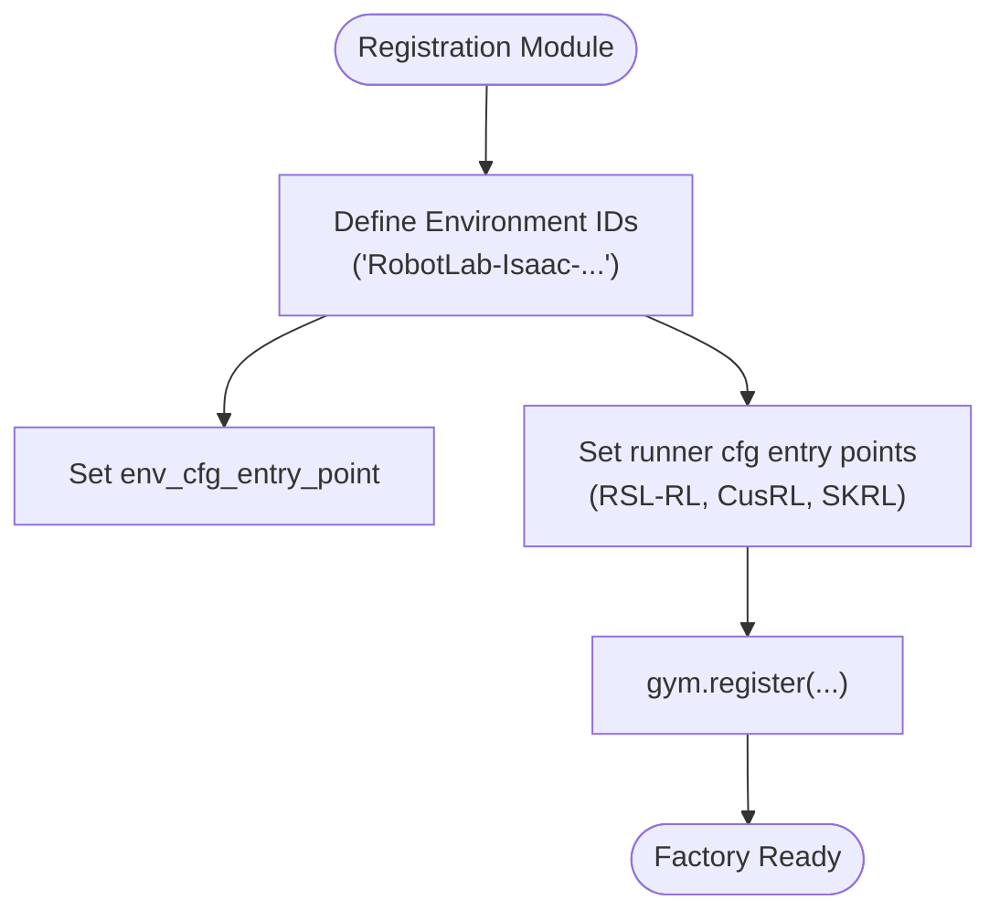
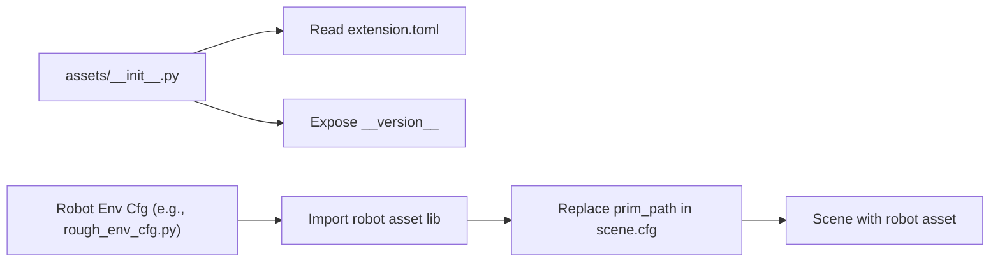
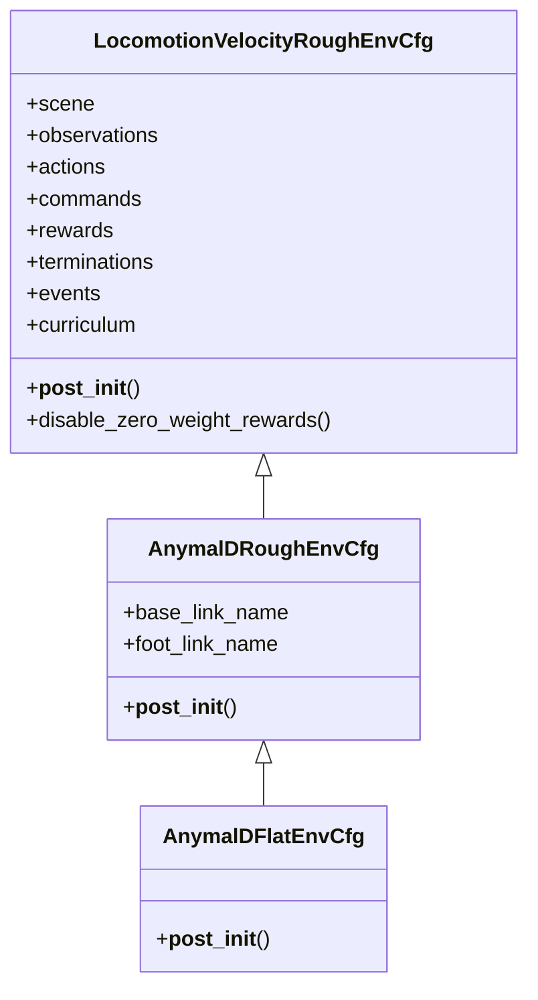
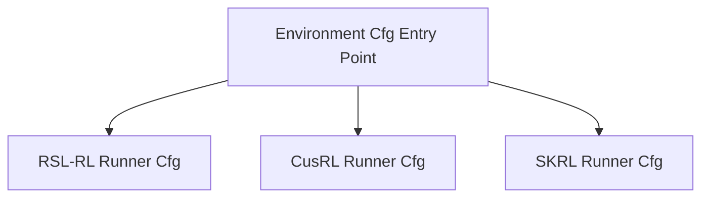
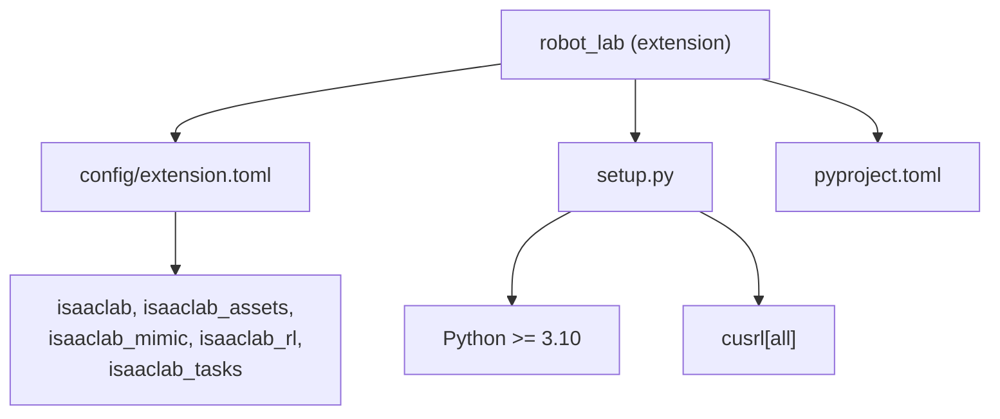
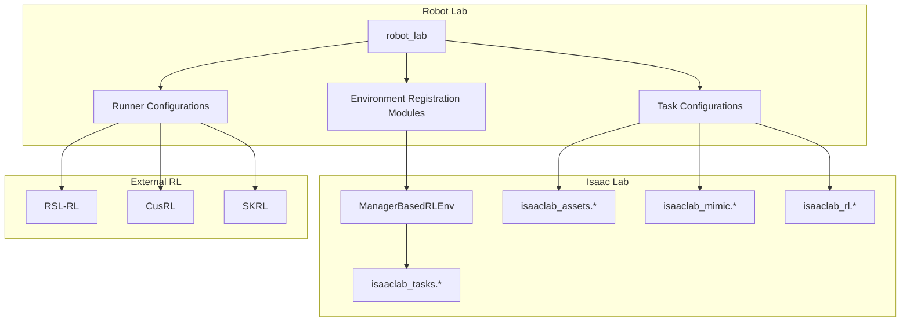

# Architecture Overview

<cite>
**Referenced Files in This Document**
- [README.md](file://README.md)
- [setup.py](file://source/robot_lab/setup.py)
- [pyproject.toml](file://source/robot_lab/pyproject.toml)
- [extension.toml](file://source/robot_lab/config/extension.toml)
- [__init__.py](file://source/robot_lab/robot_lab/__init__.py)
- [assets/__init__.py](file://source/robot_lab/robot_lab/assets/__init__.py)
- [velocity_env_cfg.py](file://source/robot_lab/robot_lab/tasks/manager_based/locomotion/velocity/velocity_env_cfg.py)
- [anymal_d/__init__.py](file://source/robot_lab/robot_lab/tasks/manager_based/locomotion/velocity/config/quadruped/anymal_d/__init__.py)
- [flat_env_cfg.py](file://source/robot_lab/robot_lab/tasks/manager_based/locomotion/velocity/config/quadruped/anymal_d/flat_env_cfg.py)
- [rough_env_cfg.py](file://source/robot_lab/robot_lab/tasks/manager_based/locomotion/velocity/config/quadruped/anymal_d/rough_env_cfg.py)
- [rsl_rl_ppo_cfg.py](file://source/robot_lab/robot_lab/tasks/manager_based/locomotion/velocity/config/quadruped/anymal_d/agents/rsl_rl_ppo_cfg.py)
- [list_envs.py](file://scripts/tools/list_envs.py)
</cite>

## Table of Contents
1. [Introduction](#introduction)
2. [Project Structure](#project-structure)
3. [Core Components](#core-components)
4. [Architecture Overview](#architecture-overview)
5. [Detailed Component Analysis](#detailed-component-analysis)
6. [Dependency Analysis](#dependency-analysis)
7. [Performance Considerations](#performance-considerations)
8. [Troubleshooting Guide](#troubleshooting-guide)
9. [Conclusion](#conclusion)
10. [Appendices](#appendices)

## Introduction
This document describes the Robot Lab framework architecture and how it integrates with Isaac Lab through the Gym environment API, the modular asset management system, and the task configuration hierarchy. It explains component interactions among the environment registry, asset loading infrastructure, and the training pipeline. It also documents the factory pattern for environment creation, the strategy pattern for algorithm selection, and the template method for standardized task configurations. Infrastructure requirements, system context, cross-cutting concerns (distributed training, curriculum learning, symmetry data augmentation), technology stack, and extension system for Omniverse integration are covered.

## Project Structure
Robot Lab is structured as an extension to Isaac Lab. The repository organizes environments by task type and robot category, with per-environment configuration and agent runner configurations. Assets are centralized and referenced via asset libraries. The Gym environment registry is populated by environment-specific modules.

**Diagram sources**
- [__init__.py](file://source/robot_lab/robot_lab/__init__.py#L8-L12)
- [extension.toml](file://source/robot_lab/config/extension.toml#L17-L22)
- [velocity_env_cfg.py](file://source/robot_lab/robot_lab/tasks/manager_based/locomotion/velocity/velocity_env_cfg.py#L696-L744)

**Section sources**
- [README.md](file://README.md#L350-L400)
- [__init__.py](file://source/robot_lab/robot_lab/__init__.py#L8-L12)
- [extension.toml](file://source/robot_lab/config/extension.toml#L17-L22)

## Core Components
- Environment Registry and Factory Pattern: Environments are registered in the Gym registry with entry points pointing to ManagerBasedRLEnv. Registration modules act as factories, returning environment configurations and agent runner configurations for different variants (e.g., flat vs. rough terrain).
- Modular Asset Management: Assets are loaded via asset libraries (e.g., isaaclab_assets.robots.*) and integrated into scene configurations. Asset metadata and paths are managed centrally.
- Task Configuration Hierarchy: Base environment configuration defines scenes, MDP terms (commands, actions, observations, rewards, terminations, events, curriculum), and simulation parameters. Specific robots override and specialize these configurations.
- Algorithm Strategy Pattern: Agent runner configurations (e.g., RSL-RL PPO, CusRL PPO) are provided as separate modules. The environment registry passes the appropriate runner configuration entry point, allowing swapping strategies without changing environment code.
- Template Method for Standardized Tasks: Base configuration classes define a common structure and lifecycle hooks (__post_init__, disable_zero_weight_rewards), ensuring consistent behavior across tasks.

**Section sources**
- [anymal_d/__init__.py](file://source/robot_lab/robot_lab/tasks/manager_based/locomotion/velocity/config/quadruped/anymal_d/__init__.py#L12-L48)
- [flat_env_cfg.py](file://source/robot_lab/robot_lab/tasks/manager_based/locomotion/velocity/config/quadruped/anymal_d/flat_env_cfg.py#L9-L29)
- [rough_env_cfg.py](file://source/robot_lab/robot_lab/tasks/manager_based/locomotion/velocity/config/quadruped/anymal_d/rough_env_cfg.py#L14-L134)
- [velocity_env_cfg.py](file://source/robot_lab/robot_lab/tasks/manager_based/locomotion/velocity/velocity_env_cfg.py#L696-L744)
- [rsl_rl_ppo_cfg.py](file://source/robot_lab/robot_lab/tasks/manager_based/locomotion/velocity/config/quadruped/anymal_d/agents/rsl_rl_ppo_cfg.py#L11-L95)

## Architecture Overview
Robot Lab builds on Isaac Lab’s ManagerBasedRLEnv and Gym registry to provide a standardized RL framework. The environment registry maps environment IDs to configuration entry points. The base task configuration encapsulates scenes, MDP terms, and simulation parameters. Robot-specific configurations inherit and specialize the base configuration. Agent runner configurations are selected via the registry, enabling pluggable algorithm strategies.

**Diagram sources**
- [anymal_d/__init__.py](file://source/robot_lab/robot_lab/tasks/manager_based/locomotion/velocity/config/quadruped/anymal_d/__init__.py#L12-L48)
- [velocity_env_cfg.py](file://source/robot_lab/robot_lab/tasks/manager_based/locomotion/velocity/velocity_env_cfg.py#L696-L744)
- [rough_env_cfg.py](file://source/robot_lab/robot_lab/tasks/manager_based/locomotion/velocity/config/quadruped/anymal_d/rough_env_cfg.py#L14-L134)

## Detailed Component Analysis

### Environment Registry and Factory Pattern
- Registration Modules: Each environment category (e.g., quadruped/anymal_d) defines a registration module that registers Gym environments with distinct IDs for flat and rough variants. The kwargs specify env_cfg_entry_point and agent runner entry points for multiple backends.
- Factory Responsibilities: The registration module acts as a factory, providing:
  - Environment configuration entry point
  - Runner configuration entry points for different RL frameworks
  - Optional specialized runners (e.g., with symmetry augmentation)

**Diagram sources**
- [anymal_d/__init__.py](file://source/robot_lab/robot_lab/tasks/manager_based/locomotion/velocity/config/quadruped/anymal_d/__init__.py#L12-L48)

**Section sources**
- [anymal_d/__init__.py](file://source/robot_lab/robot_lab/tasks/manager_based/locomotion/velocity/config/quadruped/anymal_d/__init__.py#L12-L48)

### Modular Asset Management System
- Centralized Asset Metadata: Asset package initialization reads extension metadata and exposes version and paths for discovery.
- Robot Asset Resolution: Robot-specific configurations import robot definitions from asset libraries and replace prim paths in the scene configuration.
- Asset Loading Infrastructure: Asset libraries provide preconfigured articulation and asset definitions used by environments.

**Diagram sources**
- [assets/__init__.py](file://source/robot_lab/robot_lab/assets/__init__.py#L18-L29)
- [rough_env_cfg.py](file://source/robot_lab/robot_lab/tasks/manager_based/locomotion/velocity/config/quadruped/anymal_d/rough_env_cfg.py#L14-L27)

**Section sources**
- [assets/__init__.py](file://source/robot_lab/robot_lab/assets/__init__.py#L18-L29)
- [rough_env_cfg.py](file://source/robot_lab/robot_lab/tasks/manager_based/locomotion/velocity/config/quadruped/anymal_d/rough_env_cfg.py#L14-L27)

### Task Configuration Hierarchy and Template Method
- Base Environment Configuration: Defines scenes, MDP terms, simulation parameters, and lifecycle hooks (__post_init__, disable_zero_weight_rewards).
- Robot-Specific Overrides: Inherits base configuration and overrides scene, observations, actions, rewards, terminations, curriculum, and commands to match the robot’s capabilities and task requirements.
- Template Method: The base class provides a standardized structure and post-initialization logic, ensuring consistent behavior across tasks.

**Diagram sources**
- [velocity_env_cfg.py](file://source/robot_lab/robot_lab/tasks/manager_based/locomotion/velocity/velocity_env_cfg.py#L696-L744)
- [rough_env_cfg.py](file://source/robot_lab/robot_lab/tasks/manager_based/locomotion/velocity/config/quadruped/anymal_d/rough_env_cfg.py#L14-L134)
- [flat_env_cfg.py](file://source/robot_lab/robot_lab/tasks/manager_based/locomotion/velocity/config/quadruped/anymal_d/flat_env_cfg.py#L9-L29)

**Section sources**
- [velocity_env_cfg.py](file://source/robot_lab/robot_lab/tasks/manager_based/locomotion/velocity/velocity_env_cfg.py#L696-L744)
- [rough_env_cfg.py](file://source/robot_lab/robot_lab/tasks/manager_based/locomotion/velocity/config/quadruped/anymal_d/rough_env_cfg.py#L14-L134)
- [flat_env_cfg.py](file://source/robot_lab/robot_lab/tasks/manager_based/locomotion/velocity/config/quadruped/anymal_d/flat_env_cfg.py#L9-L29)

### Strategy Pattern for Algorithm Selection
- Runner Configuration Modules: Separate modules define runner configurations for different RL frameworks (e.g., RSL-RL PPO, CusRL PPO). The environment registry passes the appropriate entry point, enabling strategy switching without modifying environment code.
- Symmetry-Augmented Strategies: Specialized runner configurations demonstrate extended strategies (e.g., symmetry data augmentation) layered on top of base strategies.

**Diagram sources**
- [anymal_d/__init__.py](file://source/robot_lab/robot_lab/tasks/manager_based/locomotion/velocity/config/quadruped/anymal_d/__init__.py#L16-L29)
- [rsl_rl_ppo_cfg.py](file://source/robot_lab/robot_lab/tasks/manager_based/locomotion/velocity/config/quadruped/anymal_d/agents/rsl_rl_ppo_cfg.py#L11-L95)

**Section sources**
- [anymal_d/__init__.py](file://source/robot_lab/robot_lab/tasks/manager_based/locomotion/velocity/config/quadruped/anymal_d/__init__.py#L16-L29)
- [rsl_rl_ppo_cfg.py](file://source/robot_lab/robot_lab/tasks/manager_based/locomotion/velocity/config/quadruped/anymal_d/agents/rsl_rl_ppo_cfg.py#L11-L95)

### Cross-Cutting Concerns

#### Distributed Training Support
- Multi-GPU and Multi-Node Training: The repository demonstrates launching distributed training with torch.distributed.run, supporting multiple GPUs on a single node and multiple nodes with rendezvous configuration.

**Section sources**
- [README.md](file://README.md#L333-L347)

#### Curriculum Learning Implementation
- Curriculum Terms: The base environment configuration includes curriculum terms for terrain levels and command levels. Robot-specific configurations can enable/disable or tune these terms.

**Section sources**
- [velocity_env_cfg.py](file://source/robot_lab/robot_lab/tasks/manager_based/locomotion/velocity/velocity_env_cfg.py#L668-L687)
- [rough_env_cfg.py](file://source/robot_lab/robot_lab/tasks/manager_based/locomotion/velocity/config/quadruped/anymal_d/rough_env_cfg.py#L127-L131)

#### Symmetry Data Augmentation
- Symmetry-Aware Runner Configurations: Runner configurations include symmetry settings that enable data augmentation using symmetric state computation functions, improving sample efficiency for symmetric robots.

**Section sources**
- [rsl_rl_ppo_cfg.py](file://source/robot_lab/robot_lab/tasks/manager_based/locomotion/velocity/config/quadruped/anymal_d/agents/rsl_rl_ppo_cfg.py#L67-L94)

## Dependency Analysis
Robot Lab depends on Isaac Lab ecosystem packages and optional RL frameworks. The extension metadata declares dependencies on isaaclab, isaaclab_assets, isaaclab_mimic, isaaclab_rl, and isaaclab_tasks. Installation metadata specifies minimum Python version and optional RL dependencies.

**Diagram sources**
- [extension.toml](file://source/robot_lab/config/extension.toml#L17-L22)
- [setup.py](file://source/robot_lab/setup.py#L17-L28)
- [pyproject.toml](file://source/robot_lab/pyproject.toml#L1-L4)

**Section sources**
- [extension.toml](file://source/robot_lab/config/extension.toml#L17-L22)
- [setup.py](file://source/robot_lab/setup.py#L17-L28)
- [pyproject.toml](file://source/robot_lab/pyproject.toml#L1-L4)

## Performance Considerations
- Simulation Parameters: The base environment configuration sets simulation timestep, render interval, and physics material. Adjusting these parameters affects training throughput and fidelity.
- Sensor Update Periods: Sensors’ update periods are aligned to simulation timing to balance accuracy and performance.
- Reward Weight Pruning: Zero-weight rewards are disabled to reduce computational overhead.

**Section sources**
- [velocity_env_cfg.py](file://source/robot_lab/robot_lab/tasks/manager_based/locomotion/velocity/velocity_env_cfg.py#L714-L727)
- [velocity_env_cfg.py](file://source/robot_lab/robot_lab/tasks/manager_based/locomotion/velocity/velocity_env_cfg.py#L737-L744)

## Troubleshooting Guide
- Environment Listing: Use the provided script to list all registered Robot Lab environments and verify installation and registry population.
- USD Cache Cleanup: Temporary USD cache files can accumulate; cleaning them frees disk space.

**Section sources**
- [list_envs.py](file://scripts/tools/list_envs.py#L45-L74)
- [README.md](file://README.md#L474-L480)

## Conclusion
Robot Lab leverages Isaac Lab’s Gym-compatible environment API and ManagerBasedRLEnv to deliver a modular, extensible RL framework. The environment registry acts as a factory, the task configuration hierarchy implements a template method, and runner configurations embody a strategy pattern. Asset management is centralized and robot-specific. Cross-cutting concerns like distributed training, curriculum learning, and symmetry data augmentation are integrated through configuration and runner modules. The extension metadata and installation setup define the technology stack and compatibility requirements.

## Appendices

### System Context Diagram
This diagram shows the relationship between Robot Lab, Isaac Lab, and external RL frameworks.

**Diagram sources**
- [__init__.py](file://source/robot_lab/robot_lab/__init__.py#L8-L12)
- [extension.toml](file://source/robot_lab/config/extension.toml#L17-L22)
- [anymal_d/__init__.py](file://source/robot_lab/robot_lab/tasks/manager_based/locomotion/velocity/config/quadruped/anymal_d/__init__.py#L12-L48)

### Technology Stack
- Core Dependencies: Python 3.10+, setuptools, wheel, toml
- Isaac Lab Ecosystem: isaaclab, isaaclab_assets, isaaclab_mimic, isaaclab_rl, isaaclab_tasks
- Optional RL Components: RSL-RL, CusRL, SKRL
- Utilities: psutil, colorama, xacrodoc, numpy, pandas, pinocchio

**Section sources**
- [setup.py](file://source/robot_lab/setup.py#L17-L28)
- [pyproject.toml](file://source/robot_lab/pyproject.toml#L1-L4)
- [extension.toml](file://source/robot_lab/config/extension.toml#L17-L22)

### Infrastructure Requirements
- Python Compatibility: Python >= 3.10 (Python 3.11 supported)
- Isaac Lab Integration: Compatible with Isaac Lab v2.x and Isaac Sim 4.5/5.0/5.1
- Hardware: GPU-accelerated training recommended; multi-GPU and multi-node training supported via torch.distributed.run

**Section sources**
- [setup.py](file://source/robot_lab/setup.py#L43-L51)
- [README.md](file://README.md#L48-L56)
- [README.md](file://README.md#L333-L347)

### Extension System for Omniverse Integration
- UI Extensions: The repository includes an example UI extension module that loads when the extension is enabled in Omniverse.
- Extension Metadata: The extension.toml file defines package metadata, dependencies, and settings for integration with Omniverse.

**Section sources**
- [__init__.py](file://source/robot_lab/robot_lab/__init__.py#L11-L12)
- [extension.toml](file://source/robot_lab/config/extension.toml#L1-L36)