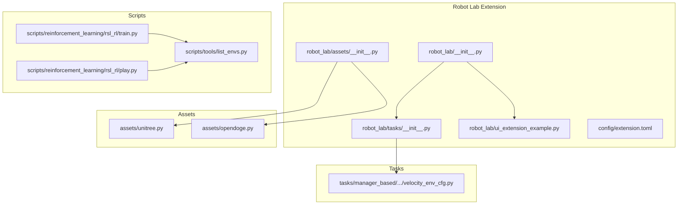
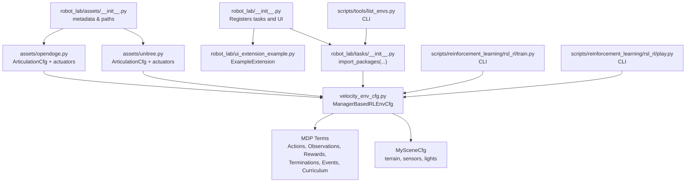
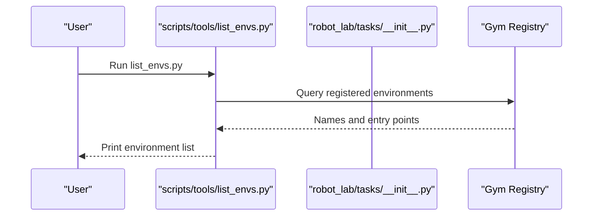
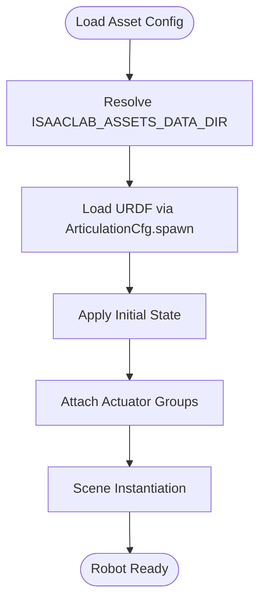
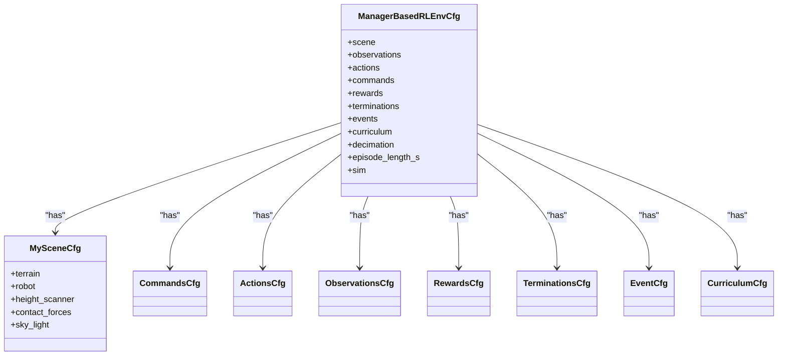
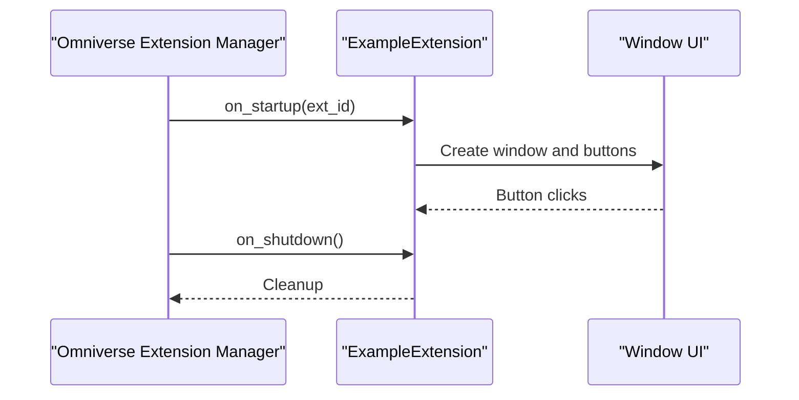
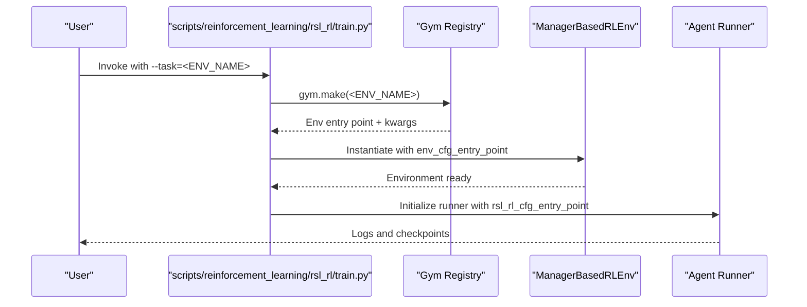
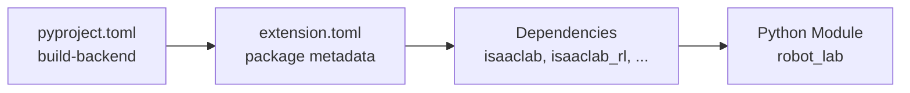

# Component Interactions

<cite>
**Referenced Files in This Document**
- [README.md](file://README.md)
- [pyproject.toml](file://source/robot_lab/pyproject.toml)
- [extension.toml](file://source/robot_lab/config/extension.toml)
- [robot_lab/__init__.py](file://source/robot_lab/robot_lab/__init__.py)
- [robot_lab/assets/__init__.py](file://source/robot_lab/robot_lab/assets/__init__.py)
- [robot_lab/tasks/__init__.py](file://source/robot_lab/robot_lab/tasks/__init__.py)
- [robot_lab/ui_extension_example.py](file://source/robot_lab/robot_lab/ui_extension_example.py)
- [robot_lab/assets/unitree.py](file://source/robot_lab/robot_lab/assets/unitree.py)
- [robot_lab/assets/opendoge.py](file://source/robot_lab/robot_lab/assets/opendoge.py)
- [robot_lab/tasks/manager_based/locomotion/velocity/velocity_env_cfg.py](file://source/robot_lab/robot_lab/tasks/manager_based/locomotion/velocity/velocity_env_cfg.py)
- [scripts/tools/list_envs.py](file://scripts/tools/list_envs.py)
- [scripts/reinforcement_learning/rsl_rl/train.py](file://scripts/reinforcement_learning/rsl_rl/train.py)
- [scripts/reinforcement_learning/rsl_rl/play.py](file://scripts/reinforcement_learning/rsl_rl/play.py)
</cite>

## Table of Contents
1. [Introduction](#introduction)
2. [Project Structure](#project-structure)
3. [Core Components](#core-components)
4. [Architecture Overview](#architecture-overview)
5. [Detailed Component Analysis](#detailed-component-analysis)
6. [Dependency Analysis](#dependency-analysis)
7. [Performance Considerations](#performance-considerations)
8. [Troubleshooting Guide](#troubleshooting-guide)
9. [Conclusion](#conclusion)
10. [Appendices](#appendices)

## Introduction
This document explains how the Robot Lab framework orchestrates component interactions across environment registration, asset loading, task configuration, MDP composition, and UI extension integration with Omniverse. It focuses on:
- How Gym environments are registered and discovered via the Isaac Lab task package importer
- How robot assets (URDFs, actuator configurations) are loaded and integrated into simulations
- How task configurations and MDP components interact with training algorithms
- How the UI extension system integrates with Omniverse and communicates with the main framework
- Typical workflow sequences for environment creation, asset loading, training execution, and result reporting

## Project Structure
Robot Lab is structured as an extension to Isaac Lab. The key areas are:
- Assets: Robot URDFs and actuator configurations
- Tasks: Environment configurations and MDP definitions
- UI Extension: Omniverse extension hooks
- Scripts: CLI entry points for environment listing and training

**Diagram sources**
- [robot_lab/__init__.py](file://source/robot_lab/robot_lab/__init__.py#L8-L12)
- [robot_lab/tasks/__init__.py](file://source/robot_lab/robot_lab/tasks/__init__.py#L14-L24)
- [robot_lab/assets/__init__.py](file://source/robot_lab/robot_lab/assets/__init__.py#L18-L26)
- [robot_lab/ui_extension_example.py](file://source/robot_lab/robot_lab/ui_extension_example.py#L18-L21)
- [robot_lab/assets/unitree.py](file://source/robot_lab/robot_lab/assets/unitree.py#L19-L65)
- [robot_lab/assets/opendoge.py](file://source/robot_lab/robot_lab/assets/opendoge.py#L14-L83)
- [robot_lab/tasks/manager_based/locomotion/velocity/velocity_env_cfg.py](file://source/robot_lab/robot_lab/tasks/manager_based/locomotion/velocity/velocity_env_cfg.py#L42-L95)
- [scripts/tools/list_envs.py](file://scripts/tools/list_envs.py)
- [scripts/reinforcement_learning/rsl_rl/train.py](file://scripts/reinforcement_learning/rsl_rl/train.py)
- [scripts/reinforcement_learning/rsl_rl/play.py](file://scripts/reinforcement_learning/rsl_rl/play.py)

**Section sources**
- [README.md](file://README.md#L11-L111)
- [robot_lab/__init__.py](file://source/robot_lab/robot_lab/__init__.py#L8-L12)
- [robot_lab/tasks/__init__.py](file://source/robot_lab/robot_lab/tasks/__init__.py#L14-L24)
- [robot_lab/assets/__init__.py](file://source/robot_lab/robot_lab/assets/__init__.py#L18-L26)
- [robot_lab/ui_extension_example.py](file://source/robot_lab/robot_lab/ui_extension_example.py#L18-L21)

## Core Components
- Environment Registry and Discovery
  - Environments are registered through the task package importer, which dynamically imports packages and registers Gym entries pointing to the ManagerBasedRLEnv class in Isaac Lab.
  - Registration is performed by invoking the tasks package initializer, which uses a package importer to traverse subpackages and import their modules.

- Asset Loading Infrastructure
  - Asset metadata and paths are resolved from the extension’s TOML configuration and relative paths.
  - Robot-specific configurations (e.g., Unitree A1/Go2/G1, OpenDoge APX) define URDF spawn parameters, initial states, and actuator models (DCMotor or implicit actuators).
  - Actuator configurations encapsulate joint limits, stiffness/damping, and implicit vs explicit actuator models.

- Task Configuration and MDP
  - Task configurations define the interactive scene (terrain, sensors, lighting), commands, actions, observations, rewards, terminations, events, and curriculum.
  - Observations are grouped into policy and critic sets; rewards and terminations are modular terms; events handle initialization/reset intervals; curriculum adjusts difficulty.

- UI Extension System
  - The Omniverse extension example demonstrates lifecycle hooks (startup/shutdown) and a simple UI window. Public functions are exposed for inter-extension communication.

**Section sources**
- [robot_lab/tasks/__init__.py](file://source/robot_lab/robot_lab/tasks/__init__.py#L14-L24)
- [robot_lab/assets/__init__.py](file://source/robot_lab/robot_lab/assets/__init__.py#L18-L26)
- [robot_lab/assets/unitree.py](file://source/robot_lab/robot_lab/assets/unitree.py#L19-L65)
- [robot_lab/assets/opendoge.py](file://source/robot_lab/robot_lab/assets/opendoge.py#L14-L83)
- [robot_lab/tasks/manager_based/locomotion/velocity/velocity_env_cfg.py](file://source/robot_lab/robot_lab/tasks/manager_based/locomotion/velocity/velocity_env_cfg.py#L42-L95)
- [robot_lab/ui_extension_example.py](file://source/robot_lab/robot_lab/ui_extension_example.py#L18-L21)

## Architecture Overview
The framework composes components through a layered architecture:
- Extension bootstrap initializes environment registration and UI extension exposure
- Asset modules provide robot configurations and actuator definitions
- Task modules define environment configurations and MDP components
- Scripts serve as entry points for discovery and training

**Diagram sources**
- [robot_lab/__init__.py](file://source/robot_lab/robot_lab/__init__.py#L8-L12)
- [robot_lab/tasks/__init__.py](file://source/robot_lab/robot_lab/tasks/__init__.py#L14-L24)
- [robot_lab/assets/__init__.py](file://source/robot_lab/robot_lab/assets/__init__.py#L18-L26)
- [robot_lab/assets/unitree.py](file://source/robot_lab/robot_lab/assets/unitree.py#L19-L65)
- [robot_lab/assets/opendoge.py](file://source/robot_lab/robot_lab/assets/opendoge.py#L14-L83)
- [robot_lab/tasks/manager_based/locomotion/velocity/velocity_env_cfg.py](file://source/robot_lab/robot_lab/tasks/manager_based/locomotion/velocity/velocity_env_cfg.py#L42-L95)
- [scripts/tools/list_envs.py](file://scripts/tools/list_envs.py)
- [scripts/reinforcement_learning/rsl_rl/train.py](file://scripts/reinforcement_learning/rsl_rl/train.py)
- [scripts/reinforcement_learning/rsl_rl/play.py](file://scripts/reinforcement_learning/rsl_rl/play.py)

## Detailed Component Analysis

### Environment Registry System
- Registration mechanism
  - The tasks package initializer imports all subpackages except a blacklist, triggering per-environment module imports that register Gym entries.
  - Registration entries point to ManagerBasedRLEnv with environment and agent configuration entry points passed as kwargs.

- Discovery workflow
  - The CLI lists environments by invoking the environment discovery utility, which relies on the Gym registry populated by the tasks initializer.

**Diagram sources**
- [scripts/tools/list_envs.py](file://scripts/tools/list_envs.py)
- [robot_lab/tasks/__init__.py](file://source/robot_lab/robot_lab/tasks/__init__.py#L14-L24)

**Section sources**
- [robot_lab/tasks/__init__.py](file://source/robot_lab/robot_lab/tasks/__init__.py#L14-L24)
- [README.md](file://README.md#L349-L426)

### Asset Loading Infrastructure
- Metadata and paths
  - The assets package reads extension metadata and resolves absolute paths to the extension source and data directories.
- Robot configurations
  - Each robot module defines an ArticulationCfg with:
    - URDF spawn parameters (fix base, merge fixed joints, replace cylinders with capsules, asset path)
    - Rigid body and articulation root properties
    - Initial state (position, joint positions/velocities)
    - Actuator groups (DCMotor or ImplicitActuator) with joint expressions, effort/velocity limits, stiffness/damping, and optional friction/armature
- Data flow
  - Asset modules expose configuration objects consumed by task configurations to instantiate robots in scenes.

**Diagram sources**
- [robot_lab/assets/__init__.py](file://source/robot_lab/robot_lab/assets/__init__.py#L18-L26)
- [robot_lab/assets/unitree.py](file://source/robot_lab/robot_lab/assets/unitree.py#L19-L65)
- [robot_lab/assets/opendoge.py](file://source/robot_lab/robot_lab/assets/opendoge.py#L14-L83)

**Section sources**
- [robot_lab/assets/__init__.py](file://source/robot_lab/robot_lab/assets/__init__.py#L18-L26)
- [robot_lab/assets/unitree.py](file://source/robot_lab/robot_lab/assets/unitree.py#L19-L65)
- [robot_lab/assets/opendoge.py](file://source/robot_lab/robot_lab/assets/opendoge.py#L14-L83)

### Task Configuration Hierarchy and MDP Interaction
- Scene definition
  - The scene config includes terrain generation, ray-caster height sensors, contact sensors, and lighting.
- MDP components
  - Commands: velocity command sampling and thresholds
  - Actions: joint position actions with scaling and offsets
  - Observations: policy and critic groups with concatenated terms and noise
  - Rewards: modular terms for tracking, penalties, contact, and gait
  - Termination: timeout and terrain bounds
  - Events: startup/reset/interval randomizations
  - Curriculum: terrain and command difficulty progression
- Integration with training
  - Environment configurations are passed to ManagerBasedRLEnv via registration kwargs, enabling training scripts to select tasks by name.

**Diagram sources**
- [robot_lab/tasks/manager_based/locomotion/velocity/velocity_env_cfg.py](file://source/robot_lab/robot_lab/tasks/manager_based/locomotion/velocity/velocity_env_cfg.py#L42-L95)
- [robot_lab/tasks/manager_based/locomotion/velocity/velocity_env_cfg.py](file://source/robot_lab/robot_lab/tasks/manager_based/locomotion/velocity/velocity_env_cfg.py#L102-L127)
- [robot_lab/tasks/manager_based/locomotion/velocity/velocity_env_cfg.py](file://source/robot_lab/robot_lab/tasks/manager_based/locomotion/velocity/velocity_env_cfg.py#L130-L254)
- [robot_lab/tasks/manager_based/locomotion/velocity/velocity_env_cfg.py](file://source/robot_lab/robot_lab/tasks/manager_based/locomotion/velocity/velocity_env_cfg.py#L257-L372)
- [robot_lab/tasks/manager_based/locomotion/velocity/velocity_env_cfg.py](file://source/robot_lab/robot_lab/tasks/manager_based/locomotion/velocity/velocity_env_cfg.py#L374-L687)
- [robot_lab/tasks/manager_based/locomotion/velocity/velocity_env_cfg.py](file://source/robot_lab/robot_lab/tasks/manager_based/locomotion/velocity/velocity_env_cfg.py#L695-L744)

**Section sources**
- [robot_lab/tasks/manager_based/locomotion/velocity/velocity_env_cfg.py](file://source/robot_lab/robot_lab/tasks/manager_based/locomotion/velocity/velocity_env_cfg.py#L42-L95)
- [robot_lab/tasks/manager_based/locomotion/velocity/velocity_env_cfg.py](file://source/robot_lab/robot_lab/tasks/manager_based/locomotion/velocity/velocity_env_cfg.py#L102-L127)
- [robot_lab/tasks/manager_based/locomotion/velocity/velocity_env_cfg.py](file://source/robot_lab/robot_lab/tasks/manager_based/locomotion/velocity/velocity_env_cfg.py#L130-L254)
- [robot_lab/tasks/manager_based/locomotion/velocity/velocity_env_cfg.py](file://source/robot_lab/robot_lab/tasks/manager_based/locomotion/velocity/velocity_env_cfg.py#L257-L372)
- [robot_lab/tasks/manager_based/locomotion/velocity/velocity_env_cfg.py](file://source/robot_lab/robot_lab/tasks/manager_based/locomotion/velocity/velocity_env_cfg.py#L374-L687)
- [robot_lab/tasks/manager_based/locomotion/velocity/velocity_env_cfg.py](file://source/robot_lab/robot_lab/tasks/manager_based/locomotion/velocity/velocity_env_cfg.py#L695-L744)

### UI Extension System for Omniverse Integration
- Lifecycle and UI
  - The example extension derives from the Omniverse extension interface, with startup/shutdown hooks and a simple window with buttons.
- Communication patterns
  - Public functions in the extension module can be imported and invoked by other extensions, enabling inter-extension communication.

**Diagram sources**
- [robot_lab/ui_extension_example.py](file://source/robot_lab/robot_lab/ui_extension_example.py#L18-L21)
- [robot_lab/ui_extension_example.py](file://source/robot_lab/robot_lab/ui_extension_example.py#L24-L49)

**Section sources**
- [robot_lab/ui_extension_example.py](file://source/robot_lab/robot_lab/ui_extension_example.py#L18-L21)
- [robot_lab/ui_extension_example.py](file://source/robot_lab/robot_lab/ui_extension_example.py#L24-L49)

### Training Execution Workflow
- Environment selection and instantiation
  - Training scripts select an environment by name; the Gym registry resolves the entry point and passes environment and agent configuration entry points to ManagerBasedRLEnv.
- Execution and reporting
  - Training scripts orchestrate environment creation, agent initialization, and logging/reporting via the chosen RL backend.

**Diagram sources**
- [scripts/reinforcement_learning/rsl_rl/train.py](file://scripts/reinforcement_learning/rsl_rl/train.py)
- [README.md](file://README.md#L349-L426)

**Section sources**
- [scripts/reinforcement_learning/rsl_rl/train.py](file://scripts/reinforcement_learning/rsl_rl/train.py)
- [README.md](file://README.md#L349-L426)

## Dependency Analysis
- Build and packaging
  - The extension uses setuptools-based build backend and declares package metadata and dependencies in the extension TOML.
- Runtime dependencies
  - The extension depends on core Isaac Lab packages and exposes a Python module named “robot_lab”.

**Diagram sources**
- [pyproject.toml](file://source/robot_lab/pyproject.toml#L1-L4)
- [extension.toml](file://source/robot_lab/config/extension.toml#L1-L36)

**Section sources**
- [pyproject.toml](file://source/robot_lab/pyproject.toml#L1-L4)
- [extension.toml](file://source/robot_lab/config/extension.toml#L17-L27)

## Performance Considerations
- Simulation decimation and timestep
  - Environment configurations set decimation and simulation timestep, impacting fidelity and throughput.
- Sensor update periods
  - Sensors’ update periods are aligned with the physics timestep and decimation to balance accuracy and performance.
- Physics parameters
  - Terrain material and GPU patch counts influence simulation stability and speed.

**Section sources**
- [robot_lab/tasks/manager_based/locomotion/velocity/velocity_env_cfg.py](file://source/robot_lab/robot_lab/tasks/manager_based/locomotion/velocity/velocity_env_cfg.py#L714-L727)

## Troubleshooting Guide
- Environment listing
  - Use the environment listing script to verify that environments are registered after installing the extension.
- Omniverse indexing
  - If IDE indexing is missing, add the extension and Isaac Lab paths to extraPaths as described in the README.
- Disk space cleanup
  - USD cache files can accumulate; remove temporary USD directories as needed.

**Section sources**
- [README.md](file://README.md#L452-L481)
- [scripts/tools/list_envs.py](file://scripts/tools/list_envs.py)

## Conclusion
Robot Lab composes a cohesive pipeline:
- Environments are registered and discoverable via Gym through the task package importer
- Assets are loaded from URDFs with articulated configurations and actuator models
- Task configurations define rich MDP components that integrate with training backends
- The UI extension system integrates with Omniverse and supports inter-extension communication
- Scripts provide practical entry points for environment discovery and training

## Appendices
- Example CLI invocations for environment listing and training are documented in the README.

**Section sources**
- [README.md](file://README.md#L193-L348)