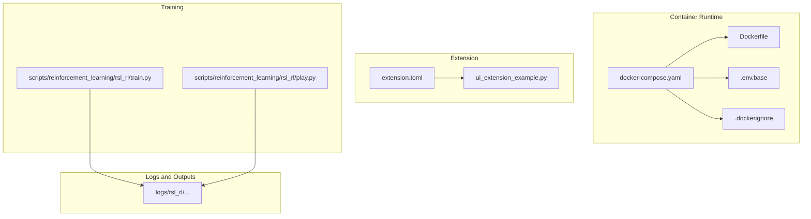
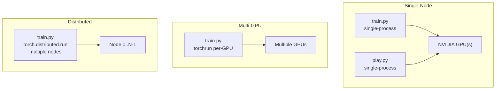
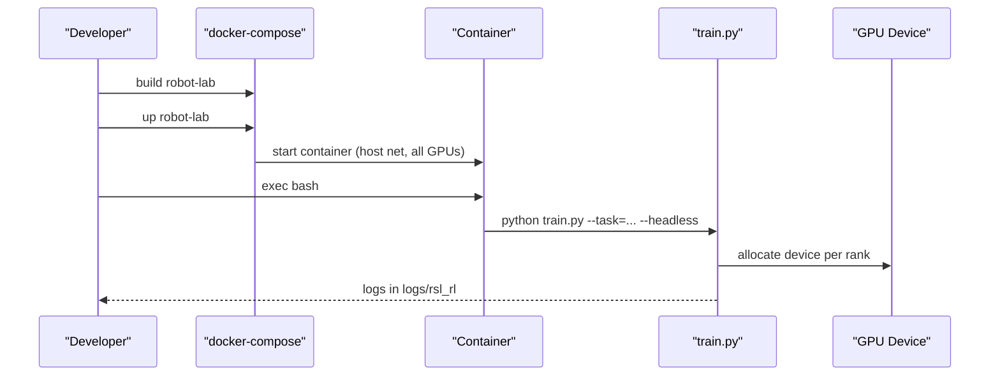
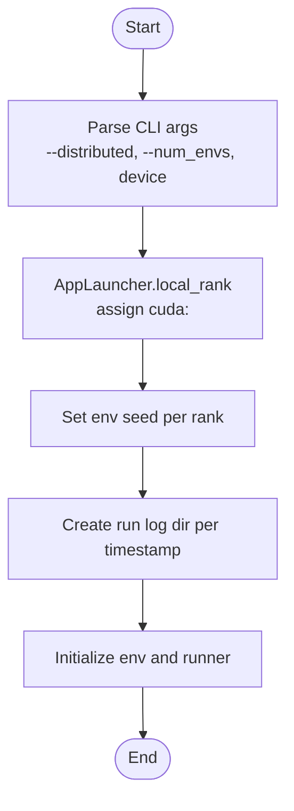
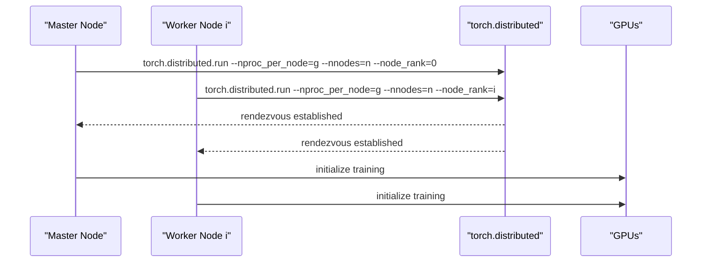
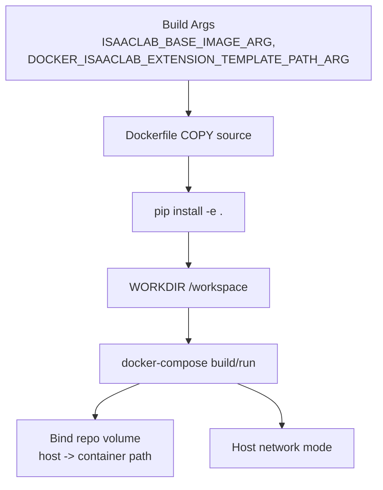
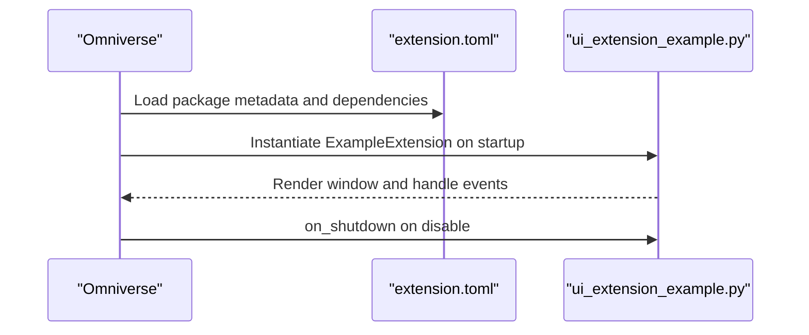
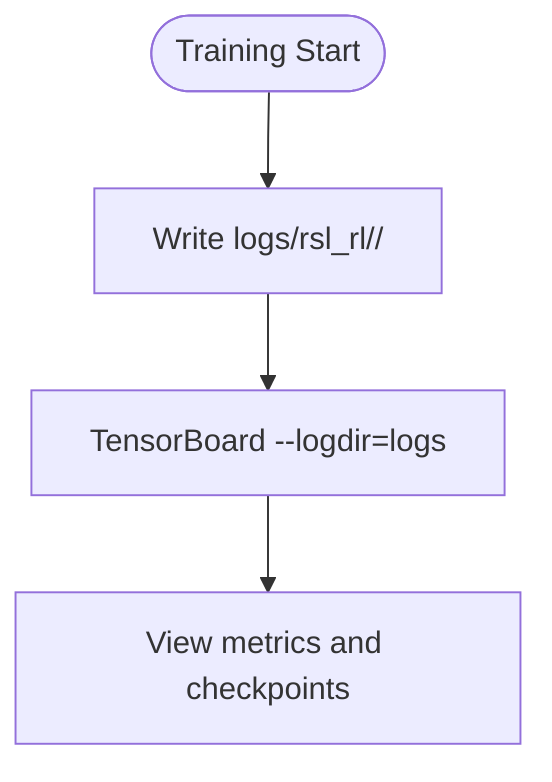
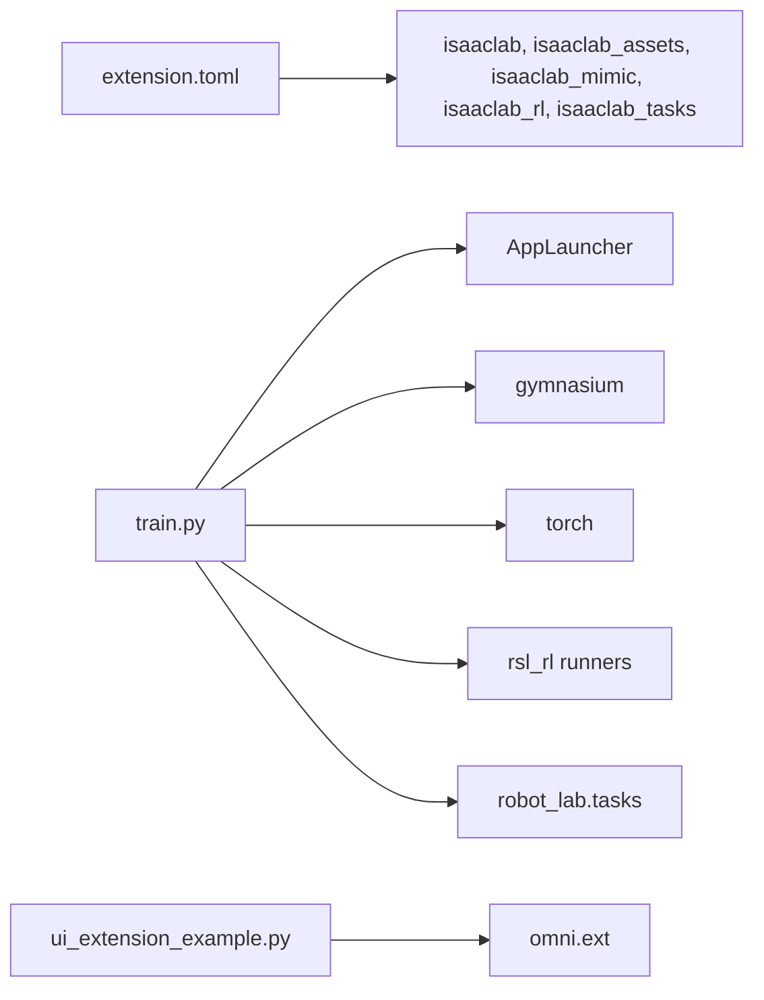

# Deployment Topology

<cite>
**Referenced Files in This Document**
- [README.md](file://README.md)
- [Dockerfile](file://docker/Dockerfile)
- [docker-compose.yaml](file://docker/docker-compose.yaml)
- [.env.base](file://docker/.env.base)
- [.dockerignore](file://.dockerignore)
- [extension.toml](file://source/robot_lab/config/extension.toml)
- [ui_extension_example.py](file://source/robot_lab/robot_lab/ui_extension_example.py)
- [train.py](file://scripts/reinforcement_learning/rsl_rl/train.py)
- [play.py](file://scripts/reinforcement_learning/rsl_rl/play.py)
- [agent.yaml](file://logs/rsl_rl/opendoge_apx_flat/2026-01-20_11-11-30/params/agent.yaml)
- [env.yaml](file://logs/rsl_rl/opendoge_apx_flat/2026-01-20_11-11-30/params/env.yaml)
</cite>

## Table of Contents
1. [Introduction](#introduction)
2. [Project Structure](#project-structure)
3. [Core Components](#core-components)
4. [Architecture Overview](#architecture-overview)
5. [Detailed Component Analysis](#detailed-component-analysis)
6. [Dependency Analysis](#dependency-analysis)
7. [Performance Considerations](#performance-considerations)
8. [Troubleshooting Guide](#troubleshooting-guide)
9. [Conclusion](#conclusion)
10. [Appendices](#appendices)

## Introduction
This document describes deployment topologies for the Robot Lab framework across single-node GPU acceleration, multi-GPU training, and distributed training. It covers containerization with Docker Compose, volume mounts for datasets and logs, network configuration for remote access, Omniverse extension deployment and UI integration, cloud deployment options, infrastructure requirements, monitoring/logging, backups, disaster recovery, and security/access control.

## Project Structure
Robot Lab is structured around:
- Containerization: Dockerfile and docker-compose orchestrate the runtime environment.
- Extension definition: extension.toml registers the Omniverse extension and dependencies.
- UI extension: ui_extension_example.py demonstrates UI integration.
- Training and evaluation: scripts under scripts/reinforcement_learning support single-node and distributed training.
- Logs and outputs: logs/rsl_rl stores experiment artifacts and checkpoints.

**Diagram sources**
- [docker-compose.yaml](file://docker/docker-compose.yaml#L1-L37)
- [Dockerfile](file://docker/Dockerfile#L1-L22)
- [.env.base](file://docker/.env.base#L1-L9)
- [.dockerignore](file://.dockerignore#L1-L24)
- [extension.toml](file://source/robot_lab/config/extension.toml#L1-L36)
- [ui_extension_example.py](file://source/robot_lab/robot_lab/ui_extension_example.py#L1-L50)
- [train.py](file://scripts/reinforcement_learning/rsl_rl/train.py#L1-L200)
- [play.py](file://scripts/reinforcement_learning/rsl_rl/play.py#L1-L200)
- [agent.yaml](file://logs/rsl_rl/opendoge_apx_flat/2026-01-20_11-11-30/params/agent.yaml#L1-L50)
- [env.yaml](file://logs/rsl_rl/opendoge_apx_flat/2026-01-20_11-11-30/params/env.yaml#L1-L1742)

**Section sources**
- [README.md](file://README.md#L113-L191)
- [docker-compose.yaml](file://docker/docker-compose.yaml#L1-L37)
- [Dockerfile](file://docker/Dockerfile#L1-L22)
- [.env.base](file://docker/.env.base#L1-L9)
- [.dockerignore](file://.dockerignore#L1-L24)
- [extension.toml](file://source/robot_lab/config/extension.toml#L1-L36)
- [ui_extension_example.py](file://source/robot_lab/robot_lab/ui_extension_example.py#L1-L50)
- [train.py](file://scripts/reinforcement_learning/rsl_rl/train.py#L1-L200)
- [play.py](file://scripts/reinforcement_learning/rsl_rl/play.py#L1-L200)

## Core Components
- Container image build: The Dockerfile builds on an Isaac Lab base image, installs the robot_lab package, and sets the working directory.
- Orchestration: docker-compose defines service configuration, binds the repository into the container, reserves all GPUs, and uses host networking.
- Extension registration: extension.toml declares dependencies and module metadata for Omniverse.
- UI extension: ui_extension_example.py provides a minimal UI window example for Omniverse.
- Training entry points: train.py and play.py integrate with AppLauncher and Hydra to configure environments and agents.

Key runtime parameters:
- GPU allocation: NVIDIA device reservations allocate all GPUs.
- Host networking: Enables direct access to host display and devices.
- Volume binding: Repository path mounted into the container for live development.

**Section sources**
- [Dockerfile](file://docker/Dockerfile#L1-L22)
- [docker-compose.yaml](file://docker/docker-compose.yaml#L7-L36)
- [extension.toml](file://source/robot_lab/config/extension.toml#L17-L36)
- [ui_extension_example.py](file://source/robot_lab/robot_lab/ui_extension_example.py#L18-L49)
- [train.py](file://scripts/reinforcement_learning/rsl_rl/train.py#L22-L44)

## Architecture Overview
The deployment architecture supports three primary topologies:
- Single-node with local GPU acceleration
- Multi-GPU training on a single host
- Distributed training across multiple nodes

**Diagram sources**
- [train.py](file://scripts/reinforcement_learning/rsl_rl/train.py#L138-L147)
- [README.md](file://README.md#L333-L347)

## Detailed Component Analysis

### Single-Node Deployment with Local GPU Acceleration
- Containerization:
  - Build base image for Isaac Lab locally.
  - Build robot-lab image using docker-compose with .env.base.
  - Run container with host networking and all-GPU reservations.
- Volume mounts:
  - Bind repository path into the container to enable live edits.
- Remote access:
  - Host networking exposes display and devices directly to the container.
- Training:
  - Use train.py with --headless for headless runs.
  - Use play.py for inference and optional keyboard control.
- Logs:
  - TensorBoard logs are written under logs/rsl_rl with per-run directories.

**Diagram sources**
- [docker-compose.yaml](file://docker/docker-compose.yaml#L16-L36)
- [Dockerfile](file://docker/Dockerfile#L14-L17)
- [train.py](file://scripts/reinforcement_learning/rsl_rl/train.py#L138-L158)
- [README.md](file://README.md#L157-L191)

**Section sources**
- [README.md](file://README.md#L113-L191)
- [docker-compose.yaml](file://docker/docker-compose.yaml#L16-L36)
- [Dockerfile](file://docker/Dockerfile#L14-L17)
- [train.py](file://scripts/reinforcement_learning/rsl_rl/train.py#L138-L158)
- [play.py](file://scripts/reinforcement_learning/rsl_rl/play.py#L94-L156)

### Multi-GPU Training Setup
- Process model:
  - Launch a single training process per GPU using torchrun or torch.distributed.run.
  - AppLauncher determines local rank and assigns CUDA devices accordingly.
- Configuration:
  - Set --distributed to enable per-rank device assignment.
  - Adjust --num_envs and agent/device settings per GPU capacity.
- Logs:
  - Each rank writes to a separate run directory under logs/rsl_rl.

**Diagram sources**
- [train.py](file://scripts/reinforcement_learning/rsl_rl/train.py#L138-L158)

**Section sources**
- [README.md](file://README.md#L333-L347)
- [train.py](file://scripts/reinforcement_learning/rsl_rl/train.py#L138-L158)

### Distributed Training Across Nodes
- Process model:
  - Launch one process on each node with torch.distributed.run.
  - Configure rendezvous endpoint and backend (c10d).
  - Use --node_rank to differentiate nodes.
- Networking:
  - Ensure rdzv_endpoint is reachable from all nodes.
  - Use host networking or equivalent to expose ports.
- Logs:
  - Each node writes logs independently under logs/rsl_rl.

**Diagram sources**
- [README.md](file://README.md#L339-L347)

**Section sources**
- [README.md](file://README.md#L333-L347)

### Docker Containerization Strategy
- Image building:
  - Base image argument ISAACLAB_BASE_IMAGE_ARG is passed to Dockerfile.
  - Robot Lab package is installed in editable mode inside the container.
- Volume mounting:
  - Repository is bound into the container path defined by DOCKER_ISAACLAB_EXTENSION_TEMPLATE_PATH.
  - .dockerignore excludes logs, outputs, videos, and caches from the image.
- Network configuration:
  - network_mode: host enables direct access to host GPU and display.
- Environment:
  - OMNI_KIT_ALLOW_ROOT=1 permits root in Omniverse contexts.

**Diagram sources**
- [Dockerfile](file://docker/Dockerfile#L1-L22)
- [docker-compose.yaml](file://docker/docker-compose.yaml#L18-L30)
- [.dockerignore](file://.dockerignore#L1-L24)
- [.env.base](file://docker/.env.base#L5-L8)

**Section sources**
- [Dockerfile](file://docker/Dockerfile#L1-L22)
- [docker-compose.yaml](file://docker/docker-compose.yaml#L16-L36)
- [.dockerignore](file://.dockerignore#L1-L24)
- [.env.base](file://docker/.env.base#L5-L8)

### Omniverse Extension Deployment and UI Integration
- Extension registration:
  - extension.toml defines package metadata, dependencies, and Python module entry.
- Enabling the extension:
  - Add the extension search paths in Omniverse Extensions Settings.
  - Refresh and enable the extension from the Third Party category.
- UI extension example:
  - ui_extension_example.py creates a simple window with buttons and lifecycle callbacks.

**Diagram sources**
- [extension.toml](file://source/robot_lab/config/extension.toml#L17-L27)
- [ui_extension_example.py](file://source/robot_lab/robot_lab/ui_extension_example.py#L18-L49)
- [README.md](file://README.md#L92-L111)

**Section sources**
- [extension.toml](file://source/robot_lab/config/extension.toml#L1-L36)
- [ui_extension_example.py](file://source/robot_lab/robot_lab/ui_extension_example.py#L1-L50)
- [README.md](file://README.md#L92-L111)

### Cloud Deployment Options (AWS, GCP, Azure)
- General guidance:
  - Use containerized images built from the provided Dockerfile and docker-compose.
  - Ensure GPU-enabled instance families (e.g., p2/p3 on AWS, n1-standard with accelerator on GCP, NC/ND on Azure).
  - Configure container orchestrators (ECS/EKS/AKS) to reserve GPUs and mount persistent volumes for datasets and logs.
  - Expose ports for remote access if needed; otherwise rely on host networking for GPU and display.
- Recommendations:
  - Store datasets and logs on persistent volumes or object storage.
  - Use managed registries to distribute images across regions.
  - Scale workers horizontally for multi-GPU and distributed training.

[No sources needed since this section provides general guidance]

### Infrastructure Requirements
- Research workstation:
  - Single high-end GPU with sufficient VRAM for target envs and num_envs.
  - Host networking for display and device access.
- Multi-GPU server:
  - Multiple GPUs with NVLink or shared PCIe for efficient multi-GPU training.
  - Sufficient CPU/memory to support large num_envs and sensor pipelines.
- Large-scale cluster:
  - Multiple nodes with RDMA or high-throughput interconnects.
  - Centralized storage for datasets and logs; container images stored in private registries.

[No sources needed since this section provides general guidance]

### Monitoring and Logging Setup
- Logging:
  - Training logs and checkpoints are written under logs/rsl_rl with timestamped run directories.
  - Agent configuration (agent.yaml) includes logger selection (e.g., tensorboard).
- Visualization:
  - TensorBoard can be launched against logs directory.
- Metrics:
  - Environment configuration (env.yaml) includes viewer and simulation parameters that influence performance metrics.

**Diagram sources**
- [train.py](file://scripts/reinforcement_learning/rsl_rl/train.py#L148-L158)
- [agent.yaml](file://logs/rsl_rl/opendoge_apx_flat/2026-01-20_11-11-30/params/agent.yaml#L11-L11)
- [README.md](file://README.md#L428-L434)

**Section sources**
- [train.py](file://scripts/reinforcement_learning/rsl_rl/train.py#L148-L158)
- [agent.yaml](file://logs/rsl_rl/opendoge_apx_flat/2026-01-20_11-11-30/params/agent.yaml#L1-L50)
- [README.md](file://README.md#L428-L434)

### Backup Strategies and Disaster Recovery
- Artifacts to protect:
  - Trained models (.pt files), environment configs (env.yaml), agent configs (agent.yaml), and logs.
- Backup approaches:
  - Snapshot persistent volumes hosting datasets and logs.
  - Export container images to a registry for quick redeployment.
- DR procedures:
  - Recreate containers from images, remount volumes, and resume training from last checkpoint.

[No sources needed since this section provides general guidance]

### Security Considerations, Access Control, and Resource Isolation
- Root in Omniverse:
  - OMNI_KIT_ALLOW_ROOT=1 is set; ensure only trusted users have shell access.
- GPU isolation:
  - Use NVIDIA container toolkit to limit GPU visibility per container.
- Network isolation:
  - Prefer host networking for GPU/display but restrict external exposure; use firewalls and VPNs for remote access.
- Access control:
  - Restrict shell access to authorized users; leverage OS-level permissions for logs and datasets.
- Resource quotas:
  - Use container resource limits and cgroups to prevent noisy-neighbor effects in multi-user environments.

[No sources needed since this section provides general guidance]

## Dependency Analysis
- Extension dependencies:
  - extension.toml lists isaaclab, isaaclab_assets, isaaclab_mimic, isaaclab_rl, isaaclab_tasks as required packages.
- Training dependencies:
  - train.py imports AppLauncher, gymnasium, torch, rsl_rl runners, and robot_lab.tasks.
- UI extension:
  - ui_extension_example.py depends on omni.ext for Omniverse lifecycle.

**Diagram sources**
- [extension.toml](file://source/robot_lab/config/extension.toml#L17-L23)
- [train.py](file://scripts/reinforcement_learning/rsl_rl/train.py#L87-L104)
- [ui_extension_example.py](file://source/robot_lab/robot_lab/ui_extension_example.py#L9-L9)

**Section sources**
- [extension.toml](file://source/robot_lab/config/extension.toml#L17-L23)
- [train.py](file://scripts/reinforcement_learning/rsl_rl/train.py#L87-L104)
- [ui_extension_example.py](file://source/robot_lab/robot_lab/ui_extension_example.py#L9-L9)

## Performance Considerations
- Simulation throughput:
  - Adjust scene.num_envs and decimation to balance throughput and fidelity.
- GPU utilization:
  - Use --distributed to leverage multiple GPUs; ensure proper device assignment per rank.
- Determinism and precision:
  - TF32 toggles are set early in train.py; tune cudnn settings for reproducibility vs. speed.
- Logging overhead:
  - Choose appropriate logger and save intervals to minimize I/O impact.

[No sources needed since this section provides general guidance]

## Troubleshooting Guide
- Docker build failures:
  - Verify ISAACLAB_BASE_IMAGE is built and present locally.
  - Confirm DOCKER_ISAACLAB_EXTENSION_TEMPLATE_PATH matches .env.base.
- GPU allocation:
  - Ensure NVIDIA container toolkit is installed and container has access to GPUs.
- Omniverse extension not found:
  - Add the extension search paths in Omniverse and refresh.
- Clean USD caches:
  - Remove temporary USD files under /tmp/IsaacLab/usd_* if disk pressure occurs.

**Section sources**
- [README.md](file://README.md#L119-L133)
- [README.md](file://README.md#L452-L480)
- [docker-compose.yaml](file://docker/docker-compose.yaml#L7-L13)
- [.env.base](file://docker/.env.base#L5-L8)

## Conclusion
Robot Lab supports flexible deployment topologies from single-node GPU training to distributed multi-node setups. Containerization with Docker Compose and host networking simplifies GPU and display access, while extension registration and UI integration enable seamless Omniverse workflows. Proper logging, backups, and security controls are essential for reliable operations across research workstations and large-scale clusters.

## Appendices

### Deployment Checklists

- Single-node deployment
  - Build Isaac Lab base image locally.
  - Build robot-lab image and run container with host networking and GPU reservations.
  - Mount repository volume and verify Omniverse extension paths.
  - Run training and confirm logs appear under logs/rsl_rl.

- Multi-GPU deployment
  - Launch training with --distributed; ensure AppLauncher local rank maps to cuda:<rank>.
  - Adjust --num_envs and agent/device settings per GPU capacity.
  - Monitor logs per rank under logs/rsl_rl.

- Distributed deployment
  - Launch one process per node with torch.distributed.run and correct --node_rank.
  - Configure rendezvous endpoint and backend; ensure network connectivity.
  - Validate logs per node under logs/rsl_rl.

- Omniverse extension
  - Register extension via extension.toml and enable in Omniverse.
  - Verify UI window lifecycle callbacks.

- Cloud deployment
  - Use GPU-enabled instances and container orchestrators.
  - Persist datasets and logs; store images in managed registries.
  - Secure access with firewalls and VPNs.

[No sources needed since this section provides general guidance]