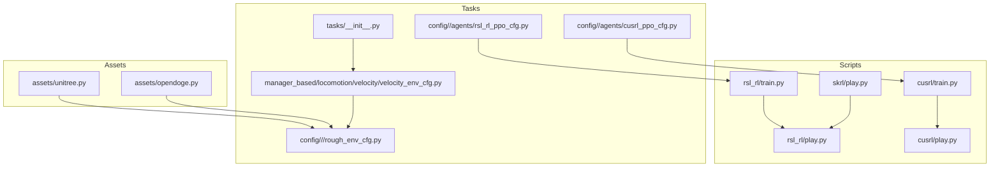
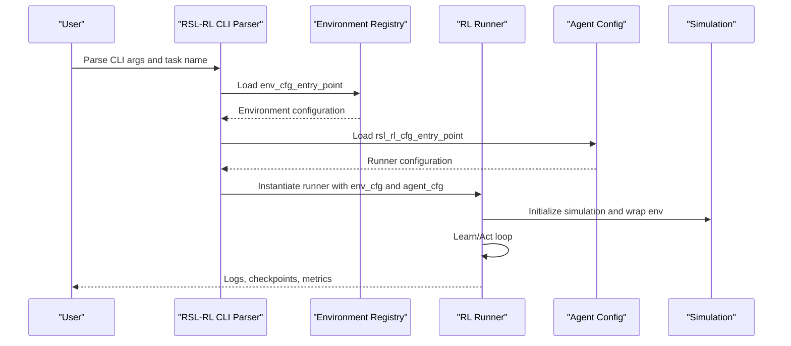
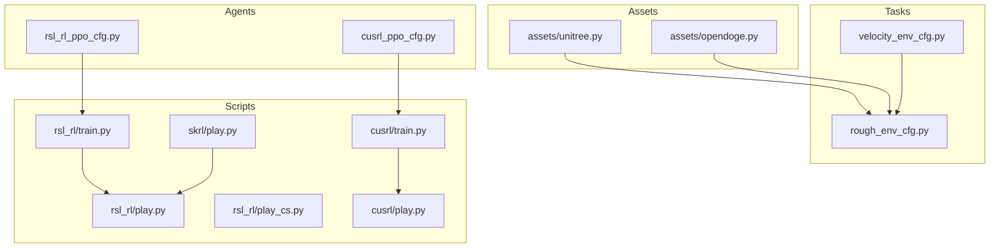

# System Design Patterns

<cite>
**Referenced Files in This Document**
- [README.md](file://README.md)
- [tasks/__init__.py](file://source/robot_lab/robot_lab/tasks/__init__.py)
- [velocity_env_cfg.py](file://source/robot_lab/robot_lab/tasks/manager_based/locomotion/velocity/velocity_env_cfg.py)
- [rough_env_cfg.py](file://source/robot_lab/robot_lab/tasks/manager_based/locomotion/velocity/config/quadruped/opendoge_apx/rough_env_cfg.py)
- [unitree.py](file://source/robot_lab/robot_lab/assets/unitree.py)
- [opendoge.py](file://source/robot_lab/robot_lab/assets/opendoge.py)
- [cli_args.py](file://scripts/reinforcement_learning/rsl_rl/cli_args.py)
- [train.py](file://scripts/reinforcement_learning/rsl_rl/train.py)
- [play.py](file://scripts/reinforcement_learning/rsl_rl/play.py)
- [play_cs.py](file://scripts/reinforcement_learning/rsl_rl/play_cs.py)
- [skrl/play.py](file://scripts/reinforcement_learning/skrl/play.py)
- [cusrl/train.py](file://scripts/reinforcement_learning/cusrl/train.py)
- [cusrl/play.py](file://scripts/reinforcement_learning/cusrl/play.py)
- [rsl_rl_ppo_cfg.py](file://source/robot_lab/robot_lab/tasks/manager_based/locomotion/velocity/config/quadruped/opendoge_apx/agents/rsl_rl_ppo_cfg.py)
- [rsl_rl_ppo_cfg.py](file://source/robot_lab/robot_lab/tasks/manager_based/locomotion/velocity/config/quadruped/unitree_a1/agents/rsl_rl_ppo_cfg.py)
- [rsl_rl_ppo_cfg.py](file://source/robot_lab/robot_lab/tasks/manager_based/locomotion/velocity/config/others/unitree_a1_handstand/agents/rsl_rl_ppo_cfg.py)
- [rsl_rl_ppo_cfg.py](file://source/robot_lab/robot_lab/tasks/manager_based/locomotion/velocity/config/humanoid/openloong_loong/agents/rsl_rl_ppo_cfg.py)
- [cusrl_ppo_cfg.py](file://source/robot_lab/robot_lab/tasks/manager_based/locomotion/velocity/config/others/unitree_a1_handstand/agents/cusrl_ppo_cfg.py)
</cite>

## Table of Contents
1. [Introduction](#introduction)
2. [Project Structure](#project-structure)
3. [Core Components](#core-components)
4. [Architecture Overview](#architecture-overview)
5. [Detailed Component Analysis](#detailed-component-analysis)
6. [Dependency Analysis](#dependency-analysis)
7. [Performance Considerations](#performance-considerations)
8. [Troubleshooting Guide](#troubleshooting-guide)
9. [Conclusion](#conclusion)

## Introduction
This document explains the Robot Lab design patterns and architectural principles that enable flexible, extensible, and maintainable robotics research workflows. It focuses on:
- Factory pattern for environment creation and robot instantiation
- Strategy pattern for seamless switching among RL algorithms (RSL-RL, CusRL, SKRL)
- Template method pattern for task configuration standardization
- Observer pattern implementation for event-driven updates in simulation environments

The explanations are grounded in concrete code examples from the repository and demonstrate how these patterns improve extensibility, maintainability, and flexibility.

## Project Structure
Robot Lab organizes environments and assets into modular packages:
- Assets: Robot URDF and actuator configurations
- Tasks: Environment templates and per-robot configurations
- Scripts: Training and playing entry points for different RL frameworks

**Diagram sources**
- [tasks/__init__.py](file://source/robot_lab/robot_lab/tasks/__init__.py#L24-L25)
- [velocity_env_cfg.py](file://source/robot_lab/robot_lab/tasks/manager_based/locomotion/velocity/velocity_env_cfg.py#L696-L744)
- [rough_env_cfg.py](file://source/robot_lab/robot_lab/tasks/manager_based/locomotion/velocity/config/quadruped/opendoge_apx/rough_env_cfg.py#L16-L36)
- [unitree.py](file://source/robot_lab/robot_lab/assets/unitree.py#L19-L65)
- [opendoge.py](file://source/robot_lab/robot_lab/assets/opendoge.py#L14-L83)
- [rsl_rl_ppo_cfg.py](file://source/robot_lab/robot_lab/tasks/manager_based/locomotion/velocity/config/quadruped/opendoge_apx/agents/rsl_rl_ppo_cfg.py#L8-L44)
- [cusrl_ppo_cfg.py](file://source/robot_lab/robot_lab/tasks/manager_based/locomotion/velocity/config/others/unitree_a1_handstand/agents/cusrl_ppo_cfg.py#L10-L42)
- [train.py](file://scripts/reinforcement_learning/rsl_rl/train.py#L194-L231)
- [play.py](file://scripts/reinforcement_learning/rsl_rl/play.py#L215-L253)
- [play_cs.py](file://scripts/reinforcement_learning/rsl_rl/play_cs.py#L254-L292)
- [skrl/play.py](file://scripts/reinforcement_learning/skrl/play.py#L221-L252)
- [cusrl/train.py](file://scripts/reinforcement_learning/cusrl/train.py#L1-L200)
- [cusrl/play.py](file://scripts/reinforcement_learning/cusrl/play.py#L1-L200)

**Section sources**
- [README.md](file://README.md#L348-L400)
- [tasks/__init__.py](file://source/robot_lab/robot_lab/tasks/__init__.py#L24-L25)

## Core Components
- Environment templates: Base configuration classes define scenes, commands, actions, observations, rewards, terminations, events, and curriculum.
- Robot assets: Predefined articulation configurations for each robot model.
- Agent configurations: Per-environment RL agent setups for RSL-RL and CusRL.
- Script entry points: Training and playing scripts for RSL-RL, SKRL, and CusRL.

Key responsibilities:
- Factory pattern: Robot asset and environment configuration instantiation
- Strategy pattern: Pluggable RL runners and agent factories
- Template method pattern: Standardized task configuration lifecycle
- Observer pattern: Event-driven scene updates and curriculum progression

**Section sources**
- [velocity_env_cfg.py](file://source/robot_lab/robot_lab/tasks/manager_based/locomotion/velocity/velocity_env_cfg.py#L42-L744)
- [unitree.py](file://source/robot_lab/robot_lab/assets/unitree.py#L19-L637)
- [opendoge.py](file://source/robot_lab/robot_lab/assets/opendoge.py#L14-L83)
- [rsl_rl_ppo_cfg.py](file://source/robot_lab/robot_lab/tasks/manager_based/locomotion/velocity/config/quadruped/opendoge_apx/agents/rsl_rl_ppo_cfg.py#L8-L44)
- [cusrl_ppo_cfg.py](file://source/robot_lab/robot_lab/tasks/manager_based/locomotion/velocity/config/others/unitree_a1_handstand/agents/cusrl_ppo_cfg.py#L10-L42)

## Architecture Overview
The system composes environment templates with robot assets and RL agent configurations. Scripts select the appropriate RL framework and runner, then orchestrate training or inference loops.

**Diagram sources**
- [cli_args.py](file://scripts/reinforcement_learning/rsl_rl/cli_args.py#L45-L68)
- [train.py](file://scripts/reinforcement_learning/rsl_rl/train.py#L194-L231)
- [README.md](file://README.md#L402-L426)

## Detailed Component Analysis

### Factory Pattern: Environment Creation and Robot Instantiation
Robot Lab uses a factory-like composition to instantiate environments and robots:
- Robot assets are defined as configuration objects (e.g., Unitree and Opendoge configurations).
- Environment templates encapsulate scene, sensors, commands, actions, observations, rewards, events, and curriculum.
- Subclasses override base templates to specialize per-robot and per-environment settings.

Implementation highlights:
- Robot asset factories: Each robot module exports an ArticulationCfg object that defines URDF path, initial state, and actuators.
- Environment factories: Base environment configuration classes define reusable templates; subclasses specialize robot and observation scales.

Concrete examples:
- Robot asset factory: Unitree A1 configuration
  - [UNITREE_A1_CFG](file://source/robot_lab/robot_lab/assets/unitree.py#L19-L65)
- Robot asset factory: Opendoge APX configuration
  - [OPENDOGE_APX_CFG](file://source/robot_lab/robot_lab/assets/opendoge.py#L14-L83)
- Environment factory: Base velocity environment configuration
  - [LocomotionVelocityRoughEnvCfg](file://source/robot_lab/robot_lab/tasks/manager_based/locomotion/velocity/velocity_env_cfg.py#L696-L744)
- Environment specialization: Opendoge APX rough environment
  - [BoosterT1RoughEnvCfg](file://source/robot_lab/robot_lab/tasks/manager_based/locomotion/velocity/config/quadruped/opendoge_apx/rough_env_cfg.py#L16-L36)

Benefits:
- Extensibility: Adding a new robot requires a new asset configuration and a subclass of the base environment.
- Maintainability: Centralized asset definitions and environment templates reduce duplication.
- Flexibility: Different robots can share the same MDP structure while differing in kinematics and dynamics.

**Section sources**
- [unitree.py](file://source/robot_lab/robot_lab/assets/unitree.py#L19-L65)
- [opendoge.py](file://source/robot_lab/robot_lab/assets/opendoge.py#L14-L83)
- [velocity_env_cfg.py](file://source/robot_lab/robot_lab/tasks/manager_based/locomotion/velocity/velocity_env_cfg.py#L696-L744)
- [rough_env_cfg.py](file://source/robot_lab/robot_lab/tasks/manager_based/locomotion/velocity/config/quadruped/opendoge_apx/rough_env_cfg.py#L16-L36)

### Strategy Pattern: Seamless Switching Between RL Algorithms (RSL-RL, CusRL, SKRL)
Robot Lab abstracts RL algorithm interfaces behind pluggable runners and agent configurations:
- RSL-RL: Uses a runner class instantiated from configuration; training and playing scripts orchestrate the loop.
- CusRL: Provides a TrainerCfg-based configuration and a dedicated training/play entry point.
- SKRL: Uses a runner interface compatible with gym-style environments.

Implementation highlights:
- RSL-RL runner selection and instantiation
  - [Runner instantiation](file://scripts/reinforcement_learning/rsl_rl/train.py#L196-L205)
- RSL-RL CLI parsing and configuration loading
  - [parse_rsl_rl_cfg](file://scripts/reinforcement_learning/rsl_rl/cli_args.py#L45-L68)
- CusRL trainer configuration
  - [UnitreeA1HandStandRoughTrainerCfg](file://source/robot_lab/robot_lab/tasks/manager_based/locomotion/velocity/config/others/unitree_a1_handstand/agents/cusrl_ppo_cfg.py#L10-L42)
- SKRL playing loop
  - [SKRL play loop](file://scripts/reinforcement_learning/skrl/play.py#L221-L252)

Benefits:
- Interchangeability: Switching algorithms requires changing only the configuration entry points and scripts.
- Maintainability: Each algorithm’s specifics are isolated in its configuration and runner.
- Flexibility: Researchers can compare algorithms without altering environment or asset code.

**Section sources**
- [train.py](file://scripts/reinforcement_learning/rsl_rl/train.py#L196-L205)
- [cli_args.py](file://scripts/reinforcement_learning/rsl_rl/cli_args.py#L45-L68)
- [cusrl_ppo_cfg.py](file://source/robot_lab/robot_lab/tasks/manager_based/locomotion/velocity/config/others/unitree_a1_handstand/agents/cusrl_ppo_cfg.py#L10-L42)
- [skrl/play.py](file://scripts/reinforcement_learning/skrl/play.py#L221-L252)

### Template Method Pattern: Task Configuration Standardization
The base environment configuration class defines a standardized skeleton for task setup, while subclasses override specific steps:
- Base template: Defines scene, commands, actions, observations, rewards, terminations, events, and curriculum.
- Post-initialization hook: Centralized logic to configure simulation parameters and curriculum.
- Specialized environments: Override robot configuration and observation scaling.

Implementation highlights:
- Base template class
  - [LocomotionVelocityRoughEnvCfg](file://source/robot_lab/robot_lab/tasks/manager_based/locomotion/velocity/velocity_env_cfg.py#L696-L744)
- Post-initialization customization
  - [disable_zero_weight_rewards](file://source/robot_lab/robot_lab/tasks/manager_based/locomotion/velocity/velocity_env_cfg.py#L737-L744)
- Specialized environment overriding robot and observations
  - [BoosterT1RoughEnvCfg](file://source/robot_lab/robot_lab/tasks/manager_based/locomotion/velocity/config/quadruped/opendoge_apx/rough_env_cfg.py#L16-L36)

Benefits:
- Consistency: All tasks follow the same lifecycle and configuration structure.
- Extensibility: New tasks inherit the skeleton and override only necessary parts.
- Maintainability: Centralized logic reduces duplication across tasks.

**Section sources**
- [velocity_env_cfg.py](file://source/robot_lab/robot_lab/tasks/manager_based/locomotion/velocity/velocity_env_cfg.py#L696-L744)
- [rough_env_cfg.py](file://source/robot_lab/robot_lab/tasks/manager_based/locomotion/velocity/config/quadruped/opendoge_apx/rough_env_cfg.py#L16-L36)

### Observer Pattern: Event-Driven Updates in Simulation Environments
Robot Lab leverages event-driven updates through the ManagerBasedRLEnv framework:
- Events are defined as terms (startup, reset, interval) that trigger randomized material, mass, COM, joint resets, actuator gains, and external forces.
- These events are integrated into the environment lifecycle, ensuring deterministic and stochastic perturbations at appropriate times.

Implementation highlights:
- Event definitions in base environment
  - [EventCfg](file://source/robot_lab/robot_lab/tasks/manager_based/locomotion/velocity/velocity_env_cfg.py#L258-L372)
- Sensor update periods synchronized with simulation decimation
  - [Sensor update periods](file://source/robot_lab/robot_lab/tasks/manager_based/locomotion/velocity/velocity_env_cfg.py#L721-L727)

Benefits:
- Modularity: Event handlers encapsulate perturbation logic.
- Determinism: Controlled timing of resets and perturbations improves reproducibility.
- Scalability: New events can be added without modifying core simulation loops.

**Section sources**
- [velocity_env_cfg.py](file://source/robot_lab/robot_lab/tasks/manager_based/locomotion/velocity/velocity_env_cfg.py#L258-L372)
- [velocity_env_cfg.py](file://source/robot_lab/robot_lab/tasks/manager_based/locomotion/velocity/velocity_env_cfg.py#L721-L727)

## Dependency Analysis
The following diagram maps key dependencies among components:

**Diagram sources**
- [unitree.py](file://source/robot_lab/robot_lab/assets/unitree.py#L19-L65)
- [opendoge.py](file://source/robot_lab/robot_lab/assets/opendoge.py#L14-L83)
- [velocity_env_cfg.py](file://source/robot_lab/robot_lab/tasks/manager_based/locomotion/velocity/velocity_env_cfg.py#L696-L744)
- [rough_env_cfg.py](file://source/robot_lab/robot_lab/tasks/manager_based/locomotion/velocity/config/quadruped/opendoge_apx/rough_env_cfg.py#L16-L36)
- [rsl_rl_ppo_cfg.py](file://source/robot_lab/robot_lab/tasks/manager_based/locomotion/velocity/config/quadruped/opendoge_apx/agents/rsl_rl_ppo_cfg.py#L8-L44)
- [cusrl_ppo_cfg.py](file://source/robot_lab/robot_lab/tasks/manager_based/locomotion/velocity/config/others/unitree_a1_handstand/agents/cusrl_ppo_cfg.py#L10-L42)
- [train.py](file://scripts/reinforcement_learning/rsl_rl/train.py#L194-L231)
- [play.py](file://scripts/reinforcement_learning/rsl_rl/play.py#L215-L253)
- [play_cs.py](file://scripts/reinforcement_learning/rsl_rl/play_cs.py#L254-L292)
- [skrl/play.py](file://scripts/reinforcement_learning/skrl/play.py#L221-L252)
- [cusrl/train.py](file://scripts/reinforcement_learning/cusrl/train.py#L1-L200)
- [cusrl/play.py](file://scripts/reinforcement_learning/cusrl/play.py#L1-L200)

**Section sources**
- [README.md](file://README.md#L402-L426)
- [tasks/__init__.py](file://source/robot_lab/robot_lab/tasks/__init__.py#L24-L25)

## Performance Considerations
- Simulation decimation and render intervals are tuned in environment templates to balance fidelity and speed.
- Sensor update periods are aligned with simulation steps to avoid redundant computations.
- Curriculum progression can increase task difficulty over time, potentially affecting convergence speed.

[No sources needed since this section provides general guidance]

## Troubleshooting Guide
Common issues and remedies:
- Environment registration failures: Ensure task packages are imported and environment entry points are correctly defined.
  - [Environment registration example](file://README.md#L402-L426)
- Configuration mismatches: Verify that env_cfg_entry_point and agent_cfg_entry_point match the task name and are discoverable by the registry.
  - [CLI configuration loading](file://scripts/reinforcement_learning/rsl_rl/cli_args.py#L45-L68)
- Runner instantiation errors: Confirm the runner class name matches supported implementations and that agent configuration is valid.
  - [Runner instantiation](file://scripts/reinforcement_learning/rsl_rl/train.py#L196-L205)

**Section sources**
- [README.md](file://README.md#L402-L426)
- [cli_args.py](file://scripts/reinforcement_learning/rsl_rl/cli_args.py#L45-L68)
- [train.py](file://scripts/reinforcement_learning/rsl_rl/train.py#L196-L205)

## Conclusion
Robot Lab’s architecture leverages proven design patterns to deliver a highly extensible, maintainable, and flexible robotics research platform:
- Factory pattern enables easy addition of new robots and environments.
- Strategy pattern supports seamless algorithm switching across RSL-RL, CusRL, and SKRL.
- Template method pattern ensures consistent task configuration lifecycle.
- Observer pattern drives event-driven simulation updates.

These patterns collectively support rapid experimentation, reproducible workflows, and scalable development across diverse robotic platforms and RL algorithms.