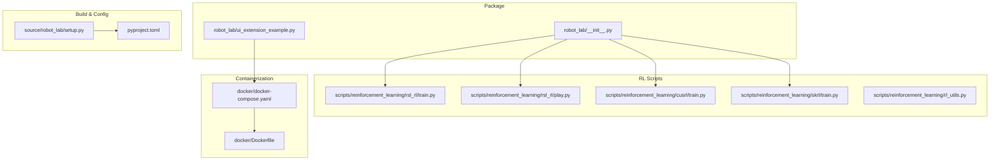
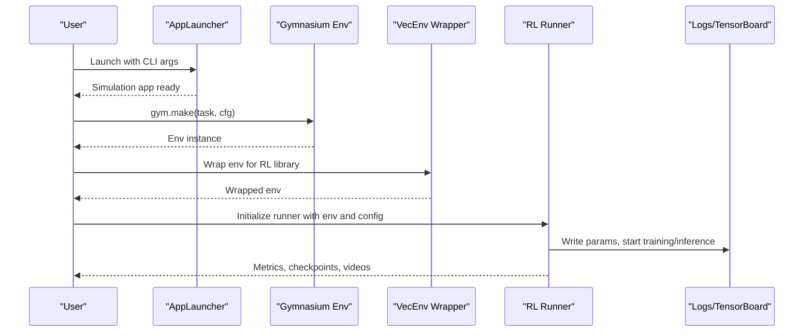
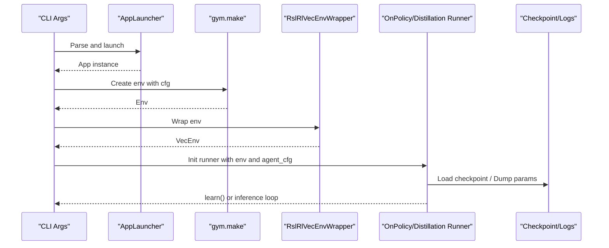
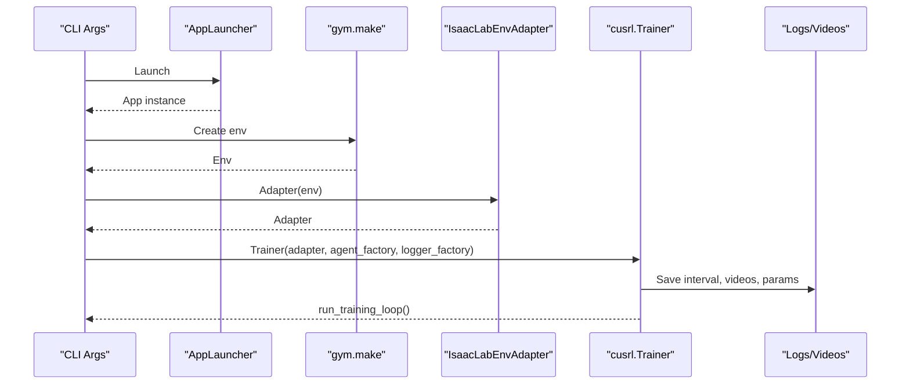
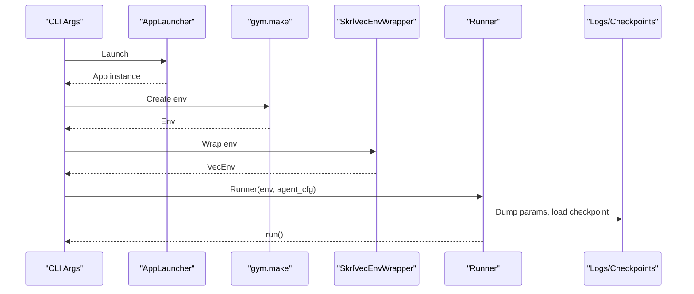
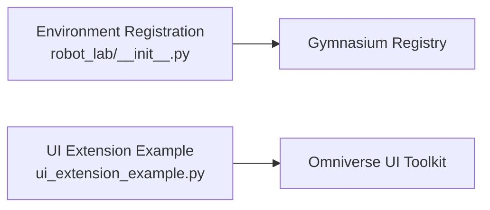
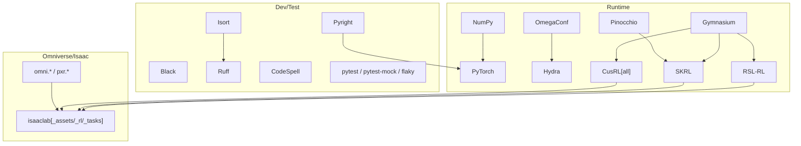
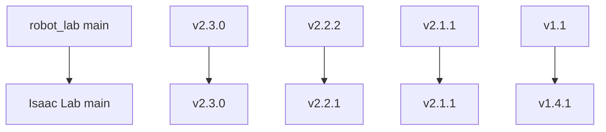
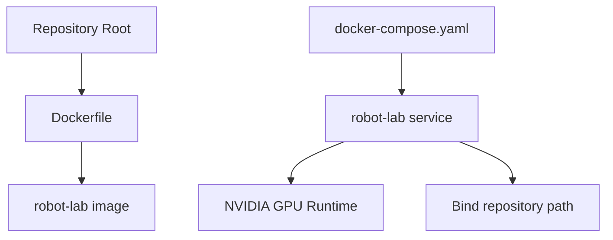

# Technology Stack

<cite>
**Referenced Files in This Document**
- [README.md](file://README.md)
- [pyproject.toml](file://pyproject.toml)
- [docker/Dockerfile](file://docker/Dockerfile)
- [docker/docker-compose.yaml](file://docker/docker-compose.yaml)
- [source/robot_lab/setup.py](file://source/robot_lab/setup.py)
- [source/robot_lab/robot_lab/__init__.py](file://source/robot_lab/robot_lab/__init__.py)
- [source/robot_lab/robot_lab/ui_extension_example.py](file://source/robot_lab/robot_lab/ui_extension_example.py)
- [scripts/reinforcement_learning/rsl_rl/train.py](file://scripts/reinforcement_learning/rsl_rl/train.py)
- [scripts/reinforcement_learning/rsl_rl/play.py](file://scripts/reinforcement_learning/rsl_rl/play.py)
- [scripts/reinforcement_learning/cusrl/train.py](file://scripts/reinforcement_learning/cusrl/train.py)
- [scripts/reinforcement_learning/skrl/train.py](file://scripts/reinforcement_learning/skrl/train.py)
- [scripts/reinforcement_learning/rl_utils.py](file://scripts/reinforcement_learning/rl_utils.py)
</cite>

## Table of Contents
1. [Introduction](#introduction)
2. [Project Structure](#project-structure)
3. [Core Components](#core-components)
4. [Architecture Overview](#architecture-overview)
5. [Detailed Component Analysis](#detailed-component-analysis)
6. [Dependency Analysis](#dependency-analysis)
7. [Performance Considerations](#performance-considerations)
8. [Troubleshooting Guide](#troubleshooting-guide)
9. [Conclusion](#conclusion)
10. [Appendices](#appendices)

## Introduction
This document describes the technology stack used by the Robot Lab framework. It covers core dependencies (Isaac Lab integration, Gymnasium environment API compliance, and PyTorch deep learning), supported reinforcement learning libraries (RSL-RL, CusRL, SKRL), Python and system requirements, hardware recommendations for GPU-accelerated training, containerization with Docker and multi-GPU support, Omniverse extension and UI framework dependencies, version compatibility matrices, upgrade paths, and development/testing/QA tooling.

## Project Structure
Robot Lab is organized as:
- A Python package that registers Gymnasium environments and UI extensions
- Scripts for training and playing policies with three RL libraries
- Docker build and orchestration for containerized development and deployment
- Configuration and assets for robot models and tasks

**Diagram sources**
- [source/robot_lab/robot_lab/__init__.py](file://source/robot_lab/robot_lab/__init__.py#L8-L12)
- [source/robot_lab/robot_lab/ui_extension_example.py](file://source/robot_lab/robot_lab/ui_extension_example.py#L1-L50)
- [scripts/reinforcement_learning/rsl_rl/train.py](file://scripts/reinforcement_learning/rsl_rl/train.py#L1-L232)
- [scripts/reinforcement_learning/rsl_rl/play.py](file://scripts/reinforcement_learning/rsl_rl/play.py#L1-L254)
- [scripts/reinforcement_learning/cusrl/train.py](file://scripts/reinforcement_learning/cusrl/train.py#L1-L146)
- [scripts/reinforcement_learning/skrl/train.py](file://scripts/reinforcement_learning/skrl/train.py#L1-L250)
- [docker/Dockerfile](file://docker/Dockerfile#L1-L22)
- [docker/docker-compose.yaml](file://docker/docker-compose.yaml#L1-L37)
- [source/robot_lab/setup.py](file://source/robot_lab/setup.py#L1-L54)
- [pyproject.toml](file://pyproject.toml#L1-L247)

**Section sources**
- [README.md](file://README.md#L1-L501)
- [pyproject.toml](file://pyproject.toml#L1-L247)
- [docker/Dockerfile](file://docker/Dockerfile#L1-L22)
- [docker/docker-compose.yaml](file://docker/docker-compose.yaml#L1-L37)
- [source/robot_lab/setup.py](file://source/robot_lab/setup.py#L1-L54)
- [source/robot_lab/robot_lab/__init__.py](file://source/robot_lab/robot_lab/__init__.py#L1-L13)
- [source/robot_lab/robot_lab/ui_extension_example.py](file://source/robot_lab/robot_lab/ui_extension_example.py#L1-L50)

## Core Components
- Isaac Lab integration: Robot Lab builds on top of Isaac Lab and uses its environment APIs and AppLauncher for simulation lifecycle.
- Gymnasium environment API: Environments follow the Gymnasium API and are registered via the package’s initialization.
- PyTorch deep learning: All RL scripts leverage PyTorch for device management, computation, and training loops.
- Reinforcement Learning Libraries:
  - RSL-RL: Production-grade on-policy runners and distillation workflows
  - CusRL: Custom RL training pipeline with optional distributed and compilation features
  - SKRL: Research-oriented algorithms (PPO, AMP, IPPO, MAPPO) with multi-framework support
- Containerization: Docker multi-stage build and docker-compose service definition supporting multi-GPU via NVIDIA runtime

**Section sources**
- [README.md](file://README.md#L349-L400)
- [scripts/reinforcement_learning/rsl_rl/train.py](file://scripts/reinforcement_learning/rsl_rl/train.py#L80-L99)
- [scripts/reinforcement_learning/rsl_rl/play.py](file://scripts/reinforcement_learning/rsl_rl/play.py#L60-L81)
- [scripts/reinforcement_learning/cusrl/train.py](file://scripts/reinforcement_learning/cusrl/train.py#L57-L76)
- [scripts/reinforcement_learning/skrl/train.py](file://scripts/reinforcement_learning/skrl/train.py#L80-L124)
- [docker/docker-compose.yaml](file://docker/docker-compose.yaml#L7-L32)

## Architecture Overview
The RL training and playback workflows share a common pattern: initialize the simulation app, construct an environment via Gymnasium, wrap it for the chosen RL library, and run training or inference.

**Diagram sources**
- [scripts/reinforcement_learning/rsl_rl/train.py](file://scripts/reinforcement_learning/rsl_rl/train.py#L117-L220)
- [scripts/reinforcement_learning/rsl_rl/play.py](file://scripts/reinforcement_learning/rsl_rl/play.py#L158-L214)
- [scripts/reinforcement_learning/cusrl/train.py](file://scripts/reinforcement_learning/cusrl/train.py#L103-L135)
- [scripts/reinforcement_learning/skrl/train.py](file://scripts/reinforcement_learning/skrl/train.py#L203-L237)

## Detailed Component Analysis

### RSL-RL Pipeline
- Entrypoints: train.py and play.py
- Features:
  - Version pinning/validation for RSL-RL
  - Distributed training support with AppLauncher rank
  - Environment wrapping, video recording, checkpoint loading, policy export
  - Distillation runner support
- Device and determinism tuning via PyTorch backends

**Diagram sources**
- [scripts/reinforcement_learning/rsl_rl/train.py](file://scripts/reinforcement_learning/rsl_rl/train.py#L57-L77)
- [scripts/reinforcement_learning/rsl_rl/train.py](file://scripts/reinforcement_learning/rsl_rl/train.py#L138-L147)
- [scripts/reinforcement_learning/rsl_rl/train.py](file://scripts/reinforcement_learning/rsl_rl/train.py#L196-L219)
- [scripts/reinforcement_learning/rsl_rl/play.py](file://scripts/reinforcement_learning/rsl_rl/play.py#L180-L213)

**Section sources**
- [scripts/reinforcement_learning/rsl_rl/train.py](file://scripts/reinforcement_learning/rsl_rl/train.py#L57-L77)
- [scripts/reinforcement_learning/rsl_rl/train.py](file://scripts/reinforcement_learning/rsl_rl/train.py#L138-L147)
- [scripts/reinforcement_learning/rsl_rl/train.py](file://scripts/reinforcement_learning/rsl_rl/train.py#L196-L219)
- [scripts/reinforcement_learning/rsl_rl/play.py](file://scripts/reinforcement_learning/rsl_rl/play.py#L180-L213)

### CusRL Pipeline
- Entrypoints: train.py
- Features:
  - Distributed training via environment variable propagation
  - Optional autocast and torch.compile
  - Video recording per-process, logger factory selection
  - Environment adapter and trainer factory

**Diagram sources**
- [scripts/reinforcement_learning/cusrl/train.py](file://scripts/reinforcement_learning/cusrl/train.py#L46-L53)
- [scripts/reinforcement_learning/cusrl/train.py](file://scripts/reinforcement_learning/cusrl/train.py#L122-L135)

**Section sources**
- [scripts/reinforcement_learning/cusrl/train.py](file://scripts/reinforcement_learning/cusrl/train.py#L46-L53)
- [scripts/reinforcement_learning/cusrl/train.py](file://scripts/reinforcement_learning/cusrl/train.py#L122-L135)

### SKRL Pipeline
- Entrypoints: train.py
- Features:
  - Algorithm selection (PPO, AMP, IPPO, MAPPO)
  - Multi-framework backend selection (torch, jax, jax-numpy)
  - Version validation for SKRL
  - Environment wrapping and runner instantiation

**Diagram sources**
- [scripts/reinforcement_learning/skrl/train.py](file://scripts/reinforcement_learning/skrl/train.py#L66-L76)
- [scripts/reinforcement_learning/skrl/train.py](file://scripts/reinforcement_learning/skrl/train.py#L203-L237)

**Section sources**
- [scripts/reinforcement_learning/skrl/train.py](file://scripts/reinforcement_learning/skrl/train.py#L80-L98)
- [scripts/reinforcement_learning/skrl/train.py](file://scripts/reinforcement_learning/skrl/train.py#L127-L133)
- [scripts/reinforcement_learning/skrl/train.py](file://scripts/reinforcement_learning/skrl/train.py#L203-L237)

### Gymnasium Environment Registration and UI Extension
- Environments are registered centrally and exposed via the package’s initialization.
- UI extension example demonstrates Omniverse extension patterns and UI toolkit usage.

**Diagram sources**
- [source/robot_lab/robot_lab/__init__.py](file://source/robot_lab/robot_lab/__init__.py#L8-L12)
- [source/robot_lab/robot_lab/ui_extension_example.py](file://source/robot_lab/robot_lab/ui_extension_example.py#L18-L47)

**Section sources**
- [source/robot_lab/robot_lab/__init__.py](file://source/robot_lab/robot_lab/__init__.py#L8-L12)
- [source/robot_lab/robot_lab/ui_extension_example.py](file://source/robot_lab/robot_lab/ui_extension_example.py#L1-L50)

## Dependency Analysis
- Core runtime dependencies (selected):
  - NumPy, Torch, Gymnasium, OmegaConf, Hydra
  - RSL-RL, SKRL, CusRL (with extras)
  - Pinocchio (AMP-related)
  - Testing and QA: pytest, pytest-mock, flaky
- Build and dev tooling:
  - Black, Ruff, Isort, Pyright, CodeSpell
  - Pre-commit hooks
- Omniverse/Isaac ecosystem:
  - isaaclab, isaaclab_rl, isaaclab_tasks, isaaclab_assets
  - Omnitron/UI toolkit via Omniverse extensions

**Diagram sources**
- [pyproject.toml](file://pyproject.toml#L36-L80)
- [pyproject.toml](file://pyproject.toml#L100-L176)
- [source/robot_lab/setup.py](file://source/robot_lab/setup.py#L16-L28)

**Section sources**
- [pyproject.toml](file://pyproject.toml#L36-L80)
- [pyproject.toml](file://pyproject.toml#L100-L176)
- [source/robot_lab/setup.py](file://source/robot_lab/setup.py#L16-L28)

## Performance Considerations
- Determinism vs throughput: TF32 toggles are enabled for performance; deterministic flags are set to balance reproducibility and speed.
- Distributed training:
  - RSL-RL supports multi-GPU via AppLauncher rank and seeds per process
  - SKRL supports distributed training flags and device assignment per rank
  - CusRL reads LOCAL_RANK to configure device and distributed scaling
- Mixed precision and compilation:
  - CusRL supports autocast and torch.compile for optimization
- Environment parallelism:
  - CLI flags allow increasing num_envs for throughput
- Video capture:
  - Optional video recording during training/playback adds overhead; tune intervals and lengths accordingly

**Section sources**
- [scripts/reinforcement_learning/rsl_rl/train.py](file://scripts/reinforcement_learning/rsl_rl/train.py#L111-L114)
- [scripts/reinforcement_learning/rsl_rl/train.py](file://scripts/reinforcement_learning/rsl_rl/train.py#L138-L146)
- [scripts/reinforcement_learning/skrl/train.py](file://scripts/reinforcement_learning/skrl/train.py#L142-L147)
- [scripts/reinforcement_learning/cusrl/train.py](file://scripts/reinforcement_learning/cusrl/train.py#L46-L53)
- [scripts/reinforcement_learning/cusrl/train.py](file://scripts/reinforcement_learning/cusrl/train.py#L122-L132)

## Troubleshooting Guide
- IDE indexing for Omniverse extensions:
  - Add extra Python paths in VSCode settings to include Isaac Lab and extension modules
- USD cache cleanup:
  - Temporary USD files can accumulate; clean the temporary directories as needed
- Environment availability:
  - Use the environment listing script to verify available environments after installation

**Section sources**
- [README.md](file://README.md#L452-L481)
- [README.md](file://README.md#L74-L78)

## Conclusion
Robot Lab integrates tightly with Isaac Lab and Gymnasium, offering a unified Python/PyTorch RL development stack with three RL libraries to suit production, custom, and research needs. The project emphasizes containerized workflows, multi-GPU support, and a clean extension/UI framework for Omniverse integration. Adhering to the documented compatibility and hardware recommendations ensures reliable training and deployment.

## Appendices

### Version Compatibility Matrix and Upgrade Paths
- robot_lab main branch aligns with Isaac Lab main and Isaac Sim 4.5 / 5.0 / 5.1
- Specific releases map to corresponding Isaac Lab versions

**Diagram sources**
- [README.md](file://README.md#L48-L56)

**Section sources**
- [README.md](file://README.md#L48-L56)

### Hardware and System Requirements
- Python: 3.11+ recommended; package declares >=3.10
- GPU-accelerated training: NVIDIA GPUs recommended; multi-GPU via container runtime and library-specific distributed flags
- Memory: Scales with num_envs and model sizes; adjust environment parallelism and batch sizes accordingly
- Compute: Multi-core CPUs; sufficient VRAM per GPU for desired environment counts and model complexity

**Section sources**
- [README.md](file://README.md#L5-L6)
- [docker/docker-compose.yaml](file://docker/docker-compose.yaml#L7-L13)
- [scripts/reinforcement_learning/rsl_rl/train.py](file://scripts/reinforcement_learning/rsl_rl/train.py#L138-L146)
- [scripts/reinforcement_learning/skrl/train.py](file://scripts/reinforcement_learning/skrl/train.py#L142-L147)

### Containerization and Multi-GPU Support
- Dockerfile installs the package in editable mode from the repository root
- docker-compose defines GPU access via NVIDIA runtime and binds the repository path
- Multi-GPU training is supported by passing the appropriate number of GPUs and using distributed launchers per library

**Diagram sources**
- [docker/Dockerfile](file://docker/Dockerfile#L1-L22)
- [docker/docker-compose.yaml](file://docker/docker-compose.yaml#L1-L37)

**Section sources**
- [docker/Dockerfile](file://docker/Dockerfile#L14-L17)
- [docker/docker-compose.yaml](file://docker/docker-compose.yaml#L7-L32)
- [README.md](file://README.md#L333-L347)

### Development Tools, Testing, and QA
- Formatting and linting: Black, Ruff, Isort, Pyright, CodeSpell
- Type checking: Pyright configured for Python 3.11
- Testing: pytest markers for CI; mock/flaky for robustness
- Pre-commit hooks: Automated formatting and linting

**Section sources**
- [pyproject.toml](file://pyproject.toml#L6-L247)