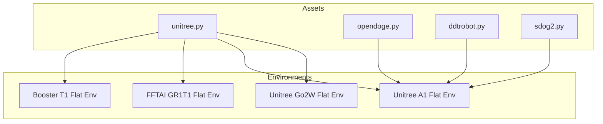
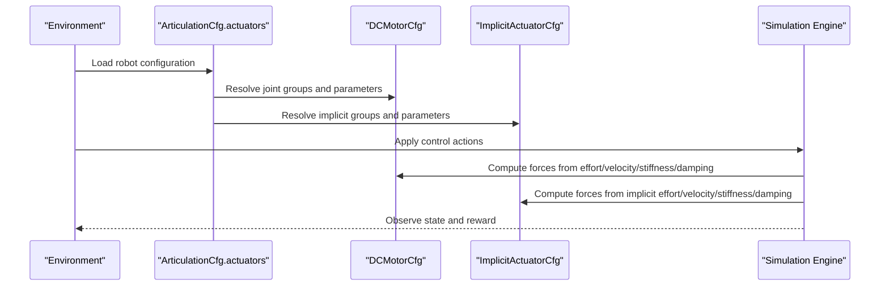
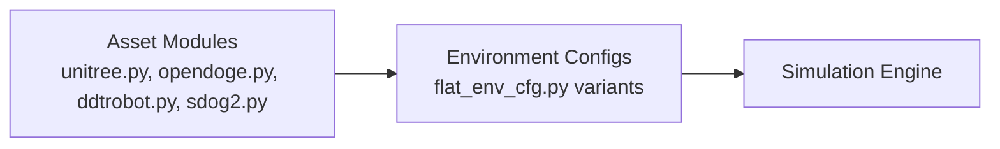

# Actuator Configurations

<cite>
**Referenced Files in This Document**
- [README.md](file://README.md)
- [unitree.py](file://source/robot_lab/robot_lab/assets/unitree.py)
- [opendoge.py](file://source/robot_lab/robot_lab/assets/opendoge.py)
- [ddtrobot.py](file://source/robot_lab/robot_lab/assets/ddtrobot.py)
- [sdog2.py](file://source/robot_lab/robot_lab/assets/sdog2.py)
- [flat_env_cfg.py (Booster T1)](file://source/robot_lab/robot_lab/tasks/manager_based/locomotion/velocity/config/humanoid/booster_t1/flat_env_cfg.py)
- [flat_env_cfg.py (FFTAI GR1T1)](file://source/robot_lab/robot_lab/tasks/manager_based/locomotion/velocity/config/humanoid/fftai_gr1t1/flat_env_cfg.py)
- [flat_env_cfg.py (Unitree A1)](file://source/robot_lab/robot_lab/tasks/manager_based/locomotion/velocity/config/quadruped/unitree_a1/flat_env_cfg.py)
- [flat_env_cfg.py (Unitree Go2W)](file://source/robot_lab/robot_lab/tasks/manager_based/locomotion/velocity/config/wheeled/unitree_go2w/flat_env_cfg.py)
</cite>

## Table of Contents
1. [Introduction](#introduction)
2. [Project Structure](#project-structure)
3. [Core Components](#core-components)
4. [Architecture Overview](#architecture-overview)
5. [Detailed Component Analysis](#detailed-component-analysis)
6. [Dependency Analysis](#dependency-analysis)
7. [Performance Considerations](#performance-considerations)
8. [Troubleshooting Guide](#troubleshooting-guide)
9. [Conclusion](#conclusion)
10. [Appendices](#appendices)

## Introduction
This document explains actuator configurations for realistic robot simulation within the repository. It focuses on two actuator model types:
- DCMotorCfg: Explicit motor models per joint group with effort, velocity, stiffness, damping, and friction parameters.
- ImplicitActuatorCfg: Implicit actuators that emulate motor behavior with simplified parameters, commonly used for wheels or passive-like joints.

It covers how actuators are defined, mapped to joints and groups, validated, tuned for different robot categories (quadrupeds, wheeled, humanoids), and how they influence simulation dynamics. Practical examples illustrate tuning strategies and safety considerations.

## Project Structure
Actuator configurations are defined in robot asset modules and consumed by environment configurations. The repository organizes assets and environments by robot category and task.

**Diagram sources**
- [unitree.py](file://source/robot_lab/robot_lab/assets/unitree.py#L1-L637)
- [opendoge.py](file://source/robot_lab/robot_lab/assets/opendoge.py#L1-L86)
- [ddtrobot.py](file://source/robot_lab/robot_lab/assets/ddtrobot.py#L1-L100)
- [sdog2.py](file://source/robot_lab/robot_lab/assets/sdog2.py#L1-L80)
- [flat_env_cfg.py (Booster T1)](file://source/robot_lab/robot_lab/tasks/manager_based/locomotion/velocity/config/humanoid/booster_t1/flat_env_cfg.py#L1-L33)
- [flat_env_cfg.py (FFTAI GR1T1)](file://source/robot_lab/robot_lab/tasks/manager_based/locomotion/velocity/config/humanoid/fftai_gr1t1/flat_env_cfg.py#L1-L30)
- [flat_env_cfg.py (Unitree A1)](file://source/robot_lab/robot_lab/tasks/manager_based/locomotion/velocity/config/quadruped/unitree_a1/flat_env_cfg.py#L1-L30)
- [flat_env_cfg.py (Unitree Go2W)](file://source/robot_lab/robot_lab/tasks/manager_based/locomotion/velocity/config/wheeled/unitree_go2w/flat_env_cfg.py#L1-L30)

**Section sources**
- [README.md](file://README.md#L1-L501)

## Core Components
- DCMotorCfg: Defines explicit motor behavior per group with:
  - effort_limit and saturation_effort
  - velocity_limit
  - stiffness, damping, friction
- ImplicitActuatorCfg: Defines implicit actuators per group with:
  - effort_limit_sim and velocity_limit_sim
  - stiffness, damping, friction
  - Optional armature for inertia modeling

Key mapping:
- Joint groups are defined via joint_names_expr (regex) and applied to named actuators in the ArticulationCfg.actuators dictionary.
- Explicit motors (DCMotorCfg) are ideal for articulated legs and arms where precise torque/velocity control is desired.
- Implicit actuators are suited for wheels or passive-like joints where a simpler, often compliant model suffices.

**Section sources**
- [unitree.py](file://source/robot_lab/robot_lab/assets/unitree.py#L54-L65)
- [unitree.py](file://source/robot_lab/robot_lab/assets/unitree.py#L157-L175)
- [unitree.py](file://source/robot_lab/robot_lab/assets/unitree.py#L284-L321)
- [unitree.py](file://source/robot_lab/robot_lab/assets/unitree.py#L503-L623)
- [opendoge.py](file://source/robot_lab/robot_lab/assets/opendoge.py#L47-L83)
- [ddtrobot.py](file://source/robot_lab/robot_lab/assets/ddtrobot.py#L60-L98)

## Architecture Overview
Actuator configuration flow:
- Robot asset modules define ArticulationCfg with actuators (DCMotorCfg or ImplicitActuatorCfg).
- Environment configurations inherit base settings and apply task-specific overrides (e.g., terrain, rewards).
- During simulation, the actuator models translate control actions into forces/torques applied to joints according to their parameters.

**Diagram sources**
- [unitree.py](file://source/robot_lab/robot_lab/assets/unitree.py#L1-L637)
- [opendoge.py](file://source/robot_lab/robot_lab/assets/opendoge.py#L1-L86)
- [ddtrobot.py](file://source/robot_lab/robot_lab/assets/ddtrobot.py#L1-L100)
- [flat_env_cfg.py (Unitree Go2W)](file://source/robot_lab/robot_lab/tasks/manager_based/locomotion/velocity/config/wheeled/unitree_go2w/flat_env_cfg.py#L1-L30)

## Detailed Component Analysis

### DCMotorCfg vs ImplicitActuatorCfg
- DCMotorCfg:
  - Use when precise torque and velocity limits are required.
  - Suitable for leg joints where stiffness and damping shape contact dynamics.
  - Parameters include effort_limit, saturation_effort, velocity_limit, stiffness, damping, friction.
- ImplicitActuatorCfg:
  - Use for wheels or passive-like joints.
  - Simplified parameters: effort_limit_sim, velocity_limit_sim, stiffness, damping, friction.
  - Can optionally include armature for inertia effects.

Mapping:
- joint_names_expr selects joints per group.
- Groups are keyed in the actuators dictionary (e.g., "legs", "hip", "thigh", "calf", "wheel", "wheels").

Validation:
- Ensure joint_names_expr matches URDF joint names.
- Verify effort_limit and velocity_limit are physically plausible for the robot’s payload and speed.
- Confirm stiffness and damping align with intended contact compliance and stability.

**Section sources**
- [unitree.py](file://source/robot_lab/robot_lab/assets/unitree.py#L54-L65)
- [unitree.py](file://source/robot_lab/robot_lab/assets/unitree.py#L157-L175)
- [unitree.py](file://source/robot_lab/robot_lab/assets/unitree.py#L284-L321)
- [unitree.py](file://source/robot_lab/robot_lab/assets/unitree.py#L503-L623)
- [opendoge.py](file://source/robot_lab/robot_lab/assets/opendoge.py#L47-L83)
- [ddtrobot.py](file://source/robot_lab/robot_lab/assets/ddtrobot.py#L60-L98)

### Quadruped Actuator Configurations
- Unitree A1 (explicit motors for all joints):
  - Single group "legs" applies effort/velocity limits and PD gains across joint names matching pattern.
- Unitree Go2 (explicit motors for all joints):
  - Single group "legs" with higher velocity limit compared to A1.
- Unitree B2 (explicit motors per limb segment):
  - Separate groups "hip", "thigh", "calf" with distinct effort and velocity limits reflecting joint roles.
- Unitree B2W (mixed):
  - Groups "hip", "thigh", "calf" with explicit motors.
  - Group "wheel" uses implicit actuator for foot joints to simulate rolling compliance.

Practical tuning tips:
- Increase velocity_limit for larger joints (e.g., hip/thigh) and reduce for distal joints (e.g., calf).
- Adjust stiffness to balance contact stability; higher stiffness improves tracking but may increase oscillations.
- Friction can be kept near zero for smooth motion unless surface adhesion is modeled explicitly.

**Section sources**
- [unitree.py](file://source/robot_lab/robot_lab/assets/unitree.py#L19-L69)
- [unitree.py](file://source/robot_lab/robot_lab/assets/unitree.py#L71-L119)
- [unitree.py](file://source/robot_lab/robot_lab/assets/unitree.py#L179-L245)
- [unitree.py](file://source/robot_lab/robot_lab/assets/unitree.py#L248-L323)

### Wheeled Actuator Configurations
- Unitree Go2W:
  - Group "legs" uses implicit actuators for leg joints with PD gains.
  - Group "wheels" uses implicit actuators for foot joints with zero stiffness to emulate free-rolling wheels.
- DDT TITA:
  - Separate groups for "hip", "thigh", "calf", and "wheel".
  - Wheel group has zero stiffness and nonzero damping to model rolling resistance.

Tuning tips:
- Set wheel stiffness to zero or very low to avoid rigid contact.
- Use small damping to approximate rolling friction.
- Match wheel effort_limit_sim to expected normal force and friction coefficient.

**Section sources**
- [unitree.py](file://source/robot_lab/robot_lab/assets/unitree.py#L121-L177)
- [unitree.py](file://source/robot_lab/robot_lab/assets/unitree.py#L312-L321)
- [ddtrobot.py](file://source/robot_lab/robot_lab/assets/ddtrobot.py#L60-L98)

### Humanoid Actuator Configurations
- Unitree G1 (29 DOF):
  - Multiple implicit actuator groups: "legs", "feet", "waist", "waist_yaw", "arms".
  - Each group defines per-joint effort_limit_sim, velocity_limit_sim, stiffness, damping, and armature.
  - Action scaling constants computed from effort and stiffness per joint.

Tuning tips:
- Assign higher effort/velocity limits and stiffness to major load-bearing joints (hips, knees).
- Reduce limits for wrists and ankles to protect smaller actuators.
- Use armature to reflect inertia effects for accurate dynamic response.

**Section sources**
- [unitree.py](file://source/robot_lab/robot_lab/assets/unitree.py#L466-L623)
- [unitree.py](file://source/robot_lab/robot_lab/assets/unitree.py#L625-L637)

### Quadruped Example: OpenDog APX and SDog SDog2
- OpenDog APX:
  - Two explicit motor groups: "base_legs_hip_thigh" and "base_legs_calf".
  - Effort and velocity limits tailored to motor capabilities; damping chosen for compliance.
- SDog SDog2:
  - Similar grouping with explicit motors for hip/thigh and calf joints.

Tuning tips:
- Scale effort_limit and saturation_effort conservatively to prevent overcurrent.
- Align velocity_limit with target locomotion speed; reduce for fine manipulation joints.

**Section sources**
- [opendoge.py](file://source/robot_lab/robot_lab/assets/opendoge.py#L47-L83)
- [ddtrobot.py](file://source/robot_lab/robot_lab/assets/ddtrobot.py#L60-L98)

### Environment Integration
- Flat terrain environments inherit base configurations and remove terrain-dependent sensors/rewards.
- These overrides do not alter actuator parameters but focus observations and curriculum on flat-ground locomotion.

**Section sources**
- [flat_env_cfg.py (Booster T1)](file://source/robot_lab/robot_lab/tasks/manager_based/locomotion/velocity/config/humanoid/booster_t1/flat_env_cfg.py#L1-L33)
- [flat_env_cfg.py (FFTAI GR1T1)](file://source/robot_lab/robot_lab/tasks/manager_based/locomotion/velocity/config/humanoid/fftai_gr1t1/flat_env_cfg.py#L1-L30)
- [flat_env_cfg.py (Unitree A1)](file://source/robot_lab/robot_lab/tasks/manager_based/locomotion/velocity/config/quadruped/unitree_a1/flat_env_cfg.py#L1-L30)
- [flat_env_cfg.py (Unitree Go2W)](file://source/robot_lab/robot_lab/tasks/manager_based/locomotion/velocity/config/wheeled/unitree_go2w/flat_env_cfg.py#L1-L30)

## Dependency Analysis
Actuator configuration depends on:
- Robot asset modules defining ArticulationCfg and actuators.
- Environment configurations inheriting base settings and applying task-specific adjustments.
- Simulation engine interpreting actuator parameters to compute forces/torques.

**Diagram sources**
- [unitree.py](file://source/robot_lab/robot_lab/assets/unitree.py#L1-L637)
- [opendoge.py](file://source/robot_lab/robot_lab/assets/opendoge.py#L1-L86)
- [ddtrobot.py](file://source/robot_lab/robot_lab/assets/ddtrobot.py#L1-L100)
- [flat_env_cfg.py (Unitree Go2W)](file://source/robot_lab/robot_lab/tasks/manager_based/locomotion/velocity/config/wheeled/unitree_go2w/flat_env_cfg.py#L1-L30)

**Section sources**
- [README.md](file://README.md#L383-L400)

## Performance Considerations
- Stiffness and damping:
  - Higher stiffness increases responsiveness but may cause numerical stiffness and require smaller timesteps.
  - Excessive damping can slow response and waste energy; tune to achieve desired settling time.
- Velocity limits:
  - Ensure velocity_limit exceeds expected peak velocities; otherwise, saturation will clip control input.
- Effort limits:
  - Match effort_limit to motor capabilities; excessive limits can lead to unrealistic accelerations and instability.
- Implicit actuators:
  - Prefer for wheels to reduce computational overhead and improve stability.
- Armature:
  - Use for accurate inertia effects in humanoid simulations; too large values can slow dynamics.

[No sources needed since this section provides general guidance]

## Troubleshooting Guide
Common issues and resolutions:
- Jittery or unstable simulation:
  - Reduce stiffness and damping gradually; verify mass/inertia scaling.
  - Check velocity_limit and effort_limit; ensure they are not excessively high for the robot mass.
- Wheels spinning uncontrollably:
  - Set wheel stiffness near zero and introduce small damping for rolling resistance.
  - Verify joint friction and surface parameters.
- Legs unable to support body weight:
  - Increase effort_limit_sim or explicit effort_limit for load-bearing joints.
  - Lower stiffness temporarily to improve compliance and stability.
- Overheating or overcurrent warnings:
  - Decrease saturation_effort and effort_limit_sim to stay within motor limits.
  - Verify joint_names_expr to avoid misapplied actuator groups.
- Incorrect joint mapping:
  - Validate joint_names_expr against URDF joint names; ensure regex captures intended joints.

**Section sources**
- [unitree.py](file://source/robot_lab/robot_lab/assets/unitree.py#L157-L175)
- [unitree.py](file://source/robot_lab/robot_lab/assets/unitree.py#L312-L321)
- [opendoge.py](file://source/robot_lab/robot_lab/assets/opendoge.py#L47-L83)
- [ddtrobot.py](file://source/robot_lab/robot_lab/assets/ddtrobot.py#L60-L98)

## Conclusion
Actuator configurations are central to realistic robot simulation. DCMotorCfg offers precise control for articulated joints, while ImplicitActuatorCfg streamlines wheel and passive-like joints. Proper tuning of effort/velocity limits, stiffness, damping, and friction ensures stable, efficient, and safe simulations across quadrupeds, wheeled platforms, and humanoids. Validation through environment overrides and careful parameter selection yields robust locomotion and interaction behaviors.

[No sources needed since this section summarizes without analyzing specific files]

## Appendices

### Parameter Reference Summary
- DCMotorCfg parameters:
  - effort_limit, saturation_effort, velocity_limit, stiffness, damping, friction
- ImplicitActuatorCfg parameters:
  - effort_limit_sim, velocity_limit_sim, stiffness, damping, friction, armature

Mapping:
- joint_names_expr: Regex used to select joints for a group.
- actuators: Dictionary mapping group names to actuator configurations.

**Section sources**
- [unitree.py](file://source/robot_lab/robot_lab/assets/unitree.py#L54-L65)
- [unitree.py](file://source/robot_lab/robot_lab/assets/unitree.py#L157-L175)
- [unitree.py](file://source/robot_lab/robot_lab/assets/unitree.py#L284-L321)
- [unitree.py](file://source/robot_lab/robot_lab/assets/unitree.py#L503-L623)
- [opendoge.py](file://source/robot_lab/robot_lab/assets/opendoge.py#L47-L83)
- [ddtrobot.py](file://source/robot_lab/robot_lab/assets/ddtrobot.py#L60-L98)