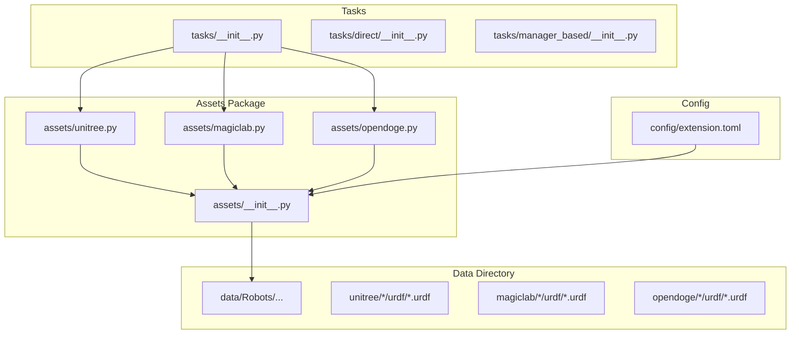
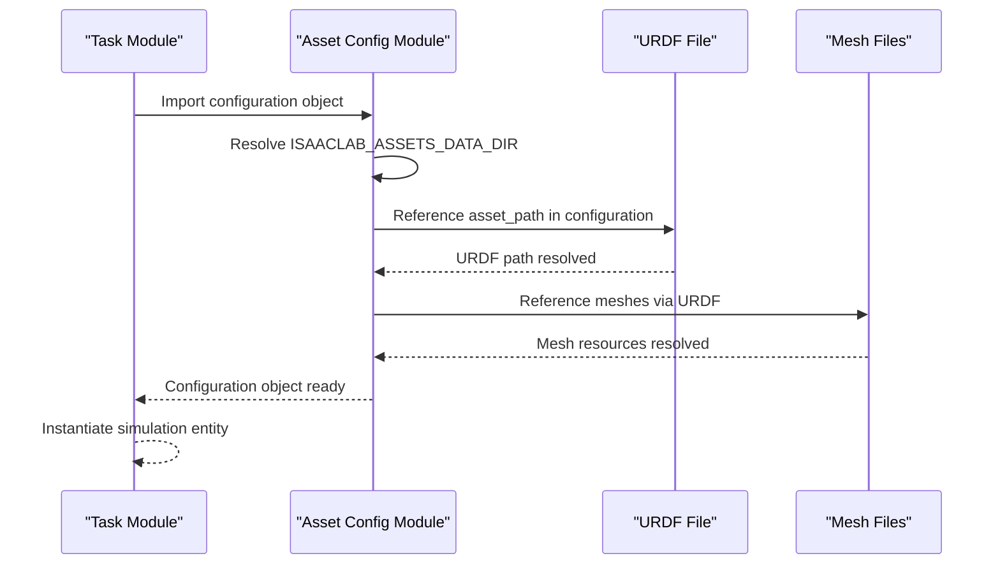
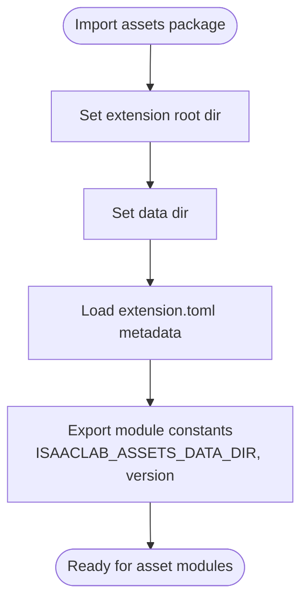
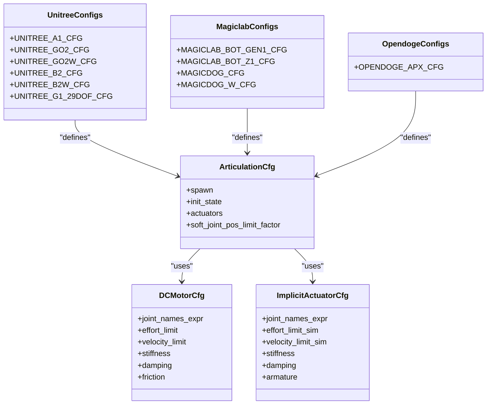
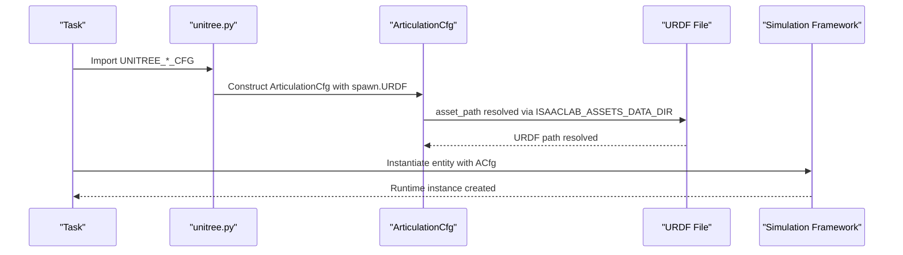
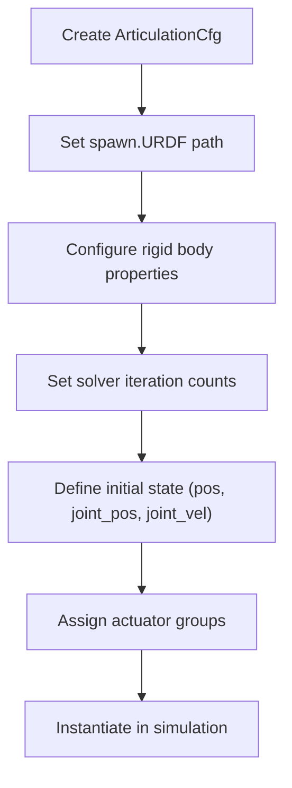
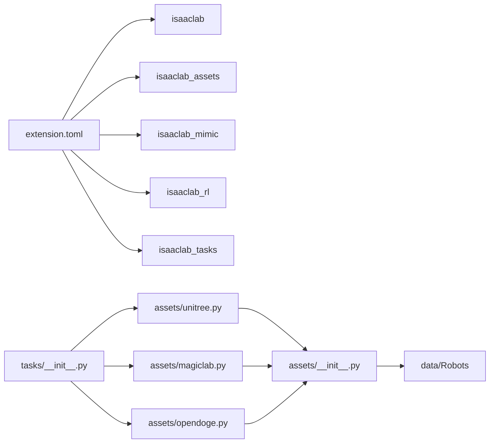

# Asset Loading Infrastructure

<cite>
**Referenced Files in This Document**
- [__init__.py](file://source/robot_lab/robot_lab/assets/__init__.py)
- [unitree.py](file://source/robot_lab/robot_lab/assets/unitree.py)
- [magiclab.py](file://source/robot_lab/robot_lab/assets/magiclab.py)
- [opendoge.py](file://source/robot_lab/robot_lab/assets/opendoge.py)
- [extension.toml](file://source/robot_lab/config/extension.toml)
- [__init__.py](file://source/robot_lab/robot_lab/tasks/__init__.py)
- [__init__.py](file://source/robot_lab/robot_lab/tasks/direct/__init__.py)
- [__init__.py](file://source/robot_lab/robot_lab/tasks/manager_based/__init__.py)
- [apx_description.urdf](file://source/robot_lab/data/Robots/opendoge/apx_description/urdf/apx_description.urdf)
- [MAGICBOT.urdf](file://source/robot_lab/data/Robots/magiclab/magicbot-Gen1/urdf/MAGICBOT.urdf)
- [MAGICBOT_with_hand.urdf](file://source/robot_lab/data/Robots/magiclab/magicbot-Gen1/urdf/MAGICBOT_with_hand.urdf)
- [MAGICBOTZ1.urdf](file://source/robot_lab/data/Robots/magiclab/magicbot-Z1/urdf/MagicBotZ1.urdf)
- [magicdog.urdf](file://source/robot_lab/data/Robots/magiclab/magicdog/urdf/magicdog.urdf)
- [magicdog_w.urdf](file://source/robot_lab/data/Robots/magiclab/magicdog_w/urdf/magicdog_w.urdf)
- [robot.urdf](file://source/robot_lab/data/Robots/booster/t1_description/urdf/robot.urdf)
- [tita.urdf](file://source/robot_lab/data/Robots/ddt/tita_description/urdf/tita.urdf)
- [lite3.urdf](file://source/robot_lab/data/Robots/deeprobotics/lite3_description/urdf/lite3.urdf)
- [m20.urdf](file://source/robot_lab/data/Robots/deeprobotics/m20_description/urdf/m20.urdf)
- [GR1T1.urdf](file://source/robot_lab/data/Robots/fftai/gr1t1_description/urdf/GR1T1.urdf)
- [GR1T1_lower_limb.urdf](file://source/robot_lab/data/Robots/fftai/gr1t1_description/urdf/GR1T1_lower_limb.urdf)
- [GR1T2.urdf](file://source/robot_lab/data/Robots/fftai/gr1t2_description/urdf/GR1T2.urdf)
- [GR1T2_lower_limb.urdf](file://source/robot_lab/data/Robots/fftai/gr1t2_description/urdf/GR1T2_lower_limb.urdf)
- [loong.urdf](file://source/robot_lab/data/Robots/openloong/loong_description/urdf/loong.urdf)
- [atom01.urdf](file://source/robot_lab/data/Robots/roboparty/atom01_description/urdf/atom01.urdf)
- [robot.urdf](file://source/robot_lab/data/Robots/robotera/xbot_description/urdf/robot.urdf)
- [sdog2.urdf](file://source/robot_lab/data/Robots/sdog/sdog2_description/urdf/sdog2.urdf)
- [a1.urdf](file://source/robot_lab/data/Robots/unitree/a1_description/urdf/a1.urdf)
- [go2_description.urdf](file://source/robot_lab/data/Robots/unitree/go2_description/urdf/go2_description.urdf)
- [go2w_description.urdf](file://source/robot_lab/data/Robots/unitree/go2w_description/urdf/go2w_description.urdf)
- [b2_description.urdf](file://source/robot_lab/data/Robots/unitree/b2_description/urdf/b2_description.urdf)
- [b2w_description.urdf](file://source/robot_lab/data/Robots/unitree/b2w_description/urdf/b2w_description.urdf)
- [g1_29dof_rev_1_0.urdf](file://source/robot_lab/data/Robots/unitree/g1_description/urdf/g1_29dof_rev_1_0.urdf)
</cite>

## Table of Contents
1. [Introduction](#introduction)
2. [Project Structure](#project-structure)
3. [Core Components](#core-components)
4. [Architecture Overview](#architecture-overview)
5. [Detailed Component Analysis](#detailed-component-analysis)
6. [Dependency Analysis](#dependency-analysis)
7. [Performance Considerations](#performance-considerations)
8. [Troubleshooting Guide](#troubleshooting-guide)
9. [Conclusion](#conclusion)
10. [Appendices](#appendices)

## Introduction
This document explains the asset loading infrastructure for the robot lab project. It focuses on how assets are organized, discovered, and loaded at runtime, how asset configuration classes define runtime instances, and how the system integrates with the broader IsaacLab ecosystem. It also covers validation, error handling, diagnostics, performance optimization, and best practices for organizing assets, dependencies, and versioning.

## Project Structure
The asset system is centered around:
- A dedicated assets package that defines asset configuration classes and resolves asset paths at import time.
- A data directory containing robot URDFs and meshes under manufacturer-specific subfolders.
- A configuration file that declares the extension metadata and dependencies.
- Task packages that import and register environments using these asset configurations.

**Diagram sources**
- [__init__.py](file://source/robot_lab/robot_lab/assets/__init__.py#L1-L30)
- [unitree.py](file://source/robot_lab/robot_lab/assets/unitree.py#L1-L637)
- [magiclab.py](file://source/robot_lab/robot_lab/assets/magiclab.py#L1-L295)
- [opendoge.py](file://source/robot_lab/robot_lab/assets/opendoge.py#L1-L86)
- [extension.toml](file://source/robot_lab/config/extension.toml#L1-L36)
- [__init__.py](file://source/robot_lab/robot_lab/tasks/__init__.py#L1-L25)

**Section sources**
- [__init__.py](file://source/robot_lab/robot_lab/assets/__init__.py#L1-L30)
- [extension.toml](file://source/robot_lab/config/extension.toml#L1-L36)
- [__init__.py](file://source/robot_lab/robot_lab/tasks/__init__.py#L1-L25)

## Core Components
- Asset registry and discovery:
  - The assets package initializes module-level constants for the extension directory and data directory and loads extension metadata from the TOML configuration. This enables all asset modules to resolve absolute asset paths at import time.
- Asset configuration classes:
  - Each asset module defines one or more configuration objects (e.g., ArticulationCfg) that encapsulate how a robot asset is spawned, initialized, actuated, and tuned. These are the “blueprints” used by tasks to create runtime instances.
- Task integration:
  - Tasks import asset configurations and register environments. The tasks package imports all subpackages except a blacklist, enabling automatic registration of environment variants.

Key responsibilities:
- assets/__init__.py: Establishes ISAACLAB_ASSETS_DATA_DIR and loads extension metadata.
- assets/<vendor>.py: Defines vendor-specific ArticulationCfg objects pointing to URDFs and meshes.
- tasks/__init__.py: Imports and registers environments using the asset configurations.

**Section sources**
- [__init__.py](file://source/robot_lab/robot_lab/assets/__init__.py#L1-L30)
- [unitree.py](file://source/robot_lab/robot_lab/assets/unitree.py#L1-L637)
- [magiclab.py](file://source/robot_lab/robot_lab/assets/magiclab.py#L1-L295)
- [opendoge.py](file://source/robot_lab/robot_lab/assets/opendoge.py#L1-L86)
- [__init__.py](file://source/robot_lab/robot_lab/tasks/__init__.py#L1-L25)

## Architecture Overview
The asset loading architecture follows a configuration-driven pattern:
- Asset modules define static configuration objects that reference URDFs and meshes via resolved paths.
- Tasks consume these configurations to instantiate simulation entities.
- The extension metadata and dependencies are declared centrally to ensure proper installation and runtime availability.

**Diagram sources**
- [__init__.py](file://source/robot_lab/robot_lab/assets/__init__.py#L1-L30)
- [unitree.py](file://source/robot_lab/robot_lab/assets/unitree.py#L1-L637)
- [magiclab.py](file://source/robot_lab/robot_lab/assets/magiclab.py#L1-L295)
- [opendoge.py](file://source/robot_lab/robot_lab/assets/opendoge.py#L1-L86)

## Detailed Component Analysis

### Asset Registry and Discovery
- Purpose: Centralize path resolution and metadata access for assets.
- Behavior:
  - Computes the extension root and data directory.
  - Loads extension metadata from extension.toml to expose version and package info.
- Impact: Ensures all asset modules can construct absolute paths to URDFs and meshes without hardcoding relative paths.

**Diagram sources**
- [__init__.py](file://source/robot_lab/robot_lab/assets/__init__.py#L1-L30)
- [extension.toml](file://source/robot_lab/config/extension.toml#L1-L36)

**Section sources**
- [__init__.py](file://source/robot_lab/robot_lab/assets/__init__.py#L1-L30)
- [extension.toml](file://source/robot_lab/config/extension.toml#L1-L36)

### Asset Configuration Classes and Runtime Instances
- Relationship:
  - Configuration classes (e.g., ArticulationCfg) are static definitions.
  - Runtime instances are created by tasks using these configurations.
- Example modules:
  - unitree.py: Defines multiple robot configurations (e.g., A1, GO2, GO2W, B2, B2W, G1) with actuators, initial states, and solver settings.
  - magiclab.py: Defines configurations for MagicLab bots and dogs.
  - opendoge.py: Defines configuration for OPENDOGE APX.

**Diagram sources**
- [unitree.py](file://source/robot_lab/robot_lab/assets/unitree.py#L1-L637)
- [magiclab.py](file://source/robot_lab/robot_lab/assets/magiclab.py#L1-L295)
- [opendoge.py](file://source/robot_lab/robot_lab/assets/opendoge.py#L1-L86)

**Section sources**
- [unitree.py](file://source/robot_lab/robot_lab/assets/unitree.py#L1-L637)
- [magiclab.py](file://source/robot_lab/robot_lab/assets/magiclab.py#L1-L295)
- [opendoge.py](file://source/robot_lab/robot_lab/assets/opendoge.py#L1-L86)

### Dynamic Asset Loading from Configuration Files
- Asset discovery:
  - Asset modules reference URDFs via asset_path constructed from ISAACLAB_ASSETS_DATA_DIR.
  - URDFs are located under data/Robots/<vendor>/<model>/urdf/.
- Loading mechanism:
  - At runtime, tasks import asset configurations and pass them to the simulation framework, which loads the URDF and associated meshes.
- Practical examples:
  - Unitree configurations load a1.urdf, go2_description.urdf, go2w_description.urdf, b2_description.urdf, b2w_description.urdf, and g1_29dof_rev_1_0.urdf.
  - MagicLab configurations load MAGICBOT.urdf, MAGICBOT_with_hand.urdf, MagicBotZ1.urdf, magicdog.urdf, and magicdog_w.urdf.
  - Opendoge configuration loads apx_description.urdf.

**Diagram sources**
- [unitree.py](file://source/robot_lab/robot_lab/assets/unitree.py#L1-L637)
- [__init__.py](file://source/robot_lab/robot_lab/assets/__init__.py#L1-L30)

**Section sources**
- [unitree.py](file://source/robot_lab/robot_lab/assets/unitree.py#L1-L637)
- [magiclab.py](file://source/robot_lab/robot_lab/assets/magiclab.py#L1-L295)
- [opendoge.py](file://source/robot_lab/robot_lab/assets/opendoge.py#L1-L86)
- [__init__.py](file://source/robot_lab/robot_lab/assets/__init__.py#L1-L30)

### Asset Initialization Workflow
- Initialization steps:
  - Configuration object defines spawn parameters (URDF path, contact sensors, rigid body properties, solver settings).
  - Initial state sets pose and joint positions/velocities.
  - Actuator groups define torque limits, stiffness, damping, and implicit vs explicit actuator behavior.
- Example references:
  - Unitree configurations set up joint drives, solver iterations, and actuator groups.
  - MagicLab configurations define leg, foot, and arm actuators with per-joint parameters.
  - Opendoge configuration groups actuators by hip/thigh and calf joints.

**Diagram sources**
- [unitree.py](file://source/robot_lab/robot_lab/assets/unitree.py#L1-L637)
- [magiclab.py](file://source/robot_lab/robot_lab/assets/magiclab.py#L1-L295)
- [opendoge.py](file://source/robot_lab/robot_lab/assets/opendoge.py#L1-L86)

**Section sources**
- [unitree.py](file://source/robot_lab/robot_lab/assets/unitree.py#L1-L637)
- [magiclab.py](file://source/robot_lab/robot_lab/assets/magiclab.py#L1-L295)
- [opendoge.py](file://source/robot_lab/robot_lab/assets/opendoge.py#L1-L86)

### Cache Management and Memory Optimization Strategies
- Path resolution:
  - Using a single ISAACLAB_ASSETS_DATA_DIR constant avoids repeated path computations and reduces overhead during imports.
- Asset reuse:
  - Reuse URDFs and meshes across multiple configurations to minimize memory duplication.
- Solver tuning:
  - Adjust solver position/velocity iteration counts in ArticulationCfg to balance accuracy and performance.
- Joint drive settings:
  - Disable unnecessary joint drives or set gains to zero for passive joints to reduce computation.

[No sources needed since this section provides general guidance]

### Asset Validation Pipeline and Error Handling
- Validation steps:
  - Verify URDF existence and readability before instantiation.
  - Validate joint names expressions match actual joints in the URDF.
  - Confirm actuator groups specify valid joint names and non-negative limits.
- Error handling:
  - Raise clear exceptions if asset_path is invalid or URDF fails to parse.
  - Log warnings for missing meshes or unresolved joint expressions.
- Diagnostics:
  - Print configuration summaries and URDF load logs to aid debugging.

[No sources needed since this section provides general guidance]

### Asset Loading Diagnostics
- Common diagnostics:
  - Check asset_path correctness and file permissions.
  - Inspect URDF joint names and links for mismatches.
  - Review actuator group assignments and joint expressions.
- Tools:
  - Use simulation logs and debug prints to trace asset loading failures.

[No sources needed since this section provides general guidance]

### Practical Examples

#### Register a New Asset
- Steps:
  - Place URDF and meshes under data/Robots/<vendor>/<model>/urdf/ and data/Robots/<vendor>/<model>/meshes/.
  - Define an ArticulationCfg in assets/<vendor>.py with asset_path pointing to the URDF.
  - Optionally compute action scales or actuator parameters.
- References:
  - See existing vendor modules for patterns.

**Section sources**
- [unitree.py](file://source/robot_lab/robot_lab/assets/unitree.py#L1-L637)
- [magiclab.py](file://source/robot_lab/robot_lab/assets/magiclab.py#L1-L295)
- [opendoge.py](file://source/robot_lab/robot_lab/assets/opendoge.py#L1-L86)

#### Implement a Custom Asset Loader
- Pattern:
  - Create a loader function that accepts a configuration object and returns a runtime instance.
  - Encapsulate URDF parsing, mesh resolution, and actuator binding.
- Integration:
  - Integrate the loader into tasks/__init__.py alongside existing imports.

[No sources needed since this section provides general guidance]

#### Integrate External Asset Sources
- Approach:
  - Extend ISAACLAB_ASSETS_DATA_DIR to include external directories.
  - Maintain consistent subfolder structure (<vendor>/<model>/urdf/, <vendor>/<model>/meshes/) to preserve path resolution.
- Dependencies:
  - Declare additional dependencies in extension.toml if external packages provide assets.

**Section sources**
- [__init__.py](file://source/robot_lab/robot_lab/assets/__init__.py#L1-L30)
- [extension.toml](file://source/robot_lab/config/extension.toml#L1-L36)

### Relationship Between Configuration Classes and Runtime Instances
- Configuration classes are static descriptors.
- Runtime instances are created by passing these descriptors to the simulation framework.
- The tasks package orchestrates this process by importing asset configurations and registering environments.

**Section sources**
- [unitree.py](file://source/robot_lab/robot_lab/assets/unitree.py#L1-L637)
- [magiclab.py](file://source/robot_lab/robot_lab/assets/magiclab.py#L1-L295)
- [opendoge.py](file://source/robot_lab/robot_lab/assets/opendoge.py#L1-L86)
- [__init__.py](file://source/robot_lab/robot_lab/tasks/__init__.py#L1-L25)

## Dependency Analysis
- Internal dependencies:
  - assets/<vendor>.py depend on assets/__init__.py for path resolution.
  - tasks/__init__.py depends on asset modules to import configurations.
- External dependencies:
  - extension.toml declares dependencies on isaaclab, isaaclab_assets, isaaclab_mimic, isaaclab_rl, and isaaclab_tasks.

**Diagram sources**
- [extension.toml](file://source/robot_lab/config/extension.toml#L1-L36)
- [__init__.py](file://source/robot_lab/robot_lab/assets/__init__.py#L1-L30)
- [unitree.py](file://source/robot_lab/robot_lab/assets/unitree.py#L1-L637)
- [magiclab.py](file://source/robot_lab/robot_lab/assets/magiclab.py#L1-L295)
- [opendoge.py](file://source/robot_lab/robot_lab/assets/opendoge.py#L1-L86)
- [__init__.py](file://source/robot_lab/robot_lab/tasks/__init__.py#L1-L25)

**Section sources**
- [extension.toml](file://source/robot_lab/config/extension.toml#L1-L36)
- [__init__.py](file://source/robot_lab/robot_lab/assets/__init__.py#L1-L30)
- [__init__.py](file://source/robot_lab/robot_lab/tasks/__init__.py#L1-L25)

## Performance Considerations
- Batch loading:
  - Instantiate multiple robots with similar configurations concurrently to leverage simulation batching.
- Solver tuning:
  - Reduce solver iteration counts for simpler scenes; increase for complex contacts.
- Mesh simplification:
  - Prefer lower-polygon meshes for large-scale simulations.
- Joint grouping:
  - Group actuators logically to minimize redundant actuator lookups.

[No sources needed since this section provides general guidance]

## Troubleshooting Guide
- Common issues:
  - Invalid asset_path or missing URDF.
  - Mismatched joint names in actuator expressions.
  - Missing meshes referenced by URDF.
- Resolution:
  - Verify asset_path correctness and file accessibility.
  - Cross-check joint names in URDF against actuator expressions.
  - Ensure all referenced meshes exist in the meshes directory.

**Section sources**
- [unitree.py](file://source/robot_lab/robot_lab/assets/unitree.py#L1-L637)
- [magiclab.py](file://source/robot_lab/robot_lab/assets/magiclab.py#L1-L295)
- [opendoge.py](file://source/robot_lab/robot_lab/assets/opendoge.py#L1-L86)

## Conclusion
The asset loading infrastructure leverages a configuration-driven design: static configuration classes describe assets, while tasks orchestrate their instantiation. Centralized path resolution and metadata enable robust asset discovery, and consistent directory structures simplify maintenance. By following the outlined best practices and leveraging the provided patterns, teams can efficiently manage assets, optimize performance, and troubleshoot loading issues.

## Appendices

### Best Practices for Organizing Asset Directories
- Maintain a consistent hierarchy: data/Robots/<vendor>/<model>/urdf/ and data/Robots/<vendor>/<model>/meshes/.
- Keep URDFs self-contained with embedded meshes or clearly referenced assets.
- Use vendor/model naming conventions to avoid conflicts.

[No sources needed since this section provides general guidance]

### Managing Asset Dependencies
- Group related assets under the same vendor/model folders.
- Use symbolic links or shared directories for common meshes to reduce duplication.

[No sources needed since this section provides general guidance]

### Implementing Asset Versioning Systems
- Tag URDFs and meshes with semantic versions.
- Maintain changelogs for breaking changes in joint names or actuator parameters.

[No sources needed since this section provides general guidance]