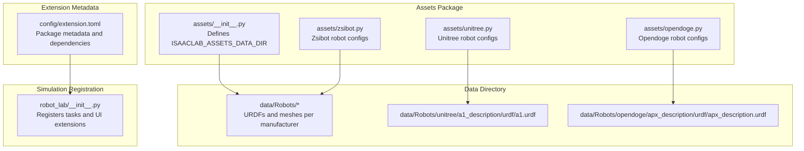
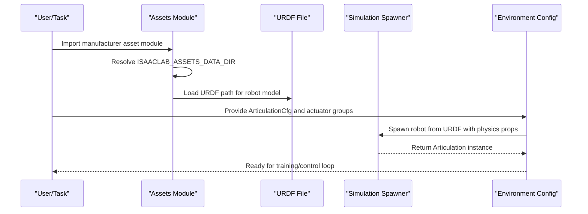
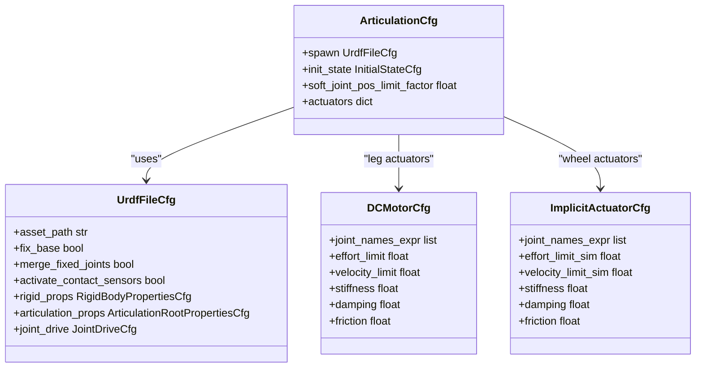
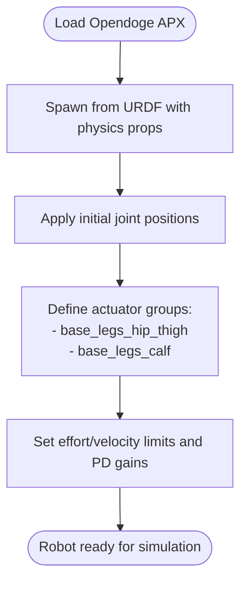
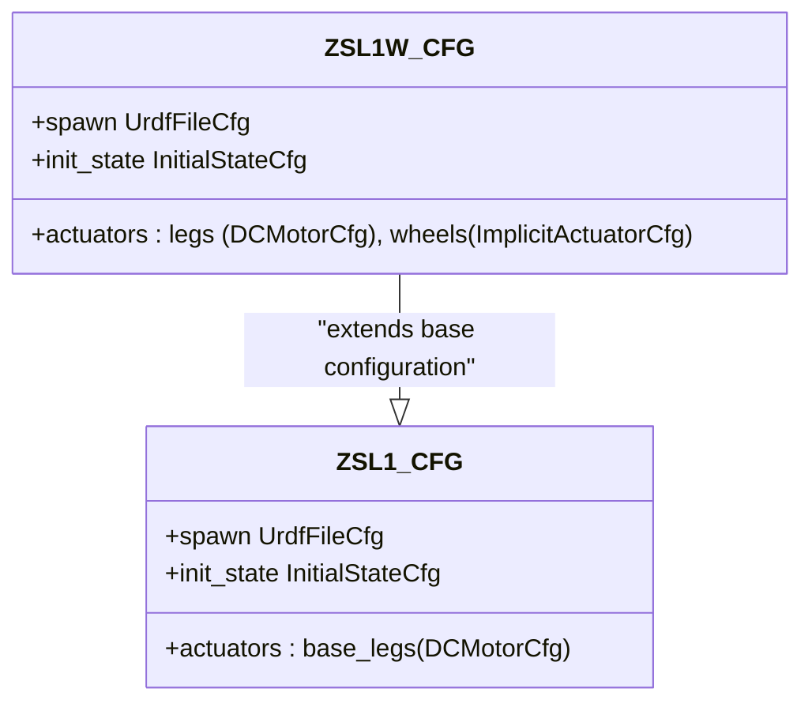
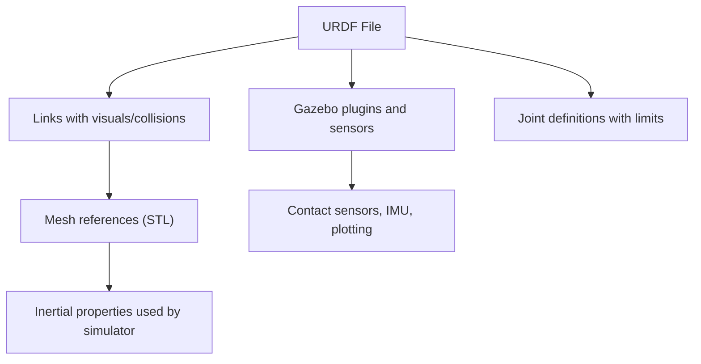
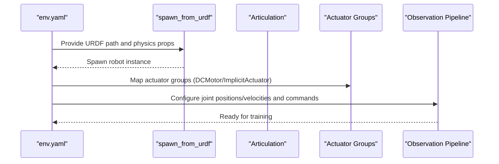
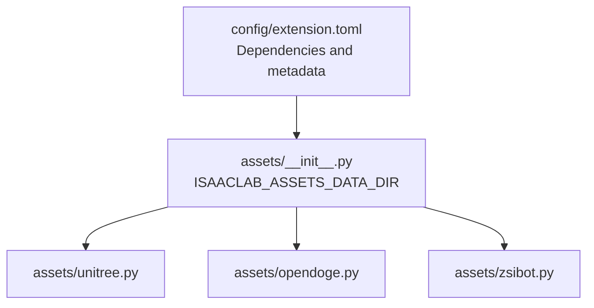

# Asset Management System

<cite>
**Referenced Files in This Document**
- [__init__.py](file://source/robot_lab/robot_lab/assets/__init__.py)
- [unitree.py](file://source/robot_lab/robot_lab/assets/unitree.py)
- [opendoge.py](file://source/robot_lab/robot_lab/assets/opendoge.py)
- [zsibot.py](file://source/robot_lab/robot_lab/assets/zsibot.py)
- [extension.toml](file://source/robot_lab/config/extension.toml)
- [a1.urdf](file://source/robot_lab/data/Robots/unitree/a1_description/urdf/a1.urdf)
- [apx_description.urdf](file://source/robot_lab/data/Robots/opendoge/apx_description/urdf/apx_description.urdf)
- [env.yaml](file://logs/rsl_rl/opendoge_apx_flat/2026-01-20_11-11-30/params/env.yaml)
- [__init__.py](file://source/robot_lab/robot_lab/__init__.py)
</cite>

## Table of Contents
1. [Introduction](#introduction)
2. [Project Structure](#project-structure)
3. [Core Components](#core-components)
4. [Architecture Overview](#architecture-overview)
5. [Detailed Component Analysis](#detailed-component-analysis)
6. [Dependency Analysis](#dependency-analysis)
7. [Performance Considerations](#performance-considerations)
8. [Troubleshooting Guide](#troubleshooting-guide)
9. [Conclusion](#conclusion)
10. [Appendices](#appendices)

## Introduction
This document describes the asset management system for robot models in the project, focusing on how robot assets are defined, loaded, validated, and integrated into simulation environments. It explains the asset loading infrastructure that manages URDF-based robot models, actuator configurations, and physics properties. It also documents manufacturer-specific asset definition patterns (Unitree, Zsibot, Opendoge, and others), the URDF integration process, mesh loading mechanisms, and actuator parameter configurations. Practical examples show how assets are loaded and configured for simulation, and how physical robot models relate to their digital twins. Guidance is included for validating assets, troubleshooting common loading issues, optimizing assets for large-scale training, and adding new robot assets.

## Project Structure
The asset management system is organized around a dedicated assets package that defines robot configurations and a data directory that stores URDFs and related meshes. The extension metadata and registration tie the assets into the broader simulation framework.

**Diagram sources**
- [__init__.py](file://source/robot_lab/robot_lab/assets/__init__.py#L18-L26)
- [unitree.py](file://source/robot_lab/robot_lab/assets/unitree.py#L1-L20)
- [opendoge.py](file://source/robot_lab/robot_lab/assets/opendoge.py#L1-L20)
- [zsibot.py](file://source/robot_lab/robot_lab/assets/zsibot.py#L1-L20)
- [extension.toml](file://source/robot_lab/config/extension.toml#L1-L36)
- [__init__.py](file://source/robot_lab/robot_lab/__init__.py#L8-L12)

**Section sources**
- [__init__.py](file://source/robot_lab/robot_lab/assets/__init__.py#L18-L26)
- [extension.toml](file://source/robot_lab/config/extension.toml#L17-L23)
- [__init__.py](file://source/robot_lab/robot_lab/__init__.py#L8-L12)

## Core Components
- Assets package initialization: Establishes the data directory path and loads extension metadata for versioning and discovery.
- Manufacturer-specific asset modules: Define robot configurations using URDF file descriptors and actuator models.
- URDF and mesh resources: Provide geometry, inertia, and sensor plugins for simulation.
- Simulation environment configuration: Demonstrates runtime asset loading and actuator mapping.

Key responsibilities:
- Centralized asset path resolution
- Robot configuration abstraction via ArticulationCfg
- Actuator grouping and parameterization
- Physics property tuning and solver settings
- Runtime asset spawning and observation/event wiring

**Section sources**
- [__init__.py](file://source/robot_lab/robot_lab/assets/__init__.py#L18-L26)
- [unitree.py](file://source/robot_lab/robot_lab/assets/unitree.py#L19-L65)
- [opendoge.py](file://source/robot_lab/robot_lab/assets/opendoge.py#L14-L83)
- [zsibot.py](file://source/robot_lab/robot_lab/assets/zsibot.py#L14-L58)
- [a1.urdf](file://source/robot_lab/data/Robots/unitree/a1_description/urdf/a1.urdf#L1-L50)
- [apx_description.urdf](file://source/robot_lab/data/Robots/opendoge/apx_description/urdf/apx_description.urdf#L1-L50)
- [env.yaml](file://logs/rsl_rl/opendoge_apx_flat/2026-01-20_11-11-30/params/env.yaml#L88-L210)

## Architecture Overview
The asset management architecture integrates URDF-based robot models with actuator configurations and physics properties. The assets package resolves the data directory and exposes manufacturer-specific configurations. These configurations are consumed by the simulation environment, which spawns articulated assets and applies actuator groups and observation/event pipelines.

**Diagram sources**
- [__init__.py](file://source/robot_lab/robot_lab/assets/__init__.py#L18-L26)
- [unitree.py](file://source/robot_lab/robot_lab/assets/unitree.py#L19-L65)
- [opendoge.py](file://source/robot_lab/robot_lab/assets/opendoge.py#L14-L83)
- [env.yaml](file://logs/rsl_rl/opendoge_apx_flat/2026-01-20_11-11-30/params/env.yaml#L88-L177)

## Detailed Component Analysis

### Unitree Asset Definitions
Unitree assets demonstrate comprehensive actuator modeling for quadrupeds and humanoids. They define:
- URDF file descriptor with merge-fixed-joints and contact sensors
- Initial pose presets and soft joint limits
- Actuator groups for legs, hips, thighs, calves, and implicit wheel actuators
- Physics properties including solver iteration counts and damping

**Diagram sources**
- [unitree.py](file://source/robot_lab/robot_lab/assets/unitree.py#L19-L65)
- [unitree.py](file://source/robot_lab/robot_lab/assets/unitree.py#L179-L243)
- [unitree.py](file://source/robot_lab/robot_lab/assets/unitree.py#L248-L321)

Practical example highlights:
- A1 and Go2 use DCMotorCfg for leg actuators with effort/velocity limits and PD gains.
- Go2W splits actuators into leg and wheel groups, using ImplicitActuatorCfg for wheel compliance.
- B2/B2W define separate actuator groups per kinematic segment (hip/thigh/calf) with manufacturer-provided specs.
- G1 29-DoF demonstrates implicit actuator groups for legs, feet, waist, and arms with tuned stiffness/damping/armature.

**Section sources**
- [unitree.py](file://source/robot_lab/robot_lab/assets/unitree.py#L19-L65)
- [unitree.py](file://source/robot_lab/robot_lab/assets/unitree.py#L71-L117)
- [unitree.py](file://source/robot_lab/robot_lab/assets/unitree.py#L121-L175)
- [unitree.py](file://source/robot_lab/robot_lab/assets/unitree.py#L179-L243)
- [unitree.py](file://source/robot_lab/robot_lab/assets/unitree.py#L248-L321)
- [unitree.py](file://source/robot_lab/robot_lab/assets/unitree.py#L466-L623)

### Opendoge Asset Definitions
Opendoge APX configuration illustrates grouped actuators for hip/thigh and calf joints, enabling flexible actuator modeling per joint subset.

**Diagram sources**
- [opendoge.py](file://source/robot_lab/robot_lab/assets/opendoge.py#L14-L83)

Practical example highlights:
- Grouped actuators allow distinct torque/velocity profiles for hip/thigh vs. calf joints.
- Effort and saturation limits reflect motor capabilities and safety margins.
- Initial pose presets align the robot to a stable stance.

**Section sources**
- [opendoge.py](file://source/robot_lab/robot_lab/assets/opendoge.py#L14-L83)

### Zsibot Asset Definitions
Zsibot ZSL1 and ZSL1W configurations showcase consistent actuator modeling with optional wheel actuators for the W variant.

**Diagram sources**
- [zsibot.py](file://source/robot_lab/robot_lab/assets/zsibot.py#L14-L58)
- [zsibot.py](file://source/robot_lab/robot_lab/assets/zsibot.py#L60-L113)

Practical example highlights:
- ZSL1W adds a wheel actuator group for the foot joint, enabling compliant wheel-like motion.
- Both variants use DCMotorCfg for leg actuators with manufacturer-recommended torque/velocity limits.

**Section sources**
- [zsibot.py](file://source/robot_lab/robot_lab/assets/zsibot.py#L14-L58)
- [zsibot.py](file://source/robot_lab/robot_lab/assets/zsibot.py#L60-L113)

### URDF Integration and Mesh Loading
URDFs define robot geometry, inertial properties, visual/collision meshes, and sensor plugins. Mesh filenames reference STL files located under the meshes directory.

**Diagram sources**
- [a1.urdf](file://source/robot_lab/data/Robots/unitree/a1_description/urdf/a1.urdf#L1-L50)
- [a1.urdf](file://source/robot_lab/data/Robots/unitree/a1_description/urdf/a1.urdf#L100-L165)
- [apx_description.urdf](file://source/robot_lab/data/Robots/opendoge/apx_description/urdf/apx_description.urdf#L1-L50)
- [apx_description.urdf](file://source/robot_lab/data/Robots/opendoge/apx_description/urdf/apx_description.urdf#L13-L27)
- [apx_description.urdf](file://source/robot_lab/data/Robots/opendoge/apx_description/urdf/apx_description.urdf#L55-L123)

Practical example highlights:
- Unitree A1 URDF includes Gazebo plugins for IMU, foot contact sensors, and trajectory plotting.
- Opendoge APX URDF defines base_link and leg links with STL meshes and joint limits.

**Section sources**
- [a1.urdf](file://source/robot_lab/data/Robots/unitree/a1_description/urdf/a1.urdf#L1-L50)
- [a1.urdf](file://source/robot_lab/data/Robots/unitree/a1_description/urdf/a1.urdf#L100-L165)
- [apx_description.urdf](file://source/robot_lab/data/Robots/opendoge/apx_description/urdf/apx_description.urdf#L1-L50)
- [apx_description.urdf](file://source/robot_lab/data/Robots/opendoge/apx_description/urdf/apx_description.urdf#L13-L27)
- [apx_description.urdf](file://source/robot_lab/data/Robots/opendoge/apx_description/urdf/apx_description.urdf#L55-L123)

### Simulation Environment Integration Example
The environment YAML demonstrates runtime asset loading from URDF, actuator mapping, and observation pipeline configuration.

**Diagram sources**
- [env.yaml](file://logs/rsl_rl/opendoge_apx_flat/2026-01-20_11-11-30/params/env.yaml#L88-L177)
- [env.yaml](file://logs/rsl_rl/opendoge_apx_flat/2026-01-20_11-11-30/params/env.yaml#L178-L210)
- [env.yaml](file://logs/rsl_rl/opendoge_apx_flat/2026-01-20_11-11-30/params/env.yaml#L423-L583)

Practical example highlights:
- The environment spawns the robot from the URDF path and applies rigid body and articulation properties.
- Actuator groups are mapped to DCMotor and ImplicitActuator classes with effort/velocity limits and PD gains.
- Observation terms include base velocities, projected gravity, joint positions/velocities, and commands.

**Section sources**
- [env.yaml](file://logs/rsl_rl/opendoge_apx_flat/2026-01-20_11-11-30/params/env.yaml#L88-L177)
- [env.yaml](file://logs/rsl_rl/opendoge_apx_flat/2026-01-20_11-11-30/params/env.yaml#L178-L210)
- [env.yaml](file://logs/rsl_rl/opendoge_apx_flat/2026-01-20_11-11-30/params/env.yaml#L423-L583)

## Dependency Analysis
The assets package depends on the extension metadata and data directory layout. Manufacturer modules depend on the shared asset path resolver and the simulation libraries for spawners and actuators.

**Diagram sources**
- [extension.toml](file://source/robot_lab/config/extension.toml#L17-L23)
- [__init__.py](file://source/robot_lab/robot_lab/assets/__init__.py#L18-L26)
- [unitree.py](file://source/robot_lab/robot_lab/assets/unitree.py#L1-L10)
- [opendoge.py](file://source/robot_lab/robot_lab/assets/opendoge.py#L1-L8)
- [zsibot.py](file://source/robot_lab/robot_lab/assets/zsibot.py#L1-L8)

**Section sources**
- [extension.toml](file://source/robot_lab/config/extension.toml#L17-L23)
- [__init__.py](file://source/robot_lab/robot_lab/assets/__init__.py#L18-L26)

## Performance Considerations
- Solver iterations: Adjust solver_position_iteration_count and solver_velocity_iteration_count to balance accuracy and speed.
- Merge fixed joints: Enabling merge_fixed_joints reduces kinematic tree depth and improves simulation stability.
- Contact sensors: Activate contact sensors selectively to reduce overhead when not needed.
- Actuator grouping: Group actuators by function to simplify control and reduce redundant computations.
- Mesh complexity: Prefer simplified STL meshes for simulation; use higher-detail meshes only for visualization.
- Large-scale training: Use environment decimation and render intervals to reduce compute load.

[No sources needed since this section provides general guidance]

## Troubleshooting Guide
Common asset loading issues and resolutions:
- URDF path errors: Verify asset_path in the URDF file descriptor matches the actual location under the data directory.
- Missing meshes: Ensure STL files referenced in URDF exist in the meshes directory and are readable.
- Joint naming mismatches: Confirm joint names in actuator expressions match URDF joint names.
- Actuator limits: Validate effort/velocity limits against motor specifications; adjust to prevent saturation.
- Contact sensor activation: Enable activate_contact_sensors in the URDF file descriptor when using contact-based observations.
- Solver instability: Increase solver iteration counts or reduce joint drive stiffness/damping.

**Section sources**
- [unitree.py](file://source/robot_lab/robot_lab/assets/unitree.py#L19-L65)
- [opendoge.py](file://source/robot_lab/robot_lab/assets/opendoge.py#L14-L83)
- [apx_description.urdf](file://source/robot_lab/data/Robots/opendoge/apx_description/urdf/apx_description.urdf#L13-L27)

## Conclusion
The asset management system provides a structured approach to defining, loading, and integrating robot assets into simulation environments. By centralizing asset paths, organizing manufacturer-specific configurations, and leveraging URDF-based models with actuator groups, the system supports scalable training and development workflows. Proper validation, troubleshooting, and optimization practices ensure reliable performance across diverse robot models and large-scale scenarios.

[No sources needed since this section summarizes without analyzing specific files]

## Appendices

### Practical Examples Index
- Unitree A1 configuration: [UNITREE_A1_CFG](file://source/robot_lab/robot_lab/assets/unitree.py#L19-L65)
- Unitree Go2 configuration: [UNITREE_GO2_CFG](file://source/robot_lab/robot_lab/assets/unitree.py#L71-L117)
- Unitree Go2W configuration: [UNITREE_GO2W_CFG](file://source/robot_lab/robot_lab/assets/unitree.py#L121-L175)
- Unitree B2 configuration: [UNITREE_B2_CFG](file://source/robot_lab/robot_lab/assets/unitree.py#L179-L243)
- Unitree B2W configuration: [UNITREE_B2W_CFG](file://source/robot_lab/robot_lab/assets/unitree.py#L248-L321)
- Unitree G1 29-DoF configuration: [UNITREE_G1_29DOF_CFG](file://source/robot_lab/robot_lab/assets/unitree.py#L466-L623)
- Opendoge APX configuration: [OPENDOGE_APX_CFG](file://source/robot_lab/robot_lab/assets/opendoge.py#L14-L83)
- Zsibot ZSL1 configuration: [ZSIBOT_ZSL1_CFG](file://source/robot_lab/robot_lab/assets/zsibot.py#L14-L58)
- Zsibot ZSL1W configuration: [ZSIBOT_ZSL1W_CFG](file://source/robot_lab/robot_lab/assets/zsibot.py#L60-L113)
- Unitree A1 URDF: [a1.urdf](file://source/robot_lab/data/Robots/unitree/a1_description/urdf/a1.urdf#L1-L50)
- Opendoge APX URDF: [apx_description.urdf](file://source/robot_lab/data/Robots/opendoge/apx_description/urdf/apx_description.urdf#L1-L50)
- Environment configuration example: [env.yaml](file://logs/rsl_rl/opendoge_apx_flat/2026-01-20_11-11-30/params/env.yaml#L88-L177)

### Guidelines for Adding New Robot Assets
- Prepare URDF:
  - Define links with inertial, visual, and collision elements.
  - Reference STL meshes in the meshes directory.
  - Include joint definitions with appropriate limits.
- Create asset module:
  - Define ArticulationCfg with spawn pointing to the URDF path.
  - Set initial pose and soft joint limits.
  - Define actuator groups with effort/velocity limits and PD gains.
- Integrate with environment:
  - Map actuator groups to DCMotor or ImplicitActuator classes.
  - Configure observations and actions to match joint names.
- Validate and optimize:
  - Test asset loading and spawning.
  - Verify contact sensors and sensor plugins.
  - Optimize solver settings and mesh complexity for performance.

[No sources needed since this section provides general guidance]