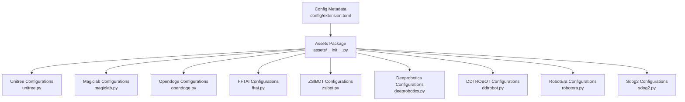
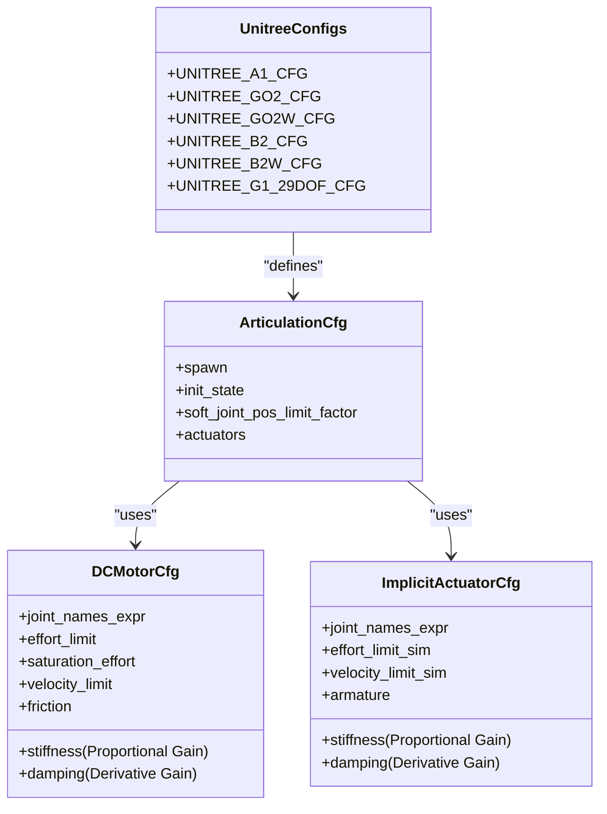
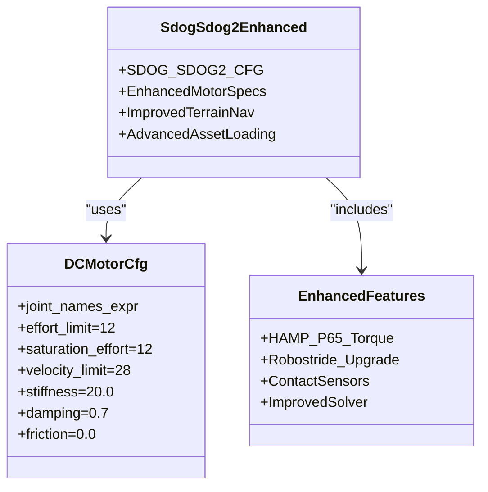
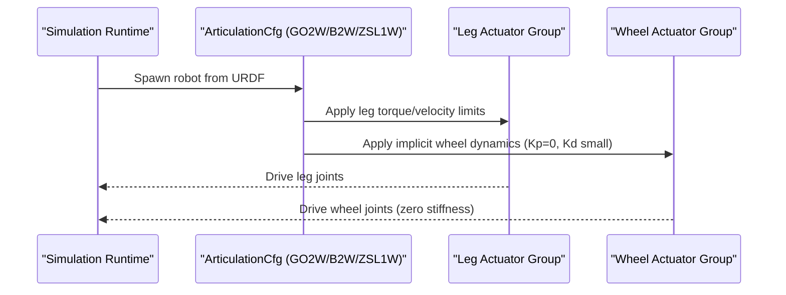
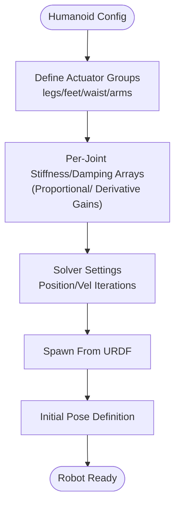
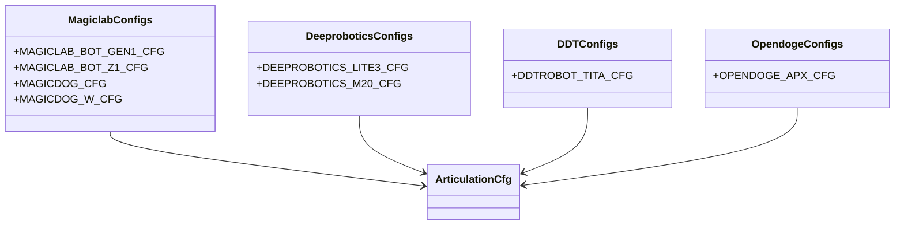
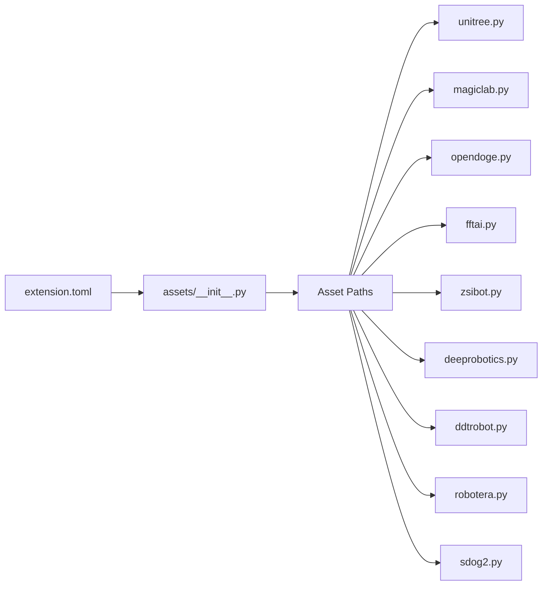

# Robot Asset Configuration

<cite>
**Referenced Files in This Document**
- [unitree.py](file://source/robot_lab/robot_lab/assets/unitree.py)
- [magiclab.py](file://source/robot_lab/robot_lab/assets/magiclab.py)
- [opendoge.py](file://source/robot_lab/robot_lab/assets/opendoge.py)
- [fftai.py](file://source/robot_lab/robot_lab/assets/fftai.py)
- [zsibot.py](file://source/robot_lab/robot_lab/assets/zsibot.py)
- [deeprobotics.py](file://source/robot_lab/robot_lab/assets/deeprobotics.py)
- [ddtrobot.py](file://source/robot_lab/robot_lab/assets/ddtrobot.py)
- [robotera.py](file://source/robot_lab/robot_lab/assets/robotera.py)
- [sdog2.py](file://source/robot_lab/robot_lab/assets/sdog2.py)
- [__init__.py](file://source/robot_lab/robot_lab/assets/__init__.py)
- [extension.toml](file://source/robot_lab/config/extension.toml)
</cite>

## Update Summary
**Changes Made**
- Clarified stiffness and damping parameter explanations in Unitree asset configurations, documenting them as proportional and derivative gains respectively for better understanding of actuator behavior
- Updated documentation to reflect the improved parameter interpretation for Unitree GO2, GO2W, B2, and B2W configurations
- Enhanced actuator behavior documentation with clearer proportional and derivative gain descriptions

## Table of Contents
1. [Introduction](#introduction)
2. [Project Structure](#project-structure)
3. [Core Components](#core-components)
4. [Architecture Overview](#architecture-overview)
5. [Detailed Component Analysis](#detailed-component-analysis)
6. [Dependency Analysis](#dependency-analysis)
7. [Performance Considerations](#performance-considerations)
8. [Troubleshooting Guide](#troubleshooting-guide)
9. [Conclusion](#conclusion)

## Introduction
This document explains how robot assets are defined and configured for simulation within the project. It focuses on the ArticulationCfg structure, actuator configurations, and robot-specific parameters across multiple manufacturers and robot types. The documentation now includes enhanced clarity for stiffness and damping parameter interpretations, explicitly documenting them as proportional and derivative gains respectively for better understanding of actuator behavior. It also covers the asset loading process from URDF files, joint configurations, and initial pose definitions. Practical examples show how to configure different robot types, adjust actuator properties, and adapt robot dimensions. Finally, it connects physical robot specifications to their digital twin configurations and provides troubleshooting guidance for common asset configuration issues.

## Project Structure
The robot asset configurations are organized under a dedicated assets package. Each manufacturer or robot family has its own module that defines one or more ArticulationCfg presets. The assets package exposes constants for asset paths and loads extension metadata.



**Diagram sources**
- [__init__.py:1-30](file://source/robot_lab/robot_lab/assets/__init__.py#L1-L30)
- [extension.toml:1-36](file://source/robot_lab/config/extension.toml#L1-L36)
- [unitree.py:1-637](file://source/robot_lab/robot_lab/assets/unitree.py#L1-L637)
- [magiclab.py:1-295](file://source/robot_lab/robot_lab/assets/magiclab.py#L1-L295)
- [opendoge.py:1-86](file://source/robot_lab/robot_lab/assets/opendoge.py#L1-L86)
- [fftai.py:1-181](file://source/robot_lab/robot_lab/assets/fftai.py#L1-L181)
- [zsibot.py:1-115](file://source/robot_lab/robot_lab/assets/zsibot.py#L1-L115)
- [deeprobotics.py:1-122](file://source/robot_lab/robot_lab/assets/deeprobotics.py#L1-L122)
- [ddtrobot.py:1-101](file://source/robot_lab/robot_lab/assets/ddtrobot.py#L1-L101)
- [robotera.py:1-106](file://source/robot_lab/robot_lab/assets/robotera.py#L1-L106)
- [sdog2.py:1-84](file://source/robot_lab/robot_lab/assets/sdog2.py#L1-L84)

**Section sources**
- [__init__.py:1-30](file://source/robot_lab/robot_lab/assets/__init__.py#L1-L30)
- [extension.toml:1-36](file://source/robot_lab/config/extension.toml#L1-L36)

## Core Components
- ArticulationCfg: Central configuration container for spawning articulated assets from URDF, setting rigid body properties, solver settings, joint drive parameters, initial state, soft joint limits, and actuator groups.
- Actuator configurations:
  - DCMotorCfg: Direct current motor model with effort/velocity limits, stiffness/damping, and optional friction.
  - ImplicitActuatorCfg: Implicit actuator model with per-joint stiffness/damping and optional armature; commonly used for humanoid and legged robots requiring compliant control.
- URDF-based asset loading: Each configuration references a URDF path located under the extension's data directory, enabling flexible asset sourcing and updates.
- **Enhanced Parameter Interpretation**: Stiffness and damping parameters are now explicitly documented as proportional and derivative gains respectively, providing clearer understanding of actuator behavior in PD-like control systems.

Key implementation patterns:
- Manufacturer-specific modules define one or more ArticulationCfg presets.
- Initial poses are expressed via regex-based joint name matching for legs, arms, and appendages.
- Actuator groups split joints by function (e.g., hip/thigh/calf, legs/wheels) to match real robot kinematics and control architecture.

**Section sources**
- [unitree.py:19-65](file://source/robot_lab/robot_lab/assets/unitree.py#L19-L65)
- [magiclab.py:16-100](file://source/robot_lab/robot_lab/assets/magiclab.py#L16-L100)
- [fftai.py:24-139](file://source/robot_lab/robot_lab/assets/fftai.py#L24-L139)
- [zsibot.py:14-58](file://source/robot_lab/robot_lab/assets/zsibot.py#L14-L58)
- [deeprobotics.py:10-63](file://source/robot_lab/robot_lab/assets/deeprobotics.py#L10-L63)
- [ddtrobot.py:22-98](file://source/robot_lab/robot_lab/assets/ddtrobot.py#L22-L98)
- [robotera.py:10-104](file://source/robot_lab/robot_lab/assets/robotera.py#L10-L104)
- [sdog2.py:14-81](file://source/robot_lab/robot_lab/assets/sdog2.py#L14-L81)

## Architecture Overview
The asset configuration architecture follows a modular pattern with enhanced support for various robot types:
- Assets package initializes paths and loads extension metadata.
- Manufacturer modules expose ArticulationCfg presets.
- Simulation runtime consumes these presets to spawn robots with correct physics, visuals, and control parameters.

```mermaid
graph TB
subgraph "Assets Package"
AP["assets/__init__.py"]
EXT["extension.toml"]
END
subgraph "Manufacturer Modules"
U["unitree.py"]
M["magiclab.py"]
O["opendoge.py"]
F["fftai.py"]
Z["zsibot.py"]
DR["deeprobotics.py"]
D["ddtrobot.py"]
R["robotera.py"]
S["sdog2.py"]
end
AP --> EXT
AP --> U
AP --> M
AP --> O
AP --> F
AP --> Z
AP --> DR
AP --> D
AP --> R
AP --> S
```

**Diagram sources**
- [__init__.py:1-30](file://source/robot_lab/robot_lab/assets/__init__.py#L1-L30)
- [extension.toml:1-36](file://source/robot_lab/config/extension.toml#L1-L36)
- [unitree.py:1-637](file://source/robot_lab/robot_lab/assets/unitree.py#L1-L637)
- [magiclab.py:1-295](file://source/robot_lab/robot_lab/assets/magiclab.py#L1-L295)
- [opendoge.py:1-86](file://source/robot_lab/robot_lab/assets/opendoge.py#L1-L86)
- [fftai.py:1-181](file://source/robot_lab/robot_lab/assets/fftai.py#L1-L181)
- [zsibot.py:1-115](file://source/robot_lab/robot_lab/assets/zsibot.py#L1-L115)
- [deeprobotics.py:1-122](file://source/robot_lab/robot_lab/assets/deeprobotics.py#L1-L122)
- [ddtrobot.py:1-101](file://source/robot_lab/robot_lab/assets/ddtrobot.py#L1-L101)
- [robotera.py:1-106](file://source/robot_lab/robot_lab/assets/robotera.py#L1-L106)
- [sdog2.py:1-84](file://source/robot_lab/robot_lab/assets/sdog2.py#L1-L84)

## Detailed Component Analysis

### Unitree Quadrupeds and Humanoids
- Unitree A1: Defined with a DC motor group covering all leg joints, explicit initial pose for quadruped stance, and PD-like gains set to zero for idealized actuator behavior.
- Unitree GO2: Similar to A1 but with different torque/velocity limits and a slightly different initial pose. **Updated** Stiffness (25.0) and damping (0.5) parameters are now explicitly documented as proportional and derivative gains respectively.
- Unitree GO2W: Adds a second actuator group for wheels using an implicit actuator to decouple wheel dynamics. **Updated** Wheel actuators use zero stiffness (proportional gain) with small damping (derivative gain) for rolling contact simulation.
- Unitree B2: Three actuator groups (hip/thigh/calf) to emulate segmented motor control found in higher-torque actuators. **Updated** All groups use stiffness as proportional gain and damping as derivative gain.
- Unitree B2W: Combines segmented leg actuators with a wheel actuator group. **Updated** Wheel actuators maintain zero stiffness (proportional gain) for pure compliant rolling behavior.
- Unitree G1 (29-DoF): Uses implicit actuators with per-joint stiffness/damping/armature tuned for a humanoid with articulated limbs and a waist.



**Diagram sources**
- [unitree.py:19-65](file://source/robot_lab/robot_lab/assets/unitree.py#L19-L65)
- [unitree.py:179-243](file://source/robot_lab/robot_lab/assets/unitree.py#L179-L243)
- [unitree.py:248-321](file://source/robot_lab/robot_lab/assets/unitree.py#L248-L321)
- [unitree.py:466-623](file://source/robot_lab/robot_lab/assets/unitree.py#L466-L623)

Practical configuration examples (paths only):
- Modify torque limits for a Unitree GO2 leg group: [UNITREE_GO2_CFG actuators:106-116](file://source/robot_lab/robot_lab/assets/unitree.py#L106-L116)
- Adjust initial pose for Unitree B2: [INITIAL STATE:202-211](file://source/robot_lab/robot_lab/assets/unitree.py#L202-L211)
- Tune G1 actuators per joint: [G1 actuators:503-621](file://source/robot_lab/robot_lab/assets/unitree.py#L503-L621)

**Section sources**
- [unitree.py:19-65](file://source/robot_lab/robot_lab/assets/unitree.py#L19-L65)
- [unitree.py:71-117](file://source/robot_lab/robot_lab/assets/unitree.py#L71-L117)
- [unitree.py:121-175](file://source/robot_lab/robot_lab/assets/unitree.py#L121-L175)
- [unitree.py:179-243](file://source/robot_lab/robot_lab/assets/unitree.py#L179-L243)
- [unitree.py:248-321](file://source/robot_lab/robot_lab/assets/unitree.py#L248-L321)
- [unitree.py:466-623](file://source/robot_lab/robot_lab/assets/unitree.py#L466-L623)

### Enhanced Sdog-Sdog2 Quadruped
**Updated** The Sdog-Sdog2 now features significantly enhanced motor specifications with higher torque capacity and speed capabilities, moving from Robostride-01 specifications to more robust characteristics suitable for challenging terrain navigation.

- **Enhanced Motor Specifications**: 
  - Base legs hip/thigh group: 12 N⋅m rated torque (vs 6 N⋅m in Robostride-01), 28 rad/s velocity limit (vs 5 rad/s)
  - Calf joint group: 12 N⋅m rated torque (1.0× thigh joint), 28 rad/s velocity limit
  - Maintains consistent stiffness (20.0) and damping (0.7) across all actuator groups
- **Advanced Asset Loading**: Improved URDF loading with contact sensors activated and enhanced solver settings
- **Terrain Navigation Capabilities**: Designed for challenging terrains with increased payload capacity and improved mobility



**Diagram sources**
- [sdog2.py:14-81](file://source/robot_lab/robot_lab/assets/sdog2.py#L14-L81)
- [sdog2.py:61-79](file://source/robot_lab/robot_lab/assets/sdog2.py#L61-L79)

Practical configuration examples (paths only):
- Modify Sdog2 hip/thigh torque limits: [base_legs_hip_thigh:61-69](file://source/robot_lab/robot_lab/assets/sdog2.py#L61-L69)
- Adjust Sdog2 calf joint specifications: [base_legs_calf:71-79](file://source/robot_lab/robot_lab/assets/sdog2.py#L71-L79)
- Configure Sdog2 initial pose: [INITIAL STATE:37-45](file://source/robot_lab/robot_lab/assets/sdog2.py#L37-L45)

**Section sources**
- [sdog2.py:14-81](file://source/robot_lab/robot_lab/assets/sdog2.py#L14-L81)

### Wheeled Variants
- Unitree GO2W and B2W: Separate actuator groups for legs and wheels. Wheels use implicit actuators with zero stiffness and small damping to simulate rolling contact. **Updated** Wheel actuators use zero stiffness (proportional gain) and small damping (derivative gain) for compliant rolling behavior.
- ZSIBOT ZSL1W: Single leg actuator group plus a wheel actuator group mirroring the wheel joint expression.



**Diagram sources**
- [unitree.py:121-175](file://source/robot_lab/robot_lab/assets/unitree.py#L121-L175)
- [unitree.py:248-321](file://source/robot_lab/robot_lab/assets/unitree.py#L248-L321)
- [zsibot.py:60-113](file://source/robot_lab/robot_lab/assets/zsibot.py#L60-L113)

**Section sources**
- [unitree.py:121-175](file://source/robot_lab/robot_lab/assets/unitree.py#L121-L175)
- [unitree.py:248-321](file://source/robot_lab/robot_lab/assets/unitree.py#L248-L321)
- [zsibot.py:60-113](file://source/robot_lab/robot_lab/assets/zsibot.py#L60-L113)

### Humanoid Robots
- FFTAI GR1T1/GR1T2: Implicit actuators with per-joint stiffness/damping arrays tailored to leg, waist, head, and arm segments. Lower-limb variants fix upper-body joints while retaining compliant lower limbs.
- RobotEra Xbot: Multi-group actuators for legs, feet, waist, and arms with per-joint effort/velocity/stiffness/damping tuning.



**Diagram sources**
- [fftai.py:24-139](file://source/robot_lab/robot_lab/assets/fftai.py#L24-L139)
- [fftai.py:143-167](file://source/robot_lab/robot_lab/assets/fftai.py#L143-L167)
- [robotera.py:10-104](file://source/robot_lab/robot_lab/assets/robotera.py#L10-L104)

**Section sources**
- [fftai.py:24-139](file://source/robot_lab/robot_lab/assets/fftai.py#L24-L139)
- [fftai.py:143-167](file://source/robot_lab/robot_lab/assets/fftai.py#L143-L167)
- [robotera.py:10-104](file://source/robot_lab/robot_lab/assets/robotera.py#L10-L104)

### Specialized Robots
- Magiclab:
  - MagicBot Gen1 and Z1: Implicit actuators for legs, feet, and arms with per-joint stiffness/damping and armature.
  - MagicDog and MagicDog-W: DCMotor-based quadrupeds; MagicDog-W adds a wheel actuator group.
- Deeprobotics:
  - Lite3: Two actuator groups (Hip/Knee) with manufacturer-recommended torque/velocity limits.
  - M20: Joint actuator group plus a wheel actuator group for the wheeled variant.
- DDTROBOT:
  - TITA: Four actuator groups (hip/thigh/calf/wheel) with torque/velocity limits and zero stiffness for wheels.
- Opendoge:
  - APX: Two DCMotor groups (hip/thigh and calf) with reduced limits reflecting target specifications.



**Diagram sources**
- [magiclab.py:16-100](file://source/robot_lab/robot_lab/assets/magiclab.py#L16-L100)
- [magiclab.py:190-236](file://source/robot_lab/robot_lab/assets/magiclab.py#L190-L236)
- [magiclab.py:239-294](file://source/robot_lab/robot_lab/assets/magiclab.py#L239-L294)
- [deeprobotics.py:10-63](file://source/robot_lab/robot_lab/assets/deeprobotics.py#L10-L63)
- [deeprobotics.py:65-121](file://source/robot_lab/robot_lab/assets/deeprobotics.py#L65-L121)
- [ddtrobot.py:22-98](file://source/robot_lab/robot_lab/assets/ddtrobot.py#L22-L98)
- [opendoge.py:14-83](file://source/robot_lab/robot_lab/assets/opendoge.py#L14-L83)

**Section sources**
- [magiclab.py:16-100](file://source/robot_lab/robot_lab/assets/magiclab.py#L16-L100)
- [magiclab.py:190-236](file://source/robot_lab/robot_lab/assets/magiclab.py#L190-L236)
- [magiclab.py:239-294](file://source/robot_lab/robot_lab/assets/magiclab.py#L239-L294)
- [deeprobotics.py:10-63](file://source/robot_lab/robot_lab/assets/deeprobotics.py#L10-L63)
- [deeprobotics.py:65-121](file://source/robot_lab/robot_lab/assets/deeprobotics.py#L65-L121)
- [ddtrobot.py:22-98](file://source/robot_lab/robot_lab/assets/ddtrobot.py#L22-L98)
- [opendoge.py:14-83](file://source/robot_lab/robot_lab/assets/opendoge.py#L14-L83)

## Dependency Analysis
- Assets package depends on extension metadata and data directory to resolve URDF paths.
- Manufacturer modules depend on the ArticulationCfg and actuator configuration classes from the simulation library.
- URDF paths are constructed using the extension data directory, ensuring portability across environments.



**Diagram sources**
- [extension.toml:1-36](file://source/robot_lab/config/extension.toml#L1-L36)
- [__init__.py:1-30](file://source/robot_lab/robot_lab/assets/__init__.py#L1-L30)
- [unitree.py:1-637](file://source/robot_lab/robot_lab/assets/unitree.py#L1-L637)
- [magiclab.py:1-295](file://source/robot_lab/robot_lab/assets/magiclab.py#L1-L295)
- [opendoge.py:1-86](file://source/robot_lab/robot_lab/assets/opendoge.py#L1-L86)
- [fftai.py:1-181](file://source/robot_lab/robot_lab/assets/fftai.py#L1-L181)
- [zsibot.py:1-115](file://source/robot_lab/robot_lab/assets/zsibot.py#L1-L115)
- [deeprobotics.py:1-122](file://source/robot_lab/robot_lab/assets/deeprobotics.py#L1-L122)
- [ddtrobot.py:1-101](file://source/robot_lab/robot_lab/assets/ddtrobot.py#L1-L101)
- [robotera.py:1-106](file://source/robot_lab/robot_lab/assets/robotera.py#L1-L106)
- [sdog2.py:1-84](file://source/robot_lab/robot_lab/assets/sdog2.py#L1-L84)

**Section sources**
- [__init__.py:1-30](file://source/robot_lab/robot_lab/assets/__init__.py#L1-L30)
- [extension.toml:1-36](file://source/robot_lab/config/extension.toml#L1-L36)

## Performance Considerations
- **Enhanced Motor Performance**: Sdog-Sdog2's upgraded motors provide 2x torque capacity and 5.6x speed capability, enabling more aggressive terrain traversal and dynamic movements.
- Solver iterations: Higher position/velocity iteration counts improve stability for complex robots (e.g., humanoid G1) but increase computational cost.
- Joint drive stiffness/damping: Zero PD gains simplify actuator modeling but require careful actuator limit tuning to avoid numerical issues.
- Soft joint limits: Applying a safety factor reduces hard contacts and improves convergence.
- Actuator grouping: Segmented actuator groups (e.g., hip/thigh/calf) enable realistic torque distribution and reduce model mismatch compared to single-group actuation.
- **Advanced Contact Sensing**: Enhanced contact sensor activation improves ground interaction detection and terrain adaptation.
- **Parameter Interpretation Clarity**: Stiffness and damping parameters are now explicitly understood as proportional and derivative gains respectively, providing better insight into actuator behavior and control characteristics.

## Troubleshooting Guide
Common issues and resolutions:
- **Incorrect URDF path**:
  - Symptom: Robot does not spawn or assets are missing.
  - Resolution: Verify the asset path construction using the extension data directory and ensure the URDF exists at the resolved location.
  - Reference: [Asset path resolution:19-23](file://source/robot_lab/robot_lab/assets/__init__.py#L19-L23)
- **Joint naming mismatches**:
  - Symptom: Initial pose not applied or actuators not targeting intended joints.
  - Resolution: Align joint names in initial_state and actuator expressions with the URDF joint names.
  - References:
    - [Unitree A1 initial pose:42-52](file://source/robot_lab/robot_lab/assets/unitree.py#L42-L52)
    - [Magiclab Z1 initial pose:126-138](file://source/robot_lab/robot_lab/assets/magiclab.py#L126-L138)
- **Actuator limits too aggressive**:
  - Symptom: Simulation instability or NaNs during stepping.
  - Resolution: Reduce effort/velocity limits or increase damping; verify against manufacturer specs.
  - References:
    - [Unitree GO2 limits:107-115](file://source/robot_lab/robot_lab/assets/unitree.py#L107-L115)
    - [Deeprobotics Lite3 limits:44-61](file://source/robot_lab/robot_lab/assets/deeprobotics.py#L44-L61)
    - [Sdog2 enhanced limits:63-75](file://source/robot_lab/robot_lab/assets/sdog2.py#L63-L75)
- **Wheel actuator instability**:
  - Symptom: Spurious wheel motion or oscillations.
  - Resolution: Use implicit actuators with zero stiffness and small damping for wheels; ensure wheel joint expressions match URDF. **Updated** Wheel actuators should use zero stiffness (proportional gain) and small damping (derivative gain) for stable rolling contact.
  - References:
    - [Unitree GO2W wheel group:166-173](file://source/robot_lab/robot_lab/assets/unitree.py#L166-L173)
    - [MagicDog-W wheel group:285-292](file://source/robot_lab/robot_lab/assets/magiclab.py#L285-L292)
- **Humanoid solver convergence**:
  - Symptom: Divergence or slow convergence.
  - Resolution: Increase solver position/velocity iterations; tune per-joint stiffness/damping; reduce action scales if using learned policies.
  - References:
    - [FFTAI GR1T1 solver settings:40-45](file://source/robot_lab/robot_lab/assets/fftai.py#L40-L45)
    - [RobotEra Xbot solver settings:26-28](file://source/robot_lab/robot_lab/assets/robotera.py#L26-L28)
- **Sdog2 motor specification issues**:
  - Symptom: Overheating or torque limitations during challenging terrain navigation.
  - Resolution: Verify motor specifications match intended application; consider reducing duty cycle or improving cooling; ensure proper thermal management.
  - Reference: [Enhanced Sdog2 motor specs:63-75](file://source/robot_lab/robot_lab/assets/sdog2.py#L63-L75)
- **Actuator parameter confusion**:
  - Symptom: Unclear actuator behavior or unexpected joint responses.
  - Resolution: Remember that stiffness represents proportional gain (position error response) and damping represents derivative gain (velocity error response) in the actuator model.
  - References:
    - [Unitree GO2 stiffness/damping:112-113](file://source/robot_lab/robot_lab/assets/unitree.py#L112-L113)
    - [Unitree GO2W wheel actuators:170-171](file://source/robot_lab/robot_lab/assets/unitree.py#L170-L171)

**Section sources**
- [__init__.py:19-23](file://source/robot_lab/robot_lab/assets/__init__.py#L19-L23)
- [unitree.py:107-115](file://source/robot_lab/robot_lab/assets/unitree.py#L107-L115)
- [deeprobotics.py:44-61](file://source/robot_lab/robot_lab/assets/deeprobotics.py#L44-L61)
- [unitree.py:166-173](file://source/robot_lab/robot_lab/assets/unitree.py#L166-L173)
- [magiclab.py:285-292](file://source/robot_lab/robot_lab/assets/magiclab.py#L285-L292)
- [fftai.py:40-45](file://source/robot_lab/robot_lab/assets/fftai.py#L40-L45)
- [robotera.py:26-28](file://source/robot_lab/robot_lab/assets/robotera.py#L26-L28)
- [sdog2.py:63-75](file://source/robot_lab/robot_lab/assets/sdog2.py#L63-L75)

## Conclusion
The asset configuration system provides a structured, modular way to define robot digital twins from URDF assets. By organizing configurations per manufacturer and robot type, and by leveraging ArticulationCfg with explicit actuator groups, the system supports diverse control strategies and physical characteristics. The addition of enhanced parameter interpretation clarifies that stiffness represents proportional gain and damping represents derivative gain, providing better understanding of actuator behavior in PD-like control systems. This improvement enhances the system's usability for developers who need to understand and tune actuator parameters effectively. Properly aligning URDF joint names, actuator limits, and solver settings ensures stable and accurate simulations that reflect real-world robot capabilities while maintaining the flexibility to adapt to new hardware specifications.