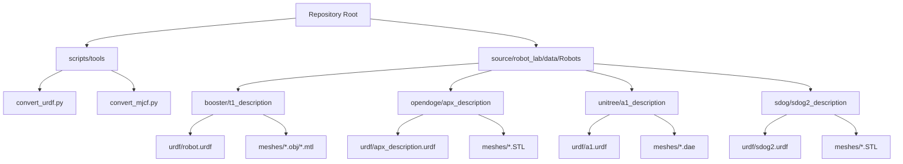
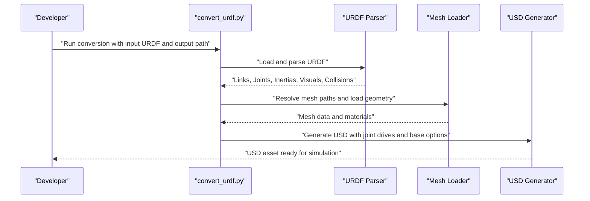
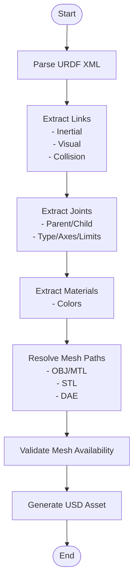
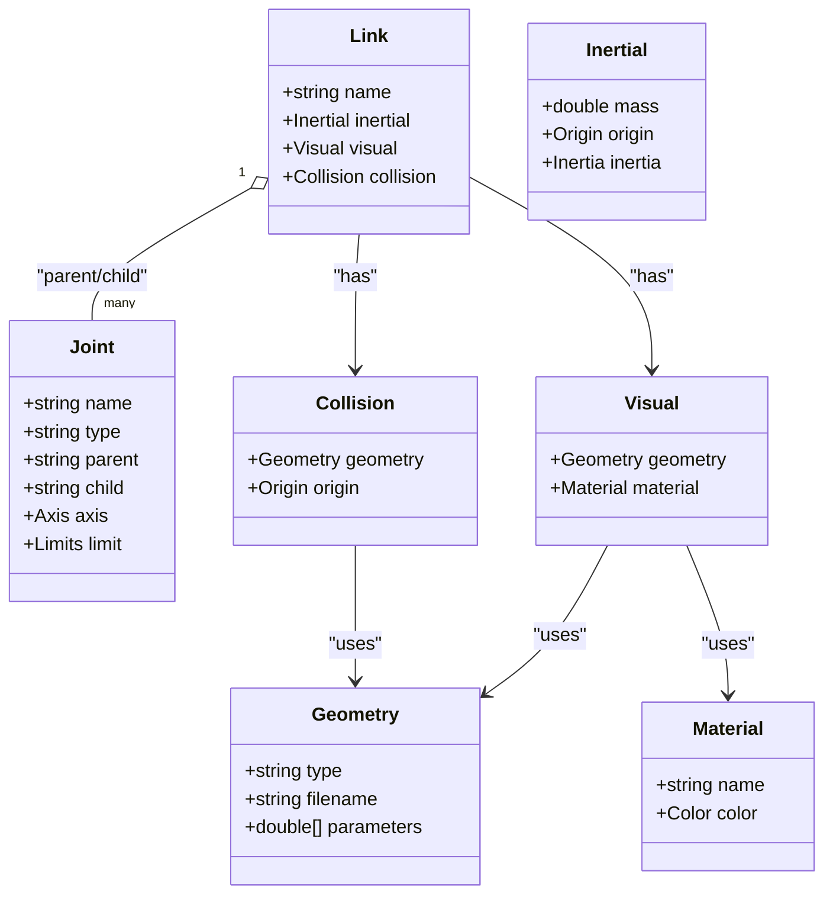
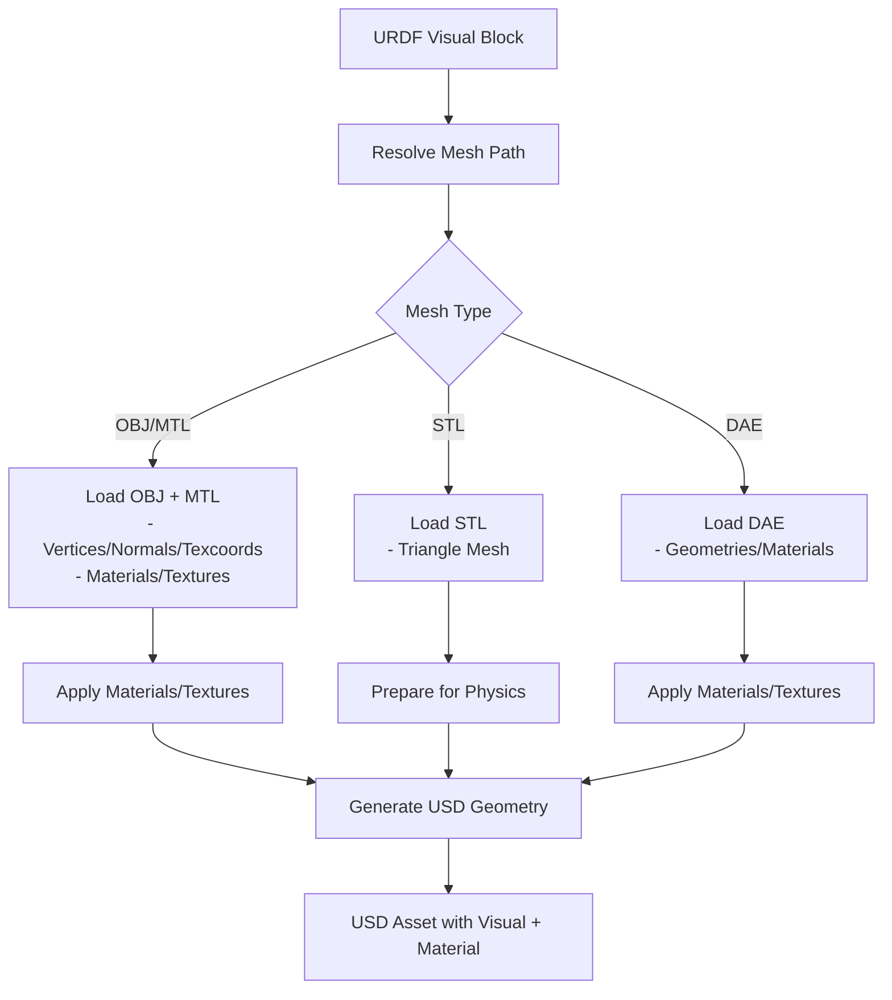
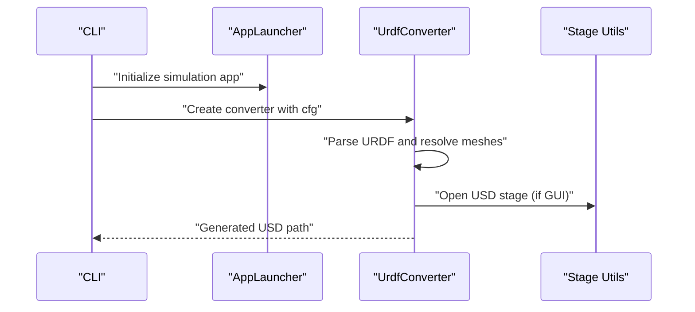
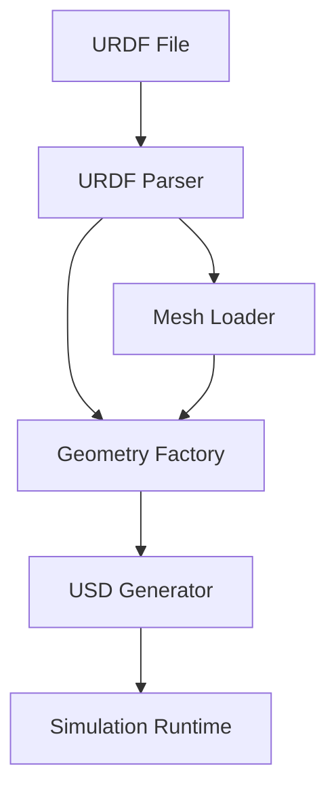

# URDF Model Integration

<cite>
**Referenced Files in This Document**
- [README.md](file://README.md)
- [convert_urdf.py](file://scripts/tools/convert_urdf.py)
- [convert_mjcf.py](file://scripts/tools/convert_mjcf.py)
- [robot.urdf (booster/t1)](file://source/robot_lab/data/Robots/booster/t1_description/urdf/robot.urdf)
- [apx_description.urdf (opendoge/apx)](file://source/robot_lab/data/Robots/opendoge/apx_description/urdf/apx_description.urdf)
- [a1.urdf (unitree/a1)](file://source/robot_lab/data/Robots/unitree/a1_description/urdf/a1.urdf)
- [sdog2.urdf (sdog/sdog2)](file://source/robot_lab/data/Robots/sdog/sdog2_description/urdf/sdog2.urdf)
</cite>

## Table of Contents
1. [Introduction](#introduction)
2. [Project Structure](#project-structure)
3. [Core Components](#core-components)
4. [Architecture Overview](#architecture-overview)
5. [Detailed Component Analysis](#detailed-component-analysis)
6. [Dependency Analysis](#dependency-analysis)
7. [Performance Considerations](#performance-considerations)
8. [Troubleshooting Guide](#troubleshooting-guide)
9. [Conclusion](#conclusion)
10. [Appendices](#appendices)

## Introduction
This document explains how URDF models are integrated into the robotics simulation environment, focusing on the Universal Robot Description Format (URDF) processing pipeline and mesh loading mechanisms. It covers how URDF files are parsed, converted into simulation-ready USD assets, how joint hierarchies and link properties are extracted, and how meshes and materials are loaded and applied. Practical guidance is provided for preparing URDFs, optimizing meshes for simulation, validating URDFs, and resolving common issues encountered during import and runtime.

## Project Structure
The repository organizes robot assets and conversion utilities as follows:
- URDF assets and meshes are stored under source/robot_lab/data/Robots/<robot>/urdf and source/robot_lab/data/Robots/<robot>/meshes.
- Conversion utilities are provided under scripts/tools for converting URDF and MJCF into USD assets compatible with the simulation environment.

**Diagram sources**
- [README.md](file://README.md#L364-L400)
- [convert_urdf.py](file://scripts/tools/convert_urdf.py#L1-L167)
- [convert_mjcf.py](file://scripts/tools/convert_mjcf.py#L1-L143)
- [robot.urdf (booster/t1)](file://source/robot_lab/data/Robots/booster/t1_description/urdf/robot.urdf#L1-L670)
- [apx_description.urdf (opendoge/apx)](file://source/robot_lab/data/Robots/opendoge/apx_description/urdf/apx_description.urdf#L1-L519)
- [a1.urdf (unitree/a1)](file://source/robot_lab/data/Robots/unitree/a1_description/urdf/a1.urdf#L1-L974)
- [sdog2.urdf (sdog/sdog2)](file://source/robot_lab/data/Robots/sdog/sdog2_description/urdf/sdog2.urdf#L1-L990)

**Section sources**
- [README.md](file://README.md#L364-L400)

## Core Components
- URDF conversion utility: Converts URDF files into USD assets using the URDF importer extension. It supports options such as merging fixed joints, fixing the base, and configuring joint drive PD gains and target type.
- Mesh resources: Robots ship with meshes in OBJ/MTL, STL, and DAE formats. Materials and visual/collision geometries are defined in URDF and referenced by mesh filenames.
- Simulation-ready assets: The conversion process produces USD assets suitable for simulation, including joint drives and optional base fixation.

Key capabilities:
- Parse URDF and extract joint hierarchy and link properties.
- Load meshes and materials referenced by URDF.
- Generate USD assets with optional joint drive configuration and base fixation.
- Validate file paths and print configuration diagnostics.

**Section sources**
- [convert_urdf.py](file://scripts/tools/convert_urdf.py#L1-L167)

## Architecture Overview
The URDF integration pipeline transforms URDF assets into simulation-ready USD assets. The process involves:
- Parsing URDF to extract links, joints, inertial properties, visuals, collisions, and materials.
- Resolving mesh paths and loading geometry.
- Configuring joint drives and base fixation.
- Generating USD assets for simulation.

**Diagram sources**
- [convert_urdf.py](file://scripts/tools/convert_urdf.py#L95-L140)

## Detailed Component Analysis

### URDF Parsing Workflow
The URDF parsing workflow extracts:
- Links: Inertial properties, visual geometry, and collision geometry.
- Joints: Parent-child relationships, joint types, axes, and limits.
- Materials: Color and material definitions used by visual blocks.
- Optional extensions: Gazebo plugins and transmissions (where present).

Example URDFs demonstrate:
- Booster T1: Extensive link and joint definitions with visual and collision blocks referencing OBJ meshes and MTL materials.
- Opendoge APX: Revolute joints with explicit limits and collision geometries using STL meshes.
- Unitree A1: Complex leg structure with DAE meshes, Gazebo plugins, and transmission definitions.
- Sdog Sdog2: Quadruped leg structure with STL meshes and fixed-foot joints.

**Diagram sources**
- [robot.urdf (booster/t1)](file://source/robot_lab/data/Robots/booster/t1_description/urdf/robot.urdf#L1-L670)
- [apx_description.urdf (opendoge/apx)](file://source/robot_lab/data/Robots/opendoge/apx_description/urdf/apx_description.urdf#L1-L519)
- [a1.urdf (unitree/a1)](file://source/robot_lab/data/Robots/unitree/a1_description/urdf/a1.urdf#L1-L974)
- [sdog2.urdf (sdog/sdog2)](file://source/robot_lab/data/Robots/sdog/sdog2_description/urdf/sdog2.urdf#L1-L990)

**Section sources**
- [robot.urdf (booster/t1)](file://source/robot_lab/data/Robots/booster/t1_description/urdf/robot.urdf#L1-L670)
- [apx_description.urdf (opendoge/apx)](file://source/robot_lab/data/Robots/opendoge/apx_description/urdf/apx_description.urdf#L1-L519)
- [a1.urdf (unitree/a1)](file://source/robot_lab/data/Robots/unitree/a1_description/urdf/a1.urdf#L1-L974)
- [sdog2.urdf (sdog/sdog2)](file://source/robot_lab/data/Robots/sdog/sdog2_description/urdf/sdog2.urdf#L1-L990)

### Joint Hierarchy Extraction and Link Property Assignment
Joint hierarchy extraction identifies parent-child relationships and joint characteristics:
- Joint types: Revolute, fixed, and others.
- Axes and kinematic limits.
- Inertial properties per link (mass, COM, inertia tensor).
- Visual and collision geometry per link.

Examples:
- Booster T1: Multiple revolute joints connecting trunk to limbs, with box, sphere, and cylinder collision shapes.
- Opendoge APX: Leg joints with explicit joint limits and collision meshes.
- Unitree A1: Four-legged structure with hip/thigh/calf/foot segments and fixed-foot joints.
- Sdog Sdog2: Similar quadruped structure with STL meshes and fixed-foot joints.

**Diagram sources**
- [robot.urdf (booster/t1)](file://source/robot_lab/data/Robots/booster/t1_description/urdf/robot.urdf#L1-L670)
- [apx_description.urdf (opendoge/apx)](file://source/robot_lab/data/Robots/opendoge/apx_description/urdf/apx_description.urdf#L1-L519)
- [a1.urdf (unitree/a1)](file://source/robot_lab/data/Robots/unitree/a1_description/urdf/a1.urdf#L1-L974)
- [sdog2.urdf (sdog/sdog2)](file://source/robot_lab/data/Robots/sdog/sdog2_description/urdf/sdog2.urdf#L1-L990)

**Section sources**
- [robot.urdf (booster/t1)](file://source/robot_lab/data/Robots/booster/t1_description/urdf/robot.urdf#L1-L670)
- [apx_description.urdf (opendoge/apx)](file://source/robot_lab/data/Robots/opendoge/apx_description/urdf/apx_description.urdf#L1-L519)
- [a1.urdf (unitree/a1)](file://source/robot_lab/data/Robots/unitree/a1_description/urdf/a1.urdf#L1-L974)
- [sdog2.urdf (sdog/sdog2)](file://source/robot_lab/data/Robots/sdog/sdog2_description/urdf/sdog2.urdf#L1-L990)

### Mesh Loading Process, Texture Application, and Collision Geometry Generation
Mesh loading and texture application:
- Mesh references: URDF visual blocks reference OBJ/MTL, STL, or DAE files.
- Material application: Visual blocks may include material definitions; OBJ/MTL pairs carry texture and material properties.
- Collision geometry: Separate collision blocks define simplified shapes for physics simulation.

Optimization tips:
- Prefer triangle meshes over complex CAD features for collision shapes.
- Use consistent units and scales across meshes.
- Minimize redundant vertices and degenerate faces.
- Ensure normals face outward for accurate lighting and contact detection.

**Diagram sources**
- [robot.urdf (booster/t1)](file://source/robot_lab/data/Robots/booster/t1_description/urdf/robot.urdf#L16-L26)
- [apx_description.urdf (opendoge/apx)](file://source/robot_lab/data/Robots/opendoge/apx_description/urdf/apx_description.urdf#L13-L27)
- [a1.urdf (unitree/a1)](file://source/robot_lab/data/Robots/unitree/a1_description/urdf/a1.urdf#L318-L336)
- [sdog2.urdf (sdog/sdog2)](file://source/robot_lab/data/Robots/sdog/sdog2_description/urdf/sdog2.urdf#L23-L45)

**Section sources**
- [robot.urdf (booster/t1)](file://source/robot_lab/data/Robots/booster/t1_description/urdf/robot.urdf#L16-L26)
- [apx_description.urdf (opendoge/apx)](file://source/robot_lab/data/Robots/opendoge/apx_description/urdf/apx_description.urdf#L13-L27)
- [a1.urdf (unitree/a1)](file://source/robot_lab/data/Robots/unitree/a1_description/urdf/a1.urdf#L318-L336)
- [sdog2.urdf (sdog/sdog2)](file://source/robot_lab/data/Robots/sdog/sdog2_description/urdf/sdog2.urdf#L23-L45)

### URDF Conversion Utility
The conversion utility provides:
- Command-line interface for URDF to USD conversion.
- Options for merging fixed joints, fixing the base, and configuring joint drive PD gains and target type.
- Validation of input file paths and printing of configuration diagnostics.
- Optional GUI integration to preview the generated USD asset.

**Diagram sources**
- [convert_urdf.py](file://scripts/tools/convert_urdf.py#L75-L166)

**Section sources**
- [convert_urdf.py](file://scripts/tools/convert_urdf.py#L1-L167)

## Dependency Analysis
The URDF integration depends on:
- URDF importer extension for parsing and generating USD assets.
- Mesh loaders for OBJ/MTL, STL, and DAE formats.
- Material systems for applying textures and colors.
- Simulation runtime for physics and rendering.

**Diagram sources**
- [convert_urdf.py](file://scripts/tools/convert_urdf.py#L90-L140)

**Section sources**
- [convert_urdf.py](file://scripts/tools/convert_urdf.py#L90-L140)

## Performance Considerations
- Simplify collision meshes: Use convex hulls or primitive approximations to reduce computational cost.
- Optimize visual meshes: Reduce polygon count while preserving shape fidelity.
- Batch conversions: Convert multiple URDFs in batch to leverage caching and minimize repeated parsing.
- Merge fixed joints: Reduces kinematic tree depth and improves simulation stability.
- Fix base: Prevents unnecessary floating base dynamics when appropriate.

## Troubleshooting Guide
Common issues and resolutions:
- Invalid file paths: Ensure URDF and mesh paths are absolute or relative to the working directory.
- Missing meshes: Verify mesh filenames match those referenced in URDF and are accessible.
- Incorrect units or scaling: Standardize units (meters) and scales across meshes.
- Joint limits and axes: Validate joint axes and limits to prevent kinematic singularities.
- Material errors: Confirm material definitions and texture availability for OBJ/MTL pairs.
- GUI preview: If USD does not open in GUI, re-run with GUI enabled or inspect printed USD path.

Validation and debugging steps:
- Print converter configuration and verify parameters.
- Inspect generated USD stage for geometry and materials.
- Compare joint hierarchy against URDF to ensure correct parent-child relationships.

**Section sources**
- [convert_urdf.py](file://scripts/tools/convert_urdf.py#L95-L140)

## Conclusion
URDF model integration in this repository centers on robust parsing, mesh loading, and USD generation tailored for simulation. By leveraging the provided conversion utility and following best practices for mesh optimization and URDF preparation, developers can reliably produce simulation-ready assets with accurate joint hierarchies, materials, and collision geometries.

## Appendices

### Practical Examples
- Preparing a URDF for conversion:
  - Ensure all mesh paths are correct and accessible.
  - Define inertial properties for each link.
  - Use appropriate joint types and limits.
- Mesh optimization for simulation:
  - Use STL or DAE for legged robots; ensure manifold meshes.
  - For humanoid robots, prefer DAE with embedded materials.
- Example URDFs to study:
  - Booster T1: Humanoid-like structure with OBJ/MTL meshes.
  - Opendoge APX: Quadruped with STL meshes and explicit joint limits.
  - Unitree A1: Four-legged robot with DAE meshes and Gazebo plugins.
  - Sdog Sdog2: Quadruped with STL meshes and fixed-foot joints.

**Section sources**
- [robot.urdf (booster/t1)](file://source/robot_lab/data/Robots/booster/t1_description/urdf/robot.urdf#L1-L670)
- [apx_description.urdf (opendoge/apx)](file://source/robot_lab/data/Robots/opendoge/apx_description/urdf/apx_description.urdf#L1-L519)
- [a1.urdf (unitree/a1)](file://source/robot_lab/data/Robots/unitree/a1_description/urdf/a1.urdf#L1-L974)
- [sdog2.urdf (sdog/sdog2)](file://source/robot_lab/data/Robots/sdog/sdog2_description/urdf/sdog2.urdf#L1-L990)