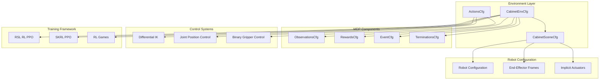
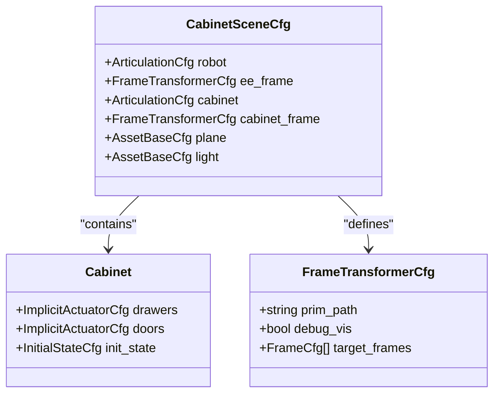
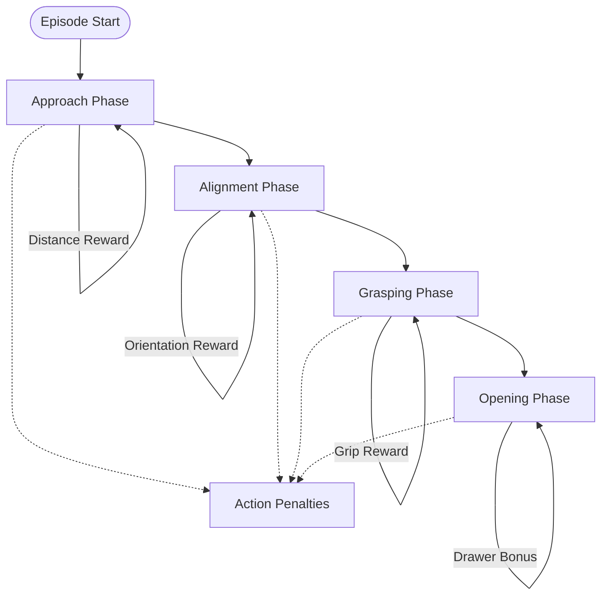
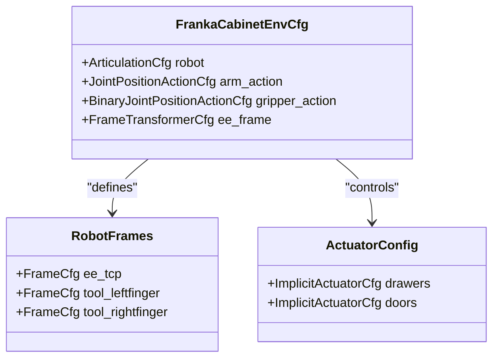
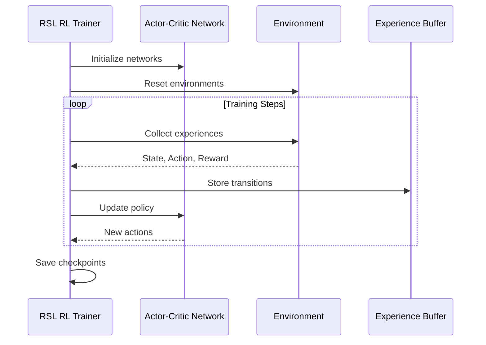
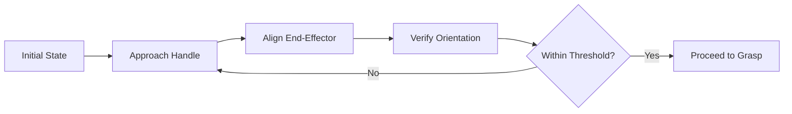
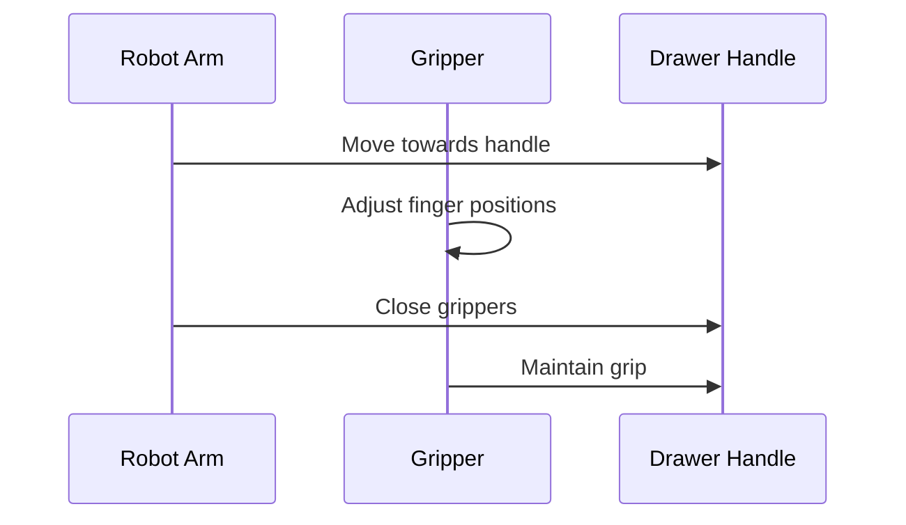

# Cabinet Manipulation

<cite>
**Referenced Files in This Document**
- [cabinet_env_cfg.py](file://source/robot_lab/robot_lab/tasks/manager_based/manipulation/cabinet/cabinet_env_cfg.py)
- [observations.py](file://source/robot_lab/robot_lab/tasks/manager_based/manipulation/cabinet/mdp/observations.py)
- [rewards.py](file://source/robot_lab/robot_lab/tasks/manager_based/manipulation/cabinet/mdp/rewards.py)
- [joint_pos_env_cfg.py](file://source/robot_lab/robot_lab/tasks/manager_based/manipulation/cabinet/config/franka/joint_pos_env_cfg.py)
- [ik_abs_env_cfg.py](file://source/robot_lab/robot_lab/tasks/manager_based/manipulation/cabinet/config/franka/ik_abs_env_cfg.py)
- [ik_rel_env_cfg.py](file://source/robot_lab/robot_lab/tasks/manager_based/manipulation/cabinet/config/franka/ik_rel_env_cfg.py)
- [rsl_rl_ppo_cfg.py](file://source/robot_lab/robot_lab/tasks/manager_based/manipulation/cabinet/config/franka/agents/rsl_rl_ppo_cfg.py)
- [skrl_ppo_cfg.yaml](file://source/robot_lab/robot_lab/tasks/manager_based/manipulation/cabinet/config/franka/agents/skrl_ppo_cfg.yaml)
- [rl_games_ppo_cfg.yaml](file://source/robot_lab/robot_lab/tasks/manager_based/manipulation/cabinet/config/franka/agents/rl_games_ppo_cfg.yaml)
</cite>

## Table of Contents
1. [Introduction](#introduction)
2. [System Architecture](#system-architecture)
3. [Environment Configuration](#environment-configuration)
4. [MDP Components](#mdp-components)
5. [Robot Configuration](#robot-configuration)
6. [Training Configurations](#training-configurations)
7. [Task Workflow](#task-workflow)
8. [Performance Considerations](#performance-considerations)
9. [Troubleshooting Guide](#troubleshooting-guide)
10. [Conclusion](#conclusion)

## Introduction

The Cabinet Manipulation system is a robotic manipulation task designed to teach robots how to open cabinets containing drawers. This system implements a comprehensive reinforcement learning framework using the Isaac Lab platform, focusing on end-to-end drawer opening skills including approach, grasping, and opening sequences.

The task involves a robot (currently configured for Franka Panda) interacting with a Sektion cabinet featuring sliding drawers and hinged doors. The system employs advanced control strategies including inverse kinematics, differential inverse kinematics, and joint position control to achieve precise manipulation capabilities.

## System Architecture

The cabinet manipulation system follows a modular architecture built on the Manager-Based Reinforcement Learning framework:



**Diagram sources**
- [cabinet_env_cfg.py:252-279](file://source/robot_lab/robot_lab/tasks/manager_based/manipulation/cabinet/cabinet_env_cfg.py#L252-L279)
- [joint_pos_env_cfg.py:24-94](file://source/robot_lab/robot_lab/tasks/manager_based/manipulation/cabinet/config/franka/joint_pos_env_cfg.py#L24-L94)

## Environment Configuration

The environment configuration establishes the physical setup and simulation parameters for cabinet manipulation:

### Scene Configuration

The CabinetSceneCfg defines the complete simulation environment with robot, cabinet, and world elements:



**Diagram sources**
- [cabinet_env_cfg.py:43-117](file://source/robot_lab/robot_lab/tasks/manager_based/manipulation/cabinet/cabinet_env_cfg.py#L43-L117)

### Simulation Parameters

The environment operates with high-fidelity physics simulation:
- **Time Step**: 1/60 seconds (60Hz)
- **Episode Length**: 8 seconds
- **Number of Environments**: 4096 concurrent simulations
- **Physics Engine**: PhysX with specialized parameters for stability

**Section sources**
- [cabinet_env_cfg.py:257-279](file://source/robot_lab/robot_lab/tasks/manager_based/manipulation/cabinet/cabinet_env_cfg.py#L257-L279)

## MDP Components

The Markov Decision Process (MDP) components define the learning framework for cabinet manipulation:

### Observation Space

The observation system provides comprehensive state information:

| Observation Type | Function | Purpose |
|------------------|----------|---------|
| Joint Positions | `joint_pos_rel` | Relative joint positions from robot |
| Joint Velocities | `joint_vel_rel` | Robot joint velocity measurements |
| Drawer Position | `joint_pos_rel` | Drawer top joint position |
| Drawer Velocity | `joint_vel_rel` | Drawer movement rate |
| Distance Metric | `rel_ee_drawer_distance` | End-effector to handle distance |
| Action History | `last_action` | Previous actions for temporal context |

### Reward Functions

The reward system implements a hierarchical learning approach:



**Diagram sources**
- [rewards.py:18-163](file://source/robot_lab/robot_lab/tasks/manager_based/manipulation/cabinet/mdp/rewards.py#L18-L163)

**Section sources**
- [cabinet_env_cfg.py:133-238](file://source/robot_lab/robot_lab/tasks/manager_based/manipulation/cabinet/cabinet_env_cfg.py#L133-L238)

## Robot Configuration

The system supports multiple robot configurations with specialized end-effector setups:

### Franka Panda Configuration

The primary robot configuration uses the Franka Panda manipulator:



**Diagram sources**
- [joint_pos_env_cfg.py:24-82](file://source/robot_lab/robot_lab/tasks/manager_based/manipulation/cabinet/config/franka/joint_pos_env_cfg.py#L24-L82)

### Control Strategies

The system implements three distinct control approaches:

| Control Type | Configuration | Use Case |
|-------------|---------------|----------|
| Joint Position | `JointPositionActionCfg` | Precise joint control |
| Absolute IK | `DifferentialInverseKinematicsActionCfg` | Pose-based control |
| Relative IK | `DifferentialInverseKinematicsActionCfg` | Relative motion control |

**Section sources**
- [joint_pos_env_cfg.py:33-44](file://source/robot_lab/robot_lab/tasks/manager_based/manipulation/cabinet/config/franka/joint_pos_env_cfg.py#L33-L44)
- [ik_abs_env_cfg.py:29-36](file://source/robot_lab/robot_lab/tasks/manager_based/manipulation/cabinet/config/franka/ik_abs_env_cfg.py#L29-L36)
- [ik_rel_env_cfg.py:29-36](file://source/robot_lab/robot_lab/tasks/manager_based/manipulation/cabinet/config/franka/ik_rel_env_cfg.py#L29-L36)

## Training Configurations

Multiple reinforcement learning frameworks are supported for training the cabinet manipulation policy:

### RSL RL PPO Configuration



**Diagram sources**
- [rsl_rl_ppo_cfg.py:12-39](file://source/robot_lab/robot_lab/tasks/manager_based/manipulation/cabinet/config/franka/agents/rsl_rl_ppo_cfg.py#L12-L39)

### SKRL PPO Configuration

The SKRL implementation provides similar functionality with different parameterization:

| Parameter | Value | Description |
|-----------|-------|-------------|
| Hidden Layers | [256, 128, 64] | Network architecture |
| Learning Rate | 5.0e-4 | Optimization step size |
| Entropy Coefficient | 1e-3 | Exploration bonus |
| Clip Parameter | 0.2 | PPO clipping threshold |
| Gradient Norm | 1.0 | Training stability |

### RL-Games Configuration

The RL-Games framework offers an alternative training approach with GPU acceleration.

**Section sources**
- [skrl_ppo_cfg.yaml:11-86](file://source/robot_lab/robot_lab/tasks/manager_based/manipulation/cabinet/config/franka/agents/skrl_ppo_cfg.yaml#L11-L86)
- [rl_games_ppo_cfg.yaml:47-82](file://source/robot_lab/robot_lab/tasks/manager_based/manipulation/cabinet/config/franka/agents/rl_games_ppo_cfg.yaml#L47-L82)

## Task Workflow

The cabinet manipulation task follows a structured workflow for skill acquisition:

### Phase 1: Approach and Alignment

The robot learns to approach the drawer handle while maintaining proper orientation:



### Phase 2: Grasping Execution

Once aligned, the robot executes the grasping motion:



### Phase 3: Drawer Opening

The final phase focuses on controlled drawer opening:

```mermaid
flowchart TD
Start([Gripped Handle]) --> Easy[Easy Stage<br/>(0.01 rad)]
Easy --> Medium[Medium Stage<br/>(0.2 rad)]
Medium --> Hard[Hard Stage<br/>(0.3 rad)]
Hard --> Complete[Complete Opening]
Easy -.-> Bonus[+1.0 Bonus]
Medium -.-> Bonus[+(1.0 + Grasp) Bonus]
Hard -.-> Bonus[+(1.0 + Grasp) Bonus]
```

**Section sources**
- [rewards.py:138-163](file://source/robot_lab/robot_lab/tasks/manager_based/manipulation/cabinet/mdp/rewards.py#L138-L163)

## Performance Considerations

### Simulation Optimization

The system employs several optimization strategies:

- **Parallel Environments**: 4096 concurrent simulations for efficient learning
- **Physics Stability**: Specialized PhysX parameters for reliable contact modeling
- **Rendering Efficiency**: Optimized render intervals for real-time visualization

### Control Performance

- **IK Accuracy**: Differential IK provides precise end-effector control
- **Gripper Precision**: Binary gripper control ensures reliable object interaction
- **Actuator Limits**: Properly configured actuator models prevent unrealistic movements

### Training Efficiency

- **Experience Reuse**: Shared experience buffers across different frameworks
- **Learning Rate Scheduling**: Adaptive learning rates improve convergence
- **Regularization**: Proper regularization prevents overfitting

## Troubleshooting Guide

### Common Issues and Solutions

| Issue | Symptoms | Solution |
|-------|----------|----------|
| IK Convergence | Robot fails to reach target | Check joint limits and initialization |
| Gripper Stuck | Objects not released properly | Verify gripper force limits |
| Drawer Not Opening | No response to commands | Confirm actuator configuration |
| Training Instability | Poor reward performance | Adjust learning rate and batch sizes |

### Debugging Tools

The system provides comprehensive debugging capabilities:
- **Frame Visualization**: End-effector and handle frame markers
- **Sensor Data**: Real-time joint position and velocity monitoring
- **Reward Analysis**: Individual reward component inspection

### Performance Monitoring

Key metrics to monitor during training:
- **Success Rate**: Percentage of successful drawer openings
- **Convergence**: Reward improvement over time
- **Stability**: Variance in training performance

## Conclusion

The Cabinet Manipulation system represents a sophisticated robotic manipulation framework that successfully combines advanced control strategies with reinforcement learning. The modular architecture enables flexible robot configuration while maintaining high-performance simulation capabilities.

The hierarchical reward system effectively guides the robot through the complex task of drawer manipulation, from initial approach to final opening. The multiple control configurations provide flexibility for different robot platforms and operational requirements.

Future enhancements could include support for additional robot types, more complex cabinet configurations, and advanced manipulation skills such as door opening and multi-object manipulation.