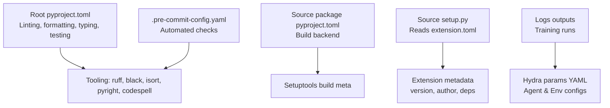
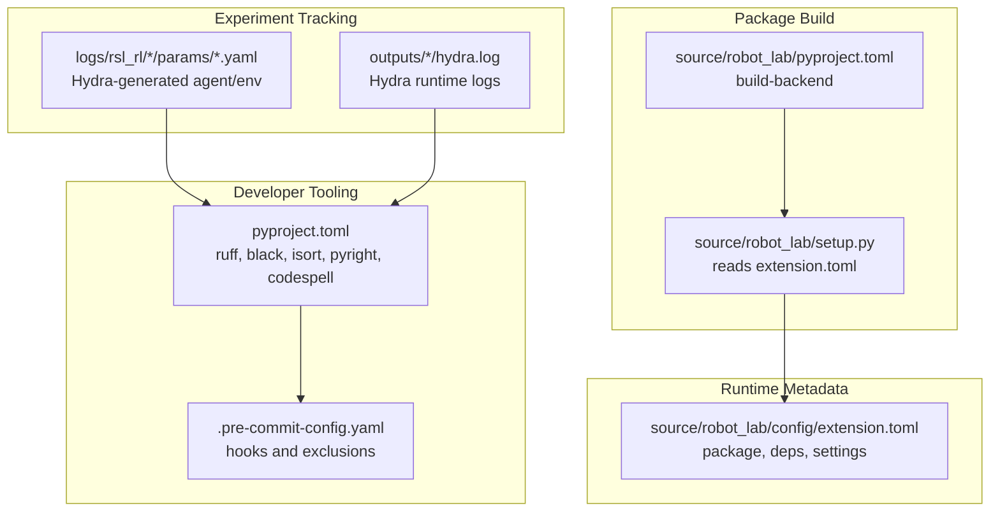
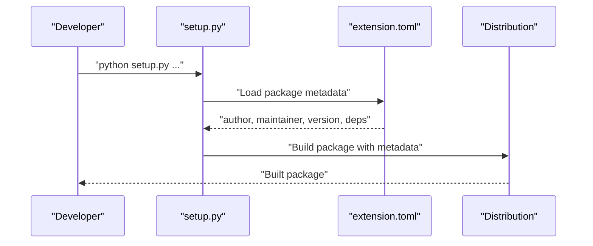
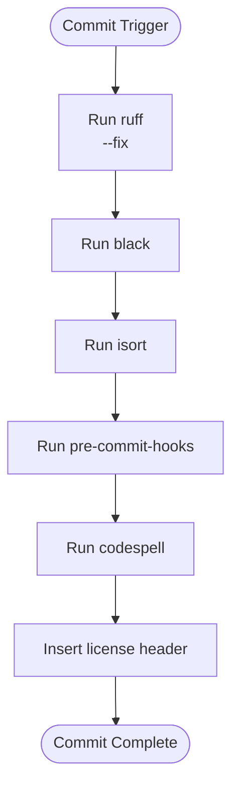
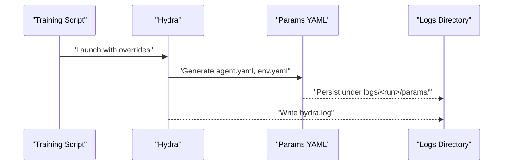
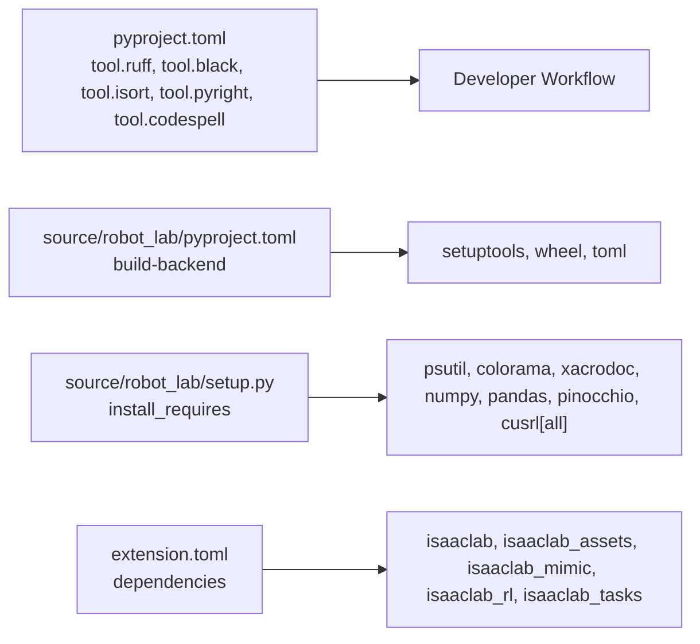

# Configuration Management

<cite>
**Referenced Files in This Document**
- [pyproject.toml](file://pyproject.toml)
- [.pre-commit-config.yaml](file://.pre-commit-config.yaml)
- [source/robot_lab/pyproject.toml](file://source/robot_lab/pyproject.toml)
- [source/robot_lab/setup.py](file://source/robot_lab/setup.py)
- [source/robot_lab/config/extension.toml](file://source/robot_lab/config/extension.toml)
- [logs/rsl_rl/opendoge_apx_flat/2026-01-20_11-11-30/params/agent.yaml](file://logs/rsl_rl/opendoge_apx_flat/2026-01-20_11-11-30/params/agent.yaml)
- [logs/rsl_rl/opendoge_apx_flat/2026-01-20_11-11-30/params/env.yaml](file://logs/rsl_rl/opendoge_apx_flat/2026-01-20_11-11-30/params/env.yaml)
- [logs/rsl_rl/opendoge_apx_flat/2026-01-20_11-11-30/params/env.yaml](file://logs/rsl_rl/opendoge_apx_flat/2026-01-20_11-11-30/params/env.yaml)
- [outputs/2026-01-22/10-03-37/hydra.log](file://outputs/2026-01-22/10-03-37/hydra.log)
</cite>

## Table of Contents
1. [Introduction](#introduction)
2. [Project Structure](#project-structure)
3. [Core Components](#core-components)
4. [Architecture Overview](#architecture-overview)
5. [Detailed Component Analysis](#detailed-component-analysis)
6. [Dependency Analysis](#dependency-analysis)
7. [Performance Considerations](#performance-considerations)
8. [Troubleshooting Guide](#troubleshooting-guide)
9. [Conclusion](#conclusion)
10. [Appendices](#appendices)

## Introduction
This document explains the configuration management system used in the project, focusing on:
- The build and developer toolchain configuration via pyproject.toml
- The extension metadata and installation requirements defined in extension.toml
- Pre-commit configuration for automated formatting and quality checks
- Experiment tracking and parameter persistence observed in training logs
- Environment variable management, configuration validation, and parameter inheritance patterns
- Customization strategies for different deployment scenarios and development workflows
- Guidelines for maintaining configuration consistency across team environments and CI/CD pipelines

## Project Structure
The configuration ecosystem spans three primary areas:
- Root developer tooling and linting/formatting configuration
- Package build metadata and backend specification
- Extension metadata and runtime/installation requirements

**Diagram sources**
- [pyproject.toml](file://pyproject.toml#L6-L247)
- [source/robot_lab/pyproject.toml](file://source/robot_lab/pyproject.toml#L1-L4)
- [source/robot_lab/setup.py](file://source/robot_lab/setup.py#L1-L54)
- [source/robot_lab/config/extension.toml](file://source/robot_lab/config/extension.toml#L1-L36)
- [.pre-commit-config.yaml](file://.pre-commit-config.yaml#L1-L69)

**Section sources**
- [pyproject.toml](file://pyproject.toml#L6-L247)
- [source/robot_lab/pyproject.toml](file://source/robot_lab/pyproject.toml#L1-L4)
- [source/robot_lab/setup.py](file://source/robot_lab/setup.py#L11-L43)
- [source/robot_lab/config/extension.toml](file://source/robot_lab/config/extension.toml#L1-L36)
- [.pre-commit-config.yaml](file://.pre-commit-config.yaml#L1-L69)

## Core Components
- Root pyproject.toml defines:
  - Formatting with Black (line length, target version)
  - Import sorting with isort (grouping and ordering)
  - Linting with ruff (rules, complexity, style)
  - Type checking with pyright (includes/excludes, platform, missing import handling)
  - Spell checking with codespell
  - Pytest markers for CI
- Source package pyproject.toml defines the build backend for the robot_lab package
- Source setup.py reads extension.toml to populate package metadata and install_requires
- extension.toml defines package metadata, dependencies, and optional system settings
- .pre-commit-config.yaml orchestrates automated checks on commit

Key configuration artifacts:
- Tooling configuration: [pyproject.toml](file://pyproject.toml#L6-L247)
- Build backend: [source/robot_lab/pyproject.toml](file://source/robot_lab/pyproject.toml#L1-L4)
- Extension metadata and dependencies: [source/robot_lab/config/extension.toml](file://source/robot_lab/config/extension.toml#L1-L36)
- Setup integration: [source/robot_lab/setup.py](file://source/robot_lab/setup.py#L11-L43)
- Pre-commit hooks: [.pre-commit-config.yaml](file://.pre-commit-config.yaml#L1-L69)

**Section sources**
- [pyproject.toml](file://pyproject.toml#L6-L247)
- [source/robot_lab/pyproject.toml](file://source/robot_lab/pyproject.toml#L1-L4)
- [source/robot_lab/setup.py](file://source/robot_lab/setup.py#L11-L43)
- [source/robot_lab/config/extension.toml](file://source/robot_lab/config/extension.toml#L1-L36)
- [.pre-commit-config.yaml](file://.pre-commit-config.yaml#L1-L69)

## Architecture Overview
The configuration architecture integrates developer tooling, packaging, and runtime metadata:

**Diagram sources**
- [pyproject.toml](file://pyproject.toml#L6-L247)
- [.pre-commit-config.yaml](file://.pre-commit-config.yaml#L1-L69)
- [source/robot_lab/pyproject.toml](file://source/robot_lab/pyproject.toml#L1-L4)
- [source/robot_lab/setup.py](file://source/robot_lab/setup.py#L11-L43)
- [source/robot_lab/config/extension.toml](file://source/robot_lab/config/extension.toml#L1-L36)
- [logs/rsl_rl/opendoge_apx_flat/2026-01-20_11-11-30/params/agent.yaml](file://logs/rsl_rl/opendoge_apx_flat/2026-01-20_11-11-30/params/agent.yaml)
- [logs/rsl_rl/opendoge_apx_flat/2026-01-20_11-11-30/params/env.yaml](file://logs/rsl_rl/opendoge_apx_flat/2026-01-20_11-11-30/params/env.yaml)
- [outputs/2026-01-22/10-03-37/hydra.log](file://outputs/2026-01-22/10-03-37/hydra.log)

## Detailed Component Analysis

### Root pyproject.toml: Developer Tooling Configuration
- Formatting:
  - Black: line length, target version, preview flags
- Import sorting:
  - isort: profile, py version, sections, skip globs, custom sections for Omniverse and project modules
- Linting:
  - ruff: line length, target version, select/ignore rules, per-file ignores, McCabe complexity
- Type checking:
  - pyright: include/exclude, typeCheckingMode, pythonVersion/platform, missing import handling
- Spell checking:
  - codespell: skip patterns, word lists
- Testing:
  - pytest markers for CI

Concrete examples from the codebase:
- Black configuration keys and values: [pyproject.toml](file://pyproject.toml#L6-L11)
- isort sections and known modules: [pyproject.toml](file://pyproject.toml#L13-L98)
- ruff lint rules and complexity: [pyproject.toml](file://pyproject.toml#L100-L148)
- pyright includes/excludes and missing import handling: [pyproject.toml](file://pyproject.toml#L207-L233)
- codespell ignore list and skip patterns: [pyproject.toml](file://pyproject.toml#L235-L240)
- pytest markers: [pyproject.toml](file://pyproject.toml#L242-L246)

**Section sources**
- [pyproject.toml](file://pyproject.toml#L6-L247)

### Source Package Build Configuration
- Build backend:
  - Setuptools build meta with toml requirement
- Purpose:
  - Defines how the robot_lab package is built and distributed

Example reference:
- Build backend definition: [source/robot_lab/pyproject.toml](file://source/robot_lab/pyproject.toml#L1-L4)

**Section sources**
- [source/robot_lab/pyproject.toml](file://source/robot_lab/pyproject.toml#L1-L4)

### Extension Configuration System (extension.toml)
- Package metadata:
  - version, category, readme, title, author, maintainer, description, repository, keywords
- Dependencies:
  - Declares dependencies on isaaclab, isaaclab_assets, isaaclab_mimic, isaaclab_rl, isaaclab_tasks
- Python module declaration:
  - Declares the robot_lab module
- Optional system settings:
  - Placeholder comments for apt dependencies and ROS workspace path

Examples from the codebase:
- Package metadata and dependencies: [source/robot_lab/config/extension.toml](file://source/robot_lab/config/extension.toml#L1-L24)
- Python module declaration: [source/robot_lab/config/extension.toml](file://source/robot_lab/config/extension.toml#L25-L27)
- Optional system settings: [source/robot_lab/config/extension.toml](file://source/robot_lab/config/extension.toml#L28-L36)

**Section sources**
- [source/robot_lab/config/extension.toml](file://source/robot_lab/config/extension.toml#L1-L36)

### Setup Integration with extension.toml
- Setup reads extension.toml to populate:
  - author, maintainer, repository, version, description, keywords
- Defines minimum install_requires for runtime support

Examples from the codebase:
- TOML loading and metadata population: [source/robot_lab/setup.py](file://source/robot_lab/setup.py#L11-L40)
- Install requirements: [source/robot_lab/setup.py](file://source/robot_lab/setup.py#L16-L28)

**Diagram sources**
- [source/robot_lab/setup.py](file://source/robot_lab/setup.py#L11-L43)
- [source/robot_lab/config/extension.toml](file://source/robot_lab/config/extension.toml#L1-L36)

**Section sources**
- [source/robot_lab/setup.py](file://source/robot_lab/setup.py#L11-L43)
- [source/robot_lab/config/extension.toml](file://source/robot_lab/config/extension.toml#L1-L36)

### Pre-commit Configuration for Automated Quality Assurance
- Hooks:
  - ruff (linting and auto-fix), black (formatting), isort (imports), pre-commit-hooks (various checks), codespell (spell checking), license header insertion
- Exclusions:
  - third-party assets, data assets, IDE configs, GitHub workflows

Examples from the codebase:
- Hook definitions and arguments: [.pre-commit-config.yaml](file://.pre-commit-config.yaml#L4-L67)
- Exclusions: [.pre-commit-config.yaml](file://.pre-commit-config.yaml#L68-L69)

**Diagram sources**
- [.pre-commit-config.yaml](file://.pre-commit-config.yaml#L4-L67)

**Section sources**
- [.pre-commit-config.yaml](file://.pre-commit-config.yaml#L1-L69)

### Experiment Tracking and Parameter Persistence (Hydra)
Observed in training logs:
- Agent and environment parameter YAML files generated by Hydra
- Hydra runtime logs indicating experiment runs

Examples from the codebase:
- Agent parameters: [logs/rsl_rl/opendoge_apx_flat/2026-01-20_11-11-30/params/agent.yaml](file://logs/rsl_rl/opendoge_apx_flat/2026-01-20_11-11-30/params/agent.yaml)
- Environment parameters: [logs/rsl_rl/opendoge_apx_flat/2026-01-20_11-11-30/params/env.yaml](file://logs/rsl_rl/opendoge_apx_flat/2026-01-20_11-11-30/params/env.yaml)
- Hydra runtime log: [outputs/2026-01-22/10-03-37/hydra.log](file://outputs/2026-01-22/10-03-37/hydra.log)

**Diagram sources**
- [logs/rsl_rl/opendoge_apx_flat/2026-01-20_11-11-30/params/agent.yaml](file://logs/rsl_rl/opendoge_apx_flat/2026-01-20_11-11-30/params/agent.yaml)
- [logs/rsl_rl/opendoge_apx_flat/2026-01-20_11-11-30/params/env.yaml](file://logs/rsl_rl/opendoge_apx_flat/2026-01-20_11-11-30/params/env.yaml)
- [outputs/2026-01-22/10-03-37/hydra.log](file://outputs/2026-01-22/10-03-37/hydra.log)

**Section sources**
- [logs/rsl_rl/opendoge_apx_flat/2026-01-20_11-11-30/params/agent.yaml](file://logs/rsl_rl/opendoge_apx_flat/2026-01-20_11-11-30/params/agent.yaml)
- [logs/rsl_rl/opendoge_apx_flat/2026-01-20_11-11-30/params/env.yaml](file://logs/rsl_rl/opendoge_apx_flat/2026-01-20_11-11-30/params/env.yaml)
- [outputs/2026-01-22/10-03-37/hydra.log](file://outputs/2026-01-22/10-03-37/hydra.log)

## Dependency Analysis
- Tooling dependencies:
  - ruff, black, isort, pyright, codespell are configured in the root pyproject.toml
- Packaging dependencies:
  - setuptools, wheel, toml for the build backend
  - psutil, colorama, xacrodoc, numpy, pandas, pinocchio, cusrl[all] for runtime
- Extension dependencies:
  - isaaclab, isaaclab_assets, isaaclab_mimic, isaaclab_rl, isaaclab_tasks declared in extension.toml

**Diagram sources**
- [pyproject.toml](file://pyproject.toml#L6-L247)
- [source/robot_lab/pyproject.toml](file://source/robot_lab/pyproject.toml#L1-L4)
- [source/robot_lab/setup.py](file://source/robot_lab/setup.py#L16-L28)
- [source/robot_lab/config/extension.toml](file://source/robot_lab/config/extension.toml#L17-L23)

**Section sources**
- [pyproject.toml](file://pyproject.toml#L6-L247)
- [source/robot_lab/pyproject.toml](file://source/robot_lab/pyproject.toml#L1-L4)
- [source/robot_lab/setup.py](file://source/robot_lab/setup.py#L16-L28)
- [source/robot_lab/config/extension.toml](file://source/robot_lab/config/extension.toml#L17-L23)

## Performance Considerations
- Keep tooling configuration minimal and consistent to avoid long pre-commit runs
- Prefer Black and ruff for formatting/linting to reduce conflicts
- Limit pyright strictness in CI to balance speed and correctness
- Use pre-commit exclusions judiciously to avoid unnecessary checks on large binary assets

[No sources needed since this section provides general guidance]

## Troubleshooting Guide
Common issues and resolutions:
- Pre-commit failures due to import order or formatting:
  - Run the respective hooks locally to align with configuration
  - References: [pyproject.toml](file://pyproject.toml#L100-L148), [.pre-commit-config.yaml](file://.pre-commit-config.yaml#L4-L20)
- Type checking errors in CI:
  - Adjust pyright settings or ignore missing imports as configured
  - Reference: [pyproject.toml](file://pyproject.toml#L207-L233)
- Spell errors:
  - Review codespell ignore lists and update as needed
  - Reference: [pyproject.toml](file://pyproject.toml#L235-L240)
- Package metadata mismatch:
  - Verify extension.toml and setup.py alignment
  - References: [source/robot_lab/config/extension.toml](file://source/robot_lab/config/extension.toml#L1-L36), [source/robot_lab/setup.py](file://source/robot_lab/setup.py#L11-L43)

**Section sources**
- [pyproject.toml](file://pyproject.toml#L100-L148)
- [.pre-commit-config.yaml](file://.pre-commit-config.yaml#L4-L20)
- [pyproject.toml](file://pyproject.toml#L207-L233)
- [pyproject.toml](file://pyproject.toml#L235-L240)
- [source/robot_lab/config/extension.toml](file://source/robot_lab/config/extension.toml#L1-L36)
- [source/robot_lab/setup.py](file://source/robot_lab/setup.py#L11-L43)

## Conclusion
The project’s configuration management combines robust developer tooling, explicit package metadata, and observable experiment tracking. By centralizing tooling in pyproject.toml, declaring extension metadata in extension.toml, and enforcing quality gates via pre-commit, teams can maintain consistency across environments and CI/CD pipelines. Experiment parameters persisted by Hydra enable reproducible training runs and transparent auditing.

[No sources needed since this section summarizes without analyzing specific files]

## Appendices

### Appendix A: Configuration Validation and Overrides (Hydra)
- Hydra generates parameter YAMLs for agent and environment during training
- Overrides can be applied at runtime to customize experiments
- Logs capture the resulting configuration and runtime behavior

References:
- Agent params: [logs/rsl_rl/opendoge_apx_flat/2026-01-20_11-11-30/params/agent.yaml](file://logs/rsl_rl/opendoge_apx_flat/2026-01-20_11-11-30/params/agent.yaml)
- Env params: [logs/rsl_rl/opendoge_apx_flat/2026-01-20_11-11-30/params/env.yaml](file://logs/rsl_rl/opendoge_apx_flat/2026-01-20_11-11-30/params/env.yaml)
- Hydra log: [outputs/2026-01-22/10-03-37/hydra.log](file://outputs/2026-01-22/10-03-37/hydra.log)

**Section sources**
- [logs/rsl_rl/opendoge_apx_flat/2026-01-20_11-11-30/params/agent.yaml](file://logs/rsl_rl/opendoge_apx_flat/2026-01-20_11-11-30/params/agent.yaml)
- [logs/rsl_rl/opendoge_apx_flat/2026-01-20_11-11-30/params/env.yaml](file://logs/rsl_rl/opendoge_apx_flat/2026-01-20_11-11-30/params/env.yaml)
- [outputs/2026-01-22/10-03-37/hydra.log](file://outputs/2026-01-22/10-03-37/hydra.log)