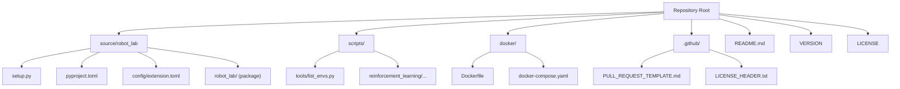
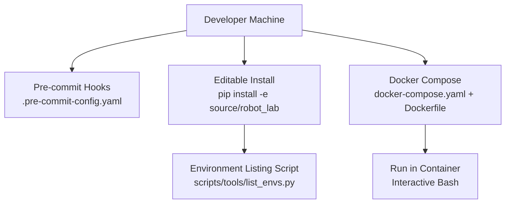
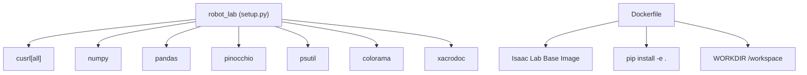

# Contributing and Development

<cite>
**Referenced Files in This Document**
- [README.md](file://README.md)
- [.pre-commit-config.yaml](file://.pre-commit-config.yaml)
- [.github/PULL_REQUEST_TEMPLATE.md](file://.github/PULL_REQUEST_TEMPLATE.md)
- [CONTRIBUTORS.md](file://CONTRIBUTORS.md)
- [LICENSE](file://LICENSE)
- [VERSION](file://VERSION)
- [source/robot_lab/config/extension.toml](file://source/robot_lab/config/extension.toml)
- [source/robot_lab/setup.py](file://source/robot_lab/setup.py)
- [source/robot_lab/pyproject.toml](file://source/robot_lab/pyproject.toml)
- [docker/Dockerfile](file://docker/Dockerfile)
- [docker/docker-compose.yaml](file://docker/docker-compose.yaml)
- [scripts/tools/list_envs.py](file://scripts/tools/list_envs.py)
- [.github/LICENSE_HEADER.txt](file://.github/LICENSE_HEADER.txt)
</cite>

## Table of Contents
1. [Introduction](#introduction)
2. [Project Structure](#project-structure)
3. [Core Components](#core-components)
4. [Architecture Overview](#architecture-overview)
5. [Detailed Component Analysis](#detailed-component-analysis)
6. [Dependency Analysis](#dependency-analysis)
7. [Performance Considerations](#performance-considerations)
8. [Troubleshooting Guide](#troubleshooting-guide)
9. [Conclusion](#conclusion)
10. [Appendices](#appendices)

## Introduction
This section provides a comprehensive guide for contributors and developers working on robot_lab. It covers development environment setup, pre-commit hooks, code formatting and quality standards, contribution workflow, governance and licensing, release and versioning, and practical guidance for extending the framework with new robots, tasks, and algorithms.

## Project Structure
The repository is organized around a Python package that extends Isaac Lab with reinforcement learning environments and related tools. Key areas include:
- Source package and configuration for the Python package
- Scripts for environment listing and reinforcement learning utilities
- Docker assets for containerized development and deployment
- GitHub templates for pull requests and license header enforcement
- Top-level documentation and version metadata

**Diagram sources**
- [README.md](file://README.md#L1-L501)
- [source/robot_lab/setup.py](file://source/robot_lab/setup.py#L1-L54)
- [source/robot_lab/pyproject.toml](file://source/robot_lab/pyproject.toml#L1-L4)
- [source/robot_lab/config/extension.toml](file://source/robot_lab/config/extension.toml#L1-L36)
- [docker/Dockerfile](file://docker/Dockerfile#L1-L22)
- [docker/docker-compose.yaml](file://docker/docker-compose.yaml#L1-L37)
- [.github/PULL_REQUEST_TEMPLATE.md](file://.github/PULL_REQUEST_TEMPLATE.md#L1-L26)
- [.github/LICENSE_HEADER.txt](file://.github/LICENSE_HEADER.txt#L1-L2)

**Section sources**
- [README.md](file://README.md#L1-L501)
- [source/robot_lab/config/extension.toml](file://source/robot_lab/config/extension.toml#L1-L36)
- [docker/docker-compose.yaml](file://docker/docker-compose.yaml#L1-L37)

## Core Components
- Python package metadata and installation:
  - Package version and classifier metadata are defined in the Python packaging configuration and the extension configuration.
  - The package installs as a namespace package and includes data files.
- Pre-commit quality gates:
  - A comprehensive pre-commit configuration enforces linting, formatting, import sorting, YAML/JSON/TOML checks, license header insertion, spell checking, and safety checks.
- Pull Request template:
  - The PR template documents required checks and categories for changes.
- Contributors list and governance:
  - A maintained list of developers and contributors is provided, along with guidelines for alphabetical ordering and acknowledgements.
- Licensing:
  - The project is licensed under the Apache License 2.0, with standard terms for contributions and redistribution.

**Section sources**
- [source/robot_lab/config/extension.toml](file://source/robot_lab/config/extension.toml#L1-L36)
- [source/robot_lab/setup.py](file://source/robot_lab/setup.py#L1-L54)
- [source/robot_lab/pyproject.toml](file://source/robot_lab/pyproject.toml#L1-L4)
- [.pre-commit-config.yaml](file://.pre-commit-config.yaml#L1-L69)
- [.github/PULL_REQUEST_TEMPLATE.md](file://.github/PULL_REQUEST_TEMPLATE.md#L1-L26)
- [CONTRIBUTORS.md](file://CONTRIBUTORS.md#L1-L31)
- [LICENSE](file://LICENSE#L1-L202)

## Architecture Overview
The development and contribution architecture centers on:
- Pre-commit hooks to enforce code quality before commits
- Python packaging and installation via editable installs
- Containerized development and deployment using Docker Compose
- Environment discovery and verification via a dedicated script

**Diagram sources**
- [.pre-commit-config.yaml](file://.pre-commit-config.yaml#L1-L69)
- [source/robot_lab/setup.py](file://source/robot_lab/setup.py#L31-L53)
- [docker/docker-compose.yaml](file://docker/docker-compose.yaml#L1-L37)
- [docker/Dockerfile](file://docker/Dockerfile#L1-L22)
- [scripts/tools/list_envs.py](file://scripts/tools/list_envs.py#L1-L86)

## Detailed Component Analysis

### Development Environment Setup
- Install Isaac Lab per the official guide, then install the robot_lab package in editable mode from the source directory.
- Optionally configure IDE indexing paths for Pylance to improve autocomplete and navigation.
- Use Docker Compose to build and run the environment with GPU access and host networking.

Practical steps:
- Install robot_lab in editable mode from the source directory.
- List environments to verify registration.
- Configure VS Code tasks and settings if using the IDE.
- Build and run the Docker image for containerized development.

**Section sources**
- [README.md](file://README.md#L58-L111)
- [scripts/tools/list_envs.py](file://scripts/tools/list_envs.py#L1-L86)
- [docker/docker-compose.yaml](file://docker/docker-compose.yaml#L1-L37)
- [docker/Dockerfile](file://docker/Dockerfile#L1-L22)

### Pre-commit Hooks and Quality Gates
The pre-commit configuration enforces:
- Linting and auto-fixing via Ruff
- Formatting via Black
- Import sorting via isort
- Safety and style checks via pre-commit-hooks (YAML/JSON/TOML, merge conflict detection, shebangs, end-of-file, symlinks, large files)
- Spell checking via codespell
- License header insertion via insert-license using the repository’s header file
- Restricting hook execution to relevant paths via exclusion rules

Recommended usage:
- Install pre-commit and run checks on all files before committing.
- Keep the repository excluded paths up to date as new directories are introduced.

**Section sources**
- [.pre-commit-config.yaml](file://.pre-commit-config.yaml#L1-L69)
- [.github/LICENSE_HEADER.txt](file://.github/LICENSE_HEADER.txt#L1-L2)

### Code Formatting Standards and Best Practices
- Python formatting: enforced by Black and isort
- Linting: enforced by Ruff
- Imports: sorted via isort
- Style: enforced by pre-commit-hooks (trailing whitespace, end-of-file, etc.)
- Spelling: enforced by codespell
- License headers: inserted automatically by insert-license

Best practices:
- Run pre-commit on all files before submitting changes.
- Keep large files under the configured size limit; use Git LFS for larger assets.
- Avoid merge conflicts and private keys; rely on pre-commit hooks to catch issues early.

**Section sources**
- [.pre-commit-config.yaml](file://.pre-commit-config.yaml#L1-L69)

### Contribution Workflow
- Issue reporting: use GitHub Issues to report bugs or request features.
- Feature requests: describe motivation, context, and dependencies in the issue.
- Pull requests:
  - Fill in the PR template categories (bug fix, new feature, breaking change).
  - Run pre-commit checks on all files.
  - Ensure no new warnings are introduced.
  - Add or confirm your name in the contributors list as required.

PR checklist highlights:
- Run pre-commit on all files
- No new warnings
- Contributor acknowledgment in the contributors list

**Section sources**
- [.github/PULL_REQUEST_TEMPLATE.md](file://.github/PULL_REQUEST_TEMPLATE.md#L1-L26)
- [CONTRIBUTORS.md](file://CONTRIBUTORS.md#L1-L31)

### Code Standards and Testing Procedures
- Naming conventions:
  - Environment IDs follow a consistent pattern indicating task, robot, terrain, and version.
  - Configuration files and directories are organized by task and robot family.
- Documentation requirements:
  - License headers are inserted automatically by pre-commit.
  - README provides environment tables and installation instructions.
- Testing procedures:
  - Use the environment listing script to verify environment registration.
  - Run training and playback scripts for selected environments to validate functionality.

Example references:
- Environment naming and registration patterns
- Environment listing and verification script
- Training and playback examples in the README

**Section sources**
- [README.md](file://README.md#L17-L42)
- [scripts/tools/list_envs.py](file://scripts/tools/list_envs.py#L1-L86)
- [README.md](file://README.md#L193-L347)

### Extending the Framework: Robots, Tasks, and Algorithms
- Adding a new robot:
  - Place URDF and meshes under the robot data directory.
  - Define assets and articulation configuration in the assets module.
  - Create environment configurations under the task hierarchy.
  - Register environments in the robot’s configuration init file.
- Adding a new task:
  - Extend the base task configuration and create flat/rough variants.
  - Provide agent configurations for supported RL frameworks.
  - Register environments with consistent naming.
- Adding a new RL algorithm:
  - Provide agent configurations compatible with the chosen RL backend.
  - Integrate training and evaluation scripts as needed.

Reference examples:
- Robot data layout and asset definitions
- Task configuration hierarchy and base classes
- Environment registration patterns

**Section sources**
- [README.md](file://README.md#L349-L426)

### Project Governance, Licensing Terms, and Contributor Agreements
- Governance:
  - Maintained by the listed developers and contributors.
  - Guidelines specify alphabetical ordering and acknowledgements.
- Licensing:
  - Licensed under Apache License 2.0 with standard terms for copyright, patent, redistribution, and contribution submission.
- Contributor agreements:
  - Contributions are subject to the project’s license terms; no separate CLA is indicated in the repository.

**Section sources**
- [CONTRIBUTORS.md](file://CONTRIBUTORS.md#L1-L31)
- [LICENSE](file://LICENSE#L1-L202)

### Release Process, Versioning Scheme, and Backward Compatibility
- Versioning:
  - Semantic versioning is used; version is defined in both the extension configuration and the top-level VERSION file.
- Release process:
  - Tag releases according to semantic versioning.
  - Update the VERSION file and extension configuration accordingly.
- Backward compatibility:
  - Environment IDs include a version suffix; changes that break compatibility should increment the version component.

**Section sources**
- [source/robot_lab/config/extension.toml](file://source/robot_lab/config/extension.toml#L3-L4)
- [VERSION](file://VERSION#L1-L2)

### Development Roadmap, Feature Planning, and Community Engagement
- Community engagement:
  - Use GitHub Discussions and Discord for discussions.
- Feature planning:
  - Follow the contribution workflow for proposals and PRs.
  - Align new features with the established environment naming and configuration patterns.

**Section sources**
- [README.md](file://README.md#L46-L46)

## Dependency Analysis
The Python package depends on external libraries and is integrated with Isaac Lab ecosystem packages. The Docker image builds on an Isaac Lab base image and installs the package in editable mode.

**Diagram sources**
- [source/robot_lab/setup.py](file://source/robot_lab/setup.py#L17-L28)
- [docker/Dockerfile](file://docker/Dockerfile#L1-L22)

**Section sources**
- [source/robot_lab/setup.py](file://source/robot_lab/setup.py#L17-L28)
- [docker/Dockerfile](file://docker/Dockerfile#L1-L22)

## Performance Considerations
- Use the environment listing script to verify environment registration and avoid misconfiguration overhead.
- Prefer containerized development for reproducible environments and GPU access.
- Keep large binary assets out of the repository; use Git LFS or external storage as needed.

[No sources needed since this section provides general guidance]

## Troubleshooting Guide
Common issues and resolutions:
- IDE indexing problems:
  - Add extra Python paths in VS Code settings to include the robot_lab and Isaac Lab packages.
- USD cache cleanup:
  - Remove temporary USD directories generated during simulations to free disk space.
- Environment verification:
  - Use the environment listing script to confirm that environments are registered and discoverable.

**Section sources**
- [README.md](file://README.md#L452-L481)
- [scripts/tools/list_envs.py](file://scripts/tools/list_envs.py#L1-L86)

## Conclusion
This guide consolidates the essential practices for contributing to robot_lab: setting up the development environment, enforcing code quality via pre-commit, following contribution and governance processes, adhering to licensing and versioning policies, and extending the framework with new robots, tasks, and algorithms. By aligning with the documented standards and leveraging the provided scripts and Docker assets, contributors can efficiently collaborate and maintain a high-quality codebase.

[No sources needed since this section summarizes without analyzing specific files]

## Appendices

### Appendix A: Quick Reference for Contributors
- Install robot_lab in editable mode from the source directory.
- Run pre-commit on all files before committing.
- Verify environment registration using the environment listing script.
- Use Docker Compose for reproducible development with GPU access.
- Follow the PR template and maintain the contributors list.

**Section sources**
- [README.md](file://README.md#L58-L111)
- [.pre-commit-config.yaml](file://.pre-commit-config.yaml#L1-L69)
- [scripts/tools/list_envs.py](file://scripts/tools/list_envs.py#L1-L86)
- [docker/docker-compose.yaml](file://docker/docker-compose.yaml#L1-L37)