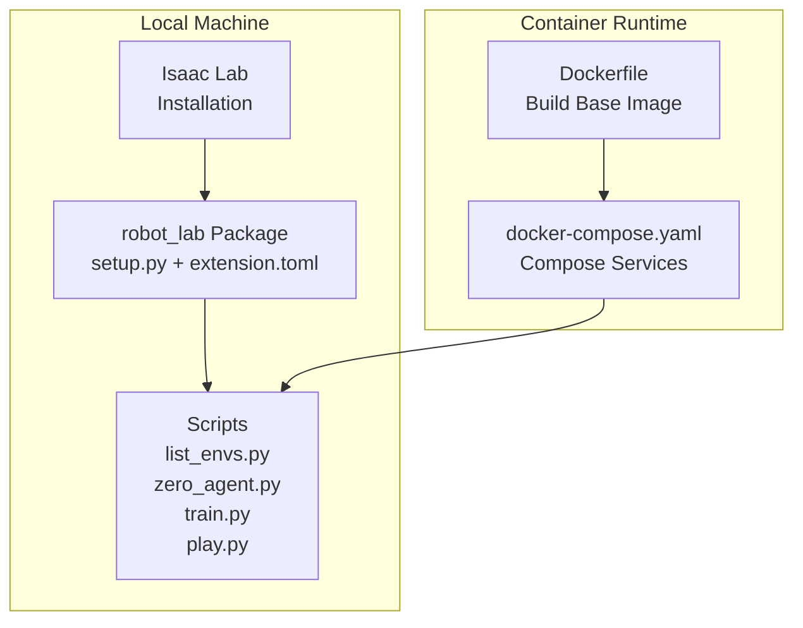
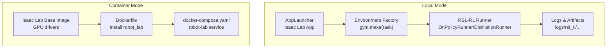
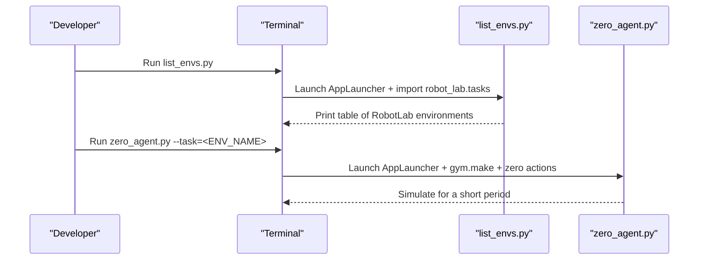
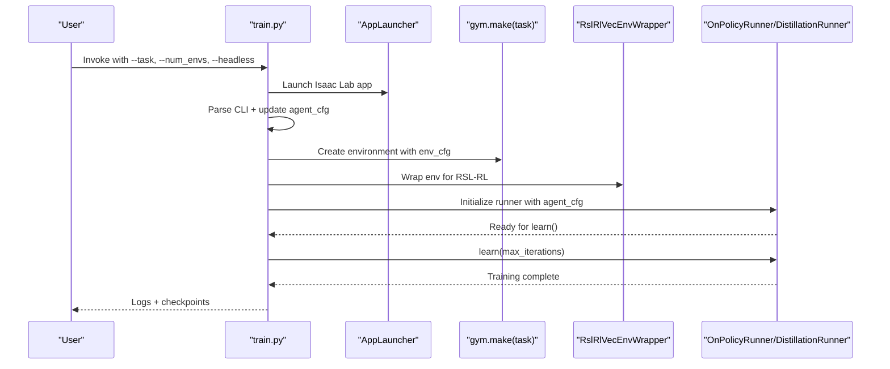
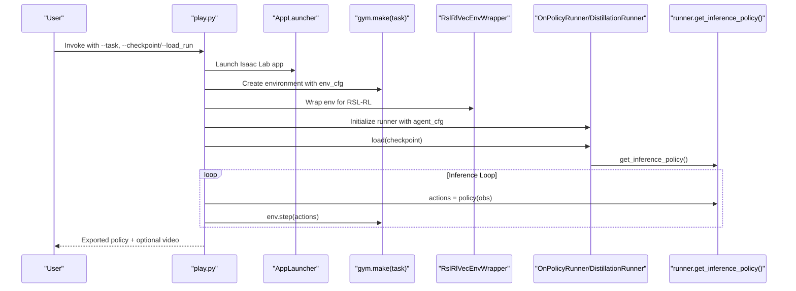
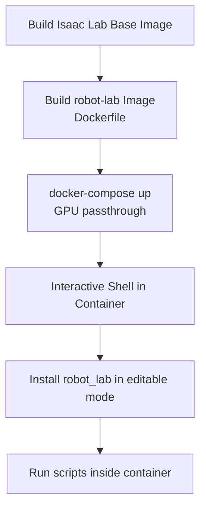
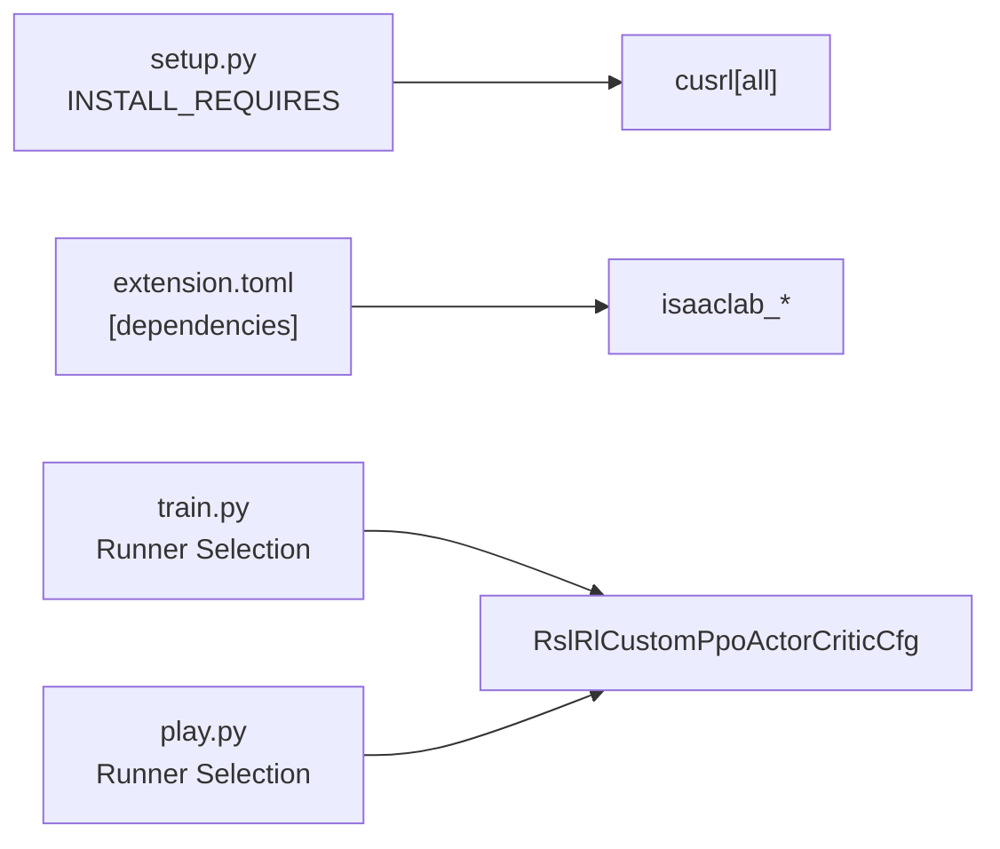

# Deployment Scenarios

<cite>
**Referenced Files in This Document**
- [README.md](file://README.md)
- [Dockerfile](file://docker/Dockerfile)
- [docker-compose.yaml](file://docker/docker-compose.yaml)
- [setup.py](file://source/robot_lab/setup.py)
- [extension.toml](file://source/robot_lab/config/extension.toml)
- [train.py](file://scripts/reinforcement_learning/rsl_rl/train.py)
- [play.py](file://scripts/reinforcement_learning/rsl_rl/play.py)
- [cli_args.py](file://scripts/reinforcement_learning/rsl_rl/cli_args.py)
- [rl_cfg.py](file://scripts/reinforcement_learning/rsl_rl/rl_cfg.py)
- [list_envs.py](file://scripts/tools/list_envs.py)
- [zero_agent.py](file://scripts/tools/zero_agent.py)
</cite>

## Table of Contents
1. [Introduction](#introduction)
2. [Project Structure](#project-structure)
3. [Core Components](#core-components)
4. [Architecture Overview](#architecture-overview)
5. [Detailed Component Analysis](#detailed-component-analysis)
6. [Dependency Analysis](#dependency-analysis)
7. [Performance Considerations](#performance-considerations)
8. [Troubleshooting Guide](#troubleshooting-guide)
9. [Conclusion](#conclusion)

## Introduction
This document describes deployment scenarios for the robot_lab project, focusing on how to install, configure, and run the reinforcement learning environments and tools. It covers:
- Local development and testing with zero-action and random-action agents
- Training and playing policies with RSL-RL
- Docker-based deployment for reproducible environments
- Environment discovery and verification

The guidance is grounded in the repository’s scripts, configuration files, and documentation.

## Project Structure
The repository organizes deployment-related artifacts into a few key areas:
- Docker build and orchestration for containerized environments
- Python package setup and extension metadata
- Scripts for environment listing, training, playing, and sanity checks
- RL configuration abstractions for RSL-RL runners

**Diagram sources**
- [Dockerfile:1-22](file://docker/Dockerfile#L1-L22)
- [docker-compose.yaml:1-37](file://docker/docker-compose.yaml#L1-L37)
- [setup.py:1-54](file://source/robot_lab/setup.py#L1-L54)
- [extension.toml:1-36](file://source/robot_lab/config/extension.toml#L1-L36)
- [list_envs.py:1-86](file://scripts/tools/list_envs.py#L1-L86)
- [zero_agent.py:1-82](file://scripts/tools/zero_agent.py#L1-L82)
- [train.py:1-247](file://scripts/reinforcement_learning/rsl_rl/train.py#L1-L247)
- [play.py:1-272](file://scripts/reinforcement_learning/rsl_rl/play.py#L1-L272)

**Section sources**
- [README.md:58-112](file://README.md#L58-L112)
- [Dockerfile:1-22](file://docker/Dockerfile#L1-L22)
- [docker-compose.yaml:1-37](file://docker/docker-compose.yaml#L1-L37)
- [setup.py:1-54](file://source/robot_lab/setup.py#L1-L54)
- [extension.toml:1-36](file://source/robot_lab/config/extension.toml#L1-L36)

## Core Components
- Environment discovery and listing: list_envs.py registers robot_lab tasks and prints available environments.
- Sanity-check agents: zero_agent.py runs a zero-action agent to validate environment setup.
- Training pipeline: train.py launches the simulator, loads environment and agent configs, and runs RSL-RL training.
- Playback pipeline: play.py loads a checkpoint, exports policy artifacts, and runs inference with optional keyboard control.
- Configuration glue: cli_args.py and rl_cfg.py provide CLI augmentation and custom agent configuration classes.

Key deployment entry points:
- Environment listing: [list_envs.py:45-75](file://scripts/tools/list_envs.py#L45-L75)
- Zero-action test: [zero_agent.py:47-75](file://scripts/tools/zero_agent.py#L47-L75)
- Training: [train.py:131-240](file://scripts/reinforcement_learning/rsl_rl/train.py#L131-L240)
- Playing: [play.py:107-264](file://scripts/reinforcement_learning/rsl_rl/play.py#L107-L264)
- CLI augmentation: [cli_args.py:19-95](file://scripts/reinforcement_learning/rsl_rl/cli_args.py#L19-L95)
- Agent config: [rl_cfg.py:11-62](file://scripts/reinforcement_learning/rsl_rl/rl_cfg.py#L11-L62)

**Section sources**
- [list_envs.py:45-75](file://scripts/tools/list_envs.py#L45-L75)
- [zero_agent.py:47-75](file://scripts/tools/zero_agent.py#L47-L75)
- [train.py:131-240](file://scripts/reinforcement_learning/rsl_rl/train.py#L131-L240)
- [play.py:107-264](file://scripts/reinforcement_learning/rsl_rl/play.py#L107-L264)
- [cli_args.py:19-95](file://scripts/reinforcement_learning/rsl_rl/cli_args.py#L19-L95)
- [rl_cfg.py:11-62](file://scripts/reinforcement_learning/rsl_rl/rl_cfg.py#L11-L62)

## Architecture Overview
The deployment architecture supports two primary modes:
- Local mode: Direct execution against a locally installed Isaac Lab environment
- Container mode: Reproducible builds using Docker Compose with GPU passthrough

**Diagram sources**
- [train.py:131-240](file://scripts/reinforcement_learning/rsl_rl/train.py#L131-L240)
- [play.py:107-264](file://scripts/reinforcement_learning/rsl_rl/play.py#L107-L264)
- [docker-compose.yaml:15-37](file://docker/docker-compose.yaml#L15-L37)
- [Dockerfile:1-22](file://docker/Dockerfile#L1-L22)

## Detailed Component Analysis

### Local Installation and Verification
- Install robot_lab as an editable package after installing Isaac Lab
- Verify environments with list_envs.py
- Sanity-check with zero_agent.py

**Diagram sources**
- [list_envs.py:45-75](file://scripts/tools/list_envs.py#L45-L75)
- [zero_agent.py:47-75](file://scripts/tools/zero_agent.py#L47-L75)

**Section sources**
- [README.md:58-79](file://README.md#L58-L79)
- [list_envs.py:45-75](file://scripts/tools/list_envs.py#L45-L75)
- [zero_agent.py:47-75](file://scripts/tools/zero_agent.py#L47-L75)

### Training Pipeline (RSL-RL)
- Parses CLI and environment configs
- Validates RSL-RL version
- Wraps environment for RSL-RL
- Selects runner (OnPolicyRunner or DistillationRunner)
- Logs experiment metadata and videos (optional)

**Diagram sources**
- [train.py:131-240](file://scripts/reinforcement_learning/rsl_rl/train.py#L131-L240)
- [cli_args.py:45-95](file://scripts/reinforcement_learning/rsl_rl/cli_args.py#L45-L95)
- [rl_cfg.py:11-62](file://scripts/reinforcement_learning/rsl_rl/rl_cfg.py#L11-L62)

**Section sources**
- [train.py:131-240](file://scripts/reinforcement_learning/rsl_rl/train.py#L131-L240)
- [cli_args.py:45-95](file://scripts/reinforcement_learning/rsl_rl/cli_args.py#L45-L95)
- [rl_cfg.py:11-62](file://scripts/reinforcement_learning/rsl_rl/rl_cfg.py#L11-L62)

### Playback Pipeline (RSL-RL)
- Loads a checkpoint (local or published)
- Exports policy to JIT and ONNX
- Runs inference loop with optional keyboard control
- Supports video capture and real-time stepping

**Diagram sources**
- [play.py:107-264](file://scripts/reinforcement_learning/rsl_rl/play.py#L107-L264)

**Section sources**
- [play.py:107-264](file://scripts/reinforcement_learning/rsl_rl/play.py#L107-L264)

### Docker-Based Deployment
- Build base image for Isaac Lab (per project guidance)
- Build robot-lab image and run container with GPU passthrough
- Mount repository into container and work from a shared workspace

**Diagram sources**
- [README.md:119-191](file://README.md#L119-L191)
- [Dockerfile:1-22](file://docker/Dockerfile#L1-L22)
- [docker-compose.yaml:15-37](file://docker/docker-compose.yaml#L15-L37)

**Section sources**
- [README.md:119-191](file://README.md#L119-L191)
- [Dockerfile:1-22](file://docker/Dockerfile#L1-L22)
- [docker-compose.yaml:15-37](file://docker/docker-compose.yaml#L15-L37)

## Dependency Analysis
- Package metadata and dependencies are declared in setup.py and extension.toml
- The robot_lab package depends on isaaclab and related extensions
- RSL-RL runner selection is driven by agent configuration classes

**Diagram sources**
- [setup.py:17-28](file://source/robot_lab/setup.py#L17-L28)
- [extension.toml:17-23](file://source/robot_lab/config/extension.toml#L17-L23)
- [train.py:194-221](file://scripts/reinforcement_learning/rsl_rl/train.py#L194-L221)
- [play.py:200-206](file://scripts/reinforcement_learning/rsl_rl/play.py#L200-L206)
- [rl_cfg.py:11-62](file://scripts/reinforcement_learning/rsl_rl/rl_cfg.py#L11-L62)

**Section sources**
- [setup.py:17-28](file://source/robot_lab/setup.py#L17-L28)
- [extension.toml:17-23](file://source/robot_lab/config/extension.toml#L17-L23)
- [train.py:194-221](file://scripts/reinforcement_learning/rsl_rl/train.py#L194-L221)
- [play.py:200-206](file://scripts/reinforcement_learning/rsl_rl/play.py#L200-L206)
- [rl_cfg.py:11-62](file://scripts/reinforcement_learning/rsl_rl/rl_cfg.py#L11-L62)

## Performance Considerations
- Distributed training: Use the distributed flag to leverage multiple GPUs/nodes; ensure device is CUDA and avoid CPU device with distributed mode
- Environment scaling: Adjust --num_envs to match hardware capacity
- Video capture: Enable video only when needed; tune video_length and interval to balance diagnostics and overhead
- Real-time playback: Use --real-time to step at simulation speed; consider disabling for batch evaluation

[No sources needed since this section provides general guidance]

## Troubleshooting Guide
Common issues and remedies:
- RSL-RL version mismatch: The training script enforces a minimum RSL-RL version; install the required version as indicated
- Missing environment entries: Ensure robot_lab.tasks is imported before listing or launching environments
- GPU passthrough in Docker: Confirm compose deploy configuration and NVIDIA runtime availability
- USD cache cleanup: Remove temporary USD files to reclaim disk space

**Section sources**
- [train.py:75-88](file://scripts/reinforcement_learning/rsl_rl/train.py#L75-L88)
- [list_envs.py:42-43](file://scripts/tools/list_envs.py#L42-L43)
- [README.md:482-511](file://README.md#L482-L511)

## Conclusion
The robot_lab project supports flexible deployment scenarios:
- Local development for rapid iteration with environment listing and zero-action checks
- Full training and playback with RSL-RL using the provided scripts
- Containerized deployment for reproducibility and GPU access

By following the documented steps and leveraging the provided scripts and Docker configuration, teams can reliably set up, validate, and scale their RL workflows across diverse hardware and environments.