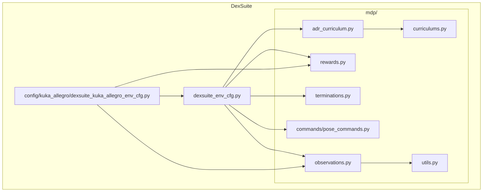
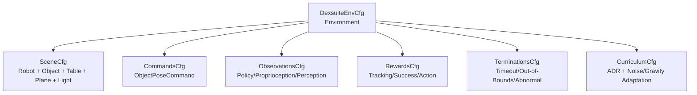
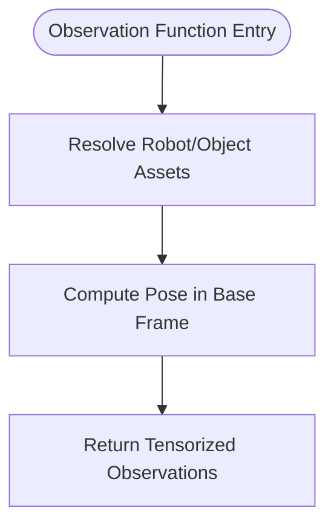
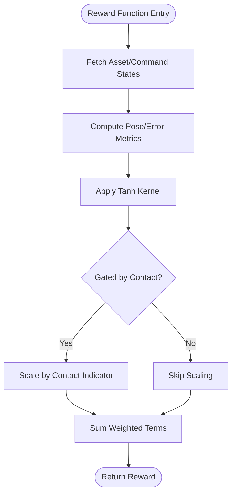
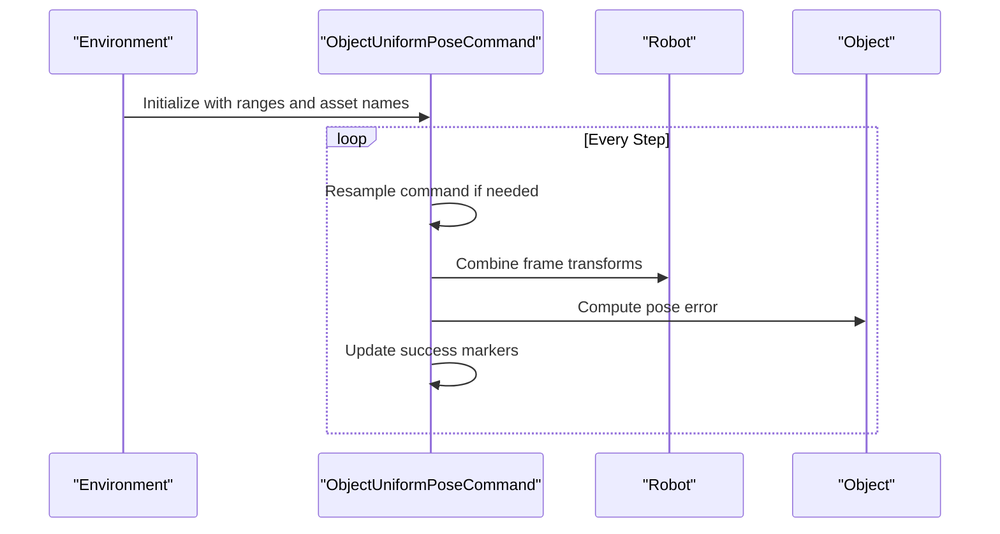
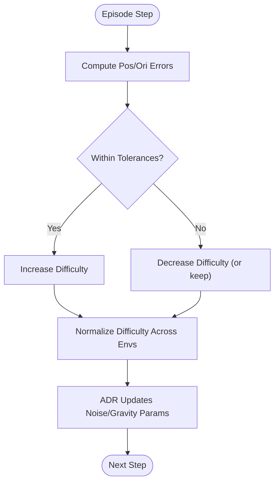
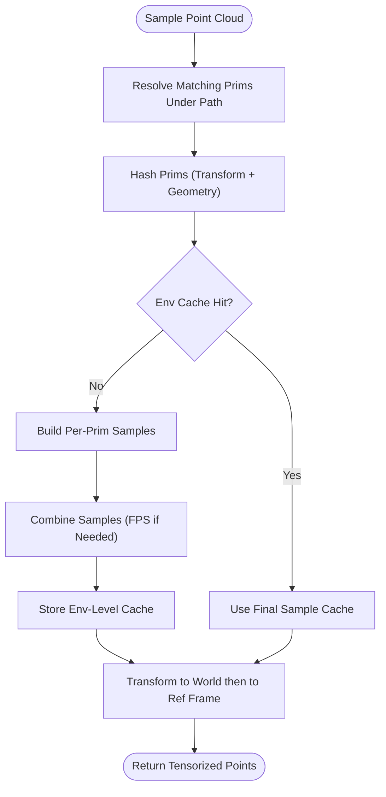
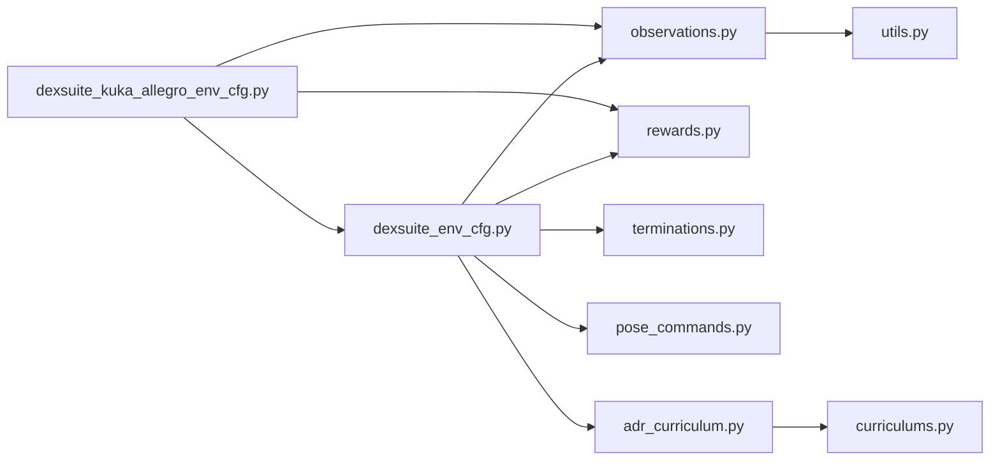

# DexSuite Dexterous Manipulation

<cite>
**Referenced Files in This Document**
- [README.md](file://README.md)
- [setup.py](file://source/robot_lab/setup.py)
- [dexsuite_env_cfg.py](file://source/robot_lab/robot_lab/tasks/manager_based/manipulation/dexsuite/dexsuite_env_cfg.py)
- [dexsuite_kuka_allegro_env_cfg.py](file://source/robot_lab/robot_lab/tasks/manager_based/manipulation/dexsuite/config/kuka_allegro/dexsuite_kuka_allegro_env_cfg.py)
- [observations.py](file://source/robot_lab/robot_lab/tasks/manager_based/manipulation/dexsuite/mdp/observations.py)
- [rewards.py](file://source/robot_lab/robot_lab/tasks/manager_based/manipulation/dexsuite/mdp/rewards.py)
- [terminations.py](file://source/robot_lab/robot_lab/tasks/manager_based/manipulation/dexsuite/mdp/terminations.py)
- [utils.py](file://source/robot_lab/robot_lab/tasks/manager_based/manipulation/dexsuite/mdp/utils.py)
- [adr_curriculum.py](file://source/robot_lab/robot_lab/tasks/manager_based/manipulation/dexsuite/adr_curriculum.py)
- [pose_commands.py](file://source/robot_lab/robot_lab/tasks/manager_based/manipulation/dexsuite/mdp/commands/pose_commands.py)
- [curriculums.py](file://source/robot_lab/robot_lab/tasks/manager_based/manipulation/dexsuite/mdp/curriculums.py)
</cite>

## Table of Contents
1. [Introduction](#introduction)
2. [Project Structure](#project-structure)
3. [Core Components](#core-components)
4. [Architecture Overview](#architecture-overview)
5. [Detailed Component Analysis](#detailed-component-analysis)
6. [Dependency Analysis](#dependency-analysis)
7. [Performance Considerations](#performance-considerations)
8. [Troubleshooting Guide](#troubleshooting-guide)
9. [Conclusion](#conclusion)

## Introduction
This document describes the DexSuite suite for dexterous manipulation within the robot_lab ecosystem. DexSuite focuses on high-precision manipulation tasks such as reorientation and lifting of arbitrary objects using articulated hands (notably the KUKA Allegro hand). It leverages the Manager-Based Reinforcement Learning framework provided by Isaac Lab to define environments, commands, observations, rewards, and curriculum-driven domain randomization. The suite supports both training and evaluation modes, with modular configurations for different robots and tasks.

## Project Structure
The DexSuite implementation resides under the manipulation tasks of robot_lab. The structure organizes:
- Environment configurations for DexSuite tasks
- Robot-specific mixins (e.g., KUKA Allegro)
- MDP modules for observations, rewards, terminations, commands, and curriculum
- Utilities for point cloud sampling and adaptive difficulty scheduling

**Diagram sources**
- [dexsuite_env_cfg.py:1-467](file://source/robot_lab/robot_lab/tasks/manager_based/manipulation/dexsuite/dexsuite_env_cfg.py#L1-L467)
- [dexsuite_kuka_allegro_env_cfg.py:1-80](file://source/robot_lab/robot_lab/tasks/manager_based/manipulation/dexsuite/config/kuka_allegro/dexsuite_kuka_allegro_env_cfg.py#L1-L80)
- [observations.py:1-198](file://source/robot_lab/robot_lab/tasks/manager_based/manipulation/dexsuite/mdp/observations.py#L1-L198)
- [rewards.py:1-127](file://source/robot_lab/robot_lab/tasks/manager_based/manipulation/dexsuite/mdp/rewards.py#L1-L127)
- [terminations.py:1-50](file://source/robot_lab/robot_lab/tasks/manager_based/manipulation/dexsuite/mdp/terminations.py#L1-L50)
- [utils.py:1-248](file://source/robot_lab/robot_lab/tasks/manager_based/manipulation/dexsuite/mdp/utils.py#L1-L248)
- [pose_commands.py:1-180](file://source/robot_lab/robot_lab/tasks/manager_based/manipulation/dexsuite/mdp/commands/pose_commands.py#L1-L180)
- [curriculums.py:1-114](file://source/robot_lab/robot_lab/tasks/manager_based/manipulation/dexsuite/mdp/curriculums.py#L1-L114)
- [adr_curriculum.py:1-123](file://source/robot_lab/robot_lab/tasks/manager_based/manipulation/dexsuite/adr_curriculum.py#L1-L123)

**Section sources**
- [README.md:1-531](file://README.md#L1-L531)
- [setup.py:1-54](file://source/robot_lab/setup.py#L1-L54)

## Core Components
- Environment configuration: Defines scene, commands, observations, rewards, terminations, and curriculum for DexSuite tasks.
- Robot mixin: Provides robot-specific action, observation, and reward overrides for KUKA Allegro.
- MDP modules:
  - Observations: Body states, object pose in base frame, point cloud sampling, and contact forces.
  - Rewards: Action penalties, proximity to object, position/orientation tracking, success reward, and contact quality.
  - Termination conditions: Out-of-bound and abnormal robot state checks.
  - Commands: Uniform pose command generator for object pose in robot base frame.
  - Curriculum: Adaptive difficulty scheduler and automatic/adaptive domain randomization (ADR) terms.
- Utilities: Point cloud sampling across USD primitives with caching and FPS downsampling.

**Section sources**
- [dexsuite_env_cfg.py:27-467](file://source/robot_lab/robot_lab/tasks/manager_based/manipulation/dexsuite/dexsuite_env_cfg.py#L27-L467)
- [dexsuite_kuka_allegro_env_cfg.py:18-80](file://source/robot_lab/robot_lab/tasks/manager_based/manipulation/dexsuite/config/kuka_allegro/dexsuite_kuka_allegro_env_cfg.py#L18-L80)
- [observations.py:21-198](file://source/robot_lab/robot_lab/tasks/manager_based/manipulation/dexsuite/mdp/observations.py#L21-L198)
- [rewards.py:21-127](file://source/robot_lab/robot_lab/tasks/manager_based/manipulation/dexsuite/mdp/rewards.py#L21-L127)
- [terminations.py:24-50](file://source/robot_lab/robot_lab/tasks/manager_based/manipulation/dexsuite/mdp/terminations.py#L24-L50)
- [pose_commands.py:26-180](file://source/robot_lab/robot_lab/tasks/manager_based/manipulation/dexsuite/mdp/commands/pose_commands.py#L26-L180)
- [adr_curriculum.py:12-123](file://source/robot_lab/robot_lab/tasks/manager_based/manipulation/dexsuite/adr_curriculum.py#L12-L123)
- [utils.py:28-248](file://source/robot_lab/robot_lab/tasks/manager_based/manipulation/dexsuite/mdp/utils.py#L28-L248)

## Architecture Overview
DexSuite composes a Manager-Based RL environment with:
- Scene: Robot, deformable or rigid object, table, ground plane, and lighting.
- Commands: Object pose command in robot base frame with uniform sampling and visualization.
- Observations: Proprioceptive body states, policy-level object pose, and perception-based point cloud.
- Rewards: Tracking, contact quality, action regularization, and success reward.
- Termination: Episode timeouts, out-of-bound, and abnormal robot state detection.
- Curriculum: ADR schedules difficulty and adapts noise and physics parameters per environment.

**Diagram sources**
- [dexsuite_env_cfg.py:27-467](file://source/robot_lab/robot_lab/tasks/manager_based/manipulation/dexsuite/dexsuite_env_cfg.py#L27-L467)
- [adr_curriculum.py:12-123](file://source/robot_lab/robot_lab/tasks/manager_based/manipulation/dexsuite/adr_curriculum.py#L12-L123)

## Detailed Component Analysis

### Environment Configuration
- Scene: Spawns multiple object shapes with varied sizes and masses, a kinematic table, and a ground plane. Lighting uses a dome light.
- Commands: Uniform sampling of object pose in robot base frame with configurable ranges and resampling intervals.
- Observations: Policy group includes object quaternion and target pose; proprioceptive group includes joint states and hand tip/body states; perception group samples object point cloud.
- Events: Domain randomization for object/table/robot physics, joint gains/friction, gravity curriculum, and resets.
- Rewards: Penalizes actions and rates, encourages proximity to object, tracks position/orientation, and provides success reward.
- Termination: Episode timeout, out-of-bound for object, and abnormal robot state detection.
- Curriculum: ADR scheduler and adaptive noise/gravity parameters.

**Section sources**
- [dexsuite_env_cfg.py:27-467](file://source/robot_lab/robot_lab/tasks/manager_based/manipulation/dexsuite/dexsuite_env_cfg.py#L27-L467)

### KUKA Allegro Robot Mixin
- Extends DexSuite base configuration for KUKA Allegro hand.
- Relative joint position action configuration.
- Finger contact sensors attached to finger tips; proprioceptive contact observation aggregates forces.
- Adjusts body state observations to include palm and finger tips; updates object-to-EE distance reward to consider palm and fingertips.

**Section sources**
- [dexsuite_kuka_allegro_env_cfg.py:18-80](file://source/robot_lab/robot_lab/tasks/manager_based/manipulation/dexsuite/config/kuka_allegro/dexsuite_kuka_allegro_env_cfg.py#L18-L80)

### Observations
- Object pose in base frame: Position and quaternion of object relative to robot root.
- Body state in base frame: Concatenated position, quaternion, linear and angular velocities for selected bodies.
- Object point cloud: Pre-sampled points transformed into reference asset’s root frame; supports visualization and flattening.
- Contact forces: Aggregates 3D forces from multiple contact sensors into base frame.

**Diagram sources**
- [observations.py:21-96](file://source/robot_lab/robot_lab/tasks/manager_based/manipulation/dexsuite/mdp/observations.py#L21-L96)

**Section sources**
- [observations.py:21-198](file://source/robot_lab/robot_lab/tasks/manager_based/manipulation/dexsuite/mdp/observations.py#L21-L198)

### Rewards
- Action penalties: L2 penalties on actions and action rates.
- Proximity to object: Tanh-based reward based on maximum end-effector-object distance.
- Tracking: Position and orientation tracking rewards using tanh kernels on error; gated by contact presence.
- Success reward: Combined position/orientation reward with tunable standard deviations.
- Contact quality: Boolean-like reward encouraging good finger-thumb contact.

**Diagram sources**
- [rewards.py:31-127](file://source/robot_lab/robot_lab/tasks/manager_based/manipulation/dexsuite/mdp/rewards.py#L31-L127)

**Section sources**
- [rewards.py:21-127](file://source/robot_lab/robot_lab/tasks/manager_based/manipulation/dexsuite/mdp/rewards.py#L21-L127)

### Termination Conditions
- Out-of-bound: Checks if object position exceeds configured ranges relative to environment origins.
- Abnormal robot state: Flags episodes when joint velocities exceed safe thresholds.

**Section sources**
- [terminations.py:24-50](file://source/robot_lab/robot_lab/tasks/manager_based/manipulation/dexsuite/mdp/terminations.py#L24-L50)

### Commands: Object Pose
- Uniform sampling of object pose in robot base frame with Euler angle ranges.
- Transforms commands to world frame for metrics and visualization.
- Supports success visualization on table and debug markers for goal/current pose.

**Diagram sources**
- [pose_commands.py:26-180](file://source/robot_lab/robot_lab/tasks/manager_based/manipulation/dexsuite/mdp/commands/pose_commands.py#L26-L180)

**Section sources**
- [pose_commands.py:26-180](file://source/robot_lab/robot_lab/tasks/manager_based/manipulation/dexsuite/mdp/commands/pose_commands.py#L26-L180)

### Curriculum and ADR
- Difficulty scheduler: Tracks per-environment difficulty and normalizes across environments; increases difficulty when error thresholds are met.
- ADR terms: Dynamically adjusts noise magnitudes for proprioceptive and perception observations, gravity, and joint parameters based on difficulty fraction.
- Interpolation function: Recursively interpolates nested structures (lists/tuples/scalars) between initial and final values.

**Diagram sources**
- [curriculums.py:55-114](file://source/robot_lab/robot_lab/tasks/manager_based/manipulation/dexsuite/mdp/curriculums.py#L55-L114)
- [adr_curriculum.py:12-123](file://source/robot_lab/robot_lab/tasks/manager_based/manipulation/dexsuite/adr_curriculum.py#L12-L123)

**Section sources**
- [curriculums.py:21-114](file://source/robot_lab/robot_lab/tasks/manager_based/manipulation/dexsuite/mdp/curriculums.py#L21-L114)
- [adr_curriculum.py:12-123](file://source/robot_lab/robot_lab/tasks/manager_based/manipulation/dexsuite/adr_curriculum.py#L12-L123)

### Point Cloud Sampling Utilities
- Collects USD prims under object prim path, hashes prim transforms and geometry, and caches per-prim and per-environment samples.
- Supports meshes and primitive types; performs farthest-point sampling (FPS) with memory-aware fallback.
- Applies root-scale and transforms points into world frame before converting to reference asset frame.

**Diagram sources**
- [utils.py:28-167](file://source/robot_lab/robot_lab/tasks/manager_based/manipulation/dexsuite/mdp/utils.py#L28-L167)

**Section sources**
- [utils.py:28-248](file://source/robot_lab/robot_lab/tasks/manager_based/manipulation/dexsuite/mdp/utils.py#L28-L248)

## Dependency Analysis
- Environment configuration depends on MDP modules for observations, rewards, terminations, commands, and curriculum.
- Robot mixin composes base DexSuite configuration and augments it with robot-specific assets and sensors.
- Curriculum relies on difficulty scheduler and modifies environment parameters via modify-term callbacks.
- Observations depend on point cloud utilities for perception and on asset states for body states and contacts.

**Diagram sources**
- [dexsuite_env_cfg.py:23-24](file://source/robot_lab/robot_lab/tasks/manager_based/manipulation/dexsuite/dexsuite_env_cfg.py#L23-L24)
- [dexsuite_kuka_allegro_env_cfg.py:14-15](file://source/robot_lab/robot_lab/tasks/manager_based/manipulation/dexsuite/config/kuka_allegro/dexsuite_kuka_allegro_env_cfg.py#L14-L15)
- [observations.py:15-18](file://source/robot_lab/robot_lab/tasks/manager_based/manipulation/dexsuite/mdp/observations.py#L15-L18)
- [rewards.py:17-18](file://source/robot_lab/robot_lab/tasks/manager_based/manipulation/dexsuite/mdp/rewards.py#L17-L18)
- [terminations.py:20-21](file://source/robot_lab/robot_lab/tasks/manager_based/manipulation/dexsuite/mdp/terminations.py#L20-L21)
- [pose_commands.py:20-23](file://source/robot_lab/robot_lab/tasks/manager_based/manipulation/dexsuite/mdp/commands/pose_commands.py#L20-L23)
- [adr_curriculum.py:6-9](file://source/robot_lab/robot_lab/tasks/manager_based/manipulation/dexsuite/adr_curriculum.py#L6-L9)
- [curriculums.py:12-18](file://source/robot_lab/robot_lab/tasks/manager_based/manipulation/dexsuite/mdp/curriculums.py#L12-L18)
- [utils.py:13-16](file://source/robot_lab/robot_lab/tasks/manager_based/manipulation/dexsuite/mdp/utils.py#L13-L16)

**Section sources**
- [dexsuite_env_cfg.py:23-24](file://source/robot_lab/robot_lab/tasks/manager_based/manipulation/dexsuite/dexsuite_env_cfg.py#L23-L24)
- [dexsuite_kuka_allegro_env_cfg.py:14-15](file://source/robot_lab/robot_lab/tasks/manager_based/manipulation/dexsuite/config/kuka_allegro/dexsuite_kuka_allegro_env_cfg.py#L14-L15)

## Performance Considerations
- Simulation fidelity vs. speed: The environment uses a 120 Hz simulation step with PhysX tuned parameters; adjust decimation and GPU patch count for performance.
- Observation throughput: Point cloud sampling caches per-prim and per-environment samples; ensure adequate memory for FPS computations.
- Contact sensing: Contact sensors are attached to finger tips; excessive sensor overhead can be mitigated by tuning sensor frequency and filtering.
- Curriculum adaptation: ADR updates can increase noise and gravity gradually; monitor training stability and reduce increments if needed.

[No sources needed since this section provides general guidance]

## Troubleshooting Guide
- Abnormal robot state termination: Indicates joint velocity limits exceeded; review action scaling and curriculum difficulty.
- Out-of-bound episodes: Adjust in-bound ranges or spawn regions to prevent frequent terminations.
- Contact sensor issues: Verify sensor prim paths match finger tip bodies and that collision meshes are properly defined.
- Point cloud sampling failures: Ensure object prim paths resolve to valid USD prims and that geometry attributes are present.

**Section sources**
- [terminations.py:45-50](file://source/robot_lab/robot_lab/tasks/manager_based/manipulation/dexsuite/mdp/terminations.py#L45-L50)
- [dexsuite_env_cfg.py:378-386](file://source/robot_lab/robot_lab/tasks/manager_based/manipulation/dexsuite/dexsuite_env_cfg.py#L378-L386)
- [dexsuite_kuka_allegro_env_cfg.py:43-52](file://source/robot_lab/robot_lab/tasks/manager_based/manipulation/dexsuite/config/kuka_allegro/dexsuite_kuka_allegro_env_cfg.py#L43-L52)
- [utils.py:48-53](file://source/robot_lab/robot_lab/tasks/manager_based/manipulation/dexsuite/mdp/utils.py#L48-L53)

## Conclusion
DexSuite provides a robust, modular framework for dexterous manipulation tasks in Isaac Lab. Its Manager-Based design cleanly separates environment configuration, robot mixins, and MDP components, enabling rapid experimentation with different robots and tasks. The combination of precise commands, rich observations, structured rewards, and adaptive curriculum yields strong generalization and efficient learning for complex manipulation skills.