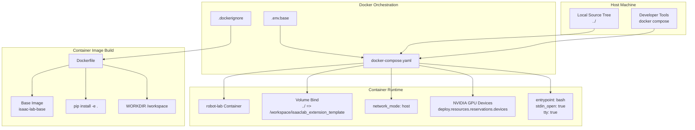
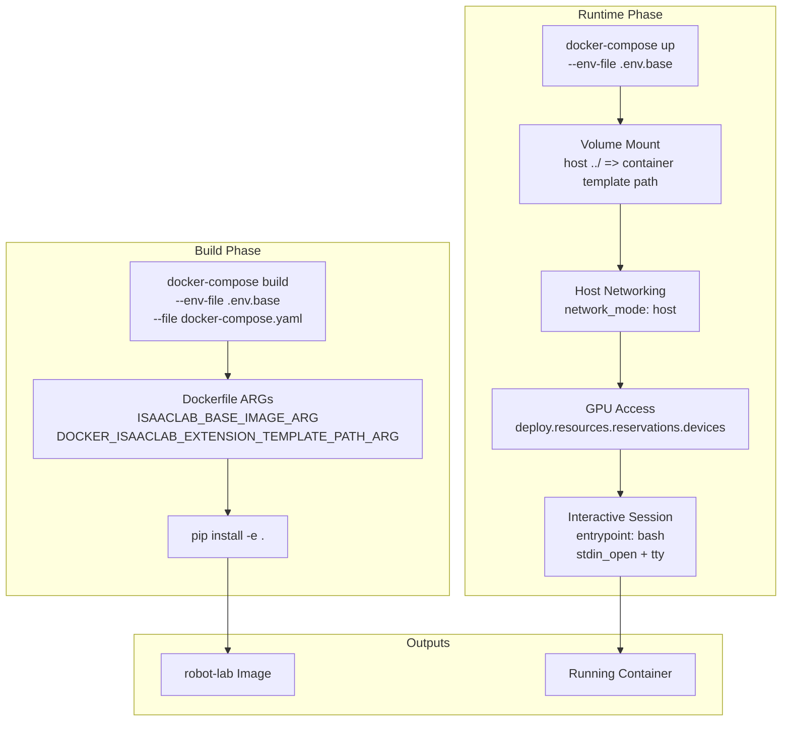
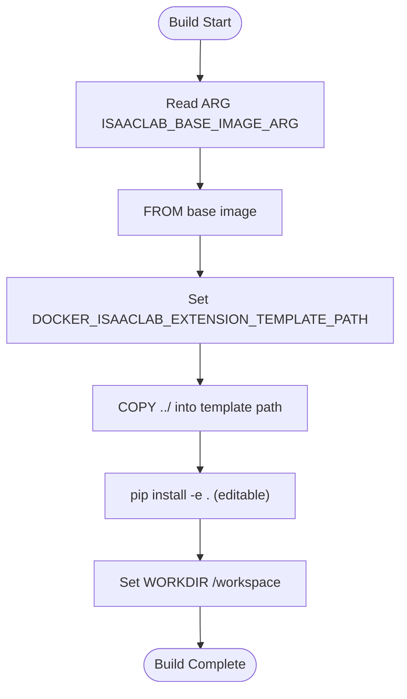
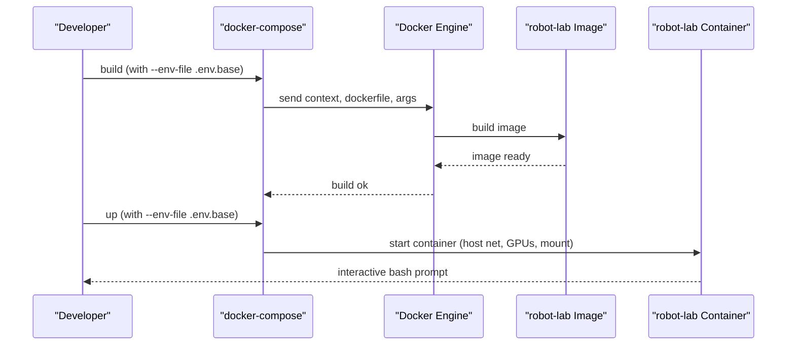
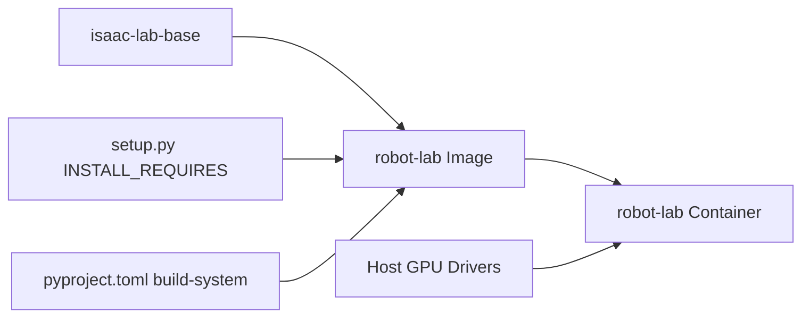

# Docker Deployment

<cite>
**Referenced Files in This Document**
- [Dockerfile](file://docker/Dockerfile)
- [docker-compose.yaml](file://docker/docker-compose.yaml)
- [.env.base](file://docker/.env.base)
- [.dockerignore](file://.dockerignore)
- [README.md](file://README.md)
- [setup.py](file://source/robot_lab/setup.py)
- [pyproject.toml](file://source/robot_lab/pyproject.toml)
</cite>

## Table of Contents
1. [Introduction](#introduction)
2. [Project Structure](#project-structure)
3. [Core Components](#core-components)
4. [Architecture Overview](#architecture-overview)
5. [Detailed Component Analysis](#detailed-component-analysis)
6. [Dependency Analysis](#dependency-analysis)
7. [Performance Considerations](#performance-considerations)
8. [Troubleshooting Guide](#troubleshooting-guide)
9. [Conclusion](#conclusion)

## Introduction
This section documents the Docker deployment for containerized development and production environments. It explains how the repository orchestrates a development container using docker-compose.yaml, how the Dockerfile builds the runtime image, and how environment variables are managed via .env.base. It also covers interactive development, debugging, distributed training across multiple GPUs and nodes, and troubleshooting common container issues such as GPU access, networking, and headless rendering.

## Project Structure
The Docker deployment is centered around three primary files:
- docker/Dockerfile: Defines the container image build process.
- docker/docker-compose.yaml: Orchestrates the container service, mounts source code, and exposes GPU devices.
- docker/.env.base: Provides environment variables consumed by docker-compose.yaml.

The repository also includes a .dockerignore file to avoid copying unnecessary artifacts into the image, and the README.md provides end-to-end commands for building, running, and interacting with the container.

**Diagram sources**
- [docker-compose.yaml](file://docker/docker-compose.yaml#L15-L36)
- [Dockerfile](file://docker/Dockerfile#L1-L22)
- [.dockerignore](file://.dockerignore#L1-L24)
- [.env.base](file://docker/.env.base#L1-L9)

**Section sources**
- [docker-compose.yaml](file://docker/docker-compose.yaml#L1-L37)
- [Dockerfile](file://docker/Dockerfile#L1-L22)
- [.env.base](file://docker/.env.base#L1-L9)
- [.dockerignore](file://.dockerignore#L1-L24)
- [README.md](file://README.md#L113-L191)

## Core Components
- Dockerfile
  - Uses an ARG for the base image and sets an environment variable for the container’s extension template path.
  - Copies the project source tree into the container at the specified path.
  - Installs the project in editable mode using pip within a sourced shell session.
  - Sets the working directory to /workspace.
  - Reference: [Dockerfile](file://docker/Dockerfile#L1-L22)

- docker-compose.yaml
  - Loads environment variables from .env.base.
  - Builds the image with two build args: ISAACLAB_BASE_IMAGE_ARG and DOCKER_ISAACLAB_EXTENSION_TEMPLATE_PATH_ARG.
  - Mounts the host source tree into the container at the template path.
  - Configures host networking and grants access to all NVIDIA GPUs.
  - Starts an interactive bash session by default.
  - Reference: [docker-compose.yaml](file://docker/docker-compose.yaml#L15-L36)

- .env.base
  - Defines the base image name and the container-side path for the extension template.
  - Reference: [.env.base](file://docker/.env.base#L5-L8)

- .dockerignore
  - Excludes large or irrelevant directories and files from being copied into the image, reducing build time and image size.
  - Reference: [.dockerignore](file://.dockerignore#L1-L24)

- README.md
  - Provides end-to-end commands for building, running, attaching, and shutting down the container.
  - Includes guidance for distributed training across multiple GPUs and nodes.
  - Reference: [README.md](file://README.md#L113-L191), [README.md](file://README.md#L333-L347)

**Section sources**
- [Dockerfile](file://docker/Dockerfile#L1-L22)
- [docker-compose.yaml](file://docker/docker-compose.yaml#L15-L36)
- [.env.base](file://docker/.env.base#L5-L8)
- [.dockerignore](file://.dockerignore#L1-L24)
- [README.md](file://README.md#L113-L191)
- [README.md](file://README.md#L333-L347)

## Architecture Overview
The container architecture integrates the Isaac Lab base image with the project’s Python package, exposing GPU devices and host networking for seamless simulation and training.

**Diagram sources**
- [docker-compose.yaml](file://docker/docker-compose.yaml#L17-L36)
- [Dockerfile](file://docker/Dockerfile#L1-L22)
- [.env.base](file://docker/.env.base#L5-L8)

## Detailed Component Analysis

### Dockerfile Analysis
The Dockerfile defines a single-stage build that:
- Accepts an ARG for the base image.
- Copies the project source tree into the container at a configurable path.
- Installs the project in editable mode using pip after sourcing the shell profile.
- Sets the working directory to /workspace.

**Diagram sources**
- [Dockerfile](file://docker/Dockerfile#L1-L22)

**Section sources**
- [Dockerfile](file://docker/Dockerfile#L1-L22)

### docker-compose.yaml Analysis
The docker-compose service robot-lab:
- Loads environment variables from .env.base.
- Builds the image with two build args passed from .env.base.
- Mounts the host source tree into the container at the template path.
- Uses host networking for low-latency communication and device passthrough.
- Reserves all NVIDIA GPUs for the container.
- Starts an interactive bash session with stdio attached.

**Diagram sources**
- [docker-compose.yaml](file://docker/docker-compose.yaml#L17-L36)
- [.env.base](file://docker/.env.base#L5-L8)

**Section sources**
- [docker-compose.yaml](file://docker/docker-compose.yaml#L15-L36)
- [.env.base](file://docker/.env.base#L5-L8)

### Environment Variable Management (.env.base)
- ISAACLAB_BASE_IMAGE: Specifies the base image tag used for the build.
- DOCKER_ISAACLAB_EXTENSION_TEMPLATE_PATH: Defines the path inside the container where the project source is copied and mounted.
- docker-compose.yaml loads these variables via env_file and passes them as build args.

Practical usage examples:
- Build command: [README.md](file://README.md#L140-L143)
- Run command: [README.md](file://README.md#L159-L171)
- Attach to container: [README.md](file://README.md#L175-L179)

**Section sources**
- [.env.base](file://docker/.env.base#L5-L8)
- [docker-compose.yaml](file://docker/docker-compose.yaml#L17-L23)
- [README.md](file://README.md#L140-L179)

### Volume Mounting Strategy
- The host directory ../ is bind-mounted into the container at the template path.
- This enables live editing on the host while running simulations and training inside the container.
- The mount target is controlled by DOCKER_ISAACLAB_EXTENSION_TEMPLATE_PATH.

References:
- Mount definition: [docker-compose.yaml](file://docker/docker-compose.yaml#L26-L29)
- Path variable: [.env.base](file://docker/.env.base#L7-L8)

**Section sources**
- [docker-compose.yaml](file://docker/docker-compose.yaml#L26-L29)
- [.env.base](file://docker/.env.base#L7-L8)

### Multi-stage Build Considerations
- Current Dockerfile is a single stage that installs the project in editable mode.
- If optimizing for production images, consider adding a dedicated runtime stage to reduce image size and attack surface. This would involve:
  - Installing only runtime dependencies in the final stage.
  - Copying built artifacts and the installed package without dev tools.
  - Keeping the template path mount for source code in development mode.

[No sources needed since this section provides general guidance]

### GPU-Accelerated Training Support
- docker-compose.yaml reserves all NVIDIA GPUs for the container.
- Distributed training across multiple GPUs on a single machine is documented in README.md.
- Multi-node distributed training is also documented in README.md.

References:
- GPU reservation: [docker-compose.yaml](file://docker/docker-compose.yaml#L7-L13)
- Single-machine multi-GPU: [README.md](file://README.md#L333-L336)
- Multi-node training: [README.md](file://README.md#L339-L347)

**Section sources**
- [docker-compose.yaml](file://docker/docker-compose.yaml#L7-L13)
- [README.md](file://README.md#L333-L347)

### Development Workflow Inside Containers
- Interactive sessions: The container starts bash with stdio attached.
- Attaching to a running container: Use docker exec with DISPLAY forwarding for GUI apps.
- Running experiments: Use the training and playback scripts under scripts/reinforcement_learning.

References:
- Interactive entrypoint: [docker-compose.yaml](file://docker/docker-compose.yaml#L33-L36)
- Attach command: [README.md](file://README.md#L175-L179)
- Experiment commands: [README.md](file://README.md#L195-L235)

**Section sources**
- [docker-compose.yaml](file://docker/docker-compose.yaml#L33-L36)
- [README.md](file://README.md#L175-L179)
- [README.md](file://README.md#L195-L235)

### Distributed Training Across Nodes
- The README demonstrates launching distributed training with torch.distributed.run across multiple GPUs on one node and across multiple nodes.
- Ensure network connectivity and port availability when launching non-master nodes.

References:
- Single-node multi-GPU: [README.md](file://README.md#L333-L336)
- Multi-node setup: [README.md](file://README.md#L339-L347)

**Section sources**
- [README.md](file://README.md#L333-L347)

## Dependency Analysis
The container depends on:
- The base image named by ISAACLAB_BASE_IMAGE.
- The project’s Python package metadata and dependencies defined in setup.py and pyproject.toml.
- Host GPU drivers and NVIDIA Container Toolkit for GPU access.

**Diagram sources**
- [.env.base](file://docker/.env.base#L6-L6)
- [setup.py](file://source/robot_lab/setup.py#L16-L28)
- [pyproject.toml](file://source/robot_lab/pyproject.toml#L1-L4)
- [docker-compose.yaml](file://docker/docker-compose.yaml#L11-L13)

**Section sources**
- [.env.base](file://docker/.env.base#L6-L6)
- [setup.py](file://source/robot_lab/setup.py#L16-L28)
- [pyproject.toml](file://source/robot_lab/pyproject.toml#L1-L4)
- [docker-compose.yaml](file://docker/docker-compose.yaml#L11-L13)

## Performance Considerations
- Keep the image small: Use .dockerignore to exclude logs, outputs, videos, and caches.
- Prefer host networking for lower latency and easier device access.
- Use bind mounts for rapid iteration; avoid copying large binaries into the image.
- For production images, consider a multi-stage build to minimize size and improve security.

**Section sources**
- [.dockerignore](file://.dockerignore#L1-L24)
- [docker-compose.yaml](file://docker/docker-compose.yaml#L30-L30)

## Troubleshooting Guide
Common issues and resolutions:
- GPU not found or permission denied
  - Ensure the NVIDIA Container Toolkit is installed and the container has access to GPUs via deploy.resources.reservations.devices.
  - Reference: [docker-compose.yaml](file://docker/docker-compose.yaml#L7-L13)

- Headless rendering problems
  - Use --headless flags for training scripts as documented in README.md.
  - References: [README.md](file://README.md#L195-L235), [README.md](file://README.md#L333-L336)

- Network configuration
  - The service uses host networking; verify host networking is permitted and ports are free if needed.
  - Reference: [docker-compose.yaml](file://docker/docker-compose.yaml#L30-L30)

- Display rendering in containers
  - Forward DISPLAY to the container when attaching for GUI-dependent tasks.
  - Reference: [README.md](file://README.md#L175-L179)

- Stopping and restarting
  - Use docker compose down to stop/remove containers cleanly.
  - Reference: [README.md](file://README.md#L181-L189)

**Section sources**
- [docker-compose.yaml](file://docker/docker-compose.yaml#L7-L13)
- [docker-compose.yaml](file://docker/docker-compose.yaml#L30-L30)
- [README.md](file://README.md#L175-L179)
- [README.md](file://README.md#L181-L189)
- [README.md](file://README.md#L195-L235)
- [README.md](file://README.md#L333-L336)

## Conclusion
The Docker deployment provides a reproducible, GPU-enabled environment for developing and training robotic RL applications. The docker-compose service binds the source tree, exposes GPUs, and starts an interactive bash session. Environment variables from .env.base drive the build and runtime configuration. The README outlines practical commands for building, running, attaching, and scaling training across GPUs and nodes. Following the troubleshooting tips ensures smooth development and production workflows.