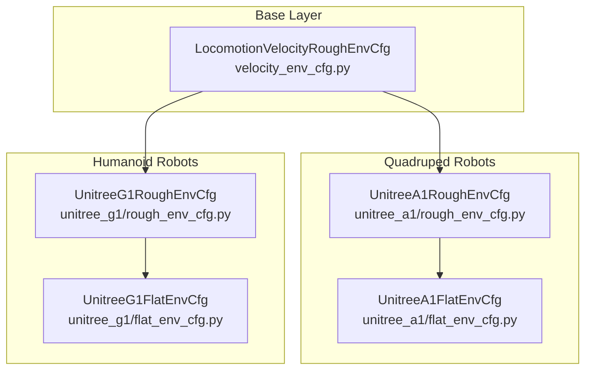
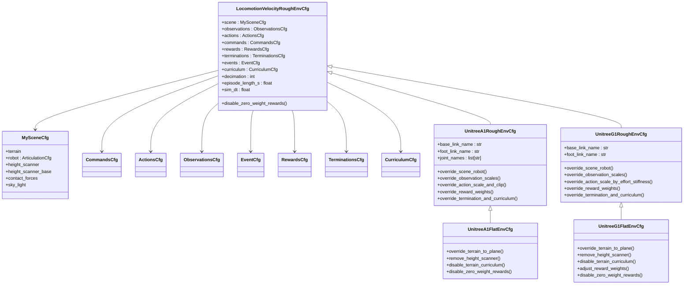
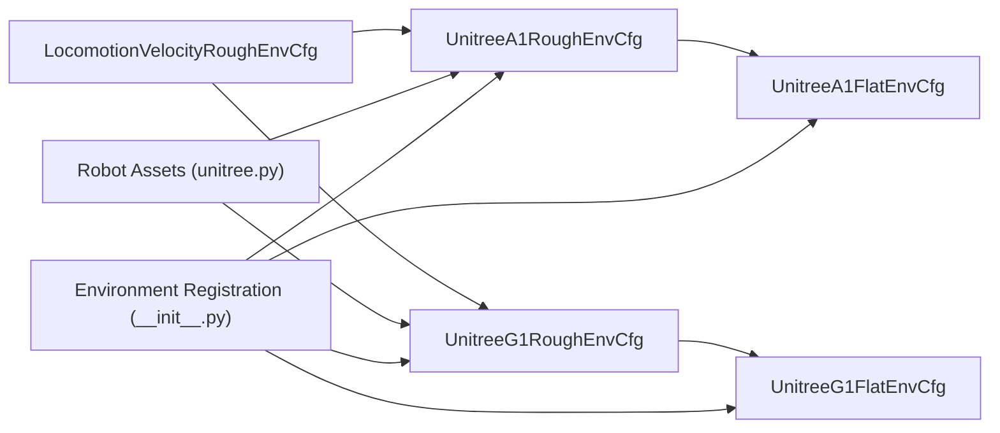

# Configuration Hierarchy

<cite>
**Referenced Files in This Document**
- [velocity_env_cfg.py](file://source/robot_lab/robot_lab/tasks/manager_based/locomotion/velocity/velocity_env_cfg.py)
- [unitree_a1_flat_env_cfg.py](file://source/robot_lab/robot_lab/tasks/manager_based/locomotion/velocity/config/quadruped/unitree_a1/flat_env_cfg.py)
- [unitree_a1_rough_env_cfg.py](file://source/robot_lab/robot_lab/tasks/manager_based/locomotion/velocity/config/quadruped/unitree_a1/rough_env_cfg.py)
- [unitree_a1_init.py](file://source/robot_lab/robot_lab/tasks/manager_based/locomotion/velocity/config/quadruped/unitree_a1/__init__.py)
- [unitree_g1_flat_env_cfg.py](file://source/robot_lab/robot_lab/tasks/manager_based/locomotion/velocity/config/humanoid/unitree_g1/flat_env_cfg.py)
- [unitree_g1_rough_env_cfg.py](file://source/robot_lab/robot_lab/tasks/manager_based/locomotion/velocity/config/humanoid/unitree_g1/rough_env_cfg.py)
- [unitree.py](file://source/robot_lab/robot_lab/assets/unitree.py)
- [README.md](file://README.md)
</cite>

## Table of Contents
1. [Introduction](#introduction)
2. [Project Structure](#project-structure)
3. [Core Components](#core-components)
4. [Architecture Overview](#architecture-overview)
5. [Detailed Component Analysis](#detailed-component-analysis)
6. [Dependency Analysis](#dependency-analysis)
7. [Performance Considerations](#performance-considerations)
8. [Troubleshooting Guide](#troubleshooting-guide)
9. [Conclusion](#conclusion)

## Introduction
This document explains the configuration hierarchy system used in the repository’s locomotion velocity-tracking environments. The system is class-based and leverages the configclass decorator to define structured, composable configurations. At the center is a base environment configuration that defines shared scene, MDP settings, and environment-wide parameters. Specific robots and terrains extend this base to specialize assets, actions, observations, rewards, and curriculum behavior. The document covers inheritance patterns, parameter overriding, composition strategies, validation, precedence rules, and practical guidance for creating new configurations.

## Project Structure
The configuration hierarchy is organized around a base environment configuration and per-robot/per-terrain overrides. The base configuration resides under the velocity task module, while robot-specific configurations live under dedicated folders. Each robot folder contains both flat and rough terrain variants, each inheriting from a common rough variant that itself inherits from the base.

**Diagram sources**
- [velocity_env_cfg.py](file://source/robot_lab/robot_lab/tasks/manager_based/locomotion/velocity/velocity_env_cfg.py#L696-L744)
- [unitree_a1_rough_env_cfg.py](file://source/robot_lab/robot_lab/tasks/manager_based/locomotion/velocity/config/quadruped/unitree_a1/rough_env_cfg.py#L18-L160)
- [unitree_a1_flat_env_cfg.py](file://source/robot_lab/robot_lab/tasks/manager_based/locomotion/velocity/config/quadruped/unitree_a1/flat_env_cfg.py#L10-L30)
- [unitree_g1_rough_env_cfg.py](file://source/robot_lab/robot_lab/tasks/manager_based/locomotion/velocity/config/humanoid/unitree_g1/rough_env_cfg.py#L16-L168)
- [unitree_g1_flat_env_cfg.py](file://source/robot_lab/robot_lab/tasks/manager_based/locomotion/velocity/config/humanoid/unitree_g1/flat_env_cfg.py#L10-L38)

**Section sources**
- [README.md](file://README.md#L383-L400)

## Core Components
The configuration system centers on several key classes that define the environment’s structure and behavior. Each class is decorated with configclass to enable structured configuration composition and runtime validation.

- MySceneCfg: Defines the interactive scene including terrain, robot asset, sensors (height scanners, contact forces), and lighting.
- CommandsCfg: Specifies the command distribution and control parameters for velocity tracking.
- ActionsCfg: Defines action specification for joint position control.
- ObservationsCfg: Groups observations for policy and critic networks, including base dynamics, commands, joint states, and height scans.
- EventCfg: Specifies randomized events during startup, reset, and intervals to improve robustness and generalization.
- RewardsCfg: Encapsulates reward terms for stability, tracking, contact, and other locomotion objectives.
- TerminationsCfg: Defines termination conditions such as time limits and illegal contacts.
- CurriculumCfg: Controls curriculum progression for terrain levels and command ranges.
- LocomotionVelocityRoughEnvCfg: The base environment configuration that aggregates scene, MDP settings, and simulation parameters.

These components are composed into environment-specific classes that inherit from the base and override selected attributes to tailor behavior for specific robots and terrains.

**Section sources**
- [velocity_env_cfg.py](file://source/robot_lab/robot_lab/tasks/manager_based/locomotion/velocity/velocity_env_cfg.py#L42-L95)
- [velocity_env_cfg.py](file://source/robot_lab/robot_lab/tasks/manager_based/locomotion/velocity/velocity_env_cfg.py#L102-L127)
- [velocity_env_cfg.py](file://source/robot_lab/robot_lab/tasks/manager_based/locomotion/velocity/velocity_env_cfg.py#L129-L255)
- [velocity_env_cfg.py](file://source/robot_lab/robot_lab/tasks/manager_based/locomotion/velocity/velocity_env_cfg.py#L258-L372)
- [velocity_env_cfg.py](file://source/robot_lab/robot_lab/tasks/manager_based/locomotion/velocity/velocity_env_cfg.py#L375-L646)
- [velocity_env_cfg.py](file://source/robot_lab/robot_lab/tasks/manager_based/locomotion/velocity/velocity_env_cfg.py#L648-L665)
- [velocity_env_cfg.py](file://source/robot_lab/robot_lab/tasks/manager_based/locomotion/velocity/velocity_env_cfg.py#L668-L687)
- [velocity_env_cfg.py](file://source/robot_lab/robot_lab/tasks/manager_based/locomotion/velocity/velocity_env_cfg.py#L696-L744)

## Architecture Overview
The configuration architecture is layered and hierarchical. The base environment configuration defines defaults for scene, MDP terms, and simulation parameters. Robot-specific configurations inherit from the base and override attributes to adapt to robot geometry, actuator limits, and locomotion objectives. Terrain-specific variants further refine behavior (e.g., flat vs. rough) by adjusting sensors, rewards, and curriculum.

**Diagram sources**
- [velocity_env_cfg.py](file://source/robot_lab/robot_lab/tasks/manager_based/locomotion/velocity/velocity_env_cfg.py#L42-L95)
- [velocity_env_cfg.py](file://source/robot_lab/robot_lab/tasks/manager_based/locomotion/velocity/velocity_env_cfg.py#L102-L127)
- [velocity_env_cfg.py](file://source/robot_lab/robot_lab/tasks/manager_based/locomotion/velocity/velocity_env_cfg.py#L129-L255)
- [velocity_env_cfg.py](file://source/robot_lab/robot_lab/tasks/manager_based/locomotion/velocity/velocity_env_cfg.py#L258-L372)
- [velocity_env_cfg.py](file://source/robot_lab/robot_lab/tasks/manager_based/locomotion/velocity/velocity_env_cfg.py#L375-L646)
- [velocity_env_cfg.py](file://source/robot_lab/robot_lab/tasks/manager_based/locomotion/velocity/velocity_env_cfg.py#L648-L665)
- [velocity_env_cfg.py](file://source/robot_lab/robot_lab/tasks/manager_based/locomotion/velocity/velocity_env_cfg.py#L668-L687)
- [velocity_env_cfg.py](file://source/robot_lab/robot_lab/tasks/manager_based/locomotion/velocity/velocity_env_cfg.py#L696-L744)
- [unitree_a1_rough_env_cfg.py](file://source/robot_lab/robot_lab/tasks/manager_based/locomotion/velocity/config/quadruped/unitree_a1/rough_env_cfg.py#L18-L160)
- [unitree_a1_flat_env_cfg.py](file://source/robot_lab/robot_lab/tasks/manager_based/locomotion/velocity/config/quadruped/unitree_a1/flat_env_cfg.py#L10-L30)
- [unitree_g1_rough_env_cfg.py](file://source/robot_lab/robot_lab/tasks/manager_based/locomotion/velocity/config/humanoid/unitree_g1/rough_env_cfg.py#L16-L168)
- [unitree_g1_flat_env_cfg.py](file://source/robot_lab/robot_lab/tasks/manager_based/locomotion/velocity/config/humanoid/unitree_g1/flat_env_cfg.py#L10-L38)

## Detailed Component Analysis

### Base Environment Configuration
The base environment configuration defines the foundational structure for all tasks. It sets up the scene with terrain and robot assets, registers sensors, and establishes simulation parameters. It also defines the MDP components (commands, actions, observations, events, rewards, terminations, curriculum) and applies global simulation settings.

Key behaviors:
- Scene setup with terrain, robot asset, height scanners, contact sensors, and lighting.
- Simulation parameters such as decimation, episode length, and physics timestep.
- Sensor update periods derived from decimation and simulation timestep.
- Optional terrain curriculum activation based on curriculum configuration presence.

Validation and cleanup:
- A method disables zero-weight reward terms by setting them to None, reducing overhead.

**Section sources**
- [velocity_env_cfg.py](file://source/robot_lab/robot_lab/tasks/manager_based/locomotion/velocity/velocity_env_cfg.py#L42-L95)
- [velocity_env_cfg.py](file://source/robot_lab/robot_lab/tasks/manager_based/locomotion/velocity/velocity_env_cfg.py#L696-L744)

### Quadruped Unitree A1 Configurations
Unitree A1 configurations demonstrate a two-tier specialization:
- Rough variant inherits from the base and customizes robot asset, joint names, observation scales, action scaling, event parameters, reward weights, termination, and curriculum.
- Flat variant inherits from the rough variant and overrides terrain to a plane, removes height scanner, and disables terrain curriculum. It also selectively adjusts reward weights and triggers zero-weight cleanup.

Override mechanisms:
- Robot asset replacement via a predefined asset configuration.
- Observation term scales adjusted per policy/critic groups.
- Action scaling and clipping tailored to joint categories.
- Reward weights tuned for stability and locomotion objectives.
- Termination and curriculum adjustments to fit the task.

**Section sources**
- [unitree_a1_rough_env_cfg.py](file://source/robot_lab/robot_lab/tasks/manager_based/locomotion/velocity/config/quadruped/unitree_a1/rough_env_cfg.py#L18-L160)
- [unitree_a1_flat_env_cfg.py](file://source/robot_lab/robot_lab/tasks/manager_based/locomotion/velocity/config/quadruped/unitree_a1/flat_env_cfg.py#L10-L30)
- [unitree.py](file://source/robot_lab/robot_lab/assets/unitree.py#L19-L65)

### Humanoid Unitree G1 Configurations
Unitree G1 configurations follow the same inheritance pattern:
- Rough variant inherits from the base and customizes robot asset, observation scales, action scaling based on effort/stiffness ratios, reward weights, termination, and curriculum.
- Flat variant mirrors the rough variant by switching terrain to a plane, removing height scanner, disabling terrain curriculum, and adjusting reward weights.

Override mechanisms:
- Robot asset selection from a predefined humanoid configuration.
- Action scaling computed from actuator effort limits and stiffness.
- Reward weights adapted for bipedal locomotion objectives.
- Termination and curriculum adjustments.

**Section sources**
- [unitree_g1_rough_env_cfg.py](file://source/robot_lab/robot_lab/tasks/manager_based/locomotion/velocity/config/humanoid/unitree_g1/rough_env_cfg.py#L16-L168)
- [unitree_g1_flat_env_cfg.py](file://source/robot_lab/robot_lab/tasks/manager_based/locomotion/velocity/config/humanoid/unitree_g1/flat_env_cfg.py#L10-L38)
- [unitree.py](file://source/robot_lab/robot_lab/assets/unitree.py#L466-L637)

### Environment Registration and Composition
Environment registration ties together configuration classes with agent runner configurations. The registration maps environment identifiers to specific configuration classes and agent configurations, enabling consistent instantiation of flat and rough variants for each robot.

**Section sources**
- [unitree_a1_init.py](file://source/robot_lab/robot_lab/tasks/manager_based/locomotion/velocity/config/quadruped/unitree_a1/__init__.py#L12-L32)

## Dependency Analysis
The configuration hierarchy exhibits clear dependency relationships:
- Base environment depends on shared MDP components and scene definitions.
- Robot-specific configurations depend on the base and asset definitions.
- Terrain-specific configurations depend on robot-specific configurations.
- Environment registration depends on both configuration classes and agent configurations.

**Diagram sources**
- [velocity_env_cfg.py](file://source/robot_lab/robot_lab/tasks/manager_based/locomotion/velocity/velocity_env_cfg.py#L696-L744)
- [unitree_a1_rough_env_cfg.py](file://source/robot_lab/robot_lab/tasks/manager_based/locomotion/velocity/config/quadruped/unitree_a1/rough_env_cfg.py#L18-L160)
- [unitree_a1_flat_env_cfg.py](file://source/robot_lab/robot_lab/tasks/manager_based/locomotion/velocity/config/quadruped/unitree_a1/flat_env_cfg.py#L10-L30)
- [unitree_g1_rough_env_cfg.py](file://source/robot_lab/robot_lab/tasks/manager_based/locomotion/velocity/config/humanoid/unitree_g1/rough_env_cfg.py#L16-L168)
- [unitree_g1_flat_env_cfg.py](file://source/robot_lab/robot_lab/tasks/manager_based/locomotion/velocity/config/humanoid/unitree_g1/flat_env_cfg.py#L10-L38)
- [unitree.py](file://source/robot_lab/robot_lab/assets/unitree.py#L19-L65)
- [unitree_a1_init.py](file://source/robot_lab/robot_lab/tasks/manager_based/locomotion/velocity/config/quadruped/unitree_a1/__init__.py#L12-L32)

**Section sources**
- [unitree_a1_init.py](file://source/robot_lab/robot_lab/tasks/manager_based/locomotion/velocity/config/quadruped/unitree_a1/__init__.py#L12-L32)

## Performance Considerations
- Sensor update periods are aligned with simulation timestep and decimation to minimize redundant computations.
- Zero-weight reward pruning reduces computational overhead by excluding inactive reward terms.
- Action scaling and clipping are tailored per robot to maintain numerical stability and control feasibility.
- Curriculum-driven terrain generation improves training efficiency by progressively increasing difficulty.

[No sources needed since this section provides general guidance]

## Troubleshooting Guide
Common configuration errors and remedies:
- Incorrect inheritance order: Ensure terrain-specific variants inherit from robot-specific rough variants and not directly from the base.
- Missing asset definitions: Verify robot asset configurations are imported and correctly referenced in scene robot assignments.
- Reward weight misuse: Set reward weights to zero rather than removing terms; use the provided cleanup method to prune zero-weight rewards.
- Sensor misconfiguration: Confirm sensor prim paths and update periods align with robot link names and simulation settings.
- Curriculum mismatch: Ensure curriculum terms exist before enabling terrain curriculum in the base configuration.

**Section sources**
- [velocity_env_cfg.py](file://source/robot_lab/robot_lab/tasks/manager_based/locomotion/velocity/velocity_env_cfg.py#L737-L744)
- [unitree_a1_rough_env_cfg.py](file://source/robot_lab/robot_lab/tasks/manager_based/locomotion/velocity/config/quadruped/unitree_a1/rough_env_cfg.py#L30-L160)
- [unitree_g1_rough_env_cfg.py](file://source/robot_lab/robot_lab/tasks/manager_based/locomotion/velocity/config/humanoid/unitree_g1/rough_env_cfg.py#L47-L168)

## Conclusion
The configuration hierarchy employs a layered, class-based approach to define and customize locomotion environments. The base environment provides shared defaults, while robot-specific and terrain-specific variants refine behavior through targeted overrides. The system supports composition, validation, and performance optimizations, enabling rapid iteration and extension for new robots and scenarios.