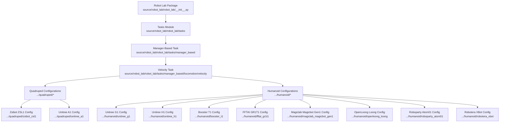
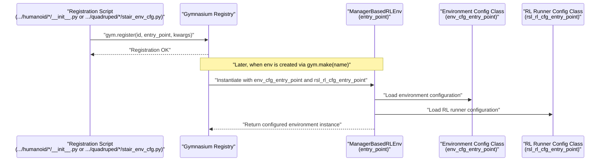
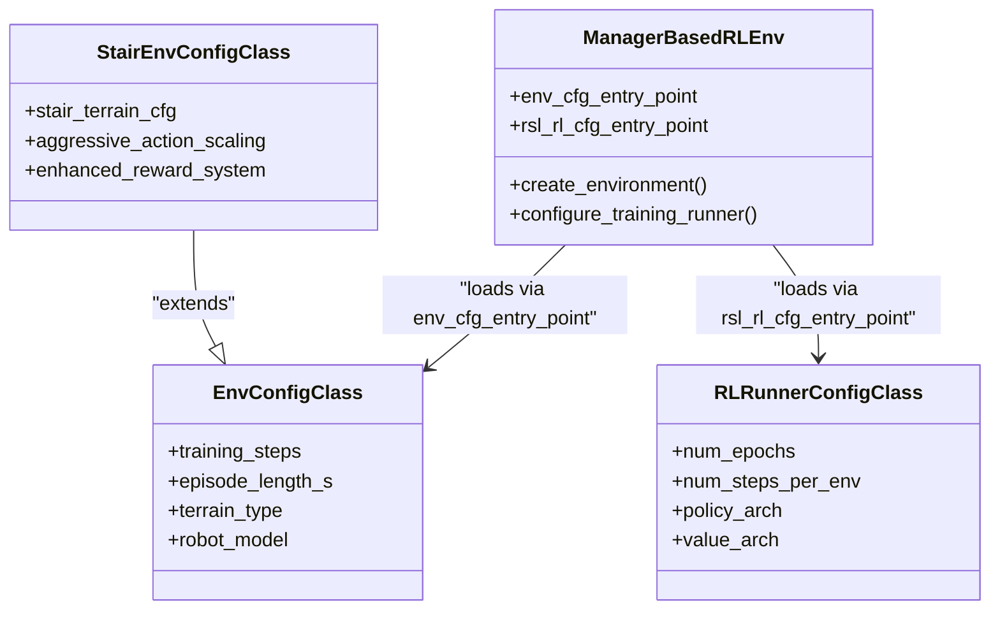
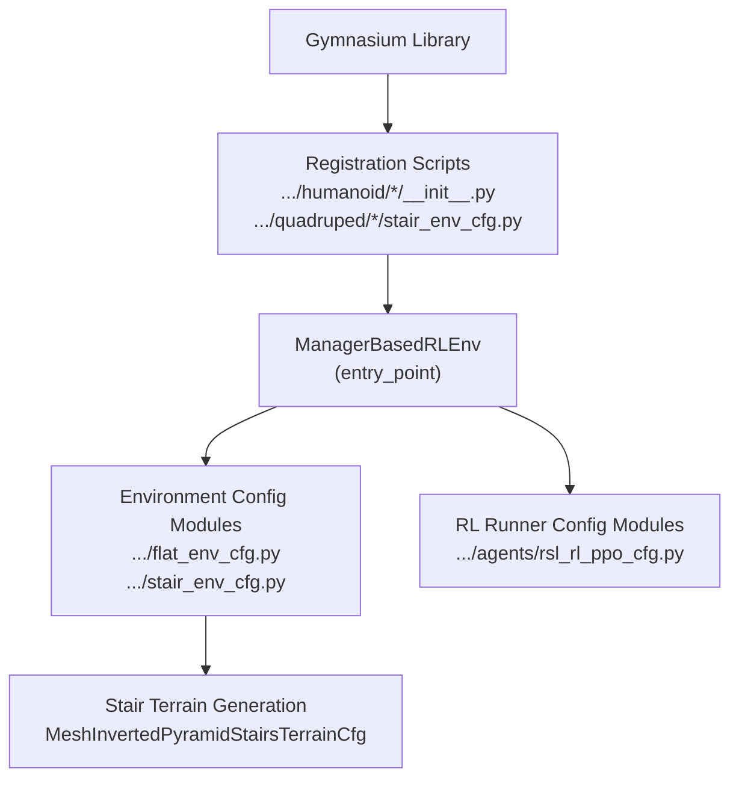

# Environment Registration Framework

<cite>
**Referenced Files in This Document**
- [robot_lab/__init__.py](file://source/robot_lab/robot_lab/__init__.py)
- [beyondmimic_g1/__init__.py](file://source/robot_lab/robot_lab/tasks/direct/g1_amp/__init__.py)
- [booster_t1/__init__.py](file://source/robot_lab/robot_lab/tasks/manager_based/locomotion/velocity/config/humanoid/booster_t1/__init__.py)
- [fftai_gr1t1/__init__.py](file://source/robot_lab/robot_lab/tasks/manager_based/locomotion/velocity/config/humanoid/fftai_gr1t1/__init__.py)
- [unitree_g1/__init__.py](file://source/robot_lab/robot_lab/tasks/manager_based/locomotion/velocity/config/humanoid/unitree_g1/__init__.py)
- [unitree_h1/__init__.py](file://source/robot_lab/robot_lab/tasks/manager_based/locomotion/velocity/config/humanoid/unitree_h1/__init__.py)
- [magiclab_magicbot_gen1/__init__.py](file://source/robot_lab/robot_lab/tasks/manager_based/locomotion/velocity/config/humanoid/magiclab_magicbot_gen1/__init__.py)
- [openloong_loong/__init__.py](file://source/robot_lab/robot_lab/tasks/manager_based/locomotion/velocity/config/humanoid/openloong_loong/__init__.py)
- [roboparty_atom01/__init__.py](file://source/robot_lab/robot_lab/tasks/manager_based/locomotion/velocity/config/humanoid/roboparty_atom01/__init__.py)
- [robotera_xbot/__init__.py](file://source/robot_lab/robot_lab/tasks/manager_based/locomotion/velocity/config/humanoid/robotera_xbot/__init__.py)
- [unitree_a1/__init__.py](file://source/robot_lab/robot_lab/tasks/manager_based/locomotion/velocity/config/quadruped/unitree_a1/__init__.py)
- [zsibot_zsl1/__init__.py](file://source/robot_lab/robot_lab/tasks/manager_based/locomotion/velocity/config/quadruped/zsibot_zsl1/__init__.py)
- [stair_env_cfg.py](file://source/robot_lab/robot_lab/tasks/manager_based/locomotion/velocity/config/quadruped/zsibot_zsl1/stair_env_cfg.py)
- [README.md](file://README.md)
</cite>

## Update Summary
**Changes Made**
- Added documentation for the new stair environment registration system
- Updated environment naming scheme to include Stair terrain type
- Added Zsibot ZSL1 stair environment configuration details
- Enhanced examples with stair climbing environment registration patterns
- Updated README.md references to reflect new stair climbing capabilities

## Table of Contents
1. [Introduction](#introduction)
2. [Project Structure](#project-structure)
3. [Core Components](#core-components)
4. [Architecture Overview](#architecture-overview)
5. [Detailed Component Analysis](#detailed-component-analysis)
6. [Dependency Analysis](#dependency-analysis)
7. [Performance Considerations](#performance-considerations)
8. [Troubleshooting Guide](#troubleshooting-guide)
9. [Conclusion](#conclusion)

## Introduction
This document explains the environment registration framework used by the Robot Lab project to integrate Gymnasium-compatible environments with the ManagerBasedRLEnv class. It focuses on the standardized naming convention for environments (for example, RobotLab-Isaac-Velocity-Flat-Unitree-A1-v0), the registration mechanism via gym.register(), and how environment names map to configuration classes and the underlying RL environment implementation. The guide also covers common registration issues, naming conflicts, and debugging techniques for environment setup.

**Updated** Added support for stair environment registration with specialized stair climbing configurations for Zsibot ZSL1.

## Project Structure
The environment registration system is organized around a set of modular configuration packages under the manager-based locomotion velocity task. Each robot family (for example, Unitree G1, Unitree H1, Booster T1, FFTAI GR1T1, Magiclab Magicbot Gen1, OpenLoong Loong, Roboparty Atom01, Robotera XBot, Zsibot ZSL1) defines its own registration entry points and configuration classes. The top-level package initializer triggers task-level registrations.

**Diagram sources**
- [robot_lab/__init__.py:8-12](file://source/robot_lab/robot_lab/__init__.py#L8-L12)
- [unitree_g1/__init__.py:11-23](file://source/robot_lab/robot_lab/tasks/manager_based/locomotion/velocity/config/humanoid/unitree_g1/__init__.py#L11-L23)
- [unitree_h1/__init__.py:11-22](file://source/robot_lab/robot_lab/tasks/manager_based/locomotion/velocity/config/humanoid/unitree_h1/__init__.py#L11-L22)
- [booster_t1/__init__.py:7-18](file://source/robot_lab/robot_lab/tasks/manager_based/locomotion/velocity/config/humanoid/booster_t1/__init__.py#L7-L18)
- [fftai_gr1t1/__init__.py:11-22](file://source/robot_lab/robot_lab/tasks/manager_based/locomotion/velocity/config/humanoid/fftai_gr1t1/__init__.py#L11-L22)
- [magiclab_magicbot_gen1/__init__.py:11-23](file://source/robot_lab/robot_lab/tasks/manager_based/locomotion/velocity/config/humanoid/magiclab_magicbot_gen1/__init__.py#L11-L23)
- [openloong_loong/__init__.py:11-22](file://source/robot_lab/robot_lab/tasks/manager_based/locomotion/velocity/config/humanoid/openloong_loong/__init__.py#L11-L22)
- [roboparty_atom01/__init__.py:11-23](file://source/robot_lab/robot_lab/tasks/manager_based/locomotion/velocity/config/humanoid/roboparty_atom01/__init__.py#L11-L23)
- [robotera_xbot/__init__.py:7-18](file://source/robot_lab/robot_lab/tasks/manager_based/locomotion/velocity/config/humanoid/robotera_xbot/__init__.py#L7-L18)
- [unitree_a1/__init__.py:12-32](file://source/robot_lab/robot_lab/tasks/manager_based/locomotion/velocity/config/quadruped/unitree_a1/__init__.py#L12-L32)
- [zsibot_zsl1/__init__.py:12-40](file://source/robot_lab/robot_lab/tasks/manager_based/locomotion/velocity/config/quadruped/zsibot_zsl1/__init__.py#L12-L40)

**Section sources**
- [robot_lab/__init__.py:8-12](file://source/robot_lab/robot_lab/__init__.py#L8-L12)

## Core Components
- Environment Naming Convention: RobotLab-Isaac-{TaskType}-{Terrain}-{RobotCategory}-{Model}-{Version}
  - TaskType: Velocity
  - Terrain: Flat, Rough, or Stair (newly added)
  - RobotCategory: Unitree, FFTAI, Magiclab, OpenLoong, Roboparty, Robotera, Zsibot
  - Model: A1, G1, H1, GR1T1, GR1T2, Magicbot Gen1/Z1, Loong, Atom01, XBot, ZSL1
  - Version: v0
- Registration Mechanism: gym.register() with:
  - id: Standardized environment name
  - entry_point: "isaaclab.envs:ManagerBasedRLEnv"
  - disable_env_checker: True
  - kwargs:
    - env_cfg_entry_point: "{package}.flat_env_cfg:{ClassName}" or "{package}.stair_env_cfg:{ClassName}"
    - rsl_rl_cfg_entry_point: "{package}.agents.rsl_rl_ppo_cfg:{ClassName}"

Examples of registration patterns are visible in the humanoid configurations for Unitree G1, Unitree H1, Booster T1, FFTAI GR1T1, Magiclab Magicbot Gen1, OpenLoong Loong, Roboparty Atom01, and Robotera XBot, as well as the quadruped configurations for Unitree A1 and Zsibot ZSL1.

**Updated** Added stair environment registration pattern for Zsibot ZSL1 with specialized stair climbing configuration.

**Section sources**
- [beyondmimic_g1/__init__.py:21-29](file://source/robot_lab/robot_lab/tasks/direct/g1_amp/__init__.py#L21-L29)
- [unitree_g1/__init__.py:11-23](file://source/robot_lab/robot_lab/tasks/manager_based/locomotion/velocity/config/humanoid/unitree_g1/__init__.py#L11-L23)
- [unitree_h1/__init__.py:11-22](file://source/robot_lab/robot_lab/tasks/manager_based/locomotion/velocity/config/humanoid/unitree_h1/__init__.py#L11-L22)
- [booster_t1/__init__.py:7-18](file://source/robot_lab/robot_lab/tasks/manager_based/locomotion/velocity/config/humanoid/booster_t1/__init__.py#L7-L18)
- [fftai_gr1t1/__init__.py:11-22](file://source/robot_lab/robot_lab/tasks/manager_based/locomotion/velocity/config/humanoid/fftai_gr1t1/__init__.py#L11-L22)
- [magiclab_magicbot_gen1/__init__.py:11-23](file://source/robot_lab/robot_lab/tasks/manager_based/locomotion/velocity/config/humanoid/magiclab_magicbot_gen1/__init__.py#L11-L23)
- [openloong_loong/__init__.py:11-22](file://source/robot_lab/robot_lab/tasks/manager_based/locomotion/velocity/config/humanoid/openloong_loong/__init__.py#L11-L22)
- [roboparty_atom01/__init__.py:11-23](file://source/robot_lab/robot_lab/tasks/manager_based/locomotion/velocity/config/humanoid/roboparty_atom01/__init__.py#L11-L23)
- [robotera_xbot/__init__.py:7-18](file://source/robot_lab/robot_lab/tasks/manager_based/locomotion/velocity/config/humanoid/robotera_xbot/__init__.py#L7-L18)
- [unitree_a1/__init__.py:12-32](file://source/robot_lab/robot_lab/tasks/manager_based/locomotion/velocity/config/quadruped/unitree_a1/__init__.py#L12-L32)
- [zsibot_zsl1/__init__.py:12-40](file://source/robot_lab/robot_lab/tasks/manager_based/locomotion/velocity/config/quadruped/zsibot_zsl1/__init__.py#L12-L40)

## Architecture Overview
The environment registration architecture connects standardized environment names to configuration classes through ManagerBasedRLEnv. The flow below illustrates how a gym.register() call maps to the RL training configuration and environment configuration classes.

**Diagram sources**
- [beyondmimic_g1/__init__.py:21-29](file://source/robot_lab/robot_lab/tasks/direct/g1_amp/__init__.py#L21-L29)
- [unitree_g1/__init__.py:11-23](file://source/robot_lab/robot_lab/tasks/manager_based/locomotion/velocity/config/humanoid/unitree_g1/__init__.py#L11-L23)
- [stair_env_cfg.py:50-219](file://source/robot_lab/robot_lab/tasks/manager_based/locomotion/velocity/config/quadruped/zsibot_zsl1/stair_env_cfg.py#L50-L219)

## Detailed Component Analysis

### Environment Naming Scheme Breakdown
- RobotLab-Isaac: Project and ecosystem prefix
- Velocity: Task type indicating locomotion policy training
- Flat/Rough/Stair: Terrain type for the environment (Stair is newly added)
- Unitree/A1: Robot category and model
- v0: Version identifier

This scheme ensures uniqueness and discoverability across robots and terrains while keeping names concise and readable.

**Updated** Added Stair terrain type to support specialized stair climbing environments.

**Section sources**
- [README.md:17-41](file://README.md#L17-L41)
- [stair_env_cfg.py:20-47](file://source/robot_lab/robot_lab/tasks/manager_based/locomotion/velocity/config/quadruped/zsibot_zsl1/stair_env_cfg.py#L20-L47)

### Registration Pattern in Manager-Based Environments
Each humanoid configuration package registers one or more environments using gym.register(). The pattern includes:
- id: Standardized environment name following the naming scheme
- entry_point: "isaaclab.envs:ManagerBasedRLEnv"
- disable_env_checker: True
- kwargs:
  - env_cfg_entry_point: "{package}.flat_env_cfg:{ClassName}" or "{package}.stair_env_cfg:{ClassName}"
  - rsl_rl_cfg_entry_point: "{package}.agents.rsl_rl_ppo_cfg:{ClassName}"

Concrete examples:
- Unitree G1 Flat: RobotLab-Isaac-Velocity-Flat-Unitree-G1-v0
- Unitree G1 Rough: RobotLab-Isaac-Velocity-Rough-Unitree-G1-v0
- Unitree H1 Flat: RobotLab-Isaac-Velocity-Flat-Unitree-H1-v0
- Booster T1 Flat: RobotLab-Isaac-Velocity-Flat-Booster-T1-v0
- FFTAI GR1T1 Flat: RobotLab-Isaac-Velocity-Flat-FFTAI-GR1T1-v0
- Magiclab Magicbot Gen1 Flat: RobotLab-Isaac-Velocity-Flat-Magiclab-Magicbot-Gen1-v0
- OpenLoong Loong Flat: RobotLab-Isaac-Velocity-Flat-OpenLoong-Loong-v0
- Roboparty Atom01 Flat: RobotLab-Isaac-Velocity-Flat-Roboparty-Atom01-v0
- Robotera XBot Flat: RobotLab-Isaac-Velocity-Flat-Robotera-XBot-v0
- Unitree A1 Flat: RobotLab-Isaac-Velocity-Flat-Unitree-A1-v0
- Unitree A1 Rough: RobotLab-Isaac-Velocity-Rough-Unitree-A1-v0
- Zsibot ZSL1 Flat: RobotLab-Isaac-Velocity-Flat-Zsibot-ZSL1-v0
- Zsibot ZSL1 Rough: RobotLab-Isaac-Velocity-Rough-Zsibot-ZSL1-v0
- **Zsibot ZSL1 Stair: RobotLab-Isaac-Velocity-Stair-Zsibot-ZSL1-v0 (NEW)**

**Updated** Added Zsibot ZSL1 stair environment registration pattern.

These registrations demonstrate consistent mapping between environment names and configuration classes.

**Section sources**
- [unitree_g1/__init__.py:11-23](file://source/robot_lab/robot_lab/tasks/manager_based/locomotion/velocity/config/humanoid/unitree_g1/__init__.py#L11-L23)
- [unitree_h1/__init__.py:11-22](file://source/robot_lab/robot_lab/tasks/manager_based/locomotion/velocity/config/humanoid/unitree_h1/__init__.py#L11-L22)
- [booster_t1/__init__.py:7-18](file://source/robot_lab/robot_lab/tasks/manager_based/locomotion/velocity/config/humanoid/booster_t1/__init__.py#L7-L18)
- [fftai_gr1t1/__init__.py:11-22](file://source/robot_lab/robot_lab/tasks/manager_based/locomotion/velocity/config/humanoid/fftai_gr1t1/__init__.py#L11-L22)
- [magiclab_magicbot_gen1/__init__.py:11-23](file://source/robot_lab/robot_lab/tasks/manager_based/locomotion/velocity/config/humanoid/magiclab_magicbot_gen1/__init__.py#L11-L23)
- [openloong_loong/__init__.py:11-22](file://source/robot_lab/robot_lab/tasks/manager_based/locomotion/velocity/config/humanoid/openloong_loong/__init__.py#L11-L22)
- [roboparty_atom01/__init__.py:11-23](file://source/robot_lab/robot_lab/tasks/manager_based/locomotion/velocity/config/humanoid/roboparty_atom01/__init__.py#L11-L23)
- [robotera_xbot/__init__.py:7-18](file://source/robot_lab/robot_lab/tasks/manager_based/locomotion/velocity/config/humanoid/robotera_xbot/__init__.py#L7-L18)
- [unitree_a1/__init__.py:12-32](file://source/robot_lab/robot_lab/tasks/manager_based/locomotion/velocity/config/quadruped/unitree_a1/__init__.py#L12-L32)
- [zsibot_zsl1/__init__.py:12-40](file://source/robot_lab/robot_lab/tasks/manager_based/locomotion/velocity/config/quadruped/zsibot_zsl1/__init__.py#L12-L40)

### Specialized Stair Environment Configuration
The Zsibot ZSL1 stair environment introduces specialized configuration for stair climbing scenarios:

- **Stair Terrain Generation**: Uses MeshInvertedPyramidStairsTerrainCfg with step heights ranging from 0.05m to 0.23m
- **Enhanced Rewards System**: 
  - Increased feet_air_time reward weight (0.5) for longer stride and better obstacle clearance
  - Reduced upward weight (0.3) to allow body tilt during leg lifting
  - Specialized feet_height rewards encouraging leg lifting during stair ascent
- **Action Scaling**: Modified joint position scaling for more aggressive stair climbing motions
- **Contact Sensors**: Enhanced contact force monitoring for stair climbing stability

**New** Specialized stair environment configuration with dedicated terrain generation and reward systems.

**Section sources**
- [stair_env_cfg.py:20-47](file://source/robot_lab/robot_lab/tasks/manager_based/locomotion/velocity/config/quadruped/zsibot_zsl1/stair_env_cfg.py#L20-L47)
- [stair_env_cfg.py:118-200](file://source/robot_lab/robot_lab/tasks/manager_based/locomotion/velocity/config/quadruped/zsibot_zsl1/stair_env_cfg.py#L118-L200)
- [stair_env_cfg.py:38-45](file://source/robot_lab/robot_lab/tasks/manager_based/locomotion/velocity/config/quadruped/zsibot_zsl1/stair_env_cfg.py#L38-L45)

### Relationship Between Names, Configuration Classes, and ManagerBasedRLEnv
- Environment Name: Determines the registry id used by gym.make()
- Configuration Classes:
  - Environment Config: Loaded via env_cfg_entry_point pointing to a class in the package's flat_env_cfg or stair_env_cfg module
  - RL Runner Config: Loaded via rsl_rl_cfg_entry_point pointing to a class in the package's agents.rsl_rl_ppo_cfg module
- ManagerBasedRLEnv: The entry_point class that consumes the configuration classes to construct the environment and training runner

**Diagram sources**
- [beyondmimic_g1/__init__.py:21-29](file://source/robot_lab/robot_lab/tasks/direct/g1_amp/__init__.py#L21-L29)
- [unitree_g1/__init__.py:11-23](file://source/robot_lab/robot_lab/tasks/manager_based/locomotion/velocity/config/humanoid/unitree_g1/__init__.py#L11-L23)
- [stair_env_cfg.py:50-219](file://source/robot_lab/robot_lab/tasks/manager_based/locomotion/velocity/config/quadruped/zsibot_zsl1/stair_env_cfg.py#L50-L219)

## Dependency Analysis
The registration system depends on:
- Gymnasium for environment registration and creation
- ManagerBasedRLEnv as the entry_point class
- Package-specific configuration modules for environment and RL runner settings
- **Stair terrain generation utilities** for specialized stair climbing environments

**Diagram sources**
- [beyondmimic_g1/__init__.py:21-29](file://source/robot_lab/robot_lab/tasks/direct/g1_amp/__init__.py#L21-L29)
- [unitree_g1/__init__.py:11-23](file://source/robot_lab/robot_lab/tasks/manager_based/locomotion/velocity/config/humanoid/unitree_g1/__init__.py#L11-L23)
- [stair_env_cfg.py:17-47](file://source/robot_lab/robot_lab/tasks/manager_based/locomotion/velocity/config/quadruped/zsibot_zsl1/stair_env_cfg.py#L17-L47)

**Section sources**
- [beyondmimic_g1/__init__.py:21-29](file://source/robot_lab/robot_lab/tasks/direct/g1_amp/__init__.py#L21-L29)
- [unitree_g1/__init__.py:11-23](file://source/robot_lab/robot_lab/tasks/manager_based/locomotion/velocity/config/humanoid/unitree_g1/__init__.py#L11-L23)
- [stair_env_cfg.py:17-47](file://source/robot_lab/robot_lab/tasks/manager_based/locomotion/velocity/config/quadruped/zsibot_zsl1/stair_env_cfg.py#L17-L47)

## Performance Considerations
- Keep registration scripts lightweight; avoid heavy imports during import time.
- Use disable_env_checker=True to reduce overhead during registration.
- Centralize configuration loading to minimize repeated disk reads.
- Ensure environment and runner configuration classes are efficient and avoid unnecessary computations at initialization.
- **Stair environments require specialized terrain generation** which may increase initial setup time but provides more realistic stair climbing scenarios.

## Troubleshooting Guide
Common issues and resolutions:
- Environment name not found
  - Verify the exact name matches the registered id and includes the correct task type, terrain, robot category, model, and version.
  - Confirm the registration script is imported by the package initializer.
  - **For stair environments, ensure the stair_env_cfg module exists and is properly imported.**
- Entry point resolution errors
  - Ensure entry_point is exactly "isaaclab.envs:ManagerBasedRLEnv".
  - Verify that the environment and RL runner configuration entry points resolve to existing classes in their respective modules.
- Configuration class not found
  - Check that env_cfg_entry_point and rsl_rl_cfg_entry_point point to valid modules and class names.
  - Confirm the modules exist and export the expected classes.
  - **For stair environments, verify that stair_env_cfg.py contains the ZsibotZSL1StairEnvCfg class.**
- Naming conflicts
  - Ensure unique ids across robots and terrains to avoid collisions.
  - Use the standardized naming scheme consistently to prevent ambiguity.
  - **Include the Stair terrain type in the naming convention for stair environments.**
- Debugging techniques
  - List registered environments using a helper script to confirm registration.
  - Temporarily print or log configuration class names during registration to validate imports.
  - Test gym.make() with verbose logging to capture instantiation errors.
  - **For stair environments, verify terrain generation configuration and reward system setup.**

## Conclusion
The Robot Lab environment registration framework leverages a standardized naming scheme and consistent registration patterns to integrate Gymnasium environments with ManagerBasedRLEnv. By organizing configurations per robot family and terrain, the system achieves clarity, maintainability, and scalability across diverse robotic platforms. The addition of stair environment support demonstrates the framework's extensibility for specialized locomotion tasks. Following the documented patterns and troubleshooting steps ensures reliable environment setup and training workflows.

**Updated** Enhanced with stair environment registration capabilities and specialized stair climbing configurations for Zsibot ZSL1, expanding the framework's support for diverse terrain types and locomotion challenges.