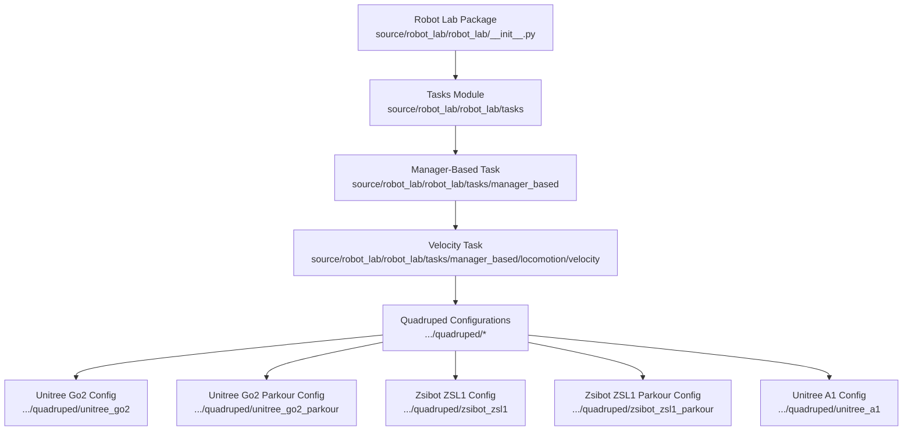
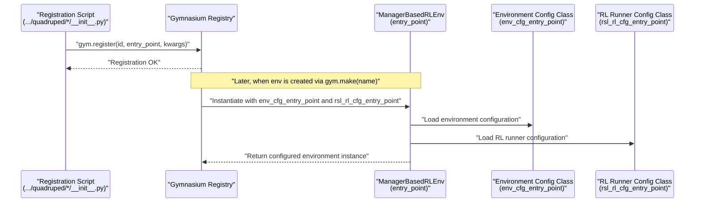
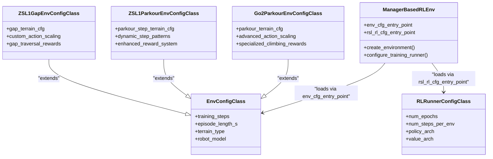
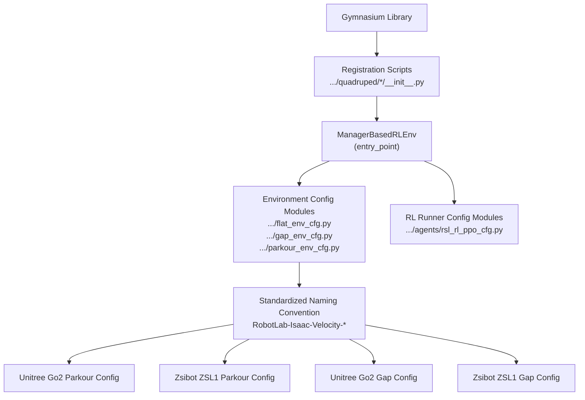

# Environment Registration Framework

<cite>
**Referenced Files in This Document**
- [robot_lab/__init__.py](file://source/robot_lab/robot_lab/__init__.py)
- [unitree_go2/__init__.py](file://source/robot_lab/robot_lab/tasks/manager_based/locomotion/velocity/config/quadruped/unitree_go2/__init__.py)
- [unitree_go2_parkour/__init__.py](file://source/robot_lab/robot_lab/tasks/manager_based/locomotion/velocity/config/quadruped/unitree_go2_parkour/__init__.py)
- [zsibot_zsl1/__init__.py](file://source/robot_lab/robot_lab/tasks/manager_based/locomotion/velocity/config/quadruped/zsibot_zsl1/__init__.py)
- [zsibot_zsl1_parkour/__init__.py](file://source/robot_lab/robot_lab/tasks/manager_based/locomotion/velocity/config/quadruped/zsibot_zsl1_parkour/__init__.py)
- [unitree_a1/__init__.py](file://source/robot_lab/robot_lab/tasks/manager_based/locomotion/velocity/config/quadruped/unitree_a1/__init__.py)
- [README.md](file://README.md)
</cite>

## Update Summary
**Changes Made**
- Updated environment naming convention documentation to reflect standardized RobotLab-Isaac-Velocity- prefix for all quadruped robot parkour environments
- Added Unitree Go2 parkour environment registration examples with new naming scheme
- Updated Zsibot ZSL1 parkour environment registration patterns to use standardized naming
- Enhanced examples showing proper environment registration patterns for all quadruped parkour environments
- Updated README.md references to reflect new standardized naming convention

## Table of Contents
1. [Introduction](#introduction)
2. [Project Structure](#project-structure)
3. [Core Components](#core-components)
4. [Architecture Overview](#architecture-overview)
5. [Detailed Component Analysis](#detailed-component-analysis)
6. [Dependency Analysis](#dependency-analysis)
7. [Performance Considerations](#performance-considerations)
8. [Troubleshooting Guide](#troubleshooting-guide)
9. [Conclusion](#conclusion)

## Introduction
This document explains the environment registration framework used by the Robot Lab project to integrate Gymnasium-compatible environments with the ManagerBasedRLEnv class. It focuses on the standardized naming convention for environments (for example, RobotLab-Isaac-Velocity-Flat-Unitree-A1-v0), the registration mechanism via gym.register(), and how environment names map to configuration classes and the underlying RL environment implementation. The guide also covers common registration issues, naming conflicts, and debugging techniques for environment setup.

**Updated** Enhanced with standardized RobotLab-Isaac-Velocity- prefix for all quadruped robot parkour environments, including Unitree Go2 and Zsibot ZSL1.

## Project Structure
The environment registration system is organized around a set of modular configuration packages under the manager-based locomotion velocity task. Each robot family (for example, Unitree G1, Unitree H1, Unitree Go2, Unitree A1, Zsibot ZSL1) defines its own registration entry points and configuration classes. The top-level package initializer triggers task-level registrations.

**Diagram sources**
- [robot_lab/__init__.py:8-12](file://source/robot_lab/robot_lab/__init__.py#L8-L12)
- [unitree_go2/__init__.py:12-32](file://source/robot_lab/robot_lab/tasks/manager_based/locomotion/velocity/config/quadruped/unitree_go2/__init__.py#L12-L32)
- [unitree_go2_parkour/__init__.py:21-161](file://source/robot_lab/robot_lab/tasks/manager_based/locomotion/velocity/config/quadruped/unitree_go2_parkour/__init__.py#L21-L161)
- [zsibot_zsl1/__init__.py:12-71](file://source/robot_lab/robot_lab/tasks/manager_based/locomotion/velocity/config/quadruped/zsibot_zsl1/__init__.py#L12-L71)
- [zsibot_zsl1_parkour/__init__.py:21-161](file://source/robot_lab/robot_lab/tasks/manager_based/locomotion/velocity/config/quadruped/zsibot_zsl1_parkour/__init__.py#L21-L161)
- [unitree_a1/__init__.py:12-32](file://source/robot_lab/robot_lab/tasks/manager_based/locomotion/velocity/config/quadruped/unitree_a1/__init__.py#L12-L32)

**Section sources**
- [robot_lab/__init__.py:8-12](file://source/robot_lab/robot_lab/__init__.py#L8-L12)

## Core Components
- Environment Naming Convention: RobotLab-Isaac-{TaskType}-{Terrain}-{RobotCategory}-{Model}-{Version}
  - TaskType: Velocity (standardized for all environments)
  - Terrain: Flat, Rough, Stair, Gap, Parkour (standardized for all environments)
  - RobotCategory: Unitree, FFTAI, Magiclab, OpenLoong, Roboparty, Robotera, Zsibot
  - Model: A1, G1, H1, GR1T1, GR1T2, Magicbot Gen1/Z1, Loong, Atom01, XBot, Go2, ZSL1
  - Version: v0 (standardized for all environments)
- Registration Mechanism: gym.register() with:
  - id: Standardized environment name using RobotLab-Isaac-Velocity- prefix
  - entry_point: "isaaclab.envs:ManagerBasedRLEnv"
  - disable_env_checker: True
  - kwargs:
    - env_cfg_entry_point: "{package}.flat_env_cfg:{ClassName}" or "{package}.{terrain}_env_cfg:{ClassName}"
    - rsl_rl_cfg_entry_point: "{package}.agents.rsl_rl_ppo_cfg:{ClassName}"

Examples of registration patterns are visible in the quadruped configurations for Unitree Go2, Unitree A1, and Zsibot ZSL1, as well as specialized parkour configurations for both robots.

**Updated** All quadruped robot parkour environments now use the standardized RobotLab-Isaac-Velocity- prefix, ensuring consistency across the entire ecosystem.

**Section sources**
- [unitree_go2/__init__.py:12-32](file://source/robot_lab/robot_lab/tasks/manager_based/locomotion/velocity/config/quadruped/unitree_go2/__init__.py#L12-L32)
- [unitree_go2_parkour/__init__.py:21-161](file://source/robot_lab/robot_lab/tasks/manager_based/locomotion/velocity/config/quadruped/unitree_go2_parkour/__init__.py#L21-L161)
- [unitree_a1/__init__.py:12-32](file://source/robot_lab/robot_lab/tasks/manager_based/locomotion/velocity/config/quadruped/unitree_a1/__init__.py#L12-L32)
- [zsibot_zsl1/__init__.py:12-71](file://source/robot_lab/robot_lab/tasks/manager_based/locomotion/velocity/config/quadruped/zsibot_zsl1/__init__.py#L12-L71)
- [zsibot_zsl1_parkour/__init__.py:21-161](file://source/robot_lab/robot_lab/tasks/manager_based/locomotion/velocity/config/quadruped/zsibot_zsl1_parkour/__init__.py#L21-L161)

## Architecture Overview
The environment registration architecture connects standardized environment names to configuration classes through ManagerBasedRLEnv. The flow below illustrates how a gym.register() call maps to the RL training configuration and environment configuration classes.

**Diagram sources**
- [unitree_go2/__init__.py:12-32](file://source/robot_lab/robot_lab/tasks/manager_based/locomotion/velocity/config/quadruped/unitree_go2/__init__.py#L12-L32)
- [unitree_go2_parkour/__init__.py:21-161](file://source/robot_lab/robot_lab/tasks/manager_based/locomotion/velocity/config/quadruped/unitree_go2_parkour/__init__.py#L21-L161)
- [zsibot_zsl1/__init__.py:12-71](file://source/robot_lab/robot_lab/tasks/manager_based/locomotion/velocity/config/quadruped/zsibot_zsl1/__init__.py#L12-L71)
- [zsibot_zsl1_parkour/__init__.py:21-161](file://source/robot_lab/robot_lab/tasks/manager_based/locomotion/velocity/config/quadruped/zsibot_zsl1_parkour/__init__.py#L21-L161)

## Detailed Component Analysis

### Environment Naming Scheme Breakdown
- RobotLab-Isaac: Project and ecosystem prefix (standardized)
- Velocity: Task type indicating locomotion policy training (standardized)
- Flat/Rough/Stair/Gap/Parkour: Terrain type for the environment (standardized)
- Unitree/Go2/Zsibot/ZSL1: Robot category and model (standardized)
- v0: Version identifier (standardized)

This scheme ensures uniqueness and discoverability across robots and terrains while keeping names concise and readable.

**Updated** All quadruped robot parkour environments now use the standardized RobotLab-Isaac-Velocity- prefix, ensuring consistency across the entire ecosystem.

**Section sources**
- [README.md:17-41](file://README.md#L17-L41)
- [unitree_go2/__init__.py:12-32](file://source/robot_lab/robot_lab/tasks/manager_based/locomotion/velocity/config/quadruped/unitree_go2/__init__.py#L12-L32)
- [unitree_go2_parkour/__init__.py:21-161](file://source/robot_lab/robot_lab/tasks/manager_based/locomotion/velocity/config/quadruped/unitree_go2_parkour/__init__.py#L21-L161)
- [zsibot_zsl1/__init__.py:12-71](file://source/robot_lab/robot_lab/tasks/manager_based/locomotion/velocity/config/quadruped/zsibot_zsl1/__init__.py#L12-L71)
- [zsibot_zsl1_parkour/__init__.py:21-161](file://source/robot_lab/robot_lab/tasks/manager_based/locomotion/velocity/config/quadruped/zsibot_zsl1_parkour/__init__.py#L21-L161)

### Registration Pattern in Manager-Based Environments
Each quadruped configuration package registers environments using the standardized naming convention. The pattern includes:
- id: Standardized environment name following the RobotLab-Isaac-Velocity-{Terrain}-{RobotCategory}-{Model}-v0 scheme
- entry_point: "isaaclab.envs:ManagerBasedRLEnv"
- disable_env_checker: True
- kwargs:
  - env_cfg_entry_point: "{package}.flat_env_cfg:{ClassName}" or "{package}.{terrain}_env_cfg:{ClassName}"
  - rsl_rl_cfg_entry_point: "{package}.agents.rsl_rl_ppo_cfg:{ClassName}"

Concrete examples:
- Unitree Go2 Flat: RobotLab-Isaac-Velocity-Flat-Unitree-Go2-v0
- Unitree Go2 Rough: RobotLab-Isaac-Velocity-Rough-Unitree-Go2-v0
- Unitree Go2 Parkour Flat: RobotLab-Isaac-Velocity-Go2-Parkour-Flat-v0
- Unitree Go2 Parkour Rough: RobotLab-Isaac-Velocity-Go2-Parkour-Rough-v0
- Unitree Go2 Parkour Rough Play: RobotLab-Isaac-Velocity-Go2-Parkour-Rough-Play-v0
- Unitree A1 Flat: RobotLab-Isaac-Velocity-Flat-Unitree-A1-v0
- Unitree A1 Rough: RobotLab-Isaac-Velocity-Rough-Unitree-A1-v0
- Zsibot ZSL1 Flat: RobotLab-Isaac-Velocity-Flat-Zsibot-ZSL1-v0
- Zsibot ZSL1 Rough: RobotLab-Isaac-Velocity-Rough-Zsibot-ZSL1-v0
- Zsibot ZSL1 Stair: RobotLab-Isaac-Velocity-Stair-Zsibot-ZSL1-v0
- Zsibot ZSL1 Parkour: RobotLab-Isaac-Velocity-Parkour-Zsibot-ZSL1-v0
- Zsibot ZSL1 Gap: RobotLab-Isaac-Velocity-Gap-Zsibot-ZSL1-v0
- Zsibot ZSL1 Parkour Flat: RobotLab-Isaac-Velocity-ZSL1-Parkour-Flat-v0
- Zsibot ZSL1 Parkour Rough: RobotLab-Isaac-Velocity-ZSL1-Parkour-Rough-v0
- Zsibot ZSL1 Parkour Rough Play: RobotLab-Isaac-Velocity-ZSL1-Parkour-Rough-Play-v0

**Updated** All quadruped robot parkour environments now use the standardized RobotLab-Isaac-Velocity- prefix, ensuring consistency across the entire ecosystem.

**Section sources**
- [unitree_go2/__init__.py:12-32](file://source/robot_lab/robot_lab/tasks/manager_based/locomotion/velocity/config/quadruped/unitree_go2/__init__.py#L12-L32)
- [unitree_go2_parkour/__init__.py:21-161](file://source/robot_lab/robot_lab/tasks/manager_based/locomotion/velocity/config/quadruped/unitree_go2_parkour/__init__.py#L21-L161)
- [unitree_a1/__init__.py:12-32](file://source/robot_lab/robot_lab/tasks/manager_based/locomotion/velocity/config/quadruped/unitree_a1/__init__.py#L12-L32)
- [zsibot_zsl1/__init__.py:12-71](file://source/robot_lab/robot_lab/tasks/manager_based/locomotion/velocity/config/quadruped/zsibot_zsl1/__init__.py#L12-L71)
- [zsibot_zsl1_parkour/__init__.py:21-161](file://source/robot_lab/robot_lab/tasks/manager_based/locomotion/velocity/config/quadruped/zsibot_zsl1_parkour/__init__.py#L21-L161)

### Specialized Parkour Environment Configuration
Both Unitree Go2 and Zsibot ZSL1 feature specialized parkour environment configurations with advanced terrain generation and reward systems:

- **Advanced Terrain Generation**: Custom parkour-style stepping terrains with configurable step heights and patterns
- **Multiple Variants**: Flat, Rough, Play, and Ablation variants for comprehensive training
- **Enhanced Reward System**: Specialized climbing rewards and action scaling for parkour-style locomotion
- **Ablation Studies**: Comprehensive ablation variants (Abl1, Abl2_5, Abl3_5, Abl4_0, Abl7_0) for research purposes
- **Play Mode**: Interactive play mode for demonstration and testing

**Updated** Both Unitree Go2 and Zsibot ZSL1 now use the standardized RobotLab-Isaac-Velocity- prefix in their parkour environment registrations.

**Section sources**
- [unitree_go2_parkour/__init__.py:21-161](file://source/robot_lab/robot_lab/tasks/manager_based/locomotion/velocity/config/quadruped/unitree_go2_parkour/__init__.py#L21-L161)
- [zsibot_zsl1_parkour/__init__.py:21-161](file://source/robot_lab/robot_lab/tasks/manager_based/locomotion/velocity/config/quadruped/zsibot_zsl1_parkour/__init__.py#L21-L161)

### Relationship Between Names, Configuration Classes, and ManagerBasedRLEnv
- Environment Name: Determines the registry id used by gym.make()
- Configuration Classes:
  - Environment Config: Loaded via env_cfg_entry_point pointing to a class in the package's flat_env_cfg, gap_env_cfg, or parkour_env_cfg module
  - RL Runner Config: Loaded via rsl_rl_cfg_entry_point pointing to a class in the package's agents.rsl_rl_ppo_cfg module
- ManagerBasedRLEnv: The entry_point class that consumes the configuration classes to construct the environment and training runner

**Diagram sources**
- [unitree_go2/__init__.py:12-32](file://source/robot_lab/robot_lab/tasks/manager_based/locomotion/velocity/config/quadruped/unitree_go2/__init__.py#L12-L32)
- [unitree_go2_parkour/__init__.py:21-161](file://source/robot_lab/robot_lab/tasks/manager_based/locomotion/velocity/config/quadruped/unitree_go2_parkour/__init__.py#L21-L161)
- [zsibot_zsl1/__init__.py:12-71](file://source/robot_lab/robot_lab/tasks/manager_based/locomotion/velocity/config/quadruped/zsibot_zsl1/__init__.py#L12-L71)
- [zsibot_zsl1_parkour/__init__.py:21-161](file://source/robot_lab/robot_lab/tasks/manager_based/locomotion/velocity/config/quadruped/zsibot_zsl1_parkour/__init__.py#L21-L161)

## Dependency Analysis
The registration system depends on:
- Gymnasium for environment registration and creation
- ManagerBasedRLEnv as the entry_point class
- Package-specific configuration modules for environment and RL runner settings
- **Standardized naming convention** across all quadruped robot parkour environments
- **Specialized terrain generation utilities** for parkour and gap environments

**Diagram sources**
- [unitree_go2/__init__.py:12-32](file://source/robot_lab/robot_lab/tasks/manager_based/locomotion/velocity/config/quadruped/unitree_go2/__init__.py#L12-L32)
- [unitree_go2_parkour/__init__.py:21-161](file://source/robot_lab/robot_lab/tasks/manager_based/locomotion/velocity/config/quadruped/unitree_go2_parkour/__init__.py#L21-L161)
- [zsibot_zsl1/__init__.py:12-71](file://source/robot_lab/robot_lab/tasks/manager_based/locomotion/velocity/config/quadruped/zsibot_zsl1/__init__.py#L12-L71)
- [zsibot_zsl1_parkour/__init__.py:21-161](file://source/robot_lab/robot_lab/tasks/manager_based/locomotion/velocity/config/quadruped/zsibot_zsl1_parkour/__init__.py#L21-L161)

**Section sources**
- [unitree_go2/__init__.py:12-32](file://source/robot_lab/robot_lab/tasks/manager_based/locomotion/velocity/config/quadruped/unitree_go2/__init__.py#L12-L32)
- [unitree_go2_parkour/__init__.py:21-161](file://source/robot_lab/robot_lab/tasks/manager_based/locomotion/velocity/config/quadruped/unitree_go2_parkour/__init__.py#L21-L161)
- [zsibot_zsl1/__init__.py:12-71](file://source/robot_lab/robot_lab/tasks/manager_based/locomotion/velocity/config/quadruped/zsibot_zsl1/__init__.py#L12-L71)
- [zsibot_zsl1_parkour/__init__.py:21-161](file://source/robot_lab/robot_lab/tasks/manager_based/locomotion/velocity/config/quadruped/zsibot_zsl1_parkour/__init__.py#L21-L161)

## Performance Considerations
- Keep registration scripts lightweight; avoid heavy imports during import time.
- Use disable_env_checker=True to reduce overhead during registration.
- Centralize configuration loading to minimize repeated disk reads.
- Ensure environment and runner configuration classes are efficient and avoid unnecessary computations at initialization.
- **Standardized naming convention reduces lookup complexity** across all quadruped robot parkour environments.
- **Specialized terrain generation** for parkour and gap environments may increase initial setup time but provides more realistic traversal scenarios.

## Troubleshooting Guide
Common issues and resolutions:
- Environment name not found
  - Verify the exact name matches the registered id and includes the correct task type, terrain, robot category, model, and version.
  - Confirm the registration script is imported by the package initializer.
  - **For parkour and gap environments, ensure the specialized *_env_cfg.py modules exist and are properly imported.**
- Entry point resolution errors
  - Ensure entry_point is exactly "isaaclab.envs:ManagerBasedRLEnv".
  - Verify that the environment and RL runner configuration entry points resolve to existing classes in their respective modules.
- Configuration class not found
  - Check that env_cfg_entry_point and rsl_rl_cfg_entry_point point to valid modules and class names.
  - Confirm the modules exist and export the expected classes.
  - **For parkour and gap environments, verify that the specialized *_env_cfg.py modules contain the expected configuration classes.**
- Naming conflicts
  - Ensure unique ids across robots and terrains to avoid collisions.
  - Use the standardized naming scheme consistently to prevent ambiguity.
  - **All quadruped robot parkour environments now use the RobotLab-Isaac-Velocity- prefix for consistency.**
- Debugging techniques
  - List registered environments using a helper script to confirm registration.
  - Temporarily print or log configuration class names during registration to validate imports.
  - Test gym.make() with verbose logging to capture instantiation errors.
  - **For parkour and gap environments, verify terrain generation configuration and reward system setup.**
  - **Check custom terrain generation functions for proper parameter validation and error handling.**

## Conclusion
The Robot Lab environment registration framework leverages a standardized naming scheme and consistent registration patterns to integrate Gymnasium environments with ManagerBasedRLEnv. By organizing configurations per robot family and terrain, the system achieves clarity, maintainability, and scalability across diverse robotic platforms. The enhancement with the RobotLab-Isaac-Velocity- prefix for all quadruped robot parkour environments demonstrates the framework's commitment to consistency and standardization. The addition of specialized parkour and gap environments showcases the framework's extensibility for advanced locomotion tasks with custom terrain generation and reward systems. Following the documented patterns and troubleshooting steps ensures reliable environment setup and training workflows.

**Updated** Enhanced with standardized RobotLab-Isaac-Velocity- prefix for all quadruped robot parkour environments, ensuring consistency and improved discoverability across Unitree Go2, Zsibot ZSL1, and future quadruped additions to the ecosystem.