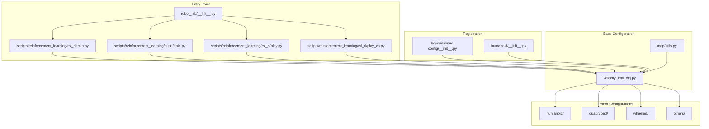
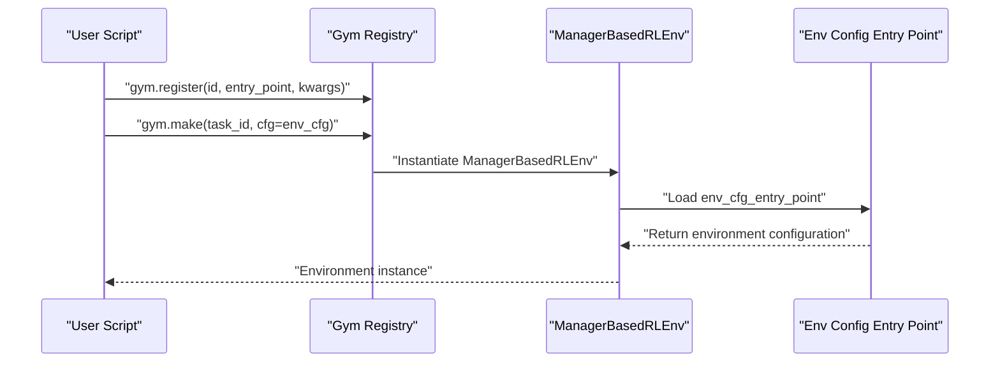
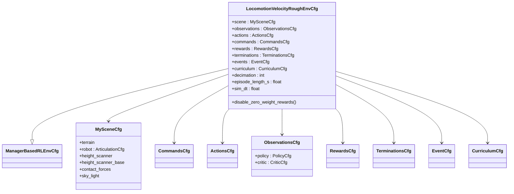
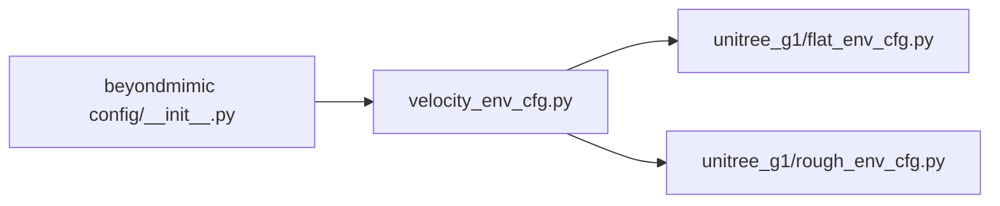
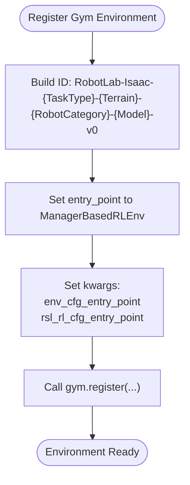
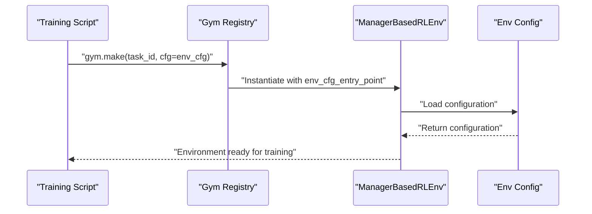
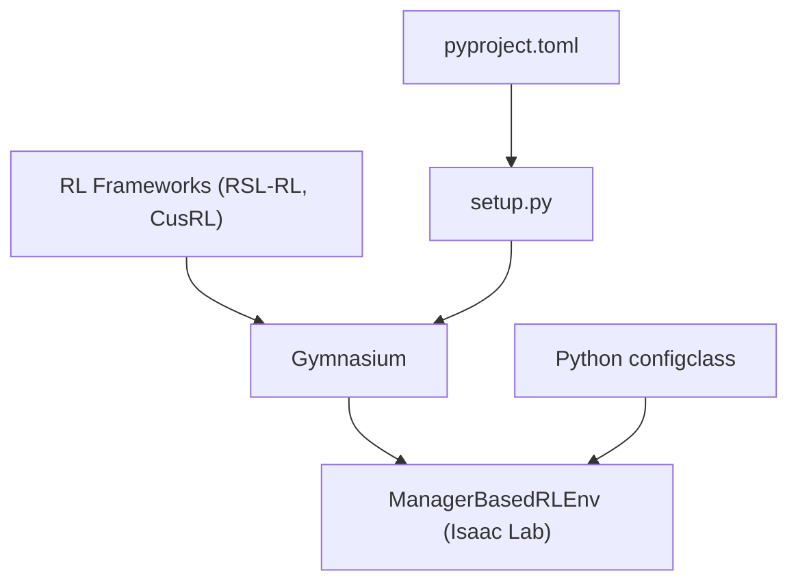

# Environment System

<cite>
**Referenced Files in This Document**
- [velocity_env_cfg.py](file://source/robot_lab/robot_lab/tasks/manager_based/locomotion/velocity/velocity_env_cfg.py)
- [utils.py](file://source/robot_lab/robot_lab/tasks/manager_based/locomotion/velocity/mdp/utils.py)
- [__init__.py](file://source/robot_lab/robot_lab/tasks/manager_based/locomotion/velocity/config/humanoid/__init__.py)
- [flat_env_cfg.py](file://source/robot_lab/robot_lab/tasks/manager_based/locomotion/velocity/config/humanoid/unitree_g1/flat_env_cfg.py)
- [rough_env_cfg.py](file://source/robot_lab/robot_lab/tasks/manager_based/locomotion/velocity/config/humanoid/unitree_g1/rough_env_cfg.py)
- [__init__.py](file://source/robot_lab/robot_lab/tasks/manager_based/beyondmimic/config/g1/__init__.py)
- [train.py](file://scripts/reinforcement_learning/rsl_rl/train.py)
- [play.py](file://scripts/reinforcement_learning/rsl_rl/play.py)
- [play_cs.py](file://scripts/reinforcement_learning/rsl_rl/play_cs.py)
- [train.py](file://scripts/reinforcement_learning/cusrl/train.py)
- [__init__.py](file://source/robot_lab/robot_lab/__init__.py)
- [setup.py](file://source/robot_lab/setup.py)
- [pyproject.toml](file://source/robot_lab/pyproject.toml)
</cite>

## Table of Contents
1. [Introduction](#introduction)
2. [Project Structure](#project-structure)
3. [Core Components](#core-components)
4. [Architecture Overview](#architecture-overview)
5. [Detailed Component Analysis](#detailed-component-analysis)
6. [Dependency Analysis](#dependency-analysis)
7. [Performance Considerations](#performance-considerations)
8. [Troubleshooting Guide](#troubleshooting-guide)
9. [Conclusion](#conclusion)

## Introduction
This document explains the environment system used by Robot Lab, focusing on the Gym environment registration framework and the ManagerBasedRLEnv implementation. It details how environment configurations are structured using Python classes decorated with configclass, how YAML-based agent configurations integrate with ManagerBasedRLEnv, and how the task configuration hierarchy is organized from a base velocity environment down to specific robot configurations. It also clarifies the naming scheme for environments (for example, RobotLab-Isaac-Velocity-Flat-Unitree-A1-v0), the relationship between environment names, task types, robot categories, and versioning, and how entry point specifications connect to Isaac Lab’s environment system.

## Project Structure
Robot Lab organizes environment configurations under a hierarchical structure:
- Base environment configuration resides in a velocity-based locomotion configuration module.
- Robot-specific configurations are grouped by category (humanoid, quadruped, wheeled, others) and further by robot brand/model.
- Each robot configuration exposes flat and rough variants and includes agent runner configurations.
- Environments are registered via Gym in per-robot modules and exposed globally through the package’s init.

**Diagram sources**
- [velocity_env_cfg.py](file://source/robot_lab/robot_lab/tasks/manager_based/locomotion/velocity/velocity_env_cfg.py#L695-L744)
- [utils.py](file://source/robot_lab/robot_lab/tasks/manager_based/locomotion/velocity/mdp/utils.py#L1-L127)
- [__init__.py](file://source/robot_lab/robot_lab/tasks/manager_based/locomotion/velocity/config/humanoid/__init__.py#L1-L13)
- [__init__.py](file://source/robot_lab/robot_lab/tasks/manager_based/beyondmimic/config/g1/__init__.py#L1-L20)
- [train.py](file://scripts/reinforcement_learning/rsl_rl/train.py#L171-L172)
- [train.py](file://scripts/reinforcement_learning/cusrl/train.py#L104-L104)
- [play.py](file://scripts/reinforcement_learning/rsl_rl/play.py#L94-L115)
- [play_cs.py](file://scripts/reinforcement_learning/rsl_rl/play_cs.py#L95-L108)
- [__init__.py](file://source/robot_lab/robot_lab/__init__.py#L8-L12)

**Section sources**
- [velocity_env_cfg.py](file://source/robot_lab/robot_lab/tasks/manager_based/locomotion/velocity/velocity_env_cfg.py#L695-L744)
- [__init__.py](file://source/robot_lab/robot_lab/tasks/manager_based/locomotion/velocity/config/humanoid/__init__.py#L1-L13)
- [__init__.py](file://source/robot_lab/robot_lab/tasks/manager_based/beyondmimic/config/g1/__init__.py#L1-L20)
- [train.py](file://scripts/reinforcement_learning/rsl_rl/train.py#L171-L172)
- [train.py](file://scripts/reinforcement_learning/cusrl/train.py#L104-L104)
- [play.py](file://scripts/reinforcement_learning/rsl_rl/play.py#L94-L115)
- [play_cs.py](file://scripts/reinforcement_learning/rsl_rl/play_cs.py#L95-L108)
- [__init__.py](file://source/robot_lab/robot_lab/__init__.py#L8-L12)

## Core Components
- ManagerBasedRLEnv configuration class: The base environment configuration class inherits from ManagerBasedRLEnvCfg and composes scene, commands, actions, observations, rewards, terminations, events, and curriculum settings. It uses configclass decorators to define nested configuration classes for scenes, MDP terms, and groups.
- MDP utilities: Utility functions support terrain-aware operations, such as determining which environments are initially assigned to a terrain type and checking whether robots are currently standing on a specified terrain type.
- Robot-specific configurations: Each robot category (humanoid, quadruped, wheeled, others) contains flat and rough environment configurations and agent runner configurations. These are registered as Gym environments with entry points pointing to ManagerBasedRLEnv and configuration entry points.

Key configuration classes and their roles:
- Scene configuration: Defines terrain, robot asset, sensors, and lighting.
- Commands configuration: Specifies velocity commands for the MDP.
- Actions configuration: Defines action types and scaling.
- Observations configuration: Groups observations for policy and critic.
- Rewards configuration: Defines reward terms and penalties.
- Terminations configuration: Defines termination conditions.
- Events configuration: Defines randomization and reset events.
- Curriculum configuration: Defines curriculum terms for adaptive difficulty.

**Section sources**
- [velocity_env_cfg.py](file://source/robot_lab/robot_lab/tasks/manager_based/locomotion/velocity/velocity_env_cfg.py#L42-L95)
- [velocity_env_cfg.py](file://source/robot_lab/robot_lab/tasks/manager_based/locomotion/velocity/velocity_env_cfg.py#L102-L127)
- [velocity_env_cfg.py](file://source/robot_lab/robot_lab/tasks/manager_based/locomotion/velocity/velocity_env_cfg.py#L129-L254)
- [velocity_env_cfg.py](file://source/robot_lab/robot_lab/tasks/manager_based/locomotion/velocity/velocity_env_cfg.py#L257-L372)
- [velocity_env_cfg.py](file://source/robot_lab/robot_lab/tasks/manager_based/locomotion/velocity/velocity_env_cfg.py#L374-L646)
- [velocity_env_cfg.py](file://source/robot_lab/robot_lab/tasks/manager_based/locomotion/velocity/velocity_env_cfg.py#L647-L664)
- [velocity_env_cfg.py](file://source/robot_lab/robot_lab/tasks/manager_based/locomotion/velocity/velocity_env_cfg.py#L667-L687)
- [velocity_env_cfg.py](file://source/robot_lab/robot_lab/tasks/manager_based/locomotion/velocity/velocity_env_cfg.py#L695-L744)
- [utils.py](file://source/robot_lab/robot_lab/tasks/manager_based/locomotion/velocity/mdp/utils.py#L42-L126)

## Architecture Overview
The environment system integrates Gym registration with ManagerBasedRLEnv. Training and evaluation scripts use gym.make with an environment ID and pass a configuration object. Robot-specific modules register environments with entry points that point to ManagerBasedRLEnv and provide configuration entry points for the environment and agent runner.

**Diagram sources**
- [__init__.py](file://source/robot_lab/robot_lab/tasks/manager_based/beyondmimic/config/g1/__init__.py#L12-L20)
- [train.py](file://scripts/reinforcement_learning/rsl_rl/train.py#L171-L172)
- [train.py](file://scripts/reinforcement_learning/cusrl/train.py#L104-L104)
- [play.py](file://scripts/reinforcement_learning/rsl_rl/play.py#L94-L115)
- [play_cs.py](file://scripts/reinforcement_learning/rsl_rl/play_cs.py#L95-L108)

## Detailed Component Analysis

### Base Velocity Environment Configuration
The base configuration defines the ManagerBasedRLEnv configuration class with nested configuration classes for scene, commands, actions, observations, rewards, terminations, events, and curriculum. It sets simulation parameters, episode length, decimation, and sensor update periods. It also provides a method to disable zero-weight rewards.

**Diagram sources**
- [velocity_env_cfg.py](file://source/robot_lab/robot_lab/tasks/manager_based/locomotion/velocity/velocity_env_cfg.py#L42-L95)
- [velocity_env_cfg.py](file://source/robot_lab/robot_lab/tasks/manager_based/locomotion/velocity/velocity_env_cfg.py#L102-L127)
- [velocity_env_cfg.py](file://source/robot_lab/robot_lab/tasks/manager_based/locomotion/velocity/velocity_env_cfg.py#L129-L254)
- [velocity_env_cfg.py](file://source/robot_lab/robot_lab/tasks/manager_based/locomotion/velocity/velocity_env_cfg.py#L257-L372)
- [velocity_env_cfg.py](file://source/robot_lab/robot_lab/tasks/manager_based/locomotion/velocity/velocity_env_cfg.py#L374-L646)
- [velocity_env_cfg.py](file://source/robot_lab/robot_lab/tasks/manager_based/locomotion/velocity/velocity_env_cfg.py#L647-L664)
- [velocity_env_cfg.py](file://source/robot_lab/robot_lab/tasks/manager_based/locomotion/velocity/velocity_env_cfg.py#L667-L687)
- [velocity_env_cfg.py](file://source/robot_lab/robot_lab/tasks/manager_based/locomotion/velocity/velocity_env_cfg.py#L695-L744)

**Section sources**
- [velocity_env_cfg.py](file://source/robot_lab/robot_lab/tasks/manager_based/locomotion/velocity/velocity_env_cfg.py#L695-L744)

### Task Configuration Hierarchy and Robot-Specific Configurations
Robot-specific configurations are organized by category and robot model. Each robot configuration provides:
- Flat and rough environment configurations.
- Agent runner configurations (for example, RSL-RL PPO).
- Gym registration entries that point to ManagerBasedRLEnv and configuration entry points.

Examples:
- Humanoid Unitree G1 flat and rough configurations.
- BeyondMimic registration for Unitree G1.

**Diagram sources**
- [flat_env_cfg.py](file://source/robot_lab/robot_lab/tasks/manager_based/locomotion/velocity/config/humanoid/unitree_g1/flat_env_cfg.py)
- [rough_env_cfg.py](file://source/robot_lab/robot_lab/tasks/manager_based/locomotion/velocity/config/humanoid/unitree_g1/rough_env_cfg.py)
- [__init__.py](file://source/robot_lab/robot_lab/tasks/manager_based/beyondmimic/config/g1/__init__.py#L12-L20)

**Section sources**
- [__init__.py](file://source/robot_lab/robot_lab/tasks/manager_based/locomotion/velocity/config/humanoid/__init__.py#L1-L13)
- [flat_env_cfg.py](file://source/robot_lab/robot_lab/tasks/manager_based/locomotion/velocity/config/humanoid/unitree_g1/flat_env_cfg.py)
- [rough_env_cfg.py](file://source/robot_lab/robot_lab/tasks/manager_based/locomotion/velocity/config/humanoid/unitree_g1/rough_env_cfg.py)
- [__init__.py](file://source/robot_lab/robot_lab/tasks/manager_based/beyondmimic/config/g1/__init__.py#L12-L20)

### Environment Registration Patterns and Naming Scheme
Environments are registered in Gym with IDs following a standardized naming scheme:
- Pattern: RobotLab-Isaac-{TaskType}-{Terrain}-{RobotCategory}-{Model}-v0
- Example: RobotLab-Isaac-Velocity-Flat-Unitree-A1-v0

Registration uses:
- entry_point pointing to ManagerBasedRLEnv.
- kwargs specifying env_cfg_entry_point and agent runner configuration entry point.

**Diagram sources**
- [__init__.py](file://source/robot_lab/robot_lab/tasks/manager_based/beyondmimic/config/g1/__init__.py#L12-L20)

**Section sources**
- [__init__.py](file://source/robot_lab/robot_lab/tasks/manager_based/beyondmimic/config/g1/__init__.py#L12-L20)

### ManagerBasedRLEnv Integration with Isaac Lab’s Environment System
Training and evaluation scripts demonstrate how ManagerBasedRLEnv integrates with Isaac Lab:
- Scripts call gym.make with the environment ID and pass a configuration object.
- For RSL-RL, the environment supports exporting IO descriptors when configured.
- For CusRL, the environment is instantiated similarly, with device and seed handling.

**Diagram sources**
- [train.py](file://scripts/reinforcement_learning/rsl_rl/train.py#L171-L172)
- [train.py](file://scripts/reinforcement_learning/cusrl/train.py#L104-L104)
- [play.py](file://scripts/reinforcement_learning/rsl_rl/play.py#L94-L115)
- [play_cs.py](file://scripts/reinforcement_learning/rsl_rl/play_cs.py#L95-L108)

**Section sources**
- [train.py](file://scripts/reinforcement_learning/rsl_rl/train.py#L171-L172)
- [train.py](file://scripts/reinforcement_learning/cusrl/train.py#L104-L104)
- [play.py](file://scripts/reinforcement_learning/rsl_rl/play.py#L94-L115)
- [play_cs.py](file://scripts/reinforcement_learning/rsl_rl/play_cs.py#L95-L108)

### YAML File Integration and Parameter Management
Agent runner configurations are provided as YAML files under each robot’s agents directory. These are loaded by the RL frameworks and complement the Python-based environment configuration. The environment configuration itself is defined in Python using configclass decorators, enabling structured parameter management and easy inheritance.

- Agent runner YAMLs are located under agents/ within each robot’s configuration directory.
- Environment configuration classes encapsulate simulation parameters, MDP terms, and scene settings.

**Section sources**
- [flat_env_cfg.py](file://source/robot_lab/robot_lab/tasks/manager_based/locomotion/velocity/config/humanoid/unitree_g1/flat_env_cfg.py)
- [rough_env_cfg.py](file://source/robot_lab/robot_lab/tasks/manager_based/locomotion/velocity/config/humanoid/unitree_g1/rough_env_cfg.py)

## Dependency Analysis
The environment system depends on:
- Gymnasium for environment registration and instantiation.
- ManagerBasedRLEnv from Isaac Lab for the environment runtime.
- Python configclass for structured configuration composition.
- RL frameworks (RSL-RL, CusRL) for training and evaluation.

**Diagram sources**
- [train.py](file://scripts/reinforcement_learning/rsl_rl/train.py#L171-L172)
- [train.py](file://scripts/reinforcement_learning/cusrl/train.py#L104-L104)
- [pyproject.toml](file://source/robot_lab/pyproject.toml#L1-L4)
- [setup.py](file://source/robot_lab/setup.py#L1-L54)

**Section sources**
- [train.py](file://scripts/reinforcement_learning/rsl_rl/train.py#L171-L172)
- [train.py](file://scripts/reinforcement_learning/cusrl/train.py#L104-L104)
- [pyproject.toml](file://source/robot_lab/pyproject.toml#L1-L4)
- [setup.py](file://source/robot_lab/setup.py#L1-L54)

## Performance Considerations
- Simulation parameters: The base configuration sets decimation, episode length, and simulation timestep. Adjusting these affects training speed and stability.
- Sensor update periods: Sensors are aligned to the smallest update period to balance accuracy and performance.
- Curriculum: Enabling terrain levels curriculum increases difficulty progressively, aiding robust policy learning.
- Device and seed: Scripts set device and seed early to ensure reproducibility and efficient resource utilization.

[No sources needed since this section provides general guidance]

## Troubleshooting Guide
Common issues and debugging techniques:
- Environment not found: Verify the Gym ID matches the registered ID and that the environment is imported during package initialization.
- Incorrect entry point: Ensure kwargs include env_cfg_entry_point and agent runner configuration entry point.
- Zero-weight rewards: Use the provided method to disable zero-weight rewards to avoid unnecessary computation.
- Terrain assignment checks: Use utility functions to verify which environments are assigned to specific terrain types and confirm terrain generator configuration.
- Device and seed mismatches: Ensure device and seed are set consistently across scripts and configurations.

**Section sources**
- [velocity_env_cfg.py](file://source/robot_lab/robot_lab/tasks/manager_based/locomotion/velocity/velocity_env_cfg.py#L737-L744)
- [utils.py](file://source/robot_lab/robot_lab/tasks/manager_based/locomotion/velocity/mdp/utils.py#L42-L126)
- [play.py](file://scripts/reinforcement_learning/rsl_rl/play.py#L94-L115)
- [play_cs.py](file://scripts/reinforcement_learning/rsl_rl/play_cs.py#L95-L108)

## Conclusion
Robot Lab’s environment system leverages ManagerBasedRLEnv and Gym registration to provide a structured, scalable framework for reinforcement learning tasks. The base velocity environment configuration composes scene, MDP terms, and curriculum settings using configclass decorators. Robot-specific configurations organize flat and rough variants with agent runner configurations, and Gym registrations connect environment IDs to ManagerBasedRLEnv with explicit configuration entry points. This design enables consistent parameter management, easy customization, and straightforward integration with RL frameworks.