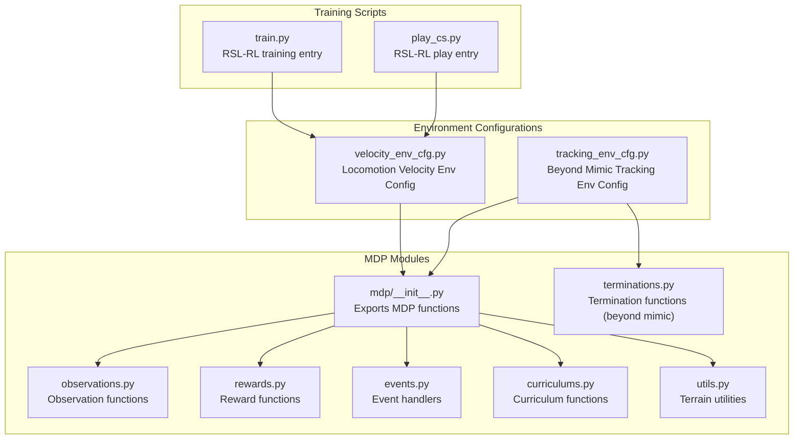
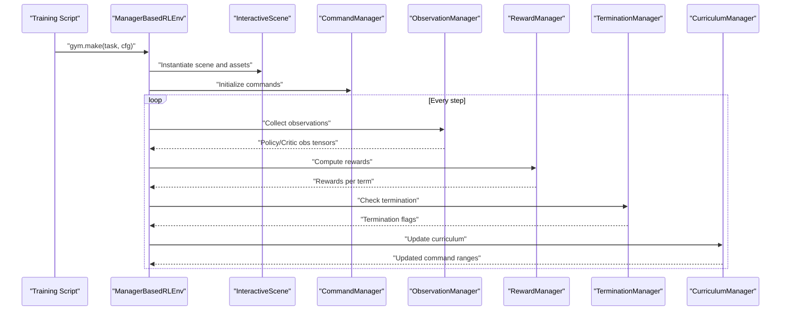
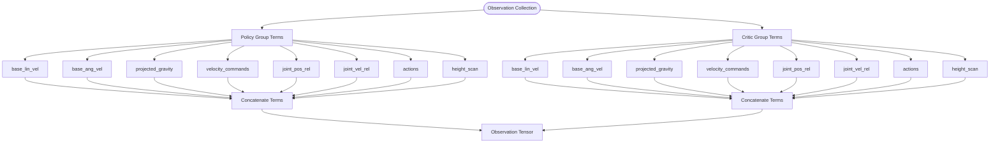
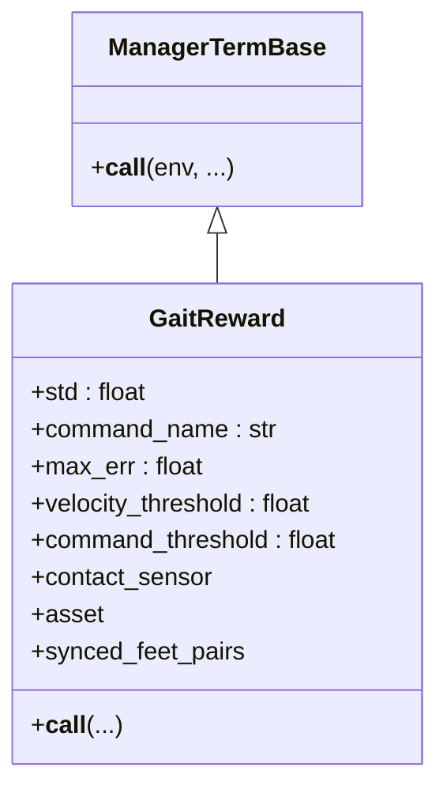
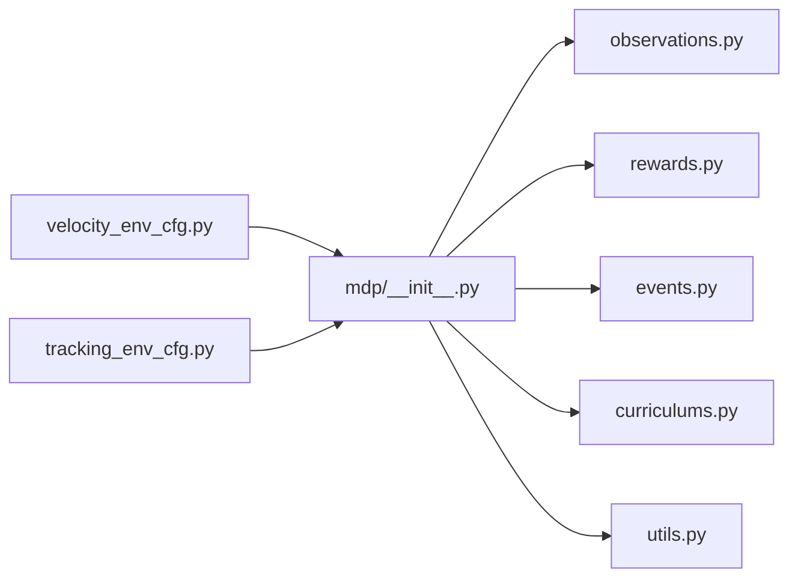

# MDP Manager Architecture

<cite>
**Referenced Files in This Document**
- [velocity_env_cfg.py](file://source/robot_lab/robot_lab/tasks/manager_based/locomotion/velocity/velocity_env_cfg.py)
- [__init__.py](file://source/robot_lab/robot_lab/tasks/manager_based/locomotion/velocity/mdp/__init__.py)
- [observations.py](file://source/robot_lab/robot_lab/tasks/manager_based/locomotion/velocity/mdp/observations.py)
- [rewards.py](file://source/robot_lab/robot_lab/tasks/manager_based/locomotion/velocity/mdp/rewards.py)
- [events.py](file://source/robot_lab/robot_lab/tasks/manager_based/locomotion/velocity/mdp/events.py)
- [curriculums.py](file://source/robot_lab/robot_lab/tasks/manager_based/locomotion/velocity/mdp/curriculums.py)
- [utils.py](file://source/robot_lab/robot_lab/tasks/manager_based/locomotion/velocity/mdp/utils.py)
- [tracking_env_cfg.py](file://source/robot_lab/robot_lab/tasks/manager_based/beyondmimic/tracking_env_cfg.py)
- [terminations.py](file://source/robot_lab/robot_lab/tasks/manager_based/beyondmimic/mdp/terminations.py)
- [play_cs.py](file://scripts/reinforcement_learning/rsl_rl/play_cs.py)
- [train.py](file://scripts/reinforcement_learning/rsl_rl/train.py)
</cite>

## Table of Contents
1. [Introduction](#introduction)
2. [Project Structure](#project-structure)
3. [Core Components](#core-components)
4. [Architecture Overview](#architecture-overview)
5. [Detailed Component Analysis](#detailed-component-analysis)
6. [Dependency Analysis](#dependency-analysis)
7. [Performance Considerations](#performance-considerations)
8. [Troubleshooting Guide](#troubleshooting-guide)
9. [Conclusion](#conclusion)

## Introduction
This document explains the Markov Decision Process (MDP) manager architecture used in the repository’s environment configurations. It focuses on how the ManagerBasedRLEnv integration works with Isaac Lab’s manager system, covering scene management, observation groups, reward computation, termination conditions, and curriculum learning. It also documents the roles of key manager components (SceneEntityCfg, ObservationTermCfg, RewardTermCfg, TerminationTermCfg, EventTermCfg), the MDP function implementations, and how configuration classes connect to runtime execution. Practical guidance is included for performance tuning, debugging, and extending the system with custom components.

## Project Structure
The MDP manager architecture is organized around environment configuration classes and modular MDP function modules:
- Environment configuration classes define scenes, commands, actions, observations, rewards, terminations, events, and curriculum.
- MDP modules provide reusable functions for observations, rewards, events, curriculum updates, and utilities.

**Diagram sources**
- [velocity_env_cfg.py](file://source/robot_lab/robot_lab/tasks/manager_based/locomotion/velocity/velocity_env_cfg.py#L696-L744)
- [tracking_env_cfg.py](file://source/robot_lab/robot_lab/tasks/manager_based/beyondmimic/tracking_env_cfg.py#L116-L171)
- [__init__.py](file://source/robot_lab/robot_lab/tasks/manager_based/locomotion/velocity/mdp/__init__.py#L11-L20)
- [observations.py](file://source/robot_lab/robot_lab/tasks/manager_based/locomotion/velocity/mdp/observations.py#L1-L35)
- [rewards.py](file://source/robot_lab/robot_lab/tasks/manager_based/locomotion/velocity/mdp/rewards.py#L1-L681)
- [events.py](file://source/robot_lab/robot_lab/tasks/manager_based/locomotion/velocity/mdp/events.py#L1-L270)
- [curriculums.py](file://source/robot_lab/robot_lab/tasks/manager_based/locomotion/velocity/mdp/curriculums.py#L1-L97)
- [utils.py](file://source/robot_lab/robot_lab/tasks/manager_based/locomotion/velocity/mdp/utils.py#L1-L127)
- [terminations.py](file://source/robot_lab/robot_lab/tasks/manager_based/beyondmimic/mdp/terminations.py#L1-L62)
- [train.py](file://scripts/reinforcement_learning/rsl_rl/train.py#L127-L176)
- [play_cs.py](file://scripts/reinforcement_learning/rsl_rl/play_cs.py#L95-L108)

**Section sources**
- [velocity_env_cfg.py](file://source/robot_lab/robot_lab/tasks/manager_based/locomotion/velocity/velocity_env_cfg.py#L42-L95)
- [velocity_env_cfg.py](file://source/robot_lab/robot_lab/tasks/manager_based/locomotion/velocity/velocity_env_cfg.py#L102-L127)
- [velocity_env_cfg.py](file://source/robot_lab/robot_lab/tasks/manager_based/locomotion/velocity/velocity_env_cfg.py#L130-L254)
- [velocity_env_cfg.py](file://source/robot_lab/robot_lab/tasks/manager_based/locomotion/velocity/velocity_env_cfg.py#L257-L372)
- [velocity_env_cfg.py](file://source/robot_lab/robot_lab/tasks/manager_based/locomotion/velocity/velocity_env_cfg.py#L374-L646)
- [velocity_env_cfg.py](file://source/robot_lab/robot_lab/tasks/manager_based/locomotion/velocity/velocity_env_cfg.py#L647-L744)

## Core Components
- SceneEntityCfg: References assets and sensor entities within the interactive scene. Used pervasively to select articulated bodies, joints, and sensor data for MDP functions.
- ObservationTermCfg: Defines observation terms grouped into policy and critic observation groups. Terms include base velocities, projected gravity, commands, joint positions/velocities, actions, and height scans.
- RewardTermCfg: Encapsulates reward computations such as velocity tracking, orientation penalties, joint torques/velocities/accelerations, contact and air-time metrics, and gait enforcement.
- TerminationTermCfg: Specifies episode termination conditions such as timeouts, terrain bounds, and illegal contacts.
- EventTermCfg: Manages environment randomization and resets across startup, reset, and interval modes (e.g., material/mass/inertia randomization, pushing, external forces, joint resets, actuator gains, base state resets).

These components integrate with ManagerBasedRLEnv to construct the MDP pipeline at runtime.

**Section sources**
- [velocity_env_cfg.py](file://source/robot_lab/robot_lab/tasks/manager_based/locomotion/velocity/velocity_env_cfg.py#L130-L254)
- [velocity_env_cfg.py](file://source/robot_lab/robot_lab/tasks/manager_based/locomotion/velocity/velocity_env_cfg.py#L257-L372)
- [velocity_env_cfg.py](file://source/robot_lab/robot_lab/tasks/manager_based/locomotion/velocity/velocity_env_cfg.py#L374-L646)
- [velocity_env_cfg.py](file://source/robot_lab/robot_lab/tasks/manager_based/locomotion/velocity/velocity_env_cfg.py#L647-L649)

## Architecture Overview
The environment configuration defines the MDP blueprint. At runtime, ManagerBasedRLEnv instantiates the scene, sensors, and managers, then executes the configured MDP pipeline each step:
- Observations: Collect per-term signals from sensors and assets, optionally noise-corrupted and scaled.
- Rewards: Evaluate per-term reward contributions weighted by configuration.
- Termination: Check termination conditions to end episodes.
- Events: Apply randomization and reset behaviors according to mode and schedule.
- Curriculum: Dynamically adjust command ranges and terrain difficulty.

**Diagram sources**
- [velocity_env_cfg.py](file://source/robot_lab/robot_lab/tasks/manager_based/locomotion/velocity/velocity_env_cfg.py#L696-L744)
- [train.py](file://scripts/reinforcement_learning/rsl_rl/train.py#L171-L176)

## Detailed Component Analysis

### Scene Management
- Scene definition includes terrain, robot assets, sensors (height scanner, contact forces), and lighting.
- Sensors are configured with update periods aligned to simulation and decimation.
- Physics material and GPU patch limits are tuned for performance.

Key configuration highlights:
- Terrain importer with generator and material settings.
- Height scanners and contact sensors attached to robot frames.
- Lighting assets for rendering.

**Section sources**
- [velocity_env_cfg.py](file://source/robot_lab/robot_lab/tasks/manager_based/locomotion/velocity/velocity_env_cfg.py#L42-L95)

### Observation Groups and Terms
Observations are split into policy and critic groups. Each term specifies:
- Function pointer to an MDP function.
- Optional noise, clipping, scaling, and parameters (e.g., SceneEntityCfg for assets/sensors).
- Concatenation and corruption flags.

Examples of observation terms:
- Base linear/angular velocities.
- Projected gravity.
- Generated commands.
- Joint positions/velocities (relative to defaults).
- Last actions.
- Height scan from ray-caster.

**Diagram sources**
- [velocity_env_cfg.py](file://source/robot_lab/robot_lab/tasks/manager_based/locomotion/velocity/velocity_env_cfg.py#L130-L254)

**Section sources**
- [velocity_env_cfg.py](file://source/robot_lab/robot_lab/tasks/manager_based/locomotion/velocity/velocity_env_cfg.py#L130-L254)
- [observations.py](file://source/robot_lab/robot_lab/tasks/manager_based/locomotion/velocity/mdp/observations.py#L16-L35)

### Reward Functions and Terms
Rewards are composed of multiple terms, each computing a scalar per environment. Terms include:
- Tracking rewards (exponential kernels for linear/angular velocity).
- Orientation and base height penalties.
- Joint torques/velocities/accelerations.
- Contact and air-time metrics.
- Gait enforcement via synchronized/asynchronous foot contact timing.
- Action smoothing and mirroring/syncing terms.

**Diagram sources**
- [rewards.py](file://source/robot_lab/robot_lab/tasks/manager_based/locomotion/velocity/mdp/rewards.py#L153-L186)

Typical reward term configuration patterns:
- Weighted terms with parameters (e.g., asset/sensor selectors, thresholds).
- Conditional enforcement based on command magnitudes and body velocities.
- Gravity-aware scaling to prevent rewards under unsupported orientations.

**Section sources**
- [velocity_env_cfg.py](file://source/robot_lab/robot_lab/tasks/manager_based/locomotion/velocity/velocity_env_cfg.py#L374-L646)
- [rewards.py](file://source/robot_lab/robot_lab/tasks/manager_based/locomotion/velocity/mdp/rewards.py#L22-L681)

### Termination Conditions
Termination terms signal episode ends:
- Timeout-based termination.
- Terrain bounds checking around the robot.
- Illegal contacts exceeding thresholds.

These are configured via TerminationTermCfg entries.

**Section sources**
- [velocity_env_cfg.py](file://source/robot_lab/robot_lab/tasks/manager_based/locomotion/velocity/velocity_env_cfg.py#L647-L665)

### Environmental Events
Events manage randomization and reset behaviors:
- Startup: Material, mass, inertia, and center-of-mass randomization.
- Reset: External forces/torques, joint scaling/offsets, actuator gains, base state uniform reset.
- Interval: Periodic pushes to encourage robustness.

Event handlers accept environment IDs, asset/sensor selectors, and distribution parameters.

**Section sources**
- [velocity_env_cfg.py](file://source/robot_lab/robot_lab/tasks/manager_based/locomotion/velocity/velocity_env_cfg.py#L257-L372)
- [events.py](file://source/robot_lab/robot_lab/tasks/manager_based/locomotion/velocity/mdp/events.py#L19-L270)

### Curriculum Learning
Curriculum adjusts command ranges and terrain difficulty:
- Command level curriculum increases linear/angular velocity ranges when tracking rewards exceed thresholds.
- Terrain levels curriculum toggles terrain generator difficulty based on curriculum term presence.

**Section sources**
- [velocity_env_cfg.py](file://source/robot_lab/robot_lab/tasks/manager_based/locomotion/velocity/velocity_env_cfg.py#L667-L687)
- [curriculums.py](file://source/robot_lab/robot_lab/tasks/manager_based/locomotion/velocity/mdp/curriculums.py#L20-L97)

### Beyond Mimic Termination Terms
Beyond mimic tasks define termination conditions for tracking accuracy:
- Anchor position/rotation errors.
- Body position errors for specified body names.

**Section sources**
- [tracking_env_cfg.py](file://source/robot_lab/robot_lab/tasks/manager_based/beyondmimic/tracking_env_cfg.py#L116-L171)
- [terminations.py](file://source/robot_lab/robot_lab/tasks/manager_based/beyondmimic/mdp/terminations.py#L21-L62)

## Dependency Analysis
The MDP modules are imported and exposed via the MDP package initializer, which consolidates functions from both local and shared task libraries.

**Diagram sources**
- [__init__.py](file://source/robot_lab/robot_lab/tasks/manager_based/locomotion/velocity/mdp/__init__.py#L11-L20)

**Section sources**
- [__init__.py](file://source/robot_lab/robot_lab/tasks/manager_based/locomotion/velocity/mdp/__init__.py#L11-L20)

## Performance Considerations
- Sensor update periods: Align sensor update rates with simulation and decimation to reduce overhead.
- GPU resource tuning: Increase GPU rigid patch count for dense contact scenarios.
- Observation concatenation: Enable concatenation and corruption selectively to balance signal quality and training stability.
- Curriculum cadence: Update curriculum at episode boundaries to avoid frequent parameter churn.
- Device selection: Ensure consistent device assignment for distributed training and logging.

Practical tips:
- Disable unused reward terms by setting weights to zero and removing them via the provided utility method.
- Use appropriate noise and clipping ranges to stabilize training.
- Prefer vectorized operations in MDP functions to minimize Python overhead.

**Section sources**
- [velocity_env_cfg.py](file://source/robot_lab/robot_lab/tasks/manager_based/locomotion/velocity/velocity_env_cfg.py#L716-L727)
- [velocity_env_cfg.py](file://source/robot_lab/robot_lab/tasks/manager_based/locomotion/velocity/velocity_env_cfg.py#L737-L744)
- [train.py](file://scripts/reinforcement_learning/rsl_rl/train.py#L138-L147)

## Troubleshooting Guide
Common issues and remedies:
- Observation dimension mismatches: Verify joint/body ID selections in SceneEntityCfg and ensure preserve_order is set when required.
- Reward instability: Reduce noise and clipping ranges; confirm gravity-aware scaling is applied where needed.
- Termination false positives: Adjust thresholds for illegal contacts and terrain bounds; validate asset/sensor selectors.
- Curriculum stalls: Confirm curriculum terms are enabled and reward sums are accumulating; check episode length alignment for updates.
- Event randomization failures: Ensure asset/sensor names exist; verify body ID slices and distribution parameters are valid.

Debugging aids:
- Export IO descriptors for environment inspection.
- Inspect episode sums and common step counters for curriculum behavior.
- Use logging and checkpoints to track environment seeds and device assignments.

**Section sources**
- [velocity_env_cfg.py](file://source/robot_lab/robot_lab/tasks/manager_based/locomotion/velocity/velocity_env_cfg.py#L696-L744)
- [train.py](file://scripts/reinforcement_learning/rsl_rl/train.py#L160-L169)
- [play_cs.py](file://scripts/reinforcement_learning/rsl_rl/play_cs.py#L95-L108)

## Conclusion
The MDP manager architecture integrates environment configuration with Isaac Lab’s ManagerBasedRLEnv to deliver a flexible, modular reinforcement learning pipeline. SceneEntityCfg, ObservationTermCfg, RewardTermCfg, TerminationTermCfg, and EventTermCfg collectively define the MDP blueprint. The MDP modules encapsulate reusable computation functions that operate on the runtime environment state. By tuning sensor updates, curriculum cadence, and reward shaping, practitioners can achieve robust and efficient training. Extensibility is achieved by adding new MDP functions and corresponding configuration entries, following the established patterns demonstrated in the repository.