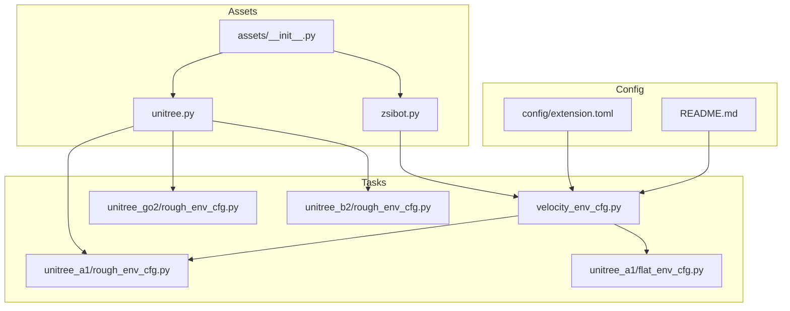
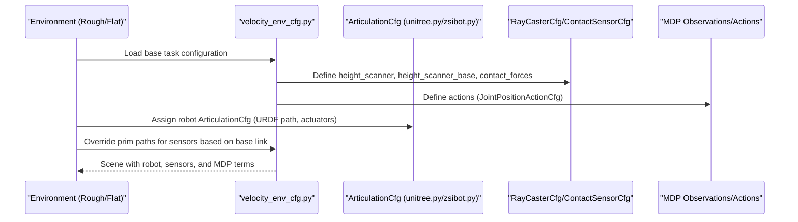
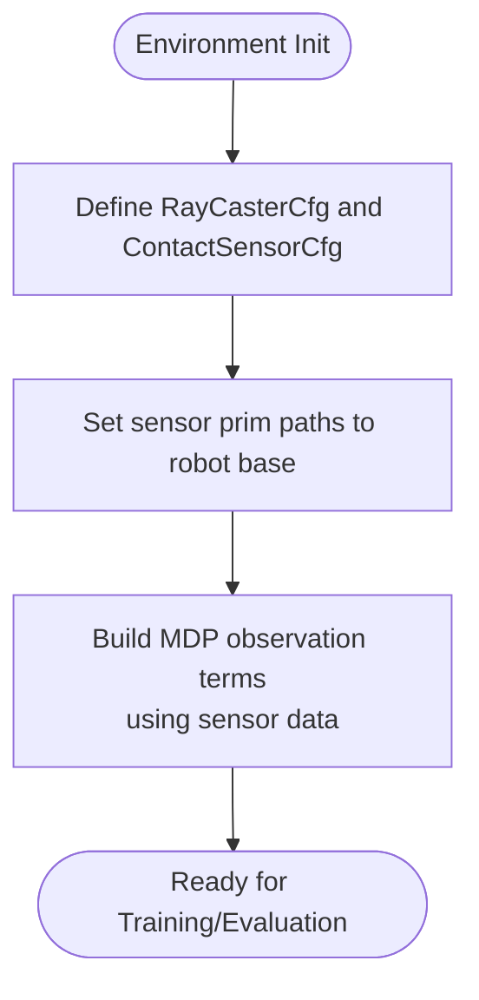
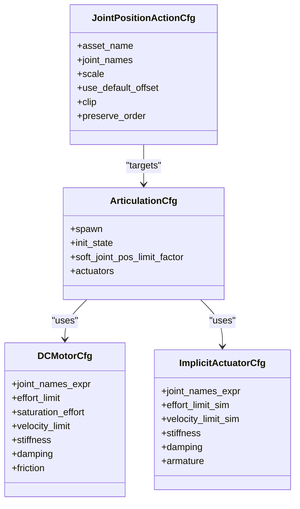
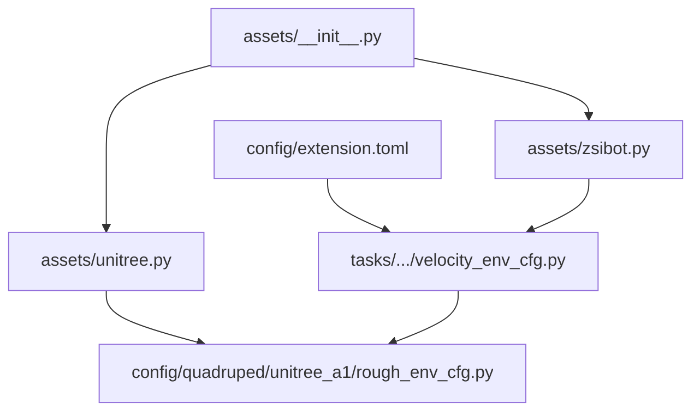

# Sensor and Actuator Integration

<cite>
**Referenced Files in This Document**
- [unitree.py](file://source/robot_lab/robot_lab/assets/unitree.py)
- [zsibot.py](file://source/robot_lab/robot_lab/assets/zsibot.py)
- [velocity_env_cfg.py](file://source/robot_lab/robot_lab/tasks/manager_based/locomotion/velocity/velocity_env_cfg.py)
- [unitree_a1/rough_env_cfg.py](file://source/robot_lab/robot_lab/tasks/manager_based/locomotion/velocity/config/quadruped/unitree_a1/rough_env_cfg.py)
- [unitree_go2/rough_env_cfg.py](file://source/robot_lab/robot_lab/tasks/manager_based/locomotion/velocity/config/quadruped/unitree_go2/rough_env_cfg.py)
- [unitree_b2/rough_env_cfg.py](file://source/robot_lab/robot_lab/tasks/manager_based/locomotion/velocity/config/quadruped/unitree_b2/rough_env_cfg.py)
- [flat_env_cfg.py](file://source/robot_lab/robot_lab/tasks/manager_based/locomotion/velocity/config/quadruped/unitree_a1/flat_env_cfg.py)
- [extension.toml](file://source/robot_lab/config/extension.toml)
- [__init__.py](file://source/robot_lab/robot_lab/assets/__init__.py)
- [README.md](file://README.md)
</cite>

## Table of Contents
1. [Introduction](#introduction)
2. [Project Structure](#project-structure)
3. [Core Components](#core-components)
4. [Architecture Overview](#architecture-overview)
5. [Detailed Component Analysis](#detailed-component-analysis)
6. [Dependency Analysis](#dependency-analysis)
7. [Performance Considerations](#performance-considerations)
8. [Troubleshooting Guide](#troubleshooting-guide)
9. [Conclusion](#conclusion)
10. [Appendices](#appendices)

## Introduction
This document explains how sensors and actuators are configured and integrated within the environment system for robotic platforms. It focuses on:
- Sensor configuration patterns: RayCasterCfg for height scanning and ContactSensorCfg for force feedback, and their integration with the MDP observation pipeline.
- Actuator configuration through ArticulationCfg and JointPositionActionCfg, including joint specifications, actuator limits, and control scaling factors.
- Asset loading and environment integration, including URDF paths and prim path composition.
- Practical examples from unitree.py and zsibot.py for actuator configuration and sensor placement.
- The relationship among asset definitions, sensor configurations, and action space definitions.
- Sensor noise models, actuator dynamics, and simulation fidelity considerations.
- Guidance for adding custom sensors and actuators to existing robot configurations.

## Project Structure
The repository organizes assets, tasks, and environment configurations as follows:
- Assets: Robot definitions and actuator configurations live under robot_lab/assets/*.py.
- Tasks: Environment templates and per-robot overrides live under robot_lab/tasks/manager_based/locomotion/velocity/config/<category>/<robot>/.
- Sensors and MDP: Defined in the velocity_env_cfg.py base task and referenced by environment overrides.
- Extension metadata: Describes package dependencies and module registration.

**Diagram sources**
- [unitree.py](file://source/robot_lab/robot_lab/assets/unitree.py#L1-L637)
- [zsibot.py](file://source/robot_lab/robot_lab/assets/zsibot.py#L1-L115)
- [velocity_env_cfg.py](file://source/robot_lab/robot_lab/tasks/manager_based/locomotion/velocity/velocity_env_cfg.py#L1-L744)
- [unitree_a1/rough_env_cfg.py](file://source/robot_lab/robot_lab/tasks/manager_based/locomotion/velocity/config/quadruped/unitree_a1/rough_env_cfg.py#L1-L37)
- [unitree_go2/rough_env_cfg.py](file://source/robot_lab/robot_lab/tasks/manager_based/locomotion/velocity/config/quadruped/unitree_go2/rough_env_cfg.py#L1-L37)
- [unitree_b2/rough_env_cfg.py](file://source/robot_lab/robot_lab/tasks/manager_based/locomotion/velocity/config/quadruped/unitree_b2/rough_env_cfg.py#L1-L34)
- [flat_env_cfg.py](file://source/robot_lab/robot_lab/tasks/manager_based/locomotion/velocity/config/quadruped/unitree_a1/flat_env_cfg.py#L1-L30)
- [extension.toml](file://source/robot_lab/config/extension.toml#L1-L36)
- [__init__.py](file://source/robot_lab/robot_lab/assets/__init__.py#L1-L30)
- [README.md](file://README.md#L348-L400)

**Section sources**
- [README.md](file://README.md#L348-L400)
- [extension.toml](file://source/robot_lab/config/extension.toml#L1-L36)
- [__init__.py](file://source/robot_lab/robot_lab/assets/__init__.py#L1-L30)

## Core Components
- ArticulationCfg: Defines robot URDF loading, initial conditions, soft joint limits, and actuator groups.
- DCMotorCfg and ImplicitActuatorCfg: Define actuator models for motors and implicit actuators (e.g., wheels).
- RayCasterCfg: Configures height scanning sensors aligned along yaw with grid patterns.
- ContactSensorCfg: Configures force/torque sensors with history length and air-time tracking.
- JointPositionActionCfg: Defines the action space mapping joint names to positions with scaling and clipping.
- MDP Observations: Compose sensor data (height scan, contact forces) and state terms (base velocity, gravity projection, joint positions/velocities) into policy/critic inputs.

Key implementation references:
- Articulation and actuator definitions: [unitree.py](file://source/robot_lab/robot_lab/assets/unitree.py#L19-L65), [unitree.py](file://source/robot_lab/robot_lab/assets/unitree.py#L121-L177), [unitree.py](file://source/robot_lab/robot_lab/assets/unitree.py#L248-L323), [zsibot.py](file://source/robot_lab/robot_lab/assets/zsibot.py#L14-L58), [zsibot.py](file://source/robot_lab/robot_lab/assets/zsibot.py#L60-L113)
- Sensor definitions and MDP observations: [velocity_env_cfg.py](file://source/robot_lab/robot_lab/tasks/manager_based/locomotion/velocity/velocity_env_cfg.py#L70-L86), [velocity_env_cfg.py](file://source/robot_lab/robot_lab/tasks/manager_based/locomotion/velocity/velocity_env_cfg.py#L181-L187), [velocity_env_cfg.py](file://source/robot_lab/robot_lab/tasks/manager_based/locomotion/velocity/velocity_env_cfg.py#L236-L241)
- Action definition: [velocity_env_cfg.py](file://source/robot_lab/robot_lab/tasks/manager_based/locomotion/velocity/velocity_env_cfg.py#L124-L126)
- Environment integration of assets and sensors: [unitree_a1/rough_env_cfg.py](file://source/robot_lab/robot_lab/tasks/manager_based/locomotion/velocity/config/quadruped/unitree_a1/rough_env_cfg.py#L32-L36), [unitree_go2/rough_env_cfg.py](file://source/robot_lab/robot_lab/tasks/manager_based/locomotion/velocity/config/quadruped/unitree_go2/rough_env_cfg.py#L34-L37), [unitree_b2/rough_env_cfg.py](file://source/robot_lab/robot_lab/tasks/manager_based/locomotion/velocity/config/quadruped/unitree_b2/rough_env_cfg.py#L31-L34), [flat_env_cfg.py](file://source/robot_lab/robot_lab/tasks/manager_based/locomotion/velocity/config/quadruped/unitree_a1/flat_env_cfg.py#L15-L25)

**Section sources**
- [unitree.py](file://source/robot_lab/robot_lab/assets/unitree.py#L19-L65)
- [unitree.py](file://source/robot_lab/robot_lab/assets/unitree.py#L121-L177)
- [unitree.py](file://source/robot_lab/robot_lab/assets/unitree.py#L248-L323)
- [zsibot.py](file://source/robot_lab/robot_lab/assets/zsibot.py#L14-L58)
- [zsibot.py](file://source/robot_lab/robot_lab/assets/zsibot.py#L60-L113)
- [velocity_env_cfg.py](file://source/robot_lab/robot_lab/tasks/manager_based/locomotion/velocity/velocity_env_cfg.py#L70-L86)
- [velocity_env_cfg.py](file://source/robot_lab/robot_lab/tasks/manager_based/locomotion/velocity/velocity_env_cfg.py#L124-L126)
- [velocity_env_cfg.py](file://source/robot_lab/robot_lab/tasks/manager_based/locomotion/velocity/velocity_env_cfg.py#L181-L187)
- [velocity_env_cfg.py](file://source/robot_lab/robot_lab/tasks/manager_based/locomotion/velocity/velocity_env_cfg.py#L236-L241)
- [unitree_a1/rough_env_cfg.py](file://source/robot_lab/robot_lab/tasks/manager_based/locomotion/velocity/config/quadruped/unitree_a1/rough_env_cfg.py#L32-L36)
- [unitree_go2/rough_env_cfg.py](file://source/robot_lab/robot_lab/tasks/manager_based/locomotion/velocity/config/quadruped/unitree_go2/rough_env_cfg.py#L34-L37)
- [unitree_b2/rough_env_cfg.py](file://source/robot_lab/robot_lab/tasks/manager_based/locomotion/velocity/config/quadruped/unitree_b2/rough_env_cfg.py#L31-L34)
- [flat_env_cfg.py](file://source/robot_lab/robot_lab/tasks/manager_based/locomotion/velocity/config/quadruped/unitree_a1/flat_env_cfg.py#L15-L25)

## Architecture Overview
The environment composes assets, sensors, and MDP observations/actions as follows:
- Environment base defines sensors (RayCasterCfg, ContactSensorCfg) and MDP observations/actions.
- Per-robot environment overrides select an ArticulationCfg and set prim paths for sensors attached to the robot base.
- Assets define URDF paths, initial poses, soft joint limits, and actuator groups (DCMotorCfg or ImplicitActuatorCfg).

**Diagram sources**
- [velocity_env_cfg.py](file://source/robot_lab/robot_lab/tasks/manager_based/locomotion/velocity/velocity_env_cfg.py#L70-L86)
- [velocity_env_cfg.py](file://source/robot_lab/robot_lab/tasks/manager_based/locomotion/velocity/velocity_env_cfg.py#L124-L126)
- [velocity_env_cfg.py](file://source/robot_lab/robot_lab/tasks/manager_based/locomotion/velocity/velocity_env_cfg.py#L181-L187)
- [velocity_env_cfg.py](file://source/robot_lab/robot_lab/tasks/manager_based/locomotion/velocity/velocity_env_cfg.py#L236-L241)
- [unitree_a1/rough_env_cfg.py](file://source/robot_lab/robot_lab/tasks/manager_based/locomotion/velocity/config/quadruped/unitree_a1/rough_env_cfg.py#L32-L36)
- [unitree_go2/rough_env_cfg.py](file://source/robot_lab/robot_lab/tasks/manager_based/locomotion/velocity/config/quadruped/unitree_go2/rough_env_cfg.py#L34-L37)
- [unitree_b2/rough_env_cfg.py](file://source/robot_lab/robot_lab/tasks/manager_based/locomotion/velocity/config/quadruped/unitree_b2/rough_env_cfg.py#L31-L34)
- [unitree.py](file://source/robot_lab/robot_lab/assets/unitree.py#L19-L65)
- [zsibot.py](file://source/robot_lab/robot_lab/assets/zsibot.py#L14-L58)

## Detailed Component Analysis

### Sensor Configuration Patterns
- Height scanning (RayCasterCfg): Two scanners are defined:
  - A coarse grid scanner for terrain height around the base.
  - A fine grid scanner for small-scale height adjustments near the base.
- Force feedback (ContactSensorCfg): Tracks contact wrenches and air time across robot links.

Implementation highlights:
- Sensor definitions and parameters: [velocity_env_cfg.py](file://source/robot_lab/robot_lab/tasks/manager_based/locomotion/velocity/velocity_env_cfg.py#L70-L86)
- Observation terms using sensors: [velocity_env_cfg.py](file://source/robot_lab/robot_lab/tasks/manager_based/locomotion/velocity/velocity_env_cfg.py#L181-L187), [velocity_env_cfg.py](file://source/robot_lab/robot_lab/tasks/manager_based/locomotion/velocity/velocity_env_cfg.py#L236-L241)
- Environment-specific prim path updates: [unitree_a1/rough_env_cfg.py](file://source/robot_lab/robot_lab/tasks/manager_based/locomotion/velocity/config/quadruped/unitree_a1/rough_env_cfg.py#L33-L36), [unitree_go2/rough_env_cfg.py](file://source/robot_lab/robot_lab/tasks/manager_based/locomotion/velocity/config/quadruped/unitree_go2/rough_env_cfg.py#L35-L37), [unitree_b2/rough_env_cfg.py](file://source/robot_lab/robot_lab/tasks/manager_based/locomotion/velocity/config/quadruped/unitree_b2/rough_env_cfg.py#L33-L34)
- Flat environment disables height scanner: [flat_env_cfg.py](file://source/robot_lab/robot_lab/tasks/manager_based/locomotion/velocity/config/quadruped/unitree_a1/flat_env_cfg.py#L20-L23)

**Diagram sources**
- [velocity_env_cfg.py](file://source/robot_lab/robot_lab/tasks/manager_based/locomotion/velocity/velocity_env_cfg.py#L70-L86)
- [velocity_env_cfg.py](file://source/robot_lab/robot_lab/tasks/manager_based/locomotion/velocity/velocity_env_cfg.py#L181-L187)
- [velocity_env_cfg.py](file://source/robot_lab/robot_lab/tasks/manager_based/locomotion/velocity/velocity_env_cfg.py#L236-L241)
- [unitree_a1/rough_env_cfg.py](file://source/robot_lab/robot_lab/tasks/manager_based/locomotion/velocity/config/quadruped/unitree_a1/rough_env_cfg.py#L33-L36)
- [unitree_go2/rough_env_cfg.py](file://source/robot_lab/robot_lab/tasks/manager_based/locomotion/velocity/config/quadruped/unitree_go2/rough_env_cfg.py#L35-L37)
- [unitree_b2/rough_env_cfg.py](file://source/robot_lab/robot_lab/tasks/manager_based/locomotion/velocity/config/quadruped/unitree_b2/rough_env_cfg.py#L33-L34)
- [flat_env_cfg.py](file://source/robot_lab/robot_lab/tasks/manager_based/locomotion/velocity/config/quadruped/unitree_a1/flat_env_cfg.py#L20-L23)

**Section sources**
- [velocity_env_cfg.py](file://source/robot_lab/robot_lab/tasks/manager_based/locomotion/velocity/velocity_env_cfg.py#L70-L86)
- [velocity_env_cfg.py](file://source/robot_lab/robot_lab/tasks/manager_based/locomotion/velocity/velocity_env_cfg.py#L181-L187)
- [velocity_env_cfg.py](file://source/robot_lab/robot_lab/tasks/manager_based/locomotion/velocity/velocity_env_cfg.py#L236-L241)
- [unitree_a1/rough_env_cfg.py](file://source/robot_lab/robot_lab/tasks/manager_based/locomotion/velocity/config/quadruped/unitree_a1/rough_env_cfg.py#L33-L36)
- [unitree_go2/rough_env_cfg.py](file://source/robot_lab/robot_lab/tasks/manager_based/locomotion/velocity/config/quadruped/unitree_go2/rough_env_cfg.py#L35-L37)
- [unitree_b2/rough_env_cfg.py](file://source/robot_lab/robot_lab/tasks/manager_based/locomotion/velocity/config/quadruped/unitree_b2/rough_env_cfg.py#L33-L34)
- [flat_env_cfg.py](file://source/robot_lab/robot_lab/tasks/manager_based/locomotion/velocity/config/quadruped/unitree_a1/flat_env_cfg.py#L20-L23)

### Actuator Configuration Through ArticulationCfg and JointPositionActionCfg
- ArticulationCfg spawns the URDF, sets initial conditions, soft joint limits, and actuator groups.
- Actuator groups:
  - DCMotorCfg: Provides effort/velocity limits, stiffness/damping, and optional friction.
  - ImplicitActuatorCfg: Suitable for compliant or wheel-like joints with configurable stiffness/damping/armature.
- JointPositionActionCfg maps desired joint positions to the robot’s actuators with scaling and clipping.

Examples:
- Unitree A1 legs using DCMotorCfg: [unitree.py](file://source/robot_lab/robot_lab/assets/unitree.py#L54-L64)
- Unitree Go2 legs using DCMotorCfg: [unitree.py](file://source/robot_lab/robot_lab/assets/unitree.py#L106-L116)
- Unitree Go2W with separate leg and wheel actuators: [unitree.py](file://source/robot_lab/robot_lab/assets/unitree.py#L157-L174)
- ZSIBOT ZSL1 base legs using DCMotorCfg: [zsibot.py](file://source/robot_lab/robot_lab/assets/zsibot.py#L47-L57)
- ZSIBOT ZSL1W with wheel actuator: [zsibot.py](file://source/robot_lab/robot_lab/assets/zsibot.py#L94-L112)
- Action definition (JointPositionActionCfg): [velocity_env_cfg.py](file://source/robot_lab/robot_lab/tasks/manager_based/locomotion/velocity/velocity_env_cfg.py#L124-L126)

**Diagram sources**
- [unitree.py](file://source/robot_lab/robot_lab/assets/unitree.py#L54-L64)
- [unitree.py](file://source/robot_lab/robot_lab/assets/unitree.py#L106-L116)
- [unitree.py](file://source/robot_lab/robot_lab/assets/unitree.py#L157-L174)
- [zsibot.py](file://source/robot_lab/robot_lab/assets/zsibot.py#L47-L57)
- [zsibot.py](file://source/robot_lab/robot_lab/assets/zsibot.py#L94-L112)
- [velocity_env_cfg.py](file://source/robot_lab/robot_lab/tasks/manager_based/locomotion/velocity/velocity_env_cfg.py#L124-L126)

**Section sources**
- [unitree.py](file://source/robot_lab/robot_lab/assets/unitree.py#L54-L64)
- [unitree.py](file://source/robot_lab/robot_lab/assets/unitree.py#L106-L116)
- [unitree.py](file://source/robot_lab/robot_lab/assets/unitree.py#L157-L174)
- [zsibot.py](file://source/robot_lab/robot_lab/assets/zsibot.py#L47-L57)
- [zsibot.py](file://source/robot_lab/robot_lab/assets/zsibot.py#L94-L112)
- [velocity_env_cfg.py](file://source/robot_lab/robot_lab/tasks/manager_based/locomotion/velocity/velocity_env_cfg.py#L124-L126)

### Asset Loading and Environment Integration
- Asset loading: URDF paths are resolved via ISAACLAB_ASSETS_DATA_DIR and passed to ArticulationCfg.spawn.
- Environment integration: Per-robot overrides assign the ArticulationCfg to the scene.robot and update sensor prim paths to align with the robot base link.
- Flat vs. rough environments: Flat environments disable height scanning sensors and terrain curriculum.

References:
- Asset path resolution and spawn: [unitree.py](file://source/robot_lab/robot_lab/assets/unitree.py#L20-L25), [zsibot.py](file://source/robot_lab/robot_lab/assets/zsibot.py#L15-L20)
- Environment integration: [unitree_a1/rough_env_cfg.py](file://source/robot_lab/robot_lab/tasks/manager_based/locomotion/velocity/config/quadruped/unitree_a1/rough_env_cfg.py#L32-L36), [unitree_go2/rough_env_cfg.py](file://source/robot_lab/robot_lab/tasks/manager_based/locomotion/velocity/config/quadruped/unitree_go2/rough_env_cfg.py#L34-L37), [unitree_b2/rough_env_cfg.py](file://source/robot_lab/robot_lab/tasks/manager_based/locomotion/velocity/config/quadruped/unitree_b2/rough_env_cfg.py#L31-L34)
- Flat environment adjustments: [flat_env_cfg.py](file://source/robot_lab/robot_lab/tasks/manager_based/locomotion/velocity/config/quadruped/unitree_a1/flat_env_cfg.py#L15-L25)

**Section sources**
- [unitree.py](file://source/robot_lab/robot_lab/assets/unitree.py#L20-L25)
- [zsibot.py](file://source/robot_lab/robot_lab/assets/zsibot.py#L15-L20)
- [unitree_a1/rough_env_cfg.py](file://source/robot_lab/robot_lab/tasks/manager_based/locomotion/velocity/config/quadruped/unitree_a1/rough_env_cfg.py#L32-L36)
- [unitree_go2/rough_env_cfg.py](file://source/robot_lab/robot_lab/tasks/manager_based/locomotion/velocity/config/quadruped/unitree_go2/rough_env_cfg.py#L34-L37)
- [unitree_b2/rough_env_cfg.py](file://source/robot_lab/robot_lab/tasks/manager_based/locomotion/velocity/config/quadruped/unitree_b2/rough_env_cfg.py#L31-L34)
- [flat_env_cfg.py](file://source/robot_lab/robot_lab/tasks/manager_based/locomotion/velocity/config/quadruped/unitree_a1/flat_env_cfg.py#L15-L25)

### Examples from unitree.py and zsibot.py
- Unitree A1: Single actuator group for legs using DCMotorCfg with effort/velocity/stiffness/damping parameters.
- Unitree Go2W: Separate actuator groups for legs and wheels using ImplicitActuatorCfg for wheel joints.
- ZSIBOT ZSL1: Single actuator group for base legs using DCMotorCfg.
- ZSIBOT ZSL1W: Adds a wheel actuator group using ImplicitActuatorCfg.

References:
- Unitree A1: [unitree.py](file://source/robot_lab/robot_lab/assets/unitree.py#L19-L65)
- Unitree Go2W: [unitree.py](file://source/robot_lab/robot_lab/assets/unitree.py#L121-L177)
- ZSIBOT ZSL1: [zsibot.py](file://source/robot_lab/robot_lab/assets/zsibot.py#L14-L58)
- ZSIBOT ZSL1W: [zsibot.py](file://source/robot_lab/robot_lab/assets/zsibot.py#L60-L113)

**Section sources**
- [unitree.py](file://source/robot_lab/robot_lab/assets/unitree.py#L19-L65)
- [unitree.py](file://source/robot_lab/robot_lab/assets/unitree.py#L121-L177)
- [zsibot.py](file://source/robot_lab/robot_lab/assets/zsibot.py#L14-L58)
- [zsibot.py](file://source/robot_lab/robot_lab/assets/zsibot.py#L60-L113)

### Relationship Between Asset Definitions, Sensor Configurations, and Action Space
- Asset definitions (ArticulationCfg) specify joint names and actuator groups.
- Sensor configurations (RayCasterCfg/ContactSensorCfg) attach to the robot base and collect spatial measurements.
- Action space (JointPositionActionCfg) targets the same joint names defined in the asset, scaled appropriately for control.

References:
- Asset joint names and actuators: [unitree.py](file://source/robot_lab/robot_lab/assets/unitree.py#L44-L51), [zsibot.py](file://source/robot_lab/robot_lab/assets/zsibot.py#L39-L44)
- Action targeting joints: [velocity_env_cfg.py](file://source/robot_lab/robot_lab/tasks/manager_based/locomotion/velocity/velocity_env_cfg.py#L124-L126)
- Sensor prim paths aligned to base: [unitree_a1/rough_env_cfg.py](file://source/robot_lab/robot_lab/tasks/manager_based/locomotion/velocity/config/quadruped/unitree_a1/rough_env_cfg.py#L33-L36)

**Section sources**
- [unitree.py](file://source/robot_lab/robot_lab/assets/unitree.py#L44-L51)
- [zsibot.py](file://source/robot_lab/robot_lab/assets/zsibot.py#L39-L44)
- [velocity_env_cfg.py](file://source/robot_lab/robot_lab/tasks/manager_based/locomotion/velocity/velocity_env_cfg.py#L124-L126)
- [unitree_a1/rough_env_cfg.py](file://source/robot_lab/robot_lab/tasks/manager_based/locomotion/velocity/config/quadruped/unitree_a1/rough_env_cfg.py#L33-L36)

### Sensor Noise Models, Actuator Dynamics, and Simulation Fidelity
- Sensor noise: MDP observation terms include additive uniform noise configurations for realism.
- Actuator dynamics: DCMotorCfg and ImplicitActuatorCfg expose stiffness/damping/armature parameters to tune compliance and response.
- Simulation fidelity: URDF converter settings, solver iterations, and joint drive gains influence simulation stability and accuracy.

References:
- Observation noise: [velocity_env_cfg.py](file://source/robot_lab/robot_lab/tasks/manager_based/locomotion/velocity/velocity_env_cfg.py#L140-L147), [velocity_env_cfg.py](file://source/robot_lab/robot_lab/tasks/manager_based/locomotion/velocity/velocity_env_cfg.py#L165-L167), [velocity_env_cfg.py](file://source/robot_lab/robot_lab/tasks/manager_based/locomotion/velocity/velocity_env_cfg.py#L172-L174), [velocity_env_cfg.py](file://source/robot_lab/robot_lab/tasks/manager_based/locomotion/velocity/velocity_env_cfg.py#L184-L186)
- Actuator parameters: [unitree.py](file://source/robot_lab/robot_lab/assets/unitree.py#L57-L62), [unitree.py](file://source/robot_lab/robot_lab/assets/unitree.py#L109-L115), [unitree.py](file://source/robot_lab/robot_lab/assets/unitree.py#L160-L165), [zsibot.py](file://source/robot_lab/robot_lab/assets/zsibot.py#L50-L55), [zsibot.py](file://source/robot_lab/robot_lab/assets/zsibot.py#L106-L110)
- Simulation settings: [velocity_env_cfg.py](file://source/robot_lab/robot_lab/tasks/manager_based/locomotion/velocity/velocity_env_cfg.py#L717-L720)

**Section sources**
- [velocity_env_cfg.py](file://source/robot_lab/robot_lab/tasks/manager_based/locomotion/velocity/velocity_env_cfg.py#L140-L147)
- [velocity_env_cfg.py](file://source/robot_lab/robot_lab/tasks/manager_based/locomotion/velocity/velocity_env_cfg.py#L165-L167)
- [velocity_env_cfg.py](file://source/robot_lab/robot_lab/tasks/manager_based/locomotion/velocity/velocity_env_cfg.py#L172-L174)
- [velocity_env_cfg.py](file://source/robot_lab/robot_lab/tasks/manager_based/locomotion/velocity/velocity_env_cfg.py#L184-L186)
- [unitree.py](file://source/robot_lab/robot_lab/assets/unitree.py#L57-L62)
- [unitree.py](file://source/robot_lab/robot_lab/assets/unitree.py#L109-L115)
- [unitree.py](file://source/robot_lab/robot_lab/assets/unitree.py#L160-L165)
- [zsibot.py](file://source/robot_lab/robot_lab/assets/zsibot.py#L50-L55)
- [zsibot.py](file://source/robot_lab/robot_lab/assets/zsibot.py#L106-L110)
- [velocity_env_cfg.py](file://source/robot_lab/robot_lab/tasks/manager_based/locomotion/velocity/velocity_env_cfg.py#L717-L720)

### Adding Custom Sensors and Actuators
Guidance:
- Add new sensors by defining a new sensor configuration (e.g., another RayCasterCfg or ContactSensorCfg) in the scene and referencing it in the MDP observations.
- Extend actuator groups in ArticulationCfg by adding new DCMotorCfg or ImplicitActuatorCfg entries with appropriate joint name expressions.
- Ensure action space (JointPositionActionCfg) covers the newly added joints and apply suitable scaling/clip values.
- Update environment overrides to assign the modified ArticulationCfg and adjust sensor prim paths if needed.

References:
- Sensor definition and observation integration: [velocity_env_cfg.py](file://source/robot_lab/robot_lab/tasks/manager_based/locomotion/velocity/velocity_env_cfg.py#L70-L86), [velocity_env_cfg.py](file://source/robot_lab/robot_lab/tasks/manager_based/locomotion/velocity/velocity_env_cfg.py#L181-L187), [velocity_env_cfg.py](file://source/robot_lab/robot_lab/tasks/manager_based/locomotion/velocity/velocity_env_cfg.py#L236-L241)
- Actuator group extension: [unitree.py](file://source/robot_lab/robot_lab/assets/unitree.py#L54-L64), [zsibot.py](file://source/robot_lab/robot_lab/assets/zsibot.py#L47-L57)
- Action space coverage: [velocity_env_cfg.py](file://source/robot_lab/robot_lab/tasks/manager_based/locomotion/velocity/velocity_env_cfg.py#L124-L126)

**Section sources**
- [velocity_env_cfg.py](file://source/robot_lab/robot_lab/tasks/manager_based/locomotion/velocity/velocity_env_cfg.py#L70-L86)
- [velocity_env_cfg.py](file://source/robot_lab/robot_lab/tasks/manager_based/locomotion/velocity/velocity_env_cfg.py#L181-L187)
- [velocity_env_cfg.py](file://source/robot_lab/robot_lab/tasks/manager_based/locomotion/velocity/velocity_env_cfg.py#L236-L241)
- [unitree.py](file://source/robot_lab/robot_lab/assets/unitree.py#L54-L64)
- [zsibot.py](file://source/robot_lab/robot_lab/assets/zsibot.py#L47-L57)
- [velocity_env_cfg.py](file://source/robot_lab/robot_lab/tasks/manager_based/locomotion/velocity/velocity_env_cfg.py#L124-L126)

## Dependency Analysis
The environment depends on:
- Assets module for robot definitions and actuator configurations.
- Task base for sensor definitions and MDP observation/action templates.
- Extension metadata for package dependencies and module registration.

**Diagram sources**
- [extension.toml](file://source/robot_lab/config/extension.toml#L17-L23)
- [__init__.py](file://source/robot_lab/robot_lab/assets/__init__.py#L19-L26)
- [unitree.py](file://source/robot_lab/robot_lab/assets/unitree.py#L1-L10)
- [zsibot.py](file://source/robot_lab/robot_lab/assets/zsibot.py#L1-L8)
- [velocity_env_cfg.py](file://source/robot_lab/robot_lab/tasks/manager_based/locomotion/velocity/velocity_env_cfg.py#L1-L30)
- [unitree_a1/rough_env_cfg.py](file://source/robot_lab/robot_lab/tasks/manager_based/locomotion/velocity/config/quadruped/unitree_a1/rough_env_cfg.py#L1-L14)

**Section sources**
- [extension.toml](file://source/robot_lab/config/extension.toml#L17-L23)
- [__init__.py](file://source/robot_lab/robot_lab/assets/__init__.py#L19-L26)
- [unitree.py](file://source/robot_lab/robot_lab/assets/unitree.py#L1-L10)
- [zsibot.py](file://source/robot_lab/robot_lab/assets/zsibot.py#L1-L8)
- [velocity_env_cfg.py](file://source/robot_lab/robot_lab/tasks/manager_based/locomotion/velocity/velocity_env_cfg.py#L1-L30)
- [unitree_a1/rough_env_cfg.py](file://source/robot_lab/robot_lab/tasks/manager_based/locomotion/velocity/config/quadruped/unitree_a1/rough_env_cfg.py#L1-L14)

## Performance Considerations
- Sensor update periods: Ensure sensor update intervals align with simulation time steps and decimation to avoid unnecessary computation.
- Observation noise: Tune noise magnitudes to balance realism and training stability.
- Actuator parameters: Select stiffness/damping/armature to achieve desired compliance without destabilizing simulation.
- Solver settings: Adjust position/velocity iteration counts and GPU patch limits for performance and stability trade-offs.

References:
- Sensor update periods: [velocity_env_cfg.py](file://source/robot_lab/robot_lab/tasks/manager_based/locomotion/velocity/velocity_env_cfg.py#L722-L726)
- Observation noise: [velocity_env_cfg.py](file://source/robot_lab/robot_lab/tasks/manager_based/locomotion/velocity/velocity_env_cfg.py#L140-L147), [velocity_env_cfg.py](file://source/robot_lab/robot_lab/tasks/manager_based/locomotion/velocity/velocity_env_cfg.py#L165-L167), [velocity_env_cfg.py](file://source/robot_lab/robot_lab/tasks/manager_based/locomotion/velocity/velocity_env_cfg.py#L172-L174), [velocity_env_cfg.py](file://source/robot_lab/robot_lab/tasks/manager_based/locomotion/velocity/velocity_env_cfg.py#L184-L186)
- Simulation settings: [velocity_env_cfg.py](file://source/robot_lab/robot_lab/tasks/manager_based/locomotion/velocity/velocity_env_cfg.py#L717-L720)

[No sources needed since this section provides general guidance]

## Troubleshooting Guide
Common issues and checks:
- Sensor not updating: Verify update_period alignment and prim path correctness.
- Incorrect joint names in actions: Ensure joint_names match those defined in the asset’s ArticulationCfg.
- Actuator instability: Reduce stiffness/damping or increase armature; confirm effort/velocity limits are appropriate.
- Flat environment mismatches: Confirm height scanner is disabled and terrain is set to plane.

References:
- Sensor update and prim path: [velocity_env_cfg.py](file://source/robot_lab/robot_lab/tasks/manager_based/locomotion/velocity/velocity_env_cfg.py#L722-L726), [unitree_a1/rough_env_cfg.py](file://source/robot_lab/robot_lab/tasks/manager_based/locomotion/velocity/config/quadruped/unitree_a1/rough_env_cfg.py#L33-L36), [flat_env_cfg.py](file://source/robot_lab/robot_lab/tasks/manager_based/locomotion/velocity/config/quadruped/unitree_a1/flat_env_cfg.py#L20-L23)
- Action joint coverage: [velocity_env_cfg.py](file://source/robot_lab/robot_lab/tasks/manager_based/locomotion/velocity/velocity_env_cfg.py#L124-L126)
- Actuator parameters: [unitree.py](file://source/robot_lab/robot_lab/assets/unitree.py#L57-L62), [zsibot.py](file://source/robot_lab/robot_lab/assets/zsibot.py#L50-L55)

**Section sources**
- [velocity_env_cfg.py](file://source/robot_lab/robot_lab/tasks/manager_based/locomotion/velocity/velocity_env_cfg.py#L722-L726)
- [unitree_a1/rough_env_cfg.py](file://source/robot_lab/robot_lab/tasks/manager_based/locomotion/velocity/config/quadruped/unitree_a1/rough_env_cfg.py#L33-L36)
- [flat_env_cfg.py](file://source/robot_lab/robot_lab/tasks/manager_based/locomotion/velocity/config/quadruped/unitree_a1/flat_env_cfg.py#L20-L23)
- [velocity_env_cfg.py](file://source/robot_lab/robot_lab/tasks/manager_based/locomotion/velocity/velocity_env_cfg.py#L124-L126)
- [unitree.py](file://source/robot_lab/robot_lab/assets/unitree.py#L57-L62)
- [zsibot.py](file://source/robot_lab/robot_lab/assets/zsibot.py#L50-L55)

## Conclusion
This document outlined how sensors and actuators are configured and integrated within the environment system. By leveraging ArticulationCfg for asset definitions, RayCasterCfg and ContactSensorCfg for sensing, and JointPositionActionCfg for control, the system supports flexible and realistic robot simulation. The examples from unitree.py and zsibot.py demonstrate practical actuator configurations, while environment overrides show how assets and sensors are bound together. Following the provided guidance enables adding custom sensors and actuators while maintaining simulation fidelity and performance.

[No sources needed since this section summarizes without analyzing specific files]

## Appendices
- Asset loading path resolution: [__init__.py](file://source/robot_lab/robot_lab/assets/__init__.py#L19-L26)
- Package dependencies and module registration: [extension.toml](file://source/robot_lab/config/extension.toml#L17-L23)
- Project layout and registration references: [README.md](file://README.md#L348-L400)

**Section sources**
- [__init__.py](file://source/robot_lab/robot_lab/assets/__init__.py#L19-L26)
- [extension.toml](file://source/robot_lab/config/extension.toml#L17-L23)
- [README.md](file://README.md#L348-L400)