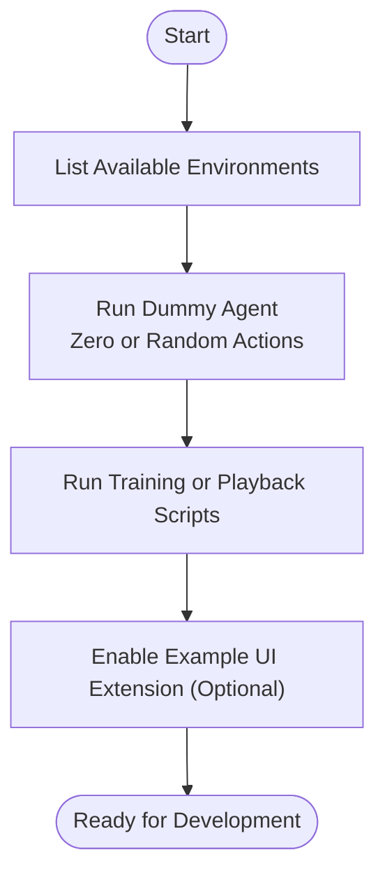
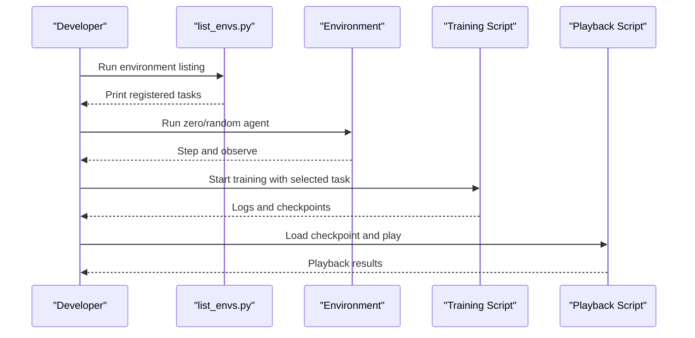

# Getting Started

<cite>
**Referenced Files in This Document**
- [README.md](file://README.md)
- [VERSION](file://VERSION)
- [pyproject.toml](file://pyproject.toml)
- [source/robot_lab/pyproject.toml](file://source/robot_lab/pyproject.toml)
- [source/robot_lab/setup.py](file://source/robot_lab/setup.py)
- [source/robot_lab/config/extension.toml](file://source/robot_lab/config/extension.toml)
- [scripts/tools/list_envs.py](file://scripts/tools/list_envs.py)
- [.vscode/tasks.json](file://.vscode/tasks.json)
- [.vscode/settings.json](file://.vscode/settings.json)
- [docker/docker-compose.yaml](file://docker/docker-compose.yaml)
- [docker/Dockerfile](file://docker/Dockerfile)
- [scripts/tools/zero_agent.py](file://scripts/tools/zero_agent.py)
- [scripts/tools/random_agent.py](file://scripts/tools/random_agent.py)
- [source/robot_lab/robot_lab/ui_extension_example.py](file://source/robot_lab/robot_lab/ui_extension_example.py)
</cite>

## Table of Contents
1. [Introduction](#introduction)
2. [Prerequisites](#prerequisites)
3. [Installation](#installation)
4. [Verification](#verification)
5. [IDE Setup](#ide-setup)
6. [Docker Deployment](#docker-deployment)
7. [Development Workflow](#development-workflow)
8. [Version Compatibility and Dependencies](#version-compatibility-and-dependencies)
9. [Practical Examples](#practical-examples)
10. [Troubleshooting](#troubleshooting)
11. [Conclusion](#conclusion)

## Introduction
This guide helps you install and set up the Robot Lab framework, which extends Isaac Lab with reinforcement learning environments for robotics. It covers prerequisites, step-by-step installation, verification, IDE setup, Docker deployment, and practical examples to validate your environment.

## Prerequisites
Before installing Robot Lab, ensure you have:
- Basic reinforcement learning concepts (environments, agents, policies, rewards, episodes)
- Familiarity with Python programming (packages, virtual environments, pip)
- Basic robotics fundamentals (kinematics, dynamics, sensors, actuators)
- Simulation environment experience (Isaac Sim, Omniverse)
- A compatible operating system and hardware (see version compatibility matrix)

## Installation
Follow these steps to install Robot Lab:

1) Install Isaac Lab by following the official installation guide. The repository recommends using conda to simplify terminal execution.
2) Clone Robot Lab separately from the Isaac Lab installation (outside the IsaacLab directory):
   - Clone the repository to your desired location.
3) Install the Robot Lab package in editable mode using the Python interpreter that has Isaac Lab installed:
   - Run the editable install command targeting the package source directory.

After installation, verify that the extension is correctly installed by listing available environments.

**Section sources**
- [README.md](file://README.md#L58-L78)

## Verification
Run the environment listing script to confirm that Robot Lab environments are registered and visible:

- Execute the listing script to print all registered Robot Lab environments.

This step ensures that the environment registry is populated and your installation is functional.

**Section sources**
- [README.md](file://README.md#L74-L78)
- [scripts/tools/list_envs.py](file://scripts/tools/list_envs.py#L45-L75)

## IDE Setup
Optionally, configure your IDE for better development experience:

- In VSCode, run the setup task to generate a Python environment configuration that indexes Isaac Sim and Omniverse modules for IntelliSense. The task prompts for the absolute path to your Isaac Sim installation and writes a configuration file used by the editor.

**Section sources**
- [README.md](file://README.md#L80-L90)
- [.vscode/tasks.json](file://.vscode/tasks.json#L1-L23)

## Docker Deployment
Robot Lab supports containerized development. The repository provides a Docker Compose service and a Dockerfile tailored for Robot Lab on top of an Isaac Lab base image.

- Build the Robot Lab image using the provided compose configuration and environment file.
- Start the container interactively or in detached mode.
- Interact with the running container via exec.
- Stop and remove containers when finished.

Notes:
- The base Isaac Lab image must be built locally first (see the repository’s Docker setup section).
- The compose file mounts the project directory into the container and installs Robot Lab in editable mode.

**Section sources**
- [README.md](file://README.md#L113-L191)
- [docker/docker-compose.yaml](file://docker/docker-compose.yaml#L1-L37)
- [docker/Dockerfile](file://docker/Dockerfile#L1-L22)

## Development Workflow
This section outlines recommended workflows for local development and extension integration.

- Environment Listing: Use the environment listing script to discover available tasks.
- Dummy Agents: Validate environment configuration quickly using zero-action and random-agent scripts.
- Training and Playback: Use the provided training and playback scripts for supported RL frameworks to run experiments.
- Omniverse Extension: Optionally enable the example UI extension to integrate with Omniverse.

**Diagram sources**
- [scripts/tools/list_envs.py](file://scripts/tools/list_envs.py#L45-L75)
- [scripts/tools/zero_agent.py](file://scripts/tools/zero_agent.py#L47-L75)
- [scripts/tools/random_agent.py](file://scripts/tools/random_agent.py#L47-L75)
- [source/robot_lab/robot_lab/ui_extension_example.py](file://source/robot_lab/robot_lab/ui_extension_example.py#L18-L49)

**Section sources**
- [README.md](file://README.md#L193-L347)
- [scripts/tools/zero_agent.py](file://scripts/tools/zero_agent.py#L47-L75)
- [scripts/tools/random_agent.py](file://scripts/tools/random_agent.py#L47-L75)
- [source/robot_lab/robot_lab/ui_extension_example.py](file://source/robot_lab/robot_lab/ui_extension_example.py#L18-L49)

## Version Compatibility and Dependencies
- Version compatibility: Align Robot Lab with the corresponding Isaac Lab and Isaac Sim versions as per the compatibility table.
- Python version: The project targets Python 3.11 for development and type checking, with a minimum requirement of Python 3.10 for installation.
- Package metadata: The package declares dependencies on core Isaac Lab extensions and optional RL libraries.

Key references:
- Version compatibility matrix
- Toolchain and type-checker configuration
- Package setup and install requirements

**Section sources**
- [README.md](file://README.md#L48-L57)
- [pyproject.toml](file://pyproject.toml#L207-L229)
- [source/robot_lab/setup.py](file://source/robot_lab/setup.py#L43-L51)
- [VERSION](file://VERSION#L1-L2)

## Practical Examples
Below are practical examples to validate your setup and run initial tasks.

- List environments to confirm registration:
  - Use the environment listing script to print all Robot Lab tasks.
- Run a zero-action agent:
  - Validates environment creation and stepping without learning.
- Run a random-action agent:
  - Exercises action sampling and environment stepping.
- Train and play with RSL-RL:
  - Use the provided training and playback scripts with a chosen environment name.
- Optional: Enable the Omniverse UI extension:
  - Configure the extension search paths and toggle the extension in Omniverse.

**Diagram sources**
- [scripts/tools/list_envs.py](file://scripts/tools/list_envs.py#L45-L75)
- [scripts/tools/zero_agent.py](file://scripts/tools/zero_agent.py#L47-L75)
- [scripts/tools/random_agent.py](file://scripts/tools/random_agent.py#L47-L75)
- [README.md](file://README.md#L197-L216)

**Section sources**
- [README.md](file://README.md#L74-L78)
- [scripts/tools/list_envs.py](file://scripts/tools/list_envs.py#L45-L75)
- [scripts/tools/zero_agent.py](file://scripts/tools/zero_agent.py#L47-L75)
- [scripts/tools/random_agent.py](file://scripts/tools/random_agent.py#L47-L75)
- [README.md](file://README.md#L197-L216)

## Troubleshooting
Common issues and resolutions:

- IDE indexing problems:
  - If the IDE lacks indexing for Omniverse/Isaac Lab extensions, add the required paths to the IDE settings.
- USD cache cleanup:
  - Temporary USD cache directories can accumulate during simulations; remove them to reclaim disk space.
- Extension search paths:
  - Ensure the extension search paths include both Robot Lab and Isaac Lab directories for proper discovery.

**Section sources**
- [README.md](file://README.md#L452-L481)

## Conclusion
You have installed Robot Lab, verified the environment registry, configured your IDE, optionally deployed via Docker, and validated your setup with dummy agents and example scripts. You are now ready to explore the provided RL environments and begin training or playback workflows.