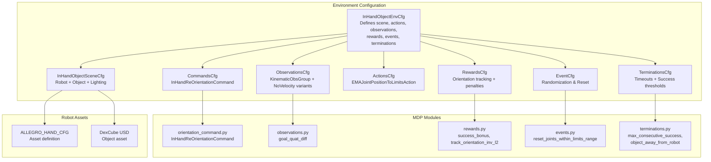
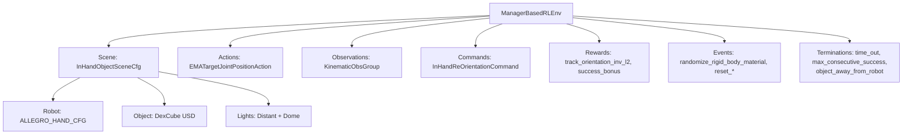
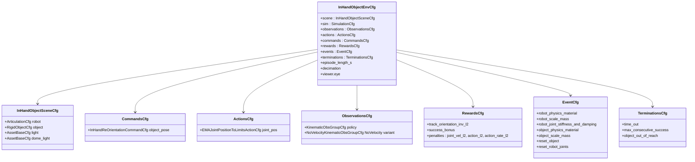
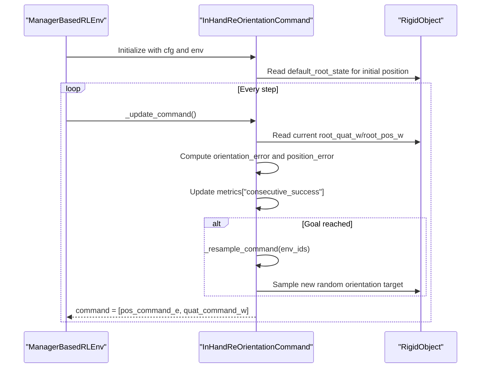
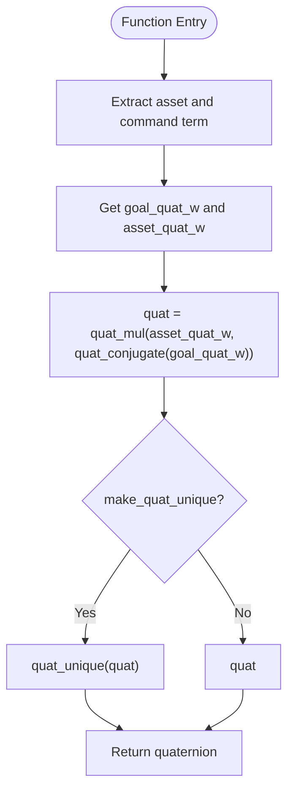
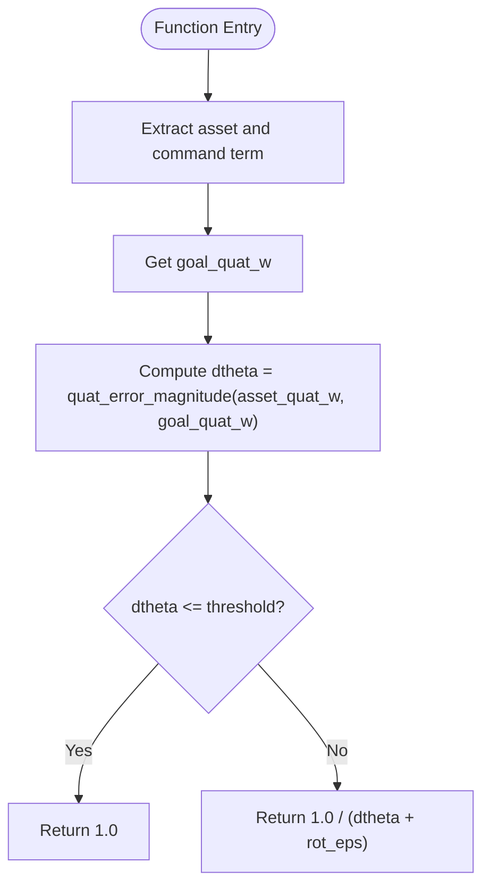
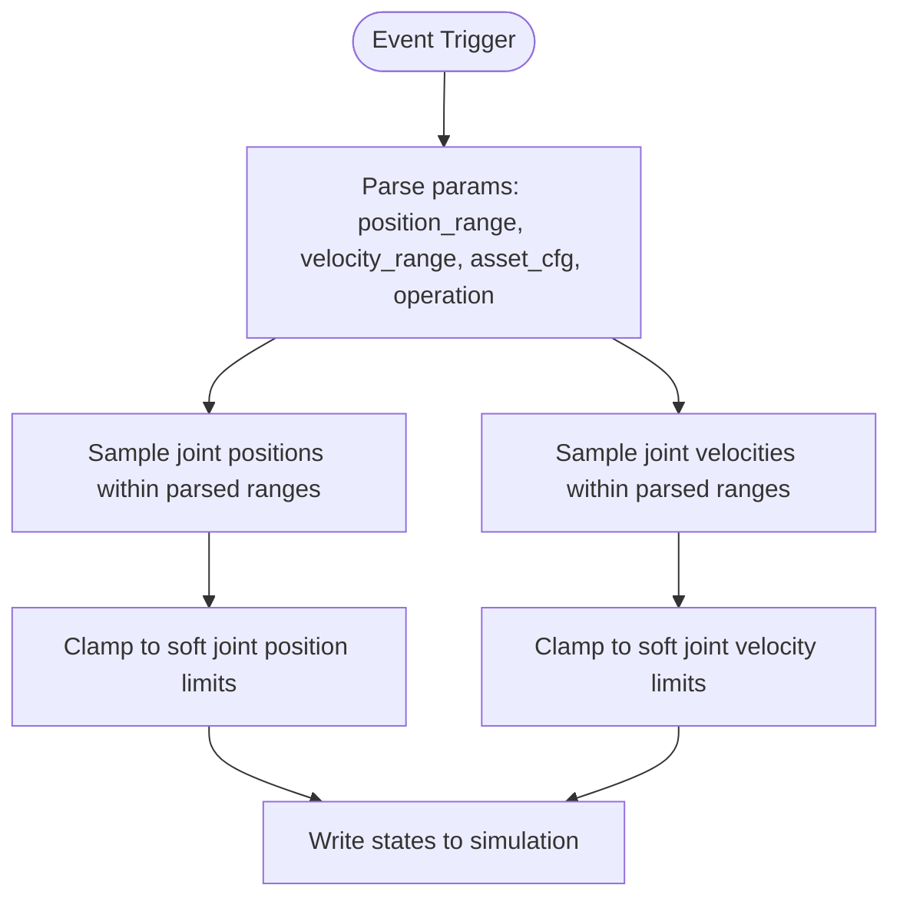
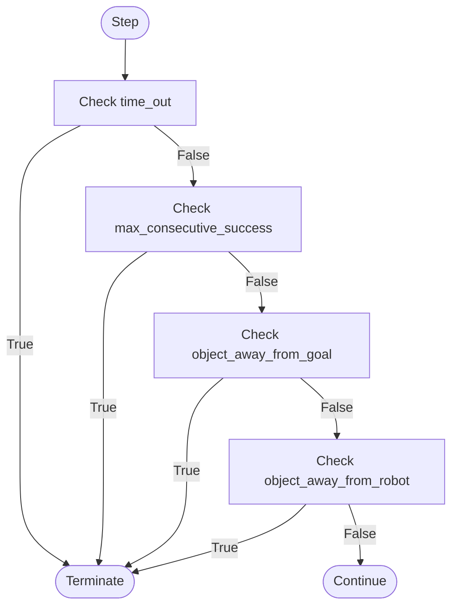
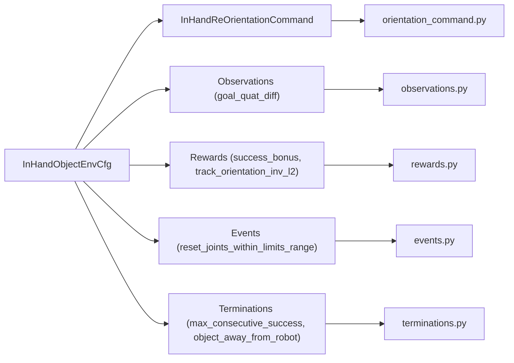

# In-Hand Manipulation

<cite>
**Referenced Files in This Document**
- [README.md](file://README.md)
- [inhand_env_cfg.py](file://source/robot_lab/robot_lab/tasks/manager_based/manipulation/inhand/inhand_env_cfg.py)
- [allegro_env_cfg.py](file://source/robot_lab/robot_lab/tasks/manager_based/manipulation/inhand/config/allegro_hand/allegro_env_cfg.py)
- [commands_cfg.py](file://source/robot_lab/robot_lab/tasks/manager_based/manipulation/inhand/mdp/commands/commands_cfg.py)
- [orientation_command.py](file://source/robot_lab/robot_lab/tasks/manager_based/manipulation/inhand/mdp/commands/orientation_command.py)
- [observations.py](file://source/robot_lab/robot_lab/tasks/manager_based/manipulation/inhand/mdp/observations.py)
- [rewards.py](file://source/robot_lab/robot_lab/tasks/manager_based/manipulation/inhand/mdp/rewards.py)
- [events.py](file://source/robot_lab/robot_lab/tasks/manager_based/manipulation/inhand/mdp/events.py)
- [terminations.py](file://source/robot_lab/robot_lab/tasks/manager_based/manipulation/inhand/mdp/terminations.py)
</cite>

## Table of Contents
1. [Introduction](#introduction)
2. [Project Structure](#project-structure)
3. [Core Components](#core-components)
4. [Architecture Overview](#architecture-overview)
5. [Detailed Component Analysis](#detailed-component-analysis)
6. [Dependency Analysis](#dependency-analysis)
7. [Performance Considerations](#performance-considerations)
8. [Troubleshooting Guide](#troubleshooting-guide)
9. [Conclusion](#conclusion)

## Introduction
This document describes the in-hand manipulation capabilities implemented in the robot lab project. The focus is on enabling a robotic hand to reorient a small object (such as a cube) held within its grasp using reinforcement learning. The environment supports both full-kinematic observations (including velocities) and reduced-kinematic observations (without velocities), and it integrates with advanced robotic assets such as the Allegro hand. The system leverages the Manager-Based Reinforcement Learning framework provided by Isaac Lab to configure scenes, actions, observations, rewards, events, and terminations.

## Project Structure
The in-hand manipulation implementation is organized around a modular configuration and MDP (Markov Decision Process) structure:
- Environment configuration defines the scene, simulation parameters, and task-specific MDP components.
- Robot and object assets are configured via asset definitions and spawn parameters.
- MDP modules encapsulate command generation, observations, rewards, events, and termination conditions.
- Agent configurations for training and evaluation are provided under dedicated agent directories.

**Diagram sources**
- [inhand_env_cfg.py:33-347](file://source/robot_lab/robot_lab/tasks/manager_based/manipulation/inhand/inhand_env_cfg.py#L33-L347)
- [orientation_command.py:25-145](file://source/robot_lab/robot_lab/tasks/manager_based/manipulation/inhand/mdp/commands/orientation_command.py#L25-L145)
- [observations.py:20-39](file://source/robot_lab/robot_lab/tasks/manager_based/manipulation/inhand/mdp/observations.py#L20-L39)
- [rewards.py:20-97](file://source/robot_lab/robot_lab/tasks/manager_based/manipulation/inhand/mdp/rewards.py#L20-L97)
- [events.py:22-185](file://source/robot_lab/robot_lab/tasks/manager_based/manipulation/inhand/mdp/events.py#L22-L185)
- [terminations.py:18-84](file://source/robot_lab/robot_lab/tasks/manager_based/manipulation/inhand/mdp/terminations.py#L18-L84)

**Section sources**
- [README.md:11-531](file://README.md#L11-L531)
- [inhand_env_cfg.py:33-347](file://source/robot_lab/robot_lab/tasks/manager_based/manipulation/inhand/inhand_env_cfg.py#L33-L347)

## Core Components
- Environment configuration: Defines the scene with a robotic hand and a deformable or rigid object, sets simulation parameters, and aggregates MDP components.
- Command generator: Produces orientation goals for the object and updates goals upon successful completion.
- Observations: Provides kinematic state observations (with or without velocities) and derived quantities such as goal orientation differences.
- Rewards: Encourages orientation tracking and success, with penalties for excessive joint velocities and action rates.
- Events: Randomizes physical properties and resets robot/object states at episode start/reset.
- Termination conditions: Ends episodes based on timeouts, success streaks, or object drift from goal or robot.

Key implementation references:
- Environment configuration and MDP components: [inhand_env_cfg.py:33-347](file://source/robot_lab/robot_lab/tasks/manager_based/manipulation/inhand/inhand_env_cfg.py#L33-L347)
- Command configuration and generator: [commands_cfg.py:17-68](file://source/robot_lab/robot_lab/tasks/manager_based/manipulation/inhand/mdp/commands/commands_cfg.py#L17-L68), [orientation_command.py:25-145](file://source/robot_lab/robot_lab/tasks/manager_based/manipulation/inhand/mdp/commands/orientation_command.py#L25-L145)
- Observations: [observations.py:20-39](file://source/robot_lab/robot_lab/tasks/manager_based/manipulation/inhand/mdp/observations.py#L20-L39)
- Rewards: [rewards.py:20-97](file://source/robot_lab/robot_lab/tasks/manager_based/manipulation/inhand/mdp/rewards.py#L20-L97)
- Events: [events.py:22-185](file://source/robot_lab/robot_lab/tasks/manager_based/manipulation/inhand/mdp/events.py#L22-L185)
- Termination conditions: [terminations.py:18-84](file://source/robot_lab/robot_lab/tasks/manager_based/manipulation/inhand/mdp/terminations.py#L18-L84)

**Section sources**
- [inhand_env_cfg.py:33-347](file://source/robot_lab/robot_lab/tasks/manager_based/manipulation/inhand/inhand_env_cfg.py#L33-L347)
- [commands_cfg.py:17-68](file://source/robot_lab/robot_lab/tasks/manager_based/manipulation/inhand/mdp/commands/commands_cfg.py#L17-L68)
- [orientation_command.py:25-145](file://source/robot_lab/robot_lab/tasks/manager_based/manipulation/inhand/mdp/commands/orientation_command.py#L25-L145)
- [observations.py:20-39](file://source/robot_lab/robot_lab/tasks/manager_based/manipulation/inhand/mdp/observations.py#L20-L39)
- [rewards.py:20-97](file://source/robot_lab/robot_lab/tasks/manager_based/manipulation/inhand/mdp/rewards.py#L20-L97)
- [events.py:22-185](file://source/robot_lab/robot_lab/tasks/manager_based/manipulation/inhand/mdp/events.py#L22-L185)
- [terminations.py:18-84](file://source/robot_lab/robot_lab/tasks/manager_based/manipulation/inhand/mdp/terminations.py#L18-L84)

## Architecture Overview
The in-hand manipulation system is structured around a Manager-Based RL environment. The configuration composes:
- Scene: robot asset (e.g., Allegro hand) and object asset (e.g., DexCube).
- Actions: joint position commands constrained to actuator limits.
- Observations: robot joint positions/velocities and object root pose/velocity, plus derived command-related signals.
- Rewards: orientation tracking reward, success bonus, and penalty terms.
- Events: randomized material and mass properties, and joint/state resets.
- Termination: timeout, success streak, and object drift checks.

**Diagram sources**
- [inhand_env_cfg.py:33-347](file://source/robot_lab/robot_lab/tasks/manager_based/manipulation/inhand/inhand_env_cfg.py#L33-L347)
- [allegro_env_cfg.py:16-67](file://source/robot_lab/robot_lab/tasks/manager_based/manipulation/inhand/config/allegro_hand/allegro_env_cfg.py#L16-L67)

**Section sources**
- [inhand_env_cfg.py:33-347](file://source/robot_lab/robot_lab/tasks/manager_based/manipulation/inhand/inhand_env_cfg.py#L33-L347)
- [allegro_env_cfg.py:16-67](file://source/robot_lab/robot_lab/tasks/manager_based/manipulation/inhand/config/allegro_hand/allegro_env_cfg.py#L16-L67)

## Detailed Component Analysis

### Environment Configuration
The environment configuration defines:
- Scene: number of environments, spacing, robot asset, object asset with physics properties, and lighting.
- Simulation: physics material and PhysX settings.
- MDP components: commands, actions, observations, rewards, events, and terminations.
- Episode timing: decimation, episode length, and simulation timestep.

**Diagram sources**
- [inhand_env_cfg.py:33-347](file://source/robot_lab/robot_lab/tasks/manager_based/manipulation/inhand/inhand_env_cfg.py#L33-L347)

**Section sources**
- [inhand_env_cfg.py:33-347](file://source/robot_lab/robot_lab/tasks/manager_based/manipulation/inhand/inhand_env_cfg.py#L33-L347)

### Command Generation: In-Hand Re-Orientation
The command generator produces orientation goals for the object and updates them upon success. It maintains per-environment metrics for orientation and position errors and tracks consecutive successes.

**Diagram sources**
- [orientation_command.py:25-145](file://source/robot_lab/robot_lab/tasks/manager_based/manipulation/inhand/mdp/commands/orientation_command.py#L25-L145)

**Section sources**
- [commands_cfg.py:17-68](file://source/robot_lab/robot_lab/tasks/manager_based/manipulation/inhand/mdp/commands/commands_cfg.py#L17-L68)
- [orientation_command.py:25-145](file://source/robot_lab/robot_lab/tasks/manager_based/manipulation/inhand/mdp/commands/orientation_command.py#L25-L145)

### Observations: Goal Orientation Difference
The observation module computes the quaternion difference between the object's current orientation and the goal orientation, ensuring a unique quaternion representation.

**Diagram sources**
- [observations.py:20-39](file://source/robot_lab/robot_lab/tasks/manager_based/manipulation/inhand/mdp/observations.py#L20-L39)

**Section sources**
- [observations.py:20-39](file://source/robot_lab/robot_lab/tasks/manager_based/manipulation/inhand/mdp/observations.py#L20-L39)

### Rewards: Orientation Tracking and Success Bonus
Reward computation includes:
- Orientation tracking reward using inverse of orientation error magnitude.
- Success bonus when the orientation error is below a threshold.
- Penalty terms for joint velocities, action magnitudes, and action rate.

**Diagram sources**
- [rewards.py:20-97](file://source/robot_lab/robot_lab/tasks/manager_based/manipulation/inhand/mdp/rewards.py#L20-L97)

**Section sources**
- [rewards.py:20-97](file://source/robot_lab/robot_lab/tasks/manager_based/manipulation/inhand/mdp/rewards.py#L20-L97)

### Events: Randomization and Reset
Randomization and reset functions:
- Randomize rigid body materials and masses for robot and object.
- Reset robot joints within specified ranges and velocities.
- Reset object root state near its default position.

**Diagram sources**
- [events.py:22-185](file://source/robot_lab/robot_lab/tasks/manager_based/manipulation/inhand/mdp/events.py#L22-L185)

**Section sources**
- [events.py:22-185](file://source/robot_lab/robot_lab/tasks/manager_based/manipulation/inhand/mdp/events.py#L22-L185)

### Termination Conditions
Termination logic:
- Episode timeout after a fixed duration.
- Early termination if the object drifts too far from the goal or from the robot.
- Early termination if a success streak threshold is met.

**Diagram sources**
- [terminations.py:18-84](file://source/robot_lab/robot_lab/tasks/manager_based/manipulation/inhand/mdp/terminations.py#L18-L84)

**Section sources**
- [terminations.py:18-84](file://source/robot_lab/robot_lab/tasks/manager_based/manipulation/inhand/mdp/terminations.py#L18-L84)

## Dependency Analysis
The in-hand manipulation system exhibits clear separation of concerns:
- Environment configuration depends on MDP modules for commands, observations, rewards, events, and terminations.
- Command generator depends on the object asset and visualization markers for debugging.
- Observations and rewards depend on math utilities and asset state access.
- Events and terminations depend on environment managers and scene entities.

**Diagram sources**
- [inhand_env_cfg.py:33-347](file://source/robot_lab/robot_lab/tasks/manager_based/manipulation/inhand/inhand_env_cfg.py#L33-L347)
- [orientation_command.py:25-145](file://source/robot_lab/robot_lab/tasks/manager_based/manipulation/inhand/mdp/commands/orientation_command.py#L25-L145)
- [observations.py:20-39](file://source/robot_lab/robot_lab/tasks/manager_based/manipulation/inhand/mdp/observations.py#L20-L39)
- [rewards.py:20-97](file://source/robot_lab/robot_lab/tasks/manager_based/manipulation/inhand/mdp/rewards.py#L20-L97)
- [events.py:22-185](file://source/robot_lab/robot_lab/tasks/manager_based/manipulation/inhand/mdp/events.py#L22-L185)
- [terminations.py:18-84](file://source/robot_lab/robot_lab/tasks/manager_based/manipulation/inhand/mdp/terminations.py#L18-L84)

**Section sources**
- [inhand_env_cfg.py:33-347](file://source/robot_lab/robot_lab/tasks/manager_based/manipulation/inhand/inhand_env_cfg.py#L33-L347)
- [orientation_command.py:25-145](file://source/robot_lab/robot_lab/tasks/manager_based/manipulation/inhand/mdp/commands/orientation_command.py#L25-L145)
- [observations.py:20-39](file://source/robot_lab/robot_lab/tasks/manager_based/manipulation/inhand/mdp/observations.py#L20-L39)
- [rewards.py:20-97](file://source/robot_lab/robot_lab/tasks/manager_based/manipulation/inhand/mdp/rewards.py#L20-L97)
- [events.py:22-185](file://source/robot_lab/robot_lab/tasks/manager_based/manipulation/inhand/mdp/events.py#L22-L185)
- [terminations.py:18-84](file://source/robot_lab/robot_lab/tasks/manager_based/manipulation/inhand/mdp/terminations.py#L18-L84)

## Performance Considerations
- Observation bandwidth: Full-kinematic observations include velocities, which can increase communication overhead. The no-velocity variant reduces this load when velocity information is unnecessary.
- Action smoothing: Penalties on action and action rate help stabilize training and reduce jitter.
- Physics tuning: Simulation parameters (e.g., solver iterations, contact patch counts) impact stability and speed; adjust based on hardware and task requirements.
- Environment scaling: The default environment count is large to support efficient RL training; reduce for interactive play or debugging.

## Troubleshooting Guide
- Goals not updating: Verify that the command generator is configured to update goals on success and that the success threshold is appropriate.
- Object falling off: Increase the success threshold or adjust the constant position command offset to keep the object above the palm.
- Instability during training: Reduce action penalties or adjust simulation dt and render interval; ensure proper asset mass and friction settings.
- Visualization issues: Confirm debug visualization markers are enabled and properly positioned relative to the object.

**Section sources**
- [orientation_command.py:94-125](file://source/robot_lab/robot_lab/tasks/manager_based/manipulation/inhand/mdp/commands/orientation_command.py#L94-L125)
- [inhand_env_cfg.py:258-299](file://source/robot_lab/robot_lab/tasks/manager_based/manipulation/inhand/inhand_env_cfg.py#L258-L299)

## Conclusion
The in-hand manipulation system provides a robust, configurable framework for teaching robotic hands to reorient objects within a grasp. By combining precise command generation, tailored observations, and carefully designed rewards and termination conditions, the environment supports efficient reinforcement learning. The modular MDP structure enables easy adaptation to different robotic hands and objects, while agent configurations support scalable training and evaluation.