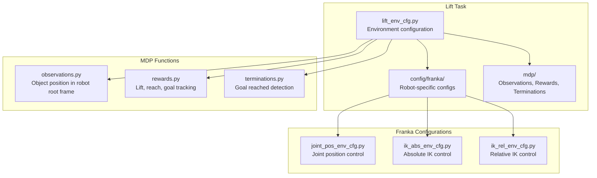
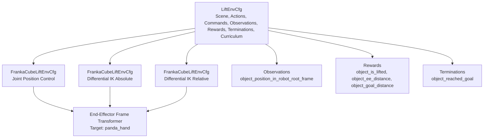
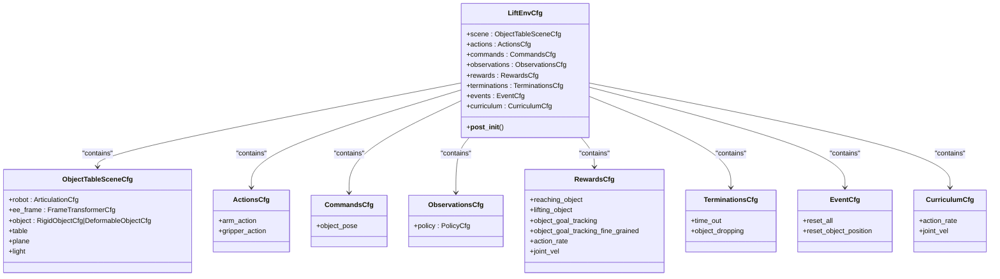
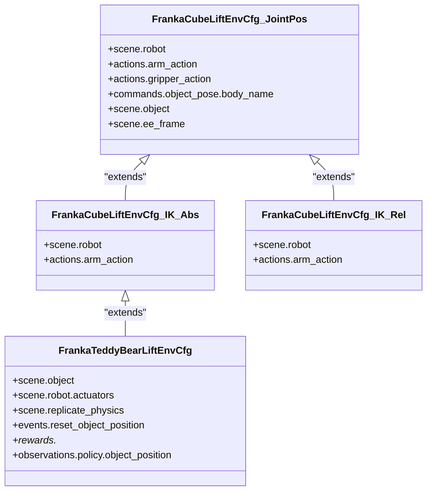
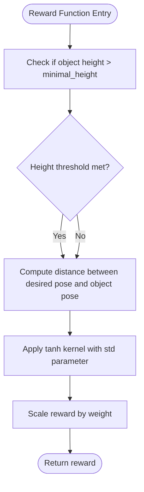
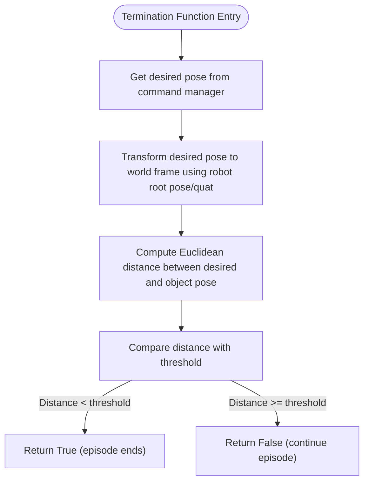
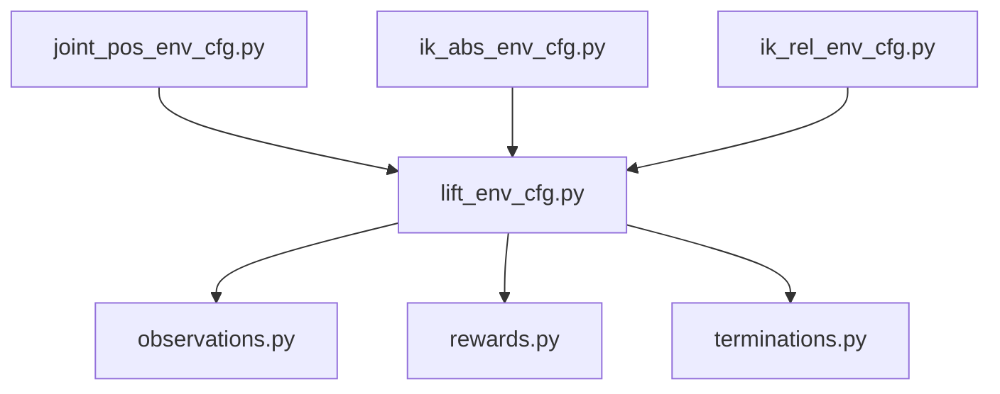

# Lifting Operations

<cite>
**Referenced Files in This Document**
- [lift_env_cfg.py](file://source/robot_lab/robot_lab/tasks/manager_based/manipulation/lift/lift_env_cfg.py)
- [rewards.py](file://source/robot_lab/robot_lab/tasks/manager_based/manipulation/lift/mdp/rewards.py)
- [observations.py](file://source/robot_lab/robot_lab/tasks/manager_based/manipulation/lift/mdp/observations.py)
- [terminations.py](file://source/robot_lab/robot_lab/tasks/manager_based/manipulation/lift/mdp/terminations.py)
- [joint_pos_env_cfg.py](file://source/robot_lab/robot_lab/tasks/manager_based/manipulation/lift/config/franka/joint_pos_env_cfg.py)
- [ik_abs_env_cfg.py](file://source/robot_lab/robot_lab/tasks/manager_based/manipulation/lift/config/franka/ik_abs_env_cfg.py)
- [ik_rel_env_cfg.py](file://source/robot_lab/robot_lab/tasks/manager_based/manipulation/lift/config/franka/ik_rel_env_cfg.py)
</cite>

## Table of Contents
1. [Introduction](#introduction)
2. [Project Structure](#project-structure)
3. [Core Components](#core-components)
4. [Architecture Overview](#architecture-overview)
5. [Detailed Component Analysis](#detailed-component-analysis)
6. [Dependency Analysis](#dependency-analysis)
7. [Performance Considerations](#performance-considerations)
8. [Troubleshooting Guide](#troubleshooting-guide)
9. [Conclusion](#conclusion)

## Introduction
This document describes the lifting operations implementation within the robot lab's manipulation task framework. It focuses on the lift task for fixed-arm robots, specifically configured for the Franka Panda manipulator. The lift task enables training and evaluation of robotic manipulation policies that:
- Reach toward a target object
- Grasp and lift the object above a minimum height
- Track a desired goal pose for the object in the world frame
- Terminate successfully when the object reaches the goal within a threshold

The lift task integrates with the Manager-Based Reinforcement Learning (RL) environment pattern, leveraging modular MDP components for observations, rewards, terminations, and events.

## Project Structure
The lifting operations are organized under the manipulation tasks module with a dedicated lift subpackage. The structure separates environment configurations (scene, actions, commands, rewards, terminations) from MDP-specific functions.

**Diagram sources**
- [lift_env_cfg.py:193-223](file://source/robot_lab/robot_lab/tasks/manager_based/manipulation/lift/lift_env_cfg.py#L193-L223)
- [joint_pos_env_cfg.py:24-94](file://source/robot_lab/robot_lab/tasks/manager_based/manipulation/lift/config/franka/joint_pos_env_cfg.py#L24-L94)
- [ik_abs_env_cfg.py:30-111](file://source/robot_lab/robot_lab/tasks/manager_based/manipulation/lift/config/franka/ik_abs_env_cfg.py#L30-L111)
- [ik_rel_env_cfg.py:18-49](file://source/robot_lab/robot_lab/tasks/manager_based/manipulation/lift/config/franka/ik_rel_env_cfg.py#L18-L49)
- [observations.py:19-30](file://source/robot_lab/robot_lab/tasks/manager_based/manipulation/lift/mdp/observations.py#L19-L30)
- [rewards.py:20-68](file://source/robot_lab/robot_lab/tasks/manager_based/manipulation/lift/mdp/rewards.py#L20-L68)
- [terminations.py:25-54](file://source/robot_lab/robot_lab/tasks/manager_based/manipulation/lift/mdp/terminations.py#L25-L54)

**Section sources**
- [lift_env_cfg.py:193-223](file://source/robot_lab/robot_lab/tasks/manager_based/manipulation/lift/lift_env_cfg.py#L193-L223)
- [joint_pos_env_cfg.py:24-94](file://source/robot_lab/robot_lab/tasks/manager_based/manipulation/lift/config/franka/joint_pos_env_cfg.py#L24-L94)
- [ik_abs_env_cfg.py:30-111](file://source/robot_lab/robot_lab/tasks/manager_based/manipulation/lift/config/franka/ik_abs_env_cfg.py#L30-L111)
- [ik_rel_env_cfg.py:18-49](file://source/robot_lab/robot_lab/tasks/manager_based/manipulation/lift/config/franka/ik_rel_env_cfg.py#L18-L49)
- [observations.py:19-30](file://source/robot_lab/robot_lab/tasks/manager_based/manipulation/lift/mdp/observations.py#L19-L30)
- [rewards.py:20-68](file://source/robot_lab/robot_lab/tasks/manager_based/manipulation/lift/mdp/rewards.py#L20-L68)
- [terminations.py:25-54](file://source/robot_lab/robot_lab/tasks/manager_based/manipulation/lift/mdp/terminations.py#L25-L54)

## Core Components
The lift task is composed of:
- Environment configuration defining scene, actions, commands, observations, rewards, terminations, and curriculum
- Robot-specific configurations for joint position control and differential inverse kinematics (absolute and relative modes)
- MDP functions for observations, rewards, and termination conditions

Key responsibilities:
- Scene: Defines robot, object, table, ground plane, lighting, and end-effector frame transformer
- Actions: Joint position control or differential inverse kinematics with optional gripper control
- Commands: Uniform pose command specifying target object pose in robot root frame
- Observations: Relative joint states, object position in robot root frame, target pose, last action
- Rewards: Reaching object (distance-based), lifting object (height-based), goal tracking (distance-based), action rate, joint velocity penalties
- Termination: Episode timeout and object dropping below minimum height
- Curriculum: Gradually increase weights of action rate and joint velocity penalties

**Section sources**
- [lift_env_cfg.py:31-223](file://source/robot_lab/robot_lab/tasks/manager_based/manipulation/lift/lift_env_cfg.py#L31-L223)
- [joint_pos_env_cfg.py:24-94](file://source/robot_lab/robot_lab/tasks/manager_based/manipulation/lift/config/franka/joint_pos_env_cfg.py#L24-L94)
- [ik_abs_env_cfg.py:30-111](file://source/robot_lab/robot_lab/tasks/manager_based/manipulation/lift/config/franka/ik_abs_env_cfg.py#L30-L111)
- [ik_rel_env_cfg.py:18-49](file://source/robot_lab/robot_lab/tasks/manager_based/manipulation/lift/config/franka/ik_rel_env_cfg.py#L18-L49)
- [rewards.py:20-68](file://source/robot_lab/robot_lab/tasks/manager_based/manipulation/lift/mdp/rewards.py#L20-L68)
- [observations.py:19-30](file://source/robot_lab/robot_lab/tasks/manager_based/manipulation/lift/mdp/observations.py#L19-L30)
- [terminations.py:25-54](file://source/robot_lab/robot_lab/tasks/manager_based/manipulation/lift/mdp/terminations.py#L25-L54)

## Architecture Overview
The lift task architecture follows a modular design:
- Environment configuration aggregates MDP components
- Robot-specific configurations specialize actions and gripper behavior
- MDP functions encapsulate computation for observations, rewards, and terminations
- End-effector frame transformer provides target frame for IK actions

**Diagram sources**
- [lift_env_cfg.py:193-223](file://source/robot_lab/robot_lab/tasks/manager_based/manipulation/lift/lift_env_cfg.py#L193-L223)
- [joint_pos_env_cfg.py:24-94](file://source/robot_lab/robot_lab/tasks/manager_based/manipulation/lift/config/franka/joint_pos_env_cfg.py#L24-L94)
- [ik_abs_env_cfg.py:30-111](file://source/robot_lab/robot_lab/tasks/manager_based/manipulation/lift/config/franka/ik_abs_env_cfg.py#L30-L111)
- [ik_rel_env_cfg.py:18-49](file://source/robot_lab/robot_lab/tasks/manager_based/manipulation/lift/config/franka/ik_rel_env_cfg.py#L18-L49)
- [observations.py:19-30](file://source/robot_lab/robot_lab/tasks/manager_based/manipulation/lift/mdp/observations.py#L19-L30)
- [rewards.py:20-68](file://source/robot_lab/robot_lab/tasks/manager_based/manipulation/lift/mdp/rewards.py#L20-L68)
- [terminations.py:25-54](file://source/robot_lab/robot_lab/tasks/manager_based/manipulation/lift/mdp/terminations.py#L25-L54)

## Detailed Component Analysis

### Environment Configuration
The environment configuration defines the base lift environment with:
- Scene: Robot, object, table, ground plane, lighting, and end-effector frame transformer
- Commands: Uniform pose command for object target pose
- Actions: Arm action (joint position or differential IK) and gripper action
- Observations: Concatenated policy observations including joint positions/velocities, object position in robot root frame, target object position, and last action
- Rewards: Reaching object, lifting object, goal tracking, action rate, and joint velocity penalties
- Termination: Episode timeout and object dropping below minimum height
- Curriculum: Increasing weights for action rate and joint velocity penalties over time

**Diagram sources**
- [lift_env_cfg.py:31-223](file://source/robot_lab/robot_lab/tasks/manager_based/manipulation/lift/lift_env_cfg.py#L31-L223)

**Section sources**
- [lift_env_cfg.py:31-223](file://source/robot_lab/robot_lab/tasks/manager_based/manipulation/lift/lift_env_cfg.py#L31-L223)

### Robot-Specific Configurations
Robot-specific configurations specialize the lift environment for the Franka Panda:
- Joint position control: Defines joint position action for arm and binary gripper action for fingers
- Differential IK absolute control: Uses absolute pose commands with a DLS IK solver and optional body offset
- Differential IK relative control: Uses relative pose commands with a DLS IK solver and scaling factor
- Teddy bear variant: Demonstrates deformable object handling with adjusted actuator limits and disabled physics replication

**Diagram sources**
- [joint_pos_env_cfg.py:24-94](file://source/robot_lab/robot_lab/tasks/manager_based/manipulation/lift/config/franka/joint_pos_env_cfg.py#L24-L94)
- [ik_abs_env_cfg.py:30-111](file://source/robot_lab/robot_lab/tasks/manager_based/manipulation/lift/config/franka/ik_abs_env_cfg.py#L30-L111)
- [ik_rel_env_cfg.py:18-49](file://source/robot_lab/robot_lab/tasks/manager_based/manipulation/lift/config/franka/ik_rel_env_cfg.py#L18-L49)

**Section sources**
- [joint_pos_env_cfg.py:24-94](file://source/robot_lab/robot_lab/tasks/manager_based/manipulation/lift/config/franka/joint_pos_env_cfg.py#L24-L94)
- [ik_abs_env_cfg.py:30-111](file://source/robot_lab/robot_lab/tasks/manager_based/manipulation/lift/config/franka/ik_abs_env_cfg.py#L30-L111)
- [ik_rel_env_cfg.py:18-49](file://source/robot_lab/robot_lab/tasks/manager_based/manipulation/lift/config/franka/ik_rel_env_cfg.py#L18-L49)

### MDP Functions

#### Observations
- Object position in robot root frame: Transforms object world position into the robot's root frame for policy observation

**Section sources**
- [observations.py:19-30](file://source/robot_lab/robot_lab/tasks/manager_based/manipulation/lift/mdp/observations.py#L19-L30)

#### Rewards
- Object lifted: Binary reward when object height exceeds minimal height
- Object-to-end-effector distance: Distance-based reward using a tanh kernel for reaching
- Object goal distance: Goal-tracking reward combining distance and height thresholds

**Diagram sources**
- [rewards.py:20-68](file://source/robot_lab/robot_lab/tasks/manager_based/manipulation/lift/mdp/rewards.py#L20-L68)

**Section sources**
- [rewards.py:20-68](file://source/robot_lab/robot_lab/tasks/manager_based/manipulation/lift/mdp/rewards.py#L20-L68)

#### Termination
- Object reached goal: Episode terminates when object reaches desired pose within a threshold

**Diagram sources**
- [terminations.py:25-54](file://source/robot_lab/robot_lab/tasks/manager_based/manipulation/lift/mdp/terminations.py#L25-L54)

**Section sources**
- [terminations.py:25-54](file://source/robot_lab/robot_lab/tasks/manager_based/manipulation/lift/mdp/terminations.py#L25-L54)

## Dependency Analysis
The lift task exhibits clear separation of concerns:
- Environment configuration depends on MDP modules for observations, rewards, and terminations
- Robot-specific configurations inherit from the base environment and override actions and gripper behavior
- MDP functions depend on environment scene assets and command manager for pose computations

**Diagram sources**
- [lift_env_cfg.py:31-223](file://source/robot_lab/robot_lab/tasks/manager_based/manipulation/lift/lift_env_cfg.py#L31-L223)
- [observations.py:19-30](file://source/robot_lab/robot_lab/tasks/manager_based/manipulation/lift/mdp/observations.py#L19-L30)
- [rewards.py:20-68](file://source/robot_lab/robot_lab/tasks/manager_based/manipulation/lift/mdp/rewards.py#L20-L68)
- [terminations.py:25-54](file://source/robot_lab/robot_lab/tasks/manager_based/manipulation/lift/mdp/terminations.py#L25-L54)
- [joint_pos_env_cfg.py:24-94](file://source/robot_lab/robot_lab/tasks/manager_based/manipulation/lift/config/franka/joint_pos_env_cfg.py#L24-L94)
- [ik_abs_env_cfg.py:30-111](file://source/robot_lab/robot_lab/tasks/manager_based/manipulation/lift/config/franka/ik_abs_env_cfg.py#L30-L111)
- [ik_rel_env_cfg.py:18-49](file://source/robot_lab/robot_lab/tasks/manager_based/manipulation/lift/config/franka/ik_rel_env_cfg.py#L18-L49)

**Section sources**
- [lift_env_cfg.py:31-223](file://source/robot_lab/robot_lab/tasks/manager_based/manipulation/lift/lift_env_cfg.py#L31-L223)
- [joint_pos_env_cfg.py:24-94](file://source/robot_lab/robot_lab/tasks/manager_based/manipulation/lift/config/franka/joint_pos_env_cfg.py#L24-L94)
- [ik_abs_env_cfg.py:30-111](file://source/robot_lab/robot_lab/tasks/manager_based/manipulation/lift/config/franka/ik_abs_env_cfg.py#L30-L111)
- [ik_rel_env_cfg.py:18-49](file://source/robot_lab/robot_lab/tasks/manager_based/manipulation/lift/config/franka/ik_rel_env_cfg.py#L18-L49)
- [observations.py:19-30](file://source/robot_lab/robot_lab/tasks/manager_based/manipulation/lift/mdp/observations.py#L19-L30)
- [rewards.py:20-68](file://source/robot_lab/robot_lab/tasks/manager_based/manipulation/lift/mdp/rewards.py#L20-L68)
- [terminations.py:25-54](file://source/robot_lab/robot_lab/tasks/manager_based/manipulation/lift/mdp/terminations.py#L25-L54)

## Performance Considerations
- Simulation settings: The environment uses a 100 Hz simulation step with PhysX tuned parameters for bounce threshold velocity and friction correlation distance
- Action decimation: Episode length and render interval are configured to balance training speed and fidelity
- IK solver: Differential IK uses a Damped Least Squares (DLS) method for robust pose tracking; absolute vs relative modes affect convergence behavior
- Curriculum: Gradual increase in action rate and joint velocity penalties encourages stable policy learning

[No sources needed since this section provides general guidance]

## Troubleshooting Guide
Common issues and resolutions:
- IK tracking instability: Switch to absolute IK mode or adjust solver damping and gains
- Gripper control mismatch: Verify joint names and open/close command expressions match the robot model
- Object dropping: Increase minimal height threshold or adjust termination conditions
- Deformable object handling: Adjust actuator effort limits and disable physics replication as demonstrated in the Teddy Bear variant

**Section sources**
- [ik_abs_env_cfg.py:30-111](file://source/robot_lab/robot_lab/tasks/manager_based/manipulation/lift/config/franka/ik_abs_env_cfg.py#L30-L111)
- [joint_pos_env_cfg.py:24-94](file://source/robot_lab/robot_lab/tasks/manager_based/manipulation/lift/config/franka/joint_pos_env_cfg.py#L24-L94)
- [terminations.py:25-54](file://source/robot_lab/robot_lab/tasks/manager_based/manipulation/lift/mdp/terminations.py#L25-L54)

## Conclusion
The lifting operations implementation provides a flexible and modular framework for training robotic manipulation policies. By separating environment configuration from robot-specific controls and MDP functions, the system supports rapid experimentation with different control modalities (joint position vs differential IK) and robot models. The use of standardized MDP components ensures consistent reward shaping and termination logic across tasks, while curriculum mechanisms support stable policy learning.