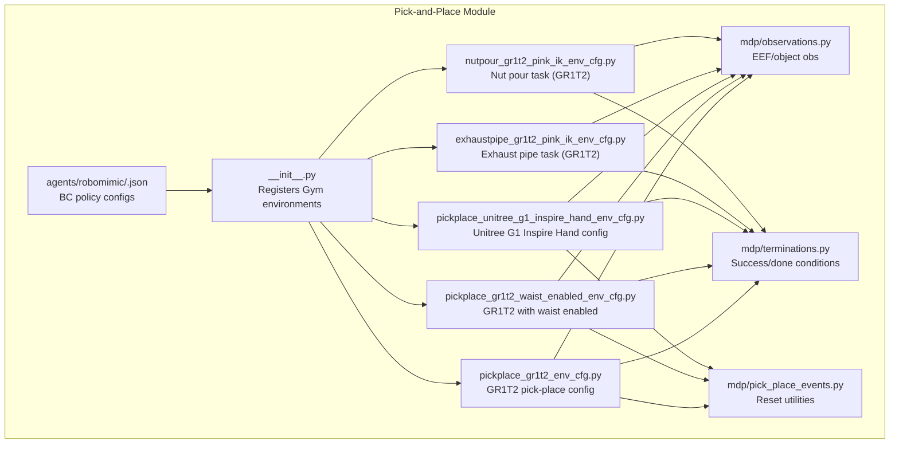
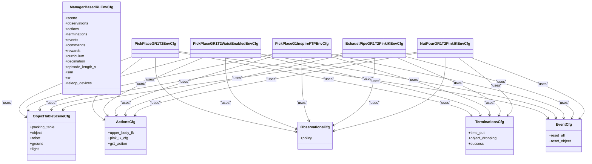
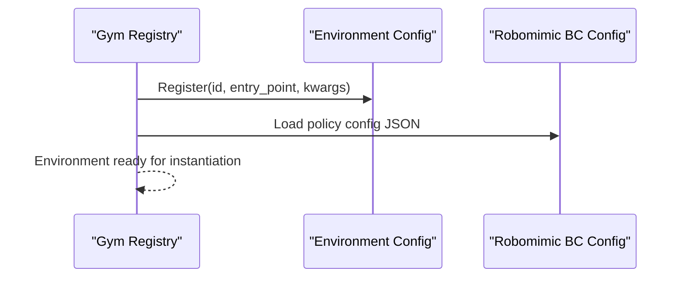
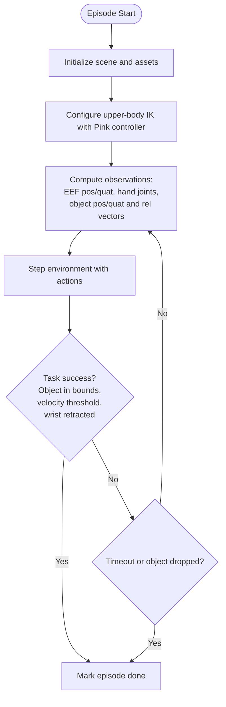
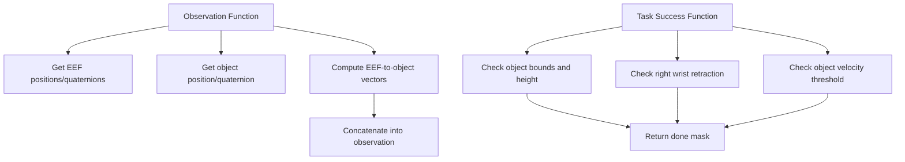
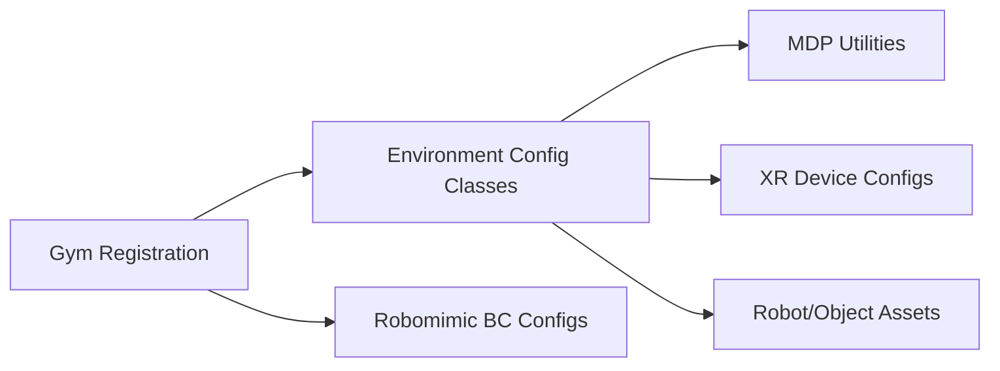

# Pick-and-Place Tasks

<cite>
**Referenced Files in This Document**
- [__init__.py](file://source/robot_lab/robot_lab/tasks/manager_based/manipulation/pick_place/__init__.py)
- [pickplace_gr1t2_env_cfg.py](file://source/robot_lab/robot_lab/tasks/manager_based/manipulation/pick_place/pickplace_gr1t2_env_cfg.py)
- [pickplace_gr1t2_waist_enabled_env_cfg.py](file://source/robot_lab/robot_lab/tasks/manager_based/manipulation/pick_place/pickplace_gr1t2_waist_enabled_env_cfg.py)
- [pickplace_unitree_g1_inspire_hand_env_cfg.py](file://source/robot_lab/robot_lab/tasks/manager_based/manipulation/pick_place/pickplace_unitree_g1_inspire_hand_env_cfg.py)
- [exhaustpipe_gr1t2_pink_ik_env_cfg.py](file://source/robot_lab/robot_lab/tasks/manager_based/manipulation/pick_place/exhaustpipe_gr1t2_pink_ik_env_cfg.py)
- [nutpour_gr1t2_pink_ik_env_cfg.py](file://source/robot_lab/robot_lab/tasks/manager_based/manipulation/pick_place/nutpour_gr1t2_pink_ik_env_cfg.py)
- [observations.py](file://source/robot_lab/robot_lab/tasks/manager_based/manipulation/pick_place/mdp/observations.py)
- [terminations.py](file://source/robot_lab/robot_lab/tasks/manager_based/manipulation/pick_place/mdp/terminations.py)
- [pick_place_events.py](file://source/robot_lab/robot_lab/tasks/manager_based/manipulation/pick_place/mdp/pick_place_events.py)
- [bc_rnn_low_dim.json](file://source/robot_lab/robot_lab/tasks/manager_based/manipulation/pick_place/agents/robomimic/bc_rnn_low_dim.json)
- [bc_rnn_image_exhaust_pipe.json](file://source/robot_lab/robot_lab/tasks/manager_based/manipulation/pick_place/agents/robomimic/bc_rnn_image_exhaust_pipe.json)
- [bc_rnn_image_nut_pouring.json](file://source/robot_lab/robot_lab/tasks/manager_based/manipulation/pick_place/agents/robomimic/bc_rnn_image_nut_pouring.json)
</cite>

## Table of Contents
1. [Introduction](#introduction)
2. [Project Structure](#project-structure)
3. [Core Components](#core-components)
4. [Architecture Overview](#architecture-overview)
5. [Detailed Component Analysis](#detailed-component-analysis)
6. [Dependency Analysis](#dependency-analysis)
7. [Performance Considerations](#performance-considerations)
8. [Troubleshooting Guide](#troubleshooting-guide)
9. [Conclusion](#conclusion)

## Introduction
This document explains the pick-and-place task implementations in the robot lab codebase. It focuses on the manager-based manipulation framework that enables:
- Pick-and-place with upper-body inverse kinematics control
- Robot-specific variants (GR1T2 and Unitree G1 Inspire Hand)
- XR teleoperation support via OpenXR and Manus devices
- Robomimic behavioral cloning policies for low-dimensional and image-based observations

The tasks leverage modular configuration classes and MDP components to define scenes, actions, observations, terminations, and events.

## Project Structure
The pick-and-place module is organized under a manager-based environment structure with separate configuration classes for each task variant and MDP utilities.

**Diagram sources**
- [__init__.py:10-58](file://source/robot_lab/robot_lab/tasks/manager_based/manipulation/pick_place/__init__.py#L10-L58)
- [pickplace_gr1t2_env_cfg.py:40-416](file://source/robot_lab/robot_lab/tasks/manager_based/manipulation/pick_place/pickplace_gr1t2_env_cfg.py#L40-L416)
- [pickplace_gr1t2_waist_enabled_env_cfg.py:18-88](file://source/robot_lab/robot_lab/tasks/manager_based/manipulation/pick_place/pickplace_gr1t2_waist_enabled_env_cfg.py#L18-L88)
- [pickplace_unitree_g1_inspire_hand_env_cfg.py:40-410](file://source/robot_lab/robot_lab/tasks/manager_based/manipulation/pick_place/pickplace_unitree_g1_inspire_hand_env_cfg.py#L40-L410)
- [exhaustpipe_gr1t2_pink_ik_env_cfg.py:22-154](file://source/robot_lab/robot_lab/tasks/manager_based/manipulation/pick_place/exhaustpipe_gr1t2_pink_ik_env_cfg.py#L22-L154)
- [nutpour_gr1t2_pink_ik_env_cfg.py:20-152](file://source/robot_lab/robot_lab/tasks/manager_based/manipulation/pick_place/nutpour_gr1t2_pink_ik_env_cfg.py#L20-L152)
- [observations.py:15-86](file://source/robot_lab/robot_lab/tasks/manager_based/manipulation/pick_place/mdp/observations.py#L15-L86)
- [terminations.py:24-219](file://source/robot_lab/robot_lab/tasks/manager_based/manipulation/pick_place/mdp/terminations.py#L24-L219)
- [pick_place_events.py:18-96](file://source/robot_lab/robot_lab/tasks/manager_based/manipulation/pick_place/mdp/pick_place_events.py#L18-L96)
- [bc_rnn_low_dim.json:1-118](file://source/robot_lab/robot_lab/tasks/manager_based/manipulation/pick_place/agents/robomimic/bc_rnn_low_dim.json#L1-L118)
- [bc_rnn_image_exhaust_pipe.json:1-221](file://source/robot_lab/robot_lab/tasks/manager_based/manipulation/pick_place/agents/robomimic/bc_rnn_image_exhaust_pipe.json#L1-L221)
- [bc_rnn_image_nut_pouring.json:1-221](file://source/robot_lab/robot_lab/tasks/manager_based/manipulation/pick_place/agents/robomimic/bc_rnn_image_nut_pouring.json#L1-L221)

**Section sources**
- [__init__.py:10-58](file://source/robot_lab/robot_lab/tasks/manager_based/manipulation/pick_place/__init__.py#L10-L58)

## Core Components
- Environment registration: The module registers multiple Gym environments, each pointing to a specific configuration class and Robomimic BC policy configuration.
- Scene configuration: Defines robots, objects, tables, lighting, and ground plane.
- Actions: Upper-body inverse kinematics actions with Pink IK controllers and optional XR retargeters.
- Observations: Concatenated robot state, EEF positions/quaternions, and object-relative vectors.
- Terminations: Task success detection and timeouts/dropping conditions.
- Events: Reset handlers for scene and object poses.
- XR Teleoperation: OpenXR and Manus devices with Fourier retargeters for GR1T2 and Unitree G1 Inspire Hand.

**Section sources**
- [pickplace_gr1t2_env_cfg.py:40-416](file://source/robot_lab/robot_lab/tasks/manager_based/manipulation/pick_place/pickplace_gr1t2_env_cfg.py#L40-L416)
- [pickplace_gr1t2_waist_enabled_env_cfg.py:18-88](file://source/robot_lab/robot_lab/tasks/manager_based/manipulation/pick_place/pickplace_gr1t2_waist_enabled_env_cfg.py#L18-L88)
- [pickplace_unitree_g1_inspire_hand_env_cfg.py:40-410](file://source/robot_lab/robot_lab/tasks/manager_based/manipulation/pick_place/pickplace_unitree_g1_inspire_hand_env_cfg.py#L40-L410)
- [exhaustpipe_gr1t2_pink_ik_env_cfg.py:22-154](file://source/robot_lab/robot_lab/tasks/manager_based/manipulation/pick_place/exhaustpipe_gr1t2_pink_ik_env_cfg.py#L22-L154)
- [nutpour_gr1t2_pink_ik_env_cfg.py:20-152](file://source/robot_lab/robot_lab/tasks/manager_based/manipulation/pick_place/nutpour_gr1t2_pink_ik_env_cfg.py#L20-L152)
- [observations.py:15-86](file://source/robot_lab/robot_lab/tasks/manager_based/manipulation/pick_place/mdp/observations.py#L15-L86)
- [terminations.py:24-219](file://source/robot_lab/robot_lab/tasks/manager_based/manipulation/pick_place/mdp/terminations.py#L24-L219)
- [pick_place_events.py:18-96](file://source/robot_lab/robot_lab/tasks/manager_based/manipulation/pick_place/mdp/pick_place_events.py#L18-L96)

## Architecture Overview
The pick-and-place architecture combines environment configuration, MDP components, and XR teleoperation. The figure below maps the primary classes and their relationships.

**Diagram sources**
- [pickplace_gr1t2_env_cfg.py:297-416](file://source/robot_lab/robot_lab/tasks/manager_based/manipulation/pick_place/pickplace_gr1t2_env_cfg.py#L297-L416)
- [pickplace_gr1t2_waist_enabled_env_cfg.py:18-88](file://source/robot_lab/robot_lab/tasks/manager_based/manipulation/pick_place/pickplace_gr1t2_waist_enabled_env_cfg.py#L18-L88)
- [pickplace_unitree_g1_inspire_hand_env_cfg.py:289-410](file://source/robot_lab/robot_lab/tasks/manager_based/manipulation/pick_place/pickplace_unitree_g1_inspire_hand_env_cfg.py#L289-L410)
- [exhaustpipe_gr1t2_pink_ik_env_cfg.py:22-154](file://source/robot_lab/robot_lab/tasks/manager_based/manipulation/pick_place/exhaustpipe_gr1t2_pink_ik_env_cfg.py#L22-L154)
- [nutpour_gr1t2_pink_ik_env_cfg.py:20-152](file://source/robot_lab/robot_lab/tasks/manager_based/manipulation/pick_place/nutpour_gr1t2_pink_ik_env_cfg.py#L20-L152)

## Detailed Component Analysis

### Environment Registration and Gym Integration
- Registers multiple Gym environments with distinct IDs and configuration entry points.
- Links each environment to a Robomimic behavioral cloning configuration for teleoperation or policy evaluation.

**Diagram sources**
- [__init__.py:10-58](file://source/robot_lab/robot_lab/tasks/manager_based/manipulation/pick_place/__init__.py#L10-L58)
- [bc_rnn_low_dim.json:1-118](file://source/robot_lab/robot_lab/tasks/manager_based/manipulation/pick_place/agents/robomimic/bc_rnn_low_dim.json#L1-L118)
- [bc_rnn_image_exhaust_pipe.json:1-221](file://source/robot_lab/robot_lab/tasks/manager_based/manipulation/pick_place/agents/robomimic/bc_rnn_image_exhaust_pipe.json#L1-L221)
- [bc_rnn_image_nut_pouring.json:1-221](file://source/robot_lab/robot_lab/tasks/manager_based/manipulation/pick_place/agents/robomimic/bc_rnn_image_nut_pouring.json#L1-L221)

**Section sources**
- [__init__.py:10-58](file://source/robot_lab/robot_lab/tasks/manager_based/manipulation/pick_place/__init__.py#L10-L58)

### GR1T2 Pick-and-Place Configuration
- Scene: Table, steering wheel object, and GR1T2 robot with initial joint positions.
- Actions: Upper-body IK with Pink controller, including damping and null-space posture tasks.
- Observations: EEF positions/quaternions, hand joint states, and object-relative vectors.
- Terminations: Success criteria based on object position/velocity and right wrist retraction.
- XR Teleoperation: OpenXR and Manus retargeters with Fourier GR1T2 mappings.

**Diagram sources**
- [pickplace_gr1t2_env_cfg.py:297-416](file://source/robot_lab/robot_lab/tasks/manager_based/manipulation/pick_place/pickplace_gr1t2_env_cfg.py#L297-L416)
- [terminations.py:24-86](file://source/robot_lab/robot_lab/tasks/manager_based/manipulation/pick_place/mdp/terminations.py#L24-L86)
- [observations.py:15-48](file://source/robot_lab/robot_lab/tasks/manager_based/manipulation/pick_place/mdp/observations.py#L15-L48)

**Section sources**
- [pickplace_gr1t2_env_cfg.py:40-416](file://source/robot_lab/robot_lab/tasks/manager_based/manipulation/pick_place/pickplace_gr1t2_env_cfg.py#L40-L416)
- [terminations.py:24-86](file://source/robot_lab/robot_lab/tasks/manager_based/manipulation/pick_place/mdp/terminations.py#L24-L86)
- [observations.py:15-48](file://source/robot_lab/robot_lab/tasks/manager_based/manipulation/pick_place/mdp/observations.py#L15-L48)

### GR1T2 with Waist Enabled
- Extends the base GR1T2 configuration by adding waist joints to the controlled set.
- Rebuilds URDF for the IK controller and sets up XR teleoperation devices.

**Section sources**
- [pickplace_gr1t2_waist_enabled_env_cfg.py:18-88](file://source/robot_lab/robot_lab/tasks/manager_based/manipulation/pick_place/pickplace_gr1t2_waist_enabled_env_cfg.py#L18-L88)

### Unitree G1 Inspire Hand Configuration
- Uses the Unitree G1 Inspire FTP configuration with higher arm range and 24-hand-joint control.
- Pink IK controller targets wrist yaw links with posture null-space tasks.
- XR Teleoperation with Unitree G1 retargeters for OpenXR and Manus devices.

**Section sources**
- [pickplace_unitree_g1_inspire_hand_env_cfg.py:40-410](file://source/robot_lab/robot_lab/tasks/manager_based/manipulation/pick_place/pickplace_unitree_g1_inspire_hand_env_cfg.py#L40-L410)

### Exhaust Pipe Task (GR1T2)
- Inherits base environment configuration and adds a dedicated Pink IK action for the exhaust pipe task.
- Uses IK tasks for both hands and posture control, with XR retargeters.

**Section sources**
- [exhaustpipe_gr1t2_pink_ik_env_cfg.py:22-154](file://source/robot_lab/robot_lab/tasks/manager_based/manipulation/pick_place/exhaustpipe_gr1t2_pink_ik_env_cfg.py#L22-L154)

### Nut Pour Task (GR1T2)
- Similar to exhaust pipe but tailored for nut-pouring scenarios with IK configuration and XR support.

**Section sources**
- [nutpour_gr1t2_pink_ik_env_cfg.py:20-152](file://source/robot_lab/robot_lab/tasks/manager_based/manipulation/pick_place/nutpour_gr1t2_pink_ik_env_cfg.py#L20-L152)

### Observations and Termination Functions
- Observations: Provides concatenated object and EEF state for policy input.
- Termination: Implements task success detection for pick-place, nut-pour, and exhaust-pipe tasks.
- Reset Utilities: Randomizes poses for multiple assets with orientation handling.

**Diagram sources**
- [observations.py:15-48](file://source/robot_lab/robot_lab/tasks/manager_based/manipulation/pick_place/mdp/observations.py#L15-L48)
- [terminations.py:24-86](file://source/robot_lab/robot_lab/tasks/manager_based/manipulation/pick_place/mdp/terminations.py#L24-L86)

**Section sources**
- [observations.py:15-86](file://source/robot_lab/robot_lab/tasks/manager_based/manipulation/pick_place/mdp/observations.py#L15-L86)
- [terminations.py:24-219](file://source/robot_lab/robot_lab/tasks/manager_based/manipulation/pick_place/mdp/terminations.py#L24-L219)
- [pick_place_events.py:18-96](file://source/robot_lab/robot_lab/tasks/manager_based/manipulation/pick_place/mdp/pick_place_events.py#L18-L96)

## Dependency Analysis
The module exhibits clear separation of concerns:
- Configuration classes encapsulate environment setup and MDP definitions.
- MDP utilities provide reusable functions for observations, terminations, and resets.
- XR device configurations depend on robot-specific retargeters.
- Robomimic BC configurations are decoupled and referenced during environment registration.

**Diagram sources**
- [__init__.py:10-58](file://source/robot_lab/robot_lab/tasks/manager_based/manipulation/pick_place/__init__.py#L10-L58)
- [pickplace_gr1t2_env_cfg.py:297-416](file://source/robot_lab/robot_lab/tasks/manager_based/manipulation/pick_place/pickplace_gr1t2_env_cfg.py#L297-L416)
- [pickplace_unitree_g1_inspire_hand_env_cfg.py:289-410](file://source/robot_lab/robot_lab/tasks/manager_based/manipulation/pick_place/pickplace_unitree_g1_inspire_hand_env_cfg.py#L289-L410)
- [observations.py:15-86](file://source/robot_lab/robot_lab/tasks/manager_based/manipulation/pick_place/mdp/observations.py#L15-L86)
- [terminations.py:24-219](file://source/robot_lab/robot_lab/tasks/manager_based/manipulation/pick_place/mdp/terminations.py#L24-L219)
- [pick_place_events.py:18-96](file://source/robot_lab/robot_lab/tasks/manager_based/manipulation/pick_place/mdp/pick_place_events.py#L18-L96)
- [bc_rnn_low_dim.json:1-118](file://source/robot_lab/robot_lab/tasks/manager_based/manipulation/pick_place/agents/robomimic/bc_rnn_low_dim.json#L1-L118)

**Section sources**
- [__init__.py:10-58](file://source/robot_lab/robot_lab/tasks/manager_based/manipulation/pick_place/__init__.py#L10-L58)

## Performance Considerations
- Simulation frequency and render interval are tuned for real-time XR teleoperation.
- IK solver parameters (gain, damping, costs) balance responsiveness and stability.
- Using URDF conversion ensures accurate kinematics for the Pink IK controller.
- Observations concatenate minimal necessary tensors to reduce overhead.

## Troubleshooting Guide
- Joint limits and solver failures: Adjust IK gains and damping parameters in the controller configuration.
- Object dropping or instability: Increase object mass or adjust termination thresholds.
- XR tracking issues: Verify device calibration and retargeter mappings for the specific robot model.
- Policy misalignment: Confirm Robomimic BC observation modalities match environment observations.

**Section sources**
- [pickplace_gr1t2_env_cfg.py:378-416](file://source/robot_lab/robot_lab/tasks/manager_based/manipulation/pick_place/pickplace_gr1t2_env_cfg.py#L378-L416)
- [pickplace_unitree_g1_inspire_hand_env_cfg.py:370-410](file://source/robot_lab/robot_lab/tasks/manager_based/manipulation/pick_place/pickplace_unitree_g1_inspire_hand_env_cfg.py#L370-L410)
- [terminations.py:24-86](file://source/robot_lab/robot_lab/tasks/manager_based/manipulation/pick_place/mdp/terminations.py#L24-L86)

## Conclusion
The pick-and-place module provides a robust, modular framework for upper-body manipulation tasks with inverse kinematics control, XR teleoperation, and behavioral cloning integration. The configuration classes cleanly separate environment setup from MDP logic, enabling easy customization for different robots and tasks while maintaining consistent interfaces.