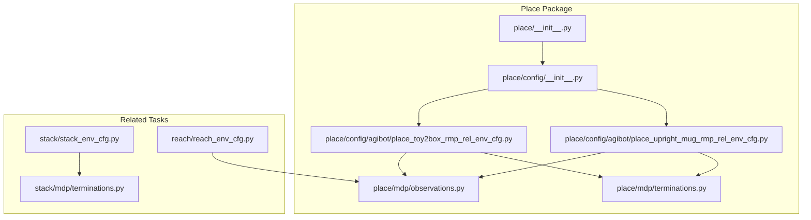
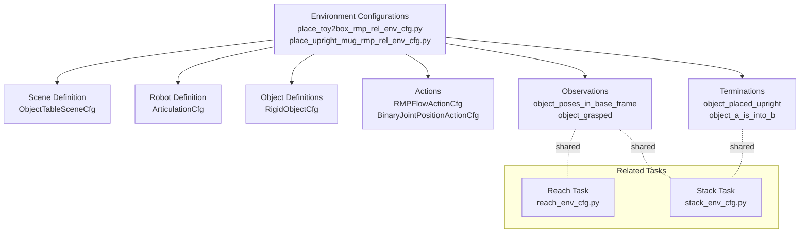
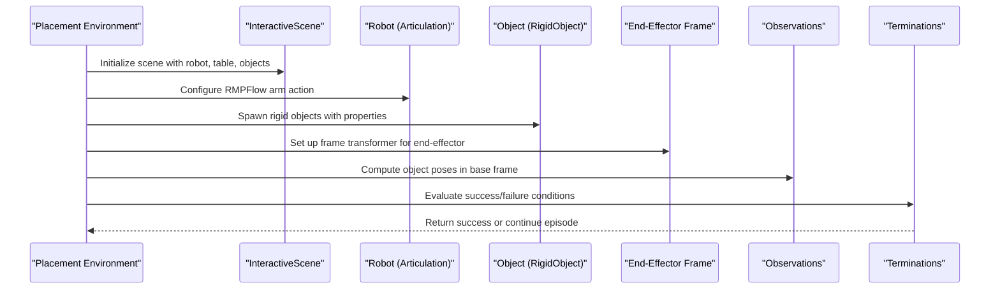
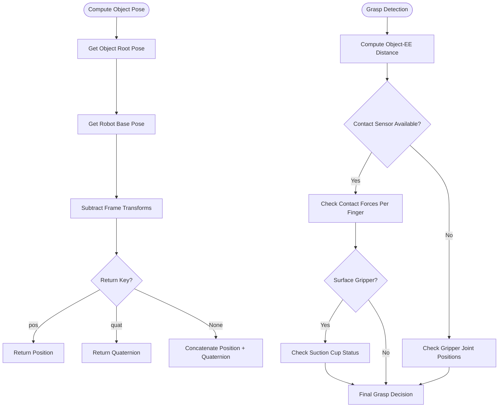
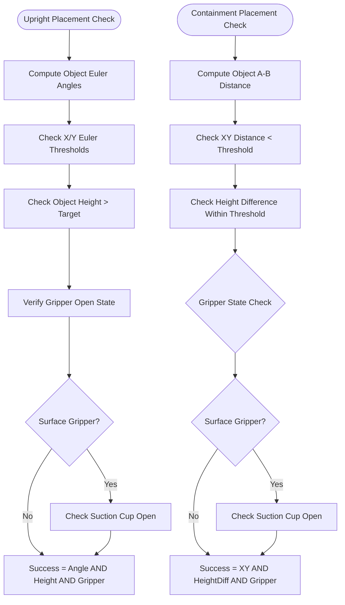
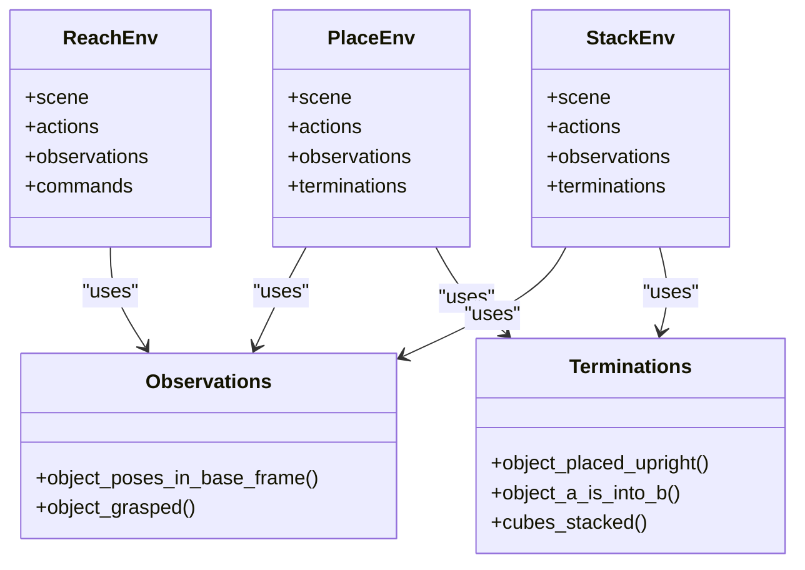
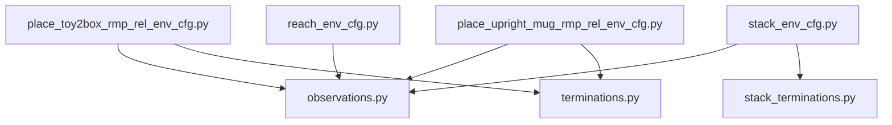

# Placement Operations

<cite>
**Referenced Files in This Document**
- [place/__init__.py](file://source/robot_lab/robot_lab/tasks/manager_based/manipulation/place/__init__.py)
- [config/__init__.py](file://source/robot_lab/robot_lab/tasks/manager_based/manipulation/place/config/__init__.py)
- [place_toy2box_rmp_rel_env_cfg.py](file://source/robot_lab/robot_lab/tasks/manager_based/manipulation/place/config/agibot/place_toy2box_rmp_rel_env_cfg.py)
- [place_upright_mug_rmp_rel_env_cfg.py](file://source/robot_lab/robot_lab/tasks/manager_based/manipulation/place/config/agibot/place_upright_mug_rmp_rel_env_cfg.py)
- [observations.py](file://source/robot_lab/robot_lab/tasks/manager_based/manipulation/place/mdp/observations.py)
- [terminations.py](file://source/robot_lab/robot_lab/tasks/manager_based/manipulation/place/mdp/terminations.py)
- [stack_env_cfg.py](file://source/robot_lab/robot_lab/tasks/manager_based/manipulation/stack/stack_env_cfg.py)
- [stack_terminations.py](file://source/robot_lab/robot_lab/tasks/manager_based/manipulation/stack/mdp/terminations.py)
- [reach_env_cfg.py](file://source/robot_lab/robot_lab/tasks/manager_based/manipulation/reach/reach_env_cfg.py)
</cite>

## Table of Contents
1. [Introduction](#introduction)
2. [Project Structure](#project-structure)
3. [Core Components](#core-components)
4. [Architecture Overview](#architecture-overview)
5. [Detailed Component Analysis](#detailed-component-analysis)
6. [Dependency Analysis](#dependency-analysis)
7. [Performance Considerations](#performance-considerations)
8. [Troubleshooting Guide](#troubleshooting-guide)
9. [Conclusion](#conclusion)

## Introduction
This document explains placement operations within the robot lab environment, focusing on how robots perform precise object placement tasks. It covers the configuration of placement scenarios, the underlying MDP (Markov Decision Process) components that define observations, termination conditions, and the relationship to related manipulation tasks such as reaching and stacking. The goal is to help users understand how placement tasks are structured, configured, and executed in the Isaac Lab framework.

## Project Structure
The placement operation functionality is organized under the manipulation tasks, specifically within the place package. The structure includes:
- Environment configurations for specific placement scenarios (e.g., placing a toy truck into a box, or placing an upright mug)
- MDP modules that define observations and termination conditions for placement
- Supporting configurations for related tasks (reaching, stacking) to provide context and comparison

**Diagram sources**
- [place/__init__.py:1-10](file://source/robot_lab/robot_lab/tasks/manager_based/manipulation/place/__init__.py#L1-L10)
- [config/__init__.py:1-9](file://source/robot_lab/robot_lab/tasks/manager_based/manipulation/place/config/__init__.py#L1-L9)
- [place_toy2box_rmp_rel_env_cfg.py:1-347](file://source/robot_lab/robot_lab/tasks/manager_based/manipulation/place/config/agibot/place_toy2box_rmp_rel_env_cfg.py#L1-L347)
- [place_upright_mug_rmp_rel_env_cfg.py:1-283](file://source/robot_lab/robot_lab/tasks/manager_based/manipulation/place/config/agibot/place_upright_mug_rmp_rel_env_cfg.py#L1-L283)
- [observations.py:1-119](file://source/robot_lab/robot_lab/tasks/manager_based/manipulation/place/mdp/observations.py#L1-L119)
- [terminations.py:1-123](file://source/robot_lab/robot_lab/tasks/manager_based/manipulation/place/mdp/terminations.py#L1-L123)
- [stack_env_cfg.py:1-200](file://source/robot_lab/robot_lab/tasks/manager_based/manipulation/stack/stack_env_cfg.py#L1-L200)
- [stack_terminations.py:1-93](file://source/robot_lab/robot_lab/tasks/manager_based/manipulation/stack/mdp/terminations.py#L1-L93)
- [reach_env_cfg.py:1-230](file://source/robot_lab/robot_lab/tasks/manager_based/manipulation/reach/reach_env_cfg.py#L1-L230)

**Section sources**
- [place/__init__.py:1-10](file://source/robot_lab/robot_lab/tasks/manager_based/manipulation/place/__init__.py#L1-L10)
- [config/__init__.py:1-9](file://source/robot_lab/robot_lab/tasks/manager_based/manipulation/place/config/__init__.py#L1-L9)

## Core Components
This section outlines the primary building blocks for placement operations:

- Environment Configurations: Define the scene, robot, objects, actions, observations, and termination criteria for placement tasks.
- MDP Observations: Provide state representations for the policy, including object poses in the robot base frame and grasp detection.
- MDP Terminations: Determine when a placement task succeeds or fails based on geometric and gripper-state criteria.

Key responsibilities:
- Environment configurations encapsulate task-specific parameters such as object spawn locations, gripper actions, and success thresholds.
- Observations compute object poses relative to the robot base and detect whether an object is grasped.
- Terminations evaluate success conditions for upright placement and containment-style placement.

**Section sources**
- [place_toy2box_rmp_rel_env_cfg.py:83-170](file://source/robot_lab/robot_lab/tasks/manager_based/manipulation/place/config/agibot/place_toy2box_rmp_rel_env_cfg.py#L83-L170)
- [place_upright_mug_rmp_rel_env_cfg.py:70-146](file://source/robot_lab/robot_lab/tasks/manager_based/manipulation/place/config/agibot/place_upright_mug_rmp_rel_env_cfg.py#L70-L146)
- [observations.py:20-119](file://source/robot_lab/robot_lab/tasks/manager_based/manipulation/place/mdp/observations.py#L20-L119)
- [terminations.py:25-123](file://source/robot_lab/robot_lab/tasks/manager_based/manipulation/place/mdp/terminations.py#L25-L123)

## Architecture Overview
The placement architecture integrates environment configuration, MDP modules, and related manipulation tasks. The figure below illustrates how placement environments use shared MDP components and how they relate to reach and stack tasks.

**Diagram sources**
- [place_toy2box_rmp_rel_env_cfg.py:173-347](file://source/robot_lab/robot_lab/tasks/manager_based/manipulation/place/config/agibot/place_toy2box_rmp_rel_env_cfg.py#L173-L347)
- [place_upright_mug_rmp_rel_env_cfg.py:153-283](file://source/robot_lab/robot_lab/tasks/manager_based/manipulation/place/config/agibot/place_upright_mug_rmp_rel_env_cfg.py#L153-L283)
- [observations.py:20-119](file://source/robot_lab/robot_lab/tasks/manager_based/manipulation/place/mdp/observations.py#L20-L119)
- [terminations.py:25-123](file://source/robot_lab/robot_lab/tasks/manager_based/manipulation/place/mdp/terminations.py#L25-L123)
- [stack_env_cfg.py:28-200](file://source/robot_lab/robot_lab/tasks/manager_based/manipulation/stack/stack_env_cfg.py#L28-L200)
- [reach_env_cfg.py:35-230](file://source/robot_lab/robot_lab/tasks/manager_based/manipulation/reach/reach_env_cfg.py#L35-L230)

## Detailed Component Analysis

### Placement Environment Configurations
Two primary placement environments are provided:
- Toy-to-Box Placement: Places a toy truck into a box using RMPFlow control with a parallel gripper.
- Upright Mug Placement: Places an upright mug on a table surface using RMPFlow control with a parallel gripper.

Both environments share common patterns:
- Scene configuration with a table and lighting
- Robot configuration via Agibot assets
- RMPFlow action configuration for arm movement
- Binary gripper action configuration for opening/closing
- Object definitions with rigid body properties and mass properties
- Observations of object poses in the robot base frame
- Termination conditions for success and failure

**Diagram sources**
- [place_toy2box_rmp_rel_env_cfg.py:211-347](file://source/robot_lab/robot_lab/tasks/manager_based/manipulation/place/config/agibot/place_toy2box_rmp_rel_env_cfg.py#L211-L347)
- [place_upright_mug_rmp_rel_env_cfg.py:153-283](file://source/robot_lab/robot_lab/tasks/manager_based/manipulation/place/config/agibot/place_upright_mug_rmp_rel_env_cfg.py#L153-L283)
- [observations.py:20-119](file://source/robot_lab/robot_lab/tasks/manager_based/manipulation/place/mdp/observations.py#L20-L119)
- [terminations.py:25-123](file://source/robot_lab/robot_lab/tasks/manager_based/manipulation/place/mdp/terminations.py#L25-L123)

**Section sources**
- [place_toy2box_rmp_rel_env_cfg.py:173-347](file://source/robot_lab/robot_lab/tasks/manager_based/manipulation/place/config/agibot/place_toy2box_rmp_rel_env_cfg.py#L173-L347)
- [place_upright_mug_rmp_rel_env_cfg.py:153-283](file://source/robot_lab/robot_lab/tasks/manager_based/manipulation/place/config/agibot/place_upright_mug_rmp_rel_env_cfg.py#L153-L283)

### Observations Module
The observations module provides:
- Object pose computation in the robot base frame, returning either position, quaternion, or concatenated pose
- Grasp detection that considers both geometric proximity and sensor-based contact forces, supporting both parallel and surface grippers

**Diagram sources**
- [observations.py:20-119](file://source/robot_lab/robot_lab/tasks/manager_based/manipulation/place/mdp/observations.py#L20-L119)

**Section sources**
- [observations.py:20-119](file://source/robot_lab/robot_lab/tasks/manager_based/manipulation/place/mdp/observations.py#L20-L119)

### Terminations Module
The terminations module defines success criteria for placement:
- Upright placement: Validates that an object is upright (small Euler angle deviations) and above a target height, with gripper state checks
- Containment placement: Checks if object A is placed inside object B within XY and height thresholds, with gripper state verification

**Diagram sources**
- [terminations.py:25-123](file://source/robot_lab/robot_lab/tasks/manager_based/manipulation/place/mdp/terminations.py#L25-L123)

**Section sources**
- [terminations.py:25-123](file://source/robot_lab/robot_lab/tasks/manager_based/manipulation/place/mdp/terminations.py#L25-L123)

### Relationship to Related Tasks
Placement builds upon shared MDP components used in other manipulation tasks:
- Reach task focuses on end-effector pose tracking and uses similar observation and action structures
- Stack task demonstrates comparable termination logic for success conditions and object interactions

**Diagram sources**
- [place_toy2box_rmp_rel_env_cfg.py:173-347](file://source/robot_lab/robot_lab/tasks/manager_based/manipulation/place/config/agibot/place_toy2box_rmp_rel_env_cfg.py#L173-L347)
- [place_upright_mug_rmp_rel_env_cfg.py:153-283](file://source/robot_lab/robot_lab/tasks/manager_based/manipulation/place/config/agibot/place_upright_mug_rmp_rel_env_cfg.py#L153-L283)
- [reach_env_cfg.py:35-230](file://source/robot_lab/robot_lab/tasks/manager_based/manipulation/reach/reach_env_cfg.py#L35-L230)
- [stack_env_cfg.py:28-200](file://source/robot_lab/robot_lab/tasks/manager_based/manipulation/stack/stack_env_cfg.py#L28-L200)
- [observations.py:20-119](file://source/robot_lab/robot_lab/tasks/manager_based/manipulation/place/mdp/observations.py#L20-L119)
- [terminations.py:25-123](file://source/robot_lab/robot_lab/tasks/manager_based/manipulation/place/mdp/terminations.py#L25-L123)
- [stack_terminations.py:24-93](file://source/robot_lab/robot_lab/tasks/manager_based/manipulation/stack/mdp/terminations.py#L24-L93)

**Section sources**
- [reach_env_cfg.py:35-230](file://source/robot_lab/robot_lab/tasks/manager_based/manipulation/reach/reach_env_cfg.py#L35-L230)
- [stack_env_cfg.py:28-200](file://source/robot_lab/robot_lab/tasks/manager_based/manipulation/stack/stack_env_cfg.py#L28-L200)
- [stack_terminations.py:24-93](file://source/robot_lab/robot_lab/tasks/manager_based/manipulation/stack/mdp/terminations.py#L24-L93)

## Dependency Analysis
Placement environments depend on:
- Environment configuration modules for scene setup, robot definitions, and action specifications
- MDP modules for observations and termination logic
- Related task configurations for comparative understanding

**Diagram sources**
- [place_toy2box_rmp_rel_env_cfg.py:1-347](file://source/robot_lab/robot_lab/tasks/manager_based/manipulation/place/config/agibot/place_toy2box_rmp_rel_env_cfg.py#L1-L347)
- [place_upright_mug_rmp_rel_env_cfg.py:1-283](file://source/robot_lab/robot_lab/tasks/manager_based/manipulation/place/config/agibot/place_upright_mug_rmp_rel_env_cfg.py#L1-L283)
- [observations.py:1-119](file://source/robot_lab/robot_lab/tasks/manager_based/manipulation/place/mdp/observations.py#L1-L119)
- [terminations.py:1-123](file://source/robot_lab/robot_lab/tasks/manager_based/manipulation/place/mdp/terminations.py#L1-L123)
- [reach_env_cfg.py:1-230](file://source/robot_lab/robot_lab/tasks/manager_based/manipulation/reach/reach_env_cfg.py#L1-L230)
- [stack_env_cfg.py:1-200](file://source/robot_lab/robot_lab/tasks/manager_based/manipulation/stack/stack_env_cfg.py#L1-L200)
- [stack_terminations.py:1-93](file://source/robot_lab/robot_lab/tasks/manager_based/manipulation/stack/mdp/terminations.py#L1-L93)

**Section sources**
- [place_toy2box_rmp_rel_env_cfg.py:1-347](file://source/robot_lab/robot_lab/tasks/manager_based/manipulation/place/config/agibot/place_toy2box_rmp_rel_env_cfg.py#L1-L347)
- [place_upright_mug_rmp_rel_env_cfg.py:1-283](file://source/robot_lab/robot_lab/tasks/manager_based/manipulation/place/config/agibot/place_upright_mug_rmp_rel_env_cfg.py#L1-L283)
- [reach_env_cfg.py:1-230](file://source/robot_lab/robot_lab/tasks/manager_based/manipulation/reach/reach_env_cfg.py#L1-L230)
- [stack_env_cfg.py:1-200](file://source/robot_lab/robot_lab/tasks/manager_based/manipulation/stack/stack_env_cfg.py#L1-L200)

## Performance Considerations
- Simulation fidelity: Adjust bounce thresholds, friction correlation distance, and aggregate pairs capacity to balance stability and performance.
- Rendering and decimation: Tune render intervals and decimation to match control loop rates for real-time responsiveness.
- Sensor updates: Configure contact sensors and frame transformers appropriately to avoid excessive computational overhead while maintaining accurate feedback.
- Episode length: Set appropriate episode durations to allow sufficient time for manipulation while keeping training efficient.

## Troubleshooting Guide
Common issues and resolutions:
- Grasp detection false positives/negatives: Verify gripper joint names and thresholds in the environment configuration; ensure contact sensors are properly configured and filtered.
- Placement success thresholds too strict/lenient: Adjust XY and height thresholds in termination functions to match task requirements.
- Object dropping during placement: Increase rigid body solver iterations or adjust mass properties to improve stability.
- Orientation errors for upright placement: Tighten Euler angle thresholds or re-evaluate object spawning orientations.

**Section sources**
- [place_toy2box_rmp_rel_env_cfg.py:260-295](file://source/robot_lab/robot_lab/tasks/manager_based/manipulation/place/config/agibot/place_toy2box_rmp_rel_env_cfg.py#L260-L295)
- [place_upright_mug_rmp_rel_env_cfg.py:216-234](file://source/robot_lab/robot_lab/tasks/manager_based/manipulation/place/config/agibot/place_upright_mug_rmp_rel_env_cfg.py#L216-L234)
- [terminations.py:25-123](file://source/robot_lab/robot_lab/tasks/manager_based/manipulation/place/mdp/terminations.py#L25-L123)
- [observations.py:48-119](file://source/robot_lab/robot_lab/tasks/manager_based/manipulation/place/mdp/observations.py#L48-L119)

## Conclusion
Placement operations in this codebase are structured around reusable environment configurations and MDP modules. The toy-to-box and upright mug placement tasks demonstrate how to configure robots, objects, actions, and termination criteria for precise manipulation. By leveraging shared observation and termination logic, these tasks integrate seamlessly with related manipulation domains such as reach and stack, enabling scalable experimentation and deployment of placement capabilities.