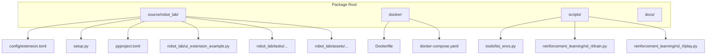
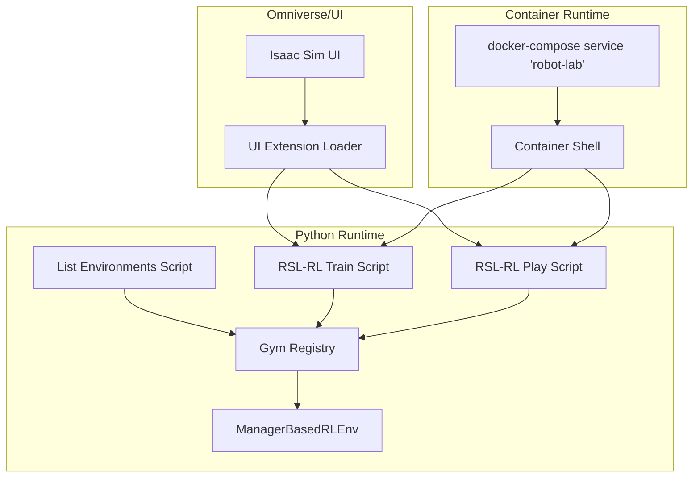
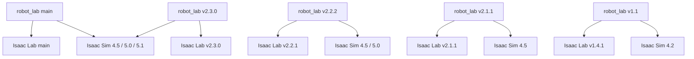
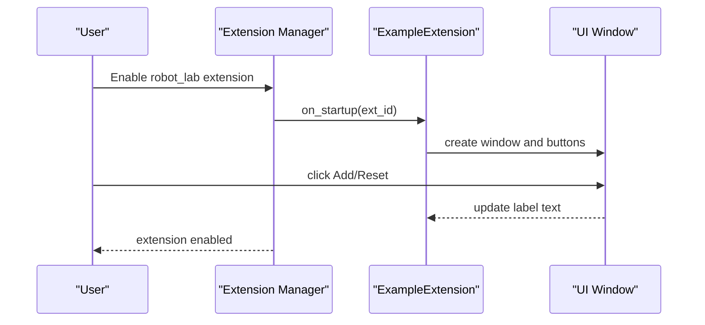
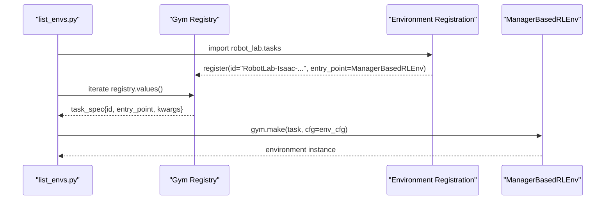
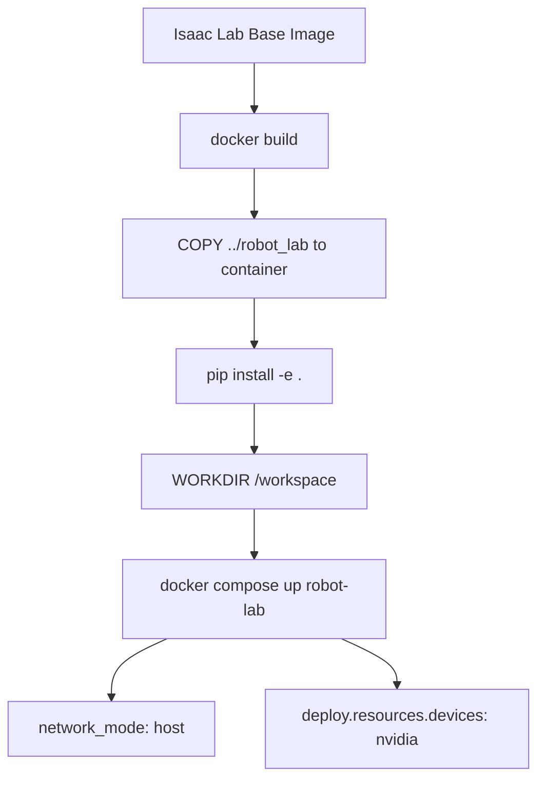
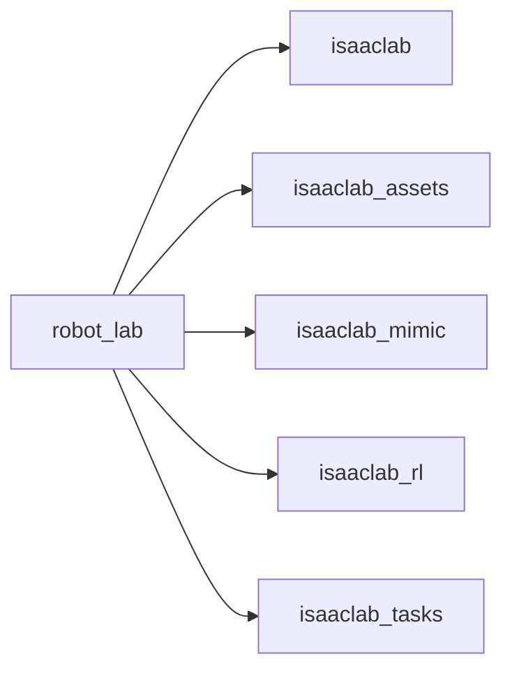
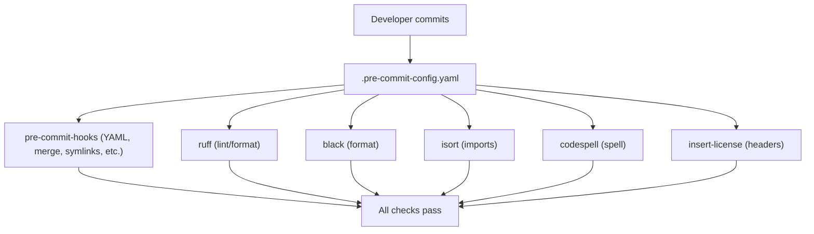
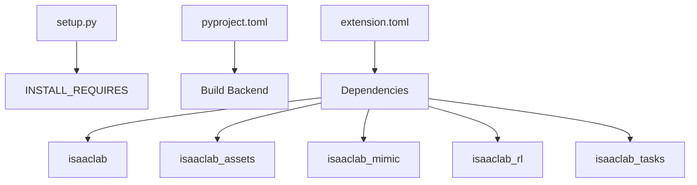
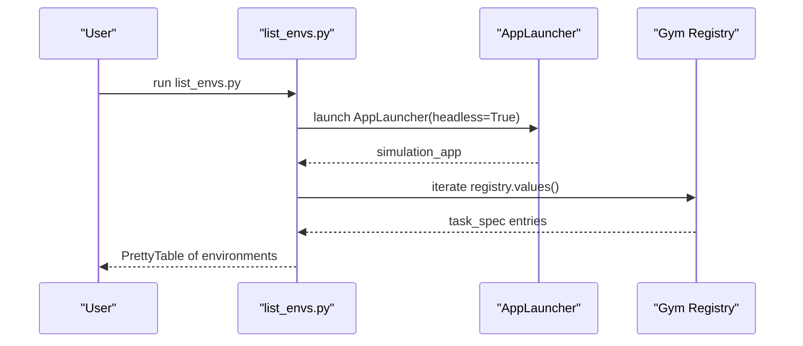

# Ecosystem Integration and Compatibility

<cite>
**Referenced Files in This Document**
- [README.md](file://README.md)
- [VERSION](file://VERSION)
- [source/robot_lab/config/extension.toml](file://source/robot_lab/config/extension.toml)
- [source/robot_lab/setup.py](file://source/robot_lab/setup.py)
- [source/robot_lab/pyproject.toml](file://source/robot_lab/pyproject.toml)
- [source/robot_lab/robot_lab/ui_extension_example.py](file://source/robot_lab/robot_lab/ui_extension_example.py)
- [scripts/tools/list_envs.py](file://scripts/tools/list_envs.py)
- [scripts/reinforcement_learning/rsl_rl/train.py](file://scripts/reinforcement_learning/rsl_rl/train.py)
- [scripts/reinforcement_learning/rsl_rl/play.py](file://scripts/reinforcement_learning/rsl_rl/play.py)
- [docker/docker-compose.yaml](file://docker/docker-compose.yaml)
- [docker/Dockerfile](file://docker/Dockerfile)
- [.dockerignore](file://.dockerignore)
- [.pre-commit-config.yaml](file://.pre-commit-config.yaml)
</cite>

## Table of Contents
1. [Introduction](#introduction)
2. [Project Structure](#project-structure)
3. [Core Components](#core-components)
4. [Architecture Overview](#architecture-overview)
5. [Detailed Component Analysis](#detailed-component-analysis)
6. [Dependency Analysis](#dependency-analysis)
7. [Performance Considerations](#performance-considerations)
8. [Troubleshooting Guide](#troubleshooting-guide)
9. [Conclusion](#conclusion)
10. [Appendices](#appendices)

## Introduction
This document describes robot_lab’s integration with the broader Isaac Lab and robotics simulation ecosystem. It covers version compatibility matrices, Omniverse UI extension integration, Gym environment API compliance, Docker deployment and orchestration, relationships with other Isaac Lab extensions, and developer tooling such as pre-commit. It also positions robot_lab within the robotics RL research community and outlines practical guidance for setting up development environments and integrating with other tools in the Isaac Lab ecosystem.

## Project Structure
robot_lab is structured as an installable Python package that extends Isaac Lab with Gym-compatible environments and Omniverse UI extensions. Key areas:
- Package metadata and extension definition live under source/robot_lab.
- Gym environments are registered under robot_lab/tasks and exposed via the Gym registry.
- Docker assets define reproducible builds and runtime orchestration.
- Pre-commit configuration enforces code quality and formatting standards.

**Diagram sources**
- [source/robot_lab/config/extension.toml](file://source/robot_lab/config/extension.toml#L1-L36)
- [source/robot_lab/setup.py](file://source/robot_lab/setup.py#L1-L54)
- [source/robot_lab/pyproject.toml](file://source/robot_lab/pyproject.toml#L1-L4)
- [source/robot_lab/robot_lab/ui_extension_example.py](file://source/robot_lab/robot_lab/ui_extension_example.py#L1-L50)
- [docker/Dockerfile](file://docker/Dockerfile#L1-L22)
- [docker/docker-compose.yaml](file://docker/docker-compose.yaml#L1-L37)
- [scripts/tools/list_envs.py](file://scripts/tools/list_envs.py#L1-L86)
- [scripts/reinforcement_learning/rsl_rl/train.py](file://scripts/reinforcement_learning/rsl_rl/train.py#L1-L200)
- [scripts/reinforcement_learning/rsl_rl/play.py](file://scripts/reinforcement_learning/rsl_rl/play.py#L1-L200)

**Section sources**
- [README.md](file://README.md#L11-L111)
- [source/robot_lab/config/extension.toml](file://source/robot_lab/config/extension.toml#L1-L36)
- [docker/docker-compose.yaml](file://docker/docker-compose.yaml#L1-L37)

## Core Components
- Omniverse UI Extension: Provides a minimal UI extension example that loads when the extension is enabled in the Extension Manager.
- Gym Environment Registry: Registers environments using gym.register with entry points pointing to ManagerBasedRLEnv and environment configuration classes.
- Docker Deployment: Builds a container from an Isaac Lab base image, installs robot_lab in editable mode, and exposes a host-networked session with GPU access.
- Pre-commit Tooling: Enforces linting, formatting, sorting imports, and license headers across Python and YAML files.

**Section sources**
- [source/robot_lab/robot_lab/ui_extension_example.py](file://source/robot_lab/robot_lab/ui_extension_example.py#L1-L50)
- [scripts/tools/list_envs.py](file://scripts/tools/list_envs.py#L1-L86)
- [docker/docker-compose.yaml](file://docker/docker-compose.yaml#L15-L37)
- [.pre-commit-config.yaml](file://.pre-commit-config.yaml#L1-L69)

## Architecture Overview
robot_lab integrates with Isaac Lab by:
- Installing as a Python package with explicit dependencies on isaaclab and related extensions.
- Registering Gym environments that wrap ManagerBasedRLEnv, enabling interoperability with standard RL libraries.
- Providing an Omniverse UI extension that can be enabled via the Extension Manager.
- Supporting reproducible development and deployment via Docker Compose.

**Diagram sources**
- [source/robot_lab/robot_lab/ui_extension_example.py](file://source/robot_lab/robot_lab/ui_extension_example.py#L18-L50)
- [scripts/tools/list_envs.py](file://scripts/tools/list_envs.py#L38-L75)
- [scripts/reinforcement_learning/rsl_rl/train.py](file://scripts/reinforcement_learning/rsl_rl/train.py#L80-L105)
- [scripts/reinforcement_learning/rsl_rl/play.py](file://scripts/reinforcement_learning/rsl_rl/play.py#L60-L90)
- [docker/docker-compose.yaml](file://docker/docker-compose.yaml#L15-L37)

## Detailed Component Analysis

### Version Compatibility Matrix
robot_lab maintains a compatibility matrix between robot_lab versions, Isaac Lab versions, and Isaac Sim versions. The matrix is documented in the repository and aligns with the current release version.

**Diagram sources**
- [README.md](file://README.md#L48-L57)
- [VERSION](file://VERSION#L1-L2)

**Section sources**
- [README.md](file://README.md#L48-L57)
- [VERSION](file://VERSION#L1-L2)

### Omniverse UI Extension Integration
robot_lab provides a UI extension example that loads when the extension is enabled in the Extension Manager. The extension defines a window and basic UI controls and derives from omni.ext.IExt.

**Diagram sources**
- [source/robot_lab/robot_lab/ui_extension_example.py](file://source/robot_lab/robot_lab/ui_extension_example.py#L21-L50)

**Section sources**
- [README.md](file://README.md#L92-L111)
- [source/robot_lab/robot_lab/ui_extension_example.py](file://source/robot_lab/robot_lab/ui_extension_example.py#L1-L50)

### Gym Environment API Compliance
robot_lab registers Gym environments using gym.register with entry points pointing to ManagerBasedRLEnv. The environment IDs follow the pattern Isaac-<Task>-<Robot>-v<X>, and the Gym registry is used to discover environments.

**Diagram sources**
- [scripts/tools/list_envs.py](file://scripts/tools/list_envs.py#L42-L75)
- [scripts/reinforcement_learning/rsl_rl/train.py](file://scripts/reinforcement_learning/rsl_rl/train.py#L172-L173)
- [scripts/reinforcement_learning/rsl_rl/play.py](file://scripts/reinforcement_learning/rsl_rl/play.py#L159-L160)

**Section sources**
- [README.md](file://README.md#L349-L400)
- [scripts/tools/list_envs.py](file://scripts/tools/list_envs.py#L38-L75)
- [scripts/reinforcement_learning/rsl_rl/train.py](file://scripts/reinforcement_learning/rsl_rl/train.py#L80-L105)
- [scripts/reinforcement_learning/rsl_rl/play.py](file://scripts/reinforcement_learning/rsl_rl/play.py#L60-L90)

### Docker Deployment and Orchestration
robot_lab supports Docker-based development and deployment:
- Build from an Isaac Lab base image.
- Install robot_lab in editable mode inside the container.
- Expose GPU devices and run with host networking.
- Provide a shell entrypoint for interactive sessions.

**Diagram sources**
- [docker/Dockerfile](file://docker/Dockerfile#L1-L22)
- [docker/docker-compose.yaml](file://docker/docker-compose.yaml#L15-L37)

**Section sources**
- [README.md](file://README.md#L113-L191)
- [docker/docker-compose.yaml](file://docker/docker-compose.yaml#L1-L37)
- [docker/Dockerfile](file://docker/Dockerfile#L1-L22)
- [.dockerignore](file://.dockerignore#L1-L24)

### Relationship with Other Isaac Lab Extensions
robot_lab declares dependencies on isaaclab, isaaclab_assets, isaaclab_mimic, isaaclab_rl, and isaaclab_tasks in its extension configuration. This establishes its role as an extension layered on top of the core Isaac Lab ecosystem.

**Diagram sources**
- [source/robot_lab/config/extension.toml](file://source/robot_lab/config/extension.toml#L17-L23)

**Section sources**
- [source/robot_lab/config/extension.toml](file://source/robot_lab/config/extension.toml#L17-L23)

### Pre-commit Integration for Code Quality
robot_lab includes a pre-commit configuration that enforces:
- Linting and formatting (ruff, black).
- Import sorting (isort).
- Static checks (YAML, merge conflicts, symlinks, large files).
- Spell checking (codespell).
- License header insertion.

**Diagram sources**
- [.pre-commit-config.yaml](file://.pre-commit-config.yaml#L4-L69)

**Section sources**
- [README.md](file://README.md#L436-L451)
- [.pre-commit-config.yaml](file://.pre-commit-config.yaml#L1-L69)

## Dependency Analysis
robot_lab depends on:
- Python packaging metadata defined in setup.py and pyproject.toml.
- Extension metadata and dependencies defined in extension.toml.
- Gym environments registered at runtime via robot_lab.tasks imports.

**Diagram sources**
- [source/robot_lab/setup.py](file://source/robot_lab/setup.py#L17-L51)
- [source/robot_lab/pyproject.toml](file://source/robot_lab/pyproject.toml#L1-L4)
- [source/robot_lab/config/extension.toml](file://source/robot_lab/config/extension.toml#L17-L23)

**Section sources**
- [source/robot_lab/setup.py](file://source/robot_lab/setup.py#L17-L51)
- [source/robot_lab/pyproject.toml](file://source/robot_lab/pyproject.toml#L1-L4)
- [source/robot_lab/config/extension.toml](file://source/robot_lab/config/extension.toml#L17-L23)

## Performance Considerations
- Distributed training is supported via AppLauncher and torch.distributed.run, with device assignment per worker rank.
- Environment seeding and deterministic settings can be tuned for reproducibility and performance.
- Video recording and IO descriptor exports are optional features that can impact performance.

[No sources needed since this section provides general guidance]

## Troubleshooting Guide
Common issues and resolutions:
- Pylance indexing of extensions: Add extension paths to extraPaths in VS Code settings.
- USD cache cleanup: Remove temporary USD directories to free disk space.
- Extension search paths in the Extension Manager: Ensure robot_lab and Isaac Lab extension directories are added and refreshed.

**Section sources**
- [README.md](file://README.md#L452-L472)
- [README.md](file://README.md#L474-L481)
- [README.md](file://README.md#L92-L111)

## Conclusion
robot_lab integrates tightly with the Isaac Lab ecosystem by registering Gym environments, exposing an Omniverse UI extension, and supporting reproducible development via Docker. Its compatibility matrix and explicit dependencies ensure predictable operation across versions. The project contributes to the robotics RL research community by standardizing environment configurations and enabling interoperability with common RL libraries.

[No sources needed since this section summarizes without analyzing specific files]

## Appendices

### Appendix A: Environment Listing Workflow
The list_envs.py script demonstrates how to enumerate environments registered in the Gym registry, including robot_lab environments.

**Diagram sources**
- [scripts/tools/list_envs.py](file://scripts/tools/list_envs.py#L32-L75)

**Section sources**
- [scripts/tools/list_envs.py](file://scripts/tools/list_envs.py#L1-L86)