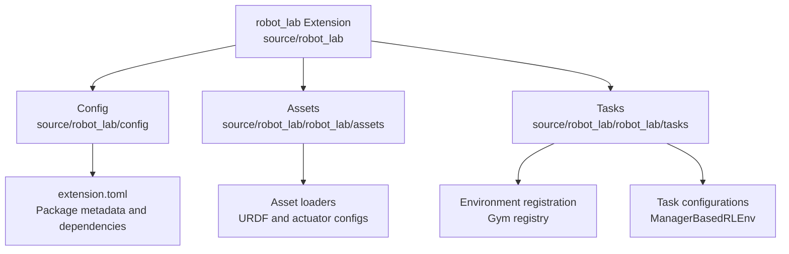
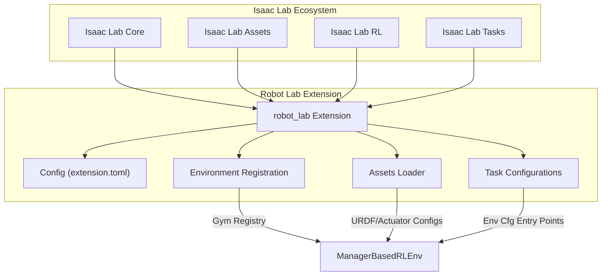
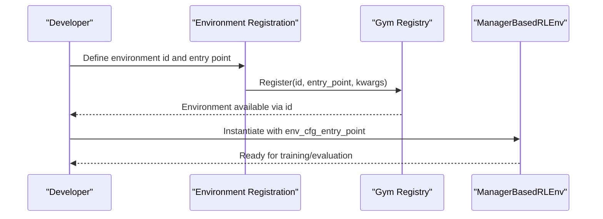
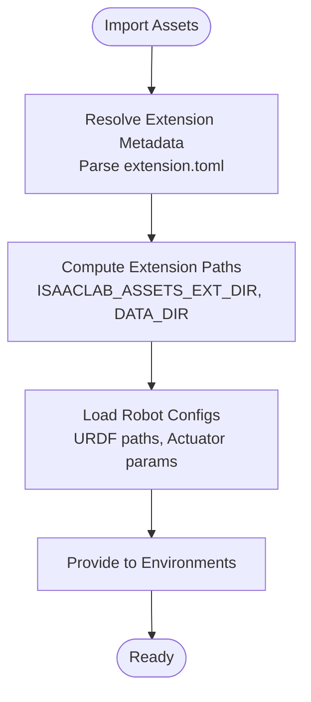
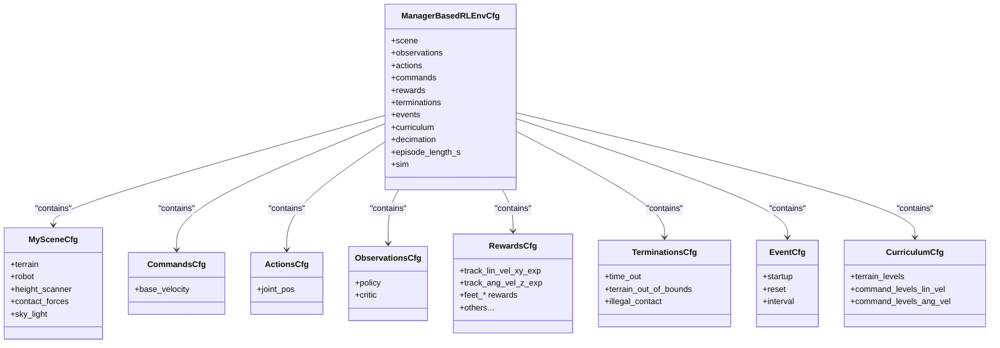
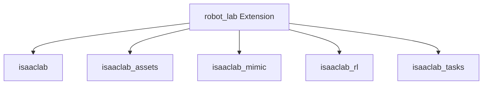

# Introduction and Purpose

<cite>
**Referenced Files in This Document**
- [README.md](file://README.md)
- [extension.toml](file://source/robot_lab/config/extension.toml)
- [__init__.py](file://source/robot_lab/robot_lab/__init__.py)
- [assets/__init__.py](file://source/robot_lab/robot_lab/assets/__init__.py)
- [tasks/__init__.py](file://source/robot_lab/robot_lab/tasks/__init__.py)
- [velocity_env_cfg.py](file://source/robot_lab/robot_lab/tasks/manager_based/locomotion/velocity/velocity_env_cfg.py)
- [unitree.py](file://source/robot_lab/robot_lab/assets/unitree.py)
</cite>

## Table of Contents
1. [Introduction](#introduction)
2. [Project Structure](#project-structure)
3. [Core Components](#core-components)
4. [Architecture Overview](#architecture-overview)
5. [Detailed Component Analysis](#detailed-component-analysis)
6. [Dependency Analysis](#dependency-analysis)
7. [Performance Considerations](#performance-considerations)
8. [Troubleshooting Guide](#troubleshooting-guide)
9. [Conclusion](#conclusion)

## Introduction
Robot Lab is an RL extension library for robotics built on NVIDIA’s Isaac Lab platform. Its core mission is to provide researchers and developers with isolated, extensible environments for training reinforcement learning agents across diverse robotic platforms. The project positions itself as a specialized extension that operates independently from the core Isaac Lab repository while leveraging Isaac Lab’s powerful simulation capabilities and environment management.

Robot Lab focuses on:
- Providing ManagerBasedRLEnv-based environments that follow the gym.Env API from OpenAI Gym.
- Offering environment registration via the Gym registry, enabling standardized task naming and configuration.
- Delivering a robust asset loading infrastructure that supports URDF-based articulated robots and actuator configurations.
- Supporting a broad range of robotic platforms, including quadrupeds, wheeled robots, humanoids, and specialized systems.

Target audience:
- Robotics researchers exploring locomotion, manipulation, and humanoid control.
- RL practitioners who need reproducible, configurable environments for benchmarking and experimentation.
- Simulation developers integrating new robots and tasks into the Isaac Lab ecosystem.

Why Robot Lab was created:
- To accelerate robotics RL research by offering ready-to-use, high-fidelity environments.
- To address the challenge of environment isolation and reproducibility by keeping the extension outside the core Isaac Lab repository.
- To streamline asset loading and environment configuration through a unified asset infrastructure and environment registration mechanism.

How Robot Lab addresses specific challenges:
- Isolation: Researchers can iterate quickly with environments that are independent of the core Isaac Lab repository.
- Extensibility: New robots and tasks can be added with minimal boilerplate using the ManagerBasedRLEnv pattern and Gym registry.
- Consistency: Standardized environment naming and configuration improve reproducibility and interoperability across projects.

**Section sources**
- [README.md](file://README.md#L11-L13)
- [README.md](file://README.md#L351-L401)
- [README.md](file://README.md#L402-L426)

## Project Structure
Robot Lab organizes its code into a modular structure that aligns with the Isaac Lab ecosystem:
- Extension metadata and dependencies are defined in the package configuration.
- Environment registration is centralized through the tasks package, which imports and registers Gym environments.
- Assets are loaded via a dedicated assets package that resolves paths and parses extension metadata.
- Task configurations are organized under manager-based locomotion and beyond-mimic categories, with environment-specific configurations and agent runner entries.

**Diagram sources**
- [extension.toml](file://source/robot_lab/config/extension.toml#L1-L36)
- [__init__.py](file://source/robot_lab/robot_lab/__init__.py#L8-L12)
- [assets/__init__.py](file://source/robot_lab/robot_lab/assets/__init__.py#L18-L30)
- [tasks/__init__.py](file://source/robot_lab/robot_lab/tasks/__init__.py#L14-L25)

**Section sources**
- [extension.toml](file://source/robot_lab/config/extension.toml#L1-L36)
- [__init__.py](file://source/robot_lab/robot_lab/__init__.py#L8-L12)
- [assets/__init__.py](file://source/robot_lab/robot_lab/assets/__init__.py#L18-L30)
- [tasks/__init__.py](file://source/robot_lab/robot_lab/tasks/__init__.py#L14-L25)

## Core Components
- ManagerBasedRLEnv: The foundational environment class used across Robot Lab tasks. It encapsulates simulation, MDP terms (observations, rewards, terminations, events), and configuration-driven behavior.
- Environment Registration: Environments are registered with the Gym registry using standardized naming conventions and entry points pointing to ManagerBasedRLEnv with environment-specific configuration entry points.
- Asset Loading Infrastructure: The assets package centralizes asset discovery and configuration resolution, including URDF paths and actuator parameters for articulated robots.
- Task Configurations: Base and variant environment configurations define scenes, sensors, commands, actions, observations, rewards, terminations, and curriculum terms tailored to locomotion and beyond-mimic tasks.

Key terminology:
- ManagerBasedRLEnv: The environment class used for all RL tasks.
- Environment Registration: The process of registering environments with the Gym registry.
- Asset Loading Infrastructure: The module responsible for resolving asset paths and configurations.

**Section sources**
- [README.md](file://README.md#L351-L401)
- [README.md](file://README.md#L402-L426)
- [velocity_env_cfg.py](file://source/robot_lab/robot_lab/tasks/manager_based/locomotion/velocity/velocity_env_cfg.py#L696-L744)
- [unitree.py](file://source/robot_lab/robot_lab/assets/unitree.py#L19-L65)

## Architecture Overview
Robot Lab builds on Isaac Lab’s environment and asset management to deliver a cohesive RL development experience. The architecture emphasizes:
- Decoupled environment registration and configuration.
- Centralized asset loading and actuator modeling.
- Extensible task configurations that inherit from ManagerBasedRLEnv.

**Diagram sources**
- [extension.toml](file://source/robot_lab/config/extension.toml#L17-L23)
- [__init__.py](file://source/robot_lab/robot_lab/__init__.py#L8-L12)
- [assets/__init__.py](file://source/robot_lab/robot_lab/assets/__init__.py#L18-L30)
- [tasks/__init__.py](file://source/robot_lab/robot_lab/tasks/__init__.py#L14-L25)
- [velocity_env_cfg.py](file://source/robot_lab/robot_lab/tasks/manager_based/locomotion/velocity/velocity_env_cfg.py#L696-L744)

## Detailed Component Analysis

### Environment Registration and ManagerBasedRLEnv
Robot Lab registers environments using the Gym registry and binds them to ManagerBasedRLEnv with environment-specific configuration entry points. This ensures consistent environment behavior and easy integration with RL frameworks.

**Diagram sources**
- [README.md](file://README.md#L402-L426)
- [velocity_env_cfg.py](file://source/robot_lab/robot_lab/tasks/manager_based/locomotion/velocity/velocity_env_cfg.py#L696-L744)

**Section sources**
- [README.md](file://README.md#L402-L426)
- [velocity_env_cfg.py](file://source/robot_lab/robot_lab/tasks/manager_based/locomotion/velocity/velocity_env_cfg.py#L696-L744)

### Asset Loading Infrastructure
The assets package provides a centralized mechanism to resolve asset paths and load configurations for robots. It reads extension metadata and exposes constants for URDF locations and actuator parameters.

**Diagram sources**
- [assets/__init__.py](file://source/robot_lab/robot_lab/assets/__init__.py#L18-L30)
- [unitree.py](file://source/robot_lab/robot_lab/assets/unitree.py#L19-L65)

**Section sources**
- [assets/__init__.py](file://source/robot_lab/robot_lab/assets/__init__.py#L18-L30)
- [unitree.py](file://source/robot_lab/robot_lab/assets/unitree.py#L19-L65)

### Task Configuration and MDP Terms
Task configurations define scenes, sensors, commands, actions, observations, rewards, terminations, and curriculum terms. These configurations inherit from ManagerBasedRLEnv and are registered via the Gym registry.

**Diagram sources**
- [velocity_env_cfg.py](file://source/robot_lab/robot_lab/tasks/manager_based/locomotion/velocity/velocity_env_cfg.py#L42-L95)
- [velocity_env_cfg.py](file://source/robot_lab/robot_lab/tasks/manager_based/locomotion/velocity/velocity_env_cfg.py#L102-L127)
- [velocity_env_cfg.py](file://source/robot_lab/robot_lab/tasks/manager_based/locomotion/velocity/velocity_env_cfg.py#L130-L254)
- [velocity_env_cfg.py](file://source/robot_lab/robot_lab/tasks/manager_based/locomotion/velocity/velocity_env_cfg.py#L257-L372)
- [velocity_env_cfg.py](file://source/robot_lab/robot_lab/tasks/manager_based/locomotion/velocity/velocity_env_cfg.py#L374-L646)
- [velocity_env_cfg.py](file://source/robot_lab/robot_lab/tasks/manager_based/locomotion/velocity/velocity_env_cfg.py#L647-L688)
- [velocity_env_cfg.py](file://source/robot_lab/robot_lab/tasks/manager_based/locomotion/velocity/velocity_env_cfg.py#L695-L744)

**Section sources**
- [velocity_env_cfg.py](file://source/robot_lab/robot_lab/tasks/manager_based/locomotion/velocity/velocity_env_cfg.py#L42-L95)
- [velocity_env_cfg.py](file://source/robot_lab/robot_lab/tasks/manager_based/locomotion/velocity/velocity_env_cfg.py#L102-L127)
- [velocity_env_cfg.py](file://source/robot_lab/robot_lab/tasks/manager_based/locomotion/velocity/velocity_env_cfg.py#L130-L254)
- [velocity_env_cfg.py](file://source/robot_lab/robot_lab/tasks/manager_based/locomotion/velocity/velocity_env_cfg.py#L257-L372)
- [velocity_env_cfg.py](file://source/robot_lab/robot_lab/tasks/manager_based/locomotion/velocity/velocity_env_cfg.py#L374-L646)
- [velocity_env_cfg.py](file://source/robot_lab/robot_lab/tasks/manager_based/locomotion/velocity/velocity_env_cfg.py#L647-L688)
- [velocity_env_cfg.py](file://source/robot_lab/robot_lab/tasks/manager_based/locomotion/velocity/velocity_env_cfg.py#L695-L744)

## Dependency Analysis
Robot Lab declares dependencies on core Isaac Lab packages, ensuring compatibility and access to environment management, assets, RL frameworks, and task templates.

**Diagram sources**
- [extension.toml](file://source/robot_lab/config/extension.toml#L17-L23)

**Section sources**
- [extension.toml](file://source/robot_lab/config/extension.toml#L17-L23)

## Performance Considerations
- Simulation fidelity vs. speed: Adjust decimation and episode length to balance training throughput and realism.
- Sensor update rates: Tune sensor update periods to match simulation time steps for accurate perception without excessive overhead.
- Physics parameters: Configure GPU patch counts and material properties to optimize simulation stability and performance.
- Curriculum progression: Use curriculum terms to gradually increase task difficulty, improving sample efficiency.

[No sources needed since this section provides general guidance]

## Troubleshooting Guide
Common issues and resolutions:
- Gym environment registration failures: Ensure environment registration code is executed and the environment id matches the expected naming convention.
- Asset path resolution errors: Verify that asset paths are correctly resolved and URDF files exist in the expected locations.
- Simulation cache cleanup: Temporary USD files can accumulate; clean them periodically to free disk space.
- IDE indexing: Add extension paths to extra Python paths to improve indexing in supported IDEs.

**Section sources**
- [README.md](file://README.md#L452-L481)

## Conclusion
Robot Lab establishes a focused, extensible foundation for robotics reinforcement learning research on NVIDIA’s Isaac Lab platform. By providing ManagerBasedRLEnv-based environments, standardized environment registration, and a robust asset loading infrastructure, it enables researchers and developers to rapidly prototype, train, and evaluate RL agents across a wide range of robotic platforms. Its position as an independent extension ensures isolation and reproducibility while leveraging the power of the broader Isaac Lab ecosystem.

[No sources needed since this section summarizes without analyzing specific files]