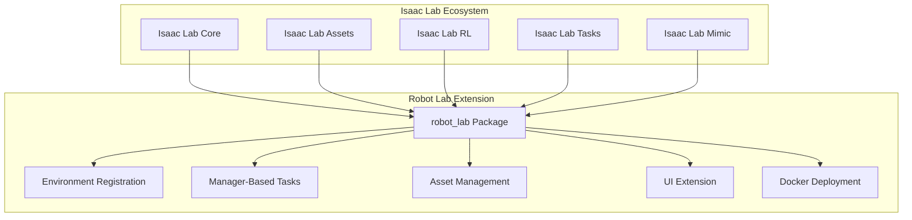
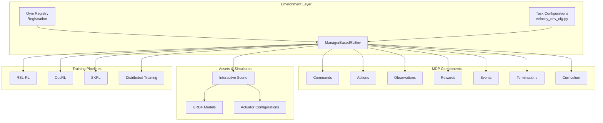
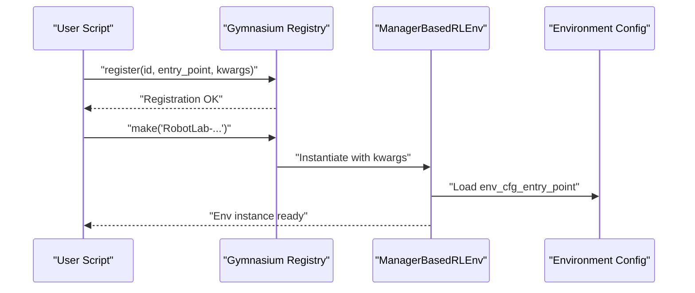
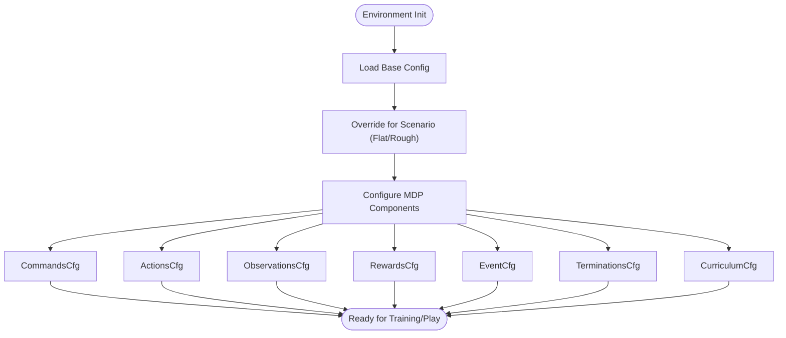
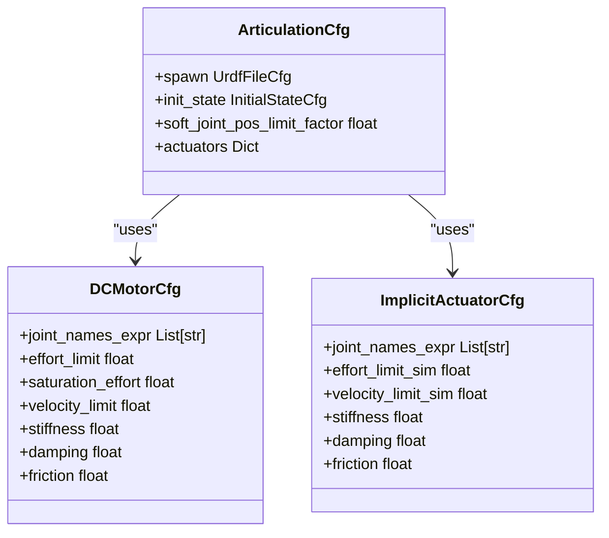
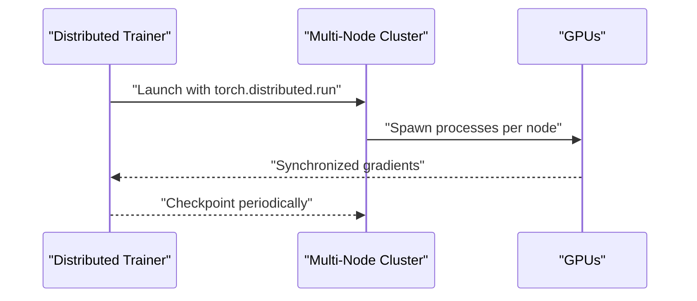
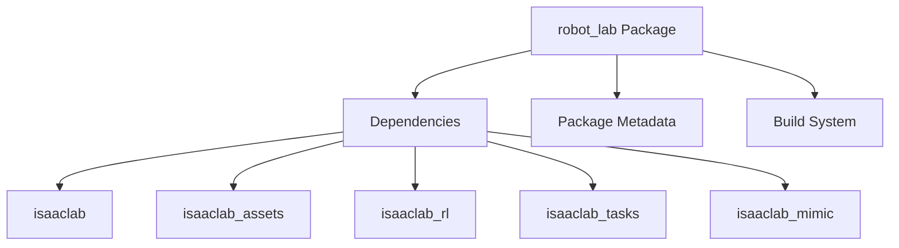

# Key Features and Capabilities

<cite>
**Referenced Files in This Document**
- [README.md](file://README.md)
- [setup.py](file://source/robot_lab/setup.py)
- [pyproject.toml](file://source/robot_lab/pyproject.toml)
- [extension.toml](file://source/robot_lab/config/extension.toml)
- [robot_lab/__init__.py](file://source/robot_lab/robot_lab/__init__.py)
- [ui_extension_example.py](file://source/robot_lab/robot_lab/ui_extension_example.py)
- [list_envs.py](file://scripts/tools/list_envs.py)
- [unitree.py](file://source/robot_lab/robot_lab/assets/unitree.py)
- [velocity_env_cfg.py](file://source/robot_lab/robot_lab/tasks/manager_based/locomotion/velocity/velocity_env_cfg.py)
- [flat_env_cfg.py](file://source/robot_lab/robot_lab/tasks/manager_based/locomotion/velocity/config/humanoid/unitree_g1/flat_env_cfg.py)
- [zsl1 __init__.py](file://source/robot_lab/robot_lab/tasks/manager_based/locomotion/velocity/config/quadruped/zsibot_zsl1/__init__.py)
- [docker-compose.yaml](file://docker/docker-compose.yaml)
- [.env.base](file://docker/.env.base)
</cite>

## Table of Contents
1. [Introduction](#introduction)
2. [Project Structure](#project-structure)
3. [Core Components](#core-components)
4. [Architecture Overview](#architecture-overview)
5. [Detailed Component Analysis](#detailed-component-analysis)
6. [Dependency Analysis](#dependency-analysis)
7. [Performance Considerations](#performance-considerations)
8. [Troubleshooting Guide](#troubleshooting-guide)
9. [Conclusion](#conclusion)

## Introduction
This document presents the key features and capabilities of the Robot Lab framework, focusing on its Gym environment API compliance, environment registration system, modular RL algorithm support, unified task configuration, comprehensive robot asset management, and advanced training features such as distributed training, curriculum learning, symmetry data augmentation, and Beyond Mimic motion imitation. It also covers the UI extension system for Omniverse integration and Docker deployment capabilities, with examples drawn from supported robots and tasks to demonstrate versatility for both beginners and experienced developers.

## Project Structure
Robot Lab is structured as an extension layered atop Isaac Lab. The core elements include:
- Gym environment registration and task configuration under a manager-based RL environment (ManagerBasedRLEnv)
- Modular task categories (locomotion, direct, manager_based) with subfolders for quadrupeds, wheeled, humanoid, and specialized tasks
- Unified configuration classes for MDP components (commands, actions, observations, rewards, events, terminations, curriculum)
- Asset management for URDF models and actuator configurations
- Scripts for environment listing, training, playing, and tools for Beyond Mimic workflows
- UI extension example for Omniverse integration
- Docker build and compose configuration for containerized deployment

**Diagram sources**
- [extension.toml](file://source/robot_lab/config/extension.toml#L17-L23)
- [robot_lab/__init__.py](file://source/robot_lab/robot_lab/__init__.py#L8-L12)

**Section sources**
- [README.md](file://README.md#L11-L50)
- [extension.toml](file://source/robot_lab/config/extension.toml#L1-L36)
- [robot_lab/__init__.py](file://source/robot_lab/robot_lab/__init__.py#L8-L12)

## Core Components
- Gym environment API compliance and registration:
  - Environments are registered using the Gymnasium registry with entry points pointing to ManagerBasedRLEnv, enabling seamless integration with standard RL workflows.
  - Registration examples show how environment IDs are constructed and how configuration entry points are passed to the environment.
- ManagerBasedRLEnv configuration:
  - The environment configuration encapsulates MDP components: commands, actions, observations, rewards, events, terminations, and curriculum.
  - Base configuration defines simulation parameters, scene setup, sensor update periods, and curriculum toggles.
- Unified task configuration framework:
  - Task-specific configurations inherit from base configurations and override rewards, terrain, and curriculum settings for different scenarios (e.g., flat vs. rough).
- Asset management:
  - URDF-based robot definitions and actuator configurations are centralized, enabling consistent spawning and actuation across environments.
- UI extension system:
  - A minimal Omniverse UI extension example demonstrates how to integrate UI panels and controls into the Isaac Sim interface.
- Docker deployment:
  - A Docker Compose setup builds and runs the environment with configurable environment variables and service orchestration.

**Section sources**
- [README.md](file://README.md#L349-L401)
- [velocity_env_cfg.py](file://source/robot_lab/robot_lab/tasks/manager_based/locomotion/velocity/velocity_env_cfg.py#L695-L744)
- [flat_env_cfg.py](file://source/robot_lab/robot_lab/tasks/manager_based/locomotion/velocity/config/humanoid/unitree_g1/flat_env_cfg.py#L1-L38)
- [zsl1 __init__.py](file://source/robot_lab/robot_lab/tasks/manager_based/locomotion/velocity/config/quadruped/zsibot_zsl1/__init__.py#L12-L30)
- [ui_extension_example.py](file://source/robot_lab/robot_lab/ui_extension_example.py#L18-L50)
- [docker-compose.yaml](file://docker/docker-compose.yaml)

## Architecture Overview
The framework’s architecture centers around ManagerBasedRLEnv and a unified configuration system for MDP components. Environments are registered per task and robot, with separate configurations for flat and rough terrains. Asset definitions and actuator configurations are loaded from URDF and articulated via the asset manager. Training pipelines leverage RSL-RL, CusRL, and SKRL, with optional distributed training and curriculum learning.

**Diagram sources**
- [velocity_env_cfg.py](file://source/robot_lab/robot_lab/tasks/manager_based/locomotion/velocity/velocity_env_cfg.py#L102-L127)
- [velocity_env_cfg.py](file://source/robot_lab/robot_lab/tasks/manager_based/locomotion/velocity/velocity_env_cfg.py#L130-L254)
- [velocity_env_cfg.py](file://source/robot_lab/robot_lab/tasks/manager_based/locomotion/velocity/velocity_env_cfg.py#L257-L372)
- [velocity_env_cfg.py](file://source/robot_lab/robot_lab/tasks/manager_based/locomotion/velocity/velocity_env_cfg.py#L374-L687)
- [velocity_env_cfg.py](file://source/robot_lab/robot_lab/tasks/manager_based/locomotion/velocity/velocity_env_cfg.py#L695-L744)
- [unitree.py](file://source/robot_lab/robot_lab/assets/unitree.py#L19-L65)

## Detailed Component Analysis

### Gym Environment API Compliance and Registration
- Registration mechanism:
  - Environments are registered with Gymnasium using ManagerBasedRLEnv as the entry point.
  - Registration kwargs pass environment configuration entry points and algorithm-specific runner configurations.
- Environment naming convention:
  - Names follow a standardized pattern indicating task, robot, and version, enabling consistent discovery and selection.
- Verification:
  - A dedicated script lists all registered Robot Lab environments, filtering by keyword and printing entry points and configuration paths.

**Diagram sources**
- [zsl1 __init__.py](file://source/robot_lab/robot_lab/tasks/manager_based/locomotion/velocity/config/quadruped/zsibot_zsl1/__init__.py#L12-L30)
- [list_envs.py](file://scripts/tools/list_envs.py#L45-L74)

**Section sources**
- [README.md](file://README.md#L351-L358)
- [zsl1 __init__.py](file://source/robot_lab/robot_lab/tasks/manager_based/locomotion/velocity/config/quadruped/zsibot_zsl1/__init__.py#L12-L30)
- [list_envs.py](file://scripts/tools/list_envs.py#L45-L74)

### Unified Task Configuration Framework (MDP Components)
- Commands:
  - Velocity command specification with configurable ranges and thresholds.
- Actions:
  - Joint position action configuration with scaling and offsets.
- Observations:
  - Policy and critic observation groups with sensor-derived and filtered signals.
- Rewards:
  - Extensive reward terms covering velocity tracking, orientation, torques, contacts, air time, and gait metrics.
- Events:
  - Startup and reset-time randomizations for materials, mass, COM, external forces, joint positions, actuator gains, and base state.
- Termination:
  - Episode termination conditions including time-out and terrain bounds.
- Curriculum:
  - Terrain levels and command level curriculum terms to progressively increase difficulty.

**Diagram sources**
- [velocity_env_cfg.py](file://source/robot_lab/robot_lab/tasks/manager_based/locomotion/velocity/velocity_env_cfg.py#L102-L127)
- [velocity_env_cfg.py](file://source/robot_lab/robot_lab/tasks/manager_based/locomotion/velocity/velocity_env_cfg.py#L130-L254)
- [velocity_env_cfg.py](file://source/robot_lab/robot_lab/tasks/manager_based/locomotion/velocity/velocity_env_cfg.py#L257-L372)
- [velocity_env_cfg.py](file://source/robot_lab/robot_lab/tasks/manager_based/locomotion/velocity/velocity_env_cfg.py#L374-L687)
- [velocity_env_cfg.py](file://source/robot_lab/robot_lab/tasks/manager_based/locomotion/velocity/velocity_env_cfg.py#L695-L744)

**Section sources**
- [velocity_env_cfg.py](file://source/robot_lab/robot_lab/tasks/manager_based/locomotion/velocity/velocity_env_cfg.py#L102-L127)
- [velocity_env_cfg.py](file://source/robot_lab/robot_lab/tasks/manager_based/locomotion/velocity/velocity_env_cfg.py#L130-L254)
- [velocity_env_cfg.py](file://source/robot_lab/robot_lab/tasks/manager_based/locomotion/velocity/velocity_env_cfg.py#L257-L372)
- [velocity_env_cfg.py](file://source/robot_lab/robot_lab/tasks/manager_based/locomotion/velocity/velocity_env_cfg.py#L374-L687)
- [velocity_env_cfg.py](file://source/robot_lab/robot_lab/tasks/manager_based/locomotion/velocity/velocity_env_cfg.py#L695-L744)

### Asset Management Infrastructure (URDF and Actuators)
- URDF integration:
  - Robots are defined via URDF files and imported using asset managers, with options for merging fixed joints and activating contact sensors.
- Actuator configuration:
  - Actuator models (DCMotor, ImplicitActuator) are defined per robot with joint expressions, effort limits, velocity limits, stiffness, damping, and armature properties.
- Example robot assets:
  - Unitree A1, Go2, Go2W, B2, B2W, and G1 configurations illustrate different actuator setups for legs, wheels, and articulated arms/waist.

**Diagram sources**
- [unitree.py](file://source/robot_lab/robot_lab/assets/unitree.py#L19-L65)
- [unitree.py](file://source/robot_lab/robot_lab/assets/unitree.py#L106-L117)
- [unitree.py](file://source/robot_lab/robot_lab/assets/unitree.py#L121-L175)
- [unitree.py](file://source/robot_lab/robot_lab/assets/unitree.py#L179-L243)
- [unitree.py](file://source/robot_lab/robot_lab/assets/unitree.py#L248-L323)
- [unitree.py](file://source/robot_lab/robot_lab/assets/unitree.py#L466-L623)

**Section sources**
- [unitree.py](file://source/robot_lab/robot_lab/assets/unitree.py#L19-L65)
- [unitree.py](file://source/robot_lab/robot_lab/assets/unitree.py#L106-L117)
- [unitree.py](file://source/robot_lab/robot_lab/assets/unitree.py#L121-L175)
- [unitree.py](file://source/robot_lab/robot_lab/assets/unitree.py#L179-L243)
- [unitree.py](file://source/robot_lab/robot_lab/assets/unitree.py#L248-L323)
- [unitree.py](file://source/robot_lab/robot_lab/assets/unitree.py#L466-L623)

### Advanced Features
- Distributed training:
  - Multi-GPU and multi-node training is supported via torch.distributed.run with rendezvous configuration and backend selection.
- Curriculum learning:
  - Terrain levels and command level curricula dynamically adjust difficulty based on reward performance.
- Symmetry data augmentation:
  - Symmetry-aware configurations enable data augmentation for improved generalization.
- Beyond Mimic motion imitation:
  - Beyond Mimic workflows include CSV-to-NPZ conversion, replay, and training with humanoid robots.

**Diagram sources**
- [README.md](file://README.md#L333-L347)

**Section sources**
- [README.md](file://README.md#L328-L347)
- [velocity_env_cfg.py](file://source/robot_lab/robot_lab/tasks/manager_based/locomotion/velocity/velocity_env_cfg.py#L668-L687)

### Supported Robots and Tasks
- Quadrupeds: Anymal D, Unitree Go2, Unitree B2, Unitree A1, Deeprobotics Lite3, Zsibot ZSL1, Magiclab MagicDog
- Wheeled: Unitree Go2W, Unitree B2W, Deeprobotics M20, DDTRobot Tita, Zsibot ZSL1W, Magiclab MagicDog-W
- Humanoids: Unitree G1, Unitree H1, FFTAI GR1T1, FFTAI GR1T2, Booster T1, RobotEra Xbot, Openloong Loong, RoboParty ATOM01, Magiclab MagicBot Gen1/Z1
- Tasks: Velocity locomotion, handstand, AMP dance, Beyond Mimic

Examples of environment names and usage are documented in the repository’s README and environment registration files.

**Section sources**
- [README.md](file://README.md#L17-L42)
- [zsl1 __init__.py](file://source/robot_lab/robot_lab/tasks/manager_based/locomotion/velocity/config/quadruped/zsibot_zsl1/__init__.py#L12-L30)

### UI Extension System (Omniverse)
- The UI extension example demonstrates how to create a window with buttons and counters, integrating with the Omniverse extension lifecycle.
- The extension is discoverable via the extension manager and can be enabled to load UI panels.

**Section sources**
- [ui_extension_example.py](file://source/robot_lab/robot_lab/ui_extension_example.py#L18-L50)

### Docker Deployment
- The Docker Compose configuration builds a robot-lab image based on an Isaac Lab base image and exposes environment variables via .env.base.
- Typical commands include building the image, bringing services up/down, and interacting with the running container.

**Section sources**
- [docker-compose.yaml](file://docker/docker-compose.yaml)
- [.env.base](file://docker/.env.base)
- [README.md](file://README.md#L113-L191)

## Dependency Analysis
- Package metadata and dependencies:
  - The package declares minimum dependencies and classifier entries for Isaac Sim versions.
- Extension dependencies:
  - The extension depends on isaaclab, isaaclab_assets, isaaclab_mimic, isaaclab_rl, and isaaclab_tasks.
- Build system:
  - The project uses setuptools with a TOML backend.

**Diagram sources**
- [setup.py](file://source/robot_lab/setup.py#L16-L28)
- [extension.toml](file://source/robot_lab/config/extension.toml#L17-L23)
- [pyproject.toml](file://source/robot_lab/pyproject.toml#L1-L4)

**Section sources**
- [setup.py](file://source/robot_lab/setup.py#L16-L28)
- [extension.toml](file://source/robot_lab/config/extension.toml#L17-L23)
- [pyproject.toml](file://source/robot_lab/pyproject.toml#L1-L4)

## Performance Considerations
- Simulation and rendering:
  - Decimation and episode length are tuned for efficient training cycles.
  - Physics material and GPU patch counts are configured to balance fidelity and throughput.
- Sensor update periods:
  - Height scanners and contact sensors are aligned with simulation time steps to minimize overhead.
- Curriculum and terrain:
  - Terrain curriculum reduces early instability and accelerates learning by progressive difficulty.

[No sources needed since this section provides general guidance]

## Troubleshooting Guide
- IDE indexing:
  - If Pylance indexing is missing extensions, add the extension paths to extraPaths in VSCode settings.
- USD cache cleanup:
  - Temporary USD files can accumulate; clean them from /tmp/IsaacLab/usd_* to reclaim disk space.

**Section sources**
- [README.md](file://README.md#L452-L481)

## Conclusion
Robot Lab delivers a robust, Gym-compatible RL framework built on Isaac Lab. Its ManagerBasedRLEnv-centric design, unified MDP configuration, and extensive robot asset support enable rapid prototyping and scalable training. Advanced capabilities such as distributed training, curriculum learning, symmetry data augmentation, and Beyond Mimic motion imitation further enhance research and development workflows. The UI extension and Docker deployment options streamline integration into Omniverse and containerized environments, making it suitable for diverse use cases from academic research to industrial applications.