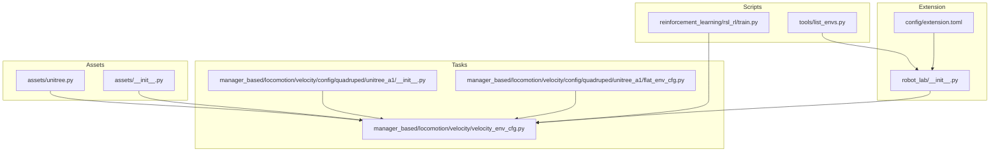
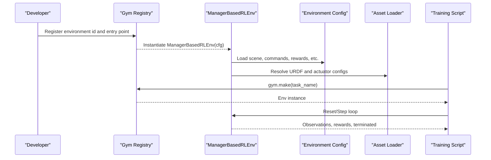
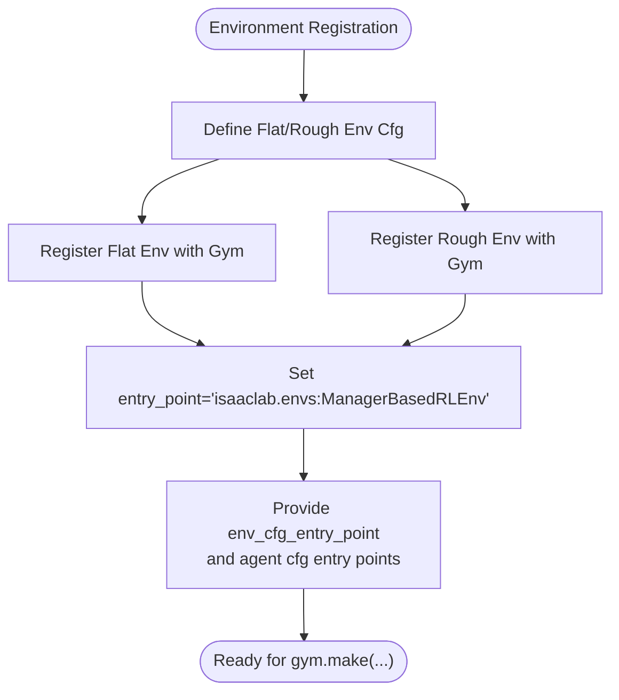
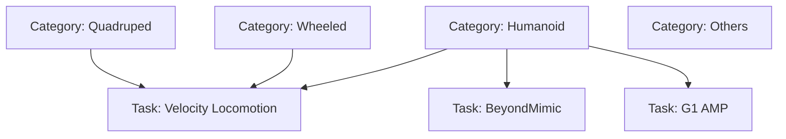
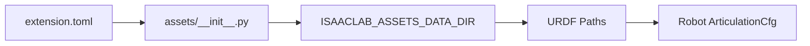
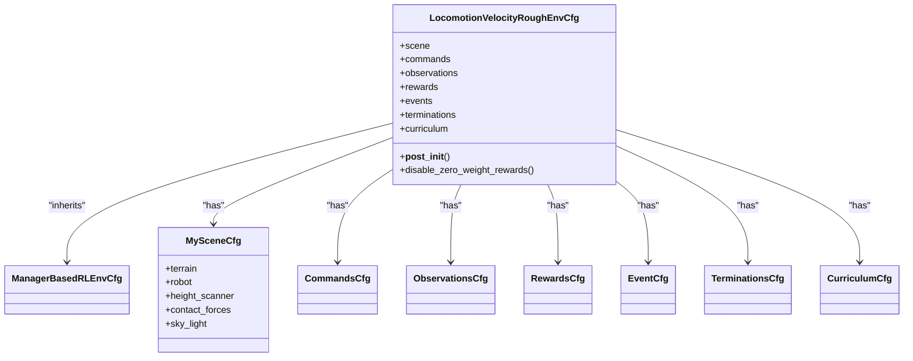
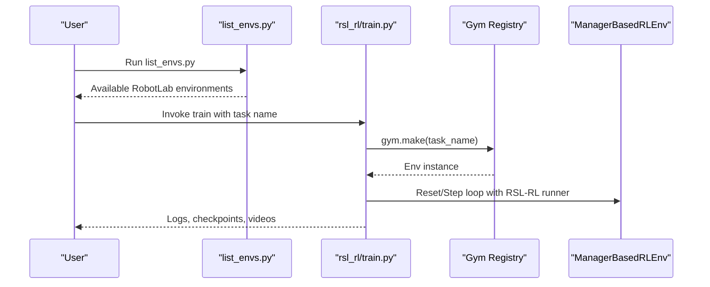
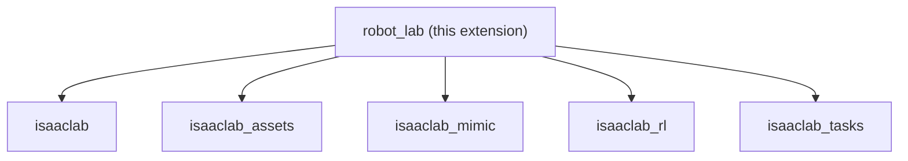

# Project Overview

<cite>
**Referenced Files in This Document**
- [README.md](file://README.md)
- [__init__.py](file://source/robot_lab/robot_lab/__init__.py)
- [extension.toml](file://source/robot_lab/config/extension.toml)
- [list_envs.py](file://scripts/tools/list_envs.py)
- [__init__.py](file://source/robot_lab/robot_lab/tasks/manager_based/__init__.py)
- [velocity_env_cfg.py](file://source/robot_lab/robot_lab/tasks/manager_based/locomotion/velocity/velocity_env_cfg.py)
- [__init__.py](file://source/robot_lab/robot_lab/tasks/manager_based/locomotion/velocity/config/quadruped/unitree_a1/__init__.py)
- [flat_env_cfg.py](file://source/robot_lab/robot_lab/tasks/manager_based/locomotion/velocity/config/quadruped/unitree_a1/flat_env_cfg.py)
- [__init__.py](file://source/robot_lab/robot_lab/assets/__init__.py)
- [unitree.py](file://source/robot_lab/robot_lab/assets/unitree.py)
- [train.py](file://scripts/reinforcement_learning/rsl_rl/train.py)
</cite>

## Table of Contents
1. [Introduction](#introduction)
2. [Project Structure](#project-structure)
3. [Core Components](#core-components)
4. [Architecture Overview](#architecture-overview)
5. [Detailed Component Analysis](#detailed-component-analysis)
6. [Dependency Analysis](#dependency-analysis)
7. [Performance Considerations](#performance-considerations)
8. [Troubleshooting Guide](#troubleshooting-guide)
9. [Conclusion](#conclusion)

## Introduction
Robot Lab is an RL extension library for robotics research built on NVIDIA’s Isaac Lab platform. It provides a unified, Gym environment–compliant interface to train reinforcement learning agents across a wide range of robotic platforms, including quadrupeds, wheeled robots, humanoids, and specialized systems. The library emphasizes modularity and configurability, enabling researchers and engineers to rapidly prototype and deploy training pipelines using ManagerBasedRLEnv environments. It integrates tightly with the broader Isaac ecosystem, leveraging Isaac Lab’s environment managers, asset loading infrastructure, and training frameworks to deliver scalable and reproducible RL workflows.

Key goals:
- Provide Gym-compatible environments for RL training and evaluation.
- Offer a modular architecture supporting multiple robot categories and tasks.
- Deliver a comprehensive task configuration framework with terrain, commands, rewards, and curriculum.
- Enable seamless integration with training libraries such as RSL-RL and SKRL.

## Project Structure
Robot Lab organizes its code into three primary areas:
- Assets: Robot URDFs, actuator configurations, and sensor setups loaded via asset infrastructure.
- Tasks: Environment configurations and MDP definitions organized by task type (e.g., locomotion velocity) and robot category.
- Scripts: Tooling for environment discovery, training, and evaluation, including Gym registry registration and training pipeline orchestration.

**Diagram sources**
- [unitree.py](file://source/robot_lab/robot_lab/assets/unitree.py#L1-L637)
- [__init__.py](file://source/robot_lab/robot_lab/assets/__init__.py#L1-L30)
- [velocity_env_cfg.py](file://source/robot_lab/robot_lab/tasks/manager_based/locomotion/velocity/velocity_env_cfg.py#L1-L744)
- [__init__.py](file://source/robot_lab/robot_lab/tasks/manager_based/locomotion/velocity/config/quadruped/unitree_a1/__init__.py#L1-L33)
- [flat_env_cfg.py](file://source/robot_lab/robot_lab/tasks/manager_based/locomotion/velocity/config/quadruped/unitree_a1/flat_env_cfg.py#L1-L30)
- [list_envs.py](file://scripts/tools/list_envs.py#L1-L86)
- [train.py](file://scripts/reinforcement_learning/rsl_rl/train.py#L1-L232)
- [__init__.py](file://source/robot_lab/robot_lab/__init__.py#L1-L13)
- [extension.toml](file://source/robot_lab/config/extension.toml#L1-L36)

**Section sources**
- [README.md](file://README.md#L11-L501)
- [__init__.py](file://source/robot_lab/robot_lab/__init__.py#L1-L13)
- [extension.toml](file://source/robot_lab/config/extension.toml#L1-L36)

## Core Components
- ManagerBasedRLEnv: The core RL environment class used by Robot Lab. Environments are registered with Gym and configured via ManagerBasedRLEnvCfg, enabling a unified training pipeline across tasks and robots.
- Asset loading infrastructure: Centralized asset configuration and metadata management, including URDF paths and actuator parameters, ensuring consistent robot instantiation and simulation fidelity.
- Task configuration framework: A structured MDP definition with configurable scenes, commands, observations, rewards, events, terminations, and curriculum, allowing rapid experimentation and reproducibility.
- Training pipeline: Scripted workflows for training and evaluation, integrating with RSL-RL and other RL libraries, and supporting distributed execution and video recording.

Practical examples:
- Quadrupeds: Unitree A1, B2, Go2, Anymal D, MagicLab MagicDog, Opendoge APX, Sdog Sdog2, Deeprobotics Lite3, Zsibot ZSL1.
- Wheeled robots: Unitree Go2W, B2W, Deeprobotics M20, DDTrobot Tita, Zsibot ZSL1W, MagicLab MagicDog-W.
- Humanoids: Unitree G1, Unitree H1, FFTAI GR1T1/GR1T2, Booster T1, RobotEra Xbot, Openloong Loong, RoboParty ATOM01, MagicLab MagicBot Gen1/Z1.
- Other tasks: Handstand for Unitree A1, AMP dance for Unitree G1, BeyondMimic for Unitree G1.

**Section sources**
- [README.md](file://README.md#L15-L42)
- [velocity_env_cfg.py](file://source/robot_lab/robot_lab/tasks/manager_based/locomotion/velocity/velocity_env_cfg.py#L1-L744)
- [__init__.py](file://source/robot_lab/robot_lab/tasks/manager_based/locomotion/velocity/config/quadruped/unitree_a1/__init__.py#L1-L33)
- [flat_env_cfg.py](file://source/robot_lab/robot_lab/tasks/manager_based/locomotion/velocity/config/quadruped/unitree_a1/flat_env_cfg.py#L1-L30)
- [unitree.py](file://source/robot_lab/robot_lab/assets/unitree.py#L1-L637)

## Architecture Overview
Robot Lab sits within the Isaac Lab ecosystem, extending its environment managers and asset infrastructure to provide Gym-compatible RL environments. The environment registration and configuration flow is as follows:

**Diagram sources**
- [__init__.py](file://source/robot_lab/robot_lab/tasks/manager_based/locomotion/velocity/config/quadruped/unitree_a1/__init__.py#L12-L32)
- [velocity_env_cfg.py](file://source/robot_lab/robot_lab/tasks/manager_based/locomotion/velocity/velocity_env_cfg.py#L696-L744)
- [unitree.py](file://source/robot_lab/robot_lab/assets/unitree.py#L1-L637)
- [train.py](file://scripts/reinforcement_learning/rsl_rl/train.py#L171-L172)

## Detailed Component Analysis

### Gym Environment API Compliance and Registration
Robot Lab environments are registered with Gym using ManagerBasedRLEnv as the entry point. Each environment exposes two variants (flat and rough terrain) and registers both RSL-RL and CusRL agent configurations. The registration pattern ensures compatibility with external RL libraries and standardized training workflows.

**Diagram sources**
- [__init__.py](file://source/robot_lab/robot_lab/tasks/manager_based/locomotion/velocity/config/quadruped/unitree_a1/__init__.py#L12-L32)

**Section sources**
- [README.md](file://README.md#L351-L426)
- [__init__.py](file://source/robot_lab/robot_lab/tasks/manager_based/locomotion/velocity/config/quadruped/unitree_a1/__init__.py#L1-L33)

### Modular Architecture and Robot Categories
Robot Lab organizes environments by category (quadruped, wheeled, humanoid, others) and task (e.g., velocity locomotion). Each category encapsulates its own environment configurations and agent settings, enabling easy swapping and comparison across robots.

**Diagram sources**
- [README.md](file://README.md#L17-L42)
- [__init__.py](file://source/robot_lab/robot_lab/tasks/manager_based/locomotion/velocity/config/quadruped/unitree_a1/__init__.py#L1-L33)

**Section sources**
- [README.md](file://README.md#L17-L42)

### Asset Loading Infrastructure
Robot Lab centralizes asset configuration and metadata resolution. The assets package defines paths to the extension data directory and loads metadata from extension.toml, enabling consistent asset discovery and configuration across environments.

**Diagram sources**
- [extension.toml](file://source/robot_lab/config/extension.toml#L1-L36)
- [__init__.py](file://source/robot_lab/robot_lab/assets/__init__.py#L1-L30)
- [unitree.py](file://source/robot_lab/robot_lab/assets/unitree.py#L1-L637)

**Section sources**
- [__init__.py](file://source/robot_lab/robot_lab/assets/__init__.py#L1-L30)
- [extension.toml](file://source/robot_lab/config/extension.toml#L1-L36)
- [unitree.py](file://source/robot_lab/robot_lab/assets/unitree.py#L1-L637)

### Task Configuration Framework
The velocity locomotion task defines a comprehensive MDP with configurable scene, commands, observations, rewards, events, terminations, and curriculum. It inherits from ManagerBasedRLEnvCfg and provides base and variant configurations (e.g., flat vs. rough terrain) to tailor training scenarios.

**Diagram sources**
- [velocity_env_cfg.py](file://source/robot_lab/robot_lab/tasks/manager_based/locomotion/velocity/velocity_env_cfg.py#L696-L744)
- [velocity_env_cfg.py](file://source/robot_lab/robot_lab/tasks/manager_based/locomotion/velocity/velocity_env_cfg.py#L42-L95)
- [velocity_env_cfg.py](file://source/robot_lab/robot_lab/tasks/manager_based/locomotion/velocity/velocity_env_cfg.py#L102-L118)
- [velocity_env_cfg.py](file://source/robot_lab/robot_lab/tasks/manager_based/locomotion/velocity/velocity_env_cfg.py#L120-L127)
- [velocity_env_cfg.py](file://source/robot_lab/robot_lab/tasks/manager_based/locomotion/velocity/velocity_env_cfg.py#L129-L254)
- [velocity_env_cfg.py](file://source/robot_lab/robot_lab/tasks/manager_based/locomotion/velocity/velocity_env_cfg.py#L257-L372)
- [velocity_env_cfg.py](file://source/robot_lab/robot_lab/tasks/manager_based/locomotion/velocity/velocity_env_cfg.py#L374-L687)

**Section sources**
- [velocity_env_cfg.py](file://source/robot_lab/robot_lab/tasks/manager_based/locomotion/velocity/velocity_env_cfg.py#L1-L744)

### Training Pipeline
Robot Lab provides a training pipeline that leverages ManagerBasedRLEnv and integrates with RSL-RL. The pipeline supports single-node and multi-node distributed training, video recording, and checkpointing. It discovers environments via Gym and wraps environments for RL consumption.

**Diagram sources**
- [list_envs.py](file://scripts/tools/list_envs.py#L45-L74)
- [train.py](file://scripts/reinforcement_learning/rsl_rl/train.py#L171-L200)

**Section sources**
- [README.md](file://README.md#L193-L347)
- [list_envs.py](file://scripts/tools/list_envs.py#L1-L86)
- [train.py](file://scripts/reinforcement_learning/rsl_rl/train.py#L1-L232)

## Dependency Analysis
Robot Lab depends on the Isaac Lab ecosystem and registers environments through the isaaclab_tasks extension. The extension metadata declares dependencies on isaaclab, isaaclab_assets, isaaclab_mimic, isaaclab_rl, and isaaclab_tasks, ensuring a cohesive development and runtime environment.

**Diagram sources**
- [extension.toml](file://source/robot_lab/config/extension.toml#L17-L23)

**Section sources**
- [extension.toml](file://source/robot_lab/config/extension.toml#L1-L36)

## Performance Considerations
- Simulation decimation and timestep: Environment configuration sets decimation and simulation dt to balance accuracy and speed.
- Sensor update periods: Sensors are configured to align with the simulation timestep for efficient updates.
- Distributed training: Multi-GPU and multi-node training are supported to scale compute resources.
- Curriculum and terrain levels: Terrain difficulty can be progressively increased to improve sample efficiency.

[No sources needed since this section provides general guidance]

## Troubleshooting Guide
- IDE indexing: If extensions are not indexed properly, add extra Python paths to settings to include the extension and related packages.
- USD cache cleanup: Temporary USD files can accumulate; clean them periodically to free disk space.
- Environment listing: Use the environment listing script to verify that Robot Lab environments are registered and discoverable.

**Section sources**
- [README.md](file://README.md#L452-L472)

## Conclusion
Robot Lab delivers a robust, modular RL extension for robotics built on NVIDIA’s Isaac Lab. By providing Gym-compatible environments, a unified asset loading infrastructure, and a comprehensive task configuration framework, it accelerates research and development across diverse robotic platforms. Its integration with training libraries and support for distributed execution make it suitable for both educational exploration and production-scale RL projects.