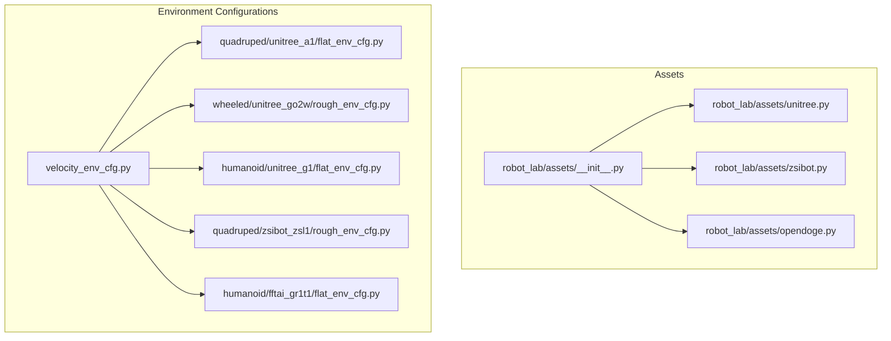
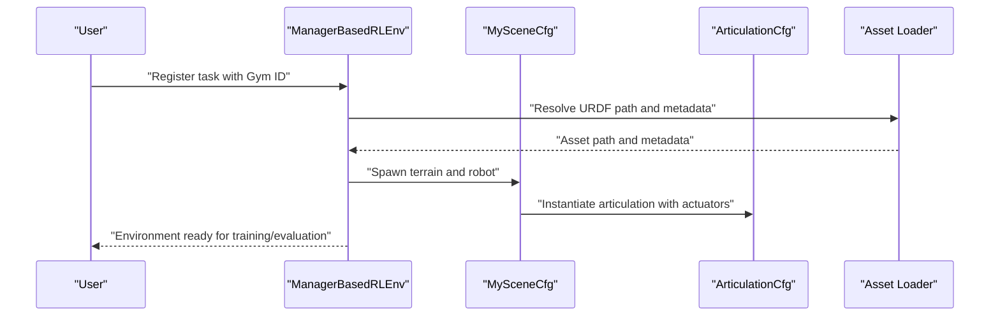
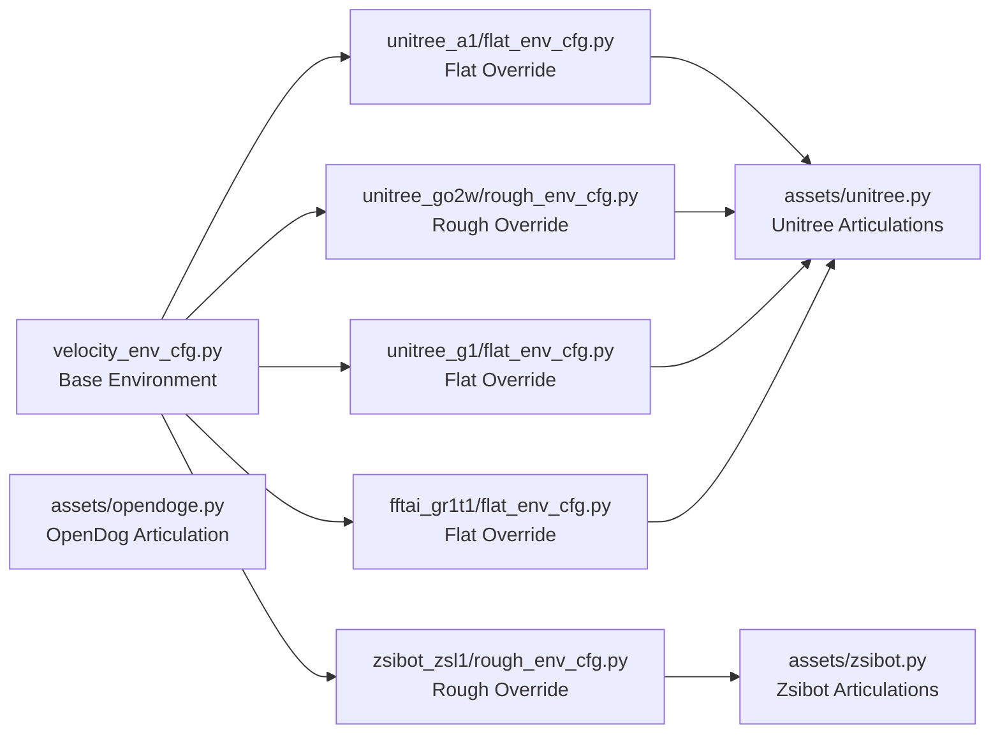

# Supported Robot Categories and Models

<cite>
**Referenced Files in This Document**
- [README.md](file://README.md)
- [__init__.py](file://source/robot_lab/robot_lab/assets/__init__.py)
- [unitree.py](file://source/robot_lab/robot_lab/assets/unitree.py)
- [zsibot.py](file://source/robot_lab/robot_lab/assets/zsibot.py)
- [opendoge.py](file://source/robot_lab/robot_lab/assets/opendoge.py)
- [velocity_env_cfg.py](file://source/robot_lab/robot_lab/tasks/manager_based/locomotion/velocity/velocity_env_cfg.py)
- [flat_env_cfg.py](file://source/robot_lab/robot_lab/tasks/manager_based/locomotion/velocity/config/quadruped/unitree_a1/flat_env_cfg.py)
- [rough_env_cfg.py](file://source/robot_lab/robot_lab/tasks/manager_based/locomotion/velocity/config/wheeled/unitree_go2w/rough_env_cfg.py)
- [flat_env_cfg.py](file://source/robot_lab/robot_lab/tasks/manager_based/locomotion/velocity/config/humanoid/unitree_g1/flat_env_cfg.py)
- [rough_env_cfg.py](file://source/robot_lab/robot_lab/tasks/manager_based/locomotion/velocity/config/quadruped/zsibot_zsl1/rough_env_cfg.py)
- [flat_env_cfg.py](file://source/robot_lab/robot_lab/tasks/manager_based/locomotion/velocity/config/humanoid/fftai_gr1t1/flat_env_cfg.py)
</cite>

## Table of Contents
1. [Introduction](#introduction)
2. [Project Structure](#project-structure)
3. [Core Components](#core-components)
4. [Architecture Overview](#architecture-overview)
5. [Detailed Component Analysis](#detailed-component-analysis)
6. [Dependency Analysis](#dependency-analysis)
7. [Performance Considerations](#performance-considerations)
8. [Troubleshooting Guide](#troubleshooting-guide)
9. [Conclusion](#conclusion)
10. [Appendices](#appendices)

## Introduction
This document presents the supported robot categories and models within the Robot Lab framework. It catalogs the available quadrupeds, wheeled robots, humanoids, and specialized platforms, describes their unique characteristics and typical RL research use cases, and explains the asset loading and URDF integration pipeline. Guidance is provided for selecting robots aligned with research objectives and skill demonstrations, along with a clear path to add new robot models following established patterns.

## Project Structure
Robot Lab organizes robot assets and environment configurations as follows:
- Assets and URDFs are stored under the data directory, grouped by manufacturer and model.
- Robot-specific asset configurations live in a dedicated assets package.
- Environment configurations are organized by task (e.g., locomotion velocity) and split into flat and rough variants per robot category.

**Diagram sources**
- [__init__.py](file://source/robot_lab/robot_lab/assets/__init__.py#L1-L30)
- [unitree.py](file://source/robot_lab/robot_lab/assets/unitree.py#L1-L637)
- [zsibot.py](file://source/robot_lab/robot_lab/assets/zsibot.py#L1-L115)
- [opendoge.py](file://source/robot_lab/robot_lab/assets/opendoge.py#L1-L86)
- [velocity_env_cfg.py](file://source/robot_lab/robot_lab/tasks/manager_based/locomotion/velocity/velocity_env_cfg.py#L1-L744)
- [flat_env_cfg.py](file://source/robot_lab/robot_lab/tasks/manager_based/locomotion/velocity/config/quadruped/unitree_a1/flat_env_cfg.py#L1-L30)
- [rough_env_cfg.py](file://source/robot_lab/robot_lab/tasks/manager_based/locomotion/velocity/config/wheeled/unitree_go2w/rough_env_cfg.py#L1-L235)
- [flat_env_cfg.py](file://source/robot_lab/robot_lab/tasks/manager_based/locomotion/velocity/config/humanoid/unitree_g1/flat_env_cfg.py#L1-L38)
- [rough_env_cfg.py](file://source/robot_lab/robot_lab/tasks/manager_based/locomotion/velocity/config/quadruped/zsibot_zsl1/rough_env_cfg.py#L1-L166)
- [flat_env_cfg.py](file://source/robot_lab/robot_lab/tasks/manager_based/locomotion/velocity/config/humanoid/fftai_gr1t1/flat_env_cfg.py#L1-L30)

**Section sources**
- [README.md](file://README.md#L17-L42)
- [__init__.py](file://source/robot_lab/robot_lab/assets/__init__.py#L1-L30)

## Core Components
- Asset loader and metadata: The assets package exposes the extension’s data directory and version metadata, enabling URDF resolution and asset discovery.
- Robot-specific articulation configurations: Each robot is defined by an ArticulationCfg that specifies:
  - URDF path and parsing options
  - Initial pose and joint velocity conditions
  - Actuator configurations (DC motors or implicit actuators)
  - Soft joint limits and solver settings
- Environment templates and overrides:
  - A base velocity locomotion environment defines scenes, sensors, commands, actions, observations, rewards, events, and terminations.
  - Flat and rough variants adjust terrain, sensors, reward weights, and curriculum to match the intended research scenario.

Key implementation references:
- Asset metadata and paths: [assets/__init__.py](file://source/robot_lab/robot_lab/assets/__init__.py#L18-L30)
- Unitree quadruped/humanoid configurations: [assets/unitree.py](file://source/robot_lab/robot_lab/assets/unitree.py#L19-L637)
- Zsibot quadruped/wheeled configurations: [assets/zsibot.py](file://source/robot_lab/robot_lab/assets/zsibot.py#L14-L115)
- OpenDog/Apx quadruped configuration: [assets/opendoge.py](file://source/robot_lab/robot_lab/assets/opendoge.py#L14-L86)
- Base velocity environment: [velocity_env_cfg.py](file://source/robot_lab/robot_lab/tasks/manager_based/locomotion/velocity/velocity_env_cfg.py#L42-L744)

**Section sources**
- [__init__.py](file://source/robot_lab/robot_lab/assets/__init__.py#L18-L30)
- [unitree.py](file://source/robot_lab/robot_lab/assets/unitree.py#L19-L637)
- [zsibot.py](file://source/robot_lab/robot_lab/assets/zsibot.py#L14-L115)
- [opendoge.py](file://source/robot_lab/robot_lab/assets/opendoge.py#L14-L86)
- [velocity_env_cfg.py](file://source/robot_lab/robot_lab/tasks/manager_based/locomotion/velocity/velocity_env_cfg.py#L42-L744)

## Architecture Overview
The framework composes a Manager-Based RL environment around a robot articulation asset. The environment registers tasks with Gym-compatible names and wires robot-specific configurations into the scene.

**Diagram sources**
- [velocity_env_cfg.py](file://source/robot_lab/robot_lab/tasks/manager_based/locomotion/velocity/velocity_env_cfg.py#L42-L95)
- [unitree.py](file://source/robot_lab/robot_lab/assets/unitree.py#L19-L65)
- [__init__.py](file://source/robot_lab/robot_lab/assets/__init__.py#L18-L30)

## Detailed Component Analysis

### Quadrupeds
Supported models and characteristics:
- Anymal D: High-dynamic quadruped suitable for rough terrain locomotion studies.
- Unitree Go2: Compact quadruped with articulated legs; commonly used for velocity tracking and agility benchmarks.
- Unitree B2: Larger quadruped with higher torque motors; suited for challenging terrains and robust control.
- Unitree A1: Lightweight quadruped with simplified actuator grouping; ideal for fast prototyping and curriculum learning.
- Deeprobotics Lite3: Compact quadruped designed for research on compact locomotion and control.
- Zsibot ZSL1: Custom quadruped with explicit joint naming; supports mirror-based reward engineering and gait learning.
- Magiclab MagicDog: Quadruped platform for locomotion research and benchmarking.

Typical use cases:
- Velocity tracking on flat/rough terrains
- Gait learning and contact scheduling
- Curriculum-based difficulty ramp-up
- Reward shaping for stability and energy efficiency

Manufacturer references and screenshots:
- Anymal D: [Anymal D](https://www.anybotics.com/robotics/anymal)
- Unitree Go2: [Unitree Go2](https://www.unitree.com/go2)
- Unitree B2: [Unitree B2](https://www.unitree.com/b2)
- Unitree A1: [Unitree A1](https://www.unitree.com/a1)
- Deeprobotics Lite3: [Deeprobotics Lite3](https://www.deeprobotics.cn/robot/index/product1.html)
- Zsibot ZSL1: [Zsibot ZSL1](https://www.zsibot.com/zsl1)
- Magiclab MagicDog: [Magiclab MagicDog](https://www.magiclab.top/dog)

Selection guidance:
- Choose A1 or Lite3 for quick iteration and curriculum.
- Choose Go2 or B2 for more torque and stability on rough terrain.
- Choose ZSL1 for mirror-based reward engineering and explicit joint control.

**Section sources**
- [README.md](file://README.md#L19-L25)
- [unitree.py](file://source/robot_lab/robot_lab/assets/unitree.py#L71-L244)
- [zsibot.py](file://source/robot_lab/robot_lab/assets/zsibot.py#L14-L58)
- [opendoge.py](file://source/robot_lab/robot_lab/assets/opendoge.py#L14-L86)

### Wheeled Robots
Supported models and characteristics:
- Unitree Go2W: Hybrid quadruped-wheeled design with separate leg and wheel actuators; emphasizes locomotion on flat surfaces and wheel dynamics.
- Unitree B2W: Larger wheeled variant with explicit wheel actuator configuration.
- Deeprobotics M20: Wheeled platform for mobility research and differential drive control.
- DDTRobot Tita: Wheeled robot for research on omnidirectional mobility and control.
- Zsibot ZSL1W: Wheeled variant of ZSL1 with implicit wheel actuators.
- Magiclab MagicDog-W: Wheeled variant for fast locomotion and energy-efficient control.

Typical use cases:
- Flat terrain navigation and high-speed travel
- Wheel slip and contact modeling
- Differential and omnidirectional steering
- Energy efficiency and power consumption studies

Manufacturer references and screenshots:
- Unitree Go2W: [Unitree Go2W](https://www.unitree.com/go2-w)
- Unitree B2W: [Unitree B2W](https://www.unitree.com/b2-w)
- Deeprobotics M20: [Deeprobotics M20](https://www.deeprobotics.cn/robot/index/lynx.html)
- DDTRobot Tita: [DDTRobot Tita](https://directdrive.com/product_TITA)
- Zsibot ZSL1W: [Zsibot ZSL1W](https://www.zsibot.com/zsl1)
- Magiclab MagicDog-W: [Magiclab MagicDog-W](https://www.magiclab.top/dog-w)

Selection guidance:
- Choose Go2W/B2W for flat terrain and high-speed locomotion.
- Choose M20/Tita for omnidirectional mobility experiments.
- Choose ZSL1W/MagicDog-W for wheel-specific reward shaping and power modeling.

**Section sources**
- [README.md](file://README.md#L26-L31)
- [unitree.py](file://source/robot_lab/robot_lab/assets/unitree.py#L121-L323)
- [zsibot.py](file://source/robot_lab/robot_lab/assets/zsibot.py#L60-L115)

### Humanoids
Supported models and characteristics:
- Unitree G1: Humanoid with 29 degrees-of-freedom; supports implicit actuator configurations across legs, waist, and arms.
- Unitree H1: Humanoid platform for bipedalism and humanoid control research.
- FFTAi GR1T1/GR1T2: Humanoid platforms for bipedal locomotion and dynamic control.
- Booster T1: Humanoid for advanced control and mimic tasks.
- RobotEra Xbot: Humanoid for locomotion and manipulation research.
- Openloong Loong: Humanoid for research on bipedalism and balance.
- RoboParty ATOM01: Humanoid for educational and research applications.
- Magiclab MagicBot series: Humanoid platforms for locomotion and skill learning.

Typical use cases:
- Bipedal walking and stance control
- Whole-body control and balance
- Curriculum-based bipedal skill acquisition
- Humanoid mimic and motion retargeting

Manufacturer references and screenshots:
- Unitree G1: [Unitree G1](https://www.unitree.com/g1)
- Unitree H1: [Unitree H1](https://www.unitree.com/h1)
- FFTAi GR1T1: [FFTAI GR1T1](https://www.fftai.com/products-gr1)
- FFTAi GR1T2: [FFTAI GR1T2](https://www.fftai.com/products-gr1)
- Booster T1: [Booster T1](https://www.boosterobotics.com/)
- RobotEra Xbot: [RobotEra Xbot](https://www.robotera.com/)
- Openloong Loong: [Openloong Loong](https://www.openloong.net/)
- RoboParty ATOM01: [RoboParty ATOM01](https://roboparty.cn/)
- Magiclab MagicBot-Gen1: [Magiclab MagicBot-Gen1](https://www.magiclab.top/human)
- Magiclab MagicBot-Z1: [Magiclab MagicBot-Z1](https://www.magiclab.top/z1)

Selection guidance:
- Choose G1/H1 for advanced whole-body control and implicit actuator tuning.
- Choose GR1T1/GR1T2 for bipedalism and dynamic behaviors.
- Choose MagicBot series for humanoid skill learning and mimic tasks.

**Section sources**
- [README.md](file://README.md#L32-L41)
- [unitree.py](file://source/robot_lab/robot_lab/assets/unitree.py#L466-L637)

### Specialized Robots
- OpenDog/Apx: Custom quadruped with grouped actuators for hip/thigh and calf joints; useful for research on compact actuator designs and torque scaling.

Typical use cases:
- Compact actuator design and torque distribution
- Low-cost quadruped control and locomotion
- Research on actuator hierarchy and power budgets

Selection guidance:
- Use Apx for compact actuator experiments and reduced DOF control.

**Section sources**
- [opendoge.py](file://source/robot_lab/robot_lab/assets/opendoge.py#L14-L86)

### Environment Variants: Flat vs. Rough
- Flat environments remove terrain, height scans, and terrain curriculum, focusing on pure locomotion tracking and stability.
- Rough environments introduce uneven terrain, height sensors, and curriculum-driven difficulty.

Examples:
- Flat override for Unitree A1: [flat_env_cfg.py](file://source/robot_lab/robot_lab/tasks/manager_based/locomotion/velocity/config/quadruped/unitree_a1/flat_env_cfg.py#L9-L30)
- Rough override for Unitree Go2W: [rough_env_cfg.py](file://source/robot_lab/robot_lab/tasks/manager_based/locomotion/velocity/config/wheeled/unitree_go2w/rough_env_cfg.py#L52-L235)
- Flat override for Unitree G1: [flat_env_cfg.py](file://source/robot_lab/robot_lab/tasks/manager_based/locomotion/velocity/config/humanoid/unitree_g1/flat_env_cfg.py#L9-L38)
- Rough override for Zsibot ZSL1: [rough_env_cfg.py](file://source/robot_lab/robot_lab/tasks/manager_based/locomotion/velocity/config/quadruped/zsibot_zsl1/rough_env_cfg.py#L14-L166)
- Flat override for FFTAi GR1T1: [flat_env_cfg.py](file://source/robot_lab/robot_lab/tasks/manager_based/locomotion/velocity/config/humanoid/fftai_gr1t1/flat_env_cfg.py#L9-L30)

**Section sources**
- [flat_env_cfg.py](file://source/robot_lab/robot_lab/tasks/manager_based/locomotion/velocity/config/quadruped/unitree_a1/flat_env_cfg.py#L9-L30)
- [rough_env_cfg.py](file://source/robot_lab/robot_lab/tasks/manager_based/locomotion/velocity/config/wheeled/unitree_go2w/rough_env_cfg.py#L52-L235)
- [flat_env_cfg.py](file://source/robot_lab/robot_lab/tasks/manager_based/locomotion/velocity/config/humanoid/unitree_g1/flat_env_cfg.py#L9-L38)
- [rough_env_cfg.py](file://source/robot_lab/robot_lab/tasks/manager_based/locomotion/velocity/config/quadruped/zsibot_zsl1/rough_env_cfg.py#L14-L166)
- [flat_env_cfg.py](file://source/robot_lab/robot_lab/tasks/manager_based/locomotion/velocity/config/humanoid/fftai_gr1t1/flat_env_cfg.py#L9-L30)

## Dependency Analysis
The environment configuration hierarchy and asset dependencies are illustrated below.

**Diagram sources**
- [velocity_env_cfg.py](file://source/robot_lab/robot_lab/tasks/manager_based/locomotion/velocity/velocity_env_cfg.py#L696-L744)
- [flat_env_cfg.py](file://source/robot_lab/robot_lab/tasks/manager_based/locomotion/velocity/config/quadruped/unitree_a1/flat_env_cfg.py#L9-L30)
- [rough_env_cfg.py](file://source/robot_lab/robot_lab/tasks/manager_based/locomotion/velocity/config/wheeled/unitree_go2w/rough_env_cfg.py#L52-L235)
- [flat_env_cfg.py](file://source/robot_lab/robot_lab/tasks/manager_based/locomotion/velocity/config/humanoid/unitree_g1/flat_env_cfg.py#L9-L38)
- [rough_env_cfg.py](file://source/robot_lab/robot_lab/tasks/manager_based/locomotion/velocity/config/quadruped/zsibot_zsl1/rough_env_cfg.py#L14-L166)
- [flat_env_cfg.py](file://source/robot_lab/robot_lab/tasks/manager_based/locomotion/velocity/config/humanoid/fftai_gr1t1/flat_env_cfg.py#L9-L30)
- [unitree.py](file://source/robot_lab/robot_lab/assets/unitree.py#L19-L637)
- [zsibot.py](file://source/robot_lab/robot_lab/assets/zsibot.py#L14-L115)
- [opendoge.py](file://source/robot_lab/robot_lab/assets/opendoge.py#L14-L86)

**Section sources**
- [velocity_env_cfg.py](file://source/robot_lab/robot_lab/tasks/manager_based/locomotion/velocity/velocity_env_cfg.py#L696-L744)
- [unitree.py](file://source/robot_lab/robot_lab/assets/unitree.py#L19-L637)
- [zsibot.py](file://source/robot_lab/robot_lab/assets/zsibot.py#L14-L115)
- [opendoge.py](file://source/robot_lab/robot_lab/assets/opendoge.py#L14-L86)

## Performance Considerations
- Solver settings and soft joint limits: Adjust solver iteration counts and soft joint limit factors to balance stability and performance.
- Actuator selection: DC motors offer explicit torque/velocity limits; implicit actuators simplify control but require careful tuning of stiffness/damping/armature.
- Sensor update rates: Align sensor update periods with simulation time step and decimation to avoid unnecessary overhead.
- Curriculum difficulty: Enable terrain curriculum for gradual difficulty ramp-up to improve sample efficiency.

[No sources needed since this section provides general guidance]

## Troubleshooting Guide
Common issues and resolutions:
- Missing asset paths: Ensure URDF paths resolve correctly via the assets metadata directory.
- Simulation cache cleanup: Remove temporary USD caches to free disk space.
- IDE indexing: Add extension paths to Python extra paths for proper indexing.

**Section sources**
- [__init__.py](file://source/robot_lab/robot_lab/assets/__init__.py#L18-L30)
- [README.md](file://README.md#L474-L481)
- [README.md](file://README.md#L454-L472)

## Conclusion
Robot Lab provides a structured, scalable framework for RL research across quadrupeds, wheeled robots, humanoids, and specialized platforms. By leveraging URDF-based asset loading, modular environment configurations, and robot-specific actuator settings, researchers can rapidly prototype, curate, and evaluate locomotion policies. The documented patterns enable seamless addition of new robots and environment variants.

[No sources needed since this section summarizes without analyzing specific files]

## Appendices

### Asset Loading and URDF Integration
- Asset metadata and data directory are exposed via the assets package.
- Each robot’s ArticulationCfg specifies:
  - URDF file path resolution
  - Initial state and joint velocity conditions
  - Actuator groups (DCMotorCfg or ImplicitActuatorCfg)
  - Soft joint limits and solver parameters
- Environments instantiate the robot by replacing the prim path and wiring sensors and commands.

References:
- Metadata and paths: [assets/__init__.py](file://source/robot_lab/robot_lab/assets/__init__.py#L18-L30)
- Unitree configurations: [assets/unitree.py](file://source/robot_lab/robot_lab/assets/unitree.py#L19-L637)
- Zsibot configurations: [assets/zsibot.py](file://source/robot_lab/robot_lab/assets/zsibot.py#L14-L115)
- OpenDog configuration: [assets/opendoge.py](file://source/robot_lab/robot_lab/assets/opendoge.py#L14-L86)
- Environment base: [velocity_env_cfg.py](file://source/robot_lab/robot_lab/tasks/manager_based/locomotion/velocity/velocity_env_cfg.py#L42-L95)

**Section sources**
- [__init__.py](file://source/robot_lab/robot_lab/assets/__init__.py#L18-L30)
- [unitree.py](file://source/robot_lab/robot_lab/assets/unitree.py#L19-L637)
- [zsibot.py](file://source/robot_lab/robot_lab/assets/zsibot.py#L14-L115)
- [opendoge.py](file://source/robot_lab/robot_lab/assets/opendoge.py#L14-L86)
- [velocity_env_cfg.py](file://source/robot_lab/robot_lab/tasks/manager_based/locomotion/velocity/velocity_env_cfg.py#L42-L95)

### Adding a New Robot Model
Follow these steps to integrate a new robot:
1. Prepare URDF and meshes under the data directory following the existing structure.
2. Define an ArticulationCfg in the assets package with:
   - URDF path resolution
   - Initial pose and joint velocity
   - Actuator configuration(s)
   - Soft joint limits and solver settings
3. Create environment variants:
   - Base environment configuration in the velocity task
   - Flat and rough variants inheriting from the base
4. Register the environment with Gym-compatible naming conventions.

References:
- Template structure and registration patterns: [README.md](file://README.md#L349-L426)
- Base environment configuration: [velocity_env_cfg.py](file://source/robot_lab/robot_lab/tasks/manager_based/locomotion/velocity/velocity_env_cfg.py#L696-L744)
- Example overrides: [flat_env_cfg.py](file://source/robot_lab/robot_lab/tasks/manager_based/locomotion/velocity/config/quadruped/unitree_a1/flat_env_cfg.py#L9-L30), [rough_env_cfg.py](file://source/robot_lab/robot_lab/tasks/manager_based/locomotion/velocity/config/wheeled/unitree_go2w/rough_env_cfg.py#L52-L235)

**Section sources**
- [README.md](file://README.md#L349-L426)
- [velocity_env_cfg.py](file://source/robot_lab/robot_lab/tasks/manager_based/locomotion/velocity/velocity_env_cfg.py#L696-L744)
- [flat_env_cfg.py](file://source/robot_lab/robot_lab/tasks/manager_based/locomotion/velocity/config/quadruped/unitree_a1/flat_env_cfg.py#L9-L30)
- [rough_env_cfg.py](file://source/robot_lab/robot_lab/tasks/manager_based/locomotion/velocity/config/wheeled/unitree_go2w/rough_env_cfg.py#L52-L235)