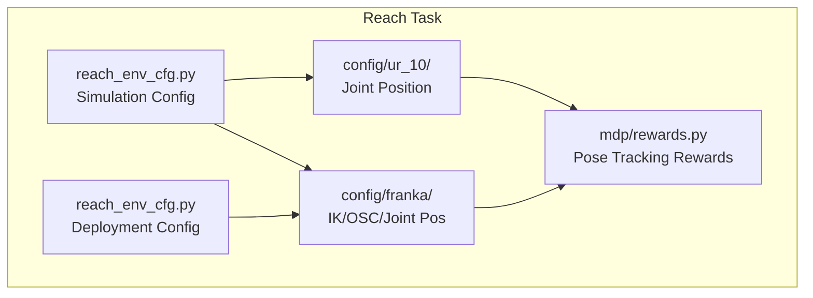
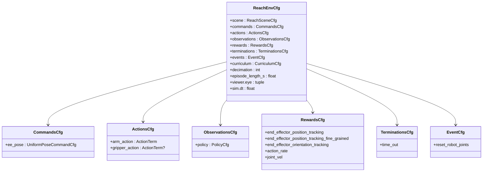
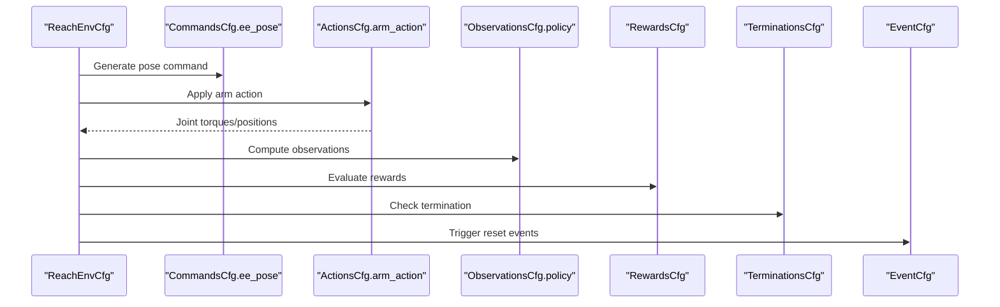
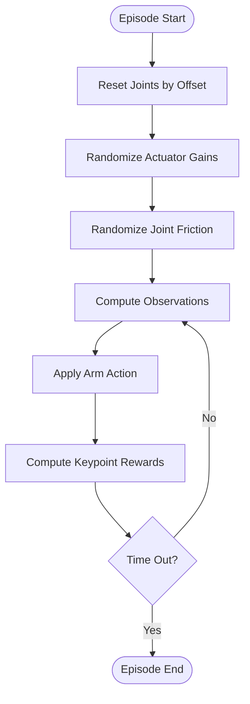
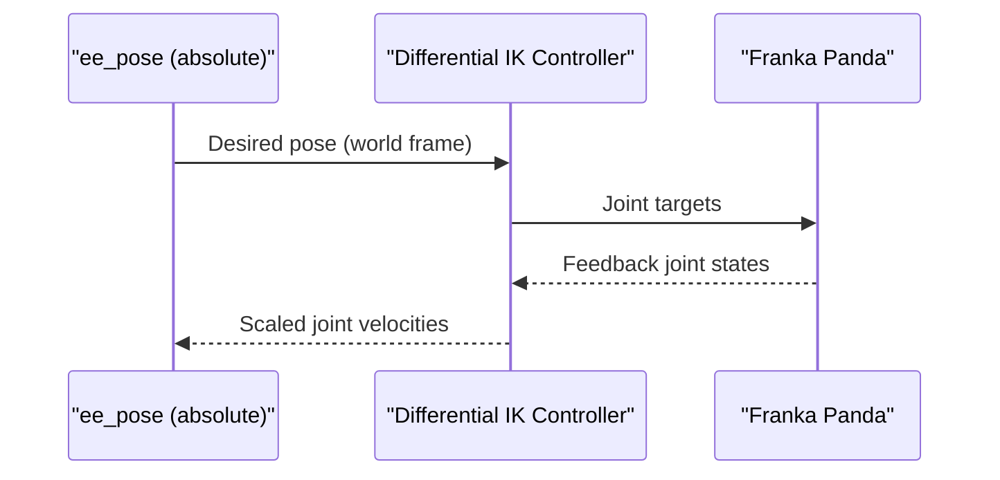
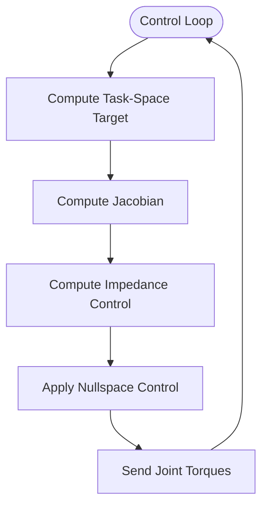
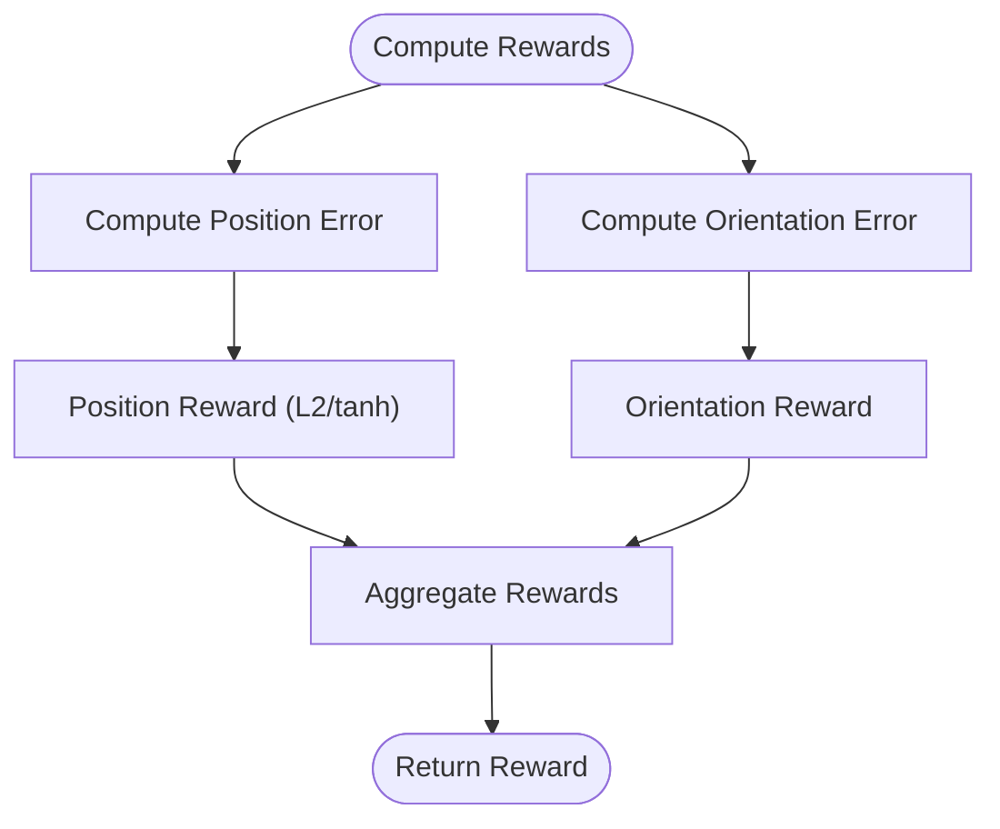
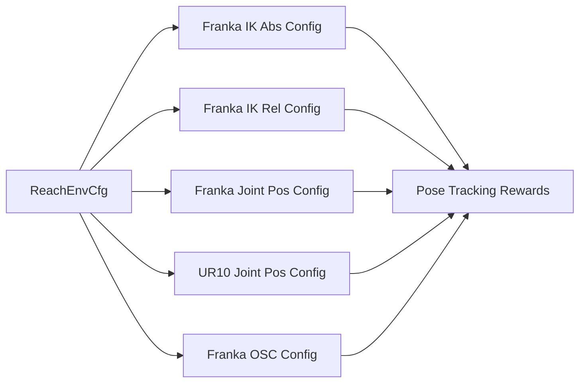

# Reaching Movements

<cite>
**Referenced Files in This Document**
- [reach_env_cfg.py](file://source/robot_lab/robot_lab/tasks/manager_based/manipulation/reach/reach_env_cfg.py)
- [reach_env_cfg.py](file://source/robot_lab/robot_lab/tasks/manager_based/manipulation/deploy/reach/reach_env_cfg.py)
- [rewards.py](file://source/robot_lab/robot_lab/tasks/manager_based/manipulation/reach/mdp/rewards.py)
- [ik_abs_env_cfg.py](file://source/robot_lab/robot_lab/tasks/manager_based/manipulation/reach/config/franka/ik_abs_env_cfg.py)
- [ik_rel_env_cfg.py](file://source/robot_lab/robot_lab/tasks/manager_based/manipulation/reach/config/franka/ik_rel_env_cfg.py)
- [joint_pos_env_cfg.py](file://source/robot_lab/robot_lab/tasks/manager_based/manipulation/reach/config/franka/joint_pos_env_cfg.py)
- [osc_env_cfg.py](file://source/robot_lab/robot_lab/tasks/manager_based/manipulation/reach/config/franka/osc_env_cfg.py)
- [joint_pos_env_cfg.py](file://source/robot_lab/robot_lab/tasks/manager_based/manipulation/reach/config/ur_10/joint_pos_env_cfg.py)
</cite>

## Table of Contents
1. [Introduction](#introduction)
2. [Project Structure](#project-structure)
3. [Core Components](#core-components)
4. [Architecture Overview](#architecture-overview)
5. [Detailed Component Analysis](#detailed-component-analysis)
6. [Dependency Analysis](#dependency-analysis)
7. [Performance Considerations](#performance-considerations)
8. [Troubleshooting Guide](#troubleshooting-guide)
9. [Conclusion](#conclusion)

## Introduction
This document explains the reaching movement system implemented in the robot lab repository. It focuses on how environments are configured for robotic arm reaching tasks, how motion control is achieved via inverse kinematics and operational space control, and how reward shaping supports precise end-effector pose tracking. The system leverages a manager-based reinforcement learning framework with modular components for scenes, commands, actions, observations, rewards, terminations, and events.

## Project Structure
The reaching functionality is organized under a task-specific module with separate configurations for simulation and deployment scenarios:
- Simulation-based reaching environment configuration
- Deployment-ready reaching environment configuration
- Motion control strategies (inverse kinematics absolute/relative, joint position control, operational space control)
- Reward implementations for pose tracking

**Diagram sources**
- [reach_env_cfg.py:188-230](file://source/robot_lab/robot_lab/tasks/manager_based/manipulation/reach/reach_env_cfg.py#L188-L230)
- [reach_env_cfg.py:192-216](file://source/robot_lab/robot_lab/tasks/manager_based/manipulation/deploy/reach/reach_env_cfg.py#L192-L216)
- [ik_abs_env_cfg.py:18-36](file://source/robot_lab/robot_lab/tasks/manager_based/manipulation/reach/config/franka/ik_abs_env_cfg.py#L18-L36)
- [joint_pos_env_cfg.py:24-45](file://source/robot_lab/robot_lab/tasks/manager_based/manipulation/reach/config/franka/joint_pos_env_cfg.py#L24-L45)
- [osc_env_cfg.py:18-58](file://source/robot_lab/robot_lab/tasks/manager_based/manipulation/reach/config/franka/osc_env_cfg.py#L18-L58)
- [joint_pos_env_cfg.py:24-46](file://source/robot_lab/robot_lab/tasks/manager_based/manipulation/reach/config/ur_10/joint_pos_env_cfg.py#L24-L46)
- [rewards.py:19-70](file://source/robot_lab/robot_lab/tasks/manager_based/manipulation/reach/mdp/rewards.py#L19-L70)

**Section sources**
- [reach_env_cfg.py:188-230](file://source/robot_lab/robot_lab/tasks/manager_based/manipulation/reach/reach_env_cfg.py#L188-L230)
- [reach_env_cfg.py:192-216](file://source/robot_lab/robot_lab/tasks/manager_based/manipulation/deploy/reach/reach_env_cfg.py#L192-L216)

## Core Components
- Scene configuration defines the world, robot, lighting, and optional table props.
- Command generation produces time-varying end-effector pose targets sampled within specified bounds.
- Action configuration selects control modes: differential inverse kinematics (absolute/relative), joint position control, or operational space control.
- Observation groups assemble state features for the policy.
- Reward functions penalize position and orientation tracking errors and discourage excessive actions.
- Termination conditions include episode timeouts.
- Events handle robot resets and environmental randomization for robustness.

Key implementation references:
- Scene and environment configuration: [reach_env_cfg.py:35-230](file://source/robot_lab/robot_lab/tasks/manager_based/manipulation/reach/reach_env_cfg.py#L35-L230)
- Pose tracking rewards: [rewards.py:19-70](file://source/robot_lab/robot_lab/tasks/manager_based/manipulation/reach/mdp/rewards.py#L19-L70)
- Robot-specific configurations (Franka): [ik_abs_env_cfg.py:18-36](file://source/robot_lab/robot_lab/tasks/manager_based/manipulation/reach/config/franka/ik_abs_env_cfg.py#L18-L36), [ik_rel_env_cfg.py:18-36](file://source/robot_lab/robot_lab/tasks/manager_based/manipulation/reach/config/franka/ik_rel_env_cfg.py#L18-L36), [joint_pos_env_cfg.py:24-45](file://source/robot_lab/robot_lab/tasks/manager_based/manipulation/reach/config/franka/joint_pos_env_cfg.py#L24-L45), [osc_env_cfg.py:18-58](file://source/robot_lab/robot_lab/tasks/manager_based/manipulation/reach/config/franka/osc_env_cfg.py#L18-L58)
- Robot-specific configurations (UR10): [joint_pos_env_cfg.py:24-46](file://source/robot_lab/robot_lab/tasks/manager_based/manipulation/reach/config/ur_10/joint_pos_env_cfg.py#L24-L46)

**Section sources**
- [reach_env_cfg.py:35-230](file://source/robot_lab/robot_lab/tasks/manager_based/manipulation/reach/reach_env_cfg.py#L35-L230)
- [rewards.py:19-70](file://source/robot_lab/robot_lab/tasks/manager_based/manipulation/reach/mdp/rewards.py#L19-L70)
- [ik_abs_env_cfg.py:18-36](file://source/robot_lab/robot_lab/tasks/manager_based/manipulation/reach/config/franka/ik_abs_env_cfg.py#L18-L36)
- [ik_rel_env_cfg.py:18-36](file://source/robot_lab/robot_lab/tasks/manager_based/manipulation/reach/config/franka/ik_rel_env_cfg.py#L18-L36)
- [joint_pos_env_cfg.py:24-45](file://source/robot_lab/robot_lab/tasks/manager_based/manipulation/reach/config/franka/joint_pos_env_cfg.py#L24-L45)
- [osc_env_cfg.py:18-58](file://source/robot_lab/robot_lab/tasks/manager_based/manipulation/reach/config/franka/osc_env_cfg.py#L18-L58)
- [joint_pos_env_cfg.py:24-46](file://source/robot_lab/robot_lab/tasks/manager_based/manipulation/reach/config/ur_10/joint_pos_env_cfg.py#L24-L46)

## Architecture Overview
The reaching system composes environment configuration classes with modular managers for commands, actions, observations, rewards, terminations, and events. Robot-specific subclasses specialize control strategies while sharing common scene and reward frameworks.

**Diagram sources**
- [reach_env_cfg.py:69-230](file://source/robot_lab/robot_lab/tasks/manager_based/manipulation/reach/reach_env_cfg.py#L69-L230)

## Detailed Component Analysis

### Simulation-Based Reaching Environment
- Scene: Ground plane, optional table prop, dome lighting, and a configurable robot articulation.
- Commands: Time-varying end-effector pose targets sampled within spatial bounds; orientation ranges adapt to end-effector axis.
- Actions: Configurable arm action term; optional gripper action.
- Observations: Concatenated policy observations including joint positions/velocities, generated commands, and last action.
- Rewards: Penalizes position and orientation tracking errors; discourages action rate and joint velocities.
- Terminations: Episode timeout termination.
- Curriculum: Gradually modifies weights for action rate and joint velocity penalties.
- Teleoperation: Keyboard, gamepad, and spacemouse devices configured for interactive control.

Implementation references:
- Scene and environment: [reach_env_cfg.py:35-230](file://source/robot_lab/robot_lab/tasks/manager_based/manipulation/reach/reach_env_cfg.py#L35-L230)
- Pose tracking rewards: [rewards.py:19-70](file://source/robot_lab/robot_lab/tasks/manager_based/manipulation/reach/mdp/rewards.py#L19-L70)

**Diagram sources**
- [reach_env_cfg.py:69-230](file://source/robot_lab/robot_lab/tasks/manager_based/manipulation/reach/reach_env_cfg.py#L69-L230)
- [rewards.py:19-70](file://source/robot_lab/robot_lab/tasks/manager_based/manipulation/reach/mdp/rewards.py#L19-L70)

**Section sources**
- [reach_env_cfg.py:35-230](file://source/robot_lab/robot_lab/tasks/manager_based/manipulation/reach/reach_env_cfg.py#L35-L230)
- [rewards.py:19-70](file://source/robot_lab/robot_lab/tasks/manager_based/manipulation/reach/mdp/rewards.py#L19-L70)

### Deployment-Based Reaching Environment
- Scene: Simplified scene with ground, robot, and a stand prop; designed for real-robot deployment.
- Commands: Same end-effector pose command generator as simulation.
- Actions: Configurable arm action term; optional gripper action.
- Observations: Joint positions and velocities with minimal noise; generated commands included.
- Rewards: Keypoint-based tracking rewards with exponential shaping; discourages action rate and action magnitude.
- Events: Joint reset with offset, randomized actuator gains, and joint friction for robustness.
- Terminations: Episode timeout termination.

Implementation references:
- Scene and environment: [reach_env_cfg.py:30-216](file://source/robot_lab/robot_lab/tasks/manager_based/manipulation/deploy/reach/reach_env_cfg.py#L30-L216)

**Diagram sources**
- [reach_env_cfg.py:112-184](file://source/robot_lab/robot_lab/tasks/manager_based/manipulation/deploy/reach/reach_env_cfg.py#L112-L184)

**Section sources**
- [reach_env_cfg.py:30-216](file://source/robot_lab/robot_lab/tasks/manager_based/manipulation/deploy/reach/reach_env_cfg.py#L30-L216)

### Motion Control Strategies

#### Inverse Kinematics (Absolute Mode)
- Uses differential inverse kinematics with absolute pose commands.
- Robot-specific: Franka Panda with high PD gains for improved tracking.
- End-effector offset accounts for tooling or sensor placement.

Implementation references:
- [ik_abs_env_cfg.py:18-36](file://source/robot_lab/robot_lab/tasks/manager_based/manipulation/reach/config/franka/ik_abs_env_cfg.py#L18-L36)

**Diagram sources**
- [ik_abs_env_cfg.py:28-35](file://source/robot_lab/robot_lab/tasks/manager_based/manipulation/reach/config/franka/ik_abs_env_cfg.py#L28-L35)

**Section sources**
- [ik_abs_env_cfg.py:18-36](file://source/robot_lab/robot_lab/tasks/manager_based/manipulation/reach/config/franka/ik_abs_env_cfg.py#L18-L36)

#### Inverse Kinematics (Relative Mode)
- Uses differential inverse kinematics with relative pose commands.
- Scales commanded motion for safe teleoperation.
- End-effector offset accounts for tooling or sensor placement.

Implementation references:
- [ik_rel_env_cfg.py:18-36](file://source/robot_lab/robot_lab/tasks/manager_based/manipulation/reach/config/franka/ik_rel_env_cfg.py#L18-L36)

**Section sources**
- [ik_rel_env_cfg.py:18-36](file://source/robot_lab/robot_lab/tasks/manager_based/manipulation/reach/config/franka/ik_rel_env_cfg.py#L18-L36)

#### Joint Position Control
- Directly commands joint positions for simpler control loops.
- Suitable for teaching and baseline comparisons.
- Robot-specific: Franka Panda and UR10 with appropriate joint naming and end-effector frames.

Implementation references:
- [joint_pos_env_cfg.py:24-45](file://source/robot_lab/robot_lab/tasks/manager_based/manipulation/reach/config/franka/joint_pos_env_cfg.py#L24-L45)
- [joint_pos_env_cfg.py:24-46](file://source/robot_lab/robot_lab/tasks/manager_based/manipulation/reach/config/ur_10/joint_pos_env_cfg.py#L24-L46)

**Section sources**
- [joint_pos_env_cfg.py:24-45](file://source/robot_lab/robot_lab/tasks/manager_based/manipulation/reach/config/franka/joint_pos_env_cfg.py#L24-L45)
- [joint_pos_env_cfg.py:24-46](file://source/robot_lab/robot_lab/tasks/manager_based/manipulation/reach/config/ur_10/joint_pos_env_cfg.py#L24-L46)

#### Operational Space Control (OSC)
- Effort-based control with variable stiffness and gravity compensation disabled.
- Removes joint position/velocity observations to reduce dimensionality.
- Robot-specific: Franka Panda with selected actuators decoupled for compliant behavior.

Implementation references:
- [osc_env_cfg.py:18-58](file://source/robot_lab/robot_lab/tasks/manager_based/manipulation/reach/config/franka/osc_env_cfg.py#L18-L58)

**Diagram sources**
- [osc_env_cfg.py:36-58](file://source/robot_lab/robot_lab/tasks/manager_based/manipulation/reach/config/franka/osc_env_cfg.py#L36-L58)

**Section sources**
- [osc_env_cfg.py:18-58](file://source/robot_lab/robot_lab/tasks/manager_based/manipulation/reach/config/franka/osc_env_cfg.py#L18-L58)

### Pose Tracking Rewards
- Position tracking error using L2 norm and a fine-grained tanh kernel.
- Orientation tracking error using quaternion shortest path.
- These rewards guide the end-effector toward desired poses while maintaining smooth motion.

Implementation references:
- [rewards.py:19-70](file://source/robot_lab/robot_lab/tasks/manager_based/manipulation/reach/mdp/rewards.py#L19-L70)

**Diagram sources**
- [rewards.py:19-70](file://source/robot_lab/robot_lab/tasks/manager_based/manipulation/reach/mdp/rewards.py#L19-L70)

**Section sources**
- [rewards.py:19-70](file://source/robot_lab/robot_lab/tasks/manager_based/manipulation/reach/mdp/rewards.py#L19-L70)

## Dependency Analysis
The reaching system exhibits clear modularity:
- Environment configurations inherit from a base reach environment and override robot, actions, commands, and reward bodies.
- Motion control strategies are encapsulated in robot-specific configuration files.
- Reward implementations depend on command manager and asset data.

**Diagram sources**
- [reach_env_cfg.py:188-230](file://source/robot_lab/robot_lab/tasks/manager_based/manipulation/reach/reach_env_cfg.py#L188-L230)
- [ik_abs_env_cfg.py:18-36](file://source/robot_lab/robot_lab/tasks/manager_based/manipulation/reach/config/franka/ik_abs_env_cfg.py#L18-L36)
- [ik_rel_env_cfg.py:18-36](file://source/robot_lab/robot_lab/tasks/manager_based/manipulation/reach/config/franka/ik_rel_env_cfg.py#L18-L36)
- [joint_pos_env_cfg.py:24-45](file://source/robot_lab/robot_lab/tasks/manager_based/manipulation/reach/config/franka/joint_pos_env_cfg.py#L24-L45)
- [joint_pos_env_cfg.py:24-46](file://source/robot_lab/robot_lab/tasks/manager_based/manipulation/reach/config/ur_10/joint_pos_env_cfg.py#L24-L46)
- [osc_env_cfg.py:18-58](file://source/robot_lab/robot_lab/tasks/manager_based/manipulation/reach/config/franka/osc_env_cfg.py#L18-L58)
- [rewards.py:19-70](file://source/robot_lab/robot_lab/tasks/manager_based/manipulation/reach/mdp/rewards.py#L19-L70)

**Section sources**
- [reach_env_cfg.py:188-230](file://source/robot_lab/robot_lab/tasks/manager_based/manipulation/reach/reach_env_cfg.py#L188-L230)
- [ik_abs_env_cfg.py:18-36](file://source/robot_lab/robot_lab/tasks/manager_based/manipulation/reach/config/franka/ik_abs_env_cfg.py#L18-L36)
- [ik_rel_env_cfg.py:18-36](file://source/robot_lab/robot_lab/tasks/manager_based/manipulation/reach/config/franka/ik_rel_env_cfg.py#L18-L36)
- [joint_pos_env_cfg.py:24-45](file://source/robot_lab/robot_lab/tasks/manager_based/manipulation/reach/config/franka/joint_pos_env_cfg.py#L24-L45)
- [joint_pos_env_cfg.py:24-46](file://source/robot_lab/robot_lab/tasks/manager_based/manipulation/reach/config/ur_10/joint_pos_env_cfg.py#L24-L46)
- [osc_env_cfg.py:18-58](file://source/robot_lab/robot_lab/tasks/manager_based/manipulation/reach/config/franka/osc_env_cfg.py#L18-L58)
- [rewards.py:19-70](file://source/robot_lab/robot_lab/tasks/manager_based/manipulation/reach/mdp/rewards.py#L19-L70)

## Performance Considerations
- Simulation fidelity: Higher simulation frequency and rendering intervals improve control responsiveness in simulation.
- Action scaling: Proper scaling of IK and OSC actions prevents large accelerations and improves stability.
- Observation space: Reducing unnecessary observations (e.g., removing joint states in OSC) can improve training efficiency.
- Curriculum: Gradual adjustment of reward weights helps stabilize early learning.

[No sources needed since this section provides general guidance]

## Troubleshooting Guide
Common issues and resolutions:
- End-effector drift: Verify command body names match the robot's end-effector link and adjust orientation ranges accordingly.
- Excessive action magnitudes: Reduce action scales in IK/OSC configurations and increase action penalty weights.
- Instability during OSC: Disable gravity compensation and tune motion stiffness/damping ratios; ensure nullspace control is configured appropriately.
- Deployment mismatch: Confirm observation preprocessing and reward shapes align between simulation and deployment configurations.

**Section sources**
- [reach_env_cfg.py:188-230](file://source/robot_lab/robot_lab/tasks/manager_based/manipulation/reach/reach_env_cfg.py#L188-L230)
- [reach_env_cfg.py:192-216](file://source/robot_lab/robot_lab/tasks/manager_based/manipulation/deploy/reach/reach_env_cfg.py#L192-L216)
- [osc_env_cfg.py:18-58](file://source/robot_lab/robot_lab/tasks/manager_based/manipulation/reach/config/franka/osc_env_cfg.py#L18-L58)

## Conclusion
The reaching movement system provides a flexible, modular framework for robotic arm pose tracking across simulation and real-world deployment. By composing environment configurations with robot-specific control strategies and reward functions, it enables rapid experimentation and robust policy training. The design emphasizes clear separation of concerns, enabling easy adaptation to new robots and control modalities.