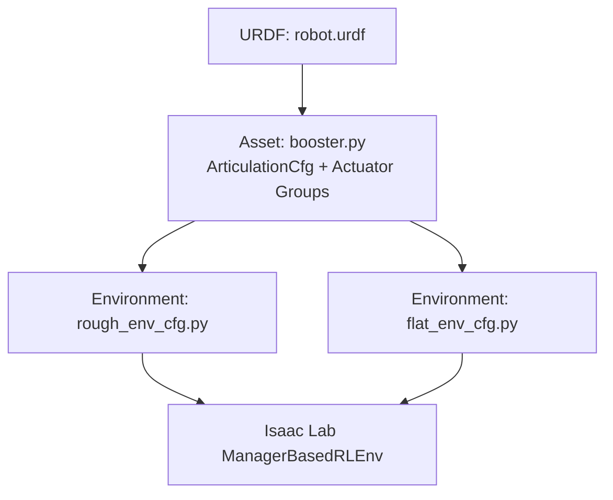
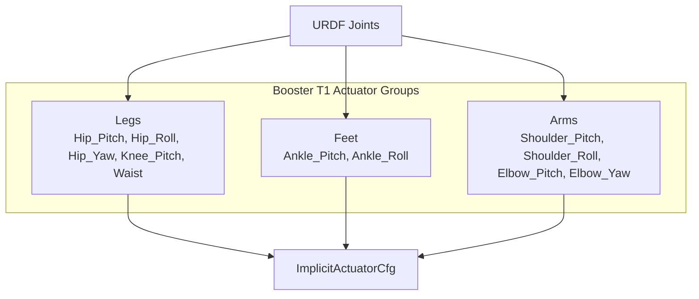
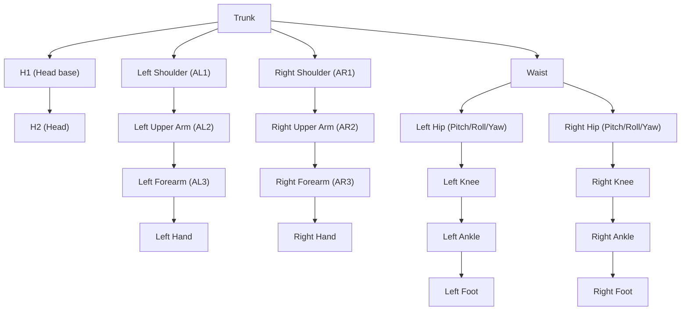
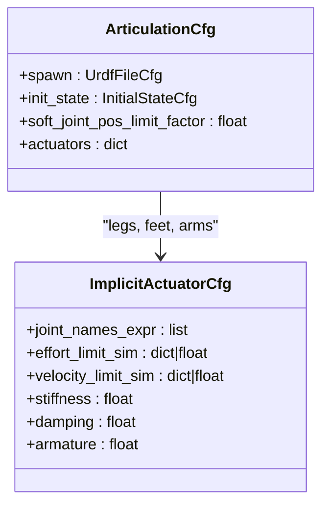
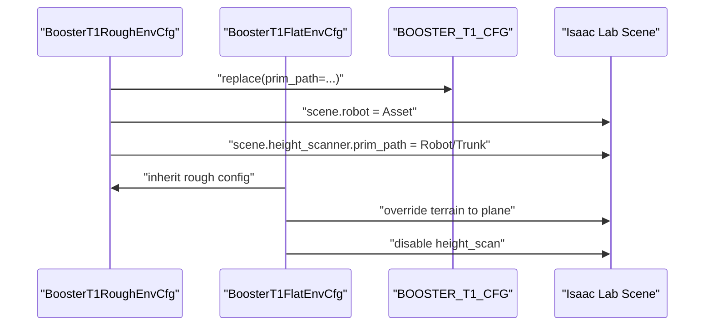
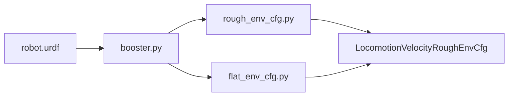

# Booster T1 Humanoid

<cite>
**Referenced Files in This Document**
- [README.md](file://README.md)
- [booster.py](file://source/robot_lab/robot_lab/assets/booster.py)
- [robot.urdf](file://source/robot_lab/data/Robots/booster/t1_description/urdf/robot.urdf)
- [flat_env_cfg.py](file://source/robot_lab/robot_lab/tasks/manager_based/locomotion/velocity/config/humanoid/booster_t1/flat_env_cfg.py)
- [rough_env_cfg.py](file://source/robot_lab/robot_lab/tasks/manager_based/locomotion/velocity/config/humanoid/booster_t1/rough_env_cfg.py)
- [booster_t1.png](file://docs/imgs/booster_t1.png)
</cite>

## Table of Contents
1. [Introduction](#introduction)
2. [Project Structure](#project-structure)
3. [Core Components](#core-components)
4. [Architecture Overview](#architecture-overview)
5. [Detailed Component Analysis](#detailed-component-analysis)
6. [Dependency Analysis](#dependency-analysis)
7. [Performance Considerations](#performance-considerations)
8. [Troubleshooting Guide](#troubleshooting-guide)
9. [Conclusion](#conclusion)
10. [Appendices](#appendices)

## Introduction
This document describes the Booster T1 humanoid configuration within the robot_lab ecosystem. It explains the distinctive mechanical characteristics and design philosophy reflected in the URDF and the simulated actuator model, and how these influence control architecture and reinforcement learning research use cases. It also documents the environment configuration that integrates the robot into locomotion tasks and highlights the unique challenges and opportunities presented by the design for RL and robotics research.

## Project Structure
The Booster T1 configuration is organized around:
- A URDF description of the robot’s links and joints
- An articulated asset definition that maps the URDF into the Isaac Lab simulation and defines actuator groups and limits
- Environment configurations that instantiate the robot into flat and rough terrain locomotion tasks

**Diagram sources**
- [robot.urdf](file://source/robot_lab/data/Robots/booster/t1_description/urdf/robot.urdf#L1-L670)
- [booster.py](file://source/robot_lab/robot_lab/assets/booster.py#L10-L108)
- [rough_env_cfg.py](file://source/robot_lab/robot_lab/tasks/manager_based/locomotion/velocity/config/humanoid/booster_t1/rough_env_cfg.py#L16-L36)
- [flat_env_cfg.py](file://source/robot_lab/robot_lab/tasks/manager_based/locomotion/velocity/config/humanoid/booster_t1/flat_env_cfg.py#L9-L32)

**Section sources**
- [README.md](file://README.md#L1-L501)
- [booster.py](file://source/robot_lab/robot_lab/assets/booster.py#L10-L108)
- [robot.urdf](file://source/robot_lab/data/Robots/booster/t1_description/urdf/robot.urdf#L1-L670)
- [rough_env_cfg.py](file://source/robot_lab/robot_lab/tasks/manager_based/locomotion/velocity/config/humanoid/booster_t1/rough_env_cfg.py#L16-L36)
- [flat_env_cfg.py](file://source/robot_lab/robot_lab/tasks/manager_based/locomotion/velocity/config/humanoid/booster_t1/flat_env_cfg.py#L9-L32)

## Core Components
- Robot description: The URDF defines the kinematic chain and inertial properties for head, arms, waist, and legs.
- Asset configuration: The ArticulationCfg in booster.py loads the URDF, sets initial conditions, and groups actuators into “legs”, “feet”, and “arms” with per-group effort/velocity limits and PD-like implicit actuators.
- Environments: The flat and rough environment configurations embed the robot into locomotion tasks, adjusting observations and rewards.

Key implementation references:
- URDF links and joints: [robot.urdf](file://source/robot_lab/data/Robots/booster/t1_description/urdf/robot.urdf#L1-L670)
- Actuator groups and limits: [booster.py](file://source/robot_lab/robot_lab/assets/booster.py#L59-L107)
- Environment instantiation and overrides: [rough_env_cfg.py](file://source/robot_lab/robot_lab/tasks/manager_based/locomotion/velocity/config/humanoid/booster_t1/rough_env_cfg.py#L16-L36), [flat_env_cfg.py](file://source/robot_lab/robot_lab/tasks/manager_based/locomotion/velocity/config/humanoid/booster_t1/flat_env_cfg.py#L9-L32)

**Section sources**
- [booster.py](file://source/robot_lab/robot_lab/assets/booster.py#L10-L108)
- [robot.urdf](file://source/robot_lab/data/Robots/booster/t1_description/urdf/robot.urdf#L1-L670)
- [rough_env_cfg.py](file://source/robot_lab/robot_lab/tasks/manager_based/locomotion/velocity/config/humanoid/booster_t1/rough_env_cfg.py#L16-L36)
- [flat_env_cfg.py](file://source/robot_lab/robot_lab/tasks/manager_based/locomotion/velocity/config/humanoid/booster_t1/flat_env_cfg.py#L9-L32)

## Architecture Overview
The control architecture for the Booster T1 separates actuator control into three groups:
- Legs: hip, knee, and waist joints with higher torque and speed limits
- Feet: ankle pitch and roll joints with dedicated limits
- Arms: shoulder and elbow joints with moderate limits

**Diagram sources**
- [booster.py](file://source/robot_lab/robot_lab/assets/booster.py#L59-L107)
- [robot.urdf](file://source/robot_lab/data/Robots/booster/t1_description/urdf/robot.urdf#L46-L668)

## Detailed Component Analysis

### Mechanical Design Philosophy and Joint Layout
- Head and neck: Yaw and pitch joints enable wide horizontal and vertical field of view for perception tasks.
- Arms: Shoulder pitch, roll, and elbow pitch/yaw define a reachy, symmetric upper body suitable for manipulation and balance support.
- Waist: A yaw joint connecting trunk and pelvis enables torque transmission and lateral stability.
- Legs: Hip assembly includes pitch, roll, and yaw; knee and ankle joints provide compliant stance control; foot collision geometry supports robust ground contact modeling.

**Diagram sources**
- [robot.urdf](file://source/robot_lab/data/Robots/booster/t1_description/urdf/robot.urdf#L28-L668)

**Section sources**
- [robot.urdf](file://source/robot_lab/data/Robots/booster/t1_description/urdf/robot.urdf#L1-L670)

### Actuator Layout and Control Architecture
- Actuator groups:
  - Legs: covers hip joints, waist, and knee
  - Feet: ankle pitch and roll
  - Arms: shoulder and elbow joints
- Limits and stiffness/damping:
  - Effort and velocity limits are defined per group and per joint where applicable
  - PD gains and armature are set to tune dynamic response and numerical conditioning

**Diagram sources**
- [booster.py](file://source/robot_lab/robot_lab/assets/booster.py#L10-L108)

**Section sources**
- [booster.py](file://source/robot_lab/robot_lab/assets/booster.py#L59-L107)

### Environment Integration and Observation Scaling
- The robot is embedded into locomotion tasks via environment configurations that:
  - Instantiate the robot prim under the environment namespace
  - Adjust observation scaling and disable height scanning for flat terrain
  - Override rewards and terrain settings for flat vs. rough scenarios

**Diagram sources**
- [rough_env_cfg.py](file://source/robot_lab/robot_lab/tasks/manager_based/locomotion/velocity/config/humanoid/booster_t1/rough_env_cfg.py#L16-L36)
- [flat_env_cfg.py](file://source/robot_lab/robot_lab/tasks/manager_based/locomotion/velocity/config/humanoid/booster_t1/flat_env_cfg.py#L9-L32)
- [booster.py](file://source/robot_lab/robot_lab/assets/booster.py#L10-L108)

**Section sources**
- [rough_env_cfg.py](file://source/robot_lab/robot_lab/tasks/manager_based/locomotion/velocity/config/humanoid/booster_t1/rough_env_cfg.py#L16-L36)
- [flat_env_cfg.py](file://source/robot_lab/robot_lab/tasks/manager_based/locomotion/velocity/config/humanoid/booster_t1/flat_env_cfg.py#L9-L32)

## Dependency Analysis
- The environment configurations depend on the asset definition for robot instantiation.
- The asset definition depends on the URDF for geometry and kinematics.
- The environment stack inherits from a base locomotion configuration and applies robot-specific overrides.

**Diagram sources**
- [robot.urdf](file://source/robot_lab/data/Robots/booster/t1_description/urdf/robot.urdf#L1-L670)
- [booster.py](file://source/robot_lab/robot_lab/assets/booster.py#L10-L108)
- [rough_env_cfg.py](file://source/robot_lab/robot_lab/tasks/manager_based/locomotion/velocity/config/humanoid/booster_t1/rough_env_cfg.py#L4-L13)
- [flat_env_cfg.py](file://source/robot_lab/robot_lab/tasks/manager_based/locomotion/velocity/config/humanoid/booster_t1/flat_env_cfg.py#L4-L6)

**Section sources**
- [booster.py](file://source/robot_lab/robot_lab/assets/booster.py#L10-L108)
- [rough_env_cfg.py](file://source/robot_lab/robot_lab/tasks/manager_based/locomotion/velocity/config/humanoid/booster_t1/rough_env_cfg.py#L16-L36)
- [flat_env_cfg.py](file://source/robot_lab/robot_lab/tasks/manager_based/locomotion/velocity/config/humanoid/booster_t1/flat_env_cfg.py#L9-L32)

## Performance Considerations
- Actuator limits:
  - Legs: higher torque and speed limits enable dynamic locomotion and quick adjustments
  - Feet: dedicated limits for ankle compliance and surface adaptation
  - Arms: moderate limits support manipulation and balance assistance
- Simulation settings:
  - Joint drive stiffness/damping set to zero for implicit actuator behavior
  - Solver iteration counts tuned for stability and performance
- Observation scaling:
  - Adjusted scales for base linear/angular velocities and joint terms to improve RL convergence

Practical guidance:
- Tune PD gains and armature in actuator configurations for desired dynamic response
- Validate effort/velocity limits against target tasks (e.g., high-speed running vs. precision walking)
- Monitor solver iterations and contact sensor activation for stability in complex terrains

**Section sources**
- [booster.py](file://source/robot_lab/robot_lab/assets/booster.py#L10-L108)
- [rough_env_cfg.py](file://source/robot_lab/robot_lab/tasks/manager_based/locomotion/velocity/config/humanoid/booster_t1/rough_env_cfg.py#L30-L36)
- [flat_env_cfg.py](file://source/robot_lab/robot_lab/tasks/manager_based/locomotion/velocity/config/humanoid/booster_t1/flat_env_cfg.py#L15-L32)

## Troubleshooting Guide
Common issues and resolutions:
- Robot not spawning or incorrect pose:
  - Verify URDF path in the asset configuration and prim path replacement in environments
  - Confirm initial joint positions and base position align with intended starting posture
- Excessive solver errors or instability:
  - Reduce solver iteration counts or adjust contact sensor activation
  - Check joint limit mismatches between URDF and actuator configurations
- Poor locomotion performance:
  - Calibrate observation scaling factors and reward weights
  - Validate terrain settings (flat vs. rough) match the training scenario

**Section sources**
- [booster.py](file://source/robot_lab/robot_lab/assets/booster.py#L10-L108)
- [rough_env_cfg.py](file://source/robot_lab/robot_lab/tasks/manager_based/locomotion/velocity/config/humanoid/booster_t1/rough_env_cfg.py#L16-L36)
- [flat_env_cfg.py](file://source/robot_lab/robot_lab/tasks/manager_based/locomotion/velocity/config/humanoid/booster_t1/flat_env_cfg.py#L9-L32)

## Conclusion
The Booster T1 humanoid configuration in robot_lab combines a detailed URDF with a structured actuator model and task-specific environment setups. Its actuator grouping and joint limits reflect a design emphasis on dynamic locomotion and robust ground contact, while environment configurations tailor observations and rewards for flat and rough terrains. These choices create a strong foundation for reinforcement learning research in bipedal locomotion and related control tasks.

## Appendices

### A. Mechanical Characteristics and Joint Configurations
- Head: yaw and pitch joints for wide-range orientation
- Arms: symmetric shoulder and elbow joints with yaw capability
- Waist: yaw joint for trunk-to-pelvis torque transfer
- Legs: hip triad (pitch/roll/yaw), knee, and ankle with compliant foot geometry

**Section sources**
- [robot.urdf](file://source/robot_lab/data/Robots/booster/t1_description/urdf/robot.urdf#L46-L668)

### B. Actuator Groups and Limits
- Legs: hip joints, waist, knee
- Feet: ankle pitch and roll
- Arms: shoulder and elbow joints
- Effort and velocity limits are defined per group and per joint where applicable

**Section sources**
- [booster.py](file://source/robot_lab/robot_lab/assets/booster.py#L59-L107)

### C. Environment Names and Screenshots
- Available environments include flat and rough variants for the Booster T1 humanoid

**Section sources**
- [README.md](file://README.md#L15-L42)
- [booster_t1.png](file://docs/imgs/booster_t1.png)