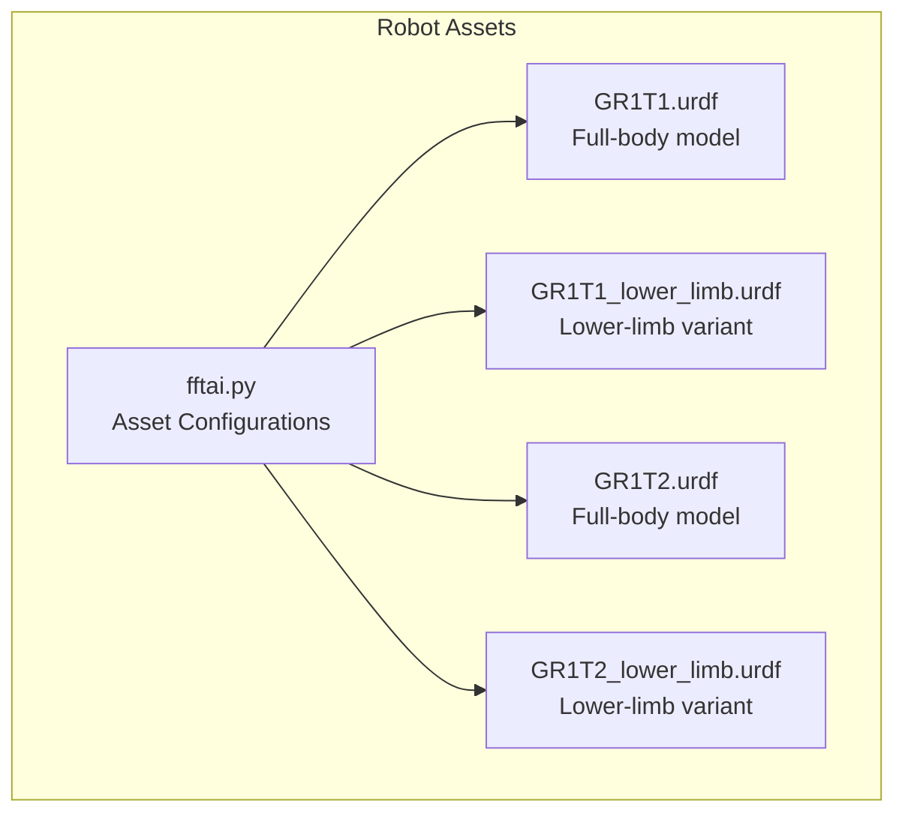
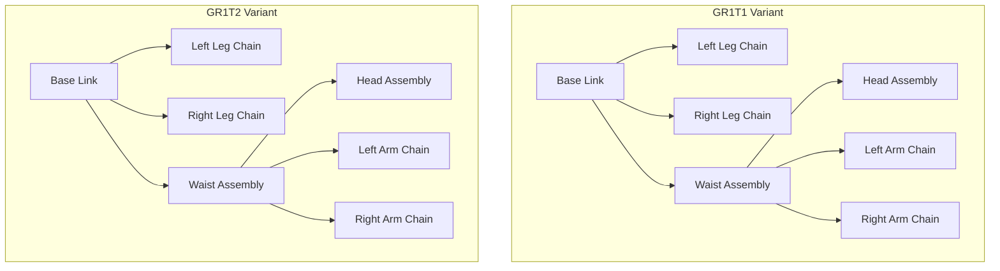
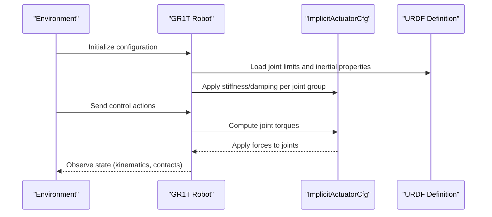
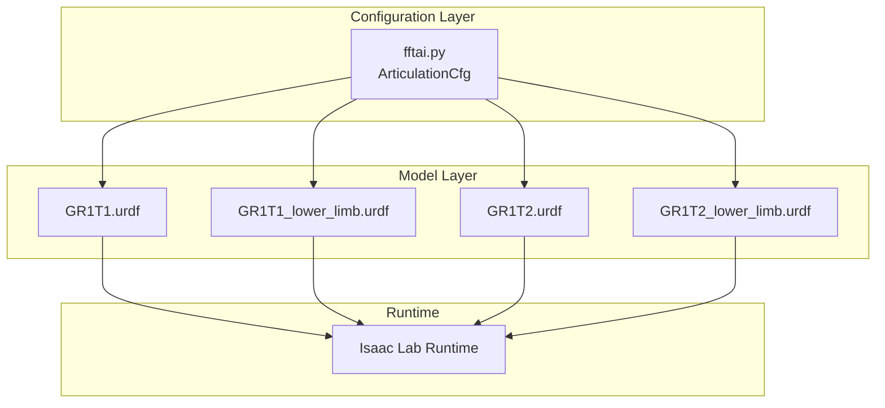

# FFTAI GR1T Humanoid Series

<cite>
**Referenced Files in This Document**
- [fftai.py](file://source/robot_lab/robot_lab/assets/fftai.py)
- [GR1T1.urdf](file://source/robot_lab/data/Robots/fftai/gr1t1_description/urdf/GR1T1.urdf)
- [GR1T1_lower_limb.urdf](file://source/robot_lab/data/Robots/fftai/gr1t1_description/urdf/GR1T1_lower_limb.urdf)
- [GR1T2.urdf](file://source/robot_lab/data/Robots/fftai/gr1t2_description/urdf/GR1T2.urdf)
- [GR1T2_lower_limb.urdf](file://source/robot_lab/data/Robots/fftai/gr1t2_description/urdf/GR1T2_lower_limb.urdf)
- [README.md](file://README.md)
</cite>

## Table of Contents
1. [Introduction](#introduction)
2. [Project Structure](#project-structure)
3. [Core Components](#core-components)
4. [Architecture Overview](#architecture-overview)
5. [Detailed Component Analysis](#detailed-component-analysis)
6. [Dependency Analysis](#dependency-analysis)
7. [Performance Considerations](#performance-considerations)
8. [Troubleshooting Guide](#troubleshooting-guide)
9. [Conclusion](#conclusion)

## Introduction
This document provides comprehensive technical documentation for the FFTAI GR1T humanoid series, focusing on the GR1T1 and GR1T2 variants. It explains their kinematic design differences, actuator configurations, joint specifications, control parameters, and specialized capabilities for humanoid robotics research. The content is derived from the robot description URDF files and the configuration module used by the Isaac Lab ecosystem.

## Project Structure
The FFTAI humanoid models are integrated into the robot_lab package as URDF-based articulated assets. The GR1T series assets are organized under the FFTAI robot family and include both full-body and lower-limb variants for different research scenarios.

**Diagram sources**
- [fftai.py](file://source/robot_lab/robot_lab/assets/fftai.py#L24-L180)
- [GR1T1.urdf](file://source/robot_lab/data/Robots/fftai/gr1t1_description/urdf/GR1T1.urdf#L1-L2023)
- [GR1T1_lower_limb.urdf](file://source/robot_lab/data/Robots/fftai/gr1t1_description/urdf/GR1T1_lower_limb.urdf#L1-L1400)
- [GR1T2.urdf](file://source/robot_lab/data/Robots/fftai/gr1t2_description/urdf/GR1T2.urdf#L1-L895)
- [GR1T2_lower_limb.urdf](file://source/robot_lab/data/Robots/fftai/gr1t2_description/urdf/GR1T2_lower_limb.urdf#L1-L1200)

**Section sources**
- [fftai.py](file://source/robot_lab/robot_lab/assets/fftai.py#L1-L181)
- [README.md](file://README.md#L34-L36)

## Core Components
- GR1T1 Full-body configuration defines a complete humanoid with legs, waist, head, and arms, including explicit joint limits and actuator stiffness/damping parameters.
- GR1T1 Lower-limb configuration fixes the upper limbs, enabling focused lower-body control and locomotion studies.
- GR1T2 Full-body configuration mirrors the GR1T1 structure but with distinct joint axes, inertial properties, and collision geometries optimized for different dynamics.
- GR1T2 Lower-limb configuration mirrors the GR1T1 lower-limb approach with GR1T2-specific joint parameters.

Key configuration aspects:
- Spawn settings: floating base, merged fixed joints, contact sensors activation.
- Initial pose: neutral stance with slight flexion in hip pitch and ankle joints.
- Actuator model: implicit PD-style actuators with configurable stiffness and damping per joint group.

**Section sources**
- [fftai.py](file://source/robot_lab/robot_lab/assets/fftai.py#L24-L180)

## Architecture Overview
The GR1T humanoid models are defined as articulated bodies with revolute joints arranged in a kinematic chain. Each model supports two variants:
- Full-body: includes head, waist, arms, and legs.
- Lower-limb: fixes upper limbs to isolate lower-body dynamics.

**Diagram sources**
- [GR1T1.urdf](file://source/robot_lab/data/Robots/fftai/gr1t1_description/urdf/GR1T1.urdf#L1-L2023)
- [GR1T2.urdf](file://source/robot_lab/data/Robots/fftai/gr1t2_description/urdf/GR1T2.urdf#L1-L895)

## Detailed Component Analysis

### GR1T1 Full-body Model
- Body structure: Base with integrated waist assembly, bilateral legs, head, and bilateral arms.
- Joint groups:
  - Legs: hip roll/yaw/pitch, knee pitch, ankle pitch/roll.
  - Waist: yaw/pitch/roll.
  - Head: yaw/pitch/roll.
  - Arms: shoulder pitch/roll/yaw, elbow pitch, wrist yaw/roll/pitch.
- Actuator configuration:
  - Stiffness and damping values are defined per joint group to balance responsiveness and stability.
  - Explicit limits for each revolute joint are defined in the URDF.

Operational envelope and mechanical advantages:
- Designed for balanced bipedal locomotion with articulated arms for dynamic balancing.
- Stiffness values emphasize stability in the lower body while maintaining compliant wrist control.

Control parameters:
- Initial pose sets knees slightly flexed and ankles near neutral.
- Actuator PD gains tuned for stable walking and manipulation tasks.

**Section sources**
- [GR1T1.urdf](file://source/robot_lab/data/Robots/fftai/gr1t1_description/urdf/GR1T1.urdf#L1-L2023)
- [fftai.py](file://source/robot_lab/robot_lab/assets/fftai.py#L24-L139)

### GR1T1 Lower-limb Variant
- Purpose: isolate lower-body dynamics for gait and locomotion research.
- Configuration: upper limbs fixed; only hip roll/yaw/pitch, knee pitch, and ankle joints remain actuated.
- Actuator tuning: reduced stiffness/damping applied to hip/knee/ankle joints to emphasize ground contact compliance.

Control challenges:
- Requires careful PD tuning to maintain balance with limited arm assistance.
- Suitable for learning-based locomotion policies focused on feet-ground interaction.

**Section sources**
- [GR1T1_lower_limb.urdf](file://source/robot_lab/data/Robots/fftai/gr1t1_description/urdf/GR1T1_lower_limb.urdf#L1-L1400)
- [fftai.py](file://source/robot_lab/robot_lab/assets/fftai.py#L143-L168)

### GR1T2 Full-body Model
- Body structure: Base with integrated waist assembly, bilateral legs, and head; arms are included but fixed in lower-limb variant.
- Notable differences from GR1T1:
  - Joint axes and inertial distributions differ (e.g., hip yaw axis is pure z in GR1T2).
  - Collision geometries for legs and arms adjusted (e.g., longer thigh collision cylinders).
  - Head assembly uses separate links for yaw/roll/pitch with fixed joints in lower-limb variant.
- Actuator configuration: similar grouping as GR1T1 but with different numerical values reflecting mass/inertia differences.

Mechanical advantages:
- Optimized for different inertia distribution and collision modeling.
- Suitable for comparative studies between model variants.

**Section sources**
- [GR1T2.urdf](file://source/robot_lab/data/Robots/fftai/gr1t2_description/urdf/GR1T2.urdf#L1-L895)
- [fftai.py](file://source/robot_lab/robot_lab/assets/fftai.py#L171-L180)

### GR1T2 Lower-limb Variant
- Purpose: lower-body-only control with fixed arms.
- Configuration: upper limbs fixed; only hip roll/yaw/pitch, knee pitch, and ankle joints remain actuated.
- Differences from GR1T1 lower-limb:
  - Joint axes and limits adapted to GR1T2 geometry.
  - Collision models updated to match GR1T2 leg segments.

Control challenges:
- Requires adaptation of PD gains to match GR1T2 inertia and joint limits.
- Useful for evaluating locomotion strategies across different body designs.

**Section sources**
- [GR1T2_lower_limb.urdf](file://source/robot_lab/data/Robots/fftai/gr1t2_description/urdf/GR1T2_lower_limb.urdf#L1-L1200)
- [fftai.py](file://source/robot_lab/robot_lab/assets/fftai.py#L176-L180)

### Control Parameter Tuning and Challenges
- PD gains:
  - Lower-body joints (hip/knee/ankle) use higher stiffness for stability during contact phases.
  - Upper-body joints (shoulders/elbows/wrists) use moderate to low stiffness for dexterous manipulation.
- Initialization:
  - Neutral stance with slight knee flexion and relaxed arms reduces initial contact transients.
- Parameter selection rationale:
  - Stiffness values reflect joint loads and desired dynamic behavior.
  - Damping values balance oscillation suppression and responsiveness.

Unique control challenges for FFTAI humanoids:
- Managing contact forces with compliant ankles and knees.
- Coordinating arm-assisted balancing versus lower-body-only control.
- Adapting PD gains when switching between GR1T1 and GR1T2 variants due to differing inertia and joint axes.

**Section sources**
- [fftai.py](file://source/robot_lab/robot_lab/assets/fftai.py#L47-L139)

## Architecture Overview

**Diagram sources**
- [fftai.py](file://source/robot_lab/robot_lab/assets/fftai.py#L24-L139)
- [GR1T1.urdf](file://source/robot_lab/data/Robots/fftai/gr1t1_description/urdf/GR1T1.urdf#L1-L2023)
- [GR1T2.urdf](file://source/robot_lab/data/Robots/fftai/gr1t2_description/urdf/GR1T2.urdf#L1-L895)

## Detailed Component Analysis

### Kinematic Design Differences: GR1T1 vs GR1T2
- Hip yaw axis:
  - GR1T1: Non-zero x/y components in hip yaw axis definition.
  - GR1T2: Pure z-axis hip yaw rotation.
- Thigh collision geometry:
  - GR1T1: Cylinder collision with length 0.25 m.
  - GR1T2: Cylinder collision with length 0.35 m, reflecting longer thigh segment.
- Waist assembly:
  - Both models include yaw/pitch/roll joints; GR1T2 adds a fixed torso link connecting to the head assembly.
- Head assembly:
  - GR1T1: Separate head yaw/roll/pitch links with fixed joints in lower-limb variant.
  - GR1T2: Separate head yaw/roll/pitch links with fixed joints in lower-limb variant.

Mechanical implications:
- GR1T2’s pure z-axis hip yaw simplifies lateral movement modeling.
- Longer thigh collisions in GR1T2 improve robustness during stance-phase contact.

**Section sources**
- [GR1T1.urdf](file://source/robot_lab/data/Robots/fftai/gr1t1_description/urdf/GR1T1.urdf#L100-L106)
- [GR1T2.urdf](file://source/robot_lab/data/Robots/fftai/gr1t2_description/urdf/GR1T2.urdf#L60-L66)
- [GR1T1.urdf](file://source/robot_lab/data/Robots/fftai/gr1t1_description/urdf/GR1T1.urdf#L314-L319)
- [GR1T2.urdf](file://source/robot_lab/data/Robots/fftai/gr1t2_description/urdf/GR1T2.urdf#L288-L293)

### Joint Specifications and Limits
- Leg joints:
  - Hip roll/yaw/pitch: limits vary by model; GR1T2 generally uses broader yaw range.
  - Knee pitch: similar ranges across models.
  - Ankle pitch/roll: GR1T2 specifies higher ankle pitch limits.
- Waist/head joints:
  - Waist yaw/pitch/roll: broadly similar across models.
  - Head yaw/pitch/roll: fixed in lower-limb variants.

Effort/velocity limits:
- Reflect actuator capabilities and safety margins for simulation.

**Section sources**
- [GR1T1.urdf](file://source/robot_lab/data/Robots/fftai/gr1t1_description/urdf/GR1T1.urdf#L102-L106)
- [GR1T2.urdf](file://source/robot_lab/data/Robots/fftai/gr1t2_description/urdf/GR1T2.urdf#L41-L42)
- [GR1T1.urdf](file://source/robot_lab/data/Robots/fftai/gr1t1_description/urdf/GR1T1.urdf#L288-L292)
- [GR1T2.urdf](file://source/robot_lab/data/Robots/fftai/gr1t2_description/urdf/GR1T2.urdf#L120-L126)

### Actuator Configuration and Control Parameters
- Stiffness and damping:
  - Lower-body joints: higher stiffness for stability; ankle roll stiffness minimal.
  - Upper-body joints: moderate stiffness for manipulation; wrist joints very low stiffness for compliance.
- Implicit actuator model:
  - PD-style actuators with configurable gains per joint group.
  - Enables precise control tuning for different research tasks.

Initial pose:
- Slight knee flexion and relaxed arms reduce simulation transients.

**Section sources**
- [fftai.py](file://source/robot_lab/robot_lab/assets/fftai.py#L92-L139)
- [fftai.py](file://source/robot_lab/robot_lab/assets/fftai.py#L47-L90)

### Specialized Capabilities and Research Applications
- GR1T1:
  - Full-body control for bipedal locomotion and manipulation.
  - Lower-limb variant ideal for gait learning and contact dynamics studies.
- GR1T2:
  - Alternative kinematic structure for comparative research.
  - Lower-limb variant enables isolation of leg dynamics and ground interaction.

Integration with RL frameworks:
- Available as robot assets for Isaac Lab environments; see README for environment names.

**Section sources**
- [README.md](file://README.md#L34-L36)
- [fftai.py](file://source/robot_lab/robot_lab/assets/fftai.py#L171-L180)

## Dependency Analysis

**Diagram sources**
- [fftai.py](file://source/robot_lab/robot_lab/assets/fftai.py#L24-L180)
- [GR1T1.urdf](file://source/robot_lab/data/Robots/fftai/gr1t1_description/urdf/GR1T1.urdf#L1-L2023)
- [GR1T1_lower_limb.urdf](file://source/robot_lab/data/Robots/fftai/gr1t1_description/urdf/GR1T1_lower_limb.urdf#L1-L1400)
- [GR1T2.urdf](file://source/robot_lab/data/Robots/fftai/gr1t2_description/urdf/GR1T2.urdf#L1-L895)
- [GR1T2_lower_limb.urdf](file://source/robot_lab/data/Robots/fftai/gr1t2_description/urdf/GR1T2_lower_limb.urdf#L1-L1200)

**Section sources**
- [fftai.py](file://source/robot_lab/robot_lab/assets/fftai.py#L1-L181)

## Performance Considerations
- Stability vs. compliance:
  - Higher lower-body stiffness improves stability during single-support phases.
  - Lower wrist stiffness enhances manipulation precision and safety.
- Contact modeling:
  - Updated collision geometries in GR1T2 improve robustness during stance.
- Simulation fidelity:
  - Merge fixed joints and contact sensors improve simulation accuracy and performance.
- Parameter sensitivity:
  - PD gains significantly impact convergence in locomotion tasks; tune per model variant.

## Troubleshooting Guide
Common issues and resolutions:
- Excessive joint friction or instability:
  - Verify stiffness/damping values and ensure they match intended task.
- Poor contact detection:
  - Confirm contact sensors are activated and collision geometries are properly defined.
- Inconsistent behavior between GR1T1 and GR1T2:
  - Recalculate PD gains to account for differing inertia and joint axes.
- Initialization drift:
  - Adjust initial pose to reduce residual forces at contact.

**Section sources**
- [fftai.py](file://source/robot_lab/robot_lab/assets/fftai.py#L24-L46)
- [GR1T1.urdf](file://source/robot_lab/data/Robots/fftai/gr1t1_description/urdf/GR1T1.urdf#L314-L319)
- [GR1T2.urdf](file://source/robot_lab/data/Robots/fftai/gr1t2_description/urdf/GR1T2.urdf#L288-L293)

## Conclusion
The FFTAI GR1T humanoid series offers two complementary models—GR1T1 and GR1T2—each with full-body and lower-limb variants tailored for diverse humanoid robotics research. Their kinematic differences, actuator configurations, and control parameters enable studies spanning locomotion, manipulation, and comparative biomechanics. Proper tuning of PD gains and awareness of model-specific inertial and joint-axis characteristics are essential for successful deployment in simulation and potential real-world applications.