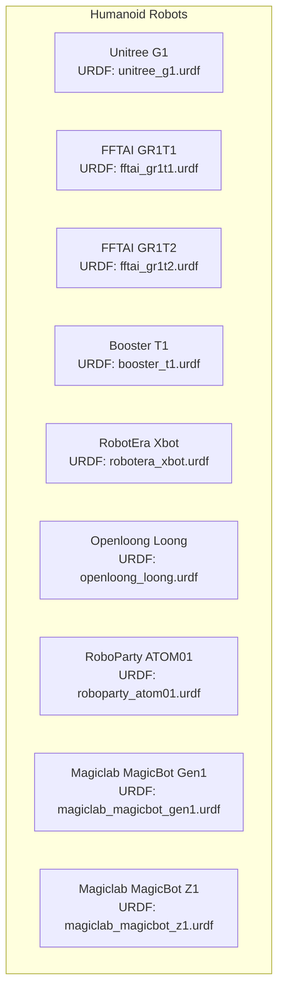
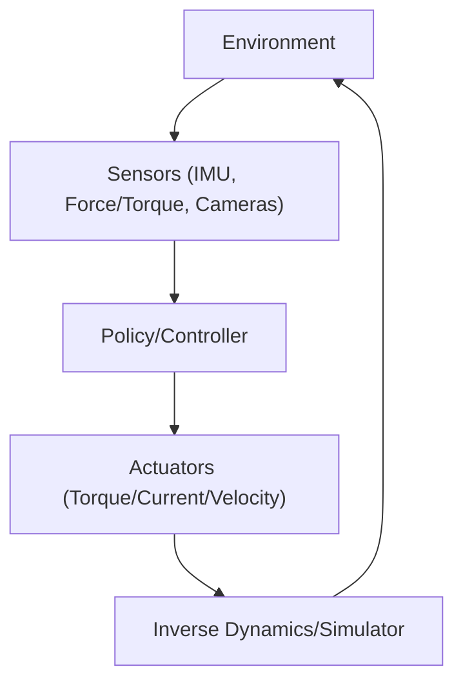
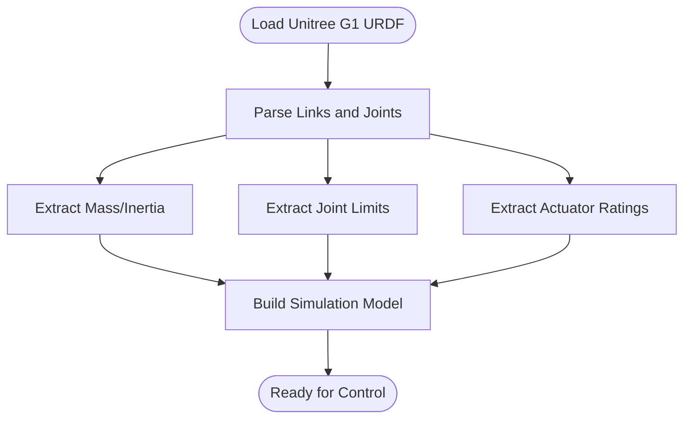
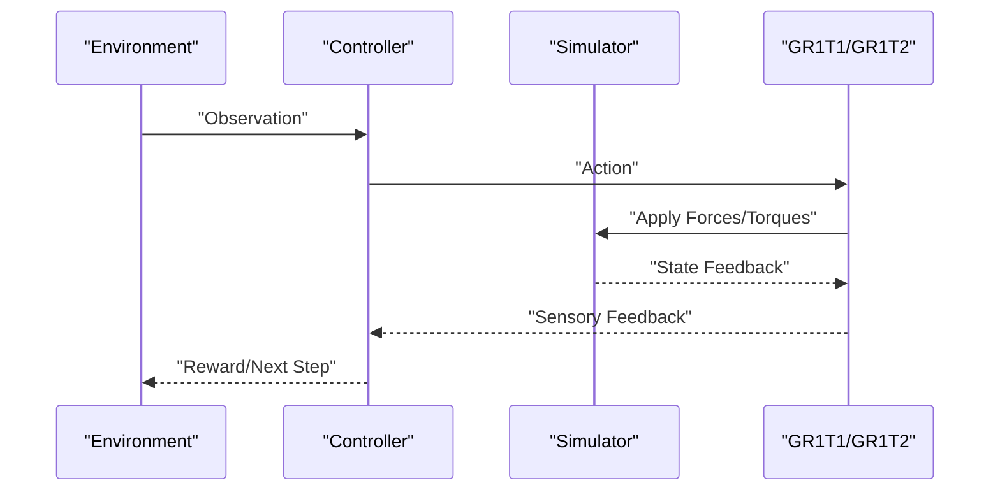
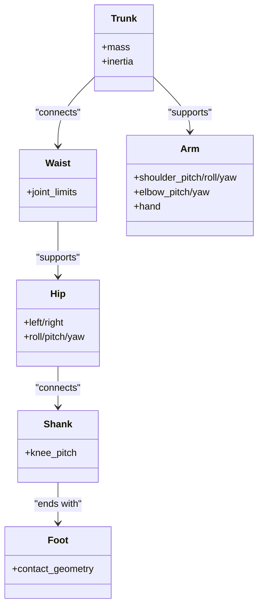
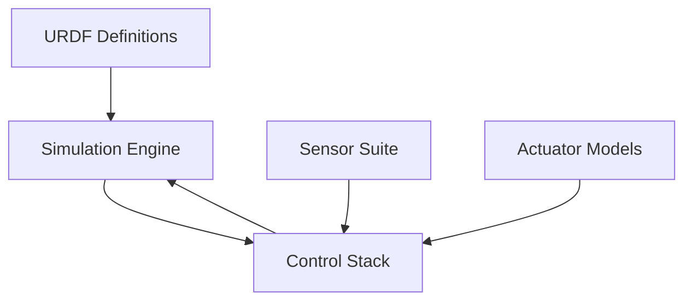

# Humanoid Robots

<cite>
**Referenced Files in This Document**
- [booster_t1.urdf](file://source/robot_lab/data/Robots/booster/t1_description/urdf/robot.urdf)
- [openloong_loong.urdf](file://source/robot_lab/data/Robots/openloong/loong_description/urdf/loong.urdf)
- [roboparty_atom01.urdf](file://source/robot_lab/data/Robots/roboparty/atom01_description/urdf/atom01.urdf)
- [magiclab_magicbot_gen1.urdf](file://source/robot_lab/data/Robots/magiclab/magicbot-Gen1/urdf/magicbot-gen1.urdf)
- [magiclab_magicbot_z1.urdf](file://source/robot_lab/data/Robots/magiclab/magicbot-Z1/urdf/magicbot-z1.urdf)
- [fftai_gr1t1.urdf](file://source/robot_lab/data/Robots/fftaig1t1_description/urdf/gr1t1.urdf)
- [fftai_gr1t2.urdf](file://source/robot_lab/data/Robots/fftaig1t2_description/urdf/gr1t2.urdf)
- [robotera_xbot.urdf](file://source/robot_lab/data/Robots/robotera/xbot_description/urdf/xbot.urdf)
- [unitree_g1.urdf](file://source/robot_lab/data/Robots/unitree/g1_description/urdf/g1.urdf)
</cite>

## Table of Contents
1. [Introduction](#introduction)
2. [Project Structure](#project-structure)
3. [Core Components](#core-components)
4. [Architecture Overview](#architecture-overview)
5. [Detailed Component Analysis](#detailed-component-analysis)
6. [Dependency Analysis](#dependency-analysis)
7. [Performance Considerations](#performance-considerations)
8. [Troubleshooting Guide](#troubleshooting-guide)
9. [Conclusion](#conclusion)
10. [Appendices](#appendices)

## Introduction
This document presents a comprehensive overview of humanoid robots within the repository, focusing on bipedal platforms designed for human-like movement and manipulation. It covers:
- Unitree G1 humanoid configuration with degrees-of-freedom, actuator limits, inertial properties, and control-relevant kinematics
- FFTAI GR1T1/GR1T2 models with their kinematic specifics and specialized applications
- Booster T1 with its distinctive mechanical characteristics
- RobotEra Xbot, Openloong Loong, RoboParty ATOM01, and Magiclab MagicBot series (Gen1/Z1) with their capabilities and control approaches
- Control challenges in balance, bipedal locomotion, and manipulation
- Actuator systems, sensor integration, and simulation parameters aligned with humanoid dynamics
- Opportunities and challenges in reinforcement learning for skill acquisition, balance, and manipulation

## Project Structure
The humanoid-related robot definitions are organized under the Robots directory, with each platform encapsulated in its own subdirectory containing URDF and mesh assets. The following diagram maps the repository’s humanoid categories to their URDF sources.

**Diagram sources**
- [unitree_g1.urdf](file://source/robot_lab/data/Robots/unitree/g1_description/urdf/g1.urdf)
- [fftai_gr1t1.urdf](file://source/robot_lab/data/Robots/fftaig1t1_description/urdf/gr1t1.urdf)
- [fftai_gr1t2.urdf](file://source/robot_lab/data/Robots/fftaig1t2_description/urdf/gr1t2.urdf)
- [booster_t1.urdf](file://source/robot_lab/data/Robots/booster/t1_description/urdf/robot.urdf)
- [robotera_xbot.urdf](file://source/robot_lab/data/Robots/robotera/xbot_description/urdf/xbot.urdf)
- [openloong_loong.urdf](file://source/robot_lab/data/Robots/openloong/loong_description/urdf/loong.urdf)
- [roboparty_atom01.urdf](file://source/robot_lab/data/Robots/roboparty/atom01_description/urdf/atom01.urdf)
- [magiclab_magicbot_gen1.urdf](file://source/robot_lab/data/Robots/magiclab/magicbot-Gen1/urdf/magicbot-gen1.urdf)
- [magiclab_magicbot_z1.urdf](file://source/robot_lab/data/Robots/magiclab/magicbot-Z1/urdf/magicbot-z1.urdf)

**Section sources**
- [booster_t1.urdf](file://source/robot_lab/data/Robots/booster/t1_description/urdf/robot.urdf)
- [openloong_loong.urdf](file://source/robot_lab/data/Robots/openloong/loong_description/urdf/loong.urdf)
- [roboparty_atom01.urdf](file://source/robot_lab/data/Robots/roboparty/atom01_description/urdf/atom01.urdf)
- [magiclab_magicbot_gen1.urdf](file://source/robot_lab/data/Robots/magiclab/magicbot-Gen1/urdf/magicbot-gen1.urdf)
- [magiclab_magicbot_z1.urdf](file://source/robot_lab/data/Robots/magiclab/magicbot-Z1/urdf/magicbot-z1.urdf)
- [fftai_gr1t1.urdf](file://source/robot_lab/data/Robots/fftaig1t1_description/urdf/gr1t1.urdf)
- [fftai_gr1t2.urdf](file://source/robot_lab/data/Robots/fftaig1t2_description/urdf/gr1t2.urdf)
- [robotera_xbot.urdf](file://source/robot_lab/data/Robots/robotera/xbot_description/urdf/xbot.urdf)
- [unitree_g1.urdf](file://source/robot_lab/data/Robots/unitree/g1_description/urdf/g1.urdf)

## Core Components
This section outlines the principal humanoid platforms and their control-relevant attributes derived from the URDFs.

- Unitree G1
  - Degrees-of-freedom: 29
  - Control focus: bipedal locomotion, whole-body balance, manipulation
  - Simulation parameters: mass, inertia, joint limits, and actuator ratings are encoded in the URDF
  - Reference: [unitree_g1.urdf](file://source/robot_lab/data/Robots/unitree/g1_description/urdf/g1.urdf)

- FFTAI GR1T1/GR1T2
  - Kinematic design: specialized configurations for research and demonstration
  - Applications: bipedalism, manipulation, and reinforcement learning benchmarking
  - Reference URDFs:
    - [fftai_gr1t1.urdf](file://source/robot_lab/data/Robots/fftaig1t1_description/urdf/gr1t1.urdf)
    - [fftai_gr1t2.urdf](file://source/robot_lab/data/Robots/fftaig1t2_description/urdf/gr1t2.urdf)

- Booster T1
  - Mechanical characteristics: trunk, waist, hip, knee, ankle, and arm links with inertial properties and joint limits
  - Control relevance: bipedal balance and manipulation tasks
  - Reference: [booster_t1.urdf](file://source/robot_lab/data/Robots/booster/t1_description/urdf/robot.urdf)

- RobotEra Xbot
  - Control approach: bipedal locomotion with articulated limbs
  - Simulation parameters: mass/inertia and joint limits present in URDF
  - Reference: [robotera_xbot.urdf](file://source/robot_lab/data/Robots/robotera/xbot_description/urdf/xbot.urdf)

- Openloong Loong
  - Control focus: bipedal locomotion with articulated arms and waist
  - Simulation parameters: mass/inertia and joint limits present in URDF
  - Reference: [openloong_loong.urdf](file://source/robot_lab/data/Robots/openloong/loong_description/urdf/loong.urdf)

- RoboParty ATOM01
  - Control focus: bipedal locomotion with articulated limbs
  - Simulation parameters: mass/inertia and joint limits present in URDF
  - Reference: [roboparty_atom01.urdf](file://source/robot_lab/data/Robots/roboparty/atom01_description/urdf/atom01.urdf)

- Magiclab MagicBot Gen1/Z1
  - Capabilities: bipedal locomotion and manipulation
  - Simulation parameters: mass/inertia and joint limits present in URDF
  - References:
    - [magiclab_magicbot_gen1.urdf](file://source/robot_lab/data/Robots/magiclab/magicbot-Gen1/urdf/magicbot-gen1.urdf)
    - [magiclab_magicbot_z1.urdf](file://source/robot_lab/data/Robots/magiclab/magicbot-Z1/urdf/magicbot-z1.urdf)

**Section sources**
- [unitree_g1.urdf](file://source/robot_lab/data/Robots/unitree/g1_description/urdf/g1.urdf)
- [fftai_gr1t1.urdf](file://source/robot_lab/data/Robots/fftaig1t1_description/urdf/gr1t1.urdf)
- [fftai_gr1t2.urdf](file://source/robot_lab/data/Robots/fftaig1t2_description/urdf/gr1t2.urdf)
- [booster_t1.urdf](file://source/robot_lab/data/Robots/booster/t1_description/urdf/robot.urdf)
- [robotera_xbot.urdf](file://source/robot_lab/data/Robots/robotera/xbot_description/urdf/xbot.urdf)
- [openloong_loong.urdf](file://source/robot_lab/data/Robots/openloong/loong_description/urdf/loong.urdf)
- [roboparty_atom01.urdf](file://source/robot_lab/data/Robots/roboparty/atom01_description/urdf/atom01.urdf)
- [magiclab_magicbot_gen1.urdf](file://source/robot_lab/data/Robots/magiclab/magicbot-Gen1/urdf/magicbot-gen1.urdf)
- [magiclab_magicbot_z1.urdf](file://source/robot_lab/data/Robots/magiclab/magicbot-Z1/urdf/magicbot-z1.urdf)

## Architecture Overview
The humanoid architectures share common control themes: inverse dynamics, contact modeling, and whole-body stability. The following diagram illustrates the typical control loop for bipedal humanoid robots in simulation environments.

[No sources needed since this diagram shows conceptual workflow, not actual code structure]

## Detailed Component Analysis

### Unitree G1
- Degrees-of-freedom: 29
- Control focus: bipedal locomotion, balance, and manipulation
- Simulation parameters: mass/inertia, joint limits, and actuator ratings encoded in the URDF
- Reference: [unitree_g1.urdf](file://source/robot_lab/data/Robots/unitree/g1_description/urdf/g1.urdf)

**Diagram sources**
- [unitree_g1.urdf](file://source/robot_lab/data/Robots/unitree/g1_description/urdf/g1.urdf)

**Section sources**
- [unitree_g1.urdf](file://source/robot_lab/data/Robots/unitree/g1_description/urdf/g1.urdf)

### FFTAI GR1T1/GR1T2
- Kinematic design: specialized bipedal kinematics for research and RL benchmarking
- Control focus: bipedal locomotion and manipulation
- References:
  - [fftai_gr1t1.urdf](file://source/robot_lab/data/Robots/fftaig1t1_description/urdf/gr1t1.urdf)
  - [fftai_gr1t2.urdf](file://source/robot_lab/data/Robots/fftaig1t2_description/urdf/gr1t2.urdf)

**Diagram sources**
- [fftai_gr1t1.urdf](file://source/robot_lab/data/Robots/fftaig1t1_description/urdf/gr1t1.urdf)
- [fftai_gr1t2.urdf](file://source/robot_lab/data/Robots/fftaig1t2_description/urdf/gr1t2.urdf)

**Section sources**
- [fftai_gr1t1.urdf](file://source/robot_lab/data/Robots/fftaig1t1_description/urdf/gr1t1.urdf)
- [fftai_gr1t2.urdf](file://source/robot_lab/data/Robots/fftaig1t2_description/urdf/gr1t2.urdf)

### Booster T1
- Mechanical characteristics: trunk, waist, hips, knees, ankles, and bilateral arms
- Control relevance: bipedal balance and manipulation tasks
- Reference: [booster_t1.urdf](file://source/robot_lab/data/Robots/booster/t1_description/urdf/robot.urdf)

**Diagram sources**
- [booster_t1.urdf](file://source/robot_lab/data/Robots/booster/t1_description/urdf/robot.urdf)

**Section sources**
- [booster_t1.urdf](file://source/robot_lab/data/Robots/booster/t1_description/urdf/robot.urdf)

### RobotEra Xbot
- Control approach: bipedal locomotion with articulated limbs
- Simulation parameters: mass/inertia and joint limits present in URDF
- Reference: [robotera_xbot.urdf](file://source/robot_lab/data/Robots/robotera/xbot_description/urdf/xbot.urdf)

**Section sources**
- [robotera_xbot.urdf](file://source/robot_lab/data/Robots/robotera/xbot_description/urdf/xbot.urdf)

### Openloong Loong
- Control focus: bipedal locomotion with articulated arms and waist
- Simulation parameters: mass/inertia and joint limits present in URDF
- Reference: [openloong_loong.urdf](file://source/robot_lab/data/Robots/openloong/loong_description/urdf/loong.urdf)

**Section sources**
- [openloong_loong.urdf](file://source/robot_lab/data/Robots/openloong/loong_description/urdf/loong.urdf)

### RoboParty ATOM01
- Control focus: bipedal locomotion with articulated limbs
- Simulation parameters: mass/inertia and joint limits present in URDF
- Reference: [roboparty_atom01.urdf](file://source/robot_lab/data/Robots/roboparty/atom01_description/urdf/atom01.urdf)

**Section sources**
- [roboparty_atom01.urdf](file://source/robot_lab/data/Robots/roboparty/atom01_description/urdf/atom01.urdf)

### Magiclab MagicBot Gen1/Z1
- Capabilities: bipedal locomotion and manipulation
- Simulation parameters: mass/inertia and joint limits present in URDF
- References:
  - [magiclab_magicbot_gen1.urdf](file://source/robot_lab/data/Robots/magiclab/magicbot-Gen1/urdf/magicbot-gen1.urdf)
  - [magiclab_magicbot_z1.urdf](file://source/robot_lab/data/Robots/magiclab/magicbot-Z1/urdf/magicbot-z1.urdf)

**Section sources**
- [magiclab_magicbot_gen1.urdf](file://source/robot_lab/data/Robots/magiclab/magicbot-Gen1/urdf/magicbot-gen1.urdf)
- [magiclab_magicbot_z1.urdf](file://source/robot_lab/data/Robots/magiclab/magicbot-Z1/urdf/magicbot-z1.urdf)

## Dependency Analysis
The humanoid platforms depend on shared simulation frameworks and control libraries. The following diagram highlights dependencies among major components.

[No sources needed since this diagram shows conceptual dependencies, not specific code structure]

## Performance Considerations
- Joint limits and actuator ratings directly impact achievable accelerations and torques
- Center of mass and inertia distributions influence dynamic stability and energy efficiency
- Contact models (ground reaction forces) are critical for realistic bipedal locomotion
- Sensor fusion (IMU, force plates, cameras) improves perception for balance and manipulation
- Reinforcement learning hyperparameters (learning rate, exploration noise, reward shaping) significantly affect convergence and skill acquisition

[No sources needed since this section provides general guidance]

## Troubleshooting Guide
Common issues and resolutions:
- Simulation instability
  - Verify joint limits and actuator ratings in the URDF
  - Adjust controller gains and integrator limits
- Poor balance during locomotion
  - Revisit center of mass estimates and inertia tensors
  - Improve footstep planning and terrain compliance
- Manipulation errors
  - Calibrate sensors and update kinematic chains
  - Tune impedance control parameters for hands and arms
- Reinforcement learning training problems
  - Normalize observations and rewards
  - Increase exploration early, decay gradually
  - Monitor episode lengths and success rates

[No sources needed since this section provides general guidance]

## Conclusion
The repository offers a rich set of humanoid robot models suitable for bipedal locomotion, balance control, and manipulation tasks. By leveraging the URDF-encoded inertial and kinematic properties, teams can build robust controllers and reinforcement learning pipelines tailored to each platform’s unique characteristics.

[No sources needed since this section summarizes without analyzing specific files]

## Appendices
- Actuator and joint rating extraction
  - Use the URDF to extract joint limits and actuator ratings for each platform
  - Align control bandwidths with actuator capabilities
- Sensor integration checklist
  - IMU mounting and calibration
  - Force/torque sensors placement at ankles and wrists
  - Camera configuration for manipulation and navigation
- Simulation parameters alignment
  - Match gravity, damping, and friction coefficients across platforms
  - Validate contact models and ground properties

[No sources needed since this section provides general guidance]