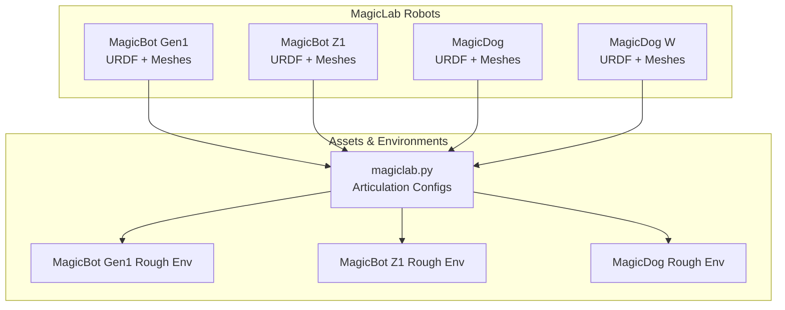
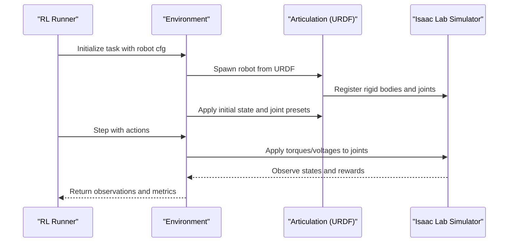
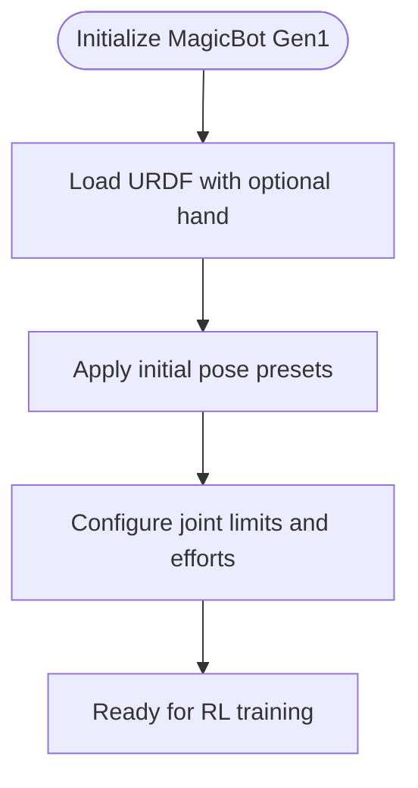
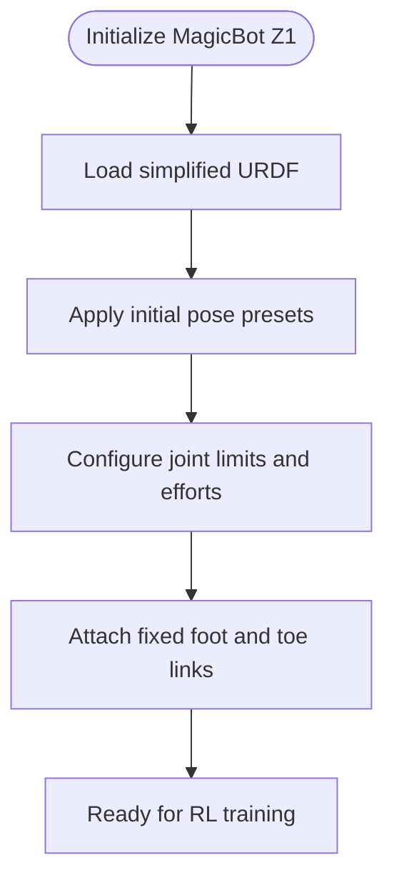
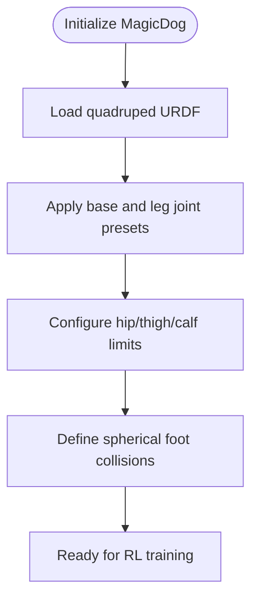
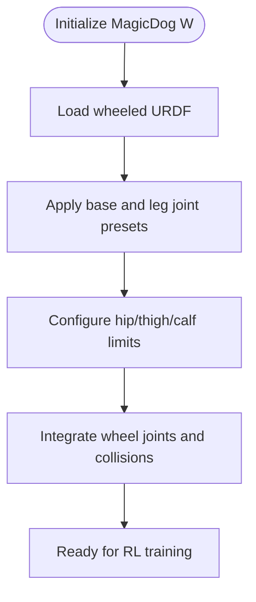
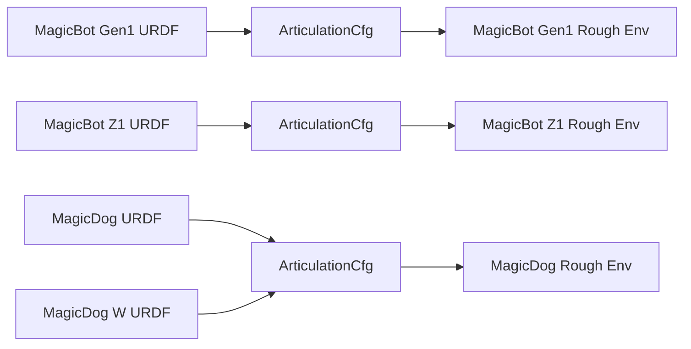

# Multi-Brand MagicLab Humanoid Series

<cite>
**Referenced Files in This Document**
- [README.md](file://README.md)
- [magicbot-Gen1 URDF](file://source/robot_lab/data/Robots/magiclab/magicbot-Gen1/urdf/MAGICBOT.urdf)
- [magicbot-Gen1 with hand URDF](file://source/robot_lab/data/Robots/magiclab/magicbot-Gen1/urdf/MAGICBOT_with_hand.urdf)
- [magicbot-Z1 URDF](file://source/robot_lab/data/Robots/magiclab/magicbot-Z1/urdf/MagicBotZ1.urdf)
- [magicdog URDF](file://source/robot_lab/data/Robots/magiclab/magicdog/urdf/magicdog.urdf)
- [magicdog_w URDF](file://source/robot_lab/data/Robots/magiclab/magicdog_w/urdf/magicdog_w.urdf)
- [magiclab assets](file://source/robot_lab/robot_lab/assets/magiclab.py)
- [magicbot-gen1 rough env](file://source/robot_lab/robot_lab/tasks/manager_based/locomotion/velocity/config/humanoid/magiclab_magicbot_gen1/rough_env_cfg.py)
- [magicbot-z1 rough env](file://source/robot_lab/robot_lab/tasks/manager_based/locomotion/velocity/config/humanoid/magiclab_magicbot_z1/rough_env_cfg.py)
- [magicdog rough env](file://source/robot_lab/robot_lab/tasks/manager_based/locomotion/velocity/config/quadruped/magiclab_magicdog/rough_env_cfg.py)
</cite>

## Table of Contents
1. [Introduction](#introduction)
2. [Project Structure](#project-structure)
3. [Core Components](#core-components)
4. [Architecture Overview](#architecture-overview)
5. [Detailed Component Analysis](#detailed-component-analysis)
6. [Dependency Analysis](#dependency-analysis)
7. [Performance Considerations](#performance-considerations)
8. [Troubleshooting Guide](#troubleshooting-guide)
9. [Conclusion](#conclusion)

## Introduction
This document provides a comprehensive technical analysis of the MagicLab humanoid series within the robot_lab ecosystem. It covers the family relationships and evolutionary design across MagicBot Gen1, MagicBot Z1, MagicDog, and MagicDog W models. The focus is on shared architectural principles, actuator configurations, control parameters, and comparative strengths for research and application scenarios. The MagicLab series integrates seamlessly with Isaac Lab environments for locomotion tasks, with separate humanoid and quadruped configurations.

## Project Structure
The MagicLab humanoid series is organized under the robot_lab package with dedicated URDFs, mesh assets, and environment configurations:
- Humanoid models: MagicBot Gen1 and MagicBot Z1
- Quadruped models: MagicDog and MagicDog W
- Assets and environment configurations are registered and used by the Isaac Lab RL framework

**Diagram sources**
- [magicbot-Gen1 URDF](file://source/robot_lab/data/Robots/magiclab/magicbot-Gen1/urdf/MAGICBOT.urdf#L1-L120)
- [magicbot-Z1 URDF](file://source/robot_lab/data/Robots/magiclab/magicbot-Z1/urdf/MagicBotZ1.urdf#L1-L120)
- [magicdog URDF](file://source/robot_lab/data/Robots/magiclab/magicdog/urdf/magicdog.urdf#L1-L120)
- [magicdog_w URDF](file://source/robot_lab/data/Robots/magiclab/magicdog_w/urdf/magicdog_w.urdf#L1-L120)
- [magiclab assets](file://source/robot_lab/robot_lab/assets/magiclab.py#L16-L51)
- [magicbot-gen1 rough env](file://source/robot_lab/robot_lab/tasks/manager_based/locomotion/velocity/config/humanoid/magiclab_magicbot_gen1/rough_env_cfg.py#L15-L45)
- [magicbot-z1 rough env](file://source/robot_lab/robot_lab/tasks/manager_based/locomotion/velocity/config/humanoid/magiclab_magicbot_z1/rough_env_cfg.py#L15-L45)
- [magicdog rough env](file://source/robot_lab/robot_lab/tasks/manager_based/locomotion/velocity/config/quadruped/magiclab_magicdog/rough_env_cfg.py#L14-L34)

**Section sources**
- [README.md](file://README.md#L11-L50)
- [magicbot-Gen1 URDF](file://source/robot_lab/data/Robots/magiclab/magicbot-Gen1/urdf/MAGICBOT.urdf#L1-L120)
- [magicbot-Z1 URDF](file://source/robot_lab/data/Robots/magiclab/magicbot-Z1/urdf/MagicBotZ1.urdf#L1-L120)
- [magicdog URDF](file://source/robot_lab/data/Robots/magiclab/magicdog/urdf/magicdog.urdf#L1-L120)
- [magicdog_w URDF](file://source/robot_lab/data/Robots/magiclab/magicdog_w/urdf/magicdog_w.urdf#L1-L120)
- [magiclab assets](file://source/robot_lab/robot_lab/assets/magiclab.py#L16-L51)

## Core Components
- MagicBot Gen1: Full humanoid with bilateral legs and optional hand attachments; articulated via revolute joints with torque/velocity limits.
- MagicBot Z1: Simplified humanoid leg chain with fixed foot geometry and toe links; designed for efficient locomotion studies.
- MagicDog: Quadruped with spherical feet; hip/thigh/calf joints per leg for dynamic gaits.
- MagicDog W: Wheeled quadruped variant with wheel actuators integrated into the knee region; enables hybrid locomotion modes.

Key shared architectural elements:
- Articulation spawning via URDF files with contact sensors enabled
- Initial pose presets for stable starts
- Joint naming conventions aligned with environment configurations

**Section sources**
- [magicbot-Gen1 URDF](file://source/robot_lab/data/Robots/magiclab/magicbot-Gen1/urdf/MAGICBOT.urdf#L1-L120)
- [magicbot-Z1 URDF](file://source/robot_lab/data/Robots/magiclab/magicbot-Z1/urdf/MagicBotZ1.urdf#L1-L120)
- [magicdog URDF](file://source/robot_lab/data/Robots/magiclab/magicdog/urdf/magicdog.urdf#L1-L120)
- [magicdog_w URDF](file://source/robot_lab/data/Robots/magiclab/magicdog_w/urdf/magicdog_w.urdf#L1-L120)
- [magiclab assets](file://source/robot_lab/robot_lab/assets/magiclab.py#L16-L51)

## Architecture Overview
The MagicLab series leverages Isaac Lab’s ArticulationCfg to define robot spawning, initial states, and joint drive properties. Environments configure base and foot link names, joint lists, and sensor prim paths for locomotion tasks.

**Diagram sources**
- [magiclab assets](file://source/robot_lab/robot_lab/assets/magiclab.py#L16-L51)
- [magicbot-gen1 rough env](file://source/robot_lab/robot_lab/tasks/manager_based/locomotion/velocity/config/humanoid/magiclab_magicbot_gen1/rough_env_cfg.py#L15-L45)
- [magicbot-z1 rough env](file://source/robot_lab/robot_lab/tasks/manager_based/locomotion/velocity/config/humanoid/magiclab_magicbot_z1/rough_env_cfg.py#L15-L45)
- [magicdog rough env](file://source/robot_lab/robot_lab/tasks/manager_based/locomotion/velocity/config/quadruped/magiclab_magicdog/rough_env_cfg.py#L14-L34)

## Detailed Component Analysis

### MagicBot Gen1
- Design: Full humanoid with bilateral legs and optional hand attachments; includes wrist/yaw joints for hand configurations.
- Actuation: Revolute joints per leg segment with torque/velocity limits; hand joints configurable.
- Control parameters: Joint limits and effort/velocity caps defined in URDF; initial pose presets stabilize startup.
- Applications: Humanoid locomotion, manipulation studies with optional hand attachment.

**Diagram sources**
- [magicbot-Gen1 URDF](file://source/robot_lab/data/Robots/magiclab/magicbot-Gen1/urdf/MAGICBOT.urdf#L1-L120)
- [magicbot-Gen1 with hand URDF](file://source/robot_lab/data/Robots/magiclab/magicbot-Gen1/urdf/MAGICBOT_with_hand.urdf#L1-L120)
- [magiclab assets](file://source/robot_lab/robot_lab/assets/magiclab.py#L16-L51)

**Section sources**
- [magicbot-Gen1 URDF](file://source/robot_lab/data/Robots/magiclab/magicbot-Gen1/urdf/MAGICBOT.urdf#L1-L120)
- [magicbot-Gen1 with hand URDF](file://source/robot_lab/data/Robots/magiclab/magicbot-Gen1/urdf/MAGICBOT_with_hand.urdf#L1-L120)
- [magicbot-gen1 rough env](file://source/robot_lab/robot_lab/tasks/manager_based/locomotion/velocity/config/humanoid/magiclab_magicbot_gen1/rough_env_cfg.py#L15-L45)

### MagicBot Z1
- Design: Simplified humanoid leg chain with fixed foot geometry and toe links; optimized for locomotion efficiency.
- Actuation: Revolute joints for hip/pitch/roll and knee/ankle segments; foot and toe links fixed for terrain interaction.
- Control parameters: Joint limits and velocities tuned for stable bipedal gaits.
- Applications: Efficient bipedal locomotion research, reduced DOF studies.

**Diagram sources**
- [magicbot-Z1 URDF](file://source/robot_lab/data/Robots/magiclab/magicbot-Z1/urdf/MagicBotZ1.urdf#L1-L120)
- [magiclab assets](file://source/robot_lab/robot_lab/assets/magiclab.py#L16-L51)

**Section sources**
- [magicbot-Z1 URDF](file://source/robot_lab/data/Robots/magiclab/magicbot-Z1/urdf/MagicBotZ1.urdf#L1-L120)
- [magicbot-z1 rough env](file://source/robot_lab/robot_lab/tasks/manager_based/locomotion/velocity/config/humanoid/magiclab_magicbot_z1/rough_env_cfg.py#L15-L45)

### MagicDog
- Design: Quadruped with spherical feet; hip/thigh/calf joints per leg; collision geometry optimized for terrain.
- Actuation: Revolute joints per leg segment with effort/velocity limits; foot links as collision primitives.
- Control parameters: Joint dynamics and limits defined in URDF; head link for collision avoidance.
- Applications: Dynamic quadruped gaits, terrain adaptation, multi-legged locomotion studies.

**Diagram sources**
- [magicdog URDF](file://source/robot_lab/data/Robots/magiclab/magicdog/urdf/magicdog.urdf#L1-L120)
- [magiclab assets](file://source/robot_lab/robot_lab/assets/magiclab.py#L16-L51)

**Section sources**
- [magicdog URDF](file://source/robot_lab/data/Robots/magiclab/magicdog/urdf/magicdog.urdf#L1-L120)
- [magicdog rough env](file://source/robot_lab/robot_lab/tasks/manager_based/locomotion/velocity/config/quadruped/magiclab_magicdog/rough_env_cfg.py#L14-L34)

### MagicDog W
- Design: Wheeled quadruped variant integrating wheels into knee regions; wheel joints enable rolling locomotion.
- Actuation: Hip/thigh/calf joints plus wheel actuators; wheel collision geometry modeled as cylinders.
- Control parameters: Wheel joint limits and dynamics differ from leg joints; mass/inertia adjusted for wheel weight.
- Applications: Hybrid locomotion (legged + wheeled), fast mobility on smooth surfaces, energy-efficient transport.

**Diagram sources**
- [magicdog_w URDF](file://source/robot_lab/data/Robots/magiclab/magicdog_w/urdf/magicdog_w.urdf#L1-L120)
- [magiclab assets](file://source/robot_lab/robot_lab/assets/magiclab.py#L16-L51)

**Section sources**
- [magicdog_w URDF](file://source/robot_lab/data/Robots/magiclab/magicdog_w/urdf/magicdog_w.urdf#L1-L120)
- [magicdog rough env](file://source/robot_lab/robot_lab/tasks/manager_based/locomotion/velocity/config/quadruped/magiclab_magicdog/rough_env_cfg.py#L14-L34)

## Dependency Analysis
The environment configurations depend on the shared ArticulationCfg definitions and URDF assets. Each environment sets base/foot link names and joint lists aligned with the robot’s URDF structure.

**Diagram sources**
- [magicbot-Gen1 URDF](file://source/robot_lab/data/Robots/magiclab/magicbot-Gen1/urdf/MAGICBOT.urdf#L1-L120)
- [magicbot-Z1 URDF](file://source/robot_lab/data/Robots/magiclab/magicbot-Z1/urdf/MagicBotZ1.urdf#L1-L120)
- [magicdog URDF](file://source/robot_lab/data/Robots/magiclab/magicdog/urdf/magicdog.urdf#L1-L120)
- [magicdog_w URDF](file://source/robot_lab/data/Robots/magiclab/magicdog_w/urdf/magicdog_w.urdf#L1-L120)
- [magiclab assets](file://source/robot_lab/robot_lab/assets/magiclab.py#L16-L51)
- [magicbot-gen1 rough env](file://source/robot_lab/robot_lab/tasks/manager_based/locomotion/velocity/config/humanoid/magiclab_magicbot_gen1/rough_env_cfg.py#L15-L45)
- [magicbot-z1 rough env](file://source/robot_lab/robot_lab/tasks/manager_based/locomotion/velocity/config/humanoid/magiclab_magicbot_z1/rough_env_cfg.py#L15-L45)
- [magicdog rough env](file://source/robot_lab/robot_lab/tasks/manager_based/locomotion/velocity/config/quadruped/magiclab_magicdog/rough_env_cfg.py#L14-L34)

**Section sources**
- [magicbot-gen1 rough env](file://source/robot_lab/robot_lab/tasks/manager_based/locomotion/velocity/config/humanoid/magiclab_magicbot_gen1/rough_env_cfg.py#L15-L45)
- [magicbot-z1 rough env](file://source/robot_lab/robot_lab/tasks/manager_based/locomotion/velocity/config/humanoid/magiclab_magicbot_z1/rough_env_cfg.py#L15-L45)
- [magicdog rough env](file://source/robot_lab/robot_lab/tasks/manager_based/locomotion/velocity/config/quadruped/magiclab_magicdog/rough_env_cfg.py#L14-L34)

## Performance Considerations
- Joint limits and effort/velocity caps directly impact stability and control bandwidth; tune for desired gait speed and terrain.
- Contact sensors improve terrain interaction feedback; ensure proper placement for accurate ground contact detection.
- Mass/inertia distributions vary across models; expect differences in acceleration, momentum, and energy consumption.
- Wheel integration in MagicDog W reduces leg actuator work on smooth surfaces but may limit agility on uneven terrain.

## Troubleshooting Guide
- Simulation instability at startup: verify initial pose presets and ensure joint limits are within safe ranges.
- Poor terrain interaction: confirm contact sensor activation and adjust foot link names in environment configs.
- Environment registration errors: ensure URDF paths are correct and ArticulationCfg is properly instantiated.

**Section sources**
- [magiclab assets](file://source/robot_lab/robot_lab/assets/magiclab.py#L16-L51)
- [magicbot-gen1 rough env](file://source/robot_lab/robot_lab/tasks/manager_based/locomotion/velocity/config/humanoid/magiclab_magicbot_gen1/rough_env_cfg.py#L15-L45)
- [magicbot-z1 rough env](file://source/robot_lab/robot_lab/tasks/manager_based/locomotion/velocity/config/humanoid/magiclab_magicbot_z1/rough_env_cfg.py#L15-L45)
- [magicdog rough env](file://source/robot_lab/robot_lab/tasks/manager_based/locomotion/velocity/config/quadruped/magiclab_magicdog/rough_env_cfg.py#L14-L34)

## Conclusion
The MagicLab humanoid series demonstrates a coherent design philosophy: shared URDF-based asset pipelines, standardized environment configurations, and modular control parameters. MagicBot Gen1 emphasizes full-body capability with optional hands; MagicBot Z1 focuses on efficient bipedal locomotion; MagicDog explores dynamic quadruped gaits; MagicDog W extends locomotion with wheels. Together, they provide a versatile toolkit for humanoid and quadruped research within the Isaac Lab ecosystem.