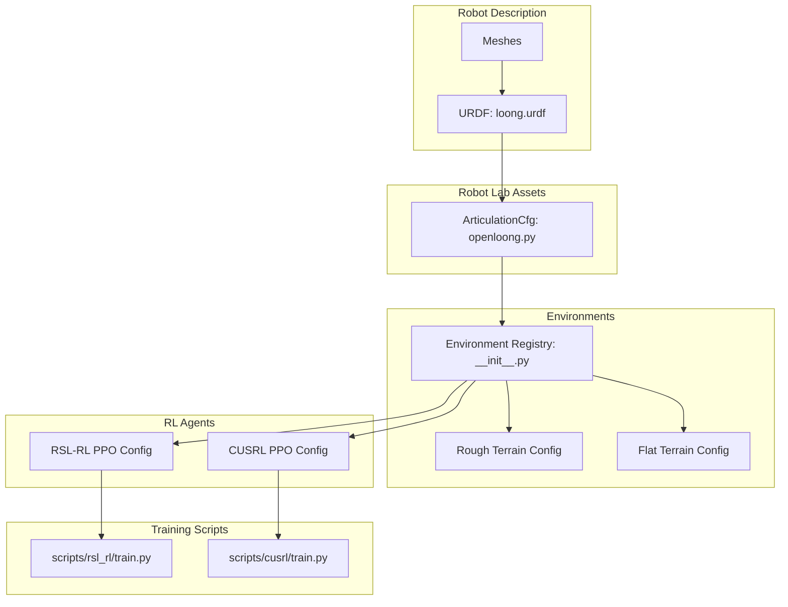
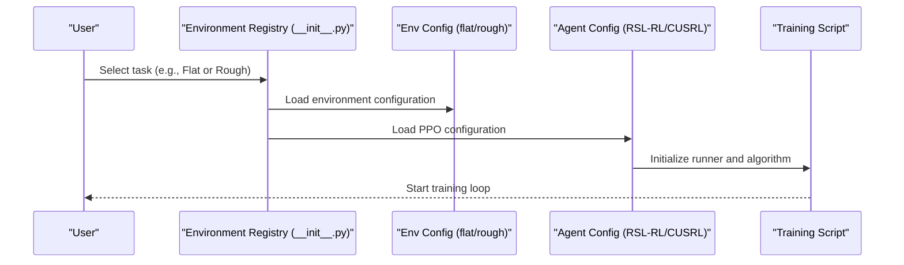
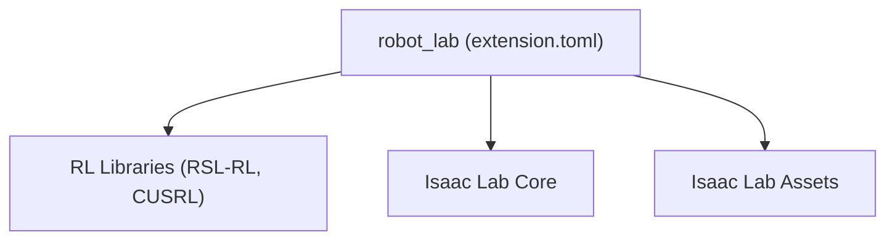

# Openloong Loong Humanoid

<cite>
**Referenced Files in This Document**
- [README.md](file://README.md)
- [extension.toml](file://source/robot_lab/config/extension.toml)
- [openloong.py](file://source/robot_lab/robot_lab/assets/openloong.py)
- [loong.urdf](file://source/robot_lab/data/Robots/openloong/loong_description/urdf/loong.urdf)
- [__init__.py](file://source/robot_lab/robot_lab/tasks/manager_based/locomotion/velocity/config/humanoid/openloong_loong/__init__.py)
- [rough_env_cfg.py](file://source/robot_lab/robot_lab/tasks/manager_based/locomotion/velocity/config/humanoid/openloong_loong/rough_env_cfg.py)
- [flat_env_cfg.py](file://source/robot_lab/robot_lab/tasks/manager_based/locomotion/velocity/config/humanoid/openloong_loong/flat_env_cfg.py)
- [rsl_rl_ppo_cfg.py](file://source/robot_lab/robot_lab/tasks/manager_based/locomotion/velocity/config/humanoid/openloong_loong/agents/rsl_rl_ppo_cfg.py)
- [cusrl_ppo_cfg.py](file://source/robot_lab/robot_lab/tasks/manager_based/locomotion/velocity/config/humanoid/openloong_loong/agents/cusrl_ppo_cfg.py)
- [train.py (RSL-RL)](file://scripts/reinforcement_learning/rsl_rl/train.py)
- [train.py (CUSRL)](file://scripts/reinforcement_learning/cusrl/train.py)
</cite>

## Table of Contents
1. [Introduction](#introduction)
2. [Project Structure](#project-structure)
3. [Core Components](#core-components)
4. [Architecture Overview](#architecture-overview)
5. [Detailed Component Analysis](#detailed-component-analysis)
6. [Dependency Analysis](#dependency-analysis)
7. [Performance Considerations](#performance-considerations)
8. [Troubleshooting Guide](#troubleshooting-guide)
9. [Conclusion](#conclusion)

## Introduction
This document describes the Openloong Loong humanoid robot configuration within the Robot Lab ecosystem. It explains the robot’s technical specifications derived from the URDF, actuator and control parameters defined in the Robot Lab articulation configuration, and the reinforcement learning (RL) setup tailored for locomotion tasks. It also highlights the design philosophy behind the configuration, the intended applications, and the unique control challenges and optimization strategies for the Loong platform in RL.

## Project Structure
The Openloong Loong humanoid is integrated into Robot Lab as:
- A URDF-based robot description with inertial and collision properties
- An articulation configuration that defines initial conditions, actuator PD gains, and solver settings
- RL environment registration and agent configurations for both flat and rough terrains
- Scripts to train and evaluate policies using RSL-RL and CUSRL

**Diagram sources**
- [loong.urdf](file://source/robot_lab/data/Robots/openloong/loong_description/urdf/loong.urdf#L1-L967)
- [openloong.py](file://source/robot_lab/robot_lab/assets/openloong.py#L17-L82)
- [__init__.py](file://source/robot_lab/robot_lab/tasks/manager_based/locomotion/velocity/config/humanoid/openloong_loong/__init__.py#L12-L32)
- [rsl_rl_ppo_cfg.py](file://source/robot_lab/robot_lab/tasks/manager_based/locomotion/velocity/config/humanoid/openloong_loong/agents/rsl_rl_ppo_cfg.py#L9-L45)
- [cusrl_ppo_cfg.py](file://source/robot_lab/robot_lab/tasks/manager_based/locomotion/velocity/config/humanoid/openloong_loong/agents/cusrl_ppo_cfg.py#L10-L48)
- [train.py (RSL-RL)](file://scripts/reinforcement_learning/rsl_rl/train.py)
- [train.py (CUSRL)](file://scripts/reinforcement_learning/cusrl/train.py)

**Section sources**
- [README.md](file://README.md#L1-L501)
- [extension.toml](file://source/robot_lab/config/extension.toml#L1-L36)

## Core Components
- Robot description: URDF with links, inertias, visual meshes, and joint limits
- Articulation configuration: Initial pose, actuator PD gains, solver settings, and contact sensors
- RL environments: Flat and rough terrains with reward shaping and curriculum
- Agent configurations: PPO hyperparameters for RSL-RL and CUSRL

Key implementation references:
- Robot URDF and joint limits: [loong.urdf](file://source/robot_lab/data/Robots/openloong/loong_description/urdf/loong.urdf#L1-L967)
- Articulation configuration and actuator gains: [openloong.py](file://source/robot_lab/robot_lab/assets/openloong.py#L17-L82)
- Environment registration and terrain overrides: [__init__.py](file://source/robot_lab/robot_lab/tasks/manager_based/locomotion/velocity/config/humanoid/openloong_loong/__init__.py#L12-L32), [flat_env_cfg.py](file://source/robot_lab/robot_lab/tasks/manager_based/locomotion/velocity/config/humanoid/openloong_loong/flat_env_cfg.py#L9-L29)
- Agent PPO configurations: [rsl_rl_ppo_cfg.py](file://source/robot_lab/robot_lab/tasks/manager_based/locomotion/velocity/config/humanoid/openloong_loong/agents/rsl_rl_ppo_cfg.py#L9-L45), [cusrl_ppo_cfg.py](file://source/robot_lab/robot_lab/tasks/manager_based/locomotion/velocity/config/humanoid/openloong_loong/agents/cusrl_ppo_cfg.py#L10-L48)

**Section sources**
- [loong.urdf](file://source/robot_lab/data/Robots/openloong/loong_description/urdf/loong.urdf#L1-L967)
- [openloong.py](file://source/robot_lab/robot_lab/assets/openloong.py#L17-L82)
- [__init__.py](file://source/robot_lab/robot_lab/tasks/manager_based/locomotion/velocity/config/humanoid/openloong_loong/__init__.py#L12-L32)
- [flat_env_cfg.py](file://source/robot_lab/robot_lab/tasks/manager_based/locomotion/velocity/config/humanoid/openloong_loong/flat_env_cfg.py#L9-L29)
- [rsl_rl_ppo_cfg.py](file://source/robot_lab/robot_lab/tasks/manager_based/locomotion/velocity/config/humanoid/openloong_loong/agents/rsl_rl_ppo_cfg.py#L9-L45)
- [cusrl_ppo_cfg.py](file://source/robot_lab/robot_lab/tasks/manager_based/locomotion/velocity/config/humanoid/openloong_loong/agents/cusrl_ppo_cfg.py#L10-L48)

## Architecture Overview
The Loong humanoid integrates with Robot Lab as follows:
- The URDF defines geometry and inertia for all links
- The articulation configuration loads the URDF, sets solver parameters, and applies actuator PD gains per joint group
- Environments register two variants: flat and rough terrains, with shared reward and curriculum logic
- RL agents are configured with PPO networks and hyperparameters

**Diagram sources**
- [__init__.py](file://source/robot_lab/robot_lab/tasks/manager_based/locomotion/velocity/config/humanoid/openloong_loong/__init__.py#L12-L32)
- [flat_env_cfg.py](file://source/robot_lab/robot_lab/tasks/manager_based/locomotion/velocity/config/humanoid/openloong_loong/flat_env_cfg.py#L9-L29)
- [rsl_rl_ppo_cfg.py](file://source/robot_lab/robot_lab/tasks/manager_based/locomotion/velocity/config/humanoid/openloong_loong/agents/rsl_rl_ppo_cfg.py#L9-L45)
- [cusrl_ppo_cfg.py](file://source/robot_lab/robot_lab/tasks/manager_based/locomotion/velocity/config/humanoid/openloong_loong/agents/cusrl_ppo_cfg.py#L10-L48)
- [train.py (RSL-RL)](file://scripts/reinforcement_learning/rsl_rl/train.py)
- [train.py (CUSRL)](file://scripts/reinforcement_learning/cusrl/train.py)

## Detailed Component Analysis

### Robot Description (URDF)
- Base link and appendages: Head yaw/pitch, arms (left/right), waist (pitch/roll/yaw), hips (left/right roll/yaw/pitch), knees (left/right), ankles (left/right pitch/roll)
- Joint types: Fixed joints for some segments; revolute joints for articulated legs and arms
- Inertial properties: Mass and inertia tensors are defined for each link
- Collision geometry: Some links include collision shapes (e.g., cylindrical feet for ankles); others rely on visual meshes

Key URDF characteristics:
- Joint limits and effort/velocity caps are defined for each revolute joint
- Visual meshes are referenced via package paths for rendering

References:
- Links and joints: [loong.urdf](file://source/robot_lab/data/Robots/openloong/loong_description/urdf/loong.urdf#L7-L967)
- Joint limits and effort/velocity caps: [loong.urdf](file://source/robot_lab/data/Robots/openloong/loong_description/urdf/loong.urdf#L51-L967)

**Section sources**
- [loong.urdf](file://source/robot_lab/data/Robots/openloong/loong_description/urdf/loong.urdf#L7-L967)

### Articulation Configuration (Robot Lab)
- Loads the URDF with contact sensors enabled and solver iteration counts tuned
- Sets initial pose for legs and default posture for arms
- Applies implicit actuator PD gains grouped by joint families (hips, knees, ankles) with different stiffness/damping per group
- Uses soft joint position limit factor to avoid hard limits during training

References:
- Articulation configuration and actuator gains: [openloong.py](file://source/robot_lab/robot_lab/assets/openloong.py#L17-L82)

**Section sources**
- [openloong.py](file://source/robot_lab/robot_lab/assets/openloong.py#L17-L82)

### Environments (Flat vs Rough)
- Registration: Two Gym environments are registered for the Loong humanoid (flat and rough terrains)
- Flat environment: Terrain is a plane, height scanner and curriculum are disabled, zero-weight rewards removed
- Rough environment: Inherits base velocity locomotion configuration; terrain and curriculum remain enabled

References:
- Environment registration: [__init__.py](file://source/robot_lab/robot_lab/tasks/manager_based/locomotion/velocity/config/humanoid/openloong_loong/__init__.py#L12-L32)
- Flat environment overrides: [flat_env_cfg.py](file://source/robot_lab/robot_lab/tasks/manager_based/locomotion/velocity/config/humanoid/openloong_loong/flat_env_cfg.py#L9-L29)

**Section sources**
- [__init__.py](file://source/robot_lab/robot_lab/tasks/manager_based/locomotion/velocity/config/humanoid/openloong_loong/__init__.py#L12-L32)
- [flat_env_cfg.py](file://source/robot_lab/robot_lab/tasks/manager_based/locomotion/velocity/config/humanoid/openloong_loong/flat_env_cfg.py#L9-L29)

### RL Agent Configurations (PPO)
- RSL-RL: Defines actor/critic network sizes, activation, normalization flags, PPO algorithm settings (entropy, clipping, KL), and optimizer
- CUSRL: Defines actor/critic MLP backbones, distribution, optimizer, sampler, and on-policy training hooks (including adaptive LR schedule)

References:
- RSL-RL PPO config: [rsl_rl_ppo_cfg.py](file://source/robot_lab/robot_lab/tasks/manager_based/locomotion/velocity/config/humanoid/openloong_loong/agents/rsl_rl_ppo_cfg.py#L9-L45)
- CUSRL PPO config: [cusrl_ppo_cfg.py](file://source/robot_lab/robot_lab/tasks/manager_based/locomotion/velocity/config/humanoid/openloong_loong/agents/cusrl_ppo_cfg.py#L10-L48)

**Section sources**
- [rsl_rl_ppo_cfg.py](file://source/robot_lab/robot_lab/tasks/manager_based/locomotion/velocity/config/humanoid/openloong_loong/agents/rsl_rl_ppo_cfg.py#L9-L45)
- [cusrl_ppo_cfg.py](file://source/robot_lab/robot_lab/tasks/manager_based/locomotion/velocity/config/humanoid/openloong_loong/agents/cusrl_ppo_cfg.py#L10-L48)

### Control Parameters and Actuator Ratings
- Stiffness and damping are grouped by joint families:
  - Hips (roll/yaw/pitch): higher stiffness and moderate damping
  - Knees (pitch): high stiffness
  - Ankles (pitch/roll): lower stiffness and minimal damping
- Joint limits and velocity/effort caps are defined in the URDF for safe simulation

References:
- Actuator gains: [openloong.py](file://source/robot_lab/robot_lab/assets/openloong.py#L61-L81)
- Joint limits and caps: [loong.urdf](file://source/robot_lab/data/Robots/openloong/loong_description/urdf/loong.urdf#L51-L967)

**Section sources**
- [openloong.py](file://source/robot_lab/robot_lab/assets/openloong.py#L61-L81)
- [loong.urdf](file://source/robot_lab/data/Robots/openloong/loong_description/urdf/loong.urdf#L51-L967)

### Design Philosophy and Applications
- The Loong configuration emphasizes stable bipedal locomotion with compliant legs (lower ankle stiffness) and strong hip/knee stiffness for stability
- The environment setup supports both flat-plane learning (baseline) and rough-terrain learning (challenge), enabling transferable skills
- The modular design allows easy adaptation for other RL frameworks (RSL-RL and CUSRL) and future extensions

[No sources needed since this section synthesizes design intent from referenced files]

### Unique Control Challenges and Optimization Strategies for RL
- Challenge: High degrees-of-freedom and underactuated dynamics require careful PD tuning to prevent simulation divergence
- Strategy: Grouped PD gains reduce tuning complexity; soft joint limits mitigate constraint violations during exploration
- Strategy: Flat-to-rough curriculum and reward shaping improve robustness and convergence speed
- Strategy: On-policy sampling and adaptive learning rate schedules stabilize training

[No sources needed since this section provides synthesis of optimization strategies]

## Dependency Analysis
The Loong humanoid depends on Robot Lab core packages and RL libraries. The extension metadata declares dependencies and module registration.

**Diagram sources**
- [extension.toml](file://source/robot_lab/config/extension.toml#L17-L23)

**Section sources**
- [extension.toml](file://source/robot_lab/config/extension.toml#L17-L23)

## Performance Considerations
- Solver iterations: The articulation configuration sets solver iteration counts to balance accuracy and speed
- Contact sensors: Enabled to support reward computation and safety checks
- Soft joint limits: Reduce constraint violations and improve training stability
- Actuator gains: Grouped PD gains simplify tuning and improve robustness

[No sources needed since this section provides general guidance]

## Troubleshooting Guide
- Environment registration: Confirm environment names match the Gym registry entries
- Training scripts: Use the documented CLI arguments for task selection and headless mode
- Logs and checkpoints: Training outputs are stored under logs; verify paths and permissions
- Mesh and URDF paths: Ensure asset paths resolve correctly within the installed extension

[No sources needed since this section provides general guidance]

## Conclusion
The Openloong Loong humanoid configuration in Robot Lab provides a robust, modular foundation for bipedal locomotion research. Its URDF captures realistic inertial and geometric properties, while the articulation configuration and RL setups enable efficient training across flat and rough terrains. The grouped actuator PD gains and environment design support stable, scalable reinforcement learning workflows tailored for the Loong platform.