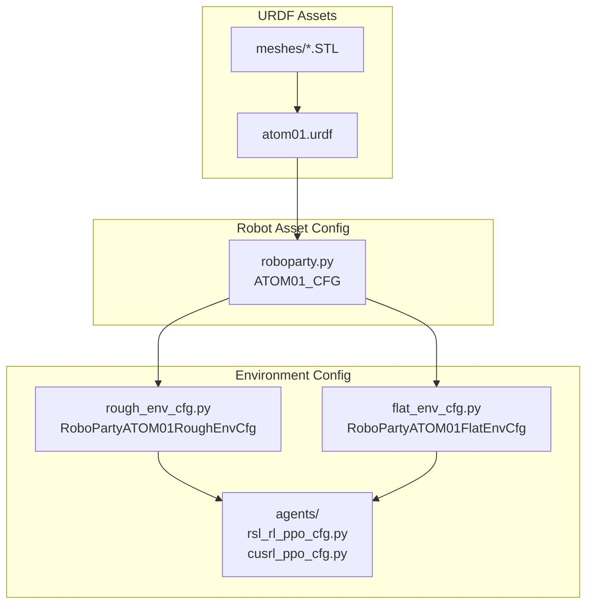
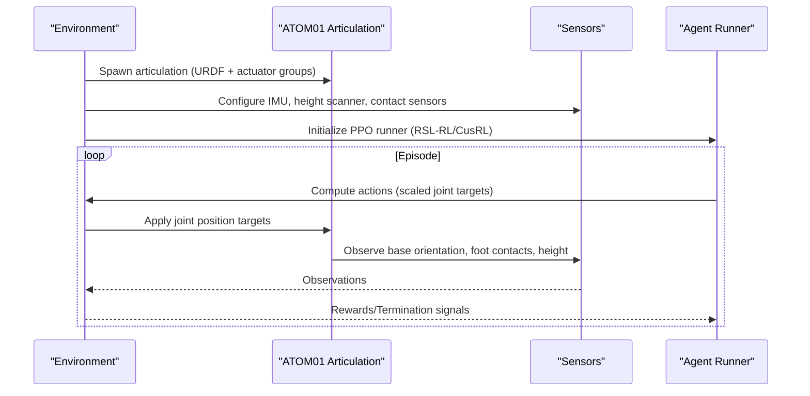
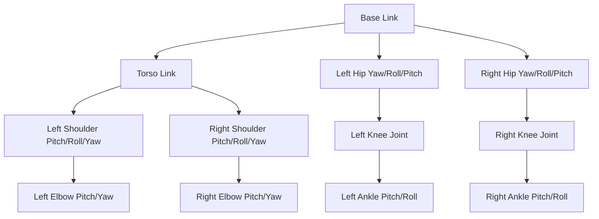
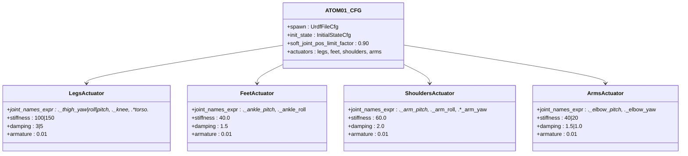
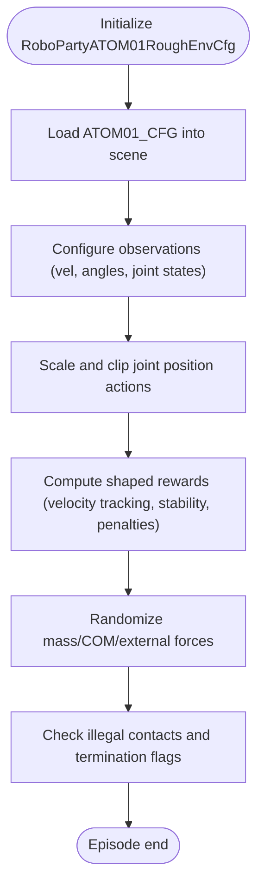
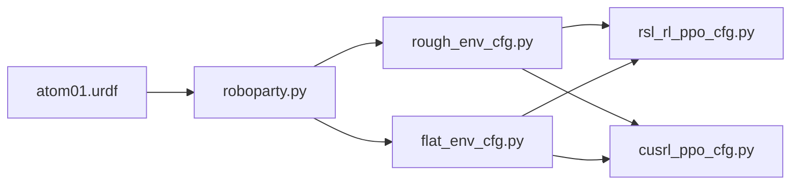

# RoboParty ATOM01 Humanoid

<cite>
**Referenced Files in This Document**
- [README.md](file://README.md)
- [roboparty.py](file://source/robot_lab/robot_lab/assets/roboparty.py)
- [atom01.urdf](file://source/robot_lab/data/Robots/roboparty/atom01_description/urdf/atom01.urdf)
- [flat_env_cfg.py](file://source/robot_lab/robot_lab/tasks/manager_based/locomotion/velocity/config/humanoid/roboparty_atom01/flat_env_cfg.py)
- [rough_env_cfg.py](file://source/robot_lab/robot_lab/tasks/manager_based/locomotion/velocity/config/humanoid/roboparty_atom01/rough_env_cfg.py)
- [rsl_rl_ppo_cfg.py](file://source/robot_lab/robot_lab/tasks/manager_based/locomotion/velocity/config/humanoid/roboparty_atom01/agents/rsl_rl_ppo_cfg.py)
- [cusrl_ppo_cfg.py](file://source/robot_lab/robot_lab/tasks/manager_based/locomotion/velocity/config/humanoid/roboparty_atom01/agents/cusrl_ppo_cfg.py)
</cite>

## Table of Contents
1. [Introduction](#introduction)
2. [Project Structure](#project-structure)
3. [Core Components](#core-components)
4. [Architecture Overview](#architecture-overview)
5. [Detailed Component Analysis](#detailed-component-analysis)
6. [Dependency Analysis](#dependency-analysis)
7. [Performance Considerations](#performance-considerations)
8. [Troubleshooting Guide](#troubleshooting-guide)
9. [Conclusion](#conclusion)

## Introduction
This document describes the RoboParty ATOM01 humanoid platform configuration within the Robot Lab framework. It explains the platform’s design approach, actuator layout, control parameters, and integration into locomotion environments for reinforcement learning and robotics research. The ATOM01 is a bipedal humanoid with articulated legs, feet, torso, and dual arms, designed for both flat and rough terrain locomotion tasks. The configuration leverages Isaac Lab and Robot Lab to provide a reproducible RL environment with tuned reward shaping, action scaling, and actuator models.

## Project Structure
The ATOM01 configuration is organized across three primary areas:
- URDF model definition and mesh assets
- Articulation and actuator configuration for simulation
- Environment configuration for locomotion tasks (flat and rough terrains)

**Diagram sources**
- [atom01.urdf](file://source/robot_lab/data/Robots/roboparty/atom01_description/urdf/atom01.urdf#L1-L1372)
- [roboparty.py](file://source/robot_lab/robot_lab/assets/roboparty.py#L16-L116)
- [rough_env_cfg.py](file://source/robot_lab/robot_lab/tasks/manager_based/locomotion/velocity/config/humanoid/roboparty_atom01/rough_env_cfg.py#L15-L143)
- [flat_env_cfg.py](file://source/robot_lab/robot_lab/tasks/manager_based/locomotion/velocity/config/humanoid/roboparty_atom01/flat_env_cfg.py#L9-L33)
- [rsl_rl_ppo_cfg.py](file://source/robot_lab/robot_lab/tasks/manager_based/locomotion/velocity/config/humanoid/roboparty_atom01/agents/rsl_rl_ppo_cfg.py#L9-L46)
- [cusrl_ppo_cfg.py](file://source/robot_lab/robot_lab/tasks/manager_based/locomotion/velocity/config/humanoid/roboparty_atom01/agents/cusrl_ppo_cfg.py#L10-L49)

**Section sources**
- [README.md](file://README.md#L32-L42)
- [roboparty.py](file://source/robot_lab/robot_lab/assets/roboparty.py#L16-L116)
- [atom01.urdf](file://source/robot_lab/data/Robots/roboparty/atom01_description/urdf/atom01.urdf#L1-L1372)
- [rough_env_cfg.py](file://source/robot_lab/robot_lab/tasks/manager_based/locomotion/velocity/config/humanoid/roboparty_atom01/rough_env_cfg.py#L15-L143)
- [flat_env_cfg.py](file://source/robot_lab/robot_lab/tasks/manager_based/locomotion/velocity/config/humanoid/roboparty_atom01/flat_env_cfg.py#L9-L33)
- [rsl_rl_ppo_cfg.py](file://source/robot_lab/robot_lab/tasks/manager_based/locomotion/velocity/config/humanoid/roboparty_atom01/agents/rsl_rl_ppo_cfg.py#L9-L46)
- [cusrl_ppo_cfg.py](file://source/robot_lab/robot_lab/tasks/manager_based/locomotion/velocity/config/humanoid/roboparty_atom01/agents/cusrl_ppo_cfg.py#L10-L49)

## Core Components
- URDF model: Defines links, joints, inertial properties, visuals, and collisions for the ATOM01.
- Articulation configuration: Spawns the URDF, initializes pose and velocities, and defines actuator groups with stiffness, damping, and inertia (armature).
- Environment configuration: Provides locomotion tasks with reward shaping, action scaling, and curriculum settings for flat and rough terrains.
- Agent configurations: PPO runner configurations for RSL-RL and CusRL.

Key highlights:
- Base and torso links with collision geometry and inertial tensors.
- Leg kinematic chains: hip yaw/roll/pitch → thigh → knee → ankle pitch/roll.
- Arm kinematic chains: shoulder (pitch/roll/yaw) → elbow (pitch/yaw) → hand-like segments.
- Actuator groups: legs, feet, shoulders, arms with distinct stiffness/damping profiles.
- Observation/action scaling tailored for bipedal locomotion.

**Section sources**
- [atom01.urdf](file://source/robot_lab/data/Robots/roboparty/atom01_description/urdf/atom01.urdf#L4-L42)
- [atom01.urdf](file://source/robot_lab/data/Robots/roboparty/atom01_description/urdf/atom01.urdf#L44-L742)
- [roboparty.py](file://source/robot_lab/robot_lab/assets/roboparty.py#L16-L116)
- [rough_env_cfg.py](file://source/robot_lab/robot_lab/tasks/manager_based/locomotion/velocity/config/humanoid/roboparty_atom01/rough_env_cfg.py#L15-L143)
- [flat_env_cfg.py](file://source/robot_lab/robot_lab/tasks/manager_based/locomotion/velocity/config/humanoid/roboparty_atom01/flat_env_cfg.py#L9-L33)

## Architecture Overview
The ATOM01 integrates with Robot Lab’s Manager-Based RL environment. The flow is:
- Environment registers tasks for flat and rough terrains.
- Environment loads the ATOM01 articulation configuration.
- Sensors (IMU, force-torque, height scanner) and contact sensors inform observations.
- Agent policies produce actions scaled to joint positions.
- Physics simulation advances, applying actuator dynamics and reward computation.

**Diagram sources**
- [rough_env_cfg.py](file://source/robot_lab/robot_lab/tasks/manager_based/locomotion/velocity/config/humanoid/roboparty_atom01/rough_env_cfg.py#L15-L143)
- [flat_env_cfg.py](file://source/robot_lab/robot_lab/tasks/manager_based/locomotion/velocity/config/humanoid/roboparty_atom01/flat_env_cfg.py#L9-L33)
- [roboparty.py](file://source/robot_lab/robot_lab/assets/roboparty.py#L16-L116)
- [rsl_rl_ppo_cfg.py](file://source/robot_lab/robot_lab/tasks/manager_based/locomotion/velocity/config/humanoid/roboparty_atom01/agents/rsl_rl_ppo_cfg.py#L9-L46)
- [cusrl_ppo_cfg.py](file://source/robot_lab/robot_lab/tasks/manager_based/locomotion/velocity/config/humanoid/roboparty_atom01/agents/cusrl_ppo_cfg.py#L10-L49)

## Detailed Component Analysis

### ATOM01 URDF Model
- Base link: Central mass with box collision and inertial tensor.
- Torso link: Attached to base via revolute joint; serves as mount for arms and hips.
- Legs: Left and right leg chains share mirrored structure.
  - Hip assembly: yaw → roll → pitch.
  - Thigh: long bone with box collision.
  - Knee: revolute joint with range limiting.
  - Ankle: compound pitch/roll segment.
- Arms: Shoulder assembly (pitch/roll/yaw) → elbow (pitch/yaw) → forearms.
- Joints include limits, effort/velocity caps, and visual/collision meshes.

**Diagram sources**
- [atom01.urdf](file://source/robot_lab/data/Robots/roboparty/atom01_description/urdf/atom01.urdf#L4-L742)

**Section sources**
- [atom01.urdf](file://source/robot_lab/data/Robots/roboparty/atom01_description/urdf/atom01.urdf#L4-L742)

### Actuator Layout and Control Parameters
The ATOM01 actuator configuration groups joints into functional units with distinct stiffness and damping:
- Legs group: hip yaw/roll/pitch, knee, torso yaw/pitch/roll.
- Feet group: ankle pitch/roll.
- Shoulders group: arm pitch/roll/yaw.
- Arms group: elbow pitch/yaw.

Parameters:
- Stiffness values per joint group and per joint where applicable.
- Damping values per group/joint.
- Armature (rotor inertia) set uniformly across groups.
- Initial pose and velocities defined for stable spawning.

**Diagram sources**
- [roboparty.py](file://source/robot_lab/robot_lab/assets/roboparty.py#L16-L116)

**Section sources**
- [roboparty.py](file://source/robot_lab/robot_lab/assets/roboparty.py#L16-L116)

### Environment Configuration (Rough Terrain)
The rough environment sets up:
- Scene robot using ATOM01_CFG.
- Reward shaping emphasizing velocity tracking, air time, and stability penalties.
- Action scaling and clipping for joint position targets.
- Curriculum-free command ranges for exploration.
- Termination conditions on undesired contacts.

**Diagram sources**
- [rough_env_cfg.py](file://source/robot_lab/robot_lab/tasks/manager_based/locomotion/velocity/config/humanoid/roboparty_atom01/rough_env_cfg.py#L15-L143)

**Section sources**
- [rough_env_cfg.py](file://source/robot_lab/robot_lab/tasks/manager_based/locomotion/velocity/config/humanoid/roboparty_atom01/rough_env_cfg.py#L15-L143)

### Environment Configuration (Flat Terrain)
The flat environment inherits the rough configuration and:
- Switches terrain to a plane and disables height scanning.
- Adjusts reward weights and disables zero-weight rewards.
- Reduces iterations for faster training.

**Section sources**
- [flat_env_cfg.py](file://source/robot_lab/robot_lab/tasks/manager_based/locomotion/velocity/config/humanoid/roboparty_atom01/flat_env_cfg.py#L9-L33)

### Agent Configurations (RSL-RL and CusRL)
- PPO runner configurations define network architectures, learning rate schedules, KL divergence targets, and batch sizes.
- Flat and rough variants differ mainly in iteration counts and experiment names.

**Section sources**
- [rsl_rl_ppo_cfg.py](file://source/robot_lab/robot_lab/tasks/manager_based/locomotion/velocity/config/humanoid/roboparty_atom01/agents/rsl_rl_ppo_cfg.py#L9-L46)
- [cusrl_ppo_cfg.py](file://source/robot_lab/robot_lab/tasks/manager_based/locomotion/velocity/config/humanoid/roboparty_atom01/agents/cusrl_ppo_cfg.py#L10-L49)

## Dependency Analysis
- Environment registration depends on the Robot Lab ecosystem and Isaac Lab’s gym registry.
- The ATOM01 environment depends on:
  - URDF asset path resolution via the Robot Lab assets data directory.
  - Environment-specific reward and termination logic.
  - Agent runner configurations for training/inference.

**Diagram sources**
- [roboparty.py](file://source/robot_lab/robot_lab/assets/roboparty.py#L16-L116)
- [rough_env_cfg.py](file://source/robot_lab/robot_lab/tasks/manager_based/locomotion/velocity/config/humanoid/roboparty_atom01/rough_env_cfg.py#L15-L143)
- [flat_env_cfg.py](file://source/robot_lab/robot_lab/tasks/manager_based/locomotion/velocity/config/humanoid/roboparty_atom01/flat_env_cfg.py#L9-L33)
- [rsl_rl_ppo_cfg.py](file://source/robot_lab/robot_lab/tasks/manager_based/locomotion/velocity/config/humanoid/roboparty_atom01/agents/rsl_rl_ppo_cfg.py#L9-L46)
- [cusrl_ppo_cfg.py](file://source/robot_lab/robot_lab/tasks/manager_based/locomotion/velocity/config/humanoid/roboparty_atom01/agents/cusrl_ppo_cfg.py#L10-L49)

**Section sources**
- [README.md](file://README.md#L32-L42)

## Performance Considerations
- Stiffness and damping tuning balances responsiveness and stability; higher leg stiffness improves terrain adaptation but may increase oscillations.
- Action scaling prevents excessive joint velocities and reduces simulation drift.
- Reward shaping encourages natural gait development while penalizing instability and undesirable contacts.
- Observation normalization toggles are disabled to preserve physical scales; ensure agent networks are robust to unscaled inputs.
- Iteration counts are reduced for flat terrain to accelerate initial convergence.

[No sources needed since this section provides general guidance]

## Troubleshooting Guide
Common issues and resolutions:
- Simulation instability or falling:
  - Reduce action scale or increase damping in leg actuators.
  - Verify initial pose matches expected standing posture.
- Poor locomotion or low speed:
  - Increase reward weights for velocity tracking and air time.
  - Lower stiffness on arms/shoulders to reduce upper-body interference.
- Excessive joint torques:
  - Tighten torque/acceleration penalties or adjust armature.
- Training not converging:
  - Increase iterations or adjust KL divergence target.
  - Confirm URDF path and asset availability.

**Section sources**
- [roboparty.py](file://source/robot_lab/robot_lab/assets/roboparty.py#L16-L116)
- [rough_env_cfg.py](file://source/robot_lab/robot_lab/tasks/manager_based/locomotion/velocity/config/humanoid/roboparty_atom01/rough_env_cfg.py#L50-L125)
- [flat_env_cfg.py](file://source/robot_lab/robot_lab/tasks/manager_based/locomotion/velocity/config/humanoid/roboparty_atom01/flat_env_cfg.py#L27-L32)

## Conclusion
The RoboParty ATOM01 humanoid in Robot Lab is a well-structured platform for bipedal locomotion research. Its URDF captures realistic kinematics, the articulation configuration provides modular actuator control, and the environment configurations offer robust reward shaping and training regimes for both flat and rough terrains. The provided agent configurations enable efficient reinforcement learning workflows, while the modular design supports further customization for advanced research tasks.