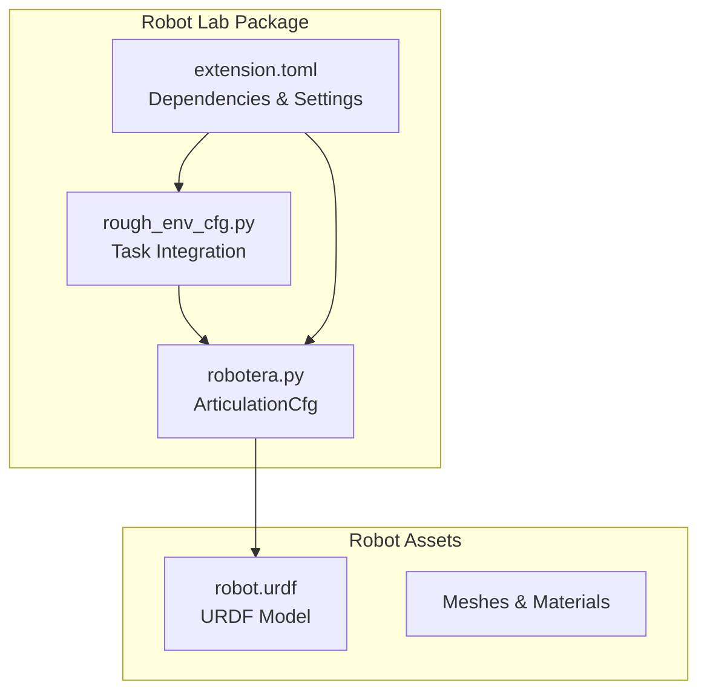
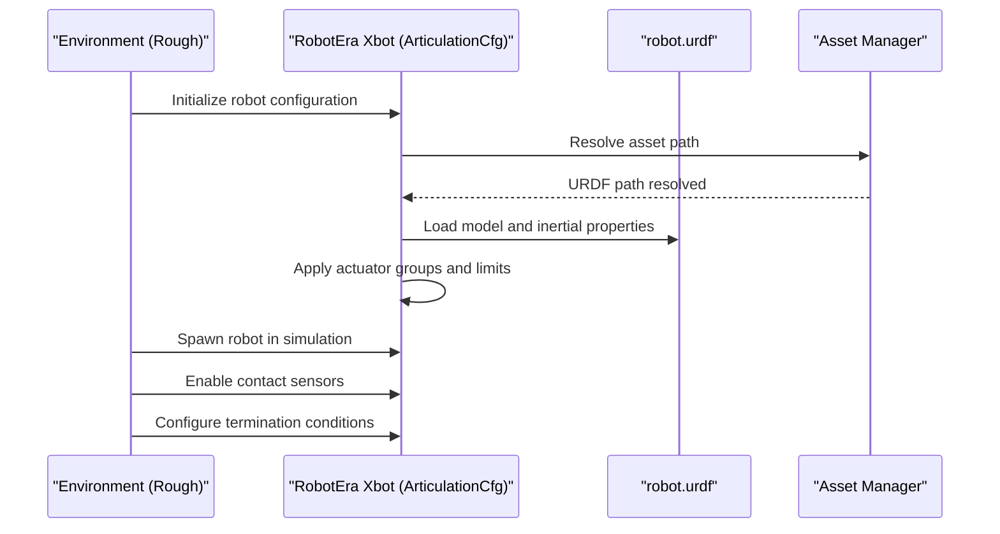
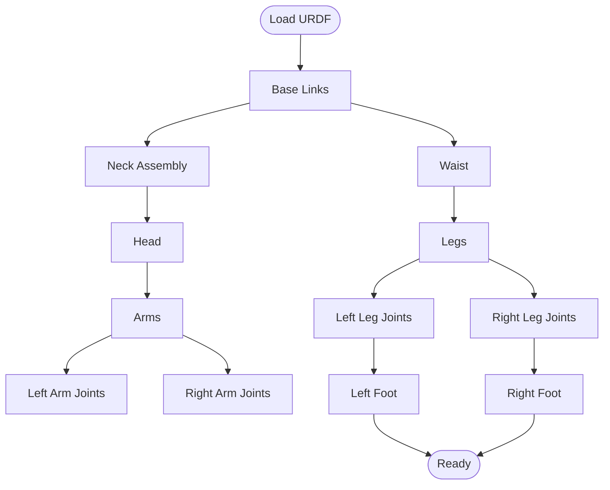
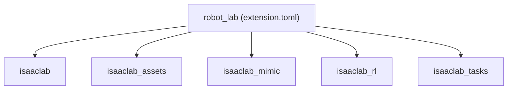

# RobotEra Xbot Humanoid

<cite>
**Referenced Files in This Document**
- [robotera.py](file://source/robot_lab/robot_lab/assets/robotera.py)
- [robot.urdf](file://source/robot_lab/data/Robots/robotera/xbot_description/urdf/robot.urdf)
- [extension.toml](file://source/robot_lab/config/extension.toml)
- [rough_env_cfg.py](file://source/robot_lab/robot_lab/tasks/manager_based/locomotion/velocity/config/humanoid/robotera_xbot/rough_env_cfg.py)
</cite>

## Table of Contents
1. [Introduction](#introduction)
2. [Project Structure](#project-structure)
3. [Core Components](#core-components)
4. [Architecture Overview](#architecture-overview)
5. [Detailed Component Analysis](#detailed-component-analysis)
6. [Dependency Analysis](#dependency-analysis)
7. [Performance Considerations](#performance-considerations)
8. [Troubleshooting Guide](#troubleshooting-guide)
9. [Conclusion](#conclusion)

## Introduction
This document describes the RobotEra Xbot humanoid platform configuration within the Robot Lab framework. It explains the design features, actuator specifications, control parameters, and integration approach for simulation and training. It also covers technical specifications such as joint ranges, torque capabilities, and dynamic performance characteristics, along with control strategies and parameter tuning guidelines for researchers and developers.

## Project Structure
The RobotEra Xbot configuration is organized under the Robot Lab package and integrates with the Isaac Lab simulation framework. Key locations:
- Asset definition: robotera.py defines the ArticulationCfg for the Xbot robot.
- URDF model: robot.urdf provides the complete kinematic and dynamic model.
- Environment configuration: rough_env_cfg.py demonstrates how the robot integrates into locomotion tasks.
- Package metadata: extension.toml lists dependencies and package settings.

**Diagram sources**
- [robotera.py](file://source/robot_lab/robot_lab/assets/robotera.py#L1-L106)
- [robot.urdf](file://source/robot_lab/data/Robots/robotera/xbot_description/urdf/robot.urdf#L1-L2124)
- [extension.toml](file://source/robot_lab/config/extension.toml#L1-L36)
- [rough_env_cfg.py](file://source/robot_lab/robot_lab/tasks/manager_based/locomotion/velocity/config/humanoid/robotera_xbot/rough_env_cfg.py#L125-L145)

**Section sources**
- [robotera.py](file://source/robot_lab/robot_lab/assets/robotera.py#L1-L106)
- [robot.urdf](file://source/robot_lab/data/Robots/robotera/xbot_description/urdf/robot.urdf#L1-L2124)
- [extension.toml](file://source/robot_lab/config/extension.toml#L1-L36)
- [rough_env_cfg.py](file://source/robot_lab/robot_lab/tasks/manager_based/locomotion/velocity/config/humanoid/robotera_xbot/rough_env_cfg.py#L125-L145)

## Core Components
The RobotEra Xbot configuration centers on a single ArticulationCfg that:
- Loads the URDF model from the assets directory.
- Enables contact sensors.
- Sets rigid body and articulation solver properties.
- Defines initial pose and joint limits.
- Groups actuators by functional regions: legs, feet, waist, arms.

Key configuration highlights:
- Base floating configuration with fixed-base disabled.
- Contact sensors activated for ground interaction.
- Soft joint position limit factor applied to avoid hard limits.
- Actuator groups with per-joint effort/velocity/stiffness/damping settings.

**Section sources**
- [robotera.py](file://source/robot_lab/robot_lab/assets/robotera.py#L10-L106)

## Architecture Overview
The RobotEra Xbot integrates into Robot Lab via:
- Asset loading through URDF.
- Actuator abstraction via implicit actuators.
- Task-specific environment configuration that references the robot’s base link and contact bodies.

**Diagram sources**
- [robotera.py](file://source/robot_lab/robot_lab/assets/robotera.py#L10-L37)
- [robot.urdf](file://source/robot_lab/data/Robots/robotera/xbot_description/urdf/robot.urdf#L1-L2124)
- [rough_env_cfg.py](file://source/robot_lab/robot_lab/tasks/manager_based/locomotion/velocity/config/humanoid/robotera_xbot/rough_env_cfg.py#L125-L145)

## Detailed Component Analysis

### Robot Model and Joint Specifications
The URDF defines the complete kinematic chain and joint limits. Representative joint ranges and dynamics are summarized below.

**Diagram sources**
- [robot.urdf](file://source/robot_lab/data/Robots/robotera/xbot_description/urdf/robot.urdf#L16-L2124)

Joint range and dynamic highlights (selected):
- Neck yaw: effort 50, lower -1.57, upper 1.57, velocity 7
- Neck pitch: effort 50, lower -0.44, upper 0.44, velocity 7
- Left/right shoulder pitch: effort 80, lower -3.14/+1.4, upper variable, velocity 7
- Left/right shoulder roll: effort 80, lower -2.79/+0.37, upper variable, velocity 7
- Left/right arm yaw: effort 50, lower -2.09/+2.09, velocity 7
- Left/right elbow pitch: effort 50, lower -0.26/+2.18, velocity 7
- Left/right elbow yaw: effort 50, lower -2.09/+2.09, velocity 7
- Left/right wrist roll/yaw: effort 50, lower -1.92/+1.92 and -2.09/+2.09, velocity 7
- Waist yaw/roll: effort 100, lower -1.57/+1.57/-0.26/+0.26, velocity 12
- Left/right leg roll/yaw/pitch/knee: effort 100/100/250/250, lower/upper variable, velocity 12
- Ankle pitch/roll: effort 100, lower -0.7/+0.87/-0.44/+0.44, velocity 12, with damping/friction

Notes:
- Joint limits and velocities are defined in the URDF.
- Actuator effort limits differ from URDF joint limits for simulation control.

**Section sources**
- [robot.urdf](file://source/robot_lab/data/Robots/robotera/xbot_description/urdf/robot.urdf#L90-L116)
- [robot.urdf](file://source/robot_lab/data/Robots/robotera/xbot_description/urdf/robot.urdf#L182-L263)
- [robot.urdf](file://source/robot_lab/data/Robots/robotera/xbot_description/urdf/robot.urdf#L282-L333)
- [robot.urdf](file://source/robot_lab/data/Robots/robotera/xbot_description/urdf/robot.urdf#L543-L569)
- [robot.urdf](file://source/robot_lab/data/Robots/robotera/xbot_description/urdf/robot.urdf#L584-L659)
- [robot.urdf](file://source/robot_lab/data/Robots/robotera/xbot_description/urdf/robot.urdf#L673-L706)
- [robot.urdf](file://source/robot_lab/data/Robots/robotera/xbot_description/urdf/robot.urdf#L951-L958)
- [robot.urdf](file://source/robot_lab/data/Robots/robotera/xbot_description/urdf/robot.urdf#L977-L984)

### Actuator Configuration and Control Parameters
The ArticulationCfg defines implicit actuators grouped by function. Each group specifies:
- Joint name expressions.
- Effort and velocity limits for simulation.
- Stiffness and damping parameters.
- Armature and PD gains.

Actuator groups:
- Legs: roll/yaw/pitch/knee joints with effort 100–250, velocity 12, stiffness 200–350, damping 10.0.
- Feet: ankle pitch/roll with effort 100, velocity 12, stiffness 15.0, damping 10.0.
- Waist: yaw/roll with effort 100, velocity 12, stiffness 200.0, damping 10.0.
- Arms: shoulder/elbow/wrist joints with effort 50–80, velocity 7.0, stiffness 100.0, damping 10.0.

Initial state:
- Position: z ≈ 0.95 m.
- All joints initialized to zero position and zero velocity.

Soft joint limits:
- Soft limit factor 0.9 applied to prevent hard limit violations.

Solver and rigid body properties:
- Gravity enabled, no linear/angular damping.
- High max velocities and penetration thresholds suitable for simulation stability.

**Section sources**
- [robotera.py](file://source/robot_lab/robot_lab/assets/robotera.py#L10-L106)

### Integration Within Robot Lab Tasks
The environment configuration demonstrates integration specifics:
- Termination conditions reference base and leg links for illegal contact detection.
- Curriculum settings can be adjusted; in the rough environment, command level curricula are disabled.
- Command ranges for base velocity are set to reasonable bounds for rough terrain.

Practical implication:
- The robot’s base and leg links are explicitly used for safety and curriculum controls in locomotion tasks.

**Section sources**
- [rough_env_cfg.py](file://source/robot_lab/robot_lab/tasks/manager_based/locomotion/velocity/config/humanoid/robotera_xbot/rough_env_cfg.py#L125-L145)

## Dependency Analysis
The Robot Lab extension declares dependencies on core packages, ensuring compatibility and enabling RL tasks.

**Diagram sources**
- [extension.toml](file://source/robot_lab/config/extension.toml#L17-L23)

**Section sources**
- [extension.toml](file://source/robot_lab/config/extension.toml#L17-L23)

## Performance Considerations
- Joint effort vs. URDF limits: Simulation effort limits differ from URDF joint limits; tune actuator effort limits to match desired torque capabilities while maintaining stability.
- Velocity limits: Arms operate at lower velocity limits than legs; ensure controller gains accommodate this difference.
- Solver settings: Low damping and high velocity limits improve simulation responsiveness but require careful controller tuning.
- Soft joint limits: Factor 0.9 reduces hard impacts near physical limits; validate with your control policy to avoid oscillations.

[No sources needed since this section provides general guidance]

## Troubleshooting Guide
Common issues and remedies:
- Excessive joint torques: Reduce actuator effort limits or increase damping to prevent simulation instability.
- Contact sensor false positives: Verify contact sensor placement and adjust termination conditions to exclude non-ground contacts.
- Poor locomotion performance: Lower velocity limits for arms during early training; gradually increase as policy improves.
- Solver convergence problems: Increase solver iteration counts if needed; ensure soft joint limits are appropriate.

[No sources needed since this section provides general guidance]

## Conclusion
The RobotEra Xbot configuration in Robot Lab provides a modular, simulation-ready humanoid platform. Its URDF-based model, explicit actuator groups, and environment integration enable flexible research in locomotion and manipulation. By aligning actuator parameters with URDF joint limits and environment constraints, researchers can achieve stable and efficient training across diverse scenarios.