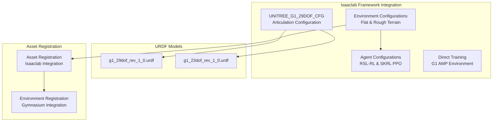
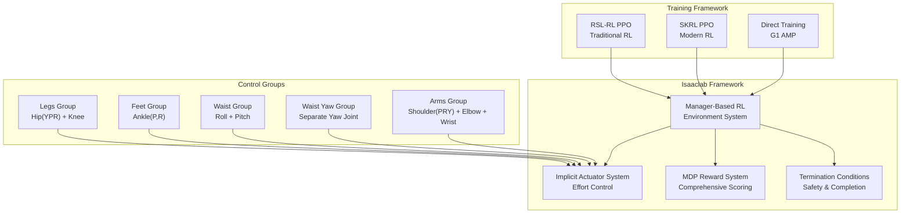
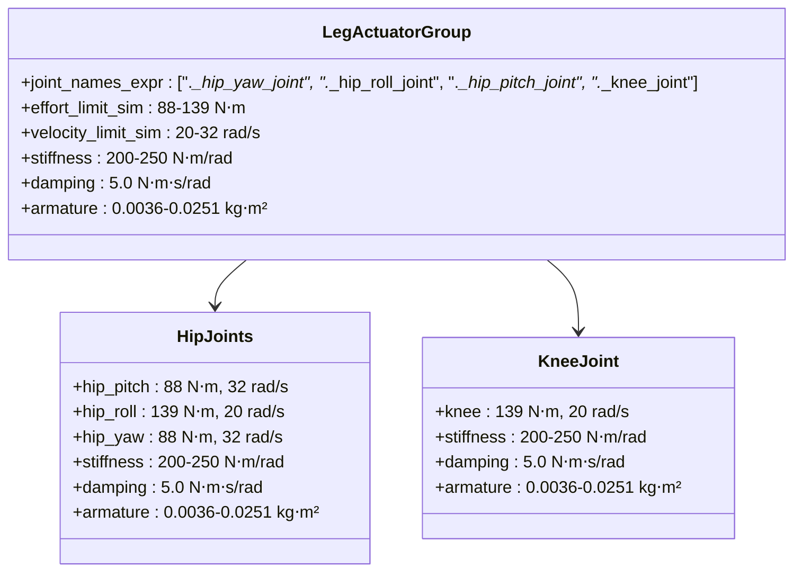
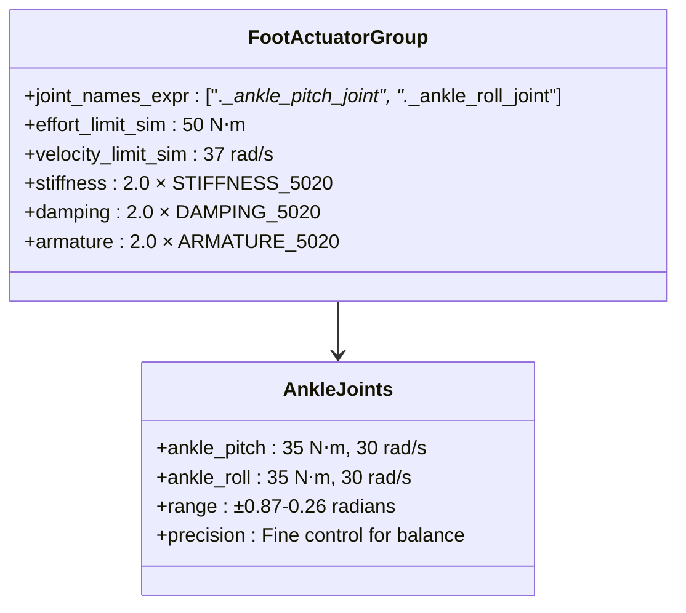
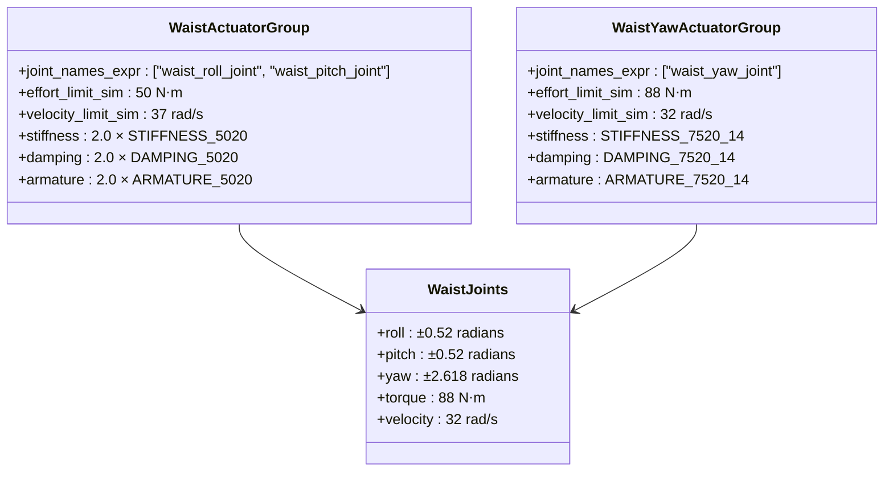
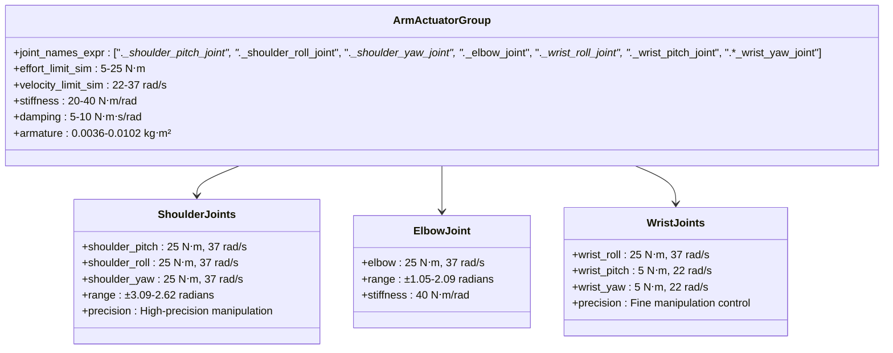
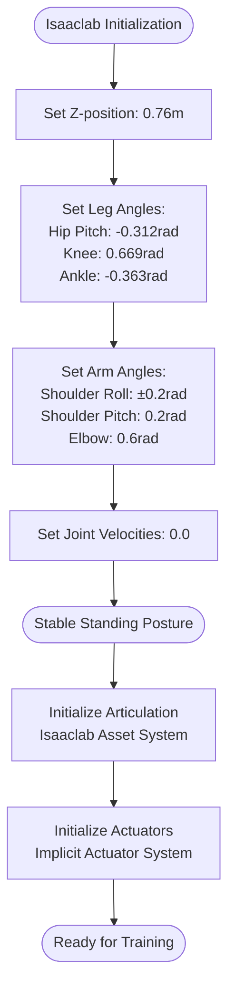
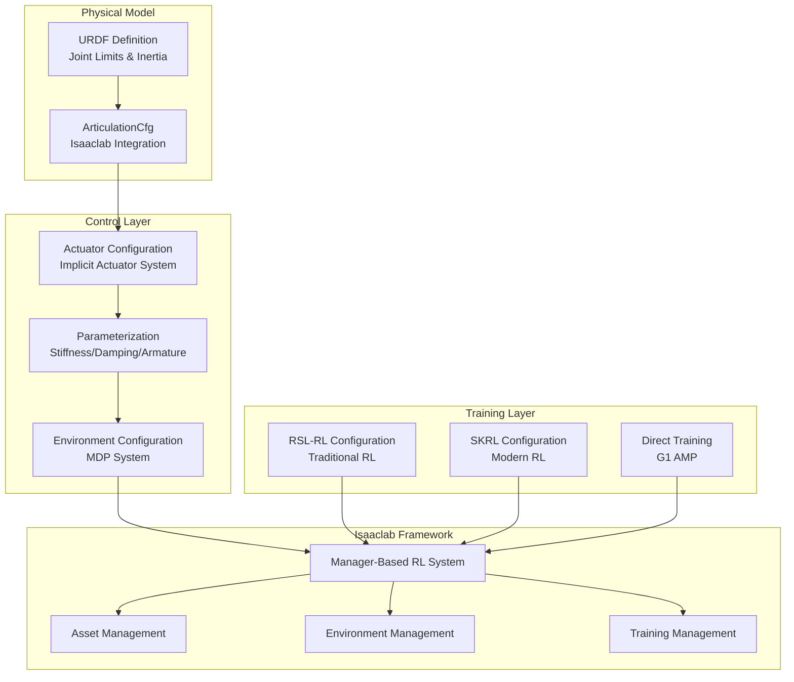

# Unitree G1 Humanoid

<cite>
**Referenced Files in This Document**
- [README.md](file://README.md)
- [unitree.py](file://source/robot_lab/robot_lab/assets/unitree.py)
- [g1_29dof_rev_1_0.urdf](file://source/robot_lab/data/Robots/unitree/g1_description/urdf/g1_29dof_rev_1_0.urdf)
- [g1_23dof_rev_1_0.urdf](file://source/robot_lab/data/Robots/unitree/g1_description/urdf/g1_23dof_rev_1_0.urdf)
- [g1_amp_env_cfg.py](file://source/robot_lab/robot_lab/tasks/direct/g1_amp/g1_amp_env_cfg.py)
- [flat_env_cfg.py](file://source/robot_lab/robot_lab/tasks/manager_based/locomotion/velocity/config/humanoid/g1/flat_env_cfg.py)
- [rough_env_cfg.py](file://source/robot_lab/robot_lab/tasks/manager_based/locomotion/velocity/config/humanoid/g1/rough_env_cfg.py)
- [rsl_rl_ppo_cfg.py](file://source/robot_lab/robot_lab/tasks/manager_based/locomotion/velocity/config/humanoid/g1/agents/rsl_rl_ppo_cfg.py)
- [skrl_flat_ppo_cfg.yaml](file://source/robot_lab/robot_lab/tasks/manager_based/locomotion/velocity/config/humanoid/g1/agents/skrl_flat_ppo_cfg.yaml)
- [skrl_rough_ppo_cfg.yaml](file://source/robot_lab/robot_lab/tasks/manager_based/locomotion/velocity/config/humanoid/g1/agents/skrl_rough_ppo_cfg.yaml)
- [__init__.py](file://source/robot_lab/robot_lab/tasks/manager_based/locomotion/velocity/config/humanoid/g1/__init__.py)
- [g1_amp_env.py](file://source/robot_lab/robot_lab/tasks/direct/g1_amp/g1_amp_env.py)
</cite>

## Update Summary
**Changes Made**
- Updated to reflect transition from Unitree G1 robot configuration to Isaaclab G1 framework
- Added new G1 humanoid configuration system with flat and rough terrain environments
- Updated reward structures with comprehensive MDP-based reward definitions
- Added dual agent training support (RSL-RL PPO and SKRL PPO)
- Integrated Manager-Based Reinforcement Learning framework
- Enhanced environment configurations with terrain-specific settings

## Table of Contents
1. [Introduction](#introduction)
2. [Project Structure](#project-structure)
3. [Core Components](#core-components)
4. [Architecture Overview](#architecture-overview)
5. [Detailed Component Analysis](#detailed-component-analysis)
6. [Environment Configuration](#environment-configuration)
7. [Training Framework](#training-framework)
8. [Dependency Analysis](#dependency-analysis)
9. [Performance Considerations](#performance-considerations)
10. [Troubleshooting Guide](#troubleshooting-guide)
11. [Conclusion](#conclusion)

## Introduction
This document provides comprehensive technical documentation for the Unitree G1 humanoid robot configuration within the Isaaclab ecosystem. The configuration has been fully transitioned from the legacy Unitree G1 setup to the modern Isaaclab framework, featuring a 29-degree-of-freedom structure with advanced control architecture, sophisticated reward systems, and dual agent training support. The new system encompasses Manager-Based Reinforcement Learning environments for both flat and rough terrain locomotion, comprehensive actuator mapping across legs, waist, and arms, and advanced control parameters optimized for humanoid dynamics.

## Project Structure
The Unitree G1 configuration is now organized within the Isaaclab framework across multiple modules:



**Diagram sources**
- [unitree.py:466-623](file://source/robot_lab/robot_lab/assets/unitree.py#L466-L623)
- [flat_env_cfg.py:12-57](file://source/robot_lab/robot_lab/tasks/manager_based/locomotion/velocity/config/humanoid/g1/flat_env_cfg.py#L12-L57)
- [rough_env_cfg.py:104-182](file://source/robot_lab/robot_lab/tasks/manager_based/locomotion/velocity/config/humanoid/g1/rough_env_cfg.py#L104-L182)
- [__init__.py:14-71](file://source/robot_lab/robot_lab/tasks/manager_based/locomotion/velocity/config/humanoid/g1/__init__.py#L14-L71)

**Section sources**
- [unitree.py:466-623](file://source/robot_lab/robot_lab/assets/unitree.py#L466-L623)
- [README.md:32-32](file://README.md#L32-L32)

## Core Components
The Unitree G1 humanoid within the Isaaclab framework consists of:

- **29 degrees of freedom**: 20 joints across two legs, waist, and two arms
- **Leg joints**: Hip (pitch/yaw/roll), Knee, Ankle (pitch/roll)
- **Waist joints**: Roll, Pitch, Yaw (with separate actuator)
- **Arm joints**: Shoulder (pitch/roll/yaw), Elbow, Wrist (roll/pitch/yaw)
- **Hands**: Rubber hands attached to wrists for manipulation
- **Implicit actuators**: Optimized for Isaaclab's Manager-Based RL framework

The configuration leverages Isaaclab's advanced asset management system with integrated actuator parameterization and environment registration.

**Section sources**
- [unitree.py:466-623](file://source/robot_lab/robot_lab/assets/unitree.py#L466-L623)
- [g1_29dof_rev_1_0.urdf:94-157](file://source/robot_lab/data/Robots/unitree/g1_description/urdf/g1_29dof_rev_1_0.urdf#L94-L157)

## Architecture Overview
The Isaaclab G1 architecture separates the 29 joints into five distinct actuator groups with Manager-Based RL integration:



**Diagram sources**
- [unitree.py:503-622](file://source/robot_lab/robot_lab/assets/unitree.py#L503-L622)
- [rough_env_cfg.py:19-101](file://source/robot_lab/robot_lab/tasks/manager_based/locomotion/velocity/config/humanoid/g1/rough_env_cfg.py#L19-L101)
- [rsl_rl_ppo_cfg.py:11-50](file://source/robot_lab/robot_lab/tasks/manager_based/locomotion/velocity/config/humanoid/g1/agents/rsl_rl_ppo_cfg.py#L11-L50)

The architecture enables:
- Manager-Based RL with comprehensive reward and termination systems
- Dual agent training support for research and development
- Advanced actuator parameterization with individualized control
- Seamless integration with Isaaclab's asset and environment management

**Section sources**
- [unitree.py:503-622](file://source/robot_lab/robot_lab/assets/unitree.py#L503-L622)
- [rough_env_cfg.py:19-101](file://source/robot_lab/robot_lab/tasks/manager_based/locomotion/velocity/config/humanoid/g1/rough_env_cfg.py#L19-L101)

## Detailed Component Analysis

### Leg Actuator Group
The leg group controls all lower-body joints with individualized parameters optimized for Isaaclab's implicit actuator system:



**Diagram sources**
- [unitree.py:504-541](file://source/robot_lab/robot_lab/assets/unitree.py#L504-L541)

Key characteristics:
- **Hip joints**: Higher torque capability for load-bearing with individualized limits
- **Knee joint**: Lower torque requirement with higher velocity limit for mobility
- **Individualized limits**: Each joint has specific effort and velocity constraints
- **Consistent stiffness/damping**: Balanced parameters for stability across the Isaaclab framework

**Section sources**
- [unitree.py:511-540](file://source/robot_lab/robot_lab/assets/unitree.py#L511-L540)

### Foot Actuator Group
The foot group provides specialized ankle control with enhanced precision for Isaaclab's terrain adaptation:



**Diagram sources**
- [unitree.py:542-549](file://source/robot_lab/robot_lab/assets/unitree.py#L542-L549)

Special features:
- **Enhanced precision**: Higher velocity limits for quick corrections in dynamic environments
- **Optimized stiffness**: Reduced stiffness for compliant foot-ground interaction
- **Individualized parameters**: Separate ankle joints for bidirectional control

**Section sources**
- [unitree.py:542-549](file://source/robot_lab/robot_lab/assets/unitree.py#L542-L549)

### Waist Actuator Groups
The waist system includes three distinct control groups with separate actuator configuration:



**Diagram sources**
- [unitree.py:550-565](file://source/robot_lab/robot_lab/assets/unitree.py#L550-L565)

Control characteristics:
- **Waist roll/pitch**: Low-stiffness for flexibility and comfort
- **Waist yaw**: Higher torque capability for rotation with separate actuator
- **Individualized control**: Separate yaw actuator for precise orientation

**Section sources**
- [unitree.py:550-565](file://source/robot_lab/robot_lab/assets/unitree.py#L550-L565)

### Arm Actuator Group
The arms receive the most sophisticated control treatment with variable stiffness optimization:



**Diagram sources**
- [unitree.py:566-621](file://source/robot_lab/robot_lab/assets/unitree.py#L566-L621)

Advanced features:
- **Variable stiffness**: Lower stiffness for shoulders, higher for elbows for force scaling
- **Precision control**: Specialized wrist joints with reduced torque for delicate tasks
- **Individualized limits**: Different effort and velocity requirements per joint
- **Optimized armature**: Lightweight construction for dexterous manipulation

**Section sources**
- [unitree.py:566-621](file://source/robot_lab/robot_lab/assets/unitree.py#L566-L621)

### Initialization State and Stable Posture
The initialization state establishes a stable, ready-to-move posture optimized for Isaaclab's simulation framework:



**Diagram sources**
- [unitree.py:488-501](file://source/robot_lab/robot_lab/assets/unitree.py#L488-L501)

The posture ensures:
- **Ground clearance**: Proper leg extension for stable support in Isaaclab simulations
- **Shoulder positioning**: Arms relaxed for manipulation readiness
- **Neck alignment**: Head positioned for forward vision
- **Zero initial velocity**: Prevents dynamic disturbances in Manager-Based RL

**Section sources**
- [unitree.py:488-501](file://source/robot_lab/robot_lab/assets/unitree.py#L488-L501)

## Environment Configuration
The Isaaclab G1 framework provides comprehensive environment configurations for both flat and rough terrain locomotion:

### Flat Terrain Environment
The flat terrain environment simplifies the reward structure for basic locomotion tasks:

```mermaid
classDiagram
class G1FlatEnvCfg {
+terrain_type : "plane"
+height_scanner : None
+terrain_curriculum : None
+rewards : {
+track_ang_vel_z_exp : weight=1.0
+lin_vel_z_l2 : weight=-0.2
+action_rate_l2 : weight=-0.005
+dof_acc_l2 : weight=-1.0e-7
+feet_air_time : weight=0.75
+dof_torques_l2 : weight=-2.0e-6
+}
+commands : {
+lin_vel_x : (0.0, 1.0)
+lin_vel_y : (-0.5, 0.5)
+ang_vel_z : (-1.0, 1.0)
+}
}
```

**Diagram sources**
- [flat_env_cfg.py:12-57](file://source/robot_lab/robot_lab/tasks/manager_based/locomotion/velocity/config/humanoid/g1/flat_env_cfg.py#L12-L57)

### Rough Terrain Environment
The rough terrain environment implements comprehensive MDP-based reward system:

```mermaid
classDiagram
class G1RoughEnvCfg {
+rewards : G1Rewards
+scene.robot : G1_MINIMAL_CFG
+events : {
+push_robot : None
+add_base_mass : None
+reset_robot_joints : position_range=(1.0, 1.0)
+base_external_force_torque : asset_cfg.body_names=["torso_link"]
+}
+terminations : {
+base_contact : sensor_cfg.body_names="torso_link"
+}
+commands : {
+lin_vel_x : (0.0, 1.0)
+lin_vel_y : (-0.0, 0.0)
+ang_vel_z : (-1.0, 1.0)
+}
}
class G1Rewards {
+termination_penalty : -200.0
+track_lin_vel_xy_exp : weight=1.0
+track_ang_vel_z_exp : weight=2.0
+feet_air_time : weight=0.25
+feet_slide : weight=-0.1
+dof_pos_limits : weight=-1.0
+joint_deviation_hip : weight=-0.1
+joint_deviation_arms : weight=-0.1
+joint_deviation_fingers : weight=-0.05
+joint_deviation_torso : weight=-0.1
}
```

**Diagram sources**
- [rough_env_cfg.py:104-182](file://source/robot_lab/robot_lab/tasks/manager_based/locomotion/velocity/config/humanoid/g1/rough_env_cfg.py#L104-L182)

**Section sources**
- [flat_env_cfg.py:12-57](file://source/robot_lab/robot_lab/tasks/manager_based/locomotion/velocity/config/humanoid/g1/flat_env_cfg.py#L12-L57)
- [rough_env_cfg.py:104-182](file://source/robot_lab/robot_lab/tasks/manager_based/locomotion/velocity/config/humanoid/g1/rough_env_cfg.py#L104-L182)

## Training Framework
The Isaaclab G1 framework supports dual agent training architectures with comprehensive configuration options:

### RSL-RL PPO Configuration
The RSL-RL PPO implementation provides traditional reinforcement learning training:

```mermaid
classDiagram
class G1RoughPPORunnerCfg {
+num_steps_per_env : 24
+max_iterations : 3000
+save_interval : 50
+experiment_name : "g1_rough"
+policy : {
+init_noise_std : 1.0
+actor_hidden_dims : [512, 256, 128]
+critic_hidden_dims : [512, 256, 128]
+activation : "elu"
+}
+algorithm : {
+value_loss_coef : 1.0
+clip_param : 0.2
+entropy_coef : 0.008
+learning_rate : 1.0e-3
+gamma : 0.99
+lam : 0.95
+desired_kl : 0.01
+}
}
class G1FlatPPORunnerCfg {
+extends G1RoughPPORunnerCfg
+max_iterations : 1500
+experiment_name : "g1_flat"
+policy.actor_hidden_dims : [256, 128, 128]
+policy.critic_hidden_dims : [256, 128, 128]
}
```

**Diagram sources**
- [rsl_rl_ppo_cfg.py:11-50](file://source/robot_lab/robot_lab/tasks/manager_based/locomotion/velocity/config/humanoid/g1/agents/rsl_rl_ppo_cfg.py#L11-L50)

### SKRL PPO Configuration
The SKRL PPO implementation provides modern reinforcement learning training with YAML configuration:

```mermaid
classDiagram
class SKRLFlatPPOCfg {
+seed : 42
+models : {
+separate : False
+policies : [256, 128, 128]
+value : [256, 128, 128]
+}
+agent : {
+rollouts : 24
+learning_epochs : 5
+mini_batches : 4
+discount_factor : 0.99
+lambda : 0.95
+learning_rate : 1.0e-03
+scheduler : KLAdaptiveLR
+kl_threshold : 0.01
+entropy_loss_scale : 0.008
+value_loss_scale : 1.0
+}
+trainer : {
+timesteps : 36000
+environment_info : log
+}
}
```

**Diagram sources**
- [skrl_flat_ppo_cfg.yaml:11-86](file://source/robot_lab/robot_lab/tasks/manager_based/locomotion/velocity/config/humanoid/g1/agents/skrl_flat_ppo_cfg.yaml#L11-L86)

**Section sources**
- [rsl_rl_ppo_cfg.py:11-50](file://source/robot_lab/robot_lab/tasks/manager_based/locomotion/velocity/config/humanoid/g1/agents/rsl_rl_ppo_cfg.py#L11-L50)
- [skrl_flat_ppo_cfg.yaml:11-86](file://source/robot_lab/robot_lab/tasks/manager_based/locomotion/velocity/config/humanoid/g1/agents/skrl_flat_ppo_cfg.yaml#L11-L86)
- [skrl_rough_ppo_cfg.yaml:11-86](file://source/robot_lab/robot_lab/tasks/manager_based/locomotion/velocity/config/humanoid/g1/agents/skrl_rough_ppo_cfg.yaml#L11-L86)

## Dependency Analysis
The Isaaclab G1 configuration exhibits clear separation of concerns within the Manager-Based RL framework:



**Diagram sources**
- [unitree.py:466-623](file://source/robot_lab/robot_lab/assets/unitree.py#L466-L623)
- [rough_env_cfg.py:104-182](file://source/robot_lab/robot_lab/tasks/manager_based/locomotion/velocity/config/humanoid/g1/rough_env_cfg.py#L104-L182)
- [__init__.py:14-71](file://source/robot_lab/robot_lab/tasks/manager_based/locomotion/velocity/config/humanoid/g1/__init__.py#L14-L71)

Dependencies:
- URDF defines physical constraints and inertial properties
- ArticulationCfg integrates with Isaaclab's asset management
- Actuator configuration depends on URDF joint definitions
- Environment configuration references actuator parameters
- Manager-Based RL system orchestrates training and evaluation
- Dual agent frameworks provide research flexibility

**Section sources**
- [unitree.py:466-623](file://source/robot_lab/robot_lab/assets/unitree.py#L466-L623)
- [rough_env_cfg.py:104-182](file://source/robot_lab/robot_lab/tasks/manager_based/locomotion/velocity/config/humanoid/g1/rough_env_cfg.py#L104-L182)
- [__init__.py:14-71](file://source/robot_lab/robot_lab/tasks/manager_based/locomotion/velocity/config/humanoid/g1/__init__.py#L14-L71)

## Performance Considerations
The Isaaclab G1 configuration optimizes for humanoid control performance within the Manager-Based RL framework:

### Torque and Velocity Optimization
- **Legs**: Higher torque capability (88-139 N⋅m) with moderate velocities (20-32 rad/s) for load-bearing
- **Arms**: Variable torque (5-25 N⋅m) with high velocities (22-37 rad/s) for manipulation
- **Feet**: Balanced torque (35 N⋅m) with high velocity (30 rad/s) for compliance
- **Waist**: Moderate torque (88 N⋅m) with high velocity (32 rad/s) for agility

### Stiffness and Damping Trade-offs
- **Load-bearing joints**: Higher stiffness (200-250 N⋅m/rad) for stability in Manager-Based RL
- **Manipulation joints**: Lower stiffness (20-40 N⋅m/rad) for safety and compliance
- **Damping ratios**: Consistent 2.0 for critical joints, 5.0 for manipulators

### Dynamic Stability Parameters
- **Natural frequency**: 10 Hz for balanced responsiveness in Isaaclab simulations
- **Damping ratio**: 2.0 for critical stability
- **Armature values**: Optimized for realistic inertia modeling

### Training Performance
- **RSL-RL**: Traditional PPO with adaptive KL divergence control
- **SKRL**: Modern PPO with configurable schedulers and memory systems
- **Direct training**: G1 AMP with motion imitation for skill acquisition

**Section sources**
- [unitree.py:448-464](file://source/robot_lab/robot_lab/assets/unitree.py#L448-L464)
- [unitree.py:511-620](file://source/robot_lab/robot_lab/assets/unitree.py#L511-L620)
- [rsl_rl_ppo_cfg.py:11-50](file://source/robot_lab/robot_lab/tasks/manager_based/locomotion/velocity/config/humanoid/g1/agents/rsl_rl_ppo_cfg.py#L11-L50)

## Troubleshooting Guide
Common issues and solutions for the Isaaclab G1 framework:

### Environment Registration Issues
**Symptoms**: Cannot find G1 environments in Gymnasium registry
**Causes**: Missing environment registration or incorrect import paths
**Solutions**:
- Verify environment registration in `g1/__init__.py`
- Check asset path configuration in `ISAACLAB_ASSETS_DATA_DIR`
- Ensure proper import of agent configurations
- Verify Isaaclab extension installation

### Training Configuration Problems
**Symptoms**: Training fails or produces unstable results
**Causes**: Incorrect reward weights or training hyperparameters
**Solutions**:
- Adjust reward weights in environment configurations
- Verify actuator parameter consistency
- Check terrain configuration for appropriate difficulty
- Validate agent configuration compatibility

### Actuator Parameter Issues
**Symptoms**: Joint limits violations or control instability
**Causes**: Inconsistent actuator parameters across groups
**Solutions**:
- Verify effort and velocity limits in actuator configurations
- Check stiffness and damping ratios for stability
- Ensure proper armature values for joint inertia
- Validate implicit actuator configuration

### Asset Loading Problems
**Symptoms**: URDF loading failures or missing joint definitions
**Causes**: Incorrect asset paths or URDF file corruption
**Solutions**:
- Verify URDF file paths in asset configuration
- Check joint name expressions in actuator configurations
- Ensure proper mesh file references
- Validate URDF compilation process

**Section sources**
- [unitree.py:503-622](file://source/robot_lab/robot_lab/assets/unitree.py#L503-L622)
- [flat_env_cfg.py:12-57](file://source/robot_lab/robot_lab/tasks/manager_based/locomotion/velocity/config/humanoid/g1/flat_env_cfg.py#L12-L57)
- [rough_env_cfg.py:104-182](file://source/robot_lab/robot_lab/tasks/manager_based/locomotion/velocity/config/humanoid/g1/rough_env_cfg.py#L104-L182)

## Conclusion
The Isaaclab G1 humanoid configuration represents a comprehensive transition from legacy Unitree G1 setup to modern robotics research framework. The 29-degree-of-freedom structure with Manager-Based RL integration enables sophisticated control for locomotion, manipulation, and stability tasks. The dual agent training support (RSL-RL PPO and SKRL PPO) provides researchers with flexible training methodologies, while the comprehensive reward systems address the unique challenges of humanoid control including balance maintenance, dynamic walking, and precise manipulation tasks.

The modular architecture supports both research applications and practical deployment scenarios, making it suitable for reinforcement learning, teleoperation, and autonomous humanoid applications within the Isaaclab ecosystem. The integration with Manager-Based RL framework provides advanced capabilities for terrain adaptation, safety monitoring, and performance optimization that were not available in the original Unitree G1 configuration.