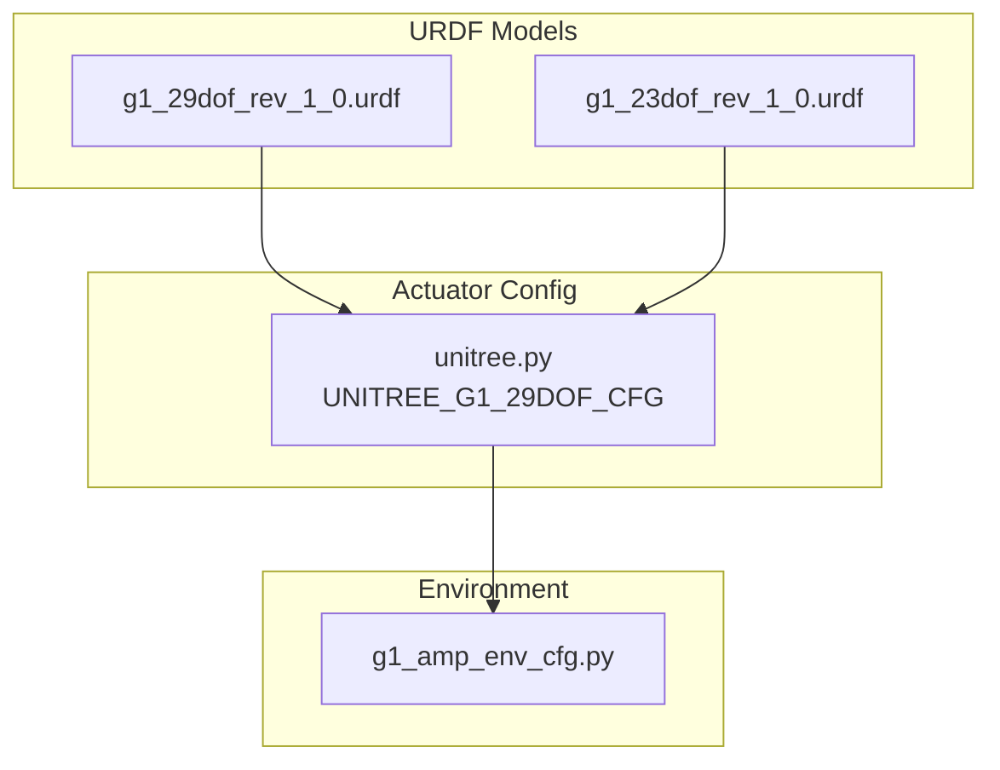
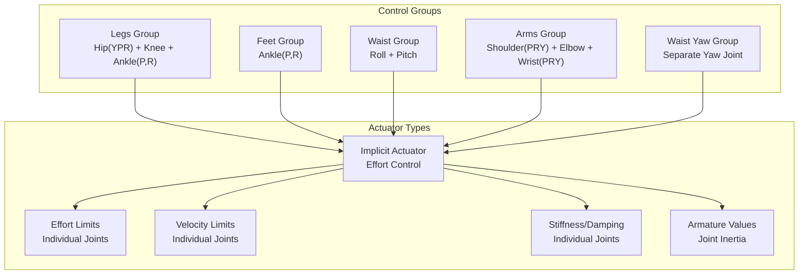
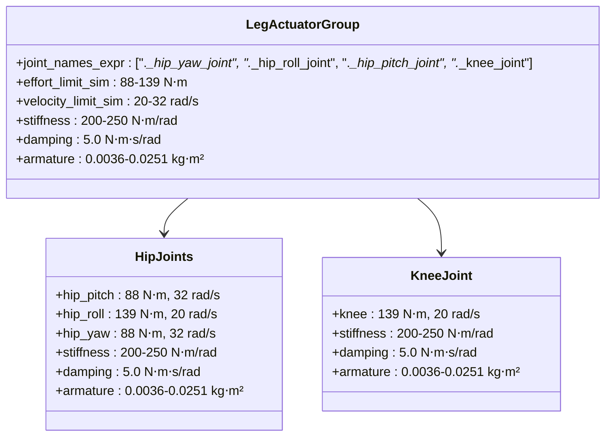
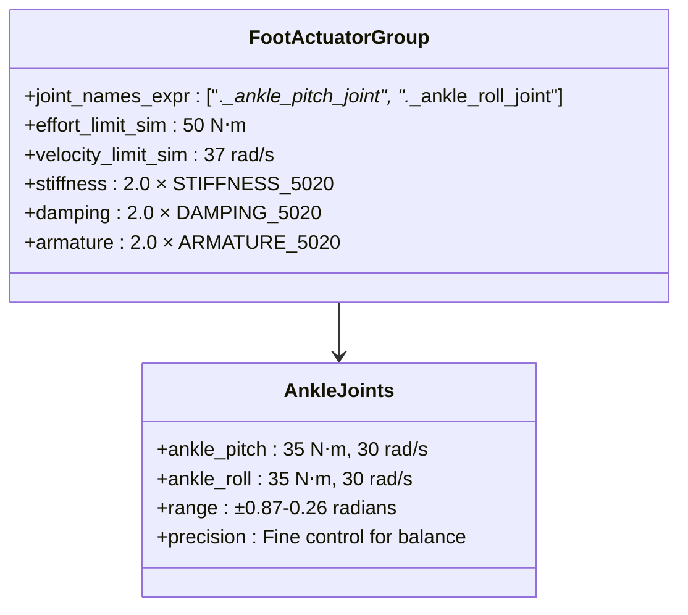
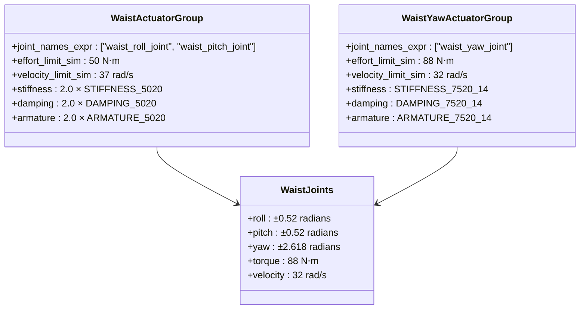
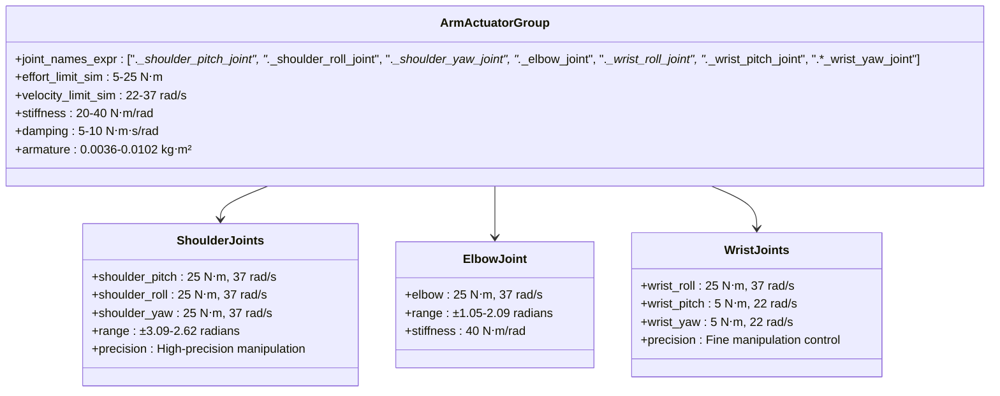
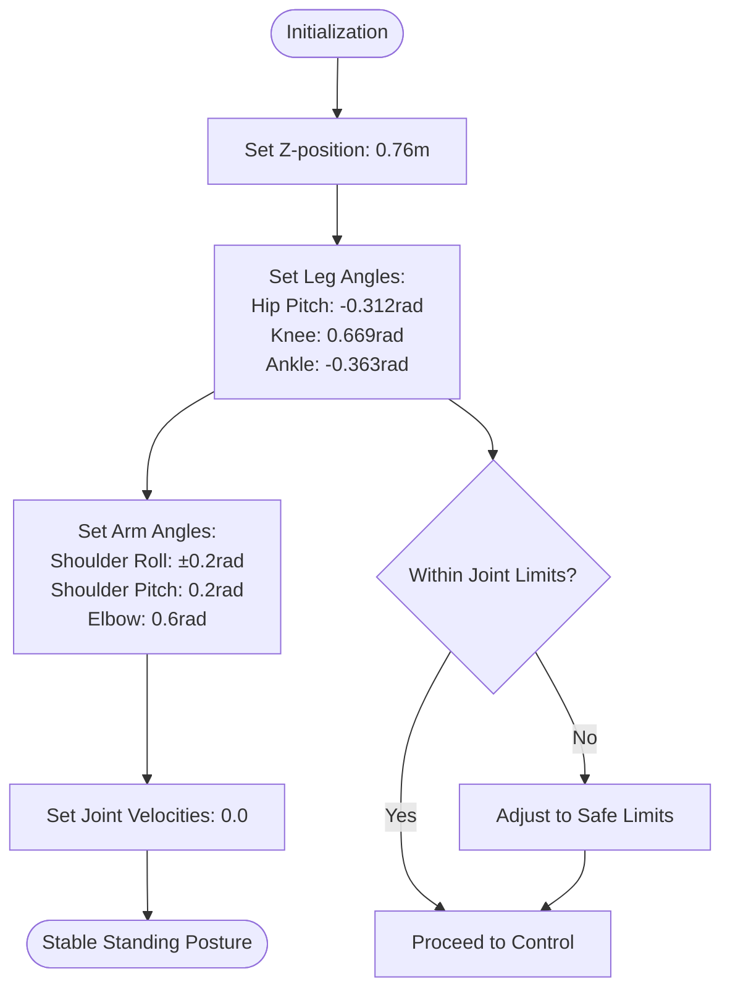
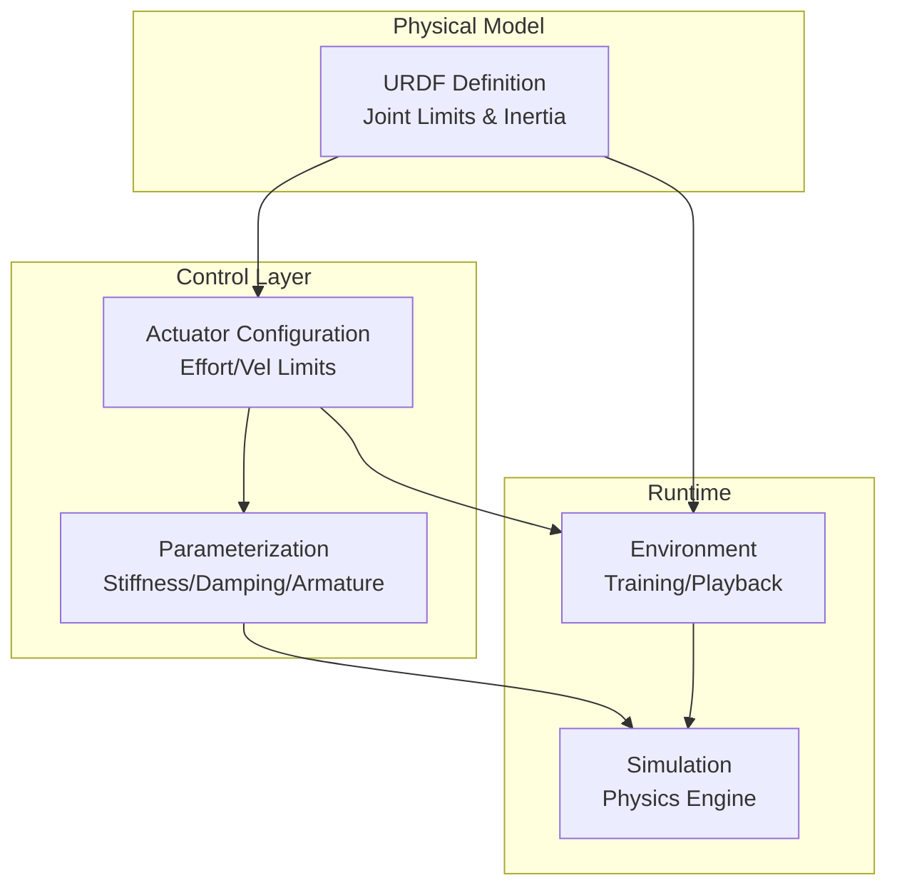

# Unitree G1 Humanoid

<cite>
**Referenced Files in This Document**
- [README.md](file://README.md)
- [unitree.py](file://source/robot_lab/robot_lab/assets/unitree.py)
- [g1_29dof_rev_1_0.urdf](file://source/robot_lab/data/Robots/unitree/g1_description/urdf/g1_29dof_rev_1_0.urdf)
- [g1_23dof_rev_1_0.urdf](file://source/robot_lab/data/Robots/unitree/g1_description/urdf/g1_23dof_rev_1_0.urdf)
- [g1_amp_env_cfg.py](file://source/robot_lab/robot_lab/tasks/direct/g1_amp/g1_amp_env_cfg.py)
</cite>

## Table of Contents
1. [Introduction](#introduction)
2. [Project Structure](#project-structure)
3. [Core Components](#core-components)
4. [Architecture Overview](#architecture-overview)
5. [Detailed Component Analysis](#detailed-component-analysis)
6. [Dependency Analysis](#dependency-analysis)
7. [Performance Considerations](#performance-considerations)
8. [Troubleshooting Guide](#troubleshooting-guide)
9. [Conclusion](#conclusion)

## Introduction
This document provides comprehensive technical documentation for the Unitree G1 humanoid robot configuration within the robot_lab ecosystem. It covers the 29-degree-of-freedom structure, actuator mapping across legs, waist, and arms, advanced control architecture with separate actuator groups, sophisticated stiffness and damping parameterization, initialization state for stable standing posture, implicit actuator configuration with effort limits, velocity limits, and armature values, and technical specifications including joint ranges, torque capabilities, and dynamic stability parameters. It also addresses the unique challenges of controlling a bipedal humanoid including balance maintenance, dynamic walking, and manipulation tasks.

## Project Structure
The Unitree G1 configuration is organized across several modules:
- URDF models defining the physical structure and kinematics
- Actuator configuration defining control parameters
- Environment configuration for reinforcement learning tasks
- Asset registration for Isaac Lab integration

**Diagram sources**
- [g1_29dof_rev_1_0.urdf](file://source/robot_lab/data/Robots/unitree/g1_description/urdf/g1_29dof_rev_1_0.urdf#L1-L1427)
- [g1_23dof_rev_1_0.urdf](file://source/robot_lab/data/Robots/unitree/g1_description/urdf/g1_23dof_rev_1_0.urdf#L1-L854)
- [unitree.py](file://source/robot_lab/robot_lab/assets/unitree.py#L466-L623)
- [g1_amp_env_cfg.py](file://source/robot_lab/robot_lab/tasks/direct/g1_amp/g1_amp_env_cfg.py#L86-L87)

**Section sources**
- [README.md](file://README.md#L32-L32)
- [unitree.py](file://source/robot_lab/robot_lab/assets/unitree.py#L466-L623)

## Core Components
The Unitree G1 humanoid consists of:
- **29 degrees of freedom**: 20 joints across two legs, waist, and two arms
- **Leg joints**: Hip (pitch/yaw/roll), Knee, Ankle (pitch/roll)
- **Waist joints**: Roll, Pitch, Yaw
- **Arm joints**: Shoulder (pitch/roll/yaw), Elbow, Wrist (roll/pitch/yaw)
- **Hands**: Rubber hands attached to wrists for manipulation

The configuration uses implicit actuators with individualized stiffness and damping parameters for each joint group, optimizing for humanoid dynamics and control performance.

**Section sources**
- [unitree.py](file://source/robot_lab/robot_lab/assets/unitree.py#L466-L623)
- [g1_29dof_rev_1_0.urdf](file://source/robot_lab/data/Robots/unitree/g1_description/urdf/g1_29dof_rev_1_0.urdf#L94-L157)
- [g1_29dof_rev_1_0.urdf](file://source/robot_lab/data/Robots/unitree/g1_description/urdf/g1_29dof_rev_1_0.urdf#L474-L531)

## Architecture Overview
The control architecture separates the 29 joints into four distinct actuator groups:

**Diagram sources**
- [unitree.py](file://source/robot_lab/robot_lab/assets/unitree.py#L503-L622)

The architecture enables:
- Separate control of leg locomotion vs. fine manipulation
- Individualized stiffness and damping for different joint categories
- Precise effort and velocity limiting per joint
- Optimized armature values for dynamic stability

**Section sources**
- [unitree.py](file://source/robot_lab/robot_lab/assets/unitree.py#L503-L622)

## Detailed Component Analysis

### Leg Actuator Group
The leg group controls all lower-body joints with individualized parameters:

**Diagram sources**
- [unitree.py](file://source/robot_lab/robot_lab/assets/unitree.py#L504-L541)
- [g1_29dof_rev_1_0.urdf](file://source/robot_lab/data/Robots/unitree/g1_description/urdf/g1_29dof_rev_1_0.urdf#L94-L186)

Key characteristics:
- **Hip joints**: Higher torque capability for load-bearing
- **Knee joint**: Lower torque requirement with higher velocity limit
- **Individualized limits**: Each joint has specific effort and velocity constraints
- **Consistent stiffness/damping**: Balanced parameters for stability

**Section sources**
- [unitree.py](file://source/robot_lab/robot_lab/assets/unitree.py#L511-L540)
- [g1_29dof_rev_1_0.urdf](file://source/robot_lab/data/Robots/unitree/g1_description/urdf/g1_29dof_rev_1_0.urdf#L94-L186)

### Foot Actuator Group
The foot group provides specialized ankle control:

**Diagram sources**
- [unitree.py](file://source/robot_lab/robot_lab/assets/unitree.py#L542-L549)
- [g1_29dof_rev_1_0.urdf](file://source/robot_lab/data/Robots/unitree/g1_description/urdf/g1_29dof_rev_1_0.urdf#L210-L262)

Special features:
- **Enhanced precision**: Higher velocity limits for quick corrections
- **Optimized stiffness**: Reduced stiffness for compliant foot-ground interaction
- **Individualized parameters**: Separate ankle joints for bidirectional control

**Section sources**
- [unitree.py](file://source/robot_lab/robot_lab/assets/unitree.py#L542-L549)
- [g1_29dof_rev_1_0.urdf](file://source/robot_lab/data/Robots/unitree/g1_description/urdf/g1_29dof_rev_1_0.urdf#L210-L262)

### Waist Actuator Groups
The waist system includes three distinct control groups:

**Diagram sources**
- [unitree.py](file://source/robot_lab/robot_lab/assets/unitree.py#L550-L565)
- [g1_29dof_rev_1_0.urdf](file://source/robot_lab/data/Robots/unitree/g1_description/urdf/g1_29dof_rev_1_0.urdf#L474-L531)

Control characteristics:
- **Waist roll/pitch**: Low-stiffness for flexibility and comfort
- **Waist yaw**: Higher torque capability for rotation
- **Individualized control**: Separate yaw actuator for precise orientation

**Section sources**
- [unitree.py](file://source/robot_lab/robot_lab/assets/unitree.py#L550-L565)
- [g1_29dof_rev_1_0.urdf](file://source/robot_lab/data/Robots/unitree/g1_description/urdf/g1_29dof_rev_1_0.urdf#L474-L531)

### Arm Actuator Group
The arms receive the most sophisticated control treatment:

**Diagram sources**
- [unitree.py](file://source/robot_lab/robot_lab/assets/unitree.py#L566-L621)
- [g1_29dof_rev_1_0.urdf](file://source/robot_lab/data/Robots/unitree/g1_description/urdf/g1_29dof_rev_1_0.urdf#L647-L804)

Advanced features:
- **Variable stiffness**: Lower stiffness for shoulders, higher for elbows
- **Precision control**: Specialized wrist joints with reduced torque
- **Individualized limits**: Different effort and velocity requirements per joint
- **Optimized armature**: Lightweight construction for dexterous manipulation

**Section sources**
- [unitree.py](file://source/robot_lab/robot_lab/assets/unitree.py#L566-L621)
- [g1_29dof_rev_1_0.urdf](file://source/robot_lab/data/Robots/unitree/g1_description/urdf/g1_29dof_rev_1_0.urdf#L647-L804)

### Initialization State and Stable Posture
The initialization state establishes a stable, ready-to-move posture:

**Diagram sources**
- [unitree.py](file://source/robot_lab/robot_lab/assets/unitree.py#L488-L501)

The posture ensures:
- **Ground clearance**: Proper leg extension for stable support
- **Shoulder positioning**: Arms relaxed for manipulation readiness
- **Neck alignment**: Head positioned for forward vision
- **Zero initial velocity**: Prevents dynamic disturbances

**Section sources**
- [unitree.py](file://source/robot_lab/robot_lab/assets/unitree.py#L488-L501)

## Dependency Analysis
The configuration exhibits clear separation of concerns:

**Diagram sources**
- [unitree.py](file://source/robot_lab/robot_lab/assets/unitree.py#L466-L623)
- [g1_amp_env_cfg.py](file://source/robot_lab/robot_lab/tasks/direct/g1_amp/g1_amp_env_cfg.py#L86-L87)

Dependencies:
- URDF defines physical constraints and inertial properties
- Actuator configuration depends on URDF joint definitions
- Environment configuration references actuator parameters
- Simulation engine consumes all configuration layers

**Section sources**
- [unitree.py](file://source/robot_lab/robot_lab/assets/unitree.py#L466-L623)
- [g1_amp_env_cfg.py](file://source/robot_lab/robot_lab/tasks/direct/g1_amp/g1_amp_env_cfg.py#L86-L87)

## Performance Considerations
The configuration optimizes for humanoid control performance:

### Torque and Velocity Optimization
- **Legs**: Higher torque capability (88-139 N⋅m) with moderate velocities (20-32 rad/s)
- **Arms**: Variable torque (5-25 N⋅m) with high velocities (22-37 rad/s)
- **Feet**: Balanced torque (35 N⋅m) with high velocity (30 rad/s) for compliance
- **Waist**: Moderate torque (88 N⋅m) with high velocity (32 rad/s) for agility

### Stiffness and Damping Trade-offs
- **Load-bearing joints**: Higher stiffness (200-250 N⋅m/rad) for stability
- **Manipulation joints**: Lower stiffness (20-40 N⋅m/rad) for safety and compliance
- **Damping ratios**: Consistent 2.0 for critical joints, 5.0 for manipulators

### Dynamic Stability Parameters
- **Natural frequency**: 10 Hz for balanced responsiveness
- **Damping ratio**: 2.0 for critical stability
- **Armature values**: Optimized for realistic inertia modeling

**Section sources**
- [unitree.py](file://source/robot_lab/robot_lab/assets/unitree.py#L448-L464)
- [unitree.py](file://source/robot_lab/robot_lab/assets/unitree.py#L511-L620)

## Troubleshooting Guide
Common issues and solutions:

### Joint Limit Violations
**Symptoms**: Simulation instability or joint clipping
**Causes**: Excessive torque commands or initialization outside limits
**Solutions**:
- Verify joint limits in URDF definition
- Check actuator effort limits in configuration
- Review initialization state values
- Implement joint position limit enforcement

### Control Instability
**Symptoms**: Oscillations or loss of balance
**Causes**: Improper stiffness/damping ratios
**Solutions**:
- Adjust stiffness values for load-bearing joints
- Increase damping for high-frequency oscillations
- Verify armature values match joint inertia
- Check for inconsistent parameterization across groups

### Manipulation Performance Issues
**Symptoms**: Poor grasp quality or slow response
**Causes**: Inadequate wrist control or insufficient torque
**Solutions**:
- Reduce wrist stiffness for compliance
- Increase wrist torque limits if needed
- Optimize wrist damping for precision
- Verify hand attachment configuration

**Section sources**
- [unitree.py](file://source/robot_lab/robot_lab/assets/unitree.py#L503-L622)
- [g1_29dof_rev_1_0.urdf](file://source/robot_lab/data/Robots/unitree/g1_description/urdf/g1_29dof_rev_1_0.urdf#L94-L186)

## Conclusion
The Unitree G1 humanoid configuration demonstrates sophisticated engineering for bipedal humanoid control. The 29-degree-of-freedom structure with separate actuator groups enables specialized control for locomotion, manipulation, and stability. The implicit actuator configuration with individualized stiffness, damping, and armature values provides optimal dynamic performance across all joint categories. The carefully designed initialization state ensures stable operation, while the comprehensive parameterization addresses the unique challenges of humanoid control including balance maintenance, dynamic walking, and precise manipulation tasks.

The modular architecture supports both research applications and practical deployment scenarios, making it suitable for reinforcement learning, teleoperation, and autonomous humanoid applications.